# Specification of AFP Calls

| Field | Value |
|-------|-------|
| **Source** | 022_AppleTalkFilingProtocolEngineeringTechnicalNotes |
| **Chapter** | 7 |
| **Pages** | 39–104 |
| **Converted** | 2026-04-04 |
| **Engine** | gemini-flash |

---

# Chapter 7 Specification of AFP Calls

This section provides a specification of the various AFP calls.

For each call a brief description of the call is provided. This is followed by a list of the input and output parameters of the call. For each call, the underlying transport mechanism is assumed to return an *FPError* whose relevant values for the particular call are listed and explained. For all calls, if the call completes successfully, then the error code value *NoErr* is returned. This particular value of *FPError* is not included in the descriptions of the calls. Likewise, a *UserNotAuth* error can be returned from almost every call, but is not included in the call descriptions. This error indicates that the user has not yet been properly logged in. In addition, a *MiscErr* can be returned from almost every call. *MiscErr* is used by the server to map other errors that don't have an equivalent AFP Error (like error in reading a disk sector).

A description of the relevant algorithm pertaining to the call is also included with the discussion. The access rights required by each call are also specified.

Each AFP call is sent to the server in the form of a *Command* block, to which the server responds with the four-byte *FPError* plus a *Reply* block. For each call, the formats of the Command and Reply blocks are provided in pictorial form. The pictures are drawn so that the width of the rectangles is one byte. The bit numbering and byte ordering of multi-byte fields is performed according to MC68000 standards: in the following pictures, high byte always appears above low byte. How these blocks translate into network packets depends on the underlying transport mechanism used by AFP. It should be noted that some calls return an empty *Reply* block (in these cases this block is not shown).

The *FPWrite* call is special in that the data to be written is not included in the Command block but is expected to be passed to the underlying transport mechanism as a separate block.

Many of the calls require a bitmap to be passed, along with a block of parameters packed in "Bitmap order." This order is defined as follows: the parameter corresponding to the least-significant set bit in the bitmap is packed first, followed by the parameter corrresponding to the next-more-significant bit, etc., ending with the parameter corrresponding to the most-significant bit.

All numerical fields represent signed numbers unless otherwise indicated.

## FPAddAPPL

This call adds an APPL mapping to the Desktop Database.

### INPUTS:

*   **SRefNum (INT)**: session refnum
*   **DTRefNum (INT)**: Desktop Database refNum
*   **Directory ID (LONG)**: ancestor directory identifier
*   **FileCreator (RESTYPE)**: creator type of application being added
*   **APPLTag (LONG)**: a user-defined tag stored with the APPL entry
*   **PathType (BYTE)**: indicates whether pathname is composed of long names or short names:
    *   1 = all pathname elements are short names
    *   2 = all pathname elements are long names
*   **PathName (STRING)**: pathname to the application being added

### OUTPUTS:

*   **FPError (LONG)**

### ERRORS:

*   **ObjectNotFound**: input parameters do not point to an existing file
*   **AccessDenied**: user does not have the rights listed below.

### ALGORITHM:

A mapping to the specified application is added to the Desktop Database. If an entry for the same application (same file name in the same directory with the same file creator) already exists, it is replaced.

### RIGHTS:

The user must have previously called FPOpenDT for the corresponding volume. In addition, the application must be present in the specified directory before this call is issued, and the user must have Search or Write access rights to all ancestors except the object's Parent, as well as Write access rights to the Parent.

### PACKET FORMAT:

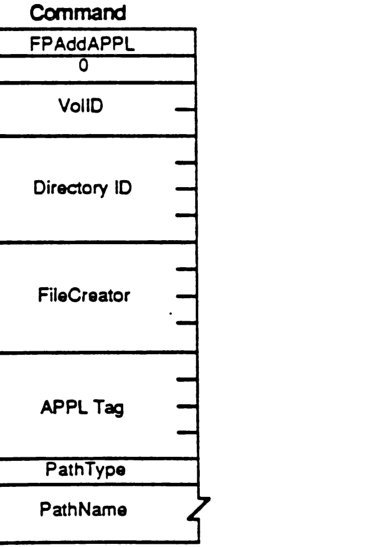

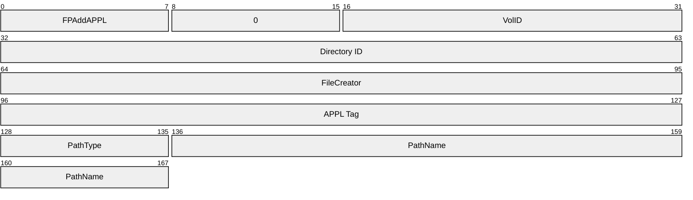

| Field | Bit offset | Width (bits) | Description |
| :--- | :--- | :--- | :--- |
| Command | 0 | 8 | FPAddAPPL (function code) |
| Padding | 8 | 8 | Set to 0 |
| VolID | 16 | 16 | Volume reference number |
| Directory ID | 32 | 32 | Ancestor directory identifier |
| FileCreator | 64 | 32 | Creator type of application being added |
| APPL Tag | 96 | 32 | User-defined tag stored with the APPL entry |
| PathType | 128 | 8 | Flag indicating short (1) or long (2) names |
| PathName | 136 | variable | Pathname to the application being added |


## FPAddComment

This call adds a comment for a file or directory to the Desktop Database.

### INPUTS:

- **SRefNum (INT)**: session refnum
- **DTRefNum (INT)**: Desktop Database refnum
- **Directory ID (LONG)**: directory identifier
- **PathType (BYTE)**: indicates whether pathname is composed of long names or short names:
    - 1 = all pathname elements are short names
    - 2 = all pathname elements are long names
- **PathName (STRING)**: pathname to the file or directory with comment
- **CmtLength (BYTE)**: length of comment data
- **CmtText (BYTES)**: comment data to be associated with file or folder specified (limited to 199 bytes)

### OUTPUTS:

- **FPError (LONG)**

### ERRORS:

- **ParamErr**: unknown session refnum or Desktop Database refnum; bad pathname
- **ObjectNotFound**: input parameters do not point to an existing file or dir
- **AccessDenied**: user does not have the rights listed below

### ALGORITHM:

The comment type and comment data are associated with the specified file or directory and stored in the Desktop Database. If the comment length is greater than 199 bytes, the comment will be truncated to 199 bytes and no error will be returned.

### RIGHTS:

The user must have previously called FPOpenDT for the corresponding volume. In addition, the object must be present in the specified directory before this call is issued, and the user must have Search or Write access rights to all ancestors except the object's Parent, as well as Write access to the Parent.

### PACKET FORMAT:

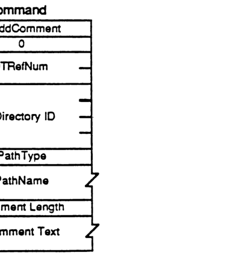

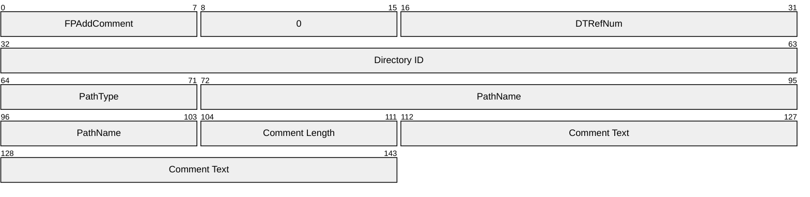

| Field | Bit offset | Width (bits) | Description |
| :--- | :--- | :--- | :--- |
| Command | 0 | 8 | FPAddComment command identifier |
| Pad | 8 | 8 | Reserved, must be 0 |
| DTRefNum | 16 | 16 | Desktop Database refnum |
| Directory ID | 32 | 32 | Directory identifier |
| PathType | 64 | 8 | Pathname type (1=short, 2=long) |
| PathName | 72 | Variable | Pathname to the file or directory |
| Comment Length | Variable | 8 | Length of comment data (up to 199 bytes) |
| Comment Text | Variable | Variable | The actual comment data |


## FPAddIcon

This call is used to add an icon bitmap to the Desktop Database.

### INPUTS:
| | |
|---|---|
| SRefNum (INT) | session refnum |
| DTRefNum (INT) | Desktop Database refnum |
| FileCreator (RESTYPE) | file's creator type |
| FileType (RESTYPE) | file's type |
| IconType (BYTE) | type of icon being added |
| IconTag (LONG) | tag information to be stored with the icon |
| BitmapSize (INT) | size of the bitmap for this icon |

### OUTPUTS:
FPError (LONG)

### ERRORS:
| | |
|---|---|
| ParamErr | unknown session refnum or Desktop Database refnum |
| IconTypeError | new icon size is different from existing icon's size |
| AccessDenied | user does not have the rights listed below |

### ALGORITHM:
A new icon is added to the Desktop database for the specified FileCreator and FileType. If an icon of the same FileCreator, FileType, and IconType already exists the icon is replaced. If the new icon's size is different from the old icon's size an IconTypeError is returned.

### RIGHTS:
The user must have previously called FPOpenDT for the corresponding volume. In addition, the volume indicated by DTRefnum must not be marked ReadOnly.

### NOTES:
The command packet includes all input parameters except for the actual bitmap. The bitmap is sent to the server in a subsequent intermediate exchange of Session Protocol packets.

### PACKET FORMAT:

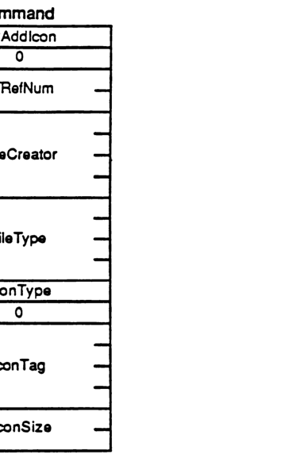

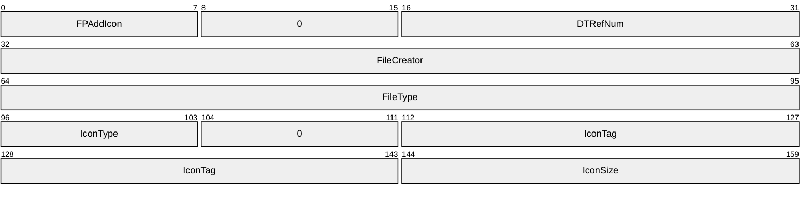

| Field | Bit offset | Width (bits) | Description |
|---|---|---|---|
| FPAddIcon | 0 | 8 | AFP command code |
| (unused) | 8 | 8 | Reserved, must be 0 |
| DTRefNum | 16 | 16 | Desktop Reference Number |
| FileCreator | 32 | 32 | File creator |
| FileType | 64 | 32 | File type |
| IconType | 96 | 8 | Icon type |
| (unused) | 104 | 8 | Reserved, must be 0 |
| IconTag | 112 | 32 | Icon tag |
| IconSize | 144 | 16 | Icon size in bytes |


## FPByteRangeLock

This call is used to lock a range of an open fork to ensure exclusive access. Locks prevent all other users from reading or writing any bytes within the range.

### INPUTS:

| Field | Description |
| :--- | :--- |
| SRefNum (INT) | session refnum |
| OForkRefnum (INT) | open fork refnum |
| Offset (LONG) | offset to the first byte of the range to be locked or unlocked (can be negative if Start/End Flag = End) |
| Length (LONG) | number of bytes to be locked or unlocked (signed—can't be negative) |
| UnlockFlag (BIT) | flag to indicate whether range is to be locked or unlocked:<br>0 = lock<br>1 = unlock |
| Start/EndFlag (BIT) | flag indicating whether the Offset field is relative to the beginning or end of the fork (valid only when locking) - (all other bits must be zero):<br>0 = relative to the beginning of the fork<br>1 = relative to the end of the fork |

### OUTPUTS:

| Field | Description |
| :--- | :--- |
| FPError (LONG) | |
| RangeStart (LONG) | number of the first byte of the range just locked (valid only when returned from a successful lock command) |

### ERRORS:

| Error | Description |
| :--- | :--- |
| ParamErr | unknown session refnum or open fork refnum; combination of Start/End flag and offset specified a range starting before the 0th byte |
| LockErr | some or all of requested range is locked by another user |
| NoMoreLocks | server's maximum lock limit has been reached |
| RangeOverlap | user attempted to lock (some or all of) a range that is already locked by the user |
| RangeNotLocked | tried to unlock a range that was not locked by the user |

### ALGORITHM:

If no other user holds a lock on any part of the requested range, the server will lock exactly the specified range for this user. A user may hold multiple locks on a given open fork, up to a server-specific limit. Multiple locks may not overlap. A lock range may start and/or extend past the end-of-fork; this does not prevent another user from writing to the fork past the locked range. Specifying an Offset of zero and a Length of $FFFFFFFF will lock the entire fork. All locks held by a user are unlocked when the user closes the fork. Unlocking a range makes it available for reading and writing to other users. A RangeNotLocked error is returned if an attempt was made to unlock a range that was not locked by the user.

If multiple writers are concurrently modifying the fork, they may each have a different notion of the end-of-fork, although the server always knows the correct end-of-fork. It is for this reason that the "lock relative to end-of-fork" feature is provided. The number of the first locked byte is returned, since the end-of-fork may have been different from the user's notion at the time at which the call was made.

### RIGHTS:

No special access rights are needed to make this call.

### PACKET FORMAT:

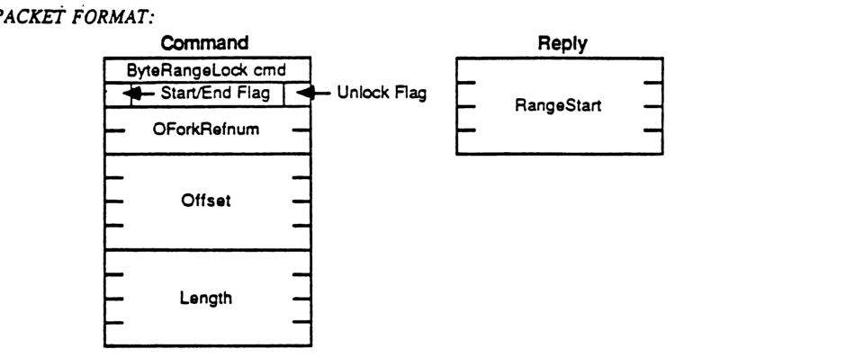

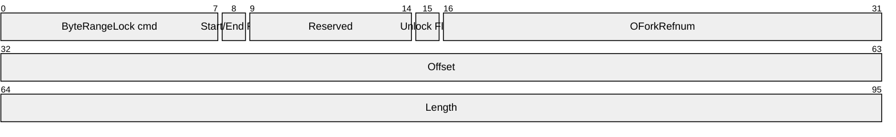

| Field | Bit offset | Width (bits) | Description |
|---|---|---|---|
| ByteRangeLock cmd | 0 | 8 | The command code for ByteRangeLock. |
| Start/End Flag | 8 | 1 | Bit 0 of the flag byte. |
| Reserved | 9 | 6 | Reserved bits in the flag byte. |
| Unlock Flag | 15 | 1 | Bit 7 of the flag byte. |
| OForkRefnum | 16 | 16 | The open fork reference number. |
| Offset | 32 | 32 | The offset in the fork where the range begins. |
| Length | 64 | 32 | The length of the range to be locked or unlocked. |

### Reply

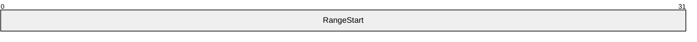

| Field | Bit offset | Width (bits) | Description |
|---|---|---|---|
| RangeStart | 0 | 32 | The actual starting offset of the range that was locked or unlocked. |

## FPCloseDir

This call is used to close a directory.

### INPUTS:
- **SRefNum (INT)**: session refnum
- **VolumeID (INT)**: volume identifier
- **DirID (LONG)**: ancestor directory identifier

### OUTPUTS:
- **FPError (LONG)**

### ERRORS:
- **ParamErr**: unknown session refnum or volume identifier
- **ObjectNotFound**: unknown directory identifier

### ALGORITHM:
The directory identifier is invalidated, and may not be used again.

### RIGHTS:
The user must have previously called FPOpenVol for this volume and FPOpenDir for this directory.

### PACKET FORMAT:

### Command

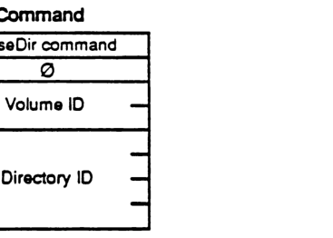

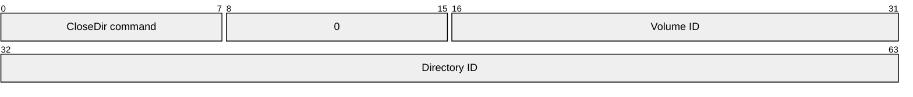

| Field | Bit offset | Width (bits) | Description |
| :--- | :--- | :--- | :--- |
| CloseDir command | 0 | 8 | The command code for FPCloseDir. |
| 0 | 8 | 8 | Reserved byte, must be zero. |
| Volume ID | 16 | 16 | Volume identifier. |
| Directory ID | 32 | 32 | Ancestor directory identifier. |

## FPCloseDT

This call is used to disassociate a user from the volume's Desktop Database.

### INPUTS:
* **SRefNum (INT):** session refnum
* **DTRefNum (INT):** Desktop Database refNum, as returned from FPOpenDT

### OUTPUTS:
* **FPError (LONG)**

### ERRORS:
* **ParamErr:** unknown session refnum or Desktop Database refnum

### RIGHTS:
* The user must have made a successful FPOpenDT call before this call can be made.

### PACKET FORMAT:

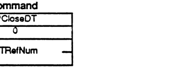

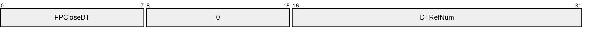

| Field | Bit offset | Width (bits) | Description |
|---|---|---|---|
| FPCloseDT | 0 | 8 | Command code |
| 0 | 8 | 8 | Reserved/padding byte |
| DTRefNum | 16 | 16 | Desktop Database reference number |

# FPCloseFork

This call is used to close a fork which was opened by FPOpenFork.

### INPUTS:

| | |
|---|---|
| SRefNum (INT) | session refnum |
| OForkRefnum (INT) | open fork refnum |

### OUTPUTS:

FPError (LONG)

### ERRORS:

| | |
|---|---|
| ParamErr | unknown session refnum or open fork refnum |

### ALGORITHM:

The server flushes and then closes the open fork, invalidating the OForkRefnum. If the fork had been written to, the file's Mod Date will be set to the server's clock at this time.

### RIGHTS:

No special access rights are needed to make this call.

### PACKET FORMAT:

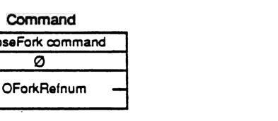


| Field | Bit offset | Width (bits) | Description |
|---|---|---|---|
| CloseFork command | 0 | 8 | The command code for FPCloseFork. |
| 0 | 8 | 8 | Reserved, must be zero. |
| OForkRefnum | 16 | 16 | The open fork reference number. |

# FPCloseVol

This call is used to "unmount" a volume.

| | | |
|---|---|---|
| ### INPUTS: | SRefNum (INT) | session refnum |
| | VolumeID (INT) | volume identifier |
| | | |
| ### OUTPUTS: | FPError (LONG) | |
| | | |
| ### ERRORS: | ParamErr | unknown session refnum or volume identifier |
| | | |
| ### ALGORITHM: | The Volume ID is invalidated. No further calls may be made to access objects on this volume unless another FPOpenVol call is made. | |
| | | |
| ### RIGHTS: | The user must have previously called FPOpenVol for this volume. | |

### PACKET FORMAT:

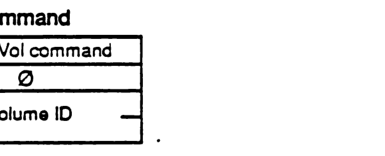

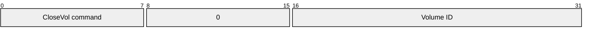

| Field | Bit offset | Width (bits) | Description |
|---|---|---|---|
| CloseVol command | 0 | 8 | The command code for FPCloseVol. |
| 0 | 8 | 8 | Reserved, must be 0. |
| Volume ID | 16 | 16 | The identifier of the volume to be closed. |

## FPCopyFile 

> (optional; may not be supported by all servers)

This call is used to copy a file residing on one of the server's volumes to another location on one of the server's volumes. The destination of the copy is specified by providing a VolID, DirID, and Pathname that indicate the copy's new Parent Directory.

### INPUTS:

| Parameter | Type | Description |
| :--- | :--- | :--- |
| SRefNum | (INT) | session refnum |
| SVolumeID | (INT) | source volume identifier |
| SDirID | (LONG) | source ancestor directory identifier |
| SPathType | (BYTE) | indicates whether SPathname is composed of long names or short names:<br>1 = all pathname elements are short names<br>2 = all pathname elements are long names |
| SPathname | (STR) | pathname of the file to be copied (cannot be null) |
| DVolumeID | (INT) | destination volume identifier |
| DDirID | (LONG) | destination ancestor directory identifier |
| DPathType | (BYTE) | indicates whether DPathname is composed of long names or short names (same values as SPathType) |
| DPathname | (STR) | pathname to the destination Parent Directory (may be null) |
| NewType | (BYTE) | indicates whether NewName is a long name or a short name (same values as SPathType) |
| NewName | (STR) | name to be given to the copy (may be null) |

### OUTPUTS:

| Parameter | Type | Description |
| :--- | :--- | :--- |
| FPError | (LONG) | |

### ERRORS:

| Error | Description |
| :--- | :--- |
| ParamErr | unknown session refnum, volume identifier or pathname type; bad pathname or NewName |
| ObjectNotFound | the source file does not exist; unknown ancestor directory |
| ObjectExists | an object by the name NewName already exists in the destination Parent Directory |
| AccessDenied | user does not have the right to read the file or write to the destination |
| CallNotSupported | call not supported by this server |
| DenyConflict | the file cannot be opened for Read, Deny Write |
| DiskFull | no more space on the volume |
| ObjectTypeErr | source parameters point to a directory |

### ALGORITHM:

The server will attempt to open the source file for Read, Deny Write. If that fails, a Deny Conflict error will be returned. Otherwise, the file will be copied from source to destination. The original file is not changed or deleted.

The copy is given the name specified in NewName. If NewName is null, the server will attempt to give the copy the same name as the original. The creation of Long and Short names is performed as described in Appendix B. A unique FileNumber is assigned to the file. Its Parent Directory ID will be set to the Dir ID of the destination Parent Directory. All other file parameters remain the same as the source file's parameters. The Mod Date of the destination Parent Directory is set to the server's clock.

### RIGHTS:

The user must have previously called FPOpenVol for both source and destination volumes. In addition, the user must have Search access rights to all ancestors except the source file's Parent Directory, and Read access right to the source file's Parent directory. Further, the user must have Search access rights to all ancestors except the destination Parent Directory, and Write access right to the destination Parent Directory.

### PACKET FORMAT:

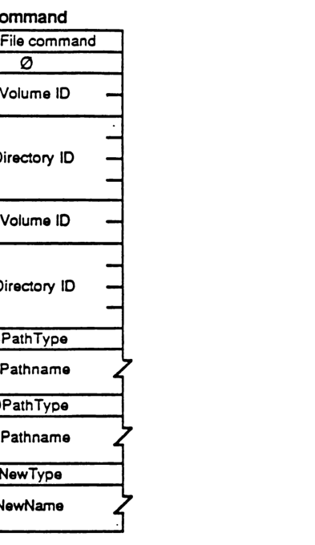

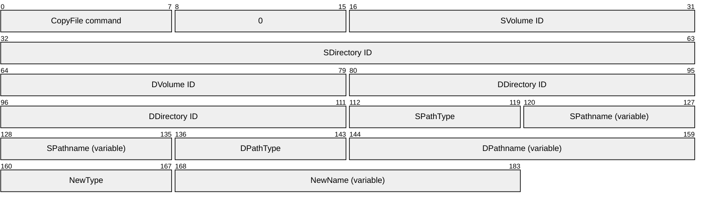

| Field | Bit offset | Width (bits) | Description |
| :--- | :--- | :--- | :--- |
| CopyFile command | 0 | 8 | AFP command code for CopyFile. |
| 0 | 8 | 8 | Unused padding byte. |
| SVolume ID | 16 | 16 | Source Volume ID. |
| SDirectory ID | 32 | 32 | Source Directory ID. |
| DVolume ID | 64 | 16 | Destination Volume ID. |
| DDirectory ID | 80 | 32 | Destination Directory ID. |
| SPathType | 112 | 8 | Type of source pathname. |
| SPathname | 120 | variable | The source pathname string. |
| DPathType | variable | 8 | Type of destination pathname. |
| DPathname | variable | variable | The destination pathname string. |
| NewType | variable | 8 | Type of the new name pathname. |
| NewName | variable | variable | The new name string. |

## FPCreateDir

This call is used to create a new directory.

### INPUTS:

| Field | Type | Description |
|---|---|---|
| SRefNum | (INT) | session refnum |
| VolumeID | (INT) | volume identifier |
| DirID | (LONG) | ancestor directory identifier |
| PathType | (BYTE) | indicates whether Pathname is composed of long names or short names:<br>1 = all pathname elements are short names<br>2 = all pathname elements are long names |
| Pathname | (STR) | pathname to desired directory (cannot be null) |

### OUTPUTS:

| Field | Type | Description |
|---|---|---|
| FPError | (LONG) | |
| NewDirID | (LONG) | identifier of new directory |

### ERRORS:

| Error | Description |
|---|---|
| ParamErr | unknown session refnum, volume identifier, or pathname type; null or bad pathname |
| ObjectNotFound | unknown ancestor directory |
| ObjectExists | an object already exists by that name |
| AccessDenied | user does not have the rights listed below |
| FlatVol | the volume is flat and does not support directories |
| DiskFull | no more space on the volume |

### ALGORITHM:

If the volume is not flat, a new empty directory is created with the name as specified in Pathname. A unique NewDirID is assigned to the directory. Its OwnerID is set to the UserID of the user making the call, and its GroupID is set to the ID of the user's Primary Group. Access rights are initially set to Read, Write, and Search for the Owner, no rights for the Group or World. Finder Info is zeroed. Create Date and Mod Date are set to the server's clock. Backup Date is set to $80000000, signifying that this directory has never been backed up. The creation of Long and Short names is performed as described in Appendix B. All attributes are initially cleared. The Mod Date of the Parent Directory is set to the server's clock.

### RIGHTS:

The user must have previously called FPOpenVol for this volume. In addition, the user must have Search or Write access rights to all ancestors except this directory's Parent Directory, as well as Write access right to the Parent Directory.

### PACKET FORMAT:

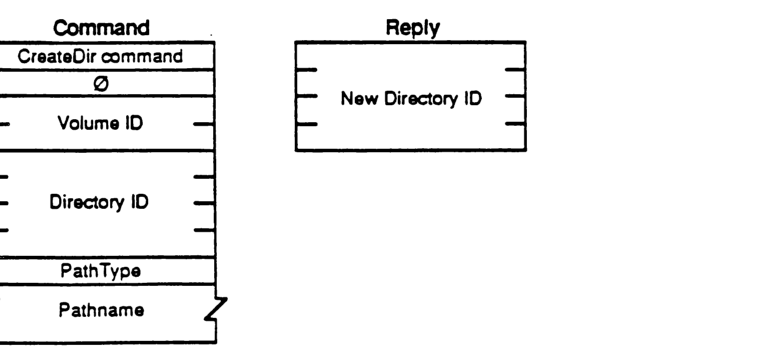

#### Command

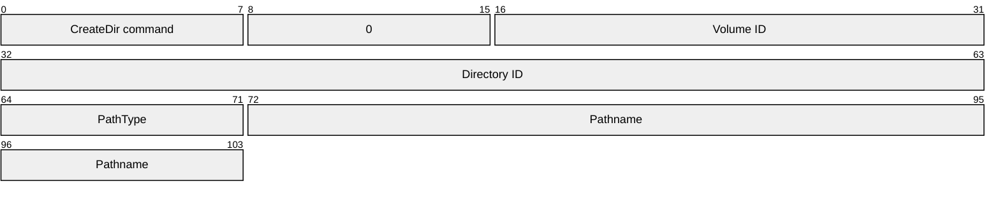

| Field | Bit offset | Width (bits) | Description |
|---|---|---|---|
| CreateDir command | 0 | 8 | Command code |
| 0 | 8 | 8 | Unused padding |
| Volume ID | 16 | 16 | Volume identifier |
| Directory ID | 32 | 32 | Ancestor directory identifier |
| PathType | 64 | 8 | 1 = all pathname elements are short names, 2 = all pathname elements are long names |
| Pathname | 72 | Variable | Pascal string of the directory path |

#### Reply

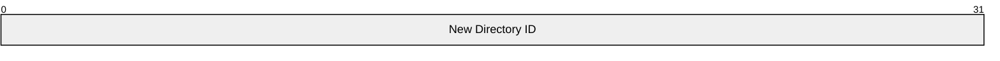

| Field | Bit offset | Width (bits) | Description |
|---|---|---|---|
| New Directory ID | 0 | 32 | Identifier of the newly created directory |

---

## FPCreateFile

This call is used to create a file.

### INPUTS:

| Field | Description |
| :--- | :--- |
| SRefNum (INT) | session refnum |
| VolumeID (INT) | volume identifier |
| DirID (LONG) | ancestor directory identifier |
| CreateFlag (BIT) | a flag that specifies hard or soft create (all other bits will be zero):<br>0 = soft create<br>1 = hard create |
| PathType (BYTE) | indicates whether Pathname is composed of long names or short names:<br>1 = all pathname elements are short names<br>2 = all pathname elements are long names |
| Pathname (STR) | pathname including name of new file (cannot be null) |

### OUTPUTS:

| Field | Description |
| :--- | :--- |
| FPError (LONG) | |

### ERRORS:

| Error | Description |
| :--- | :--- |
| ParamErr | unknown session refnum, volume identifier, or pathname type; null or bad pathname |
| ObjectNotFound | unknown ancestor directory |
| ObjectExists | soft create: a file by that name already exists |
| ObjectTypeErr | a directory by that name already exists |
| AccessDenied | user does not have the rights listed below |
| FileBusy | hard create: the file already exists and is open |
| DiskFull | no more space on the volume |

### ALGORITHM:

In a soft create, if the object does not already exist, a new file is created with the name as specified in Pathname. A unique FileNumber is assigned to the file. Finder Info is zeroed. Create Date and Mod Date are set to the server's clock. Backup Date is set to $80000000, signifying that this file has never been backed up. The creation of Long and Short names is performed as described in Appendix B. The lengths of both forks are set to zero. The Mod Date of the file's Parent Directory is set to the server's clock. All file attributes are initially cleared. The Mod Date of the Parent Directory is set to the server's clock.

In a hard create, if the file already exists, it is essentially deleted and then recreated. All file parameters (including the Create Date) are reinitialized as described above.

### RIGHTS:

The user must have previously called FPOpenVol for this volume. For a soft create, the user must have Search or Write access rights to all ancestors except this file's Parent Directory, as well as Write access right to the Parent Directory. For a hard create, the user must have Search access to all ancestors except the Parent, as well as Read and Write access to the Parent.

### PACKET FORMAT:

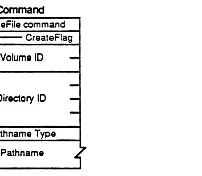

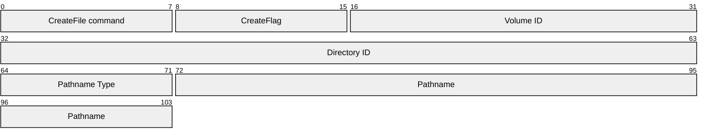

| Field | Bit offset | Width (bits) | Description |
|---|---|---|---|
| CreateFile command | 0 | 8 | The command code for FPCreateFile. |
| CreateFlag | 8 | 8 | Flag indicating creation options. |
| Volume ID | 16 | 16 | The identifier for the volume. |
| Directory ID | 32 | 32 | The identifier for the directory. |
| Pathname Type | 64 | 8 | Specifies the format of the following pathname. |
| Pathname | 72 | variable | The pathname of the file to be created. |

---

## FPDelete

This call is used to delete either a directory or file.

### INPUTS:

| Field | Description |
| :--- | :--- |
| SRefNum (INT) | session refnum |
| VolumeID (INT) | volume identifier |
| DirID (LONG) | ancestor directory identifier |
| PathType (BYTE) | indicates whether Pathname is composed of long names or short names:<br>1 = all pathname elements are short names<br>2 = all pathname elements are long names |
| Pathname (STR) | pathname of file or directory to be deleted (may be null if a directory is to be deleted) |

### OUTPUTS:

| Field | Description |
| :--- | :--- |
| FPError (LONG) | |

### ERRORS:

| Error | Description |
| :--- | :--- |
| ParamErr | unknown session refnum, volume identifier, or pathname type; bad pathname |
| ObjectNotFound | input parameters do not point to an existing file or directory |
| DirNotEmpty | the directory is not empty |
| FileBusy | the file is open |
| AccessDenied | user does not have the rights listed below |

### ALGORITHM:

If the object to be deleted is a directory, the server checks to see if it contains any offspring; a DirNotEmpty error is returned if so. If a file is to be deleted, it must not be currently open by any user (else a FileBusy error is returned). The Mod Date of the object's Parent Directory is set to the server's clock.

### RIGHTS:

The user must have previously called FPOpenVol for the volume. In addition, the user must have Search access rights to all ancestors except the object's Parent Directory, as well as Write access right to the Parent Directory. If a directory is being deleted, the user must also have Search access to the Parent; for a file, the user must also have Read access to the Parent Directory.

### PACKET FORMAT:

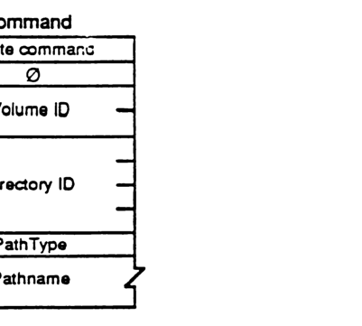

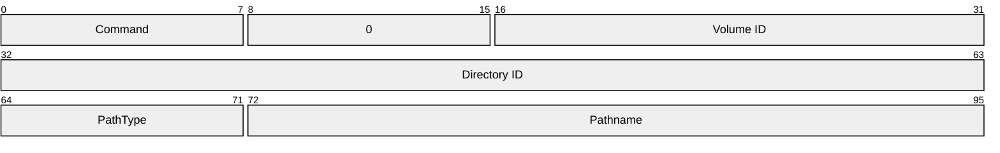

| Field | Bit offset | Width (bits) | Description |
| :--- | :--- | :--- | :--- |
| Command | 0 | 8 | FPDelete command code |
| (unused) | 8 | 8 | Reserved, set to 0 |
| Volume ID | 16 | 16 | Volume identifier |
| Directory ID | 32 | 32 | Ancestor directory identifier |
| PathType | 64 | 8 | Pathname type (1=short, 2=long) |
| Pathname | 72 | Variable | Pathname of file or directory |

---

## FPEnumerate

This call is used to enumerate the contents of a directory. The reply is composed of a number of file and/or directory parameter structures.

### INPUTS:

- **SRefNum (INT)**: session refnum
- **VolumeID (INT)**: volume identifier
- **DirID (LONG)**: ancestor directory identifier
- **FileBitmap (INT)**: bitmap describing which parameters are to be returned if the enumerated object is a file (the corresponding bit should be set). This field is the same as that in the FPGetFileDirParms call, and may be null.
- **DirBitmap (INT)**: bitmap describing which parameters are to be returned if the enumerated object is a directory (the corresponding bit should be set). This field is the same as that in the FPGetFileDirParms call, and may be null.
- **ReqCount (INT)**: maximum number of structures to be returned
- **StartIndex (INT)**: directory offspring index, described below
- **MaxReplySize (INT)**: maximum size of reply buffer
- **PathType (BYTE)**: indicates whether Pathname is composed of long names or short names:
    - 1 = all pathname elements are short names
    - 2 = all pathname elements are long names
- **Pathname (STR)**: pathname to desired directory

### OUTPUTS:

- **FPError (LONG)**
- **FileBitmap (INT)**: copy of input parameter
- **DirBitmap (INT)**: copy of input parameter
- **ActCount (INT)**: actual number of structures returned (zero if error)
- **ActCount** number of file/directory structures of the form:
    - **StructLength (BYTE)**: unsigned length of this structure, including these two 'header' bytes, and rounded up to the nearest even number
    - **File/DirFlag (BIT)**: flag indicates whether structure describes a file or directory: 0 = file; 1 = directory. All other bits must be zero.
    - **File or Directory Parameters**: packed in Bitmap order, with a trailing null BYTE if necessary to make the length of the entire structure even

### ERRORS:

- **ParamErr**: unknown session refnum, volume identifier, directory identifier, or pathname type; bad pathname; MaxReplySize is too small to hold even a single entry
- **DirNotFound**: input parameters do not point to an existing directory
- **BitmapErr**: an attempt was made to retrieve a parameter which cannot be retrieved with this call; both bitmaps are empty
- **AccessDenied**: user does not have the rights listed below
- **ObjectNotFound**: no more offspring to enumerate
- **ObjectTypeErr**: input parameters pointed to a file

### ALGORITHM:

The server does an enumeration of the directory as specified with the input parameters: if the FileBitmap is empty, only directory offspring will be enumerated, and the StartIndex may range from 1 to the total number of directory offspring. Likewise, if the DirBitmap is empty, only file offspring will be enumerated, and the StartIndex may range from 1 to the total number of file offspring. If both Bitmaps are non-empty, the StartIndex may range from 1 to the total number of offspring, and structures for both files and directories will be returned. These structures are not returned in any particular order.

This call will complete when ReqCount structures have been inserted into the Reply packet (no partial structures will be returned), or when the Reply packet is full, or when there are no more offspring to enumerate.

The server retrieves the specified parameters for each enumerated offspring and packs them, in Bitmap order, in structures in the reply packet along with copies of the input Bitmaps inserted before the structures. In order to keep all variable-length parameters at the end of each structure (even if more parameters are later added), all such parameters like the Long Name and Short Name fields will be represented in the Bitmap order as fixed-length offsets (INTs) from the start of the parameters in each structure (not the start of the bitmap and not the start of the 'header' bytes) to the start of the variable-length fields. Each structure may be null-padded to make its length even.

A BitmapErr will be returned if an attempt is made to retrieve the DirectoryID parameter for a directory on a Variable-DirID volume.

If NoErr is returned, then all the structures returned in the Reply packet will be valid. If any error occurs, there will be no valid structures in the Reply packet.

### RIGHTS: 
The user must have previously called FPOpenVol for this volume. In addition, the user must have Search access rights to all ancestors except this directory; Search access right to this directory is needed to be able to enumerate directory offspring. Read access right is needed to this Directory in order to be able to enumerate file offspring.

### NOTES:
Since enumerating a large directory may take several calls, it is possible (since other users may be adding to or deleting from the directory) for the enumeration to miss offspring or return duplicate offspring. To be safe, keep enumerating until an ObjectNotFound error is returned, and filter out duplicate entries.

A given offspring is not guaranteed to occupy the same index number in the Parent Directory from one enumeration to the next.

### PACKET FORMAT:

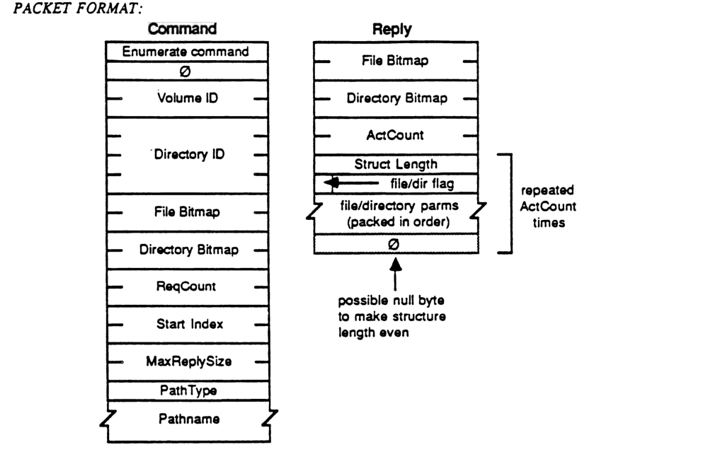

#### Command Packet Format

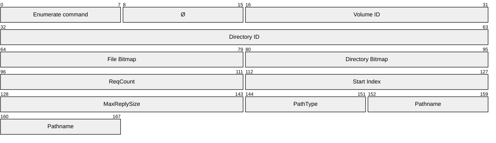

| Field | Bit offset | Width (bits) | Description |
|---|---|---|---|
| Enumerate command | 0 | 8 | The command code for the Enumerate function. |
| Ø | 8 | 8 | Reserved byte, set to zero. |
| Volume ID | 16 | 16 | The volume identifier. |
| Directory ID | 32 | 32 | The directory identifier. |
| File Bitmap | 64 | 16 | Bitmap specifying the file parameters requested. |
| Directory Bitmap | 80 | 16 | Bitmap specifying the directory parameters requested. |
| ReqCount | 96 | 16 | Maximum number of items (files or directories) to return. |
| Start Index | 112 | 16 | The index of the first item to return. |
| MaxReplySize | 128 | 16 | Maximum size allowed for the reply packet. |
| PathType | 144 | 8 | The type of pathname provided. |
| Pathname | 152 | variable | The pathname of the directory to enumerate. |

#### Reply Packet Format

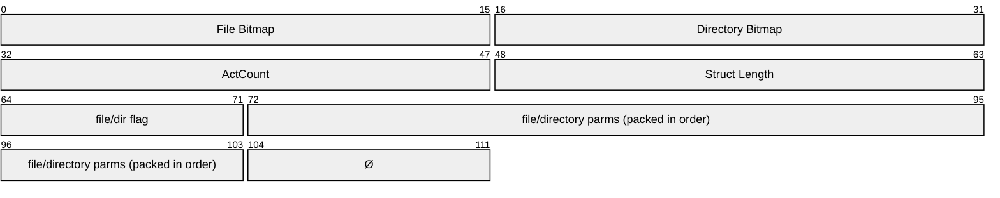

| Field | Bit offset | Width (bits) | Description |
|---|---|---|---|
| File Bitmap | 0 | 16 | Bitmap for returned file parameters. |
| Directory Bitmap | 16 | 16 | Bitmap for returned directory parameters. |
| ActCount | 32 | 16 | Actual number of items returned in the reply. |
| Struct Length | 48 | 16 | Total length of the following item structure. |
| file/dir flag | 64 | 8 | Flag indicating whether the entry is a file or a directory. |
| file/directory parms (packed in order) | 72 | variable | Parameter data for the entry, packed in the order specified by the bitmap. |
| Ø | variable | 8 | Possible null byte to ensure the structure length is even. |

*Note: The fields from **Struct Length** to the **Ø** (null byte) are repeated **ActCount** times.*


## FPFlush

This call is used to flush to disk any data relating to the specified volume that has been modified by the user.

### INPUTS:
SRefNum (INT) session refnum
VolumeID (INT) volume identifier

### OUTPUTS:
FPError (LONG)

### ERRORS:
ParamErr unknown session refnum or volume identifier

### ALGORITHM:
The server attempts to flush to disk as much changed information as possible. This includes (a) flushing all forks opened by the user, (b) flushing catalog information changed by the user, and (c) flushing any updated volume-level information. Since it may be difficult or impossible for all servers to guarantee that this can all be done, the above list is meant as a suggestion. Users should not rely on any or all of the above actions to actually be done.

The volume's Mod Date may change as a result of this call, but users should not rely on it since updating of the date is implementation-dependent. If no volume information was changed since the last FPFlush call, the date may or may not change.

### RIGHTS:
The user must have previously called FPOpenVol for this volume.

### PACKET FORMAT:

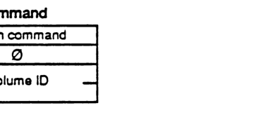

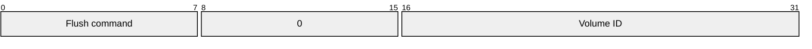

| Field | Bit offset | Width (bits) | Description |
| :--- | :--- | :--- | :--- |
| Flush command | 0 | 8 | The command code for FPFlush |
| 0 | 8 | 8 | Reserved (zero) |
| Volume ID | 16 | 16 | Volume identifier |

---

## FPFlushFork

Any FPWrites made to a particular file fork may be buffered by the server in order to optimize disk accesses. Within the constraints of performance, the server will try to flush (commit to disk) each file as soon as possible, yet clients can force the server to write to the disk any data buffered from previous FPWrites by issuing this call.

### INPUTS:
- **SRefNum (INT)**: session refnum
- **OForkRefnum (INT)**: open fork refnum

### OUTPUTS:
- **FPError (LONG)**

### ERRORS:
- **ParamErr**: unknown session refnum or open fork refnum

### ALGORITHM:
The server will commit to disk all cached writes to the fork, and set the file's Mod Date to the server's clock if the fork was written to.

### RIGHTS:
No special access rights are needed to make this call.

### PACKET FORMAT:

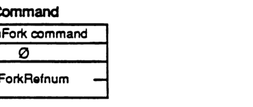

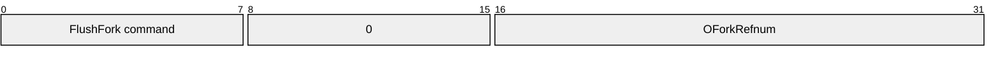

| Field | Bit offset | Width (bits) | Description |
|---|---|---|---|
| FlushFork command | 0 | 8 | The command code for FPFlushFork. |
| 0 | 8 | 8 | Reserved/unused byte, set to 0. |
| OForkRefnum | 16 | 16 | The open fork reference number. |

### FPGetAPPL

This call is used to retrieve information about a particular application from the Desktop Database.

### INPUTS:

* **SRefNum (INT)**: session refnum
* **DTRefnum (INT)**: Desktop Database refnum
* **FileCreator (RESTYPE)**: creator type of the application to be returned
* **APPL Index (INT)**: index of the APPL entry to be retrieved
* **Bitmap (INT)**: bitmap indicating the parameters of the application file to be returned. This field is the same as the FileBitmap in the FPGetFileDirParms call.

### OUTPUTS:

* **FPError (LONG)**
* **APPLTag (LONG)**: tag information associated with the APPL entry

### ERRORS:

* **ParamErr**: unknown session refnum or Desktop Database refnum
* **ObjectNotFound**: no files in the Desktop Database match input parameters
* **AccessDenied**: user does not have the rights listed below

### ALGORITHM:

The entries under the specified FileCreator are examined, and the n<sup>th</sup> entry, as indicated by the APPL index, is returned. Entries for applications which are not accessible by the user are <u>not</u> returned.

### RIGHTS:

The user must have previously called FPOpenDT for the corresponding volume, and must have Search access to all ancestors except the Parent and Read access to the Parent of the application whose information will be returned.

### PACKET FORMAT:

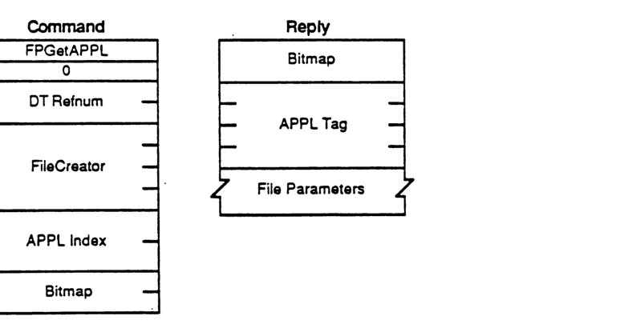

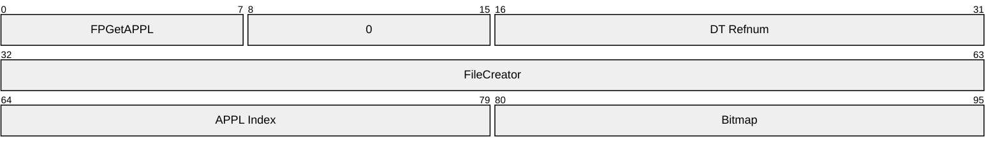

| Field | Bit offset | Width (bits) | Description |
|---|---|---|---|
| FPGetAPPL | 0 | 8 | Command code |
| 0 | 8 | 8 | Unused pad byte |
| DT Refnum | 16 | 16 | Desktop Database reference number |
| FileCreator | 32 | 32 | Creator type of the application |
| APPL Index | 64 | 16 | Index of the APPL entry to be retrieved |
| Bitmap | 80 | 16 | Indicates parameters of the application file to be returned |

#### Reply

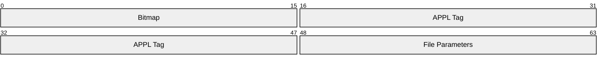

| Field | Bit offset | Width (bits) | Description |
|---|---|---|---|
| Bitmap | 0 | 16 | Indicates which parameters were returned |
| APPL Tag | 16 | 32 | Tag information associated with the APPL entry |
| File Parameters | 48 | Variable | Requested application file information |

---

## FPGetComment

This call is used to retrieve a comment associated with a specified file or directory from the Desktop Database.

### INPUTS:

| Field | Description |
|---|---|
| SRefNum (INT) | session refnum |
| DTRefnum (INT) | Desktop Database Refnum |
| DirID (LONG) | directory identifier |
| PathType (BYTE) | indicates whether Pathname is composed of long names or short names:<br>1 = all pathname elements are short names<br>2 = all pathname elements are long names |
| Pathname (STR) | pathname to desired object |

### OUTPUTS:

| Field | Description |
|---|---|
| FPError (LONG) | |
| CmtLength (BYTE) | length of the comment data |
| CmtText (BYTES) | comment text |

### ERRORS:

| Error | Description |
|---|---|
| ParamErr | unknown session refnum or Desktop Database refnum |
| ObjectNotFound | input parameters do not point to an existing file or dir |
| AccessDenied | user does not have the rights listed below |
| ItemNotFound | no comment was found in the Desktop Database |

### ALGORITHM:

The comment for the specified file is located in the Desktop Database and returned to the caller.

### RIGHTS:

The user must previously have called FPOpenDT for the corresponding volume. In addition, the file or directory must be present before this call is issued. If the comment is associated with a directory, the user must have Search access to all ancestors including the Parent Directory. If the comment is associated with a file, the user must have Search access to all ancestors except the Parent Directory, and Read access to the Parent Directory.

### PACKET FORMAT:

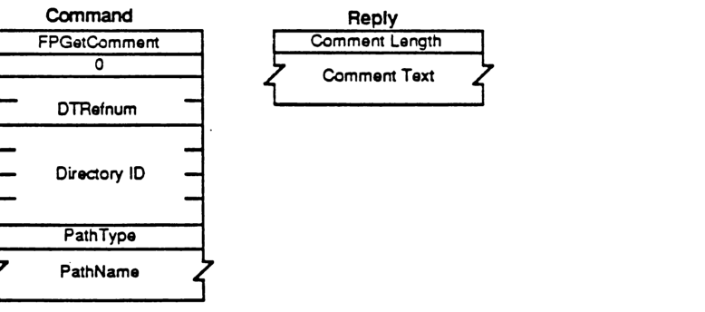

#### Command

```mermaid
packet-beta
0-7: "FPGetComment"
8-15: "0"
16-31: "DTRefnum"
32-63: "Directory ID"
64-71: "PathType"
72-103: "PathName"
```

| Field | Bit offset | Width (bits) | Description |
|---|---|---|---|
| FPGetComment | 0 | 8 | Command code |
| 0 | 8 | 8 | Reserved padding |
| DTRefnum | 16 | 16 | Desktop Database Refnum |
| Directory ID | 32 | 32 | Directory identifier |
| PathType | 64 | 8 | Pathname type: 1 = short names, 2 = long names |
| PathName | 72 | Variable | Pathname to desired object |

#### Reply

```mermaid
packet-beta
0-7: "Comment Length"
8-39: "Comment Text"
```

| Field | Bit offset | Width (bits) | Description |
|---|---|---|---|
| Comment Length | 0 | 8 | Length of the comment data |
| Comment Text | 8 | Variable | Comment text |

---

## FPGetFileDirParms

This call is used to retrieve parameters for an object that may be a file or a directory.

### INPUTS:

*   **SRefNum (INT)**: session refnum
*   **VolumeID (INT)**: volume identifier
*   **DirID (LONG)**: ancestor directory identifier
*   **FileBitmap (INT)**: bitmap describing which parameters are to be returned if the object is a file (the corresponding bit should be set):
    *   **0 (LSB) Attributes (INT)**, consisting of the following flags:
        *   0: Invisible
        *   1: Multi-User
        *   3: DAlreadyOpen
        *   4: RAlreadyOpen
        *   5: ReadOnly
        *   15: Set/Clear (used in FPSetFileDirParms)
    *   **1**: Parent Directory ID (LONG)
    *   **2**: Create Date (LONG)
    *   **3**: Mod Date (LONG)
    *   **4**: Backup Date (LONG)
    *   **5**: Finder Info (32 BYTES)
    *   **6**: Long Name (INT)
    *   **7**: Short Name (INT)
    *   **8**: File Number (LONG)
    *   **9**: Data Fork Length (LONG)
    *   **10**: Resource Fork Length (LONG)
*   **DirBitmap (INT)**: bitmap describing which parameters are to be returned if the object is a directory (the corresponding bit should be set):
    *   **0 (LSB) Attributes (INT)**, consisting of the following flag:
        *   0: Invisible
    *   **1**: Parent Directory ID (LONG)
    *   **2**: Create Date (LONG)
    *   **3**: Mod Date (LONG)
    *   **4**: Backup Date (LONG)
    *   **5**: Finder Info (32 BYTES)
    *   **6**: Long Name (INT)
    *   **7**: Short Name (INT)
    *   **8**: Directory ID (LONG)
    *   **9**: Number of Offspring (INT)
    *   **10**: Owner ID (LONG)
    *   **11**: Group ID (LONG)
    *   **12**: Access Rights (LONG), composed of the access privileges for Owner, Group, and World, and a User Rights Summary BYTE
*   **PathType (BYTE)**: indicates whether Pathname is composed of long names or short names:
    *   1 = all pathname elements are short names
    *   2 = all pathname elements are long names
*   **Pathname (STR)**: pathname to desired object

### OUTPUTS:

*   **FPError (LONG)**
*   **FileBitmap (INT)**: copy of input parameter
*   **DirBitmap (INT)**: copy of input parameter
*   **ObjectFlag (BIT)**: one-bit flag that indicates whether object is a file or a directory: 0 = file; 1 = directory. All other bits should be zero.

### Parameters:

### ERRORS:

| | |
| :--- | :--- |
| ParamErr | unknown session refnum, volume identifier, or pathname type; bad pathname |
| ObjectNotFound | input parameters do not point to an existing file or dir |
| BitmapErr | an attempt was made to retrieve a parameter which cannot be obtained with this call |
| AccessDenied | user does not have the rights listed below |

### ALGORITHM: 
The server retrieves the specified parameters for the object and packs them, in the order specified by the appropriate Bitmap, in the reply packet along with a flag indicating the type of object and a copy of the Bitmaps inserted before the parameters. In order to keep all variable-length parameters at the end of the packet (even if more parameters are later added), all such parameters like the Long Name and Short Name fields will be represented in the Bitmap order as fixed-length offsets (INTs) from the start of the parameters (not the start of the bitmap) to the variable-length fields. The actual variable-length fields are then packed after all fixed-length fields.

If the object exists but both bitmaps are null, no error will be returned. The File Bitmap, Dir Bitmap, and File/Dir Flag will be returned with no other parameters.

If the Access Rights for a directory are requested, the server will return a LONG containing the Read, Write, and Search access privileges corresponding to Owner, Group, and World. In addition, the upper byte of the Access Rights LONG is the User Rights Summary byte, indicating what privileges the user has to this directory, and whether or not the user is the owner of the directory. This Owner Bit is also set if the directory is owned by <any user>.

### RIGHTS: 
The user must have previously called FPOpenVol for this volume. In addition, the user must have Search access rights to all ancestors except this object's Parent Directory. If the object is a directory, the user also needs Search access to the Parent Directory; else if the object is a file, the user needs Read access to the Parent Directory.

### NOTES:
Most Attributes are actually stored in corresponding flags within the FinderInfo field.

### PACKET FORMAT:

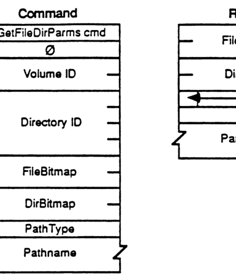

```mermaid
packet-beta
0-7: "GetFileDirParms cmd"
8-15: "0"
16-31: "Volume ID"
32-63: "Directory ID"
64-79: "FileBitmap"
80-95: "DirBitmap"
96-103: "PathType"
104-127: "Pathname"
```

| Field | Bit offset | Width (bits) | Description |
|---|---|---|---|
| GetFileDirParms cmd | 0 | 8 | Command code for GetFileDirParms |
| 0 | 8 | 8 | Reserved |
| Volume ID | 16 | 16 | Volume identifier |
| Directory ID | 32 | 32 | Directory identifier |
| FileBitmap | 64 | 16 | Bitmap specifying requested file parameters |
| DirBitmap | 80 | 16 | Bitmap specifying requested directory parameters |
| PathType | 96 | 8 | Type of the following pathname |
| Pathname | 104 | Variable | The pathname string |

#### Reply
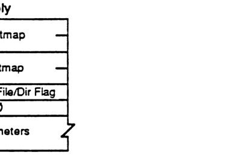

```mermaid
packet-beta
0-15: "FileBitmap"
16-31: "DirBitmap"
32-39: "File/Dir Flag"
40-47: "0"
48-79: "Parameters"
```

| Field | Bit offset | Width (bits) | Description |
|---|---|---|---|
| FileBitmap | 0 | 16 | Bitmap of returned file parameters |
| DirBitmap | 16 | 16 | Bitmap of returned directory parameters |
| File/Dir Flag | 32 | 8 | Flag indicating if the result is a file or directory |
| 0 | 40 | 8 | Reserved |
| Parameters | 48 | Variable | The requested parameters |

#### FileBitmap
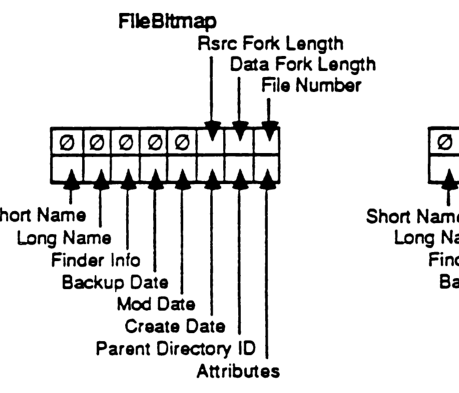

```mermaid
packet-beta
0: "Attributes"
1: "Parent Directory ID"
2: "Create Date"
3: "Mod Date"
4: "Backup Date"
5: "Finder Info"
6: "Long Name"
7: "Short Name"
8: "File Number"
9: "Data Fork Length"
10: "Rsrc Fork Length"
11-15: "0"
```

| Field | Bit offset | Width (bits) | Description |
|---|---|---|---|
| Attributes | 0 | 1 | File attributes |
| Parent Directory ID | 1 | 1 | Parent directory identifier |
| Create Date | 2 | 1 | Creation date |
| Mod Date | 3 | 1 | Modification date |
| Backup Date | 4 | 1 | Backup date |
| Finder Info | 5 | 1 | Finder information (FInfo and FXInfo) |
| Long Name | 6 | 1 | Long name of the file |
| Short Name | 7 | 1 | Short name (8.3 compatible) |
| File Number | 8 | 1 | Unique file number identifier |
| Data Fork Length | 9 | 1 | Length of the data fork |
| Rsrc Fork Length | 10 | 1 | Length of the resource fork |
| 0 | 11 | 5 | Reserved (zeros) |

#### DirBitmap
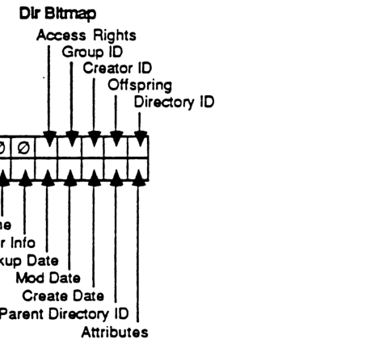

```mermaid
packet-beta
0: "Attributes"
1: "Parent Directory ID"
2: "Create Date"
3: "Mod Date"
4: "Backup Date"
5: "Finder Info"
6: "Long Name"
7: "Short Name"
8: "Directory ID"
9: "Offspring"
10: "Creator ID"
11: "Access Rights"
12-15: "0"
```

| Field | Bit offset | Width (bits) | Description |
|---|---|---|---|
| Attributes | 0 | 1 | Directory attributes |
| Parent Directory ID | 1 | 1 | Parent directory identifier |
| Create Date | 2 | 1 | Directory creation date |
| Mod Date | 3 | 1 | Directory modification date |
| Backup Date | 4 | 1 | Directory backup date |
| Finder Info | 5 | 1 | Finder information (DInfo and DXInfo) |
| Long Name | 6 | 1 | Long name of the directory |
| Short Name | 7 | 1 | Short name |
| Directory ID | 8 | 1 | Unique directory identifier |
| Offspring | 9 | 1 | Number of files and subdirectories |
| Creator ID | 10 | 1 | Identifier of the directory creator |
| Access Rights | 11 | 1 | Directory access rights |
| 0 | 12 | 4 | Reserved (zeros) |

#### File Attributes
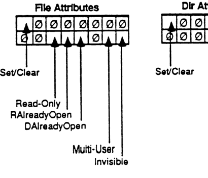

```mermaid
packet-beta
0: "Invisible"
1-4: "0"
5: "Multi-User"
6-9: "0"
10: "DAlreadyOpen"
11: "RAlreadyOpen"
12: "Read-Only"
13-14: "0"
15: "Set/Clear"
```

| Field | Bit offset | Width (bits) | Description |
|---|---|---|---|
| Invisible | 0 | 1 | File is invisible |
| 0 | 1 | 4 | Reserved |
| Multi-User | 5 | 1 | File is multi-user |
| 0 | 6 | 4 | Reserved |
| DAlreadyOpen | 10 | 1 | Data fork is already open |
| RAlreadyOpen | 11 | 1 | Resource fork is already open |
| Read-Only | 12 | 1 | File is read-only |
| 0 | 13 | 2 | Reserved |
| Set/Clear | 15 | 1 | Set/Clear flag for attribute modification |

#### Dir Attributes
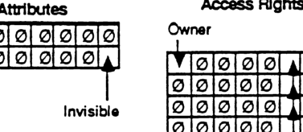

```mermaid
packet-beta
0: "Invisible"
1-14: "0"
15: "Set/Clear"
```

| Field | Bit offset | Width (bits) | Description |
|---|---|---|---|
| Invisible | 0 | 1 | Directory is invisible |
| 0 | 1 | 14 | Reserved |
| Set/Clear | 15 | 1 | Set/Clear flag for attribute modification |

#### Access Rights
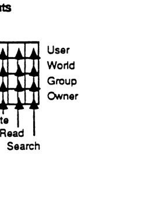

```mermaid
packet-beta
0: "Search (Owner)"
1: "Read (Owner)"
2: "Write (Owner)"
3-7: "0"
8: "Search (Group)"
9: "Read (Group)"
10: "Write (Group)"
11-15: "0"
16: "Search (World)"
17: "Read (World)"
18: "Write (World)"
19-23: "0"
24: "Search (User)"
25: "Read (User)"
26: "Write (User)"
27-31: "0"
```

| Field | Bit offset | Width (bits) | Description |
|---|---|---|---|
| Search (Owner) | 0 | 1 | Owner search permission |
| Read (Owner) | 1 | 1 | Owner read permission |
| Write (Owner) | 2 | 1 | Owner write permission |
| Search (Group) | 8 | 1 | Group search permission |
| Read (Group) | 9 | 1 | Group read permission |
| Write (Group) | 10 | 1 | Group write permission |
| Search (World) | 16 | 1 | World search permission |
| Read (World) | 17 | 1 | World read permission |
| Write (World) | 18 | 1 | World write permission |
| Search (User) | 24 | 1 | User search permission |
| Read (User) | 25 | 1 | User read permission |
| Write (User) | 26 | 1 | User write permission |


## FPGetForkParms

This call is used to retrieve parameters for a file associated with a particular open fork.

### INPUTS:

| | |
|---|---|
| SRefNum (INT) | session refnum |
| OForkRefnum (INT) | open fork refnum |
| Bitmap (INT) | bitmap describing which parameters are to be retrieved (the corresponding bit should be set). This field is the same as that in the FPGetFileDirParms call. |

### OUTPUTS:

| | |
|---|---|
| FPError (LONG) | |
| Bitmap (INT) | copy of the input parameter |
| File Parameters | |

### ERRORS:

| | |
|---|---|
| ParamErr | unknown session refnum or open fork refnum |
| BitmapErr | an attempt was made to retrieve a parameter which cannot be obtained with this call; null bitmap |
| AccessDenied | fork was not opened for Read |

### ALGORITHM:

The server retrieves the specified parameters for the file and packs them, in Bitmap order, in the reply packet. In order to keep all variable-length parameters at the end of the packet (even if more parameters are later added), all such parameters will be represented in the Bitmap order as fixed-length offsets (INTs) from the start of the parameters to the start of the variable-length fields. The actual variable-length fields are then packed after all fixed-length fields.

In AFP Version 1.1, the length of the fork indicated by the OForkRefnum may be retrieved, but a BitmapErr will be returned if an attempt is made to retrieve the length of the other fork comprising the file.

### RIGHTS:

The fork must have been opened for Read.

### PACKET FORMAT:

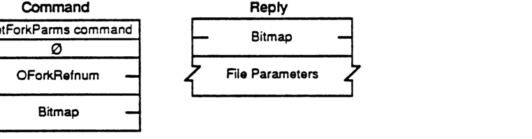

#### Command

```mermaid
packet-beta
0-7: "GetForkParms command"
8-15: "0"
16-31: "OForkRefnum"
32-47: "Bitmap"
```

| Field | Bit offset | Width (bits) | Description |
|---|---|---|---|
| GetForkParms command | 0 | 8 | Command code |
| 0 | 8 | 8 | Reserved/Pad |
| OForkRefnum | 16 | 16 | Open fork reference number |
| Bitmap | 32 | 16 | Parameter bitmap |

#### Reply

```mermaid
packet-beta
0-15: "Bitmap"
16-47: "File Parameters"
```

| Field | Bit offset | Width (bits) | Description |
|---|---|---|---|
| Bitmap | 0 | 16 | Copy of input parameter bitmap |
| File Parameters | 16 | variable | Requested file parameters |

## FPGetIcon

This call is used to retrieve an icon from the Desktop database from a FileCreator/FileType specification.

### INPUTS:

*   **SRefNum (INT)**: session refnum
*   **DTRefnum (INT)**: Desktop Database refnum
*   **FileCreator (RESTYPE)**: File's Creator type
*   **FileType (RESTYPE)**: File's type
*   **IconType (BYTE)**: Preferred icon type
*   **Length (INT)**: the number of bytes reserved for icon bitmap

### OUTPUTS:

*   **FPError (LONG)**
*   **Icon Bitmap (BYTES)**: The actual bitmap for the icon

### ERRORS:

*   **ParamErr**: unknown session refnum or Desktop Database refnum
*   **ItemNotFound**: no icon corresponding to the input specification was found in the Desktop Database

### ALGORITHM:

The bitmap for the specified icon is looked up in the Desktop Database given its FileCreator, FileType, and IconType and returned to the caller if found. If no matching icon is found, an ItemNotFound error will be returned.

Note that an input length argument of zero is acceptable to test for the presence or absence of a particular icon. The size of the bitmap returned is the minimum of the requested length and the actual size of the icon.

### RIGHTS:

The user must have previously called FPOpenDT for the corresponding volume.

### PACKET FORMAT:

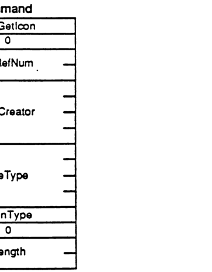

```mermaid
packet-beta
0-7: "FPGetIcon"
8-15: "0"
16-31: "DTRefNum"
32-63: "FileCreator"
64-95: "FileType"
96-103: "IconType"
104-111: "0"
112-127: "Length"
```

| Field | Bit offset | Width (bits) | Description |
| :--- | :--- | :--- | :--- |
| Command | 0 | 8 | FPGetIcon |
| Pad | 8 | 8 | 0 |
| DTRefNum | 16 | 16 | Desktop Database refnum |
| FileCreator | 32 | 32 | File's Creator type |
| FileType | 64 | 32 | File's type |
| IconType | 96 | 8 | Preferred icon type |
| Pad | 104 | 8 | 0 |
| Length | 112 | 16 | Number of bytes reserved for icon bitmap |

---

## FPGetIconInfo

### INPUTS:
* **SRefNum (INT)** session refnum
* **DTRefnum (INT)** Desktop Database refnum
* **FileCreator (RESTYPE)** File's Creator type
* **IconIndex (INT)** Index of requested icon

### OUTPUTS:
* **FPError (LONG)**
* **IconTag (LONG)** Tag information associated with the requested icon
* **FileType (RESTYPE)** The file type of the requested icon
* **IconType (BYTE)** The type of the requested icon
* **Size (INT)** The size of the icon bitmap

### ERRORS:
* **ParamErr** unknown session refnum or Desktop Database refnum
* **ItemNotFound** no icon corresponding to the input specification was found in the Desktop Database

### ALGORITHM:
The Icon Index argument is used to determine the nth icon for the given Creator type to be returned. If the icon index is greater than the number of icons in the Desktop Database for the specified Creator type, ItemNotFound is returned.

### RIGHTS:
The user must have previously called FPOpenDT for the corresponding volume.

### PACKET FORMAT:

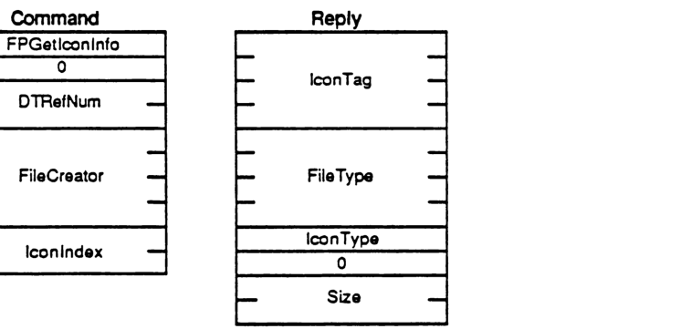

#### Command

```mermaid
packet-beta
0-7: "FPGetIconInfo"
8-15: "0"
16-31: "DTRefNum"
32-63: "FileCreator"
64-79: "IconIndex"
```

| Field | Bit offset | Width (bits) | Description |
|---|---|---|---|
| FPGetIconInfo | 0 | 8 | Command function code |
| Padding | 8 | 8 | 0 |
| DTRefNum | 16 | 16 | Desktop Database refnum |
| FileCreator | 32 | 32 | File's Creator type |
| IconIndex | 64 | 16 | Index of requested icon |

#### Reply

```mermaid
packet-beta
0-31: "IconTag"
32-63: "FileType"
64-71: "IconType"
72-79: "0"
80-95: "Size"
```

| Field | Bit offset | Width (bits) | Description |
|---|---|---|---|
| IconTag | 0 | 32 | Tag information associated with the requested icon |
| FileType | 32 | 32 | The file type of the requested icon |
| IconType | 64 | 8 | The type of the requested icon |
| Padding | 72 | 8 | 0 |
| Size | 80 | 16 | The size of the icon bitmap |


## FPGetSrvrInfo

This call is used to obtain a block of descriptive information from the server, without requiring a session to be opened.

### INPUTS:

* **SAddr** (EntityAddr): network-dependent internet address of the file server

### OUTPUTS:

* **FPError** (LONG)
* **Flags** (INT): Flags, consisting of:
    * **Bit 0 SupportsCopyFile**: set if server supports the FPCopyFile call
* **Server Name** (STR): the name of the server
* **Machine Type** (STR): string describing the server's hardware and/or OS
* **AFP Versions** (STRs): versions of AFP that the server can speak
* **UAM strings** (STRs): User Authentication Methods supported by the server
* **Volume Icon and Mask** (256 BYTES)

### ERRORS:

* **NoServer**: server not responding

### ALGORITHM:

The info block is returned from the server. The AFP Versions and UAM strings are formatted as a one-BYTE count followed by that number of strings packed back-to-back without padding. To facilitate access to all the fields of the reply packet, the packet is formatted as shown below: the packet data begins with INT offsets to the Machine Type, AFP Versions, UAM strings, and Volume Icon and Mask. These offsets are measured relative to the start of the reply packet data. The Volume Icon and Mask field is optional; if it is not included, the Offset to Volume Icon and Mask will be zero.

### RIGHTS:

No special access rights are needed to make this call.

### Notes:

The server may pack fields in the Reply block in any order; each field should be accessed only via the offsets (make no assumptions about how the fields are packed relative to one another). The exception to this is that the Server Name string (for which there is no offset) begins immediately after the Flags field.

## PACKET FORMAT:


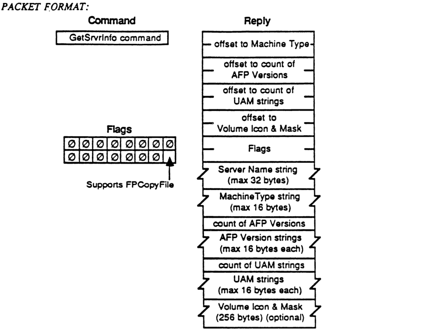

#### Command

| Field |
|---|
| GetSrvrInfo command |

#### Reply

```mermaid
packet-beta
0-15: "offset to Machine Type"
16-31: "offset to count of AFP Versions"
32-47: "offset to count of UAM strings"
48-63: "offset to Volume Icon & Mask"
64-79: "Flags"
80-335: "Server Name string (max 32 bytes)"
336-463: "MachineType string (max 16 bytes)"
464-471: "count of AFP Versions"
472-599: "AFP Version strings (max 16 bytes each)"
600-607: "count of UAM strings"
608-735: "UAM strings (max 16 bytes each)"
736-2783: "Volume Icon & Mask (256 bytes) (optional)"
```

| Field | Bit offset | Width (bits) | Description |
|---|---|---|---|
| offset to Machine Type | 0 | 16 | Offset from the beginning of the reply to the MachineType string. |
| offset to count of AFP Versions | 16 | 16 | Offset from the beginning of the reply to the count of AFP Versions. |
| offset to count of UAM strings | 32 | 16 | Offset from the beginning of the reply to the count of UAM strings. |
| offset to Volume Icon & Mask | 48 | 16 | Offset from the beginning of the reply to the Volume Icon & Mask. |
| Flags | 64 | 16 | Server capability flags. |
| Server Name string | 80 | up to 256 | Pascal string containing the server name, maximum 32 bytes. |
| MachineType string | 336 | up to 128 | Pascal string containing the machine type, maximum 16 bytes. |
| count of AFP Versions | 464 | 8 | The number of AFP version strings that follow. |
| AFP Version strings | 472 | variable | A series of Pascal strings identifying supported AFP versions. |
| count of UAM strings | 600 | 8 | The number of UAM (User Authentication Method) strings that follow. |
| UAM strings | 608 | variable | A series of Pascal strings identifying supported UAMs. |
| Volume Icon & Mask | 736 | 2048 | A 256-byte field containing the server's volume icon and mask (optional). |

#### Flags

```mermaid
packet-beta
0: "Supports FPCopyFile"
1-15: "Reserved"
```

| Field | Bit offset | Width (bits) | Description |
|---|---|---|---|
| Supports FPCopyFile | 0 | 1 | If set, the server supports the FPCopyFile command. |
| Reserved | 1 | 15 | Reserved; must be zero. |

## FPGetSrvrParms

This call is used to retrieve server-level parameters.

### INPUTS:

| Field | Type | Description |
|---|---|---|
| SRefNum | (INT) | session refnum |

### OUTPUTS:

| Field | Type | Description |
|---|---|---|
| FPError | (LONG) | |
| ServerTime | (LONG) | current date-time on this server's clock |
| NumVols | (BYTE) | number of volumes managed by the server |
| HasPassword | (BIT) | flag indicating whether or not this volume is password-protected: 0 = not protected; 1 = has password (all other bits must be zero) |
| VolNames | (STRs) | character string names of each volume (maximum 27 bytes) |

### ERRORS:

| Error | Description |
|---|---|
| ParamErr | unknown session refnum |

### ALGORITHM:

The volume name strings and password flags are packed together without padding in the reply.

### RIGHTS:

No special access rights are needed to make this call.

### Notes:

This call should be implemented on a server using the ASP GetStatus mechanism.

### PACKET FORMAT:

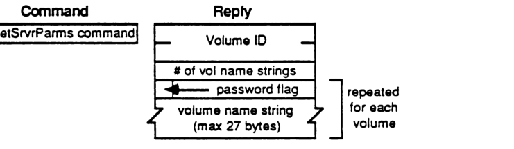

```mermaid
packet-beta
0-7: "GetSrvrParms command"
```

```mermaid
packet-beta
0-31: "Server Time"
32-39: "# of vol name strings"
40-40: "password flag"
41-256: "volume name string (max 27 bytes)"
```

| Field | Bit offset | Width (bits) | Description |
|---|---|---|---|
| Command | 0 | 8 | GetSrvrParms command identifier. |
| Server Time | 0 | 32 | Current date-time on this server's clock (Reply). |
| # of vol name strings | 32 | 8 | Number of volumes managed by the server (Reply). |
| password flag | 40 | 1 | Flag indicating if the volume is password-protected (repeated for each volume). |
| volume name string | 41 | variable | Character string name of the volume (maximum 27 bytes, repeated for each volume). |

## FPGetVolParms

This call is used to retrieve parameters for a particular volume. The volume is specified by its Volume ID as returned from the FPOpenVol call.

### INPUTS:

- **SRefNum (INT)**: session refnum
- **VolumeID (INT)**: volume identifier
- **Bitmap (INT)**: bitmap describing which parameters are to be returned (the corresponding bit should be set) (cannot be null):
    - 0 (LSB) Attributes (INT), consisting of the following flag:
        - 0 ReadOnly
    - 1 Signature (INT)
    - 2 Create Date (LONG)
    - 3 Mod Date (LONG)
    - 4 Backup Date (LONG)
    - 5 Volume ID (INT)
    - 6 Bytes Free (LONG) unsigned
    - 7 Bytes Total (LONG) unsigned
    - 8 Volume Name (INT)

### OUTPUTS:

- **FPError (LONG)**
- **Bitmap (INT)**: copy of input parameter
- **Volume Parameters**

### ERRORS:

- **ParamErr**: unknown session refnum or volume identifier
- **BitmapErr**: an attempt was made to retrieve a parameter which cannot be obtained with this call; null bitmap

### ALGORITHM:

The server retrieves the specified parameters for the volume and packs them, in Bitmap order, in the reply packet along with a copy of the Bitmap inserted before the parameters. In order to keep all variable-length parameters at the end of the packet (even if more parameters are later added), all such parameters like the Volume Name field will be represented in the Bitmap order by fixed-length offsets (INTs) from the start of the parameters (not the start of the bitmap) to the start of the variable-length fields. The actual variable-length fields are then packed after all fixed-length fields.

### RIGHTS:

The user must have previously called FPOpenVol for this volume.

### Notes:

The ReadOnly attribute is intended to be set via some administrative function, not through this protocol.

### PACKET FORMAT:

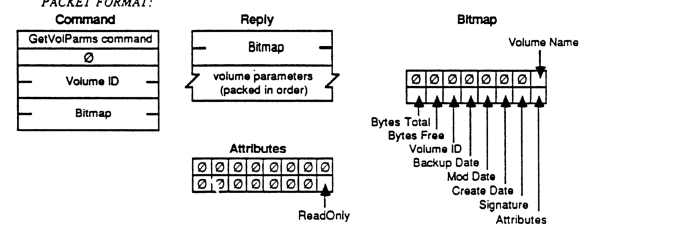

#### Command

```mermaid
packet-beta
0-7: "GetVolParms command"
8-15: "0"
16-31: "Volume ID"
32-47: "Bitmap"
```

| Field | Bit offset | Width (bits) | Description |
|---|---|---|---|
| GetVolParms command | 0 | 8 | Command code |
| Reserved | 8 | 8 | Always 0 |
| Volume ID | 16 | 16 | Volume identifier |
| Bitmap | 32 | 16 | Requested parameters bitmap |

#### Reply

```mermaid
packet-beta
0-15: "Bitmap"
16-47: "volume parameters (packed in order)"
```

| Field | Bit offset | Width (bits) | Description |
|---|---|---|---|
| Bitmap | 0 | 16 | Copy of requested parameters bitmap |
| volume parameters | 16 | Variable | Packed parameter values |

#### Bitmap

```mermaid
packet-beta
0: "Attributes"
1: "Signature"
2: "Create Date"
3: "Mod Date"
4: "Backup Date"
5: "Volume ID"
6: "Bytes Free"
7: "Bytes Total"
8: "Volume Name"
9-15: "0"
```

| Field | Bit offset | Width (bits) | Description |
|---|---|---|---|
| Attributes | 0 | 1 | If set, return Attributes field |
| Signature | 1 | 1 | If set, return Signature field |
| Create Date | 2 | 1 | If set, return Create Date field |
| Mod Date | 3 | 1 | If set, return Mod Date field |
| Backup Date | 4 | 1 | If set, return Backup Date field |
| Volume ID | 5 | 1 | If set, return Volume ID field |
| Bytes Free | 6 | 1 | If set, return Bytes Free field |
| Bytes Total | 7 | 1 | If set, return Bytes Total field |
| Volume Name | 8 | 1 | If set, return Volume Name offset field |
| Reserved | 9 | 7 | Always 0 |

#### Attributes

```mermaid
packet-beta
0: "ReadOnly"
1-15: "0"
```

| Field | Bit offset | Width (bits) | Description |
|---|---|---|---|
| ReadOnly | 0 | 1 | If set, the volume is read-only |
| Reserved | 1 | 15 | Always 0 |

## FPLogin

This call is used to establish a session with a server. A protocol version is agreed upon and the user is authenticated.

### INPUTS:

| | |
|---|---|
| SAddr (EntityAddr) | network-dependent internet address of the file server |
| AFPVersion (STR) | a string indicating which AFP Version is to be used |
| UAM (STR) | a string indicating which User Authentication Method is to be used to authenticate the user |
| UserAuthInfo (BUF) | information required to authenticate the user, dependent on the method used (may be null) |

### OUTPUTS:

| | |
|---|---|
| FPError (LONG) | |
| SRefNum (INT) | session refnum to be used to refer to this session in all subsequent calls (valid if NoErr or AuthContinue error returned) |
| IDNumber (INT) | returned in certain UserAuthenticationMethods to be presented in the next FPLoginCont call (only valid if AuthContinue error returned) |
| UserAuthInfo (BUF) | returned in certain UserAuthenticationMethods (only valid if AuthContinue error returned) |

### ERRORS:

| | |
|---|---|
| NoServer | server not responding |
| BadVersNum | server cannot speak the specified AFP version |
| BadUAM | unknown UserAuthenticationMethod |
| ParamErr | unknown User |
| UserNotAuth | UserAuthenticationMethod failed |
| AuthContinue | authentication not yet complete |
| ServerGoingDown | the server is in the process of shutting down |
| MiscErr | user is already authenticated |

### ALGORITHM:

The AFP Version string, indicating which AFP Version to use, and the User Authentication Method string, indicating which UAM is to be used in authenticating the user, are sent to the server. These are packed into the command packet with no padding. Depending on which method is used, the command packet sent to the server may contain additional information like user name and password. This extra information is passed to AFP as UserAuthInfo. If the server knows how to execute that UserAuthenticationMethod, it will do so and return a UserNotAuthenticated error if that method fails. Depending on which UAM is used, there may or may not be a null byte padded between the UAM and UserAuthInfo fields. See Appendix A for more details.

Note that some UserAuthenticationMethods may return some Reply data to this call. "No User Authent" and "Cleartxt passwrd" do not. Some methods like "Randnum exchange" will return UserAuthInfo data and will require an additional exchange of packets as well. In such cases, an AuthContinue error will be returned to this call, indicating that subsequent FPLoginCont calls are needed. (See Appendix A for more details.)

### NOTES:

If any error (other than AuthContinue) is returned, the session will not be opened.

### RIGHTS:

No special access rights are needed to make this call.

### PACKET FORMAT:

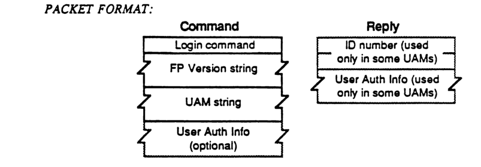

#### Command Packet Format

```mermaid
packet-beta
0-7: "Login command"
8-15: "FP Version string"
16-23: "UAM string"
24-31: "User Auth Info (optional)"
```

| Field | Bit offset | Width (bits) | Description |
|---|---|---|---|
| Login command | 0 | Variable | Command code for the Login operation |
| FP Version string | Variable | Variable | String representing the FP version |
| UAM string | Variable | Variable | String representing the User Authentication Method |
| User Auth Info (optional) | Variable | Variable | Optional additional user authentication information |

#### Reply Packet Format

```mermaid
packet-beta
0-7: "ID number (used only in some UAMs)"
8-15: "User Auth Info (used only in some UAMs)"
```

| Field | Bit offset | Width (bits) | Description |
|---|---|---|---|
| ID number | 0 | Variable | User identifier (included for certain UAMs) |
| User Auth Info | Variable | Variable | User authentication information (included for certain UAMs) |

## FPLoginCont

This call is used to continue the Login and authentication process with a server.

### INPUTS:

| Field | Description |
|---|---|
| **SRefNum (INT)** | session refnum |
| **IDNumber (INT)** | number returned from the previous FPLogin or FPLoginCont call |
| **UserAuthInfo (BUF)** | information required to authenticate the user, dependent on the method used |

### OUTPUTS:

| Field | Description |
|---|---|
| **FPError (LONG)** | |
| **IDNumber (INT)** | returned in certain UserAuthenticationMethods to be presented in the next FPLoginCont call (only valid if AuthContinue error returned) |
| **UserAuthInfo (BUF)** | returned in certain UserAuthenticationMethods (only valid if AuthContinue error returned) |

### ERRORS:

| Error | Description |
|---|---|
| **NoServer** | server not responding |
| **UserNotAuth** | UserAuthenticationMethod failed |
| **AuthContinue** | authorization not yet complete |

### ALGORITHM:

The ID number and UserAuthInfo are sent to the server, which uses them to execute the next step in the authentication method. If an additional exchange of packets is required, an AuthContinue error will be returned. Otherwise, either NoErr (meaning the user has been authenticated) or UserNotAuth (meaning the authentication method has failed) will be returned. If NoErr, a valid SRefNum will be returned for use in subsequent calls. If UserNotAuth, the session is closed by the server and the SRefnum is invalidated.

### RIGHTS:

No special access rights are needed to make this call.

### PACKET FORMAT:


#### Command

```mermaid
packet-beta
0-7: "LoginCont command"
8-15: "0"
16-31: "ID number"
32-63: "User Auth Info"
```

| Field | Bit offset | Width (bits) | Description |
|---|---|---|---|
| LoginCont command | 0 | 8 | The command code for FPLoginCont. |
| 0 | 8 | 8 | Reserved pad byte, must be 0. |
| ID number | 16 | 16 | The ID number from the previous call. |
| User Auth Info | 32 | Variable | Authentication information required for the login process. |

#### Reply

```mermaid
packet-beta
0-15: "ID number"
16-47: "User Auth Info"
```

| Field | Bit offset | Width (bits) | Description |
|---|---|---|---|
| ID number | 0 | 16 | ID number returned in certain UAMs to be used in the next FPLoginCont call. |
| User Auth Info | 16 | Variable | Authentication information returned in certain UAMs. |

## FPLogout

This call is used to terminate a session with a server

### INPUTS: SRefNum (INT) session refnum

### OUTPUTS: FPError (LONG)

### ERRORS: ParamErr unknown session refnum

### ALGORITHM: The server flushes and closes any forks opened by this session, frees up all session-related resources and invalidates the session refnum.

### RIGHTS: No special access rights are needed to make this call.

### PACKET FORMAT:


```mermaid
packet-beta
0-7: "Logout command"
```

| Field | Bit offset | Width (bits) | Description |
| :--- | :--- | :--- | :--- |
| Logout command | 0 | 8 | Command code for FPLogout |

## FPMapID

This call is used to map a User ID to a User Name, or a Group ID to a Group Name.

### INPUTS:

| Field | Description |
|---|---|
| **SRefNum (INT)** | session refnum |
| **Function (BYTE)** | function code:<br>1 = map User ID to User Name<br>2 = map Group ID to Group Name |
| **ID (LONG)** | item to be mapped, either User ID or Group ID |

### OUTPUTS:

| Field | Description |
|---|---|
| **FPError (LONG)** | |
| **Name (STR)** | name corresponding to input ID |

### ERRORS:

| Error | Description |
|---|---|
| **ParamErr** | unknown session refnum or function code; no ID was passed in command packet |
| **ItemNotFound** | ID not recognized |

### ALGORITHM:

The server attempts to find the Creator Name or Group Name corresponding to the specified Creator ID or Group ID. An ItemNotFound error is returned if the ID does not exist in the server's list of valid User or Group IDs.

### RIGHTS:

No special access rights are needed to make this call.

### NOTES:

A User ID or Group ID of zero will map to the null string.

### PACKET FORMAT:


#### Command

```mermaid
packet-beta
0-7: "MapID command"
8-15: "Function"
16-47: "ID"
```

| Field | Bit offset | Width (bits) | Description |
|---|---|---|---|
| MapID command | 0 | 8 | The command code for FPMapID |
| Function | 8 | 8 | function code: 1 = map User ID to User Name, 2 = map Group ID to Group Name |
| ID | 16 | 32 | item to be mapped, either User ID or Group ID |

#### Reply

```mermaid
packet-beta
0-n: "Name"
```

| Field | Bit offset | Width (bits) | Description |
|---|---|---|---|
| Name | 0 | variable | name corresponding to input ID |

## FPMapName

This call is used to map a User Name to a User ID, or a Group Name to a Group ID.

### INPUTS:
* **SRefNum (INT)**: session refnum
* **Function (BYTE)**: function code:
    * 3 = map User Name to User ID
    * 4 = map Group Name to Group ID
* **Name (STR)**: item to be mapped, either User Name or Group Name

### OUTPUTS:
* **FPError (LONG)**
* **ID (LONG)**: ID corresponding to input Name

### ERRORS:
* **ParamErr**: unknown session refnum or function code
* **ItemNotFound**: name not recognized

### ALGORITHM:
The server attempts to find the User ID or Group ID corresponding to the specified User Name or Group Name. An ItemNotFound error is returned if the name does not exist in the server's list of valid User or Group names.

### RIGHTS:
No special access rights are needed to make this call.

### Notes:
A null User or Group Name will map to an ID of zero.

### PACKET FORMAT:


#### Command Packet
```mermaid
packet-beta
0-7: "MapName command"
8-15: "Function"
16-31: "Name"
```

#### Reply Packet
```mermaid
packet-beta
0-31: "ID"
```

| Field | Bit offset | Width (bits) | Description |
|---|---|---|---|
| MapName command | 0 | 8 | The AFP command code for FPMapName. |
| Function | 8 | 8 | Function code: 3 = map User Name to User ID, 4 = map Group Name to Group ID. |
| Name | 16 | Variable | Pascal string containing the User Name or Group Name. |
| ID | 0 | 32 | The resulting User ID or Group ID. |

## FPMove

This call is used to move (not just copy) a directory or file to another location on a single volume (source and destination must be on the same volume). An object cannot be moved from one volume to another with this call, even though both volumes may be managed by the server. The destination of the move is specified by providing a DirID and Pathname that indicate the object's new Parent Directory.

### INPUTS:

| | |
|---|---|
| SRefNum (INT) | session refnum |
| VolumeID (INT) | volume identifier |
| SDirID (LONG) | source ancestor directory identifier |
| SPathType (BYTE) | indicates whether SPathname is composed of long names or short names:<br>1 = all pathname elements are short names<br>2 = all pathname elements are long names |
| SPathname (STR) | pathname of file or directory to be moved (may be null if a directory is to be moved) |
| DDirID (LONG) | destination ancestor directory identifier |
| DPathType (BYTE) | indicates whether DPathname is composed of long names or short names (same values as SPathType) |
| DPathname (STR) | pathname to the destination Parent Directory (may be null) |
| NewType (BYTE) | indicates whether NewName is a long name or a short name (same values as SPathType) |
| NewName (STR) | new name of file or directory (may be null) |

### OUTPUTS:

| | |
|---|---|
| FPError (LONG) | |

### ERRORS:

| | |
|---|---|
| ParamErr | unknown session refnum, volume identifier, or pathname type; bad pathname or NewName |
| ObjectNotFound | input parameters do not point to an existing file or directory |
| ObjectExists | a file or directory with the name NewName already exists |
| CantMove | an attempt was made to move a directory into one of its descendent directories |
| AccessDenied | user does not have the right to move the file/directory |

### ALGORITHM:

If the object to be moved is a directory, the directory and all its descendents will be moved. The file or directory is moved (deleted from its original Parent Directory) and renamed to its new name. The creation of Long and Short names is performed as described in Appendix B. The object's Mod Date, and the Mod Date of the object's Parent Directory are set to the server's clock. If NewName is null, the object will not be renamed. Its Parent Directory ID will be set to the destination Parent DirID, but all other parameters remain unchanged. The parameters of all descendent directories and files remain unchanged.

### RIGHTS:

The user must have previously called FPOpenVol for the volume. To move a directory, the user must have Search access rights to all ancestors down to and including the source and destination Parents, as well as Write access right to those directories. To move a file, Search access rights are needed for all ancestors except the source and destination Parents, as well as Read and Write access rights to the source Parent and Write access right to the destination Parent.

---

### PACKET FORMAT:


```mermaid
packet-beta
0-7: "Move command"
8-15: "0"
16-31: "Volume ID"
32-63: "SDirectory ID"
64-95: "DDirectory ID"
96-103: "SPathType"
104-111: "SPathname"
112-119: "DPathType"
120-127: "DPathname"
128-135: "NewType"
136-143: "NewName"
```

| Field | Bit offset | Width (bits) | Description |
|---|---|---|---|
| Move command | 0 | 8 | AFP command code for Move |
| 0 | 8 | 8 | Unused, must be zero |
| Volume ID | 16 | 16 | Volume identifier |
| SDirectory ID | 32 | 32 | Source directory ID |
| DDirectory ID | 64 | 32 | Destination directory ID |
| SPathType | 96 | 8 | Source pathname type |
| SPathname | 104 | Variable | Source pathname |
| DPathType | Variable | 8 | Destination pathname type |
| DPathname | Variable | Variable | Destination pathname |
| NewType | Variable | 8 | New name type |
| NewName | Variable | Variable | New name |

## FPOpenDir

This call is used to open a directory on a Variable-DirID volume and obtain its directory identifier.

### INPUTS:

| Field | Type | Description |
| :--- | :--- | :--- |
| SRefNum | INT | session refnum |
| VolumeID | INT | volume identifier |
| DirID | LONG | ancestor directory identifier |
| PathType | BYTE | indicates whether Pathname is composed of long names or short names:<br>1 = all pathname elements are short names<br>2 = all pathname elements are long names |
| Pathname | STR | pathname to desired directory (cannot be null) |

### OUTPUTS:

| Field | Type | Description |
| :--- | :--- | :--- |
| FPError | LONG | |
| DirID | LONG | identifier of specified directory |

### ERRORS:

| Error | Description |
| :--- | :--- |
| ParamErr | unknown session refnum, volume identifier, or pathname type; bad pathname |
| ObjectNotFound | input parameters do not point to an existing directory |
| AccessDenied | user does not have the rights listed below |
| ObjectTypeErr | input parameters point to a file |

### ALGORITHM:

If Volume ID specifies a Variable-DirID volume, the server will generate a variable Directory ID for the directory specified by the other input parameters. If the volume is of Fixed-DirID type, the server will return the fixed DirectoryID belonging to this directory.

### RIGHTS:

The user must have previously called FPOpenVol for this volume. In addition, the user must have Search access rights to all ancestors down to and including this directory's Parent Directory.

### NOTES:

This call must be issued to obtain a DirID for a directory and to subsequently access the directory on a Variable-DirID volume. It is not considered an error to invoke this call for directories on other types of volumes, although this is not the recommended way to obtain the parameter. Use the FPGetFileDirParms or FPEnumerate calls instead.

### PACKET FORMAT:


#### Command

```mermaid
packet-beta
0-7: "OpenDir command"
8-15: "0"
16-31: "Volume ID"
32-63: "Directory ID"
64-71: "PathType"
72-103: "Pathname"
```

| Field | Bit offset | Width (bits) | Description |
| :--- | :--- | :--- | :--- |
| OpenDir command | 0 | 8 | Command code |
| 0 | 8 | 8 | Reserved/Pad |
| Volume ID | 16 | 16 | Volume identifier |
| Directory ID | 32 | 32 | Ancestor directory identifier |
| PathType | 64 | 8 | Type of pathname (1=short, 2=long) |
| Pathname | 72 | variable | Pathname string |

#### Reply

```mermaid
packet-beta
0-31: "Directory ID"
```

| Field | Bit offset | Width (bits) | Description |
| :--- | :--- | :--- | :--- |
| Directory ID | 0 | 32 | Identifier of specified directory |

## FPOpenDT

This call is used to retrieve an icon from the Desktop database from a FileCreator/FileType specification.

| | | |
| :--- | :--- | :--- |
| ### INPUTS: | DTRefNum (INT) | Desktop Database RefNum |
| ### OUTPUTS: | FPError (LONG) | |
| | DTRefNum (INT) | Refnum for use on future Desktop Manager calls |
| ### ERRORS: | ParamErr | unknown session refnum or volume identifier |
| ### ALGORITHM: | | The desktop Database on the selected volume is opened, and a refnum (unique among all volumes on the server) is returned for use in subsequent calls. |
| ### RIGHTS: | | No special rights are needed to make this call. |

PACKET FORMAT:


### Command

```mermaid
packet-beta
0-7: "FPOpenDT"
8-15: "0"
16-31: "VolID"
```

| Field | Bit offset | Width (bits) | Description |
| :--- | :--- | :--- | :--- |
| FPOpenDT | 0 | 8 | Command opcode |
| 0 | 8 | 8 | Unused padding byte |
| VolID | 16 | 16 | Volume Identifier |

### Reply

```mermaid
packet-beta
0-15: "DTRefNum"
```

| Field | Bit offset | Width (bits) | Description |
| :--- | :--- | :--- | :--- |
| DTRefNum | 0 | 16 | Desktop Database Reference Number |

## FPOpenFork

This call is used to open the data or resource fork of an existing file for the purpose of reading from it or writing to it. Each fork must be opened separately; a unique OpenForkRefnum will be returned for each.

### INPUTS:

| Field | Type | Description |
| :--- | :--- | :--- |
| SRefNum | (INT) | session refnum |
| VolumeID | (INT) | volume identifier |
| DirID | (LONG) | ancestor directory identifier |
| Bitmap | (INT) | bitmap describing which parameters are to be returned (the corresponding bit should be set). This field is the same as that in the FPGetFileDirParms call. (can be null) |
| AccessMode | (INT) | desired access and sharing modes, as specified by any combination of the following bits:<br>0 Read - allows the file to be read<br>1 Write - allows the file to be written to<br>4 DenyRead - denies others the right to read the fork while this user has it open<br>5 DenyWrite - denies others the right to write to the fork while this user has it open<br>See Appendix C for a detailed explanation of the use of the Deny bits. |
| PathType | (BYTE) | indicates whether Pathname is composed of long names or short names<br>1 = all pathname elements are short names<br>2 = all pathname elements are long names |
| Pathname | (STR) | pathname to desired file; cannot be null |
| Rsrc/DataFlag | (BIT) | flag to indicate which fork is to be opened (all other bits must be zero):<br>0 = data fork<br>1 = resource fork |

### OUTPUTS:

| Field | Type | Description |
| :--- | :--- | :--- |
| FPError | (LONG) | |
| Bitmap | (INT) | copy of input parameter |
| OForkRefnum | | refnum used to refer to this fork in subsequent calls |
| File Parameters | | |

### ERRORS:

| Error | Description |
| :--- | :--- |
| ParamErr | unknown session refnum, volume identifier, or pathname type; null or bad pathname |
| ObjectNotFound | input parameters do not point to an existing file |
| BitmapErr | an attempt was made to retrieve a parameter which cannot be obtained with this call (file will not be opened) |
| DenyConflict | fork cannot be opened because Deny modes conflict (parameters will be returned) |
| AccessDenied | user does not have the rights listed below |
| ObjectTypeErr | input parameters point to a directory |
| TooManyFilesOpen | the server cannot open another fork |

### ALGORITHM:

The server opens the specified fork if the user has the proper access rights for the requested Access Mode, and if the requested Access Mode does not conflict with already-open access paths to this fork.

If the open is successful, the server retrieves the specified parameters for the file and packs them, in Bitmap order, in the reply packet along with a copy of the Bitmap and an OForkRefnum inserted before the parameters. This OForkRefnum is to be used in all subsequent calls involving the open fork.

---

File parameters will be returned only if the call completes with no error or with a Deny
Conflict error. In the latter case, the server will return zero for the OForkRefnum but
valid parameters as requested so that the user can determine if he is the one who already
has the fork open.

In order to keep all variable-length parameters at the end of the packet (even if more
parameters are later added), all such parameters like the Long Name and Short Name fields
must be represented in the Bitmap order as fixed-length offsets (INTs) from the start of the
parameters (not the start of the bitmap) to the variable-length fields. The actual variable-
length fields are then packed after all fixed-length fields.

### RIGHTS: The user must have previously called FPOpenVol for this volume. To open a fork for
Read, or in the special case in which neither Read nor Write access is requested, the user
must have Search access to all ancestors except the Parent, as well as Read access to the
Parent.

To open the fork for Write, the volume must not be marked Read Only. If both forks are
currently empty, the user must have Search or Write access to all ancestors except the
Parent, as well as Write access to the Parent. If either fork is non-empty and one of them
is being opened for Write, the user must have Search access to all ancestors except the
Parent, as well as Read and Write access to the Parent.

### Notes: If the fork was successfully opened and the user requested the file's Attributes in the
Bitmap, the appropriate DAlreadyOpen or RAlreadyOpen bits will be set.

### PACKET FORMAT:


### OpenFork Command

```mermaid
packet-beta
0-7: "OpenFork command"
8-15: "Rsrc/DataFlag"
16-31: "Volume ID"
32-63: "Directory ID"
64-79: "Bitmap"
80-95: "Access Mode"
96-103: "PathType"
104-135: "Pathname"
```

| Field | Bit offset | Width (bits) | Description |
|---|---|---|---|
| OpenFork command | 0 | 8 | The AFP command code for OpenFork. |
| Rsrc/DataFlag | 8 | 8 | Flag indicating whether to open the resource or data fork. |
| Volume ID | 16 | 16 | The identifier for the volume. |
| Directory ID | 32 | 32 | The identifier for the directory. |
| Bitmap | 64 | 16 | Requested file parameters bitmap. |
| Access Mode | 80 | 16 | The requested access rights (see bit layout below). |
| PathType | 96 | 8 | The type of pathname (e.g., long name, short name). |
| Pathname | 104 | variable | The AFP pathname of the file. |

### OpenFork Reply

```mermaid
packet-beta
0-15: "Bitmap"
16-31: "OForkRefnum"
32-63: "File Parameters"
```

| Field | Bit offset | Width (bits) | Description |
|---|---|---|---|
| Bitmap | 0 | 16 | Bitmap indicating which file parameters are being returned. |
| OForkRefnum | 16 | 16 | The reference number for the opened fork. |
| File Parameters | 32 | variable | The requested file parameters. |

### Access Mode Bits

```mermaid
packet-beta
0: "Read"
1: "Write"
2-3: "0"
4: "DenyRead"
5: "DenyWrite"
6-15: "0"
```

| Field | Bit offset | Width (bits) | Description |
|---|---|---|---|
| Read | 0 | 1 | Request read access. |
| Write | 1 | 1 | Request write access. |
| Reserved | 2 | 2 | Set to 0. |
| DenyRead | 4 | 1 | Deny read access to others. |
| DenyWrite | 5 | 1 | Deny write access to others. |
| Reserved | 6 | 10 | Set to 0. |

## FPOpenVol

This call is used to "mount" a volume. It must be called once before any other call can be made to access objects on the volume.

### INPUTS:

| | |
| :--- | :--- |
| SRefNum (INT) | session refnum |
| Bitmap (INT) | bitmap describing which parameters are to be returned (the corresponding bit should be set). This field is the same as that in the FPGetVolParms call (cannot be null) |
| VolumeName (STR) | name of the volume as returned by the FPGetSrvrParms call (maximum 27 bytes) |
| Password (8 BYTES) | optional password |

### OUTPUTS:

| | |
| :--- | :--- |
| FPError (LONG) | |
| Bitmap (INT) | copy of input parameter |
| Volume Parameters | |

### ERRORS:

| | |
| :--- | :--- |
| ParamErr | unknown session refnum or volume name |
| BitmapErr | an attempt was made to retrieve a parameter which cannot be obtained with this call; null bitmap |
| AccessDenied | Password not supplied or does not match |

### ALGORITHM:

The password is sent in the command packet in clear text, padded (suffixed) with null bytes to its full 8-byte length. Password comparison is case sensitive.

If the volume is password-protected, the server will check that the Password supplied by the user matches the one kept with the volume. If they do not match, or if no Password was supplied, an AccessDenied error will be returned.

If the Passwords match, or if the volume is not password-protected, the server will retrieve the requested parameters and pack them into the reply packet. The server will mark the volume as "mounted", meaning that this user has permission to make calls relating to objects on this volume.

### RIGHTS:

No special access rights are needed to make this call.

### Notes:

This call cannot be made with a null Bitmap; the Bitmap should at least request the Volume ID to be returned as there is no other way to retrieve this parameter and it is needed for most subsequent calls.

FPOpenVol can be called multiple times without an intervening FPCloseVol call; however, a single FPCloseVol call will invalidate the VolID.

## PACKET FORMAT:


### OpenVol Command Packet Structure

```mermaid
packet-beta
0-7: "OpenVol command"
8-15: "0"
16-31: "Bitmap"
32-63: "Volume Name string (max 27 bytes)"
64-71: "0 (pad)"
72-103: "Password (optional)"
```

| Field | Bit offset | Width (bits) | Description |
|---|---|---|---|
| OpenVol command | 0 | 8 | The command code for the OpenVol operation. |
| 0 | 8 | 8 | A padding byte set to zero. |
| Bitmap | 16 | 16 | A 16-bit bitmap specifying volume parameters. |
| Volume Name string | 32 | Variable | A Pascal string (length byte + characters) containing the volume name, up to 27 bytes total. |
| 0 (pad) | Variable | 0 or 8 | A possible null byte inserted to ensure the following password field starts on an even byte boundary. |
| Password (optional) | Variable | Variable | An optional volume password. |

### OpenVol Reply Packet Structure

```mermaid
packet-beta
0-15: "Bitmap"
16-47: "Volume parameters (packed in order)"
```

| Field | Bit offset | Width (bits) | Description |
|---|---|---|---|
| Bitmap | 0 | 16 | The volume bitmap returned by the server. |
| Volume parameters | 16 | Variable | The requested volume parameters, packed in the order they appear in the bitmap. |

## FPRead

This call is used to read a block of data from an open fork.

### INPUTS:

| | |
|---|---|
| SRefNum (INT) | session refnum |
| OForkRefnum (INT) | open fork refnum |
| Offset (LONG) | byte offset from beginning of fork at which the read is to begin |
| ReqCount (LONG) | number of bytes to read |
| NewlineMask (BYTE) | mask which is ANDed with each character and compared with the NewlineChar to test for the end of the block. In AFP Version 1.1, only two masks are valid.<br>$0= ignore NewlineChar<br>$FF= a NewlineChar is specified |
| NewlineChar (BYTE) | any ASCII character from $00 to $FF inclusive which, when encountered in reading the fork (after masking), causes the read operation to terminate |

### OUTPUTS:

| | |
|---|---|
| FPError (LONG) | |
| ActCount (LONG) | number of bytes actually read from the fork |
| Fork data | |

### ERRORS:

| | |
|---|---|
| ParamErr | unknown session refnum or open fork refnum; negative ReqCount or Offset; invalid Newline mask |
| AccessDenied | fork was not opened for Read |
| EOFErr | end-of-fork was reached |
| LockErr | some or all of requested range is locked by another user |

### ALGORITHM:

The fork is read starting Offset bytes from the beginning of the fork and terminating at the first NewlineChar encountered (if NewlineMask is set to $FF), the end-of-fork, the start of a locked range, or when ReqCount bytes have been read. If the end-of-fork (or the start of a locked range) was reached, all data read up to the fork end (the start of the locked range) will be returned, and an EOFErr (LockErr) will be returned.

Reading a byte that was never written to the fork will return an undefined value.

### RIGHTS:

The fork must have been opened for Read.

## NOTES:

Locking of the range should be done prior to this call since the underlying transport mechanism may force the request to be broken up into multiple smaller requests. Although the range may not be locked when the call begins execution, it is possible for another user to lock some or all of the range before this call completes, causing the Read to succeed partially.

---

# PACKET FORMAT:


### Command

```mermaid
packet-beta
0-7: "Read command"
8-15: "0"
16-31: "OForkRefnum"
32-63: "Offset"
64-95: "ReqCount"
96-103: "Newline Mask"
104-111: "Newline Char"
```

| Field | Bit offset | Width (bits) | Description |
| :--- | :--- | :--- | :--- |
| Read command | 0 | 8 | The command code for the Read operation. |
| 0 | 8 | 8 | Reserved field; must be zero. |
| OForkRefnum | 16 | 16 | The open fork reference number for the source file. |
| Offset | 32 | 32 | The byte offset from the start of the fork where reading begins. |
| ReqCount | 64 | 32 | The total number of bytes requested to be read. |
| Newline Mask | 96 | 8 | The mask used to match the newline character. |
| Newline Char | 104 | 8 | The character used as a newline delimiter to terminate the read. |

### Reply

| Field | Description |
| :--- | :--- |
| Fork data | The variable-length data read from the specified fork. |

---

# FPRemoveAPPL

This call is used to remove an APPL mapping from the Desktop Database.

### INPUTS:

| | |
|---|---|
| SRefNum (INT) | session refnum |
| DTRefnum (INT) | Desktop Database refnum |
| DirID (LONG) | Directory identifier |
| FileCreator (RESTYPE) | Creator type of application to be removed |
| PathType (BYTE) | indicates whether Pathname is composed of long names or short names<br>1 = all pathname elements are short names<br>2 = all pathname elements are long names |
| PathName (STRING) | pathname to the application being removed |

### OUTPUTS:

| | |
|---|---|
| FPError (LONG) | |

### ERRORS:

| | |
|---|---|
| ParamErr | unknown session refnum or Desktop Database refnum |
| ObjectNotFound | input parameters do not point to an existing file |
| AccessDenied | user does not have the rights listed below |
| ItemNotFound | no APPL entry corresponding to the input parameters was found in the Desktop Database |

### ALGORITHM:

The entry for the application specified is located in the Desktop /Database using the FileCreator information. If an entry is found for the specified Directory ID/File name, the entry is removed.

### RIGHTS:

The user must have previously called FPOpenDT for the corresponding volume. In addition, the file must be present in the specified directory before this call is issued. The user must have Search access to all ancestors except the Parent, as well as Read and Write access to the Parent.

### PACKET FORMAT:


```mermaid
packet-beta
0-7: "FPRemoveAPPL"
8-15: "0"
16-31: "DTRefnum"
32-63: "Directory ID"
64-95: "FileCreator"
96-103: "PathType"
104-127: "PathName"
```

| Field | Bit offset | Width (bits) | Description |
|---|---|---|---|
| Command | 0 | 8 | FPRemoveAPPL command code |
| Filler | 8 | 8 | Unused, must be 0 |
| DTRefnum | 16 | 16 | Desktop Database refnum |
| Directory ID | 32 | 32 | Directory identifier |
| FileCreator | 64 | 32 | Creator type of application to be removed |
| PathType | 96 | 8 | Indicates long or short names (1 or 2) |
| PathName | 104 | Variable | Pathname to the application being removed |

## FPRemoveComment

This call is used to remove a comment from the Desktop Database

### INPUTS:

- **SRefNum (INT)**: session refnum
- **DTRefnum (INT)**: Desktop Database refnum
- **DirID (LONG)**: directory identifier
- **PathType (BYTE)**: indicates whether Pathname is composed of long names or short names
  - 1 = all pathname elements are short names
  - 2 = all pathname elements are long names
- **PathName (STRING)**: the pathname for the file or folder associated with the comment

### OUTPUTS:

- **FPError (LONG)**

### ERRORS:

- **ParamErr**: unknown session refnum, volume identifier, or pathname type; bad pathname
- **ItemNotFound**: no comment found in Desktop Database
- **AccessDenied**: user does not have the rights listed below
- **ObjectNotFound**: input parameters do not point to an existing object

### ALGORITHM:

The comment associated with the file or folder specified is removed from the Desktop Database.

### RIGHTS:

The user must have previously called FPOpen DT for the corresponding volume. If the comment is associated with a non-empty directory, the user must have Search access to all ancestors including the Parent Directory, plus Write access to the Parent. If the comment is associated with an empty directory, the user must have Search or Write access to all ancestors including the Parent Directory, plus Write access to the Parent. If the comment is associated with a non-empty file, the user must have Search access to all ancestors except the Parent Directory, plus Read and Write access to the Parent. If the comment is associated with an empty file, the user must have Search or Write access to all ancestors except the Parent Directory, plus Write access to the Parent.

### PACKET FORMAT:


```mermaid
packet-beta
0-7: "FPRemoveComment"
8-15: "0"
16-31: "VolID"
32-63: "Directory ID"
64-71: "PathType"
72-103: "PathName"
```

| Field | Bit offset | Width (bits) | Description |
|---|---|---|---|
| FPRemoveComment | 0 | 8 | Command code |
| 0 | 8 | 8 | Reserved (must be 0) |
| VolID | 16 | 16 | Volume identifier (Desktop Database reference number) |
| Directory ID | 32 | 32 | Directory identifier |
| PathType | 64 | 8 | Indicates if names are short (1) or long (2) |
| PathName | 72 | Variable | Pathname for the file or folder |

## FPRename

This call is used to rename either a directory or a file.

### INPUTS:

| | |
| :--- | :--- |
| SRefNum (INT) | session refnum |
| VolumeID (INT) | volume identifier |
| DirID (LONG) | ancestor directory identifier |
| PathType (BYTE) | indicates whether Pathname is composed of long names or short names. <br> 1 = all pathname elements are short names <br> 2 = all pathname elements are long names |
| Pathname (STR) | pathname of file or directory to be renamed (may be null if a directory is to be renamed) |
| NewType (BYTE) | indicates whether NewName is a long name or short name. (same values as PathType) |
| NewName (STR) | new name of file or directory (cannot be null) |

### OUTPUTS:

| | |
| :--- | :--- |
| FPError (LONG) | |

### ERRORS:

| | |
| :--- | :--- |
| ParamErr | unknown session refnum, volume identifier, or pathname type; bad pathname or NewName |
| ObjectNotFound | input parameters do not point to an existing file or directory |
| ObjectExists | a file or directory with the name NewName already exists |
| AccessDenied | user does not have the right to rename the file/directory |
| CantRename | an attempt was made to rename a volume |

### ALGORITHM: 
The object is renamed to its new name. The creation of Long and Short names is performed as described in Appendix B. The Mod Date of the Parent Directory is set to the server's clock.

### RIGHTS: 
The user must have previously called FPOpenVol for the volume. In addition, the user must have Search access rights to all ancestors except the object's Parent Directory, as well as Write access right to the Parent Directory. To rename a directory, the user must also have Search access to the Parent; else to rename a file, the user must also have Read access to the Parent.

### PACKET FORMAT:


```mermaid
packet-beta
0-7: "Rename command"
8-15: "0"
16-31: "Volume ID"
32-63: "Directory ID"
64-71: "PathType"
72-87: "Pathname (variable)"
88-95: "NewType"
96-111: "NewName (variable)"
```

| Field | Bit offset | Width (bits) | Description |
|---|---|---|---|
| Rename command | 0 | 8 | The command code for the Rename operation. |
| Pad | 8 | 8 | Reserved; must be zero. |
| Volume ID | 16 | 16 | The identifier for the volume. |
| Directory ID | 32 | 32 | The identifier for the directory. |
| PathType | 64 | 8 | The type of the pathname. |
| Pathname | 72 | Variable | The current pathname of the file or directory. |
| NewType | Variable | 8 | The type of the new name. |
| NewName | Variable | Variable | The new name for the file or directory. |


## FPSetDirParms

This call is used to set parameters for a particular directory.

### INPUTS:

| Field | Type | Description |
| :--- | :--- | :--- |
| SRefNum | (INT) | session refnum |
| VolumeID | (INT) | volume identifier |
| DirID | (LONG) | ancestor directory identifier |
| Bitmap | (INT) | bitmap describing which parameters are to be set (the corresponding bit should be set). This field is the same as that in the FPGetFileDirParms call. |
| PathType | (BYTE) | indicates whether Pathname is composed of long names or short names:<br>1 = all pathname elements are short names<br>2 = all pathname elements are long names |
| Pathname | (STR) | pathname to desired directory |
| Directory Parameters | | |

### OUTPUTS:

| Field | Type | Description |
| :--- | :--- | :--- |
| FPError | (LONG) | |

### ERRORS:

| Error | Description |
| :--- | :--- |
| ParamErr | unknown session refnum, volume identifier, or pathname type; bad pathname; owner or group ID not valid |
| ObjectNotFound | input parameters do not point to an existing directory |
| BitmapErr | an attempt was made to set a parameter which cannot be set with this call; null bitmap |
| AccessDenied | user does not have the rights listed below |
| ObjectTypeErr | input parameters point to a file |

### ALGORITHM:

The server sets the specified parameters for the directory which must be packed, in Bitmap order, in the command packet. In order to keep all variable-length parameters at the end of the packet (even if more parameters are later added), all such parameters like the Long Name and Short Name fields must be represented in the Bitmap order as fixed-length offsets (INTs) from the start of the parameters to the start of the variable-length fields. The actual variable-length fields are then packed after all fixed-length fields.

Changing a directory's AccessRights will immediately affect other currently open sessions.

If the Access Controls or Owner ID or Group ID are set in this call, and the Mod Date is not set, the Mod Date will be set to the the server's clock.

### RIGHTS:

The user must have previously called FPOpenVol for this volume. To set a directory's Access Controls, Owner ID, or Group ID, the user must have Search or Write access rights to all ancestors including this directory's Parent Directory, and must be the owner of the directory. To set any other parameter for an empty directory, the user must have Search or Write access to all ancestors except the Parent, as well as Write access to the Parent. To set any other parameter for a non-empty directory, the user must have Search access to all ancestors including the Parent, as well as Write access to the Parent.

If the user lacks the access rights to set any one of a number of parameters, an Access Denied error will be returned and no parameters will be set.

### Notes:

This call cannot be used to set a directory's name (use FPRename), Parent Directory (use FPMove), Directory ID, or number of offspring.

The user needs to be the owner of the directory to set the directory's Access Controls, Owner ID, or Group ID only.

A null byte may be added between the Pathname and the Directory Parameters so that the Parameters begin on an even boundary in the Command Buffer.


### PACKET FORMAT:


```mermaid
packet-beta
0-7: "SetDirParms command"
8-15: "0"
16-31: "Volume ID"
32-63: "Directory ID"
64-79: "Bitmap"
80-87: "PathType"
88-103: "Pathname"
104-111: "0"
112-127: "directory parameters"
```

| Field | Bit offset | Width (bits) | Description |
| :--- | :--- | :--- | :--- |
| SetDirParms command | 0 | 8 | The command code for the SetDirParms function. |
| 0 | 8 | 8 | Unused byte, must be zero. |
| Volume ID | 16 | 16 | The volume ID. |
| Directory ID | 32 | 32 | The directory ID. |
| Bitmap | 64 | 16 | A bitmap specifying which directory parameters are to be set. |
| PathType | 80 | 8 | A byte indicating the format of the pathname. |
| Pathname | 88 | Variable | The pathname for the directory. |
| 0 | Variable | 0 or 8 | A possible null byte so that parameters begin on an even boundary. |
| directory parameters | Variable | Variable | The directory parameters to be set, packed in order. |


## FPSetFileParms

This call is used to set parameters for a particular file.

### INPUTS:

| | | |
| :--- | :--- | :--- |
| SRefNum | (INT) | session refnum |
| VolumeID | (INT) | volume identifier |
| DirID | (LONG) | ancestor directory identifier |
| Bitmap | (INT) | bitmap describing which parameters are to be set (the corresponding bit should be set). This field is the same as that in the FPGetFileDirParms call. |
| PathType | (BYTE) | indicates whether Pathname is composed of long names or short names:<br>1 = all pathname elements are short names<br>2 = all pathname elements are long names |
| Pathname | (STR) | pathname to desired file |
| File Parameters | | |

### OUTPUTS:

| | | |
| :--- | :--- | :--- |
| FPError | (LONG) | |

### ERRORS:

| | |
| :--- | :--- |
| ParamErr | unknown session refnum, volume identifier, or pathname typ null or bad pathname |
| ObjectNotFound | input parameters do not point to an existing file |
| AccessDenied | user does not have the right to access the file |
| BitmapErr | an attempt was made to set a parameter which cannot be set with this call; null bitmap |
| ObjectTypeErr | input parameters point to a directory |

### ALGORITHM:

The server sets the specified parameters for the file which must be packed, in Bitmap order, in the command packet. In order to keep all variable-length parameters at the end of the packet (even if more parameters are later added), all such parameters must be represented in the Bitmap order as fixed-length offsets (INTs) from the start of the parameters to the start of the variable-length fields. The actual variable-length fields are then packed after all fixed-length fields.

In AFP Version 1.1, only the following parameters may be set or cleared: Attributes (all except DAlreadyOpen and RAlreadyOpen), Create Date, Last Mod Date, Backup Date, and FinderInfo.

If the Attributes field is included, the Set/Clear bit is used to indicate that the specified Attributes (whose corresponding bits are set) are to be either set or cleared (0 = clear specified Attributes, 1 = set specified Attributes). Hence it is not possible to set some Attributes and clear others in the same call.

### RIGHTS:

The user must have previously called FPOpenVol for this volume. If the file is empty (both forks are of zero length), the user must have Search or Write access rights to all ancestors except this file's Parent Directory, as well as Write access right to the Parent Directory. If either fork is non-empty, the user must have Search access to all ancestors except the Parent, as well as Read and Write access to the Parent.

### Notes:

This call cannot be used to set a file's name (use FPRename), Parent Directory (use FPMove), File Number, or fork lengths.

A null byte may be added between the Pathname and the File Parameters so that the Parameters begin on an even boundary in the Command Buffer.


### PACKET FORMAT:

#### Command


```mermaid
packet-beta
0-7: "SetFileParms command"
8-15: "0"
16-31: "Volume ID"
32-63: "Directory ID"
64-79: "Bitmap"
80-87: "PathType"
88-119: "Pathname (variable)"
120-127: "0 (padding)"
128-159: "File Parameters (variable)"
```

| Field | Bit offset | Width (bits) | Description |
|---|---|---|---|
| SetFileParms command | 0 | 8 | AFP command code for SetFileParms. |
| 0 | 8 | 8 | Reserved/unused byte, must be zero. |
| Volume ID | 16 | 16 | The identifier of the volume containing the file. |
| Directory ID | 32 | 32 | The identifier of the directory containing the file. |
| Bitmap | 64 | 16 | A bitmask specifying which file parameters are to be set. |
| PathType | 80 | 8 | Specifies the format of the pathname string. |
| Pathname | 88 | Variable | The pathname identifying the file. |
| 0 (padding) | Variable | 0 or 8 | Possible null byte so that parameters begin on an even boundary. |
| File Parameters | Variable | Variable | The parameter values to be set, as specified in the Bitmap. |


## FPSetFileDirParms

This call is used to set parameters for a particular object, either a file or a directory.

### INPUTS:

| Field | Type | Description |
|:---|:---|:---|
| SRefNum | (INT) | session refnum |
| VolumeID | (INT) | volume identifier |
| DirID | (LONG) | ancestor directory identifier |
| Bitmap | (INT) | bitmap describing which parameters are to be set (the corresponding bit should be set). This field is the same as the FileBitmap or DirBitmap in the FPGetFileDirParms call (only the parameters which are common to both bitmaps may be set by this call). |
| PathType | (BYTE) | indicates whether Pathname is composed of long names or short names, or unknown:<br>1 = all pathname elements are short names<br>2 = all pathname elements are long names |
| Pathname | (STR) | pathname to desired object |
| Parameters | | |

### OUTPUTS:

| Field | Type |
|:---|:---|
| FPError | (LONG) |

### ERRORS:

| Error | Description |
|:---|:---|
| ParamErr | unknown session refnum, volume identifier, or pathname type; bad pathname |
| ObjectNotFound | input parameters do not point to an existing object |
| AccessDenied | user does not have the rights listed below |
| BitmapErr | an attempt was made to set a parameter which cannot be set with this call; null bitmap |

### ALGORITHM:

In AFP Version 1.1, the only parameters that may be set or cleared by this call are: Attributes (only the Invisible attribute), Create Date, Last Mod Date, Backup Date, and FinderInfo. Note that these parameters are common to both files and directories. The server sets the specified parameters for the object which must be packed, in Bitmap order, in the command packet. In order to keep all variable-length parameters at the end of the packet (even if more parameters are later added), all such parameters must be represented in the Bitmap order as fixed-length offsets (INTs) from the start of the parameters to the start of the variable-length fields. The actual variable-length fields are then packed after all fixed-length fields.

If the Attributes field is included, the Set/Clear bit is used to indicate that the specified Attributes (whose corresponding bits are set) are to be either set or cleared (0 = clear specified Attributes, 1 = set specified Attributes). Hence it is not possible to set some Attributes and clear others in the same call.

### RIGHTS:

The user must have previously called FPOpenVol for this volume. To set the parameters for a non-empty directory, the user needs Search access to all ancestors including the Parent Directory, as well as Write access to the Parent. To set the parameters for an empty directory, the user needs Search or Write access to all ancestors except the Parent Directory, as well as Write access to the Parent.

To set the parameters for a non-empty file, the user needs Search access to all ancestors except the Parent Directory, as well as Read and Write access to the Parent. To set the parameters for an empty file, the user needs Search or Write access to all ancestors except the Parent Directory, as well as Write access to the Parent.

### NOTES:

The Create Date, Mod Date, Backup Date, and FinderInfo may be set with the FPSetFileDirParms or FPSetDirParms calls if the user knows that the object is a file or a directory. To set a directory's Access Rights, Creator ID, or Group ID, use the `FPSetDirParms` call. To set a file's Attributes other than Invisible, use the FPSetFileParms call.

A null byte may be added between the Pathname and the Parameters so that the Parameters begin on an even boundary in the Command Buffer.


### PACKET FORMAT:

#### Command


```mermaid
packet-beta
0-7: "SetFileDirParms cmd"
8-15: "0"
16-31: "Volume ID"
32-63: "Directory ID"
64-79: "Bitmap"
80-87: "PathType"
88-103: "Pathname"
104-111: "0"
112-143: "Parameters"
```

| Field | Bit offset | Width (bits) | Description |
| :--- | :--- | :--- | :--- |
| SetFileDirParms cmd | 0 | 8 | Command code for SetFileDirParms |
| 0 | 8 | 8 | Reserved, must be zero |
| Volume ID | 16 | 16 | Identifier for the volume |
| Directory ID | 32 | 32 | Identifier for the directory |
| Bitmap | 64 | 16 | Indicates which parameters are present |
| PathType | 80 | 8 | Type of pathname |
| Pathname | 88 | Variable | The pathname string |
| 0 | Variable | 0 or 8 | Optional null byte so that parameters begin on an even boundary |
| Parameters | Variable | Variable | Parameters corresponding to the set bits in Bitmap |


## FPSetForkParms

This call is used to set parameters for a file associated with a particular open fork.

### INPUTS:

* **SRefNum (INT)** session refnum
* **OForkRefnum (INT)** open fork refnum
* **Bitmap (INT)** bitmap describing which parameters are to be set (the corresponding bit should be set). This field is the same as that in the FPGetFileDirParms call; however, in AFP Version 1.1, only the fork length may be set.
* **Fork Length**

### OUTPUTS:

* **FPError (LONG)**

### ERRORS:

* **ParamErr** unknown session refnum or open fork refnum
* **BitmapErr** an attempt was made to set a parameter which cannot be set with this call; null bitmap
* **DiskFull** no more space on the volume
* **LockErr** locked range conflict
* **AccessDenied** fork was not opened for Write

### ALGORITHM:

The Bitmap and fork length are passed to the server, which changes the length of the fork specified by OForkRefnum. A BitmapErr will be returned if an attempt is made to set the length of the other fork comprising the file, or any other file parameter.

A LockErr will be returned if one of the following conditions occurs: a) the user attempts to set the end-of-fork into a range locked by another user, b) the file is truncated so as to eliminate a range locked by another user, c) the range between the old end-of-fork and the new end-of-fork intersects any lock owned by another user.

### RIGHTS:

The fork must have been opened for Write.

### Notes:

This call cannot be used to set a file's name (use FPRename), Parent Directory (use FPMove), or File Number.

### PACKET FORMAT:

### Command


```mermaid
packet-beta
0-7: "SetForkParms command"
8-15: "0"
16-31: "OForkRefnum"
32-47: "Bitmap"
48-79: "Fork Length"
```

| Field | Bit offset | Width (bits) | Description |
| :--- | :--- | :--- | :--- |
| SetForkParms command | 0 | 8 | The command code for the FPSetForkParms operation. |
| 0 | 8 | 8 | Reserved padding (must be 0). |
| OForkRefnum | 16 | 16 | The open fork reference number. |
| Bitmap | 32 | 16 | Bitmap describing which parameters are being set. |
| Fork Length | 48 | 32 | The new length for the fork. |

## FPSetVolParms

This call is used to set the parameters for a particular volume. The volume is specified by its VolumeID as returned from the FPOpenVol call.

### INPUTS:

| Field | Description |
| :--- | :--- |
| SRefNum (INT) | session refnum |
| VolumeID (INT) | volume identifier |
| Bitmap (INT) | bitmap describing which parameters are to be set (the corresponding bit should be set). This field is the same as that in the FPGetVolParms call; however, in AFP Version 1.1, only the Backup Date field may be set. |
| Backup Date (LONG) | new Backup Date |

### OUTPUTS:

| Field | Description |
| :--- | :--- |
| FPError (LONG) | |

### ERRORS:

| Error | Description |
| :--- | :--- |
| ParamErr | unknown session refnum or volume identifier |
| BitmapErr | an attempt was made to set a parameter which cannot be set with this call; null bitmap |

### ALGORITHM: 
The Bitmap and Backup Date are passed to the server, which changes the date of the specified volume.

### RIGHTS: 
The user must have previously called FPOpenVol for this volume.

### PACKET FORMAT:


```mermaid
packet-beta
0-7: "SetVolParms command"
8-15: "0"
16-31: "Volume ID"
32-47: "Bitmap"
48-79: "Backup Date"
```

| Field | Bit offset | Width (bits) | Description |
| :--- | :--- | :--- | :--- |
| SetVolParms command | 0 | 8 | The command code for the SetVolParms operation. |
| 0 | 8 | 8 | Reserved/unused byte, set to 0. |
| Volume ID | 16 | 16 | The identifier of the volume. |
| Bitmap | 32 | 16 | Bitmap describing which parameters are to be set. |
| Backup Date | 48 | 32 | The new backup date for the volume. |


## FPWrite

This call is used to write a block of data to an open fork.

### INPUTS:

| Field | Description |
|---|---|
| SRefNum (INT) | session refnum |
| OForkRefNum (INT) | open fork refnum |
| Offset (LONG) | byte offset from the beginning or end of the fork at which the write is to begin (should be negative to indicate a point within the fork relative to the end) |
| ReqCount (LONG) | number of bytes to write |
| Start/EndFlag (BIT) | one-bit flag indicating whether the Offset field is relative to the beginning or end of the fork (all other bits must be Zero):<br>0 = relative to the beginning of the fork<br>1 = relative to the end of the fork |
| Fork data | |

### OUTPUTS:

| Field | Description |
|---|---|
| FPError (LONG) | |
| ActCount (LONG) | number of bytes actually written to the fork |
| LastWritten (LONG) | the number of the byte just past the last byte written |

### ERRORS:

| Error | Description |
|---|---|
| ParamErr | unknown session refnum or open fork refnum |
| AccessDenied | fork was not opened for Write |
| LockErr | some or all of requested range is locked by another user |
| DiskFull | no more space on the volume |

### ALGORITHM:

The fork is written starting Offset bytes from the beginning or end of the fork. If the write extends beyond the end-of-fork, the fork is extended. If part of the range is locked by another user, a LockErr will be returned and no data will be written.

If multiple writers are concurrently modifying the fork, they may each have a different notion of the end-of-fork, although the server always knows the correct end-of-fork. It is for this reason that the "write relative to end-of-fork" feature is provided. The number of the byte just past the last byte written is returned, since the end-of-fork may have been different from the user's notion at the time at which the write was made.

The fork data to be written is transmitted to the server in an intermediate exchange of Session Protocol packets.

The file's Mod Date is not changed until the fork is closed.

### RIGHTS:

The fork must have been opened for Write.

### NOTES:

Locking the range before writing to it is highly recommended, since the underlying transport mechanism may force the request to be broken up into multiple small requests. Although the range may not be locked when the call begins execution, it is possible for another session to lock some or all of the range before this call completes, causing the write to succeed partially.

### PACKET FORMAT:


#### Command Packet

```mermaid
packet-beta
0-7: "Write command"
8-15: "Start/End Flag"
16-31: "OForkRefnum"
32-63: "Offset"
64-95: "ReqCount"
```

| Field | Bit offset | Width (bits) | Description |
|---|---|---|---|
| Write command | 0 | 8 | The AFP command code for the Write operation. |
| Start/End Flag | 8 | 8 | Flag indicating whether this is the start or end of a write sequence. |
| OForkRefnum | 16 | 16 | The open fork reference number for the file to be written. |
| Offset | 32 | 32 | The byte offset within the file at which the write operation should begin. |
| ReqCount | 64 | 32 | The number of bytes to be written. |

#### Reply Packet

```mermaid
packet-beta
0-31: "Last Written"
```

| Field | Bit offset | Width (bits) | Description |
|---|---|---|---|
| Last Written | 0 | 32 | The offset of the last byte successfully written to the file. |
