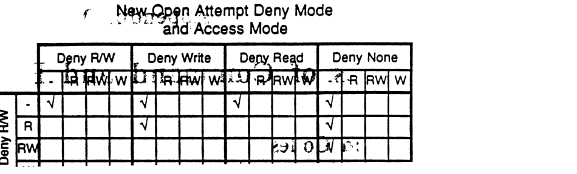

# ## AFP's Use of ASP

| Field | Value |
|-------|-------|
| **Source** | 022_AppleTalkFilingProtocolEngineeringTechnicalNotes |
| **Chapter** | 8 |
| **Pages** | 105–112 |
| **Converted** | 2026-04-04 |
| **Engine** | gemini-flash |

---

# Chapter 8

## AFP's Use of ASP

The AppleTalk Filing Protocol uses the transport services of the AppleTalk Session Protocol (ASP). This chapter discusses the manner in which the AFP calls are conveyed via ASP. For this purpose we refer to various terms defined in the ASP specification document. For these definitions, the reader must turn to that document.

In the case of all these calls, the AFP level variable *FPError* is returned as the ASP-level *CmdResult*. Also, the AFP-level Command packet is conveyed as an ASP-level *Command block*, while the AFP-level Reply packet is returned as the ASP-level *Command Reply block*.

### Finding a Server

To find an AFP server, an NBP request must be issued for objects of type "AFPServer".

### Getting Server Information

A workstation AFP client makes an *FPGetSrvrInfo* call to obtain server information needed before an AFP level login can be attempted. The *FPGetSrvrInfo* call is converted by the workstation's AFP into an ASP level *SPGetStatus* call. The server information is returned by ASP as the *SPGetStatus* call's *Command reply block*. Note that the *SAddr* (internet address of the file server's SLS) supplied with the *FPGetSrvrInfo* call is used as the *SLSEntityIdentifier* required by the *SPGetStatus* call.

### Login On the File Server

Having obtained the server information, the AFP client initiates the process for logging in on the file server. This is achieved by AFP in a two step fashion.

First, AFP issues an *SPOpenSession* call to establish an ASP-level session. If for some reason this ASP session can not be established, then an error is returned to the workstation's AFP client and login is abandoned.

Once the ASP session has been opened, then the workstation's AFP issues an *SPCommand* call to send the FPLogin's *Command* to the file server's AFP. This FPLogin Command is sent as the *Command block* of the *SPCommand*. Beyond this point a series of *SPCommand*'s may be necessary to complete the login process (this depends on the User Authentication Method being employed in the login).

If at any point, in this process the server returns an error indicating that the login can not be completed successfully, then the workstation's AFP must make an *SPCloseSession* call to close the ASP session. This is vital, otherwise the session will remain open for no purpose. After closing the session, the workstation's AFP returns an appropriate error message to its client.

---

# Logout of the File Server

When the workstation client wishes to terminate its conversation with the file server, it issues an *FPLogout* call to its AFP. The workstation's AFP again uses a two step process to carry out this logout.

First, it issues an *SPCommand* to convey the *FPLogout* command to the server. Having done so, it then terminates the corresponding ASP session by making an *SPCloseSession* call.

## Other AFP Calls

Every other AFP calls (with the exception of *FPWrite*) is conveyed by AFP via an *SPCommand* call.

An *FPWrite* call is sent by the workstation's AFP by making an *SPWrite* call.

It should be noted that in the case of the *FPRead*, *FPWrite*, and *FPEnumerate* calls, a partial completion of the call is possible. By this we mean that less than the desired length is read (or written). There are two reasons for this.

First, in the case of an *FPRead* call, the end-of-file may be reached before the requested number of bytes have been read. In the case of an *FPRead* or *FPWrite* call, a locked byte range may be reached before all the requested bytes have been read or written.

A second reason is related to the *QuantumSize* related to the session protocol. In the case of AppleTalk, the largest data block that may be written or read through ASP is equal to 4624 bytes, the *QuantumSize* size. Thus the underlying *SPCommand* (in the case of an *FPRead* or *FPEnumerate*) or *SPWrite* (in the case of an *FPWrite*) will complete with an actual received or written reply size smaller than the requested value. Therefore, if no error was returned, the AFP must issue an additional *SPCommand* or *SPWrite* call to complete the AFP request.

Although AFP may have to issue several ASP calls to complete a single AFP command, the first ASP command should convey the actual sizes requested by the user to allow the server a chance to optimize. Subsequent ASP calls should convey sizes that have been adjusted to reflect how much of the original command has already been completed.

---

# Appendix A
# User Authentication Methods

As noted in the main body of this document, AFP version 1.1 provides three standard user authentication methods. These correspond to UAM strings "NoUserAuthent", "Cleartxt passwd" and "Randnum exchange". [Note: these strings should be used in a case-insensitive fashion].

## No User Authentication

The first of these in fact corresponds to no user authentication (UAM = "NoUserAuthent") and as such needs no specification. Thus, no user name or password information is required in the FPLogin command which therefore has no UserAuthInfo field.

Any server can accept a user login using this method. If the server handles the user-authentication-based directory-level access control mechanism, then it must assign the user a special User ID and Group ID for that session, such that the user only obtains world's access rights for every directory in every server volume.

## User Authentication with Clear Text Password Transmission

The second standard method employs the transmission of the user's password in clear text (in addition to the user's name) in the FPLogin command packet. The UserAuthInfo part of the FPLogin command consists of the user's name (a string of up to 31 characters which follows the UAM field in the packet without padding) followed by a possible null byte and then the user's password. The user's password is an 8-byte quantity. If the user provides a shorter password then it must be padded (suffixed) with null ($00) bytes to make its length equal to 8 bytes. The permissible set of characters in passwords consists of all 8-bit characters with the most significant bit equal to 0.

User name comparison in servers must be case insensitive, but password comparison is to be case sensitive in this UserAuthenticationMethod. Of course, one could create a new UserAuthenticationMethod that performed case-insensitive password comparison.

It should be noted that this method should be used by workstations only if it is known that the intervening network is secure against "wire tapping", otherwise the password information can be picked up out of FPLogin command packets by anyone tapping the network.

## User Authentication Based on Random Number Exchange

---

| Function | Code |
|---|---|
| GetIconInfo | 52 |
| AddAPPL | 53 |
| RmvAPPL | 54 |
| GetAPPL | 55 |
| AddComment | 56 |
| RmvComment | 57 |
| GetComment | 58 |
| AddIcon | 192 |

---

# Appendix A

## User Authentication Methods

As noted in the main body of this document, AFP version 1.1 provides three standard user authentication methods. These correspond to UAM strings "NoUserAuthent", "Cleartxt passwrd" and "Randnum exchange". [Note: these strings should be used in a case-insensitive fashion].

### No User Authentication

The first of these in fact corresponds to no user authentication (UAM = "No User Authent") and as such needs no specification. Thus, no user name or password information is required in the *FPLogin* command which therefore has no *UserAuthInfo* field.

Any server can accept a user login using this method. If the server handles the user-authentication-based directory-level access control mechanism, then it must assign the user a special User ID and Group ID for that session, such that the user only obtains world's access rights for every directory in every server volume.

### User Authentication with Clear Text Password Transmission

The second standard method employs the transmission of the user's password in clear text (in addition to the user's name) in the *FPLogin* command packet. The *UserAuthInfo* part of the *FPLogin* command consists of the user's name (a string of up to 31 characters which follows the UAM field in the packet without padding) followed by a possible null byte and then the user's password. The user's password is an 8-byte quantity. If the user provides a shorter password then it must be padded (suffixed) with null ($00) bytes to make its length equal to 8 bytes. The permissible set of characters in passwords consists of all 8-bit characters with the most significant bit equal to 0.

User name comparison in servers must be case insensitive, but password comparison is to be case sensitive in this UserAuthenticationMethod. Of course, one could create a new UserAuthenticationMethod that performed case-insensitive password comparison.

It should be noted that this method should be used by workstations only if it is known that the intervening network is secure against "wire tapping", otherwise the password information can be picked up out of *FPLogin* command packets by anyone tapping the network.

### User Authentication Based on Random Number Exchange

---

In environments where the network is not secure against tapping, a more secure method based on a random number exchange between the server and the workstation can be used. In this method, the user's password is never sent over the network and hence cannot be picked up by tapping. In fact, it is essentially impossible (as secure as the basic encryption method) to derive the password from the information that is sent over the network.

### New Open Attempt Deny Mode and Access Mode



| | | Deny R/W | | | | Deny Write | | | | Deny Read | | | | Deny None | | | |
| :--- | :--- | :---: | :---: | :---: | :---: | :---: | :---: | :---: | :---: | :---: | :---: | :---: | :---: | :---: | :---: | :---: | :---: |
| | | - | R | RW | W | - | R | RW | W | - | R | RW | W | - | R | RW | W |
| **Deny R/W** | **-** | √ | | | | √ | | | | √ | | | | √ | | | |
| | **R** | | | | | √ | | | | | | | | √ | | | |
| | **RW** | | | | | | | | | | | | | | | | |

```
GetIconInfo      52
AddAPPL          53
RmvAPPL          54
GetAPPL          55
AddComment       56
RmvComment       57
GetComment       58
AddIcon         192
```

---

# Error Codes

Each call returns an Error code which is a 4-byte integer. The various error values are listed below together with their mnemonic names (these are the names used in Chapter 7). The values given below are in hexadecimal and decimal (base-10) form.

| Error Mnemonic | Hex Value | Decimal Value |
|---|---|---|
| NoErr | $0 | 0 |
| AccessDenied | $FFFFEC78 | -5000 |
| AuthContinue | $FFFFEC77 | -5001 |
| BadUAM | $FFFFEC76 | -5002 |
| BadVersNum | $FFFFEC75 | -5003 |
| BitmapErr | $FFFFEC74 | -5004 |
| CantMove | $FFFFEC73 | -5005 |
| DenyConflict | $FFFFEC72 | -5006 |
| DirNotEmpty | $FFFFEC71 | -5007 |
| DiskFull | $FFFFEC70 | -5008 |
| EOFErr | $FFFFEC6F | -5009 |
| FileBusy | $FFFFEC6E | -5010 |
| FlatVol | $FFFFEC6D | -5011 |
| ItemNotFound | $FFFFEC6C | -5012 |
| LockErr | $FFFFEC6B | -5013 |
| MiscErr | $FFFFEC6A | -5014 |
| NoMoreLocks | $FFFFEC69 | -5015 |
| NoServer | $FFFFEC68 | -5016 |
| ObjectExists | $FFFFEC67 | -5017 |
| ObjectNotFound | $FFFFEC66 | -5018 |
| ParamErr | $FFFFEC65 | -5019 |
| RangeNotLocked | $FFFFEC64 | -5020 |
| RangeOverlap | $FFFFEC63 | -5021 |
| SessClosed | $FFFFEC62 | -5022 |
| UserNotAuth | $FFFFEC61 | -5023 |
| CallNotSupported | $FFFFEC60 | -5024 |
| ObjectTypeErr | $FFFFEC5F | -5025 |
| TooManyFilesOpen | $FFFFEC5E | -5026 |
| ServerGoingDown | $FFFFEC5D | -5027 |
| CantRename | $FFFFEC5C | -5028 |
| DirNotFound | $FFFFEC5B | -5029 |
| IconTypeError | $FFFFEC5A | -5030 |

---

# Appendix E

# List of Abbreviations

| | |
|---|---|
| AFI | AppleTalk filing interface |
| AFP | AppleTalk Filing Protocol |
| ALAP | AppleTalk Link Access Protocol |
| ASP | AppleTalk Session Protocol |
| ATP | AppleTalk Transaction Protocol |
| CAM | Current Access Mode |
| CDM | Current Deny Mode |
| DDP | Datagram Delivery Protocol |
| GMT | Greenwich Mean Time |
| HFS | Macintosh's hierarchical file system |
| MFS | the earlier Macintosh (flat) file system |
| NBP | Name Binding Protocol |
| NFI | Native filing interface |
| SLS | Session listening socket |
| UAM | User authentication method |

---
