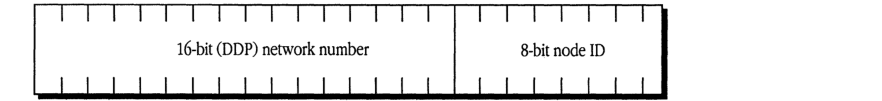
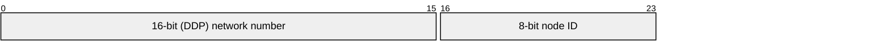

# New Terms in AppleTalk Phase 2

| Field | Value |
|-------|-------|
| **Source** | C0144LLA_AppleTalk_Phase_2_Protocol_Specification_Addendum_1989 |
| **Chapter** | 2 |
| **Pages** | 9–12 |
| **Converted** | 2026-04-04 |
| **Engine** | gemini-flash |

---

# Chapter 2 New Terms in AppleTalk Phase 2

A NUMBER of new terms are introduced in AppleTalk Phase 2. These terms are described briefly in this chapter and are dealt with in more detail in later sections of this document. ■

---

## Extended AppleTalk network

To allow the addressing of more than 254 nodes on a network, AppleTalk Phase 2 defines the concept of an **extended AppleTalk network**, which is identified by a *range* of network numbers rather than a single network number. A network number range is made up of a series of contiguous network numbers (for example, 1000–1099). An extended network can also have a range of one (for example, 3–3).

Delivery of packets to a node on an extended network must now be done by using both the node's 8-bit node ID *and* a 16-bit network number that is within the range assigned to the network (see *Figure 2-1*). This expands the prior 2^8 address limit (254 nodes) to approximately 2^24 addresses, or more than 16 million nodes, that can be uniquely addressed on an extended network.

AppleTalk Phase 2 places further restrictions on the values of network numbers that can be assigned by network administrators to AppleTalk networks. As with AppleTalk Phase 1, network numbers 0 and $FFFF cannot be used by any AppleTalk network. Furthermore, the range of numbers $FF00 to $FFFE (referred to as the *startup range*, described below) is now reserved; it is not available for assignment to actual networks in an internet environment.

■ **Figure 2-1** Node addressing in AppleTalk Phase 2

| Field | Bit offset | Width (bits) | Description |
|---|---|---|---|
| 16-bit (DDP) network number | 0 | 16 | A 16-bit network number within the range assigned to the network. |
| 8-bit node ID | 16 | 8 | An 8-bit identifier for the node on the network. |

## Nonextended network

An AppleTalk network that does not implement extended addressing, such as a LocalTalk network or an EtherTalk 1.0 network, is referred to as a **nonextended network**.

## Provisional address

The dynamic process by which a node selects its node ID is now extended to include selecting its network number as well.

This is done in two steps. In order to pick a network number within the range of numbers assigned to its network, the node must collaborate with the routers connected to the network. However, this communication itself requires that the node select an address, known as a **provisional address**, including a provisional network number. It is essential that this provisional network number value not conflict with any other network numbers already in use on an internet. The selection of the provisional address involves the use of a specially reserved range of network numbers known as the startup range.

### Network number startup range

As in AppleTalk Phase 1, a node saves its most recently used address in parameter RAM (pRAM) and attempts to use this address as a *provisional address* when restarted. However, if no address is found in pRAM, the node selects its provisional network number from a **startup range**, which is specified as $FF00–$FFFE. *This is a reserved range of network numbers that should never be assigned to any AppleTalk network in an internet environment.*

### Final address

If an internet router is running on a network, or if one is started after the node has started up, the provisional address that a node had acquired upon startup is replaced by a **final address**. The network number in this address is selected from the range of network numbers actually assigned to the network by a seed router. This final address is unique on the internet and can be used without risk of address conflict.

### Network-wide broadcast

AppleTalk Phase 2 defines a **network-wide broadcast**, which is a broadcast intended for all nodes on a given network. It is sent to destination network $0000, node $FF, and received and accepted by every node on the network.

### Zones list

On an extended AppleTalk network, *there is no strict relationship between zone names and network numbers.* In fact, two nodes having the same network number can be in different zones. In AppleTalk Phase 2, a list of zone names is associated with each extended network. A node on an extended network can belong to any one of the zones in that network's **zones list**. The zones list for an extended network is assigned by a network administrator when setting up seed routers for the network.

### Default zone

The selection of the zone to which a node will belong is typically done by that node's user. For certain nodes, such as servers, which do not have a user interface or display capabilities, this is not feasible. For such nodes, AppleTalk Phase 2 identifies a zone to which any node on an extended network will automatically belong until a different zone is explicitly selected for that node. This zone is known as the **default zone** for that extended network. A node can obtain the name of its default zone from a router.

### Zone multicast address

To prevent NBP LookUp broadcasts intended for nodes belonging to a given zone from interrupting *all* AppleTalk nodes on an extended network, each node on an extended network is assigned a **zone multicast address**. The zone multicast address is a data-link-dependent multicast link-level address at which the node will receive the NBP broadcasts directed to its zone. This link-level multicast address is provided by the network's routers.

### Zone-specific broadcast

A **zone-specific broadcast** is a broadcast intended only for nodes belonging to a given zone. It is sent to a link-level zone multicast address and the AppleTalk network address $0000, node $FF, and is accepted only by nodes belonging to the zone indicated in the broadcast packet. (See the section "NBP" in Chapter 4.)

### IEEE 802.2 and SAP

The Institute of Electrical and Electronics Engineers (IEEE) **802.2** standard defines service interfaces and packet formats for both connectionless and connection-based data-link service. The AppleTalk Phase 2 EtherTalk and TokenTalk link access protocols (ELAP and TLAP) use the 802.2 Type 1 format, which corresponds to the 802.2 connectionless service. In this standard, a **service access point (SAP)** is defined to differentiate between the different client protocol stacks using 802.2. The SAP to which AppleTalk packets are sent is $AA, which is reserved for use by protocols that are not defined by the IEEE.

### SNAP

To distinguish between the different protocol families using the $AA SAP, all packets sent to this SAP must begin with a 5-byte protocol discriminator. The use of a protocol discriminator for the $AA SAP is known as the **Sub-Network Access Protocol (SNAP)**. The format for an 802.2 Type 1 SNAP packet is shown in the descriptions of ELAP and TLAP in Chapter 4, "Protocol Details."

