# Protocol Details

| Field | Value |
|-------|-------|
| **Source** | C0144LLA_AppleTalk_Phase_2_Protocol_Specification_Addendum_1989 |
| **Chapter** | 4 |
| **Pages** | 19–42 |
| **Converted** | 2026-04-04 |
| **Engine** | gemini-flash |

---

# Chapter 4 Protocol Details

THE FOLLOWING SECTIONS DESCRIBE new aspects of AppleTalk protocols and changes in protocol packet formats brought about by the architectural changes of AppleTalk Phase 2. ■

## AppleTalk data links

AppleTalk data links must support some form of broadcast mechanism, a method of sending packets to *all* nodes connected to the data link.

It is desirable that the link support multicast addressing. In particular, one of these multicast addresses would be used as a means to send a packet to all AppleTalk nodes on a network. The use of this multicast address, known as the **AppleTalk broadcast data-link address**, will ensure that the packet is received by AppleTalk nodes only, without disruption of non-AppleTalk nodes.

Data links that support multicast addresses should also define a number of these to be used as zone multicast addresses. Each AppleTalk zone on the data link must be mapped to one of these addresses, as specified in the description of ZIP later in this chapter.

An AppleTalk node should be able to receive packets sent to

* the node's data-link address
* the AppleTalk broadcast address
* the multicast address for the node's zone

## ELAP and TLAP

The EtherTalk and TokenTalk link access protocols (ELAP and TLAP) provide connectionless service using IEEE 802.2 Type 1 packet formats. Packets are sent to SAP $AA. The SNAP protocol discriminator for AppleTalk is $080007809B (Apple's company code followed by the EtherTalk protocol type).

Figure 4-1 shows AppleTalk packet formats for ELAP and TLAP. The data portion of the packet begins with the long format DDP header. There is no LLAP-style header.

■ **Figure 4-1** AppleTalk packet formats

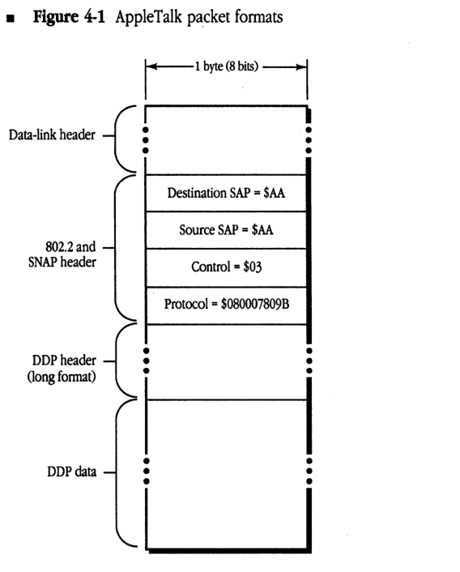

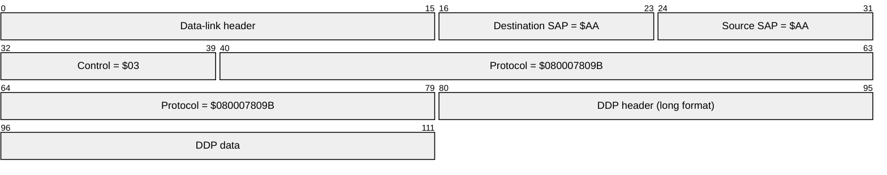

| Field | Bit offset | Width (bits) | Description |
|---|---|---|---|
| Data-link header | 0 | Variable | Specific header for the underlying data-link protocol. |
| Destination SAP | Variable | 8 | Destination Service Access Point, fixed value $AA for AppleTalk. |
| Source SAP | Variable + 8 | 8 | Source Service Access Point, fixed value $AA for AppleTalk. |
| Control | Variable + 16 | 8 | LLC Control field, fixed value $03. |
| Protocol | Variable + 24 | 40 | SNAP Protocol Identifier for AppleTalk, fixed value $080007809B. |
| DDP header (long format) | Variable + 64 | Variable | Long format Datagram Delivery Protocol header. |
| DDP data | Variable | Variable | The data payload of the AppleTalk DDP packet. |

Table 4-1 specifies the AppleTalk broadcast and zone multicast addresses used by ELAP and TLAP.

■ **Table 4-1** Broadcast and zone multicast addresses for ELAP and TLAP

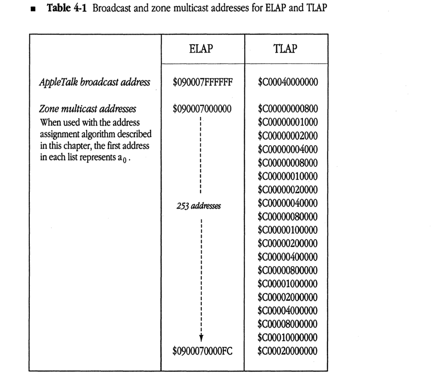

| | ELAP | TLAP |
| :--- | :--- | :--- |
| *AppleTalk broadcast address* | $090007FFFFFF | $C00040000000 |
| *Zone multicast addresses* When used with the address assignment algorithm described in this chapter, the first address in each list represents a0. | $090007000000 \| \| 253 addresses \| \| V $0900070000FC | $C00000000800 $C00000001000 $C00000002000 $C00000004000 $C00000008000 $C00000010000 $C00000020000 $C00000040000 $C00000080000 $C00000100000 $C00000200000 $C00000400000 $C00000800000 $C00001000000 $C00002000000 $C00004000000 $C00008000000 $C00010000000 $C00020000000 |

## AARP

AARP packets are also encapsulated in the IEEE 802.2 format on data links that support this standard. The SNAP protocol discriminator for AARP packets is $00000080F3. The AARP packet format is shown in Figure 4-2.

AARP cannot use the following reserved addresses when probing for an AppleTalk address:

- $nnnn00
- $nnnnFE
- $nnnnFF
- any address using $0000 or $FFFF as the network number (nnnn)

When probing, AARP should send ten probes, at one-fifth second intervals. AARP probes and requests should be sent to the AppleTalk broadcast address.

* Figure 4-2 AARP packet format

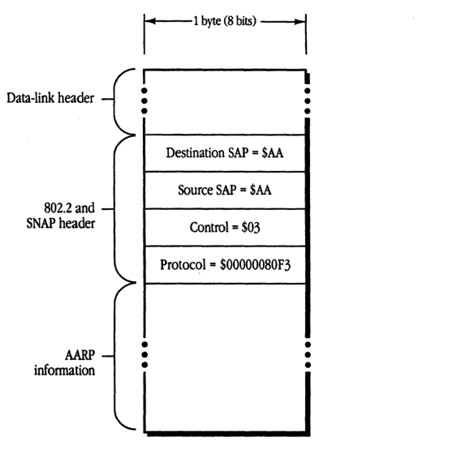

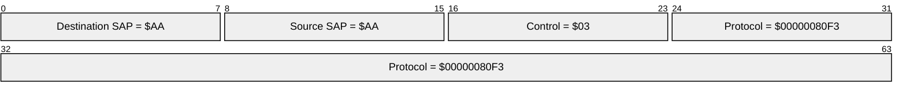

| Field | Bit offset | Width (bits) | Description |
|---|---|---|---|
| Data-link header | - | Variable | Link-layer specific header preceding the SNAP header |
| Destination SAP | 0 | 8 | Destination Service Access Point, fixed at $AA |
| Source SAP | 8 | 8 | Source Service Access Point, fixed at $AA |
| Control | 16 | 8 | Unnumbered information control field, fixed at $03 |
| Protocol | 24 | 40 | SNAP protocol ID, fixed at $00000080F3 (AppleTalk ARP) |
| AARP information | 64 | Variable | AARP protocol-specific packet data |

The exact sequence in which AARP tries 24-bit addresses while probing is not specified here. Subject to the constraints of the range within which AARP is choosing the address, it is free to choose addresses in any order.

## DDP

The DDP packet format remains unchanged from AppleTalk Phase 1; however, only the long DDP header format is used. A destination network number of $0000 is accepted by all nodes on the network (see "Packet Filtering" in this section).

### Sending packets to a router

DDP provides an added service in routing nodes on extended networks, for use primarily by the NBP routing algorithm. A DDP destination address of the form $nnnn00 is allowed, meaning "any router connected to a network whose network number range includes nnnn (or whose network number is nnnn)." A packet with such an address is forwarded through an internet via the normal DDP forwarding mechanism until it reaches such a router. This router accepts the packet as if it were sent to the packet's destination address.

## Support for zone multicasts

DDP in a routing node must provide the node's router with the ability to send a packet to a specific zone multicast address. This ability is used by NBP. Such an ability should *not* be provided in nonrouting nodes.

## Packet filtering

DDP in nonrouting nodes on extended networks should always accept datagrams addressed to destination network number zero, node ID $FF (these are network-wide or zone-specific broadcasts). However, DDP on extended networks should *not* accept datagrams destined for network zero and any node ID other than $FF (even the node's own). DDP on nonextended networks should accept both. The DDPRead algorithm shown in *Figure 4-3* illustrates this process.

### Figure 4-3 The DDPRead algorithm

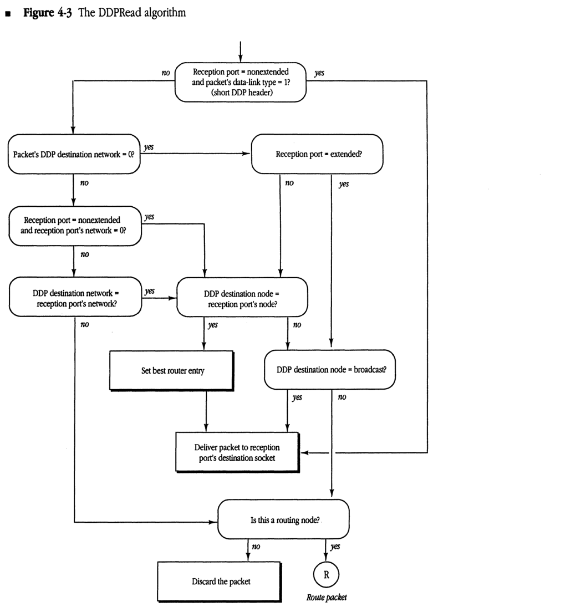

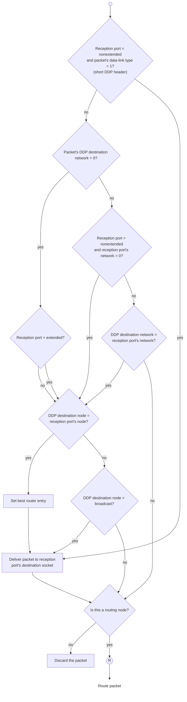

## DDP routing details

The routing algorithm for all routers has changed (particularly on extended networks). Figure 4-4 illustrates these changes.

As stated above, all routers must accept datagrams received for a node ID of zero if they are connected to the network indicated in the datagram. In addition, a router on an extended network should discard any broadcast packet that would otherwise be forwarded out through the same port that it was received. This can be done by examining the destination network number of datagrams whose destination node ID is $FF. If the destination network is within the network number range of the network on which the datagram was received, the datagram should be discarded; otherwise it should be forwarded. (If the destination network is zero or equal to THIS-NET, the packet is delivered internally and not forwarded.)

* **Figure 4-4** Datagram routing algorithm for a router

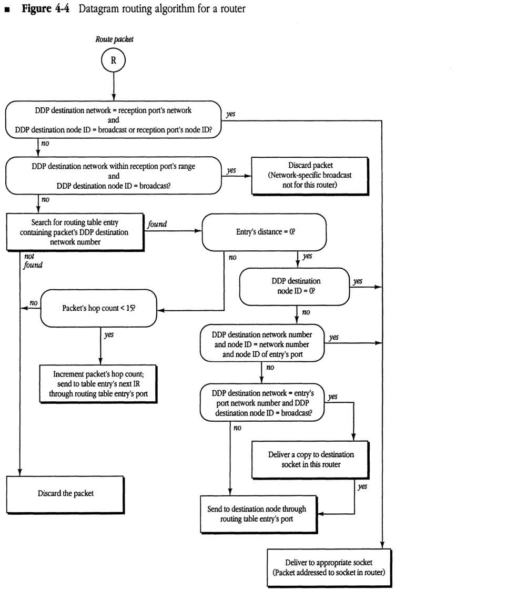

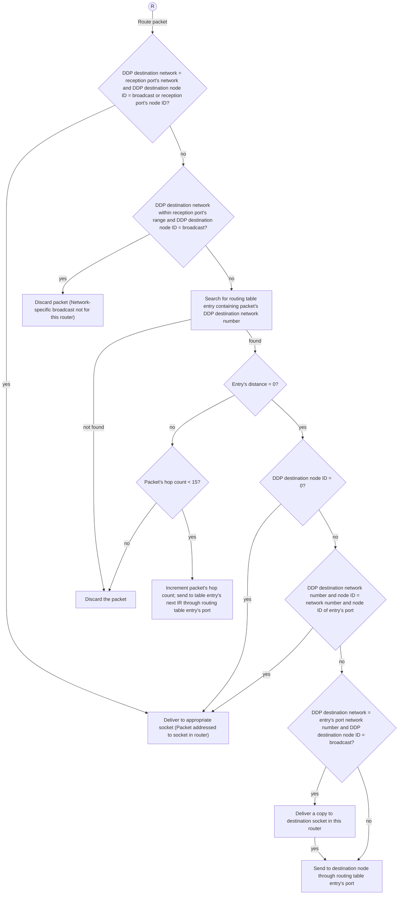

## Selecting the best router

It is desirable for nonrouting nodes to send each datagram to the router yielding the shortest route to the datagram's destination network—the "best" router. Although the current specification does not require this, an optional strategy follows for implementing a "best routing" DDP algorithm in nonrouting nodes. This strategy requires a capability in nonrouting nodes to send a packet to a specific data-link level address.

When a packet arrives from an off-network node, DDP reads the data-link-level source address. This is the data-link address of the last router on the route from the datagram's originating network. This router should generally be the optimal "next router"—in terms of hops—in the route back to that network. DDP maintains a cache of "best routers" for networks that have recently been heard from and sends datagrams to those routers for forwarding to those networks. If there is no cache entry for a network, DDP sends the datagram to A-ROUTER, expecting that a response packet will provide the information necessary to make an entry in the cache.

Note that a node's best-router cache entries need to be aged fairly quickly so that when a router goes down, an alternate route can be adopted (if one is available) before connections are broken.

## The RTMP stub

The following changes are specified for the RTMP stub in nodes on an extended network.

### Aging router information

The router aging time is reduced to 50 seconds. When a router is aged out, the RTMP stub must expand THIS-NETWORK-RANGE back to 1-$FFFE and set the node's zone name back to "*". It should also delete the node's zone multicast address, if one has been set.

### Processing incoming RTMP packets

If the node's A-ROUTER parameter is nonzero (that is, the node knows about a router), the RTMP stub should accept an RTMP packet only if the network range indicated by the packet exactly matches the node's values for THIS-NETWORK-RANGE. Thus, if a node's network range were 3-4, it would not process a packet indicating a network range of 3-6.

If, however, A-ROUTER is zero (the node is *not* aware of any router), the RTMP stub should accept an RTMP packet if the packet indicates a range within which the node's network number is valid. If the node's network number is not within the range indicated by this tuple, the RTMP packet is rejected (see "When a Router First Comes Up" in Chapter 3). When an RTMP packet is accepted, THIS-NETWORK-RANGE is set to the value indicated by the packet and A-ROUTER is set to the sender's 24-bit AppleTalk address.

Note that this scheme allows a network range to be expanded without restarting all the nodes on that network. If a range is originally 3-4, but the routers are reconfigured to set it to 3-6, nodes will first age out the 3-4 value of THIS-NETWORK-RANGE (since none of the routers would be sending it) and then replace it with the range 3-6 obtained from subsequent RTMP packets.

## RTMP

The following changes are specified for implementing RTMP.

### Packet formats

RTMP data packets on both extended and nonextended AppleTalk networks can now contain tuples in two forms: a network number or a network range. The first tuple in a packet sent on an *extended* network is the range for that network, allowing nodes that receive this packet to determine their network range. This tuple may be repeated later in the packet. Figure 4-5 illustrates RTMP packet formats for extended and nonextended networks.

RTMP data packets on extended networks are sent to destination address $0000FF using a network-wide broadcast. The "sender's network number" field always indicates the high 16 bits of the sender's address. The "sender's node ID" field indicates the low 8 bits of that address. *On both extended and nonextended networks*, each tuple has a flag indicating whether it is a 6-byte tuple (range start, distance, range end, and a version number byte) or a 3-byte tuple (network number, distance). A tuple for an extended network with a range of one (for example, 3-3) should still be sent as a network range tuple.

The RTMP header of packets on both extended and nonextended networks has been expanded to include additional information:

*   On an extended network, the header includes a tuple that indicates the network range of this network. This tuple contains a distance of zero and the version number of RTMP being used, which for AppleTalk Phase 2 is $82.
*   On a nonextended network, the header includes 2 bytes of zero (to keep tuple alignment the same as AppleTalk Phase 1 RTMP packets), followed by the version number of $82.

* **Figure 4-5** RTMP packet formats

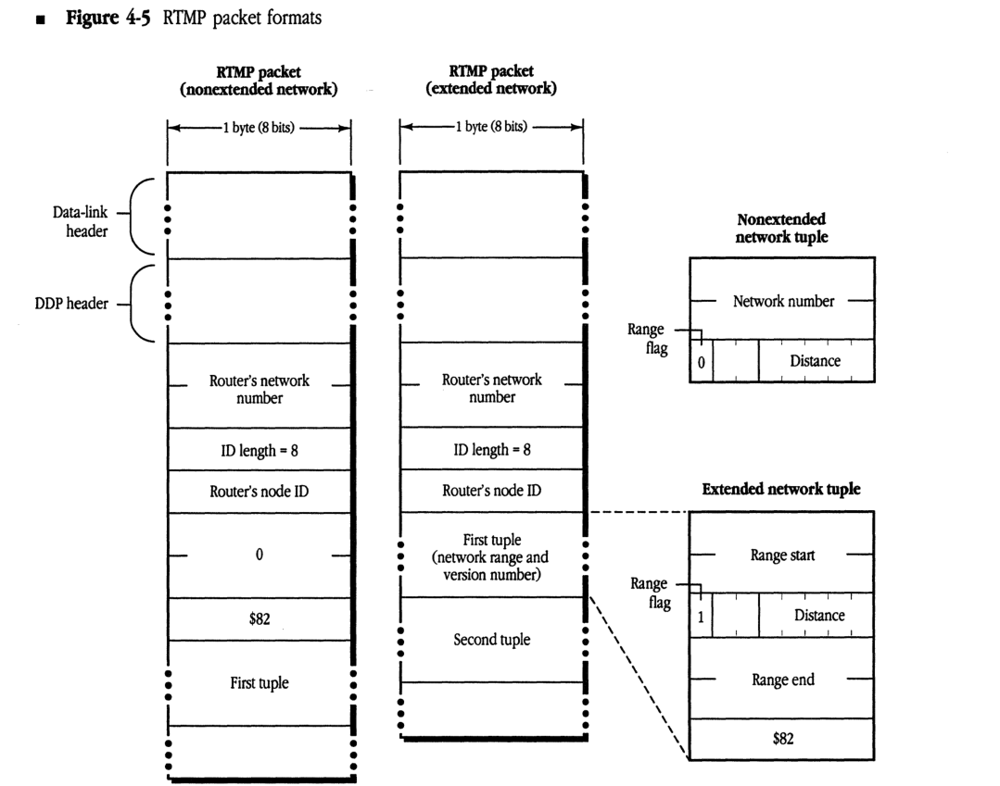

#### RTMP packet (nonextended network)

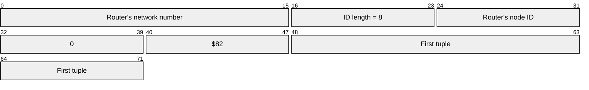

| Field | Bit offset | Width (bits) | Description |
|---|---|---|---|
| Router's network number | 0 | 16 | The network number of the router. |
| ID length | 16 | 8 | The length of the router's node ID (fixed at 8 bits). |
| Router's node ID | 24 | 8 | The node ID of the router. |
| 0 | 32 | 8 | A zero byte. |
| $82 | 40 | 8 | The RTMP version identifier ($82 for AppleTalk Phase 2). |
| First tuple | 48 | 24 | The first routing table entry tuple (3 bytes). |

#### RTMP packet (extended network)

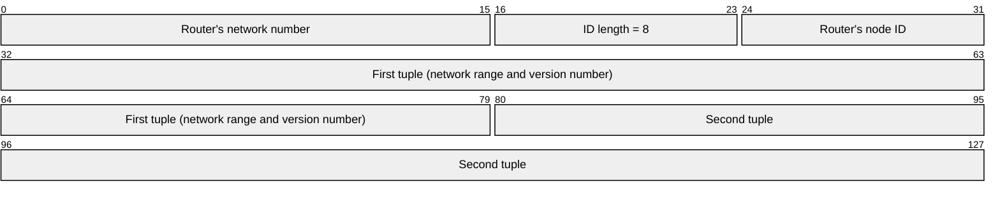

| Field | Bit offset | Width (bits) | Description |
|---|---|---|---|
| Router's network number | 0 | 16 | The network number of the router. |
| ID length | 16 | 8 | The length of the router's node ID (fixed at 8 bits). |
| Router's node ID | 24 | 8 | The node ID of the router. |
| First tuple | 32 | 48 | The first routing table entry tuple (6 bytes), containing network range and version number. |
| Second tuple | 80 | 48 | The second routing table entry tuple. |

#### Nonextended network tuple

| Field | Bit offset | Width (bits) | Description |
|---|---|---|---|
| Network number | 0 | 16 | The network number of the destination network. |
| Range flag | 16 | 1 | Set to 0 to indicate a nonextended network tuple. |
| Distance | 17 | 7 | The hop count to the destination network. |

#### Extended network tuple

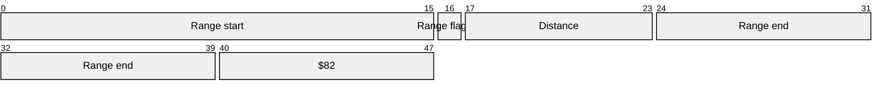

| Field | Bit offset | Width (bits) | Description |
|---|---|---|---|
| Range start | 0 | 16 | The start of the network number range. |
| Range flag | 16 | 1 | Set to 1 to indicate an extended network tuple. |
| Distance | 17 | 7 | The hop count to the destination network. |
| Range end | 24 | 16 | The end of the network number range. |
| RTMP version | 40 | 8 | The RTMP version number ($82). |

RTMP request packets remain the same as in AppleTalk Phase 1 (however, they can now be used to request three types of responses, as described later in this chapter). RTMP responses on extended networks should include the initial network range tuple.

### Maintaining routing tables

Routers must maintain their routing table on a range-by-range basis for extended networks. Each range has a list of zone names associated with it (the order of zone names in this list is unspecified). Entries for nonextended networks should contain only a single network number, so that 3-byte tuples can be sent out for these entries.

The routing table update process must be extended to handle network range mismatches. For example, an incoming RTMP packet might contain a tuple indicating network range 3-57, while the router's current routing table might contain an entry for range 2-58 (or 2-3, or 22-33). Such overlapping network ranges clearly indicate an internet configuration error.

In order to minimize the effect on the internet of a misconfigured router being brought on-line, the following is specified: If an incoming RTMP packet contains a tuple for which there is no exact match in the routing table (that is, if there is no entry with the same starting and ending network numbers), but that tuple does overlap with part of some entry's range, that tuple should be disregarded. (In evaluating network range matches, a nonextended network number should be considered as a range of one, for example, 3-3.)

### Split horizon

AppleTalk Phase 2 specifies a technique known as **split horizon** for use in sending routing tables on both extended and nonextended networks. This technique significantly reduces internet traffic caused by large numbers of routers exchanging their routing tables.

Split horizon reduces the number of redundant routing table entries exchanged by routers. As illustrated in *Figure 4-6*, router B need not transmit the tuple for network n to router A, since router A itself is on the path to that network. Similarly, it is unnecessary for router B to transmit this information to other neighboring routers (C, D), as they will acquire it from router A. In such a case, particularly on a backbone, most of the routing table need not be sent out at all.

To implement split horizon, a simple modification is made to the RTMP routing table sending algorithm: In a routing table sent out a given port,

* omit all entries for which the next router is on the network connected to that port
* include information for directly connected networks (for example, router A must transmit the tuple for network n out both its ports)

■ **Figure 4-6** A scenario for split-horizon processing

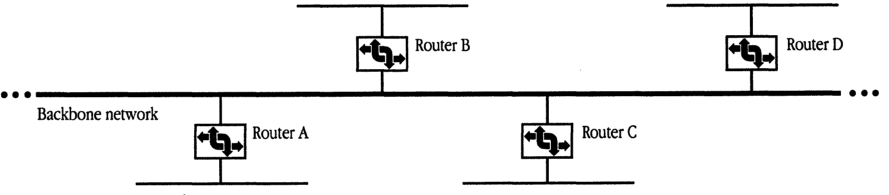

### Notify neighbor

RTMP now includes a new aging procedure called **notify neighbor**. Under notify neighbor, whenever a routing table's entry state is "Bad," instead of omitting that entry from the broadcasted routing table, the entry is sent *with a distance of 31*. This entry indicates to receiving routers that the entry's network is no longer reachable through the sending router, and that an alternate route, if available, should be adopted. This entry is sent only if it would not otherwise be eliminated by split-horizon processing.

Upon receiving a tuple with an entry of distance 31, *if the router sending that tuple is the forwarding router for the associated network*, a router should immediately set the state of that entry to "Bad." In this way, the fact that a network is unreachable will propagate at the RTMP table sending rate. Note that, to minimize the effect of lost packets, the time for the "Bad" state is extended from one Validity timer to two Validity timers (from 20 to 40 seconds).

Routers that are knowingly going down or deactivating a port should, as a courtesy, use "notify neighbor" to inform other routers of this fact.

### RTMP requests

The RTMP request has been extended to allow for a variation called the **RTMP Route Data Request** or **RDR**. The RDR is useful for routing and network management purposes to obtain routing information from any router *on demand*.

The different types of RTMP request packets are distinguished by the value of the Command field, which is 1, 2, or 3:

* A Command field of 1 indicates a Network Information Request. (This is equivalent to the former RTMP Request.)
* A Command field of 2 indicates a Route Data Request using normal split-horizon processing.
* A Command field of 3 indicates a Route Data Request *without* using split horizon, causing the entire table to be returned.

Upon receiving an RDR, a router responds by sending its routing data *directly to the source socket* of the requesting node. (Normally, broadcasted RTMP data packets are sent to the well-known RTMP socket, 1—not to the requester's source socket.) An interested node can therefore obtain routing information by opening a socket and sending an RDR to a router through this socket. Note that a full response can consist of a number of packets, and that a tuple can never span two packets.

## NBP

NBP packet formats remain unchanged from AppleTalk Phase 1. However, several protocol changes are specified. NBP in a routing node must change *even if the router is connected only to nonextended networks*.

### The THIS-ZONE variable

NBP in nodes on extended networks must maintain a variable known as THIS-ZONE. In nonrouting nodes on extended AppleTalk networks, NBP must now verify that a LkUp packet is intended either for the zone to which the node belongs or for zone "*"; that is, NBP must match object, type, and zone. This is because more than one zone may correspond to the same zone multicast address (in fact, if the data link does not support multicast, all zones will correspond to the same zone multicast address, the AppleTalk broadcast address).

### Broadcast requests and forward requests

NBP on an *extended* network should never send out a BrRq for zone "*" (the router has no way of determining the node's zone, since there is no correspondence between network number and zone name). However, in the absence of a router, NBP should always broadcast LkUps to zone "*".

A router receiving a BrRq must first change any zone name of "*" (received from a nonextended network) to the node's actual zone name, and then change the packet type from BrRq to a new type, FwdReq (forward request). The value in the control field for a FwdReq packet is 4.

The router then uses DDP to send a FwdReq packet to each network whose zone list contains the desired zone. These request packets are sent to the NIS at address $nnnn00, where nnnn is the first network in each range.

The packet proceeds through the internet until it reaches a router directly connected to the intended destination network, where it is passed to the NBP process. The NBP process then changes the packet type to LkUp and sends this packet as a zone-specific multicast on the intended network. Specifically,

- If the packet is intended for an extended network, NBP changes the destination address to $0000FF, determines the multicast address associated with the intended zone, and calls DDP to send the packet to that zone multicast address through the appropriate port.
- If the packet is intended for a nonextended network, NBP simply changes the destination address to $nnnnFF and broadcasts the packet on that network.

A router on *nonextended* networks that receives a BrRq for zone "*" and has not yet discovered the zone name associated with the sender's network should broadcast a LkUp packet on that network with a zone name of "*". It should not, however, send out any FwdReq packets.

◆ *Note: A router receiving a BrRq for a zone that is in the zone list for one or more of the networks to which the router is directly connected should not send out FwdReq's for these networks. It should instead send out LkUp's to the appropriate zone multicast addresses.*

### Special characters

AppleTalk Phase 2 disallows the use of a character with value $FF as the first byte in an NBP object, type, or zone string. This value is reserved for future flexibility.

NBP has also been enhanced to provide additional wildcard support. The character ≈ ($C5) is now reserved in the object name and type strings and is used in a lookup to mean "a match of zero or more characters." Thus

* ≈abc matches abc, xabc, xxxabc, and so on
* abc≈ matches abc, abcx, and so on
* abc≈def matches abcdef, abcxdef, and so on

At most one ≈ is allowed in any one string. As a single, standalone character, ≈ has the same meaning as a single =, which must also continue to be accepted. The ≈ character has no special meaning in zone names.

## ATP

No changes in ATP are necessary to support the architectural changes in AppleTalk Phase 2. Clients using and implementing ATP will continue to work under AppleTalk Phase 2 as they did under AppleTalk Phase 1. However, the following change has been made to provide additional flexibility in ATP Exactly Once (XO) service.

There are 3 unused bits in the Command field of the ATP header. For XO request packets only, these 3 bits are used as an indicator of the length of the TRel timer that the transaction responder should use. In this way, the requester can indicate to the responder an approximate measure of how long to wait for the TRel. The values in the following list are specified.

| Value | Timer |
| :--- | :--- |
| 000 | 30 seconds |
| 001 | 1 minute |
| 010 | 2 minutes |
| 011 | 4 minutes |
| 100 | 8 minutes |

Other values for the XO request command field are reserved.

An ATP requesting client could use the echo protocol or other means to estimate the time for a TRel to be received and set this timer value accordingly. This value also depends, however, on the client's retransmission rate: If retransmitting slowly, the TRel timer should be set higher, in case a retransmitted request is lost. Certain session level protocols, such as PAP and ASP may wish to set this timer value to the value of their connection timer. Clients of ATP must be aware that nodes running AppleTalk Phase 1 may not process this new timer feature correctly.

## ZIP

ZIP includes several additional functions as well as new packet formats. Two new ZIP requests are used on extended networks in AppleTalk Phase 2:

* ZIP GetNetInfo is sent out by a node upon starting up to determine its network range and zone multicast address.
* ZIP GetLocalZones is used by a node to acquire the list of zone names that are valid for the node's network.

### ZIP GetNetInfo and NetInfoReply

ZIP GetNetInfo is an example of a *port-dependent* request. Like the RTMP request packet, such a packet requests information associated with a specific port—the port through which a packet is received.

ZIP GetNetInfo is generally sent as a network-wide broadcast to the ZIS when a node is first started up. If the node has a saved A-ROUTER value, the GetNetInfo request can be sent to this router. The response, ZIP NetInfoReply, is generally directed to the requesting node and socket.

If, however, the request was broadcasted network-wide and its source network number is invalid for the port through which it is received (and it is not in the startup range), the response is broadcasted back network-wide through the requesting port. This allows the router to communicate with a node that has started up with an invalid network number saved in pRAM.

In either case, the response contains the network range followed by a copy of the zone name from the request (so that the response can be matched with the request). This is followed by the zone multicast address for the node. If the request contained a valid zone name, this address is the zone multicast address for that zone. If the zone name was either invalid or NIL, this address is the zone multicast address of the default zone for that network, followed by the default zone name. (The default zone name for an extended network is set as part of the seed information in a router's port descriptor for the network. It must be one of the zones in that network's zone list. Nonseed routers discover this information as part of their startup process through a GetNetInfo request.)

As shown in Figure 4-7, the NetInfoReply also contains a number of flags, which can indicate that the requested zone name is invalid, that there is only one zone name for the network (in which case a GetLocalZones request is not needed), and that the data link does not support multicast (in which case the multicast address length in the packet will be set to zero).

### Figure 4-7 ZIP GetNetInfo and NetInfoReply packet formats

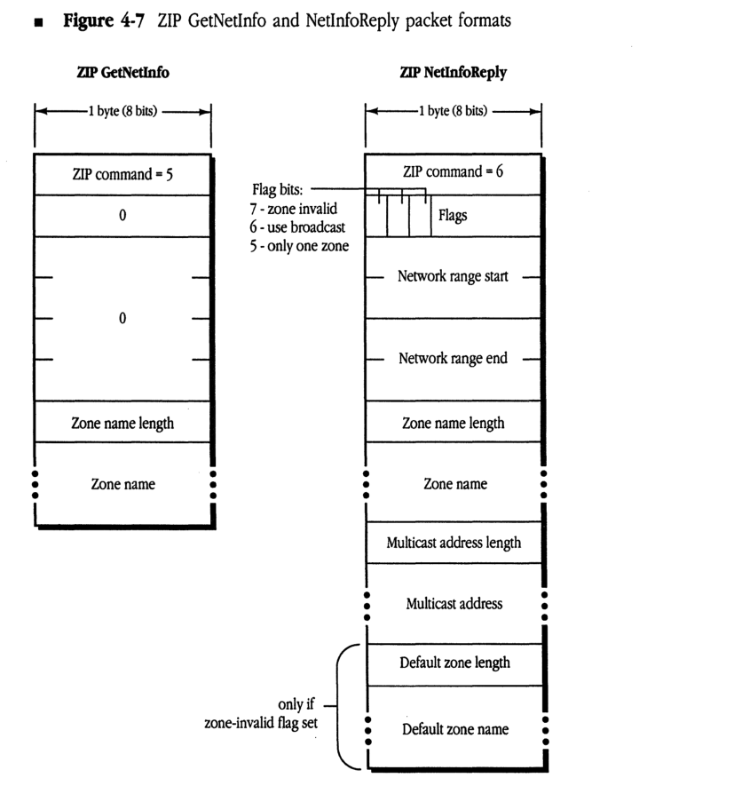

#### ZIP GetNetInfo

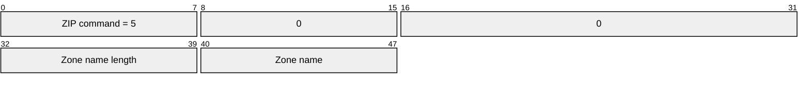

| Field | Bit offset | Width (bits) | Description |
|---|---|---|---|
| ZIP command | 0 | 8 | ZIP command = 5 |
| Reserved | 8 | 8 | 0 |
| Reserved | 16 | 16 | 0 |
| Zone name length | 32 | 8 | Length of the zone name field |
| Zone name | 40 | Variable | Name of the zone |

#### ZIP NetInfoReply

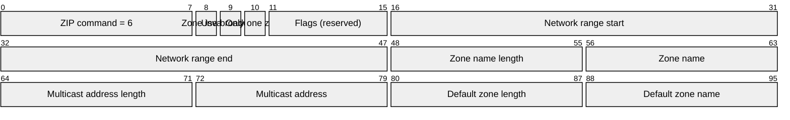

| Field | Bit offset | Width (bits) | Description |
|---|---|---|---|
| ZIP command | 0 | 8 | ZIP command = 6 |
| Flag: zone invalid | 8 | 1 | Bit 7: 1 if requested zone name was invalid |
| Flag: use broadcast | 9 | 1 | Bit 6: 1 if node should use broadcast |
| Flag: only one zone | 10 | 1 | Bit 5: 1 if only one zone for the network |
| Flags (reserved) | 11 | 5 | Bits 4-0 |
| Network range start | 16 | 16 | Start of network range |
| Network range end | 32 | 16 | End of network range |
| Zone name length | 48 | 8 | Length of the zone name field |
| Zone name | 56 | Variable | Name of the zone |
| Multicast address length | Variable | 8 | Length of the multicast address field |
| Multicast address | Variable | Variable | Zone multicast address |
| Default zone length | Variable | 8 | Included only if zone-invalid flag set: length of default zone name |
| Default zone name | Variable | Variable | Included only if zone-invalid flag set: name of default zone |

### Assignment of zone multicast addresses

Upon receiving a ZIP GetNetInfo request, the ZIP process in a router verifies that the specified zone name is valid for the network. If it is, ZIP obtains the associated multicast address and returns it in the reply.

To obtain the zone multicast address, ZIP first converts the zone name to uppercase (since zone names are case-insensitive). This conversion function is specified in *Inside Macintosh* and also *Inside AppleTalk* (Appendix D). The router then obtains a number, *h*, in the range 1–$FFFF, associated with this zone name by performing the DDP checksum algorithm (as documented in *Inside AppleTalk*) on each byte of the zone name (excluding the length byte). This number *h* is passed to the data link, which is assumed to provide *n* multicast addresses: a₀ through aₙ₋₁. (Addresses for EtherTalk and TokenTalk are specified in Table 4-1.) The multicast address for that zone, returned by the data link, is a_{(h mod n)}.

### ZIP Query and Reply

ZIP Query packets remain unchanged from AppleTalk Phase 1. The Network Number field for an extended network is set to the first network number in that network’s range. Multiple networks can still be included in one packet (both extended and nonextended networks can be mixed).

ZIP Reply packets remain exactly the same as previously—in cases where a network’s zone list will fit in one packet (17 maximum size zone names, or 36 zone names with an average length of 16 bytes). However, an extended network can now have more zones than can fit in a single packet. An extended network’s zone list is indicated by multiple entries. In each entry, the Network Number field is set to the first network number of the range for that network. Response packets again can contain multiple network entries, provided that an entry is completely contained within the packet. Figure 4-8 shows the Zip Reply packet format.

If a network’s zone list cannot fit in one ZIP response packet, a series of new packets are returned. These packets, called Extended ZIP Reply packets, have a new ZIP command byte (with a value of 8). Their format is the same as a ZIP Reply packet, except that the Network Count field has a new meaning. Instead of indicating the number of network/zone tuples in the packet (which can be determined by reading entries until the packet ends), this field indicates the total number of zones for the extended network. It will be the same for each Extended ZIP Reply packet for a given network and has a maximum value of 255. The queried router sends as many of these packets as is necessary. The querying router collects all the responses and can determine whether any have been lost. If any are lost, all the information must be requested again (the router must send another ZIP Query for that network). A router may use an Extended ZIP Reply packet even for a network whose zone list does fit in one packet; in this case, only one network’s zone list can be sent in the packet.

Note that until a router has all the zone information for a given network, it must respond to other routers’ ZIP Queries for that network as if it had *none* of the information.

■ Figure 4-8 ZIP Reply packet format

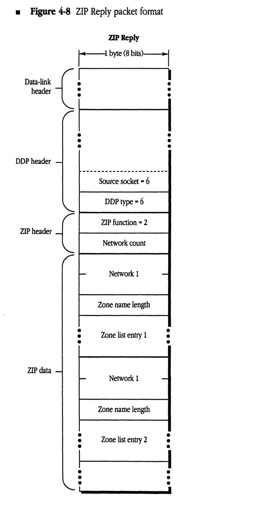

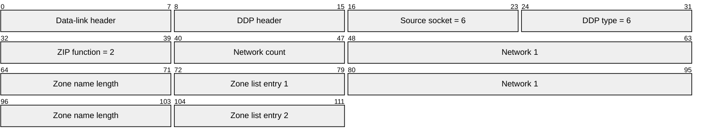

| Field | Bit offset | Width (bits) | Description |
|---|---|---|---|
| Data-link header | 0 | Variable | Header for the specific data link protocol (e.g., Ethernet, LocalTalk). |
| DDP header | Variable | Variable | Datagram Delivery Protocol header fields. |
| Source socket | Variable | 8 | The socket number of the source of the ZIP packet (must be 6). |
| DDP type | Variable | 8 | The DDP protocol type (must be 6 for ZIP). |
| ZIP function | Variable | 8 | ZIP function code (2 for ZIP Reply). |
| Network count | Variable | 8 | The number of network/zone pairs contained in the packet. |
| Network 1 | Variable | 16 | The first network number in the range (2 bytes). |
| Zone name length | Variable | 8 | The length of the first zone name string in bytes. |
| Zone list entry 1 | Variable | Variable | The first zone name string. |
| Network 1 | Variable | 16 | The second network number (diagram label repeats 'Network 1'). |
| Zone name length | Variable | 8 | The length of the second zone name string. |
| Zone list entry 2 | Variable | Variable | The second zone name string. |

### ZIP ATP requests

ZIP GetZoneList, which uses ATP, remains unchanged from AppleTalk Phase 1, but must be sent to the full 24-bit A-ROUTER address on extended networks. (GetZoneList requests that require multiple ATP transmissions should all be sent to the same A-ROUTER address.)

ZIP GetMyZone should not be sent on an extended network, since the node already knows its zone name (and the router could not determine it from the node's address). ZIP GetLocalZones is used by nodes on an extended network to acquire the network's zone list. The ZIP GetLocalZones packet is nearly identical to ZIP GetZoneList; however, this packet contains a command byte of 9 in the ATP header. The same algorithms used in GetZoneList apply for obtaining the network zone list. A router on a nonextended network will respond with a single-zone reply.

### Changing zone names

On an extended network, nodes must be made aware of changes to the name of the zone in which they reside. Nodes may also need to be given a new zone multicast address.

A node on an extended network maintains a ZIP stub on the ZIS. A node's ZIP stub listens for a new ZIP Notify packet, which indicates a change of zone name. The ZIP Notify packet is shown in Figure 4-9.

The ZIP Notify packet, which is sent to the ZIS using a zone-specific broadcast, contains the old zone name, the new zone name, and the new zone multicast address. This packet is very similar to a ZIP GetNetInfo reply; however, the ZIP command code is 7, the "zone invalid" flag is never set, and the network number fields are unused.

A node receiving such a packet must check to see whether it is in the zone being changed. If so, the node must change THIS-ZONE and its copy in long-term storage accordingly, delete the old zone multicast address, and register on the new zone multicast address.

The implementation of the ZIP stub and the processing of ZIP Notify packets are optional. However, following a zone name change, NBP names on nodes not implementing ZIP Notify will not appear in the new zone until the node's AppleTalk implementation is reestablished.

■ Figure 4-9 ZIP notify packet format

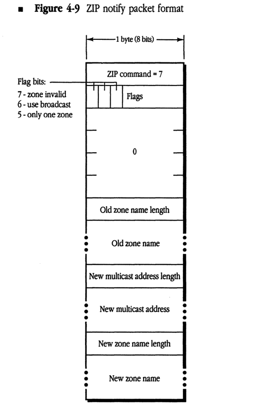

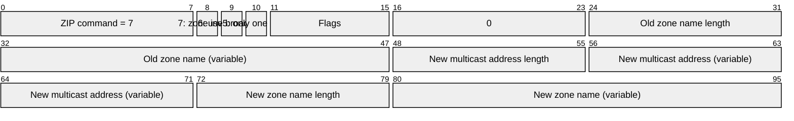

| Field | Bit offset | Width (bits) | Description |
|---|---|---|---|
| ZIP command | 0 | 8 | ZIP command value (set to 7 for ZIP notify) |
| zone invalid | 8 | 1 | Flag bit 7: indicates the zone is invalid |
| use broadcast | 9 | 1 | Flag bit 6: indicates use of broadcast |
| only one zone | 10 | 1 | Flag bit 5: indicates only one zone |
| Flags | 11 | 5 | Remaining bits of the flags byte |
| 0 | 16 | 8 | Reserved; set to 0 |
| Old zone name length | 24 | 8 | Length of the old zone name in bytes |
| Old zone name | 32 | Variable | The old zone name string |
| New multicast address length | Variable | 8 | Length of the new multicast address |
| New multicast address | Variable | Variable | The new multicast address |
| New zone name length | Variable | 8 | Length of the new zone name in bytes |
| New zone name | Variable | Variable | The new zone name string |

◆ *ZIP takedown and bringup:* This document does not specify the method by which zone names associated with active networks are actually changed. ZIP takedown and bringup are not a part of AppleTalk Phase 2, and such packets should be ignored by all AppleTalk Phase 2 routers.

Changing a zone name for a given network involves not only informing the routers (and other nodes) connected to that network, but also informing every router on the internet of that change. AppleTalk Phase 2 removes this function from ZIP and delegates it to network management protocols, to be documented elsewhere. (This process can also be performed by shutting down all routers connected to a network, reconfiguring the seed routers, and then restarting all routers.)

## Appendix Changes in LocalTalk Nodes

THIS APPENDIX LISTS changes that can be made to nonrouting implementations on LocalTalk to fully conform to AppleTalk Phase 2. While they are not currently required in LocalTalk nodes, future products may require these changes to provide full functionality to LocalTalk nodes.

Each of these changes is described in prior sections of this document.

- Additional NBP wildcard character ≈
- ATP TRel timer
- A-ROUTER aging time of 50 seconds
- "Best router" address cache in nodes ■

## The Apple Publishing System

This Apple® manual was written, edited, and composed on a desktop publishing system using Apple Macintosh® computers and Microsoft® Word. Proof pages were created on the Apple LaserWriter® printers; final pages were printed on a Varityper® VT600™. Line art was created using Adobe Illustrator™. PostScript®, the LaserWriter page-description language, was developed by Adobe Systems Incorporated.

Text type and display type are Apple's corporate font, a condensed version of ITC Garamond®. Bullets are ITC Zapf Dingbats.
