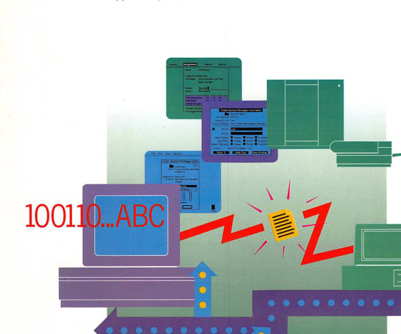
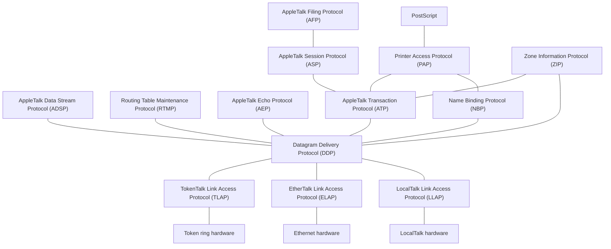
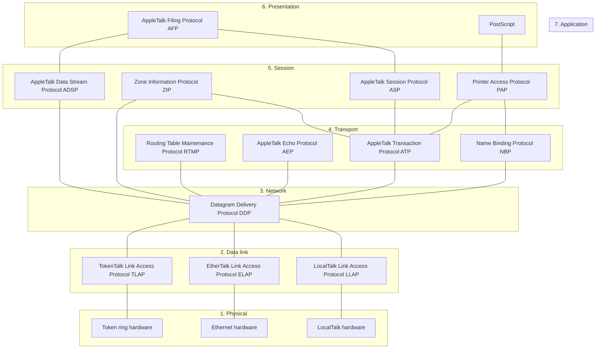

# Front Matter

| Field | Value |
|-------|-------|
| **Source** | [Inside AppleTalk Second Edition (1990)](https://vintageapple.org/macbooks/pdf/Inside_AppleTalk_Second_Edition_1990.pdf) |
| **Chapter** | 0 |
| **Pages** | 1–61 |
| **Converted** | 2026-04-05 |
| **Engine** | gemini-flash |

---

# Inside AppleTalk, Second Edition

by Gursharan S. Sidhu, Richard F. Andrews, Alan B. Oppenheimer
Apple Computer, Inc.

---

# The Apple® Communications Library

*The Official Publications from Apple Computer, Inc.*

The Apple Communications Library provides complete information on Apple Computer, Inc.'s approach to networking and communications. The library consists of three related series: Apple Communications Basics, Apple Communications Reference, and Apple Communications Technical. These books offer comprehensive material on a wide variety of topics for a vast range of readers, from basic-level users to network administrators and developers.

The Apple Communications Basics series covers networking fundamentals. Designed for those new to networks, these introductory-level books explain all aspects of networking.

The Apple Communications Reference series provides overviews of networking topics. These books are written for developers, network administrators, or users, and currently include an overview of AppleTalk®, Apple's networking system.

For developers and programmers, technical detail is provided by the Apple Communications Technical series. These books include advanced-level information about the AppleTalk network system's capabilities and specifications necessary to allow implementation of a system by developers. *Inside AppleTalk* is the first in this series.

---

# Inside AppleTalk®
## Second Edition

**Gursharan S. Sidhu**  
Technical Director

**Richard F. Andrews**  
Staff Engineer

**Alan B. Oppenheimer**  
Staff Engineer

Network Systems Development  
Apple Computer, Inc.

**Addison-Wesley Publishing Company**

Reading, Massachusetts Menlo Park, California New York  
Don Mills, Ontario Wokingham, England Amsterdam Bonn  
Sidney Singapore Tokyo Madrid San Juan Paris  
Seoul Milan Mexico City Taipei

---

## APPLE COMPUTER, INC.

Copyright © 1990 by Apple Computer, Inc.

All rights reserved. No part of this publication may be reproduced, stored in a retrieval system, or transmitted, in any form or by any means, mechanical, electronic, photocopying, recording, or otherwise, without prior written consent of Apple Computer, Inc. Printed in the United States of America.

Apple Computer, Inc.
20525 Mariani Avenue
Cupertino, CA 95014
(408) 996-1010

Apple, the Apple logo, AppleShare, AppleTalk, Apple IIe, Apple IIGS, EtherTalk, ImageWriter, LaserWriter, Macintosh, ProDOS, and TokenTalk are registered trademarks of Apple Computer, Inc.

Apple Desktop Bus, Finder, LocalTalk, and MultiFinder are trademarks of Apple Computer, Inc.

AlisaShare is a trademark of Alisa Systems.

CL/1 is a trademark of Network Innovations.

DECnet and VAX are trademarks of Digital Equipment Corporation.

IBM and SNA are registered trademarks of International Business Machines Corporation.

InBox is a trademark of Symantec Corporation's Think Technologies.

ITC Garamond and ITC Zapf Dingbats are registered trademarks of International Typeface Corporation.

Kinetics is a trademark of Kinetics, Inc.

LANSTAR and Meridian are registered trademarks of Northern Telecom.

LANSTAR AppleTalk is a joint trademark of Northern Telecom and Apple Computer, Inc.

Linotronic is a registered trademark of Linotype Co.

Microsoft and MS-DOS are registered trademarks of Microsoft Corporation.

Netway is a registered trademark of Tri-Data Systems, Inc.

NFS is a trademark of Sun Microsystems.

PacerShare is a registered trademark of Pacer Software, Inc.

PhoneNET is a registered trademark of Farallon Computing.

PostScript is a registered trademark, and Illustrator is a trademark, of Adobe Systems Incorporated.

UNIX is a registered trademark of AT&T Information Systems.

Varityper is a registered trademark, and VT600 is a trademark, of AM International, Inc.

Zilog is a trademark of Infocom, Inc.

No licenses, express or implied, are granted by reason of this book describing certain processes or techniques that may be the intellectual property of the author or others, including, but not limited to, United States Patents 4,661,902 and 4,689,786 assigned to Apple Computer, Inc.

Simultaneously published in the United States and Canada.

ISBN 0-201-55021-0

4 5 6 7 8 9 10 - DO - 959493
Fourth printing, January 1993

---

# Contents

Figures and tables / xv
Acknowledgments / xx
Acknowledgments to First Edition / xxiii

## Introduction / I-1

* Network systems / I-4
* Protocols—What are they? / I-4
* AppleTalk / I-4
    * Why did we design it? / I-5
    * Key goals of the AppleTalk architecture / I-6
* The AppleTalk network system / I-8
    * AppleTalk connectivity / I-9
    * AppleTalk end-user services / I-15
* AppleTalk protocol architecture and the ISO-OSI reference model / I-20
* AppleTalk Phase 2 / I-24
* Thoughts of the future / I-25
    * Scope / I-25
    * Reach / I-25
* About Inside AppleTalk / I-26
* Typographic and graphic conventions used in this book / I-27
* Where to go for more information / I-28

---

# Part I Physical and Data Links

## 1 LocalTalk Link Access Protocol / 1-1

- Link access control / 1-3
- Node addressing / 1-3
    - Node IDs / 1-4
    - Dynamic node ID assignment / 1-4
- Data transmission and reception / 1-6
    - LLAP packet / 1-6
    - LLAP frame / 1-9
- Data packet transmission / 1-10
    - Carrier sensing and synchronization / 1-10
    - Transmission dialogs / 1-11
    - Directed data packet transmission / 1-14
    - Broadcast data packet transmission / 1-15
- Packet reception / 1-15

## 2 AppleTalk Address Resolution Protocol / 2-1

- Protocol families and stacks / 2-3
- Protocol and hardware addresses / 2-3
    - Address resolution / 2-3
- AARP services / 2-5
- AARP operation / 2-6
    - Address mapping / 2-7
    - Dynamic protocol address assignment / 2-8
- Retransmission of AARP packets / 2-9
    - Filtering incoming packets / 2-9
- AMT entry aging / 2-10
- AARP packet formats / 2-11

---

## 3 EtherTalk and TokenTalk Link Access Protocols / 3-1

- 802.2 / 3-3
- ELAP packet format / 3-5
- TLAP packet format / 3-6
- Address mapping in ELAP and TLAP / 3-7
    - Use of AARP by ELAP and TLAP / 3-8
    - AARP specifics for ELAP and TLAP / 3-9
    - Zone multicast addresses used by ELAP and TLAP / 3-10
- AppleTalk AARP packet formats on Ethernet and token ring / 3-11

# Part II End-to-End Data Flow

## 4 Datagram Delivery Protocol / 4-1

- Internet routers / 4-5
- Sockets and socket identification / 4-5
- Network numbers and a node's AppleTalk address / 4-6
- Special DDP node IDs / 4-6
- AppleTalk node address acquisition / 4-7
    - Node address acquisition on nonextended networks / 4-8
    - Node address acquisition on extended networks / 4-8
- DDP type field / 4-9
- Socket listeners / 4-10
- DDP interface / 4-10
    - Opening a statically assigned socket / 4-11
    - Opening a dynamically assigned socket / 4-12
    - Closing a socket / 4-12
    - Sending a datagram / 4-12
    - Datagram reception by the socket listener / 4-13
- DDP internal algorithm / 4-13
- DDP packet format / 4-13
    - Short and extended headers / 4-14
    - DDP checksum computation / 4-17
    - Hop counts / 4-17

---

DDP routing algorithm / 4-18
Optional "best router" forwarding algorithm / 4-20
Sockets and use of name binding / 4-21
Network number equivalence / 4-21

# 5 Routing Table Maintenance Protocol / 5-1

Internet routers / 5-4
- Local routers / 5-4
- Half routers / 5-4
- Backbone routers / 5-4
Router model / 5-6
Internet topologies / 5-7
Routing tables / 5-8
Routing table maintenance / 5-10
- Reducing RTMP packet size / 5-11
- Aging of routing table entries / 5-12
- Validity and send-RTMP timers / 5-13
RTMP Data packet format / 5-13
- Sender's network number / 5-15
- Sender's node ID / 5-15
- Version number indicator / 5-15
- Routing tuples / 5-16
Assignment of network number ranges / 5-16
RTMP and nonrouter nodes / 5-17
- Nodes on nonextended networks / 5-17
- Nodes on extended networks / 5-19
RTMP Route Data Requests / 5-20
RTMP table initialization and maintenance algorithms / 5-21
- Initialization / 5-21
- Maintenance / 5-21
- Tuple matching definitions / 5-25
RTMP routing algorithm / 5-25

# 6 AppleTalk Echo Protocol / 6-1

---

# Part III Named Entities

## 7 Name Binding Protocol / 7-1

- Network-visible entities / 7-4
- Entity names / 7-4
- Name binding / 7-5
    - Names directory and names tables / 7-6
    - Aliases and enumerators / 7-6
    - Names information socket / 7-7
- Name binding services / 7-7
    - Name registration / 7-7
    - Name deletion / 7-8
    - Name lookup / 7-8
    - Name confirmation / 7-8
- NBP on a single network / 7-9
- NBP on an internet / 7-10
    - Zones / 7-10
    - Name lookup on an internet / 7-10
- NBP interface / 7-11
    - Registering a name / 7-12
    - Removing a name / 7-12
    - Looking up a name / 7-13
    - Confirming a name / 7-13
    - NBP packet formats / 7-14
    - Function / 7-15
    - Tuple count / 7-15
    - NBP ID / 7-15
    - NBP tuple / 7-15

## 8 Zone Information Protocol / 8-1

- ZIP services / 8-4
- Network-to-zone-name mapping / 8-4
    - Zone information table / 8-4
    - Zone information socket: ZIP Queries and Replies / 8-5
    - ZIT maintenance / 8-5

---

Zone name listing / 8-7
Zone name acquisition / 8-9
- Verifying a saved zone name / 8-9
- Choosing a new zone name / 8-10
- Zone multicasting / 8-10
- Aging the zone name / 8-10
Packet formats / 8-11
- ZIP Query and Reply / 8-11
- ZIP ATP Requests / 8-13
- ZIP GetNetInfo Request and Reply / 8-16
Zone multicast address computation / 8-18
NBP routing in IRs / 8-18
- Generating FwdReq packets / 8-19
- Converting FwdReqs to LkUps / 8-19
Zones list assignment / 8-20
Zones list changing / 8-21
- Changing zones lists in routers / 8-21
- Changing zone names in nodes / 8-22
Timer values / 8-24

# Part IV Reliable Data Delivery

## 9 AppleTalk Transaction Protocol / 9-1

Transactions / 9-3
- At-least-once (ALO) transactions / 9-5
- Exactly-once (XO) transactions / 9-6
Multipacket responses / 9-9
Transaction identifiers / 9-9
ATP bitmap/sequence number / 9-10

---

Responders with limited buffer space / 9-12
ATP packet format / 9-13
ATP interface / 9-16
- Sending a request / 9-17
- Opening a responding socket / 9-18
- Closing a responding socket / 9-19
- Receiving a request / 9-19
- Sending a response / 9-20
ATP state model / 9-21
- ATP requester / 9-22
- ATP responder / 9-24
Optional ATP interface calls / 9-26
- Releasing a RspCB / 9-26
- Releasing a TCB / 9-26
Wraparound and generation of TIDs / 9-27

# 10 Printer Access Protocol / 10-1

PAP services / 10-4
The protocol / 10-5
- Connection establishment phase / 10-7
- Data transfer phase / 10-9
- Duplicate filtration / 10-11
- Connection termination phase / 10-11
- Status gathering / 10-12
PAP packet formats / 10-12
PAP function and result values / 10-16
PAP client interface / 10-16
PAP specifications for the Apple LaserWriter printer / 10-21

---

# 11 AppleTalk Session Protocol / 11-1

- What ASP does / 11-4
- What ASP does not do / 11-4
- ASP services and features / 11-5
  - Opening and closing sessions / 11-6
  - Session maintenance / 11-9
  - Commands on an open session / 11-10
  - Sequencing and duplicate filtration / 11-14
  - Getting service status information / 11-15
- ASP client interface / 11-16
  - Server-end calls / 11-16
  - Workstation-end calls / 11-23
- Packet formats and algorithms / 11-27
  - Opening a session / 11-27
  - Getting server status / 11-29
  - Sending a command request / 11-30
  - Sending a write request / 11-32
  - Maintaining the session / 11-35
  - Sending an attention request / 11-36
  - Closing a session / 11-36
  - Checking for reply size errors / 11-37
  - Timeouts and retry counts / 11-38
  - SPFunction values / 11-39

# 12 AppleTalk Data Stream Protocol / 12-1

- ADSP services / 12-4
- Connections / 12-4
  - Connection states / 12-5
  - Half-open connections and the connection timer / 12-5
  - Connection identifiers / 12-6

---

Data flow / 12-6
- Sequence numbers / 12-7
- Error recovery and acknowledgments / 12-7
- Flow control and windows / 12-8
- ADSP messages / 12-9
- Forward resets / 12-9
- Summary of sequencing variables / 12-10
Packet format / 12-12
Control packets / 12-14
Data-flow examples / 12-15
Attention messages / 12-19
Connection opening / 12-22
- Connection-opening dialog / 12-24
- Open-connection Control packet format / 12-27
- Error recovery in the connection-opening dialog / 12-30
- Connection opening outside of ADSP / 12-34
- Connection-listening sockets and servers / 12-35
- Connection-opening filters / 12-36
Connection closing / 12-38

# Part V End-User Services

## 13 AppleTalk Filing Protocol / 13-1

File system structure / 13-7
- File server / 13-8
- Volumes / 13-9
- Catalog node names / 13-13
- Directories and files / 13-15
- File forks / 13-22
Designating a path to a CNode / 13-23
AFP login / 13-27
File server security / 13-28
- User authentication methods / 13-28
- Volume passwords / 13-30
- Directory access control / 13-31
- File sharing modes / 13-35
  - Access modes and deny modes / 13-35
  - Synchronization rules / 13-36
- Desktop database / 13-37
- AFP's use of ASP / 13-38
- An overview of AFP calls / 13-39
  - Server calls / 13-40
  - Volume calls / 13-41
  - Directory calls / 13-42
  - File calls / 13-43
  - Combined directory-file calls / 13-43
  - Fork calls / 13-44
  - Desktop database calls / 13-45
- AFP calls / 13-46

# 14 Print Spooling Architecture / 14-1

- Printing without a spooler / 14-4
- Benefits of printing with a spooler / 14-5
- Background spoolers versus spooler/servers / 14-6
- Impact of the Macintosh on printing / 14-6
- Printing without a spooler / 14-7
- Printing with a spooler/server / 14-9
- Controlling printer access / 14-10
- User authentication dialog / 14-12
- Direct passthrough / 14-14
- Spooler/server queue management / 14-15
- About document structuring conventions / 14-18
  - About PostScript document files / 14-18
- About PostScript print jobs / 14-19
  - Comment format / 14-20
  - Syntax conventions / 14-21
- Comments in documents / 14-22
  - Prologue and script / 14-22
  - Pages / 14-23
  - Line length / 14-23

---

Structure comments / 14-23
- Header comments / 14-25
- Body comments / 14-28
Resource comments / 14-32
- Conventions for using resource comments / 14-32
- Definitions / 14-33
Query comments / 14-34
- Conventions for using query comments / 14-35
- Spooler responsibilities / 14-35
- Definitions / 14-36
Sample print streams / 14-41

# Appendix A LocalTalk Hardware Specifications / A-1
LocalTalk electrical characteristics / A-2
- Bit encoding and decoding / A-2
- Signal transmission and reception / A-3
- Carrier sense / A-3
Electrical/mechanical specification / A-3
- Connection module / A-4
- LocalTalk connector / A-5
- Cable connection / A-5
Transformer specifications / A-5
- Environmental conditions / A-7
- Mechanical strength and workmanship / A-8

# Appendix B LLAP Access Control Algorithms / B-1
Assumptions / B-2
Global constants, types, and variables / B-2
Hardware interface declarations / B-4
Interface procedures and functions / B-5
InitializeLLAP procedure / B-6
AcquireAddress procedure / B-7
TransmitPacket function / B-8
TransmitLinkMgmt function / B-8

---

TransmitFrame procedure / B-14
ReceivePacket procedure / B-15
ReceiveLinkMgmt function / B-15
ReceiveFrame function / B-17
Miscellaneous functions / B-19
SCC implementation / B-20
CRC-CCITT calculation / B-22

# Appendix C AppleTalk Parameters / C-1

LLAP parameters / C-2
AARP parameters / C-4
EtherTalk and TokenTalk parameters / C-4
DDP parameters / C-6
RTMP parameters / C-8
AEP parameters / C-9
NBP parameters / C-9
ZIP parameters / C-10
ATP parameters / C-10
PAP parameters / C-11
ASP parameters / C-12
ADSP parameters / C-13
AFP parameters / C-13

# Appendix D Character Codes / D-1

# Glossary / G-1

# Index / Index-1

---

# Figures and Tables

### Introduction / I-1

Figure I-1 Network topology / I-8
Figure I-2 LocalTalk network / I-10
Figure I-3 AppleTalk internet / I-12
Figure I-4 Direct printing / I-16
Figure I-5 Printing with a spooler/server / I-17
Figure I-6 Access privileges / I-18
Figure I-7 AppleTalk protocol architecture / I-21
Figure I-8 Interfaces and protocols / I-22
Figure I-9 AppleTalk protocols and the ISO-OSI reference model / I-23

### CHAPTER 1 LocalTalk Link Access Protocol / 1-1

Figure 1-1 Under dynamic node ID assignment, a new node tests its randomly assigned ID / 1-5
Figure 1-2 LLAP frame and packet format / 1-7
Figure 1-3 LLAP transmission dialogs / 1-12
Figure 1-4 RTS-CTS handshake during a directed data transmission / 1-14

### CHAPTER 2 AppleTalk Address Resolution Protocol / 2-1

Figure 2-1 Multiple protocol stacks using a single link / 2-4
Figure 2-2 AARP packet formats / 2-12

### CHAPTER 3 EtherTalk and TokenTalk Link Access Protocols / 3-1

Figure 3-1 SNAP packet format / 3-4
Figure 3-2 ELAP packet format / 3-5
Figure 3-3 TLAP packet format / 3-7
Figure 3-4 ELAP and TLAP multicast addresses / 3-10
Figure 3-5 AppleTalk-Ethernet or AppleTalk-token ring AARP packet formats / 3-12

---

### CHAPTER 4 Datagram Delivery Protocol / 4-1

Figure 4-1 AppleTalk internet and internet routers (IRs) / 4-4
Figure 4-2 Socket terminology / 4-11
Figure 4-3 DDP packet format (short header) / 4-15
Figure 4-4 DDP packet format (extended header) / 4-16

### CHAPTER 5 Routing Table Maintenance Protocol / 5-1

Figure 5-1 Router configurations / 5-5
Figure 5-2 Router model / 5-6
Figure 5-3 Example of a routing table / 5-9
Figure 5-4 Split horizon example / 5-11
Figure 5-5 RTMP Data packet formats / 5-14
Figure 5-6 RTMP Request and Response packet formats / 5-18
Figure 5-7 Datagram routing algorithm for a router / 5-26

### CHAPTER 6 AppleTalk Echo Protocol / 6-1

Figure 6-1 AEP packet format / 6-3

### CHAPTER 7 Name Binding Protocol / 7-1

Figure 7-1 NBP packet format / 7-14
Figure 7-2 NBP tuple / 7-16

### CHAPTER 8 Zone Information Protocol / 8-1

Figure 8-1 ZIP Query and Reply packet formats / 8-12
Figure 8-2 GetZoneList and GetLocalZones request and reply
packets / 8-14
Figure 8-3 GetMyZone request and reply packets / 8-15
Figure 8-4 GetNetInfo request and supply packets / 8-17
Figure 8-5 ZIP Notify packet / 8-23

### CHAPTER 9 AppleTalk Transaction Protocol / 9-1

Figure 9-1 Transaction terminology / 9-4
Figure 9-2 Automatic retry mechanism / 9-5
Figure 9-3 Exactly-once (XO) transactions / 9-7
Figure 9-4 Duplicate delivery of exactly-once (XO) mode / 9-8
Figure 9-5 Multipacket response example / 9-11

---

Figure 9-6 Use of STS / 9-13
Figure 9-7 ATP packet format / 9-14

# CHAPTER 10 Printer Access Protocol / 10-1

Figure 10-1 Printing architecture / 10-3
Figure 10-2 Server states / 10-6
Figure 10-3 PAP OpenConn and OpenConnReply packet formats / 10-13
Figure 10-4 PAP SendData, Data, and Tickle packet formats / 10-14
Figure 10-5 PAP CloseConn and CloseConnReply packet formats / 10-14
Figure 10-6 PAP SendStatus and Status packet formats / 10-15

# CHAPTER 11 AppleTalk Session Protocol / 11-1

Figure 11-1 ASP session-opening dialog / 11-6
Figure 11-2 Session-closing dialog initiated by the workstation / 11-7
Figure 11-3 Session-closing dialog initiated by the server / 11-8
Figure 11-4 Tickle packet dialog / 11-9
Figure 11-5 SPCommand dialog / 11-11
Figure 11-6 SPWrite dialog (error condition) / 11-12
Figure 11-7 SPWrite dialog (no error condition) / 11-13
Figure 11-8 SPAttention dialog / 11-14
Figure 11-9 SPGetStatus dialog / 11-15
Figure 11-10 ASP packet formats for OpenSess and CloseSess / 11-28
Figure 11-11 ASP packet formats for GetStatus / 11-30
Figure 11-12 ASP packet formats for Command / 11-31
Figure 11-13 ASP packet formats for Write / 11-33
Figure 11-14 ASP packet formats for WriteContinue / 11-34
Figure 11-15 ASP packet formats for Attention and Tickle / 11-35

# CHAPTER 12 AppleTalk Data Stream Protocol / 12-1

Figure 12-1 Send and receive queues / 12-11
Figure 12-2 ADSP packet format / 12-13
Figure 12-3 ADSP data flow / 12-16
Figure 12-4 Recovery from a lost packet / 12-17
Figure 12-5 Idle connection state / 12-18
Figure 12-6 Connection torn down due to lost packets / 12-19
Figure 12-7 ADSP Attention packet format / 12-20
Figure 12-8 Connection-opening dialog initiated by one end / 12-25
Figure 12-9 Connection-opening dialog initiated by both ends / 12-26

---

Figure 12-10 Open-connection request denied / 12-27
Figure 12-11 Open-connection packet format / 12-29
Figure 12-12 Connection-opening dialog: packet lost / 12-30
Figure 12-13 Simultaneous connection-opening dialog: packet lost / 12-31
Figure 12-14 Connection-opening dialog: half-open connection / 12-32
Figure 12-15 Connection-opening dialog: data transmitted on half-open connection / 12-33
Figure 12-16 Connection-opening dialog: late-arriving duplicate / 12-34
Figure 12-17 Open-connection request made to connection-listening socket; alternate socket chosen for connection / 12-36
Figure 12-18 Connection-opening filters open connection denied / 12-37
Figure 12-19 Connection-opening filters with a connection-listening socket / 12-38

# CHAPTER 13 AppleTalk Filing Protocol / 13-1

Figure 13-1 The AFP file access model / 13-5
Figure 13-2 AFP and the AppleTalk protocol architecture / 13-7
Figure 13-3 The volume catalog / 13-13
Figure 13-4 ProDOS information format / 13-18
Figure 13-5 CNode specification / 13-23
Figure 13-6 Example 1 of a volume catalog / 13-25
Table 13-1 Synchronization rules / 13-37

# CHAPTER 14 Print Spooling Architecture / 14-1

Figure 14-1 Configuration for printing without a spooler / 14-4
Figure 14-2 Configuration for printing with a spooler/server / 14-7
Figure 14-3 Protocol architecture for printing without a spooler / 14-8
Figure 14-4 Protocol architecture for printing with a spooler/server / 14-9
Figure 14-5 Protocol architecture for alternate spooling environments / 14-11
Figure 14-6 Protocol architecture for spooler/server queue management / 14-17

---

# APPENDIX A LocalTalk Hardware Specifications / A-1

Figure A-1 FM-0 encoding / A-2
Figure A-2 LocalTalk connection module / A-4
Figure A-3 Connector pin assignment (looking into the connector) / A-5
Figure A-4 Interconnecting cable connection / A-5
Figure A-5 Transformer specification / A-6
Figure A-6 Schematic and build detail / A-7

# APPENDIX C AppleTalk Parameters / C-1

Figure C-1 LLAP type field values / C-3
Figure C-2 Zone multicast addresses / C-5
Figure C-3 DDP type field values / C-7
Figure C-4 DDP socket numbers / C-8

# APPENDIX D Character Codes / D-1

Table D-1 Character set mapping used in AppleTalk / D-2
Table D-2 Lowercase-to-uppercase mapping in AppleTalk / D-3

---

# Acknowledgments

EVEN THOUGH *Inside AppleTalk* was published by Addison-Wesley as recently as early 1989, the needed evolution of technology has already made it necessary to produce a new edition! In fact, even while we were in the final editing and production stages of the first edition, our engineering teams were busy implementing a major extension of the network system, now known as AppleTalk® Phase 2. This extension was introduced in June of 1989, and its various components are now in users' hands. This second edition includes all changes made to the protocols to implement the enhanced capabilities of AppleTalk Phase 2.

It is my privilege to acknowledge the contributions of many of the finest networking engineers in the industry in this endeavour. Jim Mathis, who has been involved with network systems design since the advent of TCP (Transmission Control Protocol) in his university days at Stanford, worked with me on the early architectural design of Phase 2, critiquing and suggesting amendments to the design. The refinement and translation of that design into an actual implementation was done by a team under the leadership of Alan Oppenheimer, who is a co-author of this book. Major contributions were made by several members of Alan's staff—I would like to make special note of Sean Findley, Louise Laier, Kerry Lynn, and Mike Quinn. These engineers *par excellence* have built a new version of the system in the face of the enormous challenge of maintaining compatibility with existing AppleTalk applications. The results have been simply extraordinary. Whereas the original AppleTalk system had a size limitation of at most 254 devices connected to a single network, the new design extends this limit to approximately 16 million devices. The owner of the network system has enhanced flexibility in distributing these devices on the various networks that comprise the internet. Much care has been devoted to minimizing the use of network bandwidth for the system's internal coordination, such as routing table maintenance.

---

# Acknowledgments to First Edition

THE DEVELOPMENT of the AppleTalk network system spans more than a five-year period. Although the authors of *Inside AppleTalk* were the key players in the system's design, many others helped in numerous ways.

Without a doubt, the genesis of AppleTalk is to be found in the demanding and uncompromising questioning of Steve Jobs. In particular, at the National Computer Conference (NCC) in Anaheim in 1983, he asked me the key question: "Why has networking not caught on?" My awkward attempts to answer his question started us on this venture. Invention always has its instigator, and Steve played this role for AppleTalk as he has for many other wonderful products from Apple. I owe a great personal debt to him for first listening to my fervent but not yet fully formed vision of networks as empowering extensions of the personal computer and for later helping remove barriers from our developmental path.

Bob Belleville, former engineering director of the Macintosh® Division and ever a pragmatist, converted the vision into three succinct memos that put a stop to all argument on this issue at Apple. He provided a focus for this nascent activity, including the general goals for LocalTalk (then known as AppleBus), the LaserWriter® printer, and the system's file server. Although the actual products turned out considerably different from what he indicated in those memos, he summarized the target area with consummate simplicity.

The most exciting activity of the last quarter of 1983 and the first few months of 1984 was the development of the LocalTalk Link Access Protocol (LLAP). This protocol is the basis of LocalTalk and related connectivity implementations from several vendors, including PhoneNET from Farallon Computing and Fiber Optic Communication Card from Du Pont Electronics. I wish to acknowledge several colleagues at Apple who played key roles in this difficult design activity: Ron Hochsprung and Larry Kenyon for their very creative design participation, George Crow for the superb analog design of the LocalTalk hardware, and Jim Nichols for an uncompromising test harness that proved that the design was efficient and stable.

---

The AppleTalk protocol architecture almost did not happen. Bob Belleville proposed an external, device-interconnect bus for the then-closed Macintosh personal computer. Creating a network system was my somewhat clandestine idea; when I described the network architecture to Bob on January 24, 1984, about two hours after the Macintosh introduction, I did so with some trepidation. I am grateful to him for his forthright admission that I had made AppleTalk into something much more comprehensive than he had anticipated and for his full support!

In its early days, any new idea is tender and vulnerable. I am especially grateful to Ed Taft of Adobe Systems, one of the most widely known members of the networking community, for his very thorough review and his advice in late 1983 and early 1984. His extremely encouraging comments bolstered my own commitment to build this system; without his encouragement, compromises to "conventionalism" might have crept in.

It was all very well to have the approval of fellow designers of network systems, but the proverbial proof-is-in-the-pudding was still missing: How would users of the system respond to it? Stan Dunton and Rich Brown of Dartmouth College provided a crucial vote of confidence in early 1984 with their decision to install AppleTalk as their campus-wide system. I will be eternally grateful to Stan for standing up at the first AppleBus Developers' Conference and saying: "This is just the system we've been waiting for someone to design."

My biggest debt of gratitude is to Rich Andrews and Alan Oppenheimer, who have been my technical partners in this venture from the beginning. The credit for the outstanding reliability of the Macintosh AppleTalk drivers goes to Alan's meticulous attention to detail in writing them. They are a model of how an efficient and tight implementation of network protocols can be achieved in a difficult environment.

The elegant design of the AppleTalk Transaction Protocol (ATP) exactly-once packet exchange is the contribution of Rich Andrews. Rich listened to my somewhat unconventional ideas about not building a general stream protocol but relying instead on transactions. I then suggested at-least-once and exactly-once service. My exactly-once proposal, however, was considerably clumsier than Rich's modification, which has become integral to millions of Macintosh and LaserWriter ROMs.

---

One of the impressive services in the AppleTalk system is provided by the AppleShare® file server, which was many years in the making. Rich Andrews has been my partner in this venture throughout. I wish to thank him for his tremendous effort in the face of considerable adversity and public opprobrium. His persistent, dogged work toward the final AppleShare product has earned him the title of Apple Hero.

Rich and Alan join me in thanking all our colleagues in Apple's Network Systems Development (NSD) group; in particular, we would like to mention a few veterans: Pat Dirks, Bruce Gaya, Rick Hoiberg, and Gene Tyacke. Tim Warden and Steve Schwartz made significant contributions to the chapters on the AppleTalk Data Stream Protocol (ADSP) and the Printer Access Protocol (PAP), for which they have my appreciation and thanks.

Since 1985, the NSD group has enjoyed the support and encouragement of Ed Birss and Jean-Louis Gassée. Both have become strong converts to our dream of extending the power of the individual beyond the desk top.

The unsung key contributors to a system such as AppleTalk are the third-party developers who have risked their investment funds to add end-user value. They kept AppleTalk alive when many thought it was just a printer cable. I wish to acknowledge, as representative of this group, the following key entrepreneurs: Evan Solley of Infosphere for the first AppleTalk disk-server product; Andrew Singer, formerly of Think Technologies, for the InBox electronic mail service; Alex Gernert, formerly of Tri Data, for the Netway 1000 SNA connectivity server; Rob Ryan of Hayes Microcomputer Products, Inc. and Tim McCreery of Kinetics for their AppleTalk routers; Reese Jones of Farallon Computing for the PhoneNET implementation of LocalTalk service; and Bob Denny of Alisa Systems for the implementation of Apple's AppleTalk for VMS software.

Lest other good developer friends take umbrage at my not mentioning them specifically, I plead the impracticality of producing an exhaustive list; they know the depth of my gratitude—and that of the users—to all of them. This large body of third-party developers is a measure of the broad acceptance of the AppleTalk system.

Protocol specifications of the AppleTalk system have been provided to developers in several versions starting with the “AppleBus Developer's Handbook” of March 1984. It was my intention to publish it as a book, but we grossly underestimated the effort involved. It was not until August of 1988 that we assembled some of Apple’s finest editors, production editors,

---

and desktop publishers to pull together all the pieces that comprise this book. I am indebted to Judy Bligh, editor; Judi Seip, art director; Sheila Mulligan; Ron Morton; Roy Zitting; Debbie McDaniel; Luann Rugebregt; and Patrick Ames.

Finally, I would like to dedicate this book to the patience and understanding of my wife, Elvira, who endured the many nights when I paced the floor while struggling with some protocol problem.

Gursharan S. Sidhu
November 1988

---

# Introduction

### CONTENTS

**Network systems / I-4**

**Protocols—What are they? / I-4**

**AppleTalk / I-4**
* Why did we design it? / I-5
* Key goals of the AppleTalk architecture / I-6
    * Versatility / I-6
    * "Plug-and-play" capability / I-6
    * Peer-to-peer architecture / I-6
    * Simplicity / I-7
    * Link independence / I-7
    * Seamless extension of the user's computer / I-7
    * Open architecture / I-7

**The AppleTalk network system / I-8**
* AppleTalk connectivity / I-9
    * LocalTalk / I-10
    * EtherTalk / I-11
    * TokenTalk / I-11
    * Routers and AppleTalk internets / I-12
    * Datagrams and network visibility / I-13
    * Names, addresses, routes, and zones / I-13
    * AppleTalk and reliable data exchange—transactions and streams / I-14
* AppleTalk end-user services / I-15
    * AppleTalk printing services / I-15
    * AppleShare and AppleTalk file service / I-17

**AppleTalk protocol architecture and the ISO-OSI reference model / I-20**

---

### AppleTalk Phase 2 / I-24

### Thoughts of the future / I-25
* Scope / I-25
* Reach / I-25

### About *Inside AppleTalk* / I-26

### Typographic and graphic conventions used in this book / I-27

### Where to go for more information / I-28
* AppleTalk / I-28
* General networking / I-28
* Data links / I-28
* Connection-oriented protocols / I-29
* PostScript / I-29
* ISO-OSI reference model / I-29
* Database access / I-29

---

THIS BOOK PROVIDES the internal design details of the AppleTalk® network system. As such, it is intended for those who are not content merely with being users of the system but who would like to go behind the scenes. *Inside AppleTalk* is designed to meet the needs of those interested in understanding AppleTalk network technology. Distinguished among this group are developers wishing to connect devices to this network system or to write computer programs that use its services.

Readers are not required to have a detailed knowledge of network systems. Those generally familiar with the design of computing systems should be able to grasp the material presented here. ■

---

# Network systems

The basic goal of computer network systems is to eliminate access barriers that result from the geographical and physical separation of various devices and the resources they embody. Network systems are the essential basis of distributed computing.

Computer network systems consist of computing components and connectivity components. *Computing components* include computing devices, such as personal computers, minicomputers, and mainframe computers, and special *server devices*, such as file servers and print servers. These devices are connected through a variety of cables, other data channels, and routing and gateway components, which collectively are the *connectivity components* of the system.

# Protocols—What are they?

The effective operation of any distributed system, of human beings or of devices, is based on underlying rules that prescribe the nature and form of the permitted and accepted interactions. In the world of diplomacy, these rules are known as protocols.

Similarly, computer networks operate on the basis of carefully designed and scrupulously enforced rules of interaction—also called **protocols**—between the network system's interconnected devices. Internal descriptions of such systems consist mainly of discussion and specification of the protocols, their objectives, and their interactions. This collective of information is known as the *protocol architecture* of the network system.

*Inside AppleTalk* defines and describes AppleTalk's protocol architecture. To understand AppleTalk's design fully, one must also examine its *topological architecture*, which is concerned with the manner in which the connectivity of the network system is implemented.

Not all aspects of AppleTalk protocols are covered in this book. Some issues, such as network management and gateway protocols, will be examined in companion volumes. Likewise, protocols for database access and for page description are discussed elsewhere.

# AppleTalk

AppleTalk is a comprehensive network system designed and developed by Apple Computer, Inc. It consists of many different kinds of computer systems and servers and a variety of cabling and connectivity products.

---

This system was designed as an integral part of Apple Computer’s mission to provide greater power to the individual through computer technology. The ultimate objective was to go beyond personal computers to *interpersonal computing*. The cornerstone of this vision is the Macintosh® family of personal computers. These computers allow users to directly manipulate and use various capabilities and resources through an elegant, aesthetic, and empowering user interface. The AppleTalk network system was envisioned as a natural and seamless extension of the Macintosh beyond the confines of the user’s desk top, allowing the individual to gain access to remote resources and to interact with other users through personal computers.

## Why did we design it?

When this design activity was initiated in late 1983, many barriers prevented the widespread adoption of network technology. No one doubted networking’s vast promise; yet its acceptance was proving slower than anticipated.

It was expensive (approximately $1000 for each computer) to connect a computer to network systems. This high cost, acceptable for minicomputers and mainframes, seemed prohibitive for the personal computer (itself priced around $1000). Furthermore, the services received by users who decided to pay the high initial price were limited.

More importantly, network systems were foreign appendages, conceived independently of computers and then only as an afterthought. Networks appeared to be celebrations of technology designed with more attention to such issues as data transmission speed than to user convenience. Users of network services had to learn the idiosyncrasies of each particular network. Access to resources through the network had to be obtained in a manner different from that used for local resources resident on the user’s computer. The network constituted a hindrance when it should have extended the user’s reach.

We could not use existing network protocol architectures to achieve our goal of seamlessly extending the user’s computing experience. We chose instead to develop our own architecture in which we would utilize standard technology where appropriate and innovate freely where necessary.

---

# Key goals of the AppleTalk architecture

AppleTalk was developed to be a general-purpose network system that pays special attention to the needs of personal computers and their users. In designing AppleTalk's protocol architecture, we had a number of key goals.

## Versatility

The system should serve as the basis for a broad variety of applications, ranging from an external bus for attaching a few peripheral devices to a single Macintosh computer, to a network system connecting thousands of computer systems dispersed over a potentially wide area. Our objective of having a general-purpose design for AppleTalk made it imperative that we carefully construct the protocols with an eye to future, as-yet-undefined applications.

Computer networks are among the most promising technologies for bridging the operating system incompatibilities of the diverse types of computers in use today. The most valuable resource in these systems is the information generated by users. Network technology should allow users to exchange and share this information without concern for the special format and internal idiosyncrasies of dissimilar computer systems.

To achieve this goal, the network system must be designed from its inception to allow any type of computer to participate as an equal—and to the best of its ability.

## “Plug-and-play” capability

The user should be able to plug a computing device into a network system and use it immediately without any of the complications of configuration. This “plug-and-play” capability, pioneered in AppleTalk, has now come to be a much-sought-after convenience of network systems. Several features of AppleTalk protocols make this possible (for example, the dynamic address-acquisition capability and the use of automatic name lookup to obtain access to network resources).

## Peer-to-peer architecture

The network system's architecture should avoid centralized control. Such control would not only increase the initial entry cost of the network system but also create a single point of failure. Furthermore, centralized control can adversely impact efficiency and in several ways reduce the user's personal control over network resources.

AppleTalk protocols are peer-to-peer in structure, and the communicating entities operate as equals when interacting.

---

### Simplicity

The protocols should be simple and easy to implement. Simplicity is essential if small, limited-memory and limited processing-power devices are to operate successfully on the network. Furthermore, simpler protocols can reduce network overhead and thus enhance performance and efficiency.

This simplicity of design and the resultant small size of network software also make it economically feasible to build network software into all computing devices, whether or not the user intends to connect the devices to a network.

### Link independence

Each computing device should be able to use future technologies without the major costs of redesigning the protocol architecture and refitting ROMs and system software. Communications technology will continue to advance rapidly, offering new, as-yet-unforeseen interconnect hardware.

The protocol architecture had to be independent of the physical link. This decision has allowed us to include in the AppleTalk system a variety of physical-link options. We have introduced, for example, the use of Ethernet, token ring, and other physical-link technologies without any change to the architecture.

### Seamless extension of the user's computer

Although the protocol architecture has not been designed for a particular type of computer, special attention was paid to the integration of the network system with the user's computer. In particular, the Desktop interface of the Macintosh was maintained across the network system. Making the network system transparent is central to a smooth extension of the user interface of the Macintosh, especially its direct manipulation capability.

### Open architecture

The protocol architecture should be kept open so that any developer, Apple or third-party, can gain access to the services of any protocol in the architecture. But, more importantly, new protocols can be added to the architecture at any point.

Openness is essential if the architecture is to be extended or modified over its lifetime. Third-party developers can add protocols to build special services not contemplated by the designers of AppleTalk. For example, although AppleTalk has not included standards for electronic messaging/mail, various third-party vendors have been able to design and add such capability independently.

---

# The AppleTalk network system

AppleTalk is a comprehensive network system that runs on a variety of data transmission media using various data-link methods. It facilitates communication between network devices, such as users' computers, file servers, and printers, which may be a mixture of Apple and non-Apple products. Several elements make up an AppleTalk network system: AppleTalk software and AppleTalk hardware; the latter includes computing components and connectivity components.

The AppleTalk software implements the AppleTalk protocols in each device connected to the system.

The network devices and cabling methods comprise the physical or hardware components of an AppleTalk network system. The layout of a network is called its *topology*, that is, the arrangement of the devices and cables of the network system (see *Figure I-1*).

■ **Figure I-1** Network topology

---

On a typical network, the majority of the devices, known as network **nodes**, will be users' personal computers. Other network nodes could be operating, for example, as file or print servers or as routers and gateways.

# AppleTalk connectivity

The first step in designing a protocol architecture is to build its connectivity infrastructure—the communication hardware and the associated protocols for controlling access to the hardware links.

AppleTalk's design allows users to include a variety of data-link and cabling methods in a network system. In fact, an AppleTalk network can be set up using any of the widely available cabling and data-link technologies. Current widely used AppleTalk data-link and cabling methods include LocalTalk™ ; EtherTalk® , using standard Ethernet media; TokenTalk, using token ring; and LANSTAR AppleTalk, using Meridian LANSTAR media.

These different links can be interconnected in the AppleTalk system via routers to build very large local or geographically dispersed **internets**. The different links used in any particular portion of an AppleTalk internet can be chosen by the user according to the expected traffic, distance, and desired response characteristics in that portion of the internet.

Users can install low-cost, twisted-pair LocalTalk cabling when 230.4 Kbits/second bandwidth is sufficient. Higher-cost and higher-speed EtherTalk can be installed when full 10 Mbits/second performance is required and when the increased cost is acceptable. Likewise, wide-area links such as telephone lines can be used to extend the geographical reach of an AppleTalk network.

The cabling used in a particular portion of an AppleTalk network system can be viewed as a data highway shared by the connected network nodes. The associated data-link technology provides the protocols necessary to share that particular highway. This data-link technology consists of two principal portions: the media-specific or physical protocol and the data-link access protocol.

The physical protocol specifies physical aspects of the data link, such as how a data bit is encoded or modulated for transmission on the particular medium. For instance, on a fiber-optic link a bit is to be converted into a pulse of light of specified waveform, wavelength, and duration. In the case of electrical links, the impedance characteristics, signal strengths, and frequencies are specified by the physical protocol.

Data-link access protocols are concerned with the logistical aspects of sending the data packet through the physical medium over a potentially shared link. These protocols have several basic goals, such as addressing, error detection (in some cases, error recovery), and medium access control.

---

# LocalTalk

The Apple LocalTalk product connects local work groups using inexpensive (typically under $100 per computer), easily configurable cabling to link workstations and other computing devices in an AppleTalk network system. LocalTalk is ideal for small, local work groups in which modest data transfer rates are acceptable. It provides a price-performance point unmatched by any other connectivity product in the industry.

Since the transmitter and receiver hardware for LocalTalk is built into every Macintosh and Apple IIGS® computer, LaserWriter® printer, and many peripheral devices, setting up the network is a simple process of connecting the devices with appropriate user-installable cabling and connectors. LocalTalk hardware is also available for Apple® IIe and MS-DOS computers, and for ImageWriter® II and ImageWriter LQ printers.

As shown in Figure I-2, LocalTalk is laid out in a bus topology, meaning that all devices are joined in a line with no circular connections. The physical characteristics of the LocalTalk twisted-pair cable allow it to reliably support a recommended maximum of 32 devices. A single LocalTalk network can span up to 300 meters.

The operation of a single LocalTalk network is managed by the **LocalTalk Link Access Protocol (LLAP)**. LLAP was developed with the following goals:

* to build a low-cost, physical link
* to allow plug-and-play operation

LLAP is the data-link access protocol used to deliver data packets from any node of a LocalTalk network to any other node on that network. It makes a "best effort" to deliver the packet but does not guarantee its delivery. However, LLAP does ensure that if a packet is delivered it will be free of errors. The detailed specification of LLAP is provided in Chapter 1, Appendix A, and Appendix B.

LLAP includes a dynamic address-acquisition method that is crucial to the plug-and-play nature of the AppleTalk system.

The physical protocol governing the operation of LocalTalk is summarized in Appendix A. Several third-party vendors have implemented data links based on LLAP but have used different

■ **Figure I-2** LocalTalk network

---

physical media. Notable among these are PhoneNET from Farallon Computing and the Du Pont Electronics Fiber Optic Communication Card for the Macintosh II. PhoneNET is an alternative implementation of LocalTalk functionality on standard, twisted-pair telephone cabling connected in a star topology with a central hub; the Electronics Fiber Optic Communication Card uses LLAP but with a different physical protocol from LocalTalk.

An AppleTalk data link other than LocalTalk is implemented using additional hardware, such as an interface card, and appropriate software. Two commonly used media are Ethernet and token ring. These alternative AppleTalk links do not use LLAP. Since their addressing schemes are different from those expected by the AppleTalk protocols, it is necessary to translate the AppleTalk node addresses into the addresses used by the particular link. This translation is carried out by using the **AppleTalk Address Resolution Protocol (AARP)** specified in Chapter 2.

## EtherTalk

The Apple **EtherTalk** product provides high-speed connection of computing devices in the AppleTalk network system. It uses standard Ethernet technology including thick or thin coaxial and twisted-pair cabling with data transmission at 10 Mbits/second. This high-bandwidth medium is desirable for network segments that carry heavy traffic or require very agile response characteristics.

When used in an AppleTalk system, EtherTalk’s faster transmission speed results in better performance. Furthermore, EtherTalk can support as many concurrently active AppleTalk devices as can be connected to an Ethernet network.

EtherTalk relies on an extension of the Ethernet data-link protocol that uses AARP. This extended protocol, known as the **EtherTalk Link Access Protocol (ELAP)**, is specified in Chapter 3.

## TokenTalk

The Apple **TokenTalk®** product provides connection to industry-standard token ring networks. It uses token ring technology to provide access to token ring networks. TokenTalk is desirable for those environments already using token ring cabling for other purposes, such as access to mainframe computers.

Like EtherTalk, TokenTalk can support as many concurrently active AppleTalk devices as can be connected to the token ring network.

TokenTalk also uses AARP to extend the underlying data link. This extended data link protocol is known as the **TokenTalk Link Access Protocol (TLAP)**, and is described in Chapter 3.

---

# Routers and AppleTalk internets

Large and geographically dispersed AppleTalk network systems can be built using the data-link products available for AppleTalk to interconnect the various networks through routers. The resulting system is called an AppleTalk internet, as shown in *Figure I-3*.

■ **Figure I-3** AppleTalk internet

---

An AppleTalk *router* is a computer that is connected to each of the AppleTalk networks it interconnects. Routers operate as store-and-forward devices. Each network of the internet is assigned a unique range of numbers known as its **network numbers**, and every AppleTalk data packet traveling across an internet includes a network number in the range of the destination network. By consulting this number, routers are able to forward the packet from router to router until it arrives at its destination network. There the appropriate data link delivers the packet to the destination node.

Routers forward data packets by consulting tables of routing information. The initial acquisition of a routing table and its continuous maintenance are carried out by routers using the **Routing Table Maintenance Protocol (RTMP)** specified in Chapter 5.

## Datagrams and network visibility

AppleTalk extends the node-to-node packet delivery service of the various individual links and the routers to a process-to-process, best-effort delivery. Thus, the various processes operating in the nodes of an internet can exchange data packets. The basis of this service is the **Datagram Delivery Protocol (DDP)** specified in Chapter 4. DDP provides the processes with addressable entities known as **sockets**. Processes can attach themselves to one or more sockets within their respective nodes and then exchange packets with each other through these sockets. The data packets exchanged through this DDP service are known as **datagrams**. Datagram delivery is the key service of the AppleTalk architecture upon which other value-added services are built.

Once a process has attached itself to a socket, it is then accessible from any point in the AppleTalk network system. It is said to be a **network-visible entity (NVE)**.

## Names, addresses, routes, and zones

The identification of available network entities is fundamental to the construction of network services and distributed computing applications. Three basic concepts are germane to this discussion—names, addresses, and routes. An entity's *name* can be seen as an attribute that is a location-independent, usually unique identifier of a network entity, much like names in the everyday world. An entity's *address* provides information related to its location, while a *route* is an actual path that data will have to traverse to reach the entity.

Users are comfortable with the use of names, but they prefer that addressing and routing be attended to automatically by the network system. Thus AppleTalk provides a service to let any network-visible entity give itself one or more names. Then the user of the network can discover the existence of that entity through a standard AppleTalk mechanism. The actual conversion of the name into an address is automatically done by the appropriate software in the user's computer, without the user's intervention. Access to the entity is provided by the software by using this

---

address and the routing capabilities of DDP and RTMP built into all nodes. The named-entity discovery and address conversion is provided by the **Name Binding Protocol (NBP)** discussed in Chapter 7.

Very large internets could present the user with long, clumsy lists of network-visible entities. To help organize these long lists, AppleTalk internets can be subdivided into **AppleTalk zones**. Name searching can then be done within one or more user-specified zones. This added organizational convenience is enabled by the **Zone Information Protocol (ZIP)** discussed in Chapter 8. The zone structure and the **name-lookup process** require the close interaction of end nodes and routers. This interaction is governed by NBP and ZIP.

Many network systems provide a naming service through the use of centralized repositories known as *name servers*. Every named entity must register its name and address with the name server. The server then helps other network nodes to discover and address the named entities of the system. An important consideration in the design of AppleTalk was that it not require dedicated name servers. Requiring such servers would dramatically increase the entry cost and installation complexity of the network system. For small network systems, name servers may not add much value. NBP neither precludes the use of name servers nor provides the services needed for their management.

## AppleTalk and reliable data exchange—transactions and streams

DDP provides a best-effort packet-delivery service. Datagrams still could be lost or damaged in transit through the internet. To ensure reliable, end-to-end delivery of these packets, AppleTalk includes a variety of protocols, each with different capabilities.

The **AppleTalk Transaction Protocol (ATP)** provides a reliable packet exchange in the form of request-response pairs (see Chapter 9). Packet exchange transactions of this nature are central to the interaction of a user with a server such as a file server. The **AppleTalk Session Protocol (ASP)** extends the ATP service by allowing two processes to exchange a sequence of transactions reliably (see Chapter 11).

The **AppleTalk Data Stream Protocol (ADSP)** allows two processes to open a virtual data "pipe" between their sockets. Either process can write data bytes into the pipe and read data bytes from it (see Chapter 12). Data bytes written into an ADSP pipe are delivered reliably at the other end in the exact same order.

Those readers familiar with network systems have come to expect the key reliable data-transfer service of a network system to be a connection-oriented data stream or virtual circuit. AppleTalk's heavy use of transaction protocols in lieu of stream protocols might surprise them.

stream services are implemented on packet networks at the cost of considerable protocol overhead. However, stream protocols are a natural extension of physical connections used in most data communication applications. These virtual circuit services emulate familiar capabilities and are readily accessible to and used by programmers. These users often employ such streams, however, to implement a client-server interaction, which is of a request-response transaction nature. The programmer has to add overhead to undo the stream service, in effect, and to convert it back to a transaction service. With ATP/ASP, AppleTalk avoids the double overhead of first extracting stream service from a packet-oriented system and then converting it back to a transaction service.

Stream services of ADSP are included in the architecture for two reasons: first, as a convenience to programmers familiar with such services in other network systems; second, to provide the natural data transport service for implementing capabilities such as terminal emulation and file transfer. ADSP will also prove useful for gateways that provide end-to-end connection services between AppleTalk nodes and nodes on other network systems.

## AppleTalk end-user services

AppleTalk was designed to be a foundation for interpersonal computing. Two fundamental end-user services developed for this purpose are shared printing and shared filing. The key AppleTalk printing products are the ImageWriter and LaserWriter families of printers. Further printing convenience is provided by the PrintMonitor and AppleShare® print server spooling capabilities. File sharing services are implemented as a seamless extension of the Macintosh Desktop in AppleShare, which provides AppleTalk file service.

AppleShare is designed to be a sharing platform for a variety of user computers, including the Macintosh, MS-DOS, and Apple II families. In particular, it serves as the basis for Apple's popular classroom network system used by students from kindergarten through the university.

Publication of the protocols on which these products are based has allowed third parties to add other printing and file serving devices that are compatible with Apple's products. This compatibility ensures a uniform user experience across a range of products with different price, performance, and capability characteristics. For instance, AppleTalk users can write documents on their Macintosh computers and use an Apple LaserWriter to print them during the development process. After the document has been fully developed, the user can print it on higher-resolution typeset equipment in *exactly* the same manner as on the LaserWriter.

Likewise, Macintosh users can gain access to files stored on any VAX™-resident, AppleShare-compatible file server such as AlisaShare or PacerShare in *exactly* the same way as files stored on an AppleShare file server (or, in fact, on the user's local disks).

## AppleTalk printing services

Printing on an AppleTalk network is possible with several different hardware and software configurations. AppleTalk networks support both direct printing and printing with a spooler.

---

### *Direct printing*

Direct printing occurs when a workstation sends a print job directly to a printer connected to the network system, as shown in *Figure I-4*.

When a user issues a command to print a document, the application begins a series of AppleTalk calls attempting to establish a connection to the printer. The calls first initiate NBP's name-lookup process to find the currently selected printer and its AppleTalk address. Then the **Printer Access Protocol (PAP)** is used to open a connection with the printer.

Once the connection is established, the workstation and the printer interact over the PAP connection. PAP uses lower-level protocols, such as ATP and DDP, to provide a data-stream service for sending the print data to the printer. For a detailed specification of PAP, see Chapter 10.

Printing services on AppleTalk can also be implemented through ADSP.

■ **Figure I-4** Direct printing

### *Printing with a print spooler*

A **print spooler** is a hardware or software application that interacts with a printer to print documents. When a computer sends a file to be printed, the print spooler intercepts the file and handles all printer interaction, freeing the computer for other tasks. Two types of spooler implementations are used with AppleTalk: a **background spooler** and a **spooler/server**.

A **background spooler** is a software application that operates in the user's computer as a background process and spools print jobs to the user's local disk. An example of an application that allows background printing is the PrintMonitor application included with the Macintosh MultiFinder™.

A **spooler/server** is an application that runs on a computer set up to be a print spooler and connected to the AppleTalk network system (see *Figure I-5*). A **spooler/server** works by setting itself up as a surrogate printer; that is, when the computer tries to print, it sees the spooler/server as a printer and, in fact, cannot distinguish it from a printer. When the user prints, the user's computer produces the print data and sends it to the spooler/server. Since the spooler/server stores the print data in its hard disk, it is able to quickly accept this information from the user's computer, which is freed for other use. The spooler/server then takes charge of the more time-consuming task of getting the data processed by the printer.

#### ■ Figure I-5 Printing with a spooler/server

LaserWriter and other printers accept only one job, or connection, at a time. Spooler/servers can accept several connections at a time, thereby minimizing the contention problems that occur when several workstations try to print simultaneously. AppleShare includes a spooler/server for printing on any Apple-supplied AppleTalk printers and on compatible third-party printers.

AppleTalk print spooling is more fully discussed in Chapter 14.

## AppleShare and AppleTalk file service

Within an AppleTalk network system, the AppleShare file server provides a location where a user on the network can store and gain access to common files without disrupting other users' activities.

Using AppleShare File Server software, a Macintosh computer with one or more hard disk drives can become a dedicated file server on the network. Each hard disk attached to the AppleShare file server is called a **volume**.

To be able to use an AppleShare file server, a user is *registered* on the server, given a password, and placed into one or more user groups, as appropriate. Gaining access to the file server involves a login process in which the server asks for the user's identification, consisting of a **user name** and a **password**. Once the server has examined its registered user database and validated the user, the selected server volumes' icons, much like a hard disk icon, appear on the user's Macintosh Desktop.

The login process assures confidentiality; users must be registered and must enter a password before being able to gain access to protected portions of server volumes. Unregistered users can log in as **guests**; that is, they can obtain access to information that is unprotected.

Within a server volume, files are stored in folders. Folders on a Macintosh are analogous to
directories on an MS-DOS or UNIX® computer; both folders and directories are named entities that
hold files or other folders/directories. Opening and saving files and creating folders are done the
same way on a file server volume as on a local disk.

Each AppleShare folder has an owner, who determines which users may have access to the
folder and in what fashion. Access privileges control access to information on the file server; a
folder can be kept private, shared by a group of users, or shared by all network users. The user
information placed in the server's user database allows the server to determine a user's access
privileges when he or she tries to gain access to the contents of a folder.

The **access privileges** for a folder or volume let the owner, the group, or guests see folders,
see files, and make changes inside the folder. Users can select folders and view their access privileges
for those folders. In addition, a folder's owner can examine and change the access privilege
information, which includes the owner's name, the folder's associated group, the owner's privileges,
the group's privileges, and a guest's privileges (see *Figure I-6*). The owner can transfer the folder's ownership to another user.

■ **Figure I-6** Access privileges

Access to an AppleShare file server is not limited to Macintosh computers. The LocalTalk PC Card allows MS-DOS-compatible personal computers to be connected to a LocalTalk network. Using this card with the AppleShare PC software, MS-DOS personal computer users can print to LaserWriter, ImageWriter II, and ImageWriter LQ printers from within an application. AppleShare PC software also allows these users to work with an AppleShare file server by means of a menu-based user interface. Additionally, AppleShare PC supports various third-party Ethernet and token ring cards, allowing MS-DOS machines to connect to EtherTalk and TokenTalk networks.

Likewise, Apple IIGS and Apple IIe computers can gain access to the printing and filing services of an AppleTalk system. LocalTalk hardware is built into the Apple IIGS, while the Apple IIe requires the use of a plug-in LocalTalk board. In fact, Apple IIe and Apple IIGS computers can operate and even start up in a diskless fashion from an AppleShare server.

The dialog between a user's computer and an AppleShare file server is conducted using the **AppleTalk Filing Protocol** (AFP). AFP was central to the global vision that the AppleShare product serve as the basis for cross-system information sharing between dissimilar computers. For this reason, AFP calls were specifically designed to have enough semantic and syntactic content to allow complete servicing of each of the computer families. Most importantly, these calls provide sophisticated services for managing a shared Desktop view of the file server's volumes. Changes made by the user of one Macintosh computer will automatically be reflected on the Desktop view of any other Macintosh computer viewing the same folder or volume.

The AFP file server environment encourages the development of applications that can themselves be shared as well as those that allow the sharing of data. To use applications within the server's shared storage environment, special considerations are necessary for file management, particularly when the applications allow multi-user and multilaunch capabilities. Multi-user applications let two or more users make changes to the same file concurrently. Multilaunch applications let two or more users simultaneously open and work with one copy of an application. AFP includes calls that allow applications to control the concurrent file access required by such applications. The complete specification of AFP is provided in Chapter 13.

Why did Apple decide to design a new filing protocol? Why did we not use an existing, de facto or industry-standard protocol? The design of AFP was started at Apple in 1984. Two other file service protocols were then in various stages of completion, PC-net's SMB and Sun Microsystem's NFS.

SMB and NFS were each designed to serve a particular computer family. Specifically, MS-DOS was the target system for SMB and UNIX for NFS. SMB was later extended to accommodate some versions of the UNIX file system. NFS is currently being extended for use by MS-DOS computers. On the other hand, AFP was visualized from the very beginning to service equally a variety of computers.

Neither SMB nor NFS is capable of handling several significant aspects of the Macintosh **hierarchical file system (HFS)**, such as much longer file and folder names, dual fork files, and the Desktop database. Use of SMB or NFS would not have allowed us to provide a seamless extension of the Macintosh Desktop to the file server.

## AppleTalk protocol architecture and the ISO-OSI reference model

The various AppleTalk protocols draw upon the services of some other protocol(s) and deliver an enhanced service either to some other protocol or to an application. In *Figure 1-7*, the protocols are shown in a layered configuration, with a protocol in a higher-level layer drawing on the services of one or more protocols in lower-level layers. Layered models for network protocols are inspired by their prior use in describing various concepts (in particular, operating systems) of stand-alone computers. Today, most carefully designed network systems rely on a layered protocol architecture.

The schema shown in *Figure 1-7* permits an easier understanding of the complexities of the overall system. It provides a framework for examining the interaction of the different components and for isolating functionality to certain portions of the system. This structure allows a divide-and-conquer approach to designing and building the protocol architecture.

Beyond these general observations, an examination of various network systems reveals a common pattern to the progression of services provided by the layers of these protocol architectures. This progression typically proceeds from the physical management of data communication hardware to the data-link access services discussed earlier. Beyond the data link, network-wide addressing and routing capabilities are added. Reliability of data transfer is usually the next value-added service, involving retransmission disciplines and connection/session management services.

Above the connectivity services, network systems are now beginning to address presentation issues such as data representation incompatibilities. Finally, the protocols for providing various user and application-level services such as filing and electronic messaging are added.

**Figure I-7 AppleTalk protocol architecture**

---

In the 1970s, the International Standards Organization (ISO) developed and published a standard framework known as the Open Systems Interconnection (OSI) reference model (the **ISO-OSI reference model**). This model defines in explicit terms the concepts of a protocol and a service interface. It defines a protocol architectural framework consisting of seven layers: physical, data link, network, transport, session, presentation, and application. The goal of the model was to establish a standard framework and the associated terminology for describing, studying, and comparing the protocols of network architectures. Although the ISO-OSI reference model did not define any standard protocols, it was to serve as the framework in which future activity on protocol standardization would proceed.

Protocol entities populate the layers of the ISO-OSI reference model. A protocol entity located in layer *n* of the model draws upon the services provided by layer *n-1*, and in turn provides layer *n* services to protocol entities located in layer *n+1*. A protocol entity gains access to the services of another protocol entity, located in the adjacent lower layer, through a service interface (*see Figure 1-8*). Protocol entities located in the same layer of the model communicate with each other through a protocol.

The AppleTalk protocols can now be placed in the framework of this model, as shown in *Figure 1-9*. The reader is cautioned not to read from this figure a protocol compatibility of AppleTalk with the OSI protocols currently in various stages of definition, approval, and deployment. This figure merely establishes that the architectural structure fits into the standard framework of the ISO-OSI model.

■ **Figure 1-8** Interfaces and protocols

## Figure I-9 AppleTalk protocols and the ISO-OSI reference model

| OSI Layer | AppleTalk Protocols |
|---|---|
| **7. Application** | (No specific protocols listed) |
| **6. Presentation** | AppleTalk Filing Protocol (AFP), PostScript |
| **5. Session** | AppleTalk Data Stream Protocol (ADSP), Zone Information Protocol (ZIP), AppleTalk Session Protocol (ASP), Printer Access Protocol (PAP) |
| **4. Transport** | Routing Table Maintenance Protocol (RTMP), AppleTalk Echo Protocol (AEP), AppleTalk Transaction Protocol (ATP), Name Binding Protocol (NBP) |
| **3. Network** | Datagram Delivery Protocol (DDP) |
| **2. Data link** | TokenTalk Link Access Protocol (TLAP), EtherTalk Link Access Protocol (ELAP), LocalTalk Link Access Protocol (LLAP) |
| **1. Physical** | Token ring hardware, Ethernet hardware, LocalTalk hardware |

---

# AppleTalk Phase 2

AppleTalk Phase 2, introduced in June 1989, provides compatible extensions to the AppleTalk network system that enable it to function better in large network environments. Such environments often include thousands of concurrently active devices and multiple concurrent network protocols and data links. AppleTalk Phase 2 removed the restriction of a maximum of 254 concurrently active AppleTalk devices on one network. In addition, AppleTalk Phase 2 was designed to minimize the interference of AppleTalk protocols with other non-AppleTalk devices in the same environment.

Changes introduced with Phase 2 do not affect non-routing LocalTalk devices. In addition, none of the higher-level protocols have changed. These include ADSP, ASP, PAP, and AFP. Only one small enhancement (the TRel timer in exactly-once transactions can be set by the requestor) was added to ATP. Most of the changes are to ELAP, DDP, RTMP, NBP, and ZIP. These changes need only be implemented in routers and in EtherTalk devices (TokenTalk was introduced as a part of AppleTalk Phase 2).

The single most important protocol change in AppleTalk Phase 2 is that a single AppleTalk network can now be assigned more than one network number. The size of the range of network numbers assigned to a network determines the maximum number of concurrently active AppleTalk devices that can be supported on that network (253 devices per network number). LocalTalk networks are assigned only a single network number, as they need support no more than 254 devices.

A key component of AppleTalk Phase 2 is the AppleTalk Internet Router product. In addition to serving as the first router to implement the Phase 2 protocols, the AppleTalk Internet Router allows up to eight AppleTalk networks (of any data-link type) to be interconnected. The router software runs on a Macintosh and thus provides the familiar Macintosh user interface for router setup and for monitoring of the internet. The router supports LocalTalk, EtherTalk, and TokenTalk and can be extended to support other data links as they are added to the AppleTalk network system.

---

# Thoughts of the future

The initial installation of AppleTalk was spurred on by a trio of products—the Macintosh computer, the LaserWriter printer, and LocalTalk connectivity. AppleTalk played a significant role in the ensuing desktop publishing revolution. In the first place, it provided shared access to an outstanding, but relatively expensive, printing device. The ability to share the printer significantly reduced the per-user cost of the LaserWriter printer to an acceptable price-performance point. Users were able to exploit this technology while focusing primarily on the outstanding quality of the printed page.

A variety of other network services helped broaden the appeal of AppleTalk. Today the AppleTalk network system is used by an installed base of more than 1 million computers and servers in network configurations that range in size from a minimum of two devices to large internets with thousands of devices. A variety of personal computer systems (including Macintosh, Apple II, MS-DOS, and UNIX computers and larger central computers such as VAXs), are connected to AppleTalk systems. A full range of servers and services is available from Apple and other vendors.

All network systems keep growing and changing over their lifetimes. AppleTalk is no exception. In the future, AppleTalk is expected to grow in both scope (size) and reach (variety).

## Scope

Large organizations and their subsidiaries are making increasing use of networking technology, thus creating the need for very large network systems. These systems will connect hundreds of thousands of computers of all sizes and types. As organizations span the globe, their networks will be required to extend over wide geographical areas.

Large networks will require more sophisticated routing and management capabilities. Special issues related to slow or intermittently available links will require resolution. Naming and authentication services will become important issues for organizations wishing to provide a more uniform control of these aspects.

## Reach

The growing use of network systems has made users aware of the cumbersome integration of networks into their computers. This difficulty is exacerbated by the variety of network technologies and protocol families in use today.

A response to this growing qualitative complexity has been a drive to establish international protocol standards. Notable among these movements are the efforts of various national and international organizations under the auspices of ISO to define and ratify a single family of standard protocols.

This standardization activity will help as these protocols find wider acceptance. However, it appears that the network systems of tomorrow will continue to use a variety of protocol families. This increasingly complex network system, if not properly designed, could be extremely difficult to use. An important goal for AppleTalk is to extend the user's reach into this polyglot environment with an immediacy of service and elegance of interface modeled on today's AppleShare. This will require the use of a variety of new products, such as gateways and entirely new technologies still being developed.

Gateways are software and/or hardware devices that are interposed between two dissimilar network systems. The gateway serves a role akin to that of a simultaneous interpreter between people speaking different languages. This analogy might explain why gateways have long been considered an important networking technology. However, the use of gateways has so far been relatively limited. The complexity of full, seven-layer gateways between dissimilar protocol families has, in general, rendered them impossible to design and build.

Specialized gateways have been quite effective. For instance, gateways between different electronic mail systems are now finding increased use. The development of a variety of application-level gateway services will extend the reach of AppleTalk into non-AppleTalk systems and will bring important resources and services to the desk tops of AppleTalk users.

Companion volumes to *Inside AppleTalk* will be published to provide the specifications of these extensions and modifications.

## About Inside AppleTalk

*Inside AppleTalk* is divided into five parts. The book is further divided into fourteen chapters (an in-depth, chapter-specific, table of contents begins each chapter within the five parts) and four appendixes. A glossary of terms and an index complete *Inside AppleTalk*.

Part I covers the physical and data-link alternatives that can be used in an AppleTalk network system. This part includes a summary of the LocalTalk Link Access Protocol (LLAP); procedural details for this protocol can be found in Appendix B. In addition, Part 1 includes a detailed description of the AppleTalk Address Resolution Protocol (AARP) and discussions of how AARP is used by the EtherTalk Link Access Protocol (ELAP) and the TokenTalk Link Access Protocol (TLAP).

Part II describes the AppleTalk protocols that facilitate end-to-end transmission of data across the network, specifying in detail the Datagram Delivery Protocol (DDP), the Routing Table Maintenance Protocol (RTMP), and the **AppleTalk Echo Protocol (AEP)**.

Part III covers the AppleTalk protocols that handle naming, providing detailed descriptions of the Name Binding Protocol (NBP) and the Zone Information Protocol (ZIP).

Part IV describes the AppleTalk protocols that guarantee reliable data delivery over the network and includes detailed information about the AppleTalk Transaction Protocol (ATP), the Printer Access Protocol (PAP), the AppleTalk Session Protocol (ASP), and the AppleTalk Data Stream Protocol (ADSP).

Part V describes the protocols that provide end-user services and includes a complete description of the AppleTalk Filing Protocol (AFP). In addition, Part 5 discusses the specification for print spooling in an AppleTalk network.

The appendixes provide electrical specifications, LLAP procedural details, and a summary of the AppleTalk protocol parameters.

# Typographic and graphic conventions used in this book

Throughout this book, all numerical quantities are given as decimal numbers, except where otherwise noted. A dollar sign preceding a number (for example, $3E) indicates hexadecimal (base 16) notation. Bit sequences and binary numbers are written as strings of 1s and 0s beginning with a 0.

Words and phrases in **boldface** are described in the Glossary.

In figures depicting packet formats, the following graphical conventions are followed:

* Each simple rectangle represents 1 byte (8 bits). Vertical tick marks or solid lines delineate each bit. The rightmost bit is the least-significant bit and is numbered bit 0. The leftmost bit is the most-significant bit and is numbered bit 7.
* Each rectangle with one or more pairs of horizontal tick marks represents 2 or more bytes. Within the multibyte field, the bottom-right bit is the least-significant bit and is numbered bit 0. The top-left bit is the most-significant bit.
* A pair of vertical ellipses represents a field of variable length.
* In most cases, the figure will show the format of the protocol being described and will omit the formats of the other encapsulating protocols.

---

# Where to go for more information

Readers wishing more detail about networking concepts mentioned in this chapter are encouraged to consult the following references.

## AppleTalk

* **General** (available from Addison-Wesley Publishing Company, Inc.):
  * *AppleTalk Network System Overview*
  * *Inside Macintosh*, Vol. II, Chap. 10
  * *Inside Macintosh*, Vol. V, Chap. 30

* **AppleTalk system** (available from Apple Programmer's and Developer's Association [APDA]):
  * *AppleShare Programmer's Guide for the Apple IIGS*
  * *AppleTalk for VMS Documentation Suite:*
    * *AppleTalk for VMS Architecture and Implementation*
    * *AppleTalk for VMS Bridge Control Program Guide*
    * *AppleTalk for VMS Installation and Operation Guide*
    * *AppleTalk for VMS Protocol Support Library Reference Manual*
  * *Asynchronous LaserWriter Driver Developer's Guide*
  * *Macintosh AppleTalk Connections Programmer's Guide*
  * *LocalTalk PC Card and Driver Preliminary Notes*
  * *Software Applications in a Shared Environment*

## General networking

Tanenbaum, Andrew S. *Computer Networks*. Englewood Cliffs, NJ: Prentice-Hall, Inc., 1981.

## Data links

*Inside AppleTalk* does not specifically address Ethernet or token ring cabling and protocols. For more information on these physical and data-link protocols, refer to:

*The Ethernet, A Local Area Network: Data Link Layer and Physical Layer Specifications*, Version 2.0, November 1982 [specification document jointly published by Digital Equipment Corporation, Intel Corporation, and Xerox Corporation].

---

*802.2 Logical Link Control.* IEEE, Inc., October 1985.

*802.3 Carrier Sense Multiple Access with Collision Detection.* IEEE, Inc. May 1986.

*802.5 Token Ring Access Method.* IEEE, Inc. 1985.

### Connection-oriented protocols

* For TCP/IP, please consult:
Cerf, V. G. and Kahn R. E. "A Protocol for Packet Network Interconnection." *IEEE Trans. Commun.* COM-22:637–648 (May 1974).

* The Xerox Network Systems (XNS) internet protocols are specified in:
*Internet Transport Protocols.* Xerox Systems Integration Standard X.S.I.S. 028112, December 1981.

* The X.25 access standard is specified in the following publication of the CCITT:
*Data Communication Networks Interfaces: Recommendations X.20–X.32, Red Book, Volume VIII-Fascicle VIII.3.* Geneva: International Telecommunications Union-CCITT, 1985.

### PostScript

PostScript® is the document representation/page description protocol used for communication with LaserWriter printers. The widely used standard was first made available as a product in the AppleTalk system, in Apple's LaserWriter printers. For a detailed discussion of PostScript, refer to:
Adobe Systems Incorporated. *PostScript Language Reference Manual.* Reading, Mass.: Addison-Wesley Publishing Company, Inc., 1985.

### ISO-OSI reference model

Zimmermann, H. "OSI Reference Model—The ISO Model of Architecture for Open Systems Interconnection." *IEEE Trans. Commun.* COM-28:425–432 (April 1980).

### Database access

*CI/1 Connectivity Language: Language Description*, Network Innovations, August 1988.

---

# Part I Physical and Data Links

PART I of *Inside AppleTalk* discusses the protocols used to communicate between the nodes of a single AppleTalk network. These protocols comprise the two lowest layers of the AppleTalk protocol architecture (as shown in Figure I-9 of the Introduction).

In particular, Part I specifies:

* the LocalTalk Link Access Protocol (LLAP)
* the AppleTalk Address Resolution Protocol (AARP)
* the EtherTalk Link Access Protocol (ELAP)
* the TokenTalk Link Access Protocol (TLAP)

AppleTalk's node-to-node packet transmission is the responsibility of the Datagram Delivery Protocol (DDP). DDP was designed to be data-link independent. This means that DDP can send its packets through any data-link and physical technology.

The Macintosh and Apple IIGS computers, and most LaserWriter printers, have built-in hardware for LocalTalk network connectivity, which is based on LLAP, as specified in Chapter 1, "LocalTalk Link Access Protocol." An important feature of the design of LLAP and DDP is that the node-addressing mechanisms used by these two protocols are identical. Hence, DDP can directly call and use the services provided by LLAP.

For LocalTalk hardware specifications, see Appendix A. Various alternative hardware implementations are available that provide exactly the same service as LocalTalk. These alternative data links directly use LLAP but substitute different hardware for LocalTalk cabling. The use of these links requires no additional protocol.

When using an arbitrary data link below DDP, a fundamental problem of address mismatch can arise. This problem results from the different forms of the node addresses used by DDP and the particular data link. AppleTalk provides an address-resolution capability for mapping between these addresses. This service is provided by AARP and is specified in Chapter 2, "AppleTalk Address Resolution Protocol."

The first use of AARP was made by Apple in the EtherTalk connectivity product, which sends DDP packets over an industry-standard Ethernet local area network. In this situation, the node addresses of DDP are converted, through the use of AARP, into 48-bit Ethernet node addresses. DDP packets are wrapped in appropriate headers and sent through the standard Ethernet data-link services. Furthermore, a node's AppleTalk address is dynamically assigned despite Ethernet's use of statically assigned addresses. These various services, together with the mechanisms used by the Ethernet data link, are referred to as ELAP and are specified in Chapter 3, "EtherTalk and TokenTalk Link Access Protocols."

Apple's TokenTalk product provides many of the same services as EtherTalk. AARP is used to map node addresses used by DDP into the 48-bit addresses used by token ring. DDP packets are wrapped in token ring headers and sent through the standard token ring data-link services. A node's AppleTalk address is dynamically assigned. These services are referred to as TLAP and are specified in Chapter 3, "EtherTalk and TokenTalk Link Access Protocols."

The discussion in Part I is restricted to mechanisms for node-to-node delivery of AppleTalk packets on a single network. Routing extensions in the case of multiple, interconnected AppleTalk networks are discussed in Part II.

In Part I, the term *AppleTalk node address* (or simply **AppleTalk address**) refers to the node address used by DDP and higher levels of the AppleTalk protocol architecture. Likewise, *hardware node address* (or simply **hardware address**) refers to the address used by a particular data-link layer.

