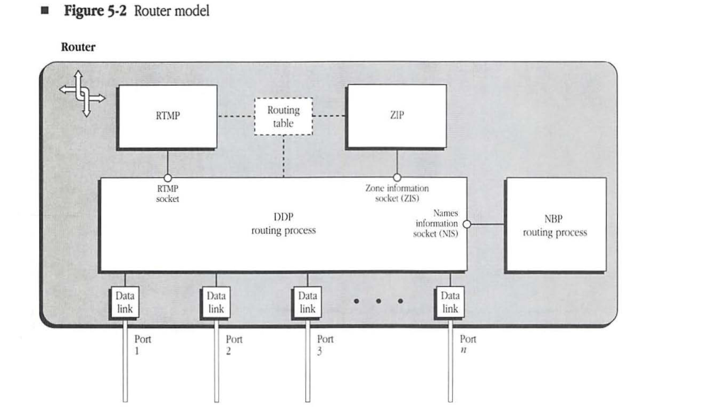
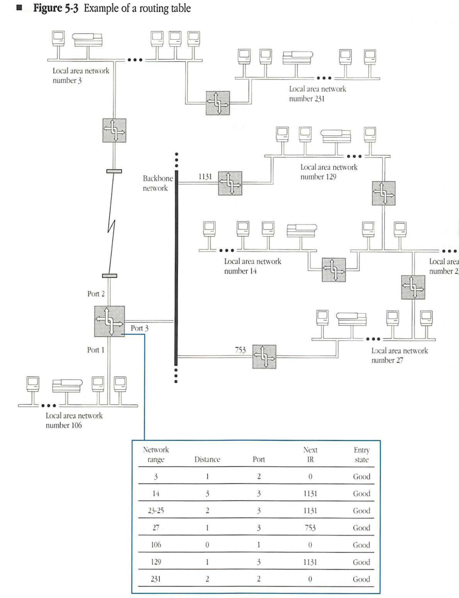
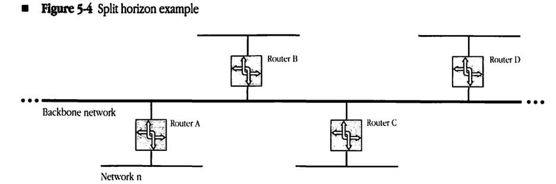
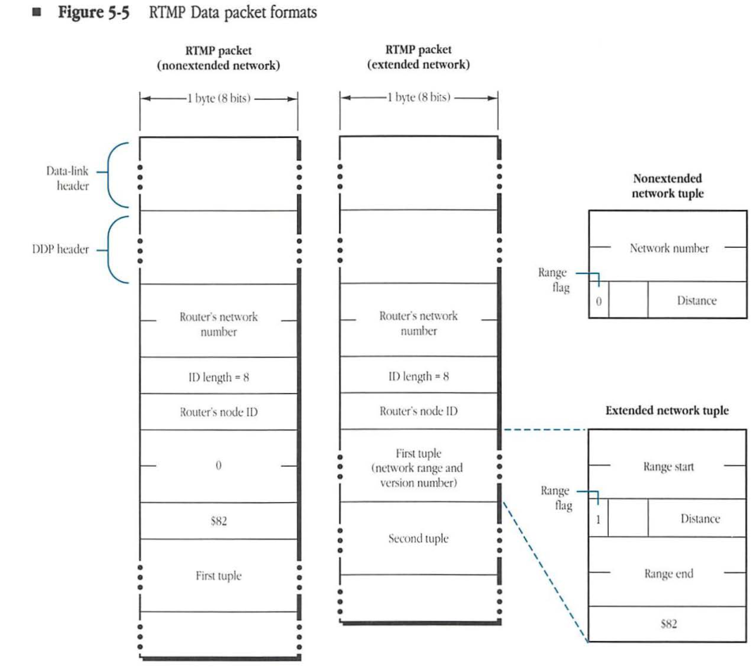
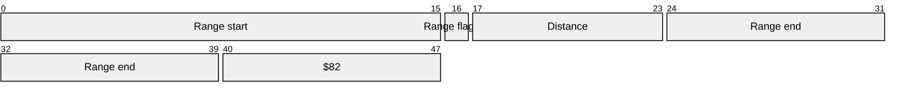
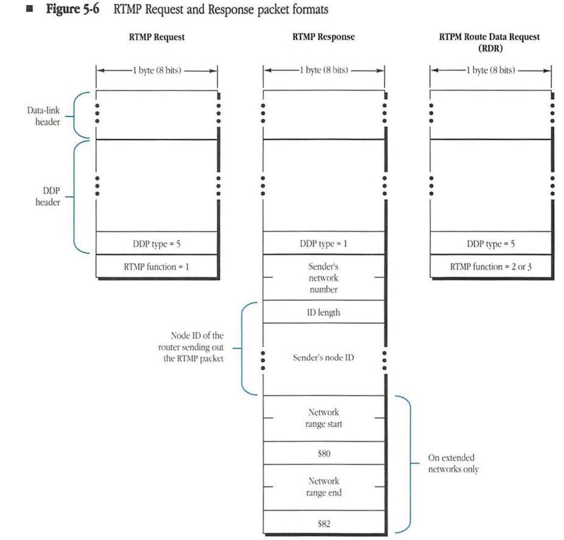
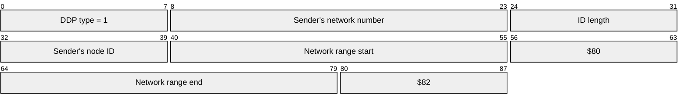
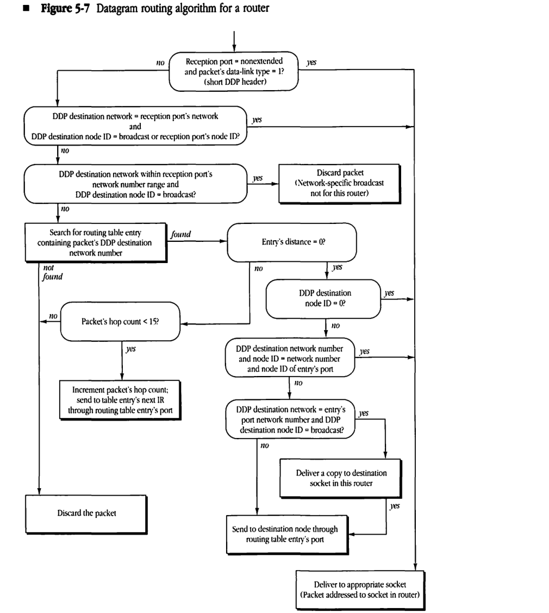
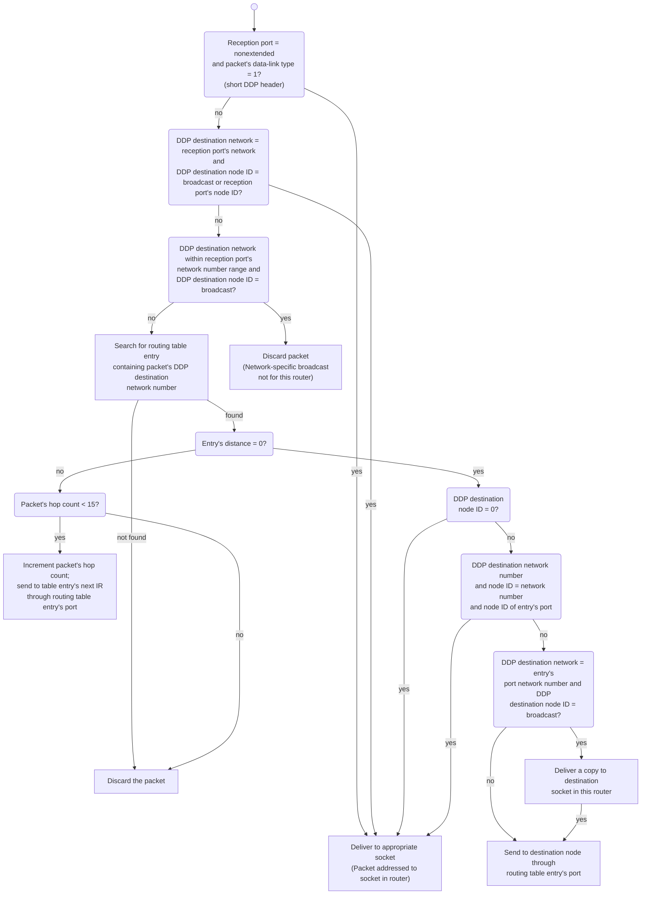

# Routing Table Maintenance Protocol

| Field | Value |
|-------|-------|
| **Source** | [Inside AppleTalk Second Edition (1990)](https://vintageapple.org/macbooks/pdf/Inside_AppleTalk_Second_Edition_1990.pdf) |
| **Part** | Part II - End-to-End Data Flow |
| **Chapter** | 5 |
| **Pages** | 125–150 |
| **Converted** | 2026-04-05 |
| **Engine** | gemini-flash |

---

# Chapter 5 Routing Table Maintenance Protocol


## THE ROUTING TABLE MAINTENANCE PROTOCOL

(RTMP) is used by internet routers (IRs) to establish and maintain the **routing tables** that are central to the process of forwarding datagrams from any source socket to any destination socket on an internet. Chapter 4, "Datagram Delivery Protocol," introduced the concept of IRs as the devices by which datagrams are forwarded/routed from any source socket to any destination socket on the internet.

This chapter describes RTMP and includes information about

*   routers and routing tables
*   RTMP packets
*   RTMP algorithms

## Internet routers

IRs are the key components in extending the datagram delivery mechanism to an internet setting. *Figure 5-1* shows three basic ways that routers can be used to build an internet. Note that a single router can incorporate all three configurations.


### Local routers

A router used to interconnect AppleTalk networks in close proximity is referred to as a **local router** and is shown in Configuration A of *Figure 5-1*. Local routers are connected directly to each of the AppleTalk networks they serve. Local routers are useful in allowing the construction of an AppleTalk internet with a large number of nodes within the same building.


### Half routers

Configuration B of *Figure 5-1* shows the use of two routers interconnected by a long-distance communication link. Each router is directly connected to an AppleTalk network. The combination of the two routers and the intervening link serves as a routing unit between the AppleTalk networks. Each router in this unit is referred to as a **half router**. The primary use of half routers is to interconnect remote AppleTalk systems. The intervening link can be made up of several devices (such as modems) and other networks (such as public data networks). Note that the *throughput* of half routers is generally lower than that of local routers, due to the generally slower communication link. Also, these communication links are often less reliable than the local networks of the internet.


### Backbone routers

Backbone routers are used to interconnect several AppleTalk networks through a **backbone network** (a non-AppleTalk network). Although these routers might be placed in the local or half router category, they present an important set of properties. Each router could be a local router connected on one side to an AppleTalk network and on the other side to the backbone network. Backbone routers are shown in Configuration C of *Figure 5-1*. Another way of connecting a backbone router to the backbone network might be through a long-distance communication link. Typically, the backbone network either has a much higher capacity than the networks it helps interconnect or is a wide-area network such as a public packet-switched datagram network.


#### Figure 5-1 Router configurations


##### Configuration A
TODO: add image
##### Configuration B
TODO add image
##### Configuration C
TODO add image

## Router model

Figure 5-2 models a router as a device with several hardware ports, referred to as router ports. A router can be connected in any of the three ways previously described (local router to an AppleTalk network, half router to a communication link, or backbone router to a backbone network) or as a combination of all three. In this model, a router can have any number of ports, starting with number 1.

Each router port has associated with it a port descriptor. A port descriptor consists of the following four fields:

* a flag indicating whether the port is connected to an AppleTalk network
* the port number
* the port node address (the router's network number and node ID corresponding to the port)
* the port network number range (the network number range for the network to which the port is connected)

### Figure 5-2 Router model**



The values of these four fields are self-evident for a port that is directly connected to an AppleTalk network. When a port is connected to one end of a communication link (half router case), the port node address and port network number range are meaningless. When a port is connected to a non-AppleTalk backbone network, the port network number range is meaningless, and the port node address becomes the appropriate address of the router on the backbone network. In this latter case, a provision must be made in the design of the port description for this field to be of any size (possibly variable length) depending on the nature of the backbone network.

> * *Note:* The AppleTalk node address of a local router is different for each of the router's ports. In other words, for each AppleTalk network to which the local router is directly connected, the router acquires a different network number and node ID.

The router internals include an associated data-link process for each port, a Datagram Delivery Protocol (DDP) routing process, the routing table, and the RTMP process implemented on a statically assigned socket (SAS) known as the RTMP socket (socket number equal to 1). The IR accepts incoming datagrams from the data links and then reroutes them through the appropriate port depending on their destination network number. (The IR makes the routing decision by consulting the routing table.) The RTMP process receives RTMP packets from other routers through the RTMP socket and uses these packets to maintain/update the routing table.
Routers additionally include a Name Binding Protocol (NBP) routing process and a Zone Information Protocol (ZIP) process; the roles of these protocols are discussed in Chapters 7 and 8.


## Internet topologies

RTMP allows internets to consist of AppleTalk networks interconnected through routers in any arbitrary topology. A limitation imposed on an AppleTalk internet is that for each router no two of its ports can be on the same network. In addition, nodes on a network that is more than 16 hops away (by way of the shortest path) from another network will not be able to communicate with nodes on the second network.


## Routing tables

All routers maintain complete routing tables that allow them to determine how to forward a datagram on the basis of its destination network number. RTMP allows routers to exchange their routing tables periodically. In this process, a router receiving the routing table of another router compares and updates its own table to record the shortest path for each destination network. This exchange process allows the routers to respond to changes in the connectivity of the internet (for example, when a router goes down or when a new router is installed).

A routing table that has stabilized to all changes consists of one entry for each network that can be reached in the internet. Each entry provides the number of the port through which packets for that network must be forwarded by the router, the node address of the next IR to which the packet must be sent (network number and node ID for IRs on AppleTalk networks), and the distance to the destination network. The entry in the routing table corresponds to the shortest path known to that router for the corresponding destination network.

The distance to a network is measured in terms of hops, with each hop representing one IR that the packet traverses in its path from the current router to the destination network. This simple measure of distance is adequate for an RTMP that adapts to changes in the connectivity of the network. The distance corresponding to a network to which the router is directly connected is always 0.

* Note: Other distance measures could reflect the speeds/capacities of the intervening links and therefore try to find the minimum time path. Another method might use current traffic conditions on a particular path to modify the path's contribution to distance. The hop-count measure is selected here for its simplicity. The basic algorithm remains unchanged when more complex measures are used.

Each routing table entry has an entry state associated with it. An **entry state** can take on one of three values: good, suspect, or bad. The significance of the entry state is explained in "Routing Table Maintenance" later in this chapter.

Figure 5-3 shows a typical routing table for a router with three ports in an internet consisting of seven networks. The figure also shows the corresponding port descriptors.


#### Figure 5-3 Example of a routing table



| Network range | Distance | Port | Next IR | Entry state |
|---|---|---|---|---|
| 3 | 1 | 2 | 0 | Good |
| 14 | 3 | 3 | 1131 | Good |
| 23-25 | 2 | 3 | 1131 | Good |
| 27 | 1 | 3 | 753 | Good |
| 106 | 0 | 1 | 0 | Good |
| 129 | 1 | 3 | 1131 | Good |
| 231 | 2 | 2 | 0 | Good |


## Routing table maintenance

Routers have no record of the topology or connectivity of the internet. Consequently, RTMP must provide the mechanism for constructing routing tables and for maintaining these tables in the face of routers appearing or disappearing in the internet.

When a router is switched on, it initializes its table by examining the port descriptor of each of its ports. Any AppleTalk port with a nonzero network number range signals that the router is directly connected to that network. In this case, an entry is created in the table for that network number range, with a distance of 0 and with the number of the port. This initial table is called the **routing seed** of the router.

Every router must periodically broadcast one or more RTMP Data packets through each of its ports. The RTMP Data packets are addressed as datagrams to the RTMP socket. Therefore, every router periodically receives RTMP Data packets from all other routers on its directly connected networks, backbones, or communication links. The RTMP Data packets carry the node address of the router port through which the RTMP Data packet was sent, as well as the <network range, distance> pairs (called **routing tuples**) of the entries in the routing table of the sending router. Using these RTMP Data packets, the receiving node's RTMP adds to or modifies its own routing table.

The basic idea is that if an RTMP Data packet received by a router contains a routing tuple for a network not in the router's table, then an entry is added for that network number with a distance equal to the tuple's distance plus 1. In effect, the RTMP Data packet indicates that a route exists to that network through the packet's sender.

Similarly, if an RTMP Data packet indicates a shorter path to a particular network than the one currently in the router's routing table (if the packet's tuple distance plus 1 is less than the table entry's current distance), then the corresponding entry must be modified to indicate that the RTMP packet's sender is the next IR for that network. Even if the paths are of equal length, the entry is modified and routing information remains as up to date as possible. This process allows for the growth and adaptation of routing tables due to the addition of new routes and routers.


### Reducing RTMP packet size

The periodic broadcasting of the routing table on each of a router's directly connected data links is fundamental to the routing table maintenance process. Although this broadcasting ensures consistency of the internet's routing tables, it poses some practical problems. In the case of slow data links, such as those used between half routers, the traffic generated by this process can consume a major portion of the available channel bandwidth. This problem is also observed on networks, such as backbones, to which a large number of routers are connected. The overhead is even more notable when the internet has a large number of networks and hence large routing tables.

To address these problems, a technique known as *split horizon* is used by RTMP to significantly reduce the size of RTMP Data packets broadcasted by routers. Referring to *Figure 5-4*, it can be seen that it is never useful for a router B to tell router A that it can get to network n when the path used by B would be to go through A itself (A would just ignore this tuple anyway). Likewise, it is not useful for B to give any other neighbor routers (C,D) this information either. Thus, especially on a backbone, most of the routing table need not be sent at all.

To implement split horizon, routers do not send the entire routing table out each of their ports. Instead, the routers only send those routing tuples that may be used by routers on the network connected to that port. Specifically, all entries whose forwarding port in the routing table is equal to the port out which the entry is being sent are omitted from the RTMP Data packet.

In addition to split horizon, a more economical extension to RTMP could be designed to communicate just the changes to a routing table. Such changes to RTMP have not yet been formulated by Apple Computer.

### **Figure 5-4** Split horizon example




### Aging of routing table entries

If routers go down or are switched off, the corresponding changes in status will not be discovered through the previously mentioned process. To respond to such changes, the entries in the routing tables must be aged. *Aging* is the process by which unconfirmed routing table entries are eventually removed from the routing table. In the absence of confirmation through reception of RTMP Data packets, entries are declared suspect and, later, bad. Bad entries are eventually purged from the routing tables.

Each entry in the routing table corresponding to a network to which the router is not directly connected is the result of an RTMP Data packet that was received by the router from the next IR for that network. RTMP considers such an entry to be valid for a limited time only, called the entry validity time. Before starting the validity timer, the router goes through its routing table and changes the state of every good entry to suspect. An entry must be revalidated from a new RTMP Data packet before the timer expires.

If the next IR for a particular entry in a router's routing table goes down, that IR will not send RTMP Data packets. The validity timer will expire, and the router will not have received confirmation of the entry. At that time, the entry's state is changed from suspect to bad. Any other RTMP Data packet received with path information to the network of the entry can be used to replace the entry with the new values from that packet. If no new route is discovered, however, the bad entry will be deleted when the validity timer expires twice more.

This aging process would be sufficient to eventually remove information about a network that can no longer be reached from the routing tables of all routers. The routers that were closest to that network would age the entry out of their routing tables, then routers next to those routers would age the entry, and so on. However to speed up this process (and aid in the more speedy adoption of alternate routes), a technique referred to as *notify neighbor* is used by RTMP. The notify neighbor technique is a method of identifying entries whose state is bad when sending RTMP Data packets. Bad entries are identified in RTMP Data packets by a tuple distance of 31. Routers receiving such a tuple can automatically set the state for that entry to bad and then notify neighboring routers using the same technique the next time they send out RTMP data packets. A tuple identifying a bad entry should only be processed by the receiving router if the router sending the tuple was the one set as the next IR for the network in the tuple (otherwise there is an alternate route to that network). In addition, tuples identifying bad entries should not be sent if they would normally be eliminated by split horizon processing.

Routing table entries whose state is bad are eliminated from the routing table following two further expirations of the validity timer. Until that time, notify neighbor tuples should be sent in RTMP Data packets for those entries.

For a detailed specification of the aging process, see "RTMP Table Initialization and Maintenance Algorithms" later in this chapter.

### Validity and send-RTMP timers

Each router has a timer known as the send-RTMP timer. Every time this timer expires, the router broadcasts, through each of its ports, its routing table in the form of RTMP Data packets.

The values for the validity and send-RTMP timers have a significant effect on both the network traffic and on the propagation of routing table adaptations to changes in the internet's connectivity. The exact values of these parameters have been determined through experimentation with actual internets. These values are 10 seconds for the send-RTMP timer and 20 seconds for the validity timer.

## RTMP Data packet format

RTMP uses four kinds of packets: RTMP Data, Request, Route Data Request, and Response packets. The routing table maintenance process, discussed in the foregoing, makes use of RTMP Data packets. RTMP Request and Response packets are discussed in "RTMP and Nonrouter Nodes" and "Route Data Requests" later in this chapter.

The format of an RTMP Data packet is shown in *Figure 5-5*. The DDP type field is set to 1 to indicate that the datagram is an RTMP Data packet. The DDP data part of the packet consists of four parts: the sender's network number, the sender's node ID, a version number indicator, and the routing tuples.


#### Figure 5-5 RTMP Data packet formats



##### RTMP packet (nonextended network)

*   **Data-link header**
*   **DDP header**
*   **Router's network number**
*   **ID length = 8**
*   **Router's node ID**
*   **0**
*   **$82**
*   **First tuple**

##### RTMP packet (extended network)

*   **Data-link header**
*   **DDP header**
*   **Router's network number**
*   **ID length = 8**
*   **Router's node ID**
*   **First tuple** (network range and version number)
*   **Second tuple**

##### Nonextended network tuple


| Field | Bit offset | Width (bits) | Description |
|---|---|---|---|
| Network number | 0 | 16 | The 16-bit network number for the destination network. |
| Range flag | 16 | 1 | Set to 0 to indicate a nonextended network tuple. |
| Distance | 17 | 7 | The hop count to the destination network. |

##### Extended network tuple



| Field | Bit offset | Width (bits) | Description |
|---|---|---|---|
| Range start | 0 | 16 | The starting network number of the range. |
| Range flag | 16 | 1 | Set to 1 to indicate an extended network tuple. |
| Distance | 17 | 7 | The hop count to the destination network range. |
| Range end | 24 | 16 | The ending network number of the range. |
| $82 | 40 | 8 | The RTMP version number ($82 for AppleTalk Phase 2). |


### Sender's network number

The first 2 bytes of the RTMP Data packet's DDP data is the router's network number part of the node address of the port through which the packet is sent by the router. On a nonextended network, this field allows the receiver of the packet to determine the network number of the network through which the packet was received. (This is the network to which the corresponding port of the receiver is attached.) RTMP Data packets sent through ports that are not on AppleTalk networks (for example, over serial lines or a backbone network) should have this field set to 0.

### Sender's node ID

The bytes following the sender's network number indicate the node ID of the sender (for the port through which the packet was sent). To allow for ports connected to networks other than AppleTalk networks, this field must be of variable size. The first byte of the field contains the length (in bits) of the sender node's address, with the address itself in subsequent bytes. If the length of the node address in bits is not an exact multiple of 8, the address is prefixed with enough 0s to make a complete number of bytes. The bytes of this modified address are then packed into the sender's ID field of the packet, starting with the most-significant bits. It is from this field that the receiver of the packet determines the ID of the router sending the packet.) On an AppleTalk network this ID is combined with the sender's network number to specify the sender's complete node address.

### Version number indicator

Following the sender's node ID, in RTMP Data packets sent on non-extended networks, is a three byte field indicating the version number of the RTMP Data packet. The value of this field is currently $000082. The version number of an RTMP Data packet sent on an extended network is specified in the first tuple, as detailed in the next section.


### Routing tuples

The last part of the RTMP Data packet consists of the routing tuples from the sending router's routing table.

There are two types of routing tuples. For tuples specifying information about nonextended networks, tuples are of the form <network number, distance>. The network number is two bytes and the distance is one byte. For tuples specifying information about extended networks, tuples are of the form <network number range start, distance, network number range end, unused byte>. This form is used even for extended networks with ranges of one (for example, 3-3). The network number range start and end are two bytes each. An extended tuple is differentiated from a nonextended tuple by having the high bit of its distance field set. The unused byte in extended tuples is set to the value $82.

The first tuple in RTMP Data packets sent on extended networks serves three purposes. First, this tuple indicates the network number range assigned to that network. Second, the tuple's sixth byte, set to $82, indicates the version of RTMP being used. Third, the tuple serves as the first tuple in the packet. It may, however, also be repeated later in the packet.

For internets with a large number of networks, the entire routing table may not fit in a single datagram. In that case, the tuples are distributed over as many RTMP Data packets as necessary. Tuples are never split across packets. In any event, every time the send-RTMP timer expires, these multiple RTMP Data packets must be transmitted through each router port.

### Assignment of network number ranges

Network number ranges are set into the port descriptors of the router ports and are then transmitted through RTMP to the other nodes of each network.

Not all routers on a particular network must have the network number range set into their corresponding port descriptors. At least one router (called the seed router) on a network must have the network number range built into its port descriptor. The other routers could have a port network number range of 0; they will acquire the correct network number range by receiving RTMP Data packets sent out by the seed router.

It is a requirement that the routers on a particular network not have in their port descriptors conflicting port network number ranges for that network. The value 0 does not cause a conflict, but otherwise, all seed routers must have the same value for both the start and end of the network number range.

If a router is not a seed router for a particular port and has not yet discovered the network number range associated with that port, it should not send its routing table through that port. In addition, it should not have an entry in its routing table for that particular port until it acquires the port's network number range. However, any IR that is not a seed router must operate with regard to those ports whose network number ranges it does know.

## RTMP and nonrouter nodes

Nonrouter nodes do not need to maintain routing tables. As noted in Chapter 4, "Datagram Delivery Protocol," these nodes require only the network number range of the network to which they are connected (THIS-NET or THIS-NET-RANGE) and the network number and node ID of any router on that network (A-ROUTER). Details of the discovery and maintenance of this information depend upon whether the node resides on an extended or nonextended network.

### Nodes on nonextended networks

When a node is initialized on a nonextended network, the values of both THIS-NET and A-ROUTER are 0 (unknown). The node can discover the correct values of these two quantities in one of two ways.

The first method is to listen for RTMP Data packets that are being sent out by the routers on the network for the purpose of maintaining their routing tables. Any node relying on this passive listening approach should be sure to wait long enough to receive an RTMP Data packet.

A second, more active approach relies on the use of RTMP Request and Response packets, as shown in Figure 5-6. The node makes a request for the network number and any router's node ID by broadcasting an RTMP Request packet. This packet is a datagram with DDP type equal to 5; it can be sent by the node through any socket. The datagram is addressed to destination socket number 1 (the RTMP listening socket). When an RTMP Request packet is received by a router's RTMP process, this process responds by sending an RTMP Response packet to the source socket of the Request packet. This Response packet is identical to a normal RTMP Data packet except that it contains no routing tuples and it is sent as a directed (not a broadcast) packet to the requesting node. The requesting node thus acquires the values of THIS-NET and A-ROUTER from the sender's network number and sender's node ID fields of the Response packet.

#### Figure 5-6 RTMP Request and Response packet formats



##### RTMP Request


| Field | Bit offset | Width (bits) | Description |
|---|---|---|---|
| DDP type | 0 | 8 | DDP protocol type, set to 5 for RTMP Request. |
| RTMP function | 8 | 8 | Set to 1 for RTMP Request. |

##### RTMP Response



| Field | Bit offset | Width (bits) | Description |
|---|---|---|---|
| DDP type | 0 | 8 | DDP protocol type, set to 1 for RTMP Response. |
| Sender's network number | 8 | 16 | The network number of the sender. |
| ID length | 24 | 8 | The length of the Node ID field. |
| Sender's node ID | 32 | Variable | Node ID of the router sending out the RTMP packet. |
| Network range start | 40 | 16 | Start of the network range (on extended networks only). |
| $80 | 56 | 8 | Constant value $80 (on extended networks only). |
| Network range end | 64 | 16 | End of the network range (on extended networks only). |
| $82 | 80 | 8 | Constant value $82 (on extended networks only). |

##### RTPM Route Data Request (RDR)


| Field | Bit offset | Width (bits) | Description |
|---|---|---|---|
| DDP type | 0 | 8 | DDP protocol type, set to 5 for RTMP RDR. |
| RTMP function | 8 | 8 | Set to 2 or 3 for RTPM Route Data Request (RDR). |

In either approach, nonrouter nodes implement a simple RTMP process, known as the RTMP Stub. This process sits on the RTMP listening socket in that node and, upon receiving an RTMP Data or Response packet, copies the sender's network number and sender's node ID fields into THIS-NET and A-ROUTER. Therefore, THIS-NET and A-ROUTER are set every time an RTMP Data or Response packet is received. While THIS-NET will stabilize to a constant value, A-ROUTER may change continually (if there is more than one router on the network).

Additionally, nonrouter nodes must maintain a background timer for the purpose of aging the value of A-ROUTER. The purpose of this background timer is to handle the case in which all the routers connected to a specific network go down and the network becomes isolated. The value of this timer should be approximately 50 seconds. Each time an RTMP Data packet is received, the timer is reset. If the timer expires, A-ROUTER should be aged, meaning that A-ROUTER should be reset to 0. THIS-NET, however, should not be reset.

◆ Note: The RTMP Stub should differentiate between RTMP Data or Response packets (sent by routers) and RTMP Requests (broadcast by nonrouter nodes). The RTMP Stub should ignore RTMP Requests. RTMP Requests can be differentiated from RTMP Data or Response packets because RTMP Requests have a DDP type of 5, whereas RTMP Data and Response packets have a DDP type of 1.

### Nodes on extended networks

When a node is initialized on an extended network, THIS-NET-RANGE is set to 0-$FFFE and the network number and node ID of A-ROUTER are both set to 0. The node discovers the correct values of these two quantities and its zone name during the startup process through a ZIP GetNetInfo request, described in Chapter 8, "Zone Information Protocol."

Nodes on extended networks must also implement an RTMP Stub. If A-ROUTER is zero (either due to never being set or due to being aged), the first RTMP Data packet coming in to the RTMP Stub will indicate the presence of the first router. At this time the node can verify that its network number is within the range indicated by the router for the network (by examining the first tuple in the RTMP Data packet) and complete the parts of the startup process it could not complete at startup, setting THIS-NET-RANGE and A-ROUTER from the packet.

Once the node has acquired a value for THIS-NET-RANGE and A-ROUTER, the RTMP process, upon receiving an RTMP Data packet, first verifies that the range specified for the sender's network (in the first tuple) precisely matches the node's value of THIS-NET-RANGE. If the ranges do not match, the packet is rejected and the router aging timer not reset. Otherwise, the sender's network number and node ID are copied into A-ROUTER and the aging timer reset.

If the aging timer expires: A-ROUTER is set to 0, THIS-NET-RANGE is set to 0-$FFFE, and the zone name is aged. The RTMP stub reverts to its initial state.

* Note: Nodes on extended networks do not generally make RTMP Requests during the startup process. Routers on extended networks must still respond to these requests. RTMP Responses on extended networks should include the first routing tuple, which specifies the network number range.

## RTMP Route Data Requests

RTMP Data packets are generally broadcast once every 10 seconds. A node wishing to receive, in a directed manner, an RTMP Data packet can use an RTMP Route Data Request (RDR) packet to obtain this information. This packet has the same format as an RTMP Request packet, except it has a function code of either 2 or 3 (see Figure 5-6). A function code of 2 indicates that the router should perform split horizon processing before returning the response; a function code of 3 indicates that the router should not perform split horizon processing (should return the whole table).

A router receiving an RDR packet should send the requested information, in as many RTMP Data packets as required, back to the source internet socket address of the RDR packet. RDRs can be used by a node wishing to have routing information sent to it on a socket other than socket 1 or to obtain routing information from a router that is not on a network to which the node is directly connected.


## RTMP table initialization and maintenance algorithms

The following algorithms provide a detailed specification of the initialization and maintenance process of an active router.

### Initialization

When switched on, a router performs the following table initialization algorithm:

```pascal
FOR each port P connected to an AppleTalk network
    IF the port network number range <> 0
    THEN create a routing table entry for that network number range with
        Entry's network number range := port network number range;
        Entry's distance := 0;
        Entry's next IR := 0;
        Entry's state := Good;
        Entry's port := P;
```

This algorithm creates a routing table entry for each directly connected AppleTalk network for which the router is a seed router.

Additionally, for each port with a nonzero network number range, the router should attempt to verify that the port's network number range does not conflict with that from another router on the same network. This can be done, for instance, by broadcasting an RTMP Request or ZIP GetNetInfo packet. If a conflict is discovered, the routing seed information should not be used.

### Maintenance

The router is assumed to have two timers running continuously: the validity timer and the send-RTMP timer. The router's RTMP process responds to the following events:

* the receipt of an RTMP Data packet
* the receipt of an RTMP Request or RTMP Route Data Request packet
* the expiration of the validity timer
* the expiration of the send-RTMP timer

The following algorithms correspond to these events.


### RTMP Data packet received through port P

```pascal
IF P is connected to an AppleTalk network AND P's network number range = 0
THEN BEGIN
    P's network number range := packet's sender network number range;
    IF there is an entry for this network number range
    THEN delete it;
    Create a new entry for this network number range with
        Entry's network number range := packet's sender network number range;
        Entry's distance := 0;
        Entry's next IR := 0;
        Entry's state := Good;
        Entry's port := P;
END;

FOR each routing tuple in the RTMP Data packet DO
    IF there is a table entry corresponding* to the tuple's network number range
    THEN Update-the-Entry
    ELSE IF there is a table entry overlapping* with the tuple's network number range
    THEN ignore the tuple
    ELSE Create-New-Entry;
```

* See the section, "Tuple Matching Definitions," for definitions of *corresponding* and *overlapping*.

The following three general-purpose routines (Update-the-Entry, Create-New-Entry, and Replace-Entry) are used by this algorithm.

#### Update-the-Entry

```
IF (Entry's state = Bad) AND (tuple distance < 15)
THEN Replace-Entry
ELSE
    IF Entry's distance >= (tuple distance + 1) AND (tuple distance < 15)
    THEN Replace-Entry
    ELSE IF Entry's next IR = RTMP Data packet's sender node address
                   AND Entry's port = P
        { If entry says we're forwarding to the IR who sent us this
          packet, the net's now further away than we thought }
        THEN IF tuple distance <> 31 THEN BEGIN
            Entry's distance := tuple distance + 1;
            IF Entry's distance < 16
            THEN Entry's state := Good
            ELSE Delete the entry
        END
        ELSE Entry's state := Bad;
```


#### Create-New-Entry

```pascal
Entry's network number range := tuple's network number range;
Replace-Entry;
IF tuple's distance = 31 THEN Entry's state := Bad;
```

#### Replace-Entry
```pascal
Entry's distance := tuple's distance + 1;
Entry's next IR := RTMP Data packet's node address { network number and node ID
                                                     on an AppleTalk network }
Entry's port number := P;
Entry's state := Good;
```

#### RTMP Request packet received through port P
```pascal
IF P is connected to an AppleTalk network and P's network number range <> 0
THEN BEGIN { Prepare an RTMP Response packet }
    Response packet's sender network number := P's port network number;
    Response packet's sender node ID := P's port node ID;
    IF P is connected to an extended network
        THEN Response Packet's first tuple := P's network number range
    Call DDP to send the Response packet through port P to the
        Request's source;
END;
```

#### Validity timer expires
```pascal
FOR each entry in the routing table DO
    CASE Entry's state OF
        Good: IF entry's distance <> 0
              THEN Entry's state := Suspect;
        Suspect: Entry's state := Bad₀;
        Bad₀: Entry's state:= Bad₁;
        Bad₁: Delete the entry
    END;
```

#### Send-RTMP packet timer expires

```pascal
IF routing table is not empty
THEN FOR each router port P DO
    IF the port is connected to an AppleTalk network AND its network number
        range is nonzero
    THEN BEGIN
        Copy-in-tuples;
        Packet's sender network number := port network number;
        Packet's sender node ID := port node ID;
        Call DDP to broadcast the packet to the RTMP socket;
    END

    ELSE IF the port is not connected to an AppleTalk network
    THEN BEGIN
        Copy-in-tuples;
        Packet's sender network number := 0;
        Packet's sender node ID := port node ID;
        Call DDP to broadcast the packet through the port's data link
            to the RTMP socket;
    END;
```

#### *Copy-in-tuples*

```pascal
For each entry in the routing table
    IF the entry's port <> P   {split horizon}
    THEN IF the entry's state <> Bad
        THEN copy the entry's network number range and distance
            pair into the tuple (as long as the distance is <15)
        ELSE copy the entry's network number range and distance
            of 31 into the tuple   {Notify Neighbor}
```


### Tuple matching definitions

For purposes of routing table maintenence, it is important to define when an incoming RTMP tuple corresponds to and overlaps with an entry in the routing table. An incoming tuple corresponds to an entry in the routing table if the range start and range end of that tuple are the same as the range start and range end of the routing table entry. When comparing ranges where one of the ranges is for a nonextended network (in other words, indicated by just a single network number, like 3), that range should be considered a range of one (that is 3-3).

An incoming tuple overlaps with an entry in the routing table if any network number in either range is in both ranges. A correctly maintained routing table will contain no overlapping entries.

## RTMP routing algorithm

The routing algorithm used by the DDP router in an internet router to forward internet datagrams is shown in *Figure 5-7*. This algorithm applies only to the forwarding of packets received by the router through one of its ports and does not hold for packets generated within the router. The algorithm assumes that when a packet is received through one of the router ports, it is tagged with the number of the port and placed in a queue. The IR removes packets from this queue and then executes the algorithm of *Figure 5-7*. Remember when comparing network numbers that a destination network number of 0 will always match whatever it is being compared to.


#### **Figure 5-7** Datagram routing algorithm for a router





