# AppleTalk Transaction Protocol

| Field | Value |
|-------|-------|
| **Source** | [Inside AppleTalk Second Edition (1990)](https://vintageapple.org/macbooks/pdf/Inside_AppleTalk_Second_Edition_1990.pdf) |
| **Part** | Part IV - Reliable Data Delivery |
| **Chapter** | 9 |
| **Pages** | 198–225 |
| **Converted** | 2026-04-05 |
| **Engine** | gemini-flash |

---

# Part IV Reliable Data Delivery

PART IV DISCUSSES the protocols that add reliability to AppleTalk end-to-end data delivery. Part II described the protocols used to provide end-to-end data flow across an AppleTalk internet. Those protocols do not guarantee the delivery of the data; they merely provide a best-effort service. Two groups of protocols, corresponding to two different models of end-to-end interaction, are discussed in this part.

The first group is based on a data transaction model. The key protocol of this group is the AppleTalk Transaction Protocol (ATP). ATP provides the request-response transaction paradigm on which the session-oriented services of the AppleTalk Session Protocol (ASP) and the Printer Access Protocol (PAP) are based. While ATP is concerned with independent transactions, ASP provides a sequence of transactions guaranteed to be delivered and executed in the order in which the transaction requests are sent. PAP provides a data read/write type of service built with underlying ATP transactions. PAP is the transport/session protocol used by printers of the ImageWriter and LaserWriter families working in an AppleTalk environment.

The second group is based on a more conventional model of reliable data flow—the data stream. This model provides a bidirectional reliable flow of data bytes between any two sockets of the internet. The AppleTalk Data Stream Protocol (ADSP) has been designed for this purpose.

---

# Chapter 9 AppleTalk Transaction Protocol

## THE APPLETALK TRANSACTION PROTOCOL (ATP)

THE APPLETALK TRANSACTION PROTOCOL (ATP) satisfies the transport needs of a large variety of peripheral devices and the transaction needs for more general networking in an AppleTalk network system. ATP has been designed to be easy to implement so that maximum performance can be achieved. Furthermore, nodes with tight memory space restrictions will be able to support a sufficient subset of ATP.

The fundamental purpose of reliable transport protocols is to provide a loss-free delivery of client packets from a *source socket* to a *destination socket*. Various features can be added to this basic service in order to obtain characteristics appropriate for specific needs.

This chapter describes ATP and provides information about

* transactions and multipacket responses
* transaction bitmaps and sequence numbers
* ATP packet format and service interface


## Transactions

Often, a socket client must request the client of another socket to perform a particular higher-level function and then to report the outcome. This interaction between a requester and a responder is called a **transaction**.

The basic structure of a transaction in the context of a network is shown in *Figure 9-1*. The requester initiates the transaction by sending a **Transaction Request** (TReq) packet from the requester's socket to the responder's socket. The responder executes the request and returns a **Transaction Response** (TResp) packet reporting the transaction's outcome.

ATP is based on the model that a transaction request is issued by a client in a requesting node to a client in a responding node. The client in the responding node is expected to service the request and generate a response. The clients are assumed to have some method of specifically identifying the data or the operation sought in the request (for example, a disk block or a request to reset a clock).

The basic transaction process must be performed in the face of various error situations inherent in the loosely coupled nature of networks; these error situations include:

* The TReq is lost in the network.
* The TResp is lost or delayed in transit.
* The responder becomes unreachable from the requester.

Several different TReqs could be outstanding, and the requester must be able to distinguish between the responses received over the network. The ability to distinguish between these responses can be built by sending a **transaction identifier** (TID) with each request. A response must contain the same TID as the corresponding request. The TID, in a sense, unambiguously *binds* the request and response portions of a transaction, provided each transaction's TID value is unique.


#### **Figure 9-1** Transaction terminology

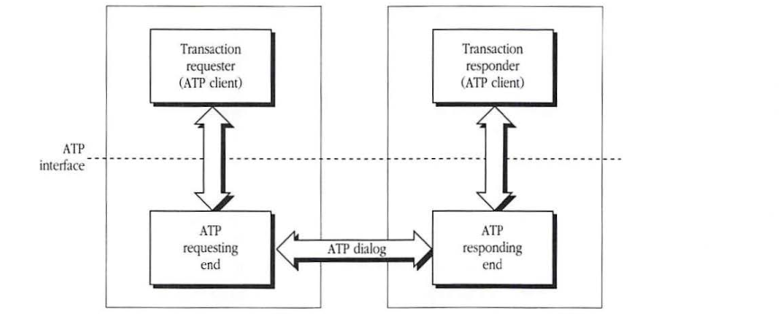

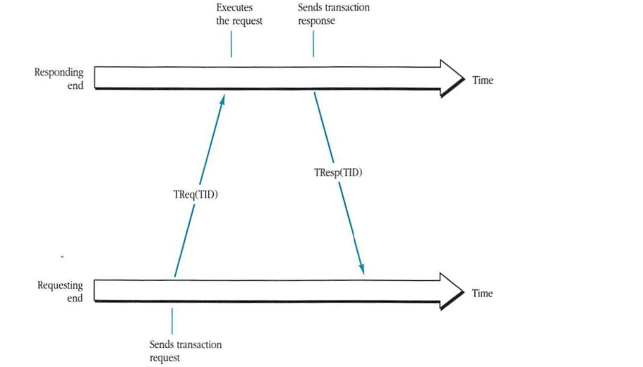

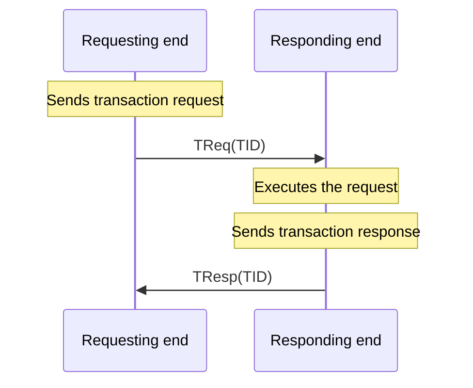

### At-least-once (ALO) transactions

In any of the three error situations previously listed, the requester will not receive the TResp and must conclude that the transaction was not completed. The requester must then activate a recovery procedure consisting of a timer and an automatic retry mechanism. If the timer expires in the requester and the response has not been received, the requester retransmits the TReq, as shown in *Figure 9-2*. This process is repeated until a response is received by the requester or until a maximum retry count is reached. If the retry count hits its maximum value, the transaction requester (the ATP client at the requester end) is notified that the responder is unreachable.

This recovery mechanism is designed to ensure that the TReq is executed at least once; the transaction is called an **at-least-once (ALO) transaction**. Such a recovery mechanism is adequate if the request is *idempotent* (that is, if repeated execution of the request is the same as executing it once). An example of an idempotent transaction is asking a destination node to identify itself.

If the ALO service is used, then ATP handles timeouts and retransmission of requests but does not automatically retransmit responses. In this case, it is up to the responding client to handle retransmission of responses to duplicate requests.

#### **Figure 9-2** Automatic retry mechanism

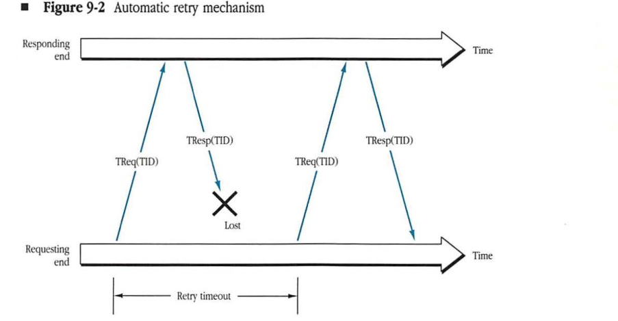

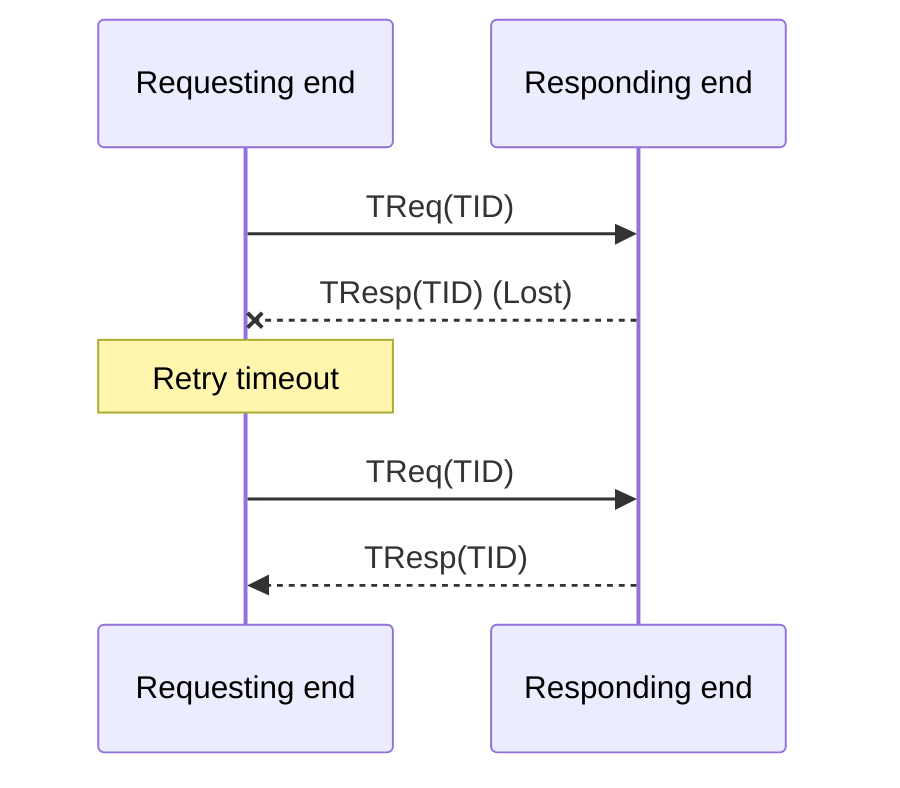
### Exactly-once (XO) transactions

When, as previously described, an ATP request is retransmitted, the transaction could be executed more than once. If the request is not idempotent, serious damage could result from the execution of the duplicate transaction request. For nonidempotent requests, a transaction service that ensures the request's execution once and exactly once is essential; the transaction is called an **exactly-once (XO) transaction**. (Whether the ALO or the XO level of service is appropriate can be determined only by the transaction requester.)

*Figure 9-3* illustrates ATP's implementation of an XO transaction protocol. In order to implement an XO transaction protocol, the responder maintains a **transactions list** of all recently received transaction requests. Upon receiving a TReq, the responder searches through this list to determine whether the request has already been received (this is known as **duplicate transaction-request filtering**). A newly received request is inserted into the list and then executed; after which the corresponding response is generated by the responder and is sent to the transaction requester. At the same time, a copy of the response is attached to the transaction's entry in the transactions list. Upon receiving a duplicate request for which a response has already been sent, the responder retransmits the response without the intervention of the ATP client. If a duplicate request is received and a response has not been sent out yet (because the request is still being executed), then ATP ignores the duplicate request.

Upon receiving a TResp, the requester should return a **Transaction Release (TRel)** packet to release the request from the responding ATP's transactions list. If this TRel gets lost, then the request would stay in the list permanently. To prevent this situation, the responder *time stamps* a request before inserting it in its list. The list is checked periodically by the responder, and those requests that have been in the list longer than the time specified by the *release timer* are eliminated.

#### **Figure 9-3** Exactly-once (XO) transactions

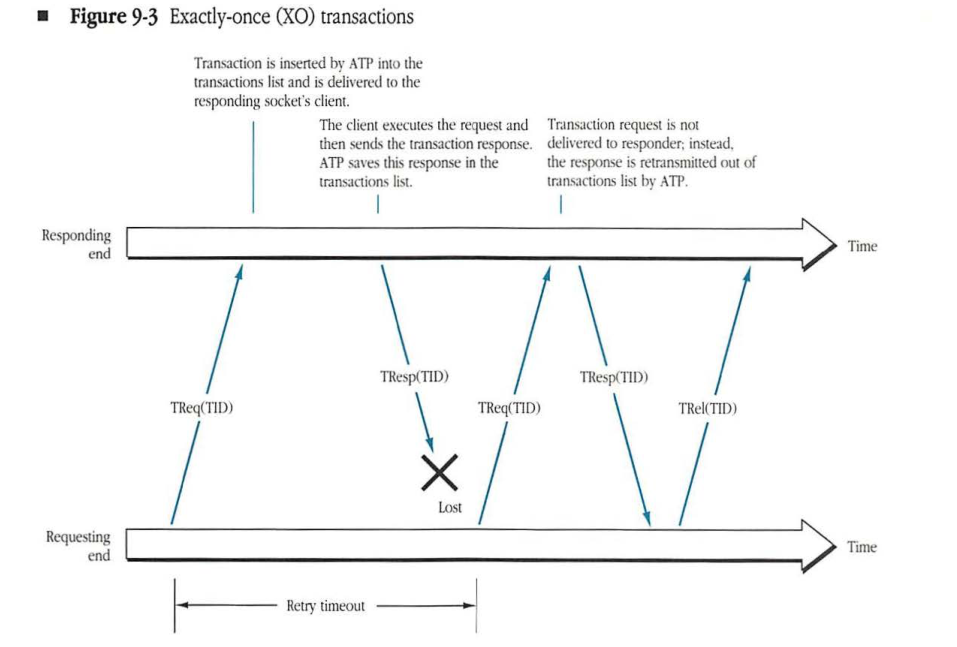

```mermaid
sequenceDiagram
    participant Req as Requesting end
    participant Res as Responding end
    
    Req->>Res: TReq(TID)
    Note over Res: Transaction is inserted by ATP into the<br/>transactions list and is delivered to the<br/>responding socket's client.
    
    Note over Res: The client executes the request and<br/>then sends the transaction response.<br/>ATP saves this response in the<br/>transactions list.
    Res--xReq: TResp(TID)
    Note over Req,Res: Lost
    
    Note over Req,Res: Retry timeout
    
    Req->>Res: TReq(TID)
    Note over Res: Transaction request is not<br/>delivered to responder; instead,<br/>the response is retransmitted out of<br/>transactions list by ATP.
    Res->>Req: TResp(TID)
    
    Req->>Res: TRel(TID)
```

This method of filtering duplicate requests by consulting a list of recently received transactions is quite effective in ensuring XO service in most environments. However, it does not guarantee XO service in all environments. If packets are guaranteed to arrive in the order in which they were sent (for example, on a single AppleTalk network), then this technique of filtering duplicate requests is completely effective. However, in an internet environment, packets may arrive at their destination in a different order from the one in which they were sent. This out-of-order delivery can occur because of the existence of multiple paths from source to destination and the various transmission delays on these paths. As a result, unusual situations can take place, such as the one shown in Figure 9-4, in which the original TResp was delayed long enough in the internet to provoke a retransmission of the request.

#### **Figure 9-4** Duplicate delivery of exactly-once (XO) mode

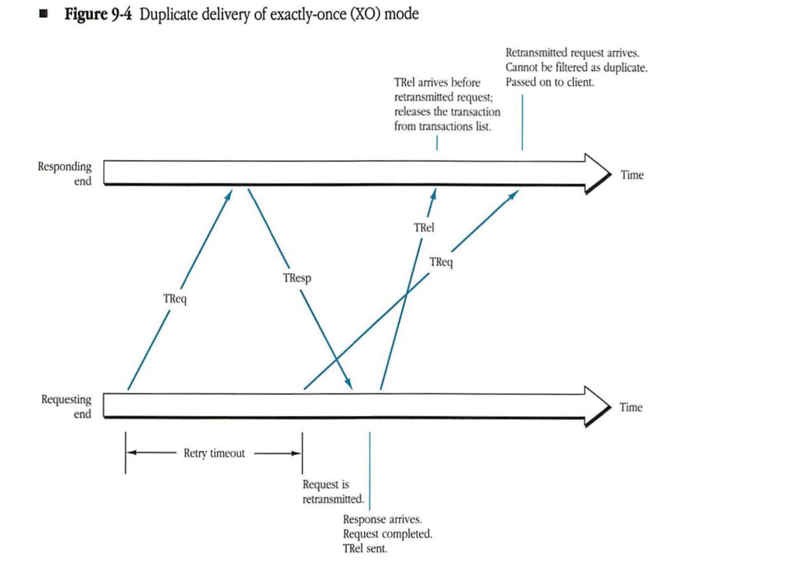

```mermaid
sequenceDiagram
    participant Rqr as Requesting end
    participant Rsp as Responding end

    Note over Rqr: TReq starts
    Rqr->>Rsp: TReq
    Note over Rqr: Retry timeout

    Note over Rqr: Request is retransmitted
    Rqr->>Rsp: TReq (retransmitted)

    Rsp-->>Rqr: TResp (delayed)
    Note over Rqr: Response arrives. Request completed. TRel sent.
    Rqr->>Rsp: TRel

    Note over Rsp: TRel arrives before retransmitted request; releases the transaction from transactions list.
    Note over Rsp: Retransmitted request arrives. Cannot be filtered as duplicate. Passed on to client.
```

Furthermore, if the TRel sent by the requester (upon receiving the delayed response) arrives before the retransmitted request, the responder (upon receiving the TRel) releases the request from the responder's transactions list. As a result, when the retransmitted request arrives at the responder, it cannot be filtered out as a duplicate. It should be noted that the probability of the occurrence of the situation of Figure 9-4 is quite low. Furthermore, ATP XO does ensure that if a duplicate request is somehow delivered by ATP to the responder (as in the above example), then the transaction has already been completed and the request can be ignored by the responder. Thus, clients requiring a higher level of guaranteed XO service can obtain it by augmenting the ATP mechanism with some form of simple sequence number checking, which allows a responder to detect delayed duplicate requests. An example of such a sequence number check is detailed in Chapter 10, "Printer Access Protocol."

◆ *Note:* ATP XO should be considered an optional part of ATP. Nodes that do not require XO service need not implement it. Developers should keep in mind, however, that higher-level protocols, such as the Printer Access Protocol (PAP) and the AppleTalk Session Protocol (ASP), may require ATP XO service.

## Multipacket responses

This basic ATP model is adequate for most interactions. However, since the underlying network restricts the size of packets that can be exchanged, the TResp may not fit in a single packet. For this reason, the TReq and TResp are looked upon as *messages* (not packets). Although ATP restricts its TReqs to single packets, it allows the TResp message to be made up of several sequentially arranged packets. When the requesting node receives all the response packets (that is, the complete response message), the transaction is considered complete and the response is delivered as a single entity to the ATP client (the transaction requester).

The maximum size (number of packets) of a TResp message is limited to eight packets. The maximum amount of data in an ATP packet (request or response) is 578 bytes. This limit is derived from the Datagram Delivery Protocol (DDP) maximum packet size of 586 bytes minus ATP's header size of 8 bytes.

## Transaction identifiers

A transaction identifier (TID) is generated by the ATP requesting end and sent along with the TReq packet. An important design issue is the size of these IDs (16 bits for ATP). Their size is a function of the rate at which transactions are generated and of the **maximum packet lifetime** (MPL) of the complete network system. A basic problem exists because of the finite size of the TID, which will eventually wrap around. Once a TID value is reused, the danger exists that an old packet, with a previous instance of that TID, will arrive and be accepted as valid. Thus, the longer the MPL, the larger the TID must be. Similarly, if transactions are generated rapidly, then the TIDs must again be larger.

For a single AppleTalk network, the time taken for exchanging a TReq and a TResp will generally be on the order of 1 millisecond or greater. Therefore, at most, 1000 transactions can take place per second. From this point of view, a 1-byte TID would ensure a TID wraparound time of about one-quarter of a second.

With network interconnection through store-and-forward internet routers (IRs), however, the impact of an MPL on the order of 30 seconds makes a 1-byte TID inadequate. A 16-bit TID would increase the wraparound time to 1 minute and eliminate concerns about old retransmitted requests and responses being received as a result of TID wraparound.

In "Wraparound and Generation of TIDs" later in this chapter, the issue of generating TIDs is reviewed to account for another subtle but important characteristic of ATP—namely, transactions with infinite retries.

## ATP bitmap/sequence number

Every ATP packet includes a bitmap/sequence field in its header. This field is 8 bits wide. ATP handles lost or out-of-sequence response packets by using this field. The significance of this field depends on the type of ATP packet (TReq, TResp, or TRel).

In TReq packets, this field is known as the **transaction bitmap**. The requester indicates to the responder the number of buffers reserved for the TResp by setting a bit in the TReq packet's bitmap for each reserved buffer. The responder can examine the TReq packet's bitmap and determine the number of packets the requester is expecting to receive in the TResp message.

In TResp packets, this field is known as the ATP sequence number. The value of this field in the TResp packet is an integer (in the range 0-7), indicating the sequential position of that response packet in the TResp message. The requester ATP can use this value to put the received response packet in the appropriate response buffer (even if the response packet is received out of sequence) for delivery to the transaction requester (the ATP client). In addition, the requester ATP clears a bit in its copy of the transaction bitmap to indicate that the corresponding response packet has been received.

The actual TResp message may turn out to be smaller than was expected by the requester. Therefore, a provision is made in the response packet's header to signal an **end of message (EOM)**. This EOM is set by the responder's ATP in the last response packet of the message. Upon receiving a response packet with the EOM indication, the requester must clear all bits corresponding to higher sequential positions in its copy of the transaction bitmap.

◆ *Note:* This EOM signal is internal to ATP; the responding client tells ATP to set it, but it is not delivered to the requesting client and should not be used for higher-level communications (for example, as an end-of-file indicator).

If the requester's retry timeout expires and the complete TResp has not yet been received (indicated by one or more bits still set to 1 in the requester's transaction bitmap), then a TReq is sent out again with the current value of the transaction bitmap and the same TID as the original request. As a result, only the missing TResp packets need to be sent again by the responder.

The mechanism for requesting only the missing TResp packets is shown in Figure 9-5. In Figure 9-5, a requester issues a TReq indicating that it has reserved six buffers for the response; the request might be for six blocks of information from a disk device. The TReq packet would have in its ATP data part the pertinent information, such as what file and which six blocks of information are being requested. ATP builds the request packet and sets the least-significant 6 bits in the bitmap. When the responder receives this request packet, it examines the request's ATP data and bitmap and then determines the type and range of the request to be serviced. The six blocks are retrieved from the disk and passed to the ATP layer in the responding node. They are then sent back to the requesting node; each block is in a separate packet with its sequence number indicating the packet's sequential position in the response.

#### **Figure 9-5** Multipacket response example

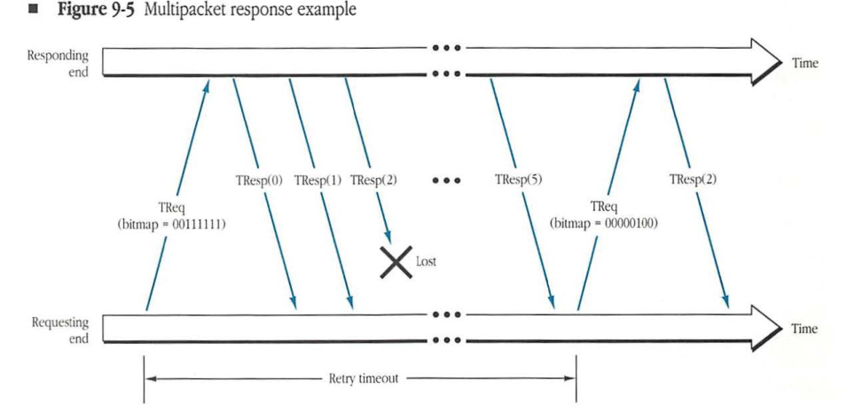

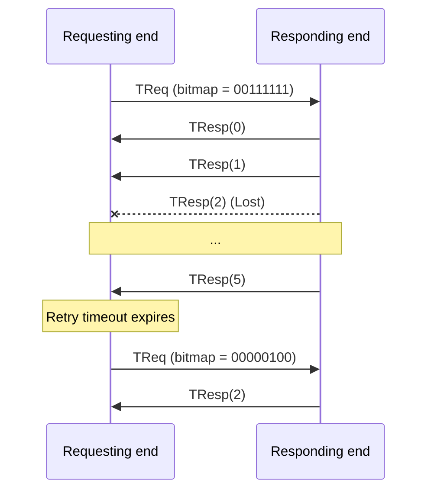
*Figure 9-5* shows a case in which the third response packet is lost in the network. Thus, the retry timeout will expire in the requester; this action causes a retransmission of the original request (transparently to the ATP requesting client) but with a bitmap reflecting only the missing third response packet.

> ◆ *Note:* Single packet request-response transactions are simply the lesser case in which the TReq has 1 bit only set in its bitmap. If two nodes are expected to communicate in this single-packet manner, no extra packet overhead is added by the protocol.


## Responders with limited buffer space

A potential difficulty, especially with XO transactions, is that a responder might not have enough buffer space to hold the entire TResp message until the end of the transaction (determined by the receipt of a TRel).

For such responders, ATP provides a mechanism to reuse their buffers through a confirmation of response packet delivery. This reuse is achieved by piggy-backing in a response packet a request to send transaction status (STS). Upon receiving an STS response packet, the requester immediately sends out a TReq with the current bitmap, thus providing the responder a way to determine which response packets have been received. (In other words, the current bitmap indicates which response packets have not yet been received.) The responder can then use this bitmap to free buffers holding already-delivered response packets.

Two client interface issues arise in connection with the **send transaction status (STS) bit**. The retransmitted TReq will be detected by ATP XO as a duplicate and hence will not be delivered to the responding client. Thus, ATP must provide some way of conveying the updated bitmap to the user without the delivery of a duplicate request. Also, in an internet, TReqs can be received out of order; if a duplicate TReq is received whose bitmap indicates that fewer responses have been received than indicated in a previous TReq, then the duplicate TReq should be ignored as a delayed duplicate and should not be delivered to the user.

*Figure 9-6* shows the use of STS in an example in which a responder with only two buffers services a request for a seven-packet response. TReq packets sent in response to an STS do not consume the retry count, but do reset the retry timeout.

#### **Figure 9-6** Use of STS

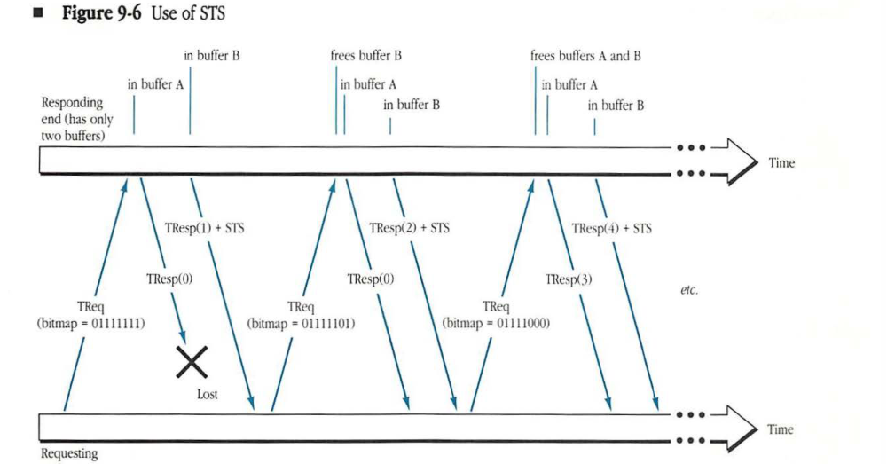

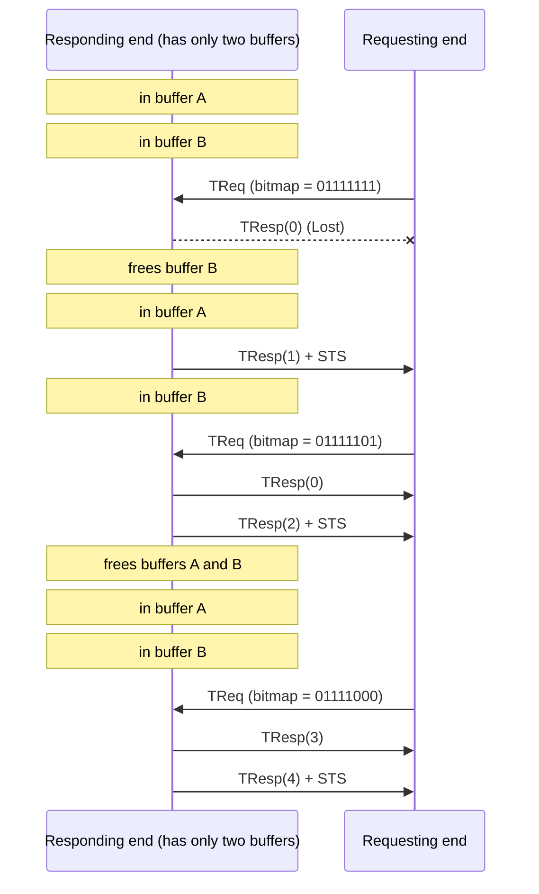

## ATP packet format

The format of an ATP packet is shown in *Figure 9-7*. An ATP packet consists of an 8-byte ATP header plus up to 578 ATP data bytes. The first byte of the ATP header is used for **control information** (CI). The 2 high-order bits of the CI contain the packet's function code. These bits are encoded in the following way:

*   01 = TReq
*   10 = TResp
*   11 = TRel

The XO bit must be set in all TReq packets that pertain to the XO mode of operation of the protocol. The EOM bit is set in a TResp packet to signal that this packet is the last packet in the transaction's response message. The STS bit is set in TResp packets to force the requester to retransmit a TReq immediately.

#### **Figure 9-7** ATP packet format

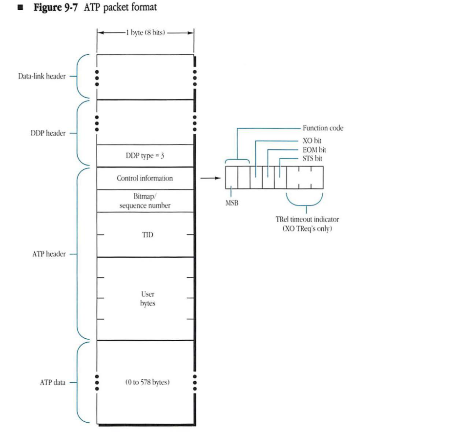


| Field | Bit offset | Width (bits) | Description |
|---|---|---|---|
| Function code | 0 | 2 | Identifies the ATP packet type. |
| XO bit | 2 | 1 | Exactly-once bit. |
| EOM bit | 3 | 1 | End-of-message bit. |
| STS bit | 4 | 1 | Send-transaction-status bit. |
| TRel timeout indicator | 5 | 3 | Transaction release timeout indicator (used for XO TReq's only). |
| Bitmap / sequence number | 8 | 8 | Bitmap (for TReq and TResp) or sequence number (for TResp). |
| TID | 16 | 16 | Transaction Identifier. |
| User bytes | 32 | 32 | Four bytes for use by the transaction-based protocol. |
| ATP data | 64 | 0–4624 | Transaction data (0 to 578 bytes). |

The remaining 3 bits of the CI should always be set to zero, except in the case of an XO TReq packet. In this case, these three bits are an indicator as to the value of the release timer to use for the transaction. These bits are encoded in the following way:

*   000 = 30 second TRel timer
*   001 = 1 minute TRel timer
*   010 = 2 minute TRel timer
*   011 = 4 minute TRel timer
*   100 = 8 minute TRel timer

Other values are reserved and should not be used.

◆ *Note*: AppleTalk Phase 1 nodes will not honor the TRel timer indicator field in XO TReq packets and will always use a TRel timer value of 30 seconds.

The 8 bits immediately following the control field comprise the ATP bitmap or sequence number field. The packets comprising the TResp message are assigned sequence numbers 0–7. The sequence number (encoded as an integer) is sent in the ATP sequence number field of the corresponding response packet.

In the case of a TReq packet, a bit of the bitmap is set to 1 for each expected response packet. The least-significant bit corresponds to the response packet with sequence number 0, up through the most-significant bit that corresponds to the response packet with sequence number 7.

The third and fourth bytes of the ATP header contain the 16-bit TID. TIDs are generated by the ATP requester and are incremented from transaction to transaction as unsigned 16-bit integers (a 0 value is permitted).

The last 4 bytes of the ATP header are not examined by ATP and are used to send client data. Strictly speaking, they should not be considered part of the ATP header. However, they can be used by an ATP client to build a simple header for a higher-level protocol. These bytes have been separated out to allow an implementation of ATP that handles an ATP request or response message’s data in an assembled, contiguous form, without interposed higher-level headers. ATP client interfaces should build appropriate mechanisms for exchanging these 4 user bytes independent of the data.

◆ *Note*: The ATP user bytes contained in a TRel packet are not significant, and clients should not use them.

## ATP interface

The ATP interface, shown in Figure 9-1, is made up of five calls described later in this chapter.

Developers can visualize the ATP package (an implementation of ATP) as consisting of two parts, one each at the requester and the responder ends. The calls to the ATP interface are discussed in the context of both the ATP requesting end and the ATP responding end of Figure 9-1.

In the following description of the protocol, various details of the interface are not specified because they are implementation-dependent. The description is adequate for defining the characteristics of the ATP service provided to the next higher layer.

The availability of multiprocessing in the network node is not required. Descriptions of the various interface calls have been written in a generic form indicating parameters passed by the caller to the ATP implementation as well as results returned by the ATP implementation to the caller. The result codes and their interpretation depend on the specifics of the implementation of a call. If the call is issued synchronously, the caller is blocked until the call's operation has been completed or aborted. The returned parameters then become available when the caller is unblocked. In the case of asynchronous calls, a call completion mechanism is activated when the operation completes or aborts. Then the returned parameters become available through the completion routine mechanism.

At least two kinds of interfaces are anticipated:

* a packet-by-packet passing of response buffers to and from ATP
* a response message (in other words, the message is in a contiguous buffer)

The two kinds of interfaces are analogous to the familiar packet stream and byte stream interfaces available for data stream protocols. However, implementers are completely free to provide any type of interface they consider appropriate.

### Sending a request

The transaction requester (ATP client) issues a call to send a TReq. The transaction requester must supply several parameters with the call. These parameters include the address of the destination socket, the ATP data part, user bytes of the request packet, buffer space for the expected response packets, and information as to whether the XO mode of service is required. In addition, the transaction requester specifies the duration of the retry timeout to be used and the maximum number of retries. A provision must be made in the interface for the transaction requester to indicate infinite retries—in other words, retransmitting the request until a response is obtained. The transaction requester may be provided with the ability to specify the socket through which the request should be sent. (Alternatively, ATP could pick the socket for the requester.) In addition, if the request is XO, the caller should pass an indicator as to the value to be used for the transaction release timer.

| | |
|---|---|
| **Call parameters** | transaction mode (XO or ALO) |
| | transaction responder's address (network number, node ID, and socket number) |
| | ATP request packet's data part and its length |
| | ATP user bytes |
| | expected number of response packets |
| | buffer space for the TResp message |
| | retry timeout |
| | maximum number of retries |
| | TRel timeout indicator (XO requests only) |
| | socket through which to send the request (optional) |
| **Returned parameters** | result code: success; failure |
| | number of response packets received |
| | user bytes from responses |

A result code of failure is returned if ATP has exhausted all retries and a complete response has not been received.

◆ Note: No error is returned if the caller requests XO service and the responder does not support it; in this case, the request will be executed at least once.
A result code of success is returned whenever a complete response message has been received. A complete response is received if either of the following occurs:

* All response packets originally requested have been received.
* All response packets with sequence number 0 to an integer $n$ have been received, and packet $n$ had the EOM indication set.

In either case, the actual number of response packets received is returned to the requesting client. A count of 0 should indicate that the other end did not respond at all. In the case of a count that is not 0, the client can examine the response buffers to determine which portions of the response message were actually received and, if appropriate, detect missing pieces for higher-level recovery.

### Opening a responding socket

An ATP client uses this call to instruct ATP to open a socket (either statically or dynamically assigned) for receiving TReqs. If the socket is statically assigned, the client passes the socket number to ATP; otherwise, the dynamically assigned socket number is returned to the caller.

When opening this socket, the client is, in effect, opening a transaction listening socket. The call allows the socket to be set up so that requests are accepted only from a specified network address (provided in the call). This address can include a 0 in the network number, node ID, or socket number field to indicate that any value is acceptable for that field.

| | |
| :--- | :--- |
| **Call parameters** | transaction listening socket number (if statically assigned) |
| | admissible transaction requester address (network number, node ID, and socket number) |
| **Returned parameters** | result code: success; failure |
| | local socket number (if dynamically assigned) |

> ◆ *Note:* This call does not set up any buffers for the reception of TReqs. Clients must use the call for receiving a request to set up buffers.

### Closing a responding socket

This call is used to close a previously opened responding socket.

**Call parameter**
* transaction listening socket number

**Returned parameter**
* result code: success; failure

### Receiving a request

A transaction responder issues this call to set up the mechanism for reception of a TReq through an already-opened transaction responding socket.

**Call parameters**
* local socket number on which to listen
* buffer for receiving the request

**Returned parameters**
* result code: success; failure (buffer overflow)
* the received request's ATP data
* received request's user bytes
* TID
* transaction requester's address (network number, node ID, and socket number)
* bitmap
* XO indication

### Sending a response

When a transaction responder has finished servicing a transaction request, it issues this call in order to send out one or more response packets. ATP will send out each response buffer with the indicated TID and a sequence number indicating the position of the particular response packet in the response message.

**Call parameters**
* local socket number (the responding socket)
* TID
* transaction requester's address (network number, node ID, and socket number)
* TResp message packets (ATP data part)
* transaction user bytes (up to eight sets of 4 bytes each)
* descriptors to determine the sequence numbers of the response packets
* EOM and STS control

**Returned parameter**
* result code: success; failure

## ATP state model

The following description is not a formal specification but an aid for protocol implementers. The appropriate actions to respond to all possible events are presented in this model.

The ATP requester must maintain all information necessary for retransmitting an ATP request and for receiving its responses. This information is referred to as the **transaction control block** (TCB). More specifically, the TCB should contain all the information provided by the transaction requester in a call for sending a request, plus the TID, the request's bitmap, and a response-packets-received counter. A retry timer is associated with each transaction request and TCB. The retry timer is used to retransmit the request packet in order to recover from the loss of request or response packets.

The ATP responder must maintain for each call a **request control block** (RqCB) for receiving a request issued by a client in that node. This block contains the information provided by that call, including all data pertinent to the buffers and to the implementation-dependent client delivery mechanism.

The **response control block** (RspCB) is needed only in nodes implementing the XO mode of operation. It holds the information required to filter duplicate requests and to retransmit packets in response to these duplicates. A release timer is associated with each RspCB. This timer is used to release the RspCB if the release packet sent by the requester is lost. The transactions list mentioned in "Exactly-Once (XO) Transactions" earlier in this chapter consists of these RspCBs. The release timer is set to the value indicated in the TReq packet.


* Note: The release timer is started as soon as a RspCB is set up (in other words, when the responder's socket receives the TReq). The timer is reset every time a TResp is sent by the responder. This implies that the responding client must send the first TResp within one TRel timer interval of the TReq's arrival and then send subsequent TResps at a maximum separation of one TRel timer from each other. Failure to do so can result in the RspCB being destroyed, making it possible for a duplicate request to be delivered to the responding client.

### ATP requester

The ATP requester maintains all information for retransmitting an ATP request and for receiving its responses. A list of events specific to the ATP requester follows and includes step-by-step actions for responding to the events.

*Event: Call to send a request issued by a transaction requester in the node*

1. Validate the following call parameters:
    * The number of response packets should be a maximum of eight.
    * The ATP request's data should be a maximum of 578 bytes long.
    If either parameter is invalid, then reject the call.
2. Create a TCB:
    * Insert the call parameters into the TCB.
    * Clear the response-packets-received counter.
    * Insert the retry count into the TCB.
3. Generate a TID:
    * This TID must be generated so that the packets of the new transaction will be correctly distinguished from those of other transactions (details of TID generation are discussed at the end of this chapter).
    * Save the TID in the TCB.
4. Generate the bitmap for the TReq packet and save a copy of it in the TCB.
5. Prepare the ATP header:
    * Insert the TID and the bitmap.
    * Set the function code bits to binary 01.
    * *Only if XO mode is implemented:* If the caller requested XO mode, then set the XO bit and the indicated value of the TRel timer bits.
6. Call DDP to send the TReq packet (ignore any error returned by DDP).
7. Start the request's retry timer.

*Event: Retry timer expires*

1. If retry count = 0, then:
    * Set the result code to failure.
    * Notify the transaction requester (the client in the node) of the outcome.
    * Remove the TCB.

2. If retry count <> 0, then:
    - Decrement the retry count (if not infinite).
    - Change the bitmap in the ATP request's header to the current value in the TCB.
    - Call DDP to retransmit the request packet (ignore any errors returned by DDP).
    - Start the retry timer.

*Event: TResp packet received from DDP*

1. Use the packet's TID and source address to search for the TCB.
2. If a matching TCB is not found, then ignore the packet and exit.
3. If a matching TCB is found, then check the packet's sequence number against the TCB's bitmap to determine whether this response packet is expected. The packet is expected if the bit corresponding to the response packet's sequence number is set in the TCB's bitmap. If the packet is not expected, then ignore it and exit.
4. If the response packet is expected, then:
    - Clear the corresponding bit in the TCB bitmap.
    - Set up the response packet's ATP data and user bytes for delivery to the transaction requester.
    - Increment the response packet's counter in the TCB.
5. If the packet's EOM bit is set, then clear all higher bits in the TCB bitmap.
6. If the packet's STS bit is set, then:
    - Call DDP to send the TReq with the current TCB information.
    - Reset the retry timer for the request.
7. If the TCB bitmap = 0 (a complete response has been received), then:
    - Cancel the retry timer.
    - Set the result code to success.
    - *Only if XO mode is implemented*: If the transaction is of XO mode (determined by examining the TCB), then call DDP to send a TRel packet to the responder.
    - Notify the transaction requester.
    - Remove the TCB.


### ATP responder

The ATP responder must maintain a RqCB for each call to recieve a request issued by a client in that node. A list of events specific to the ATP responder follows and includes specific step-by-step actions for responding to the events.

*Event: Call to open a responding socket issued by a client*

1. If the caller specifies a statically assigned socket, then call DDP to open that socket; otherwise, call DDP to open a dynamically assigned socket.
2. If DDP returns with an error, then set the result code to equal the error.
3. If DDP returns without an error, then:
    * Set the result code to success.
    * Save the socket number and the acceptable transaction requester address in an ATP responding sockets table.

*Event: Call issued to close a responding socket in the node*

1. Call DDP to close the socket.
2. Release all RqCBs for that socket; for systems supporting the XO mode, release all RspCBs (and cancel all release timers), if any, associated with the socket.
3. Delete the socket from the ATP responding sockets table.

*Event: Call to receive a request issued by a transaction responder*

1. If the specified local socket is not open, then return to the caller with an error.
2. Create a RqCB and attach it to the socket.
3. Save the call's parameters in the RqCB.

*Event: Call to send a response issued by a transaction responder*

1. If the local socket is invalid or if the response data length is invalid, then return to the caller with an error.
2. *Only if XO mode is implemented:* Search for a RspCB matching the call's local socket number, TID, and transaction requester address. If a match is found, attach a copy of the response to the RspCB (for potential retransmission in response to duplicate TReqs received subsequently), and restart the release timer.

3. Send the response packets through DDP, setting the ATP header of each with the function code binary 10, the caller-supplied TID, the correct sequence number for the packet's sequential position in the response message, the EOM flag set in the last response packet, and the STS flag, if requested. Ignore any error returned by DDP.

*Event: Release timer expires, only if XO mode is implemented*

1. Remove the RspCB and release all associated data structures.

*Event: TReq packet received from DDP*

1. *Only if XO mode is implemented:* If the packet's XO bit is set and a matching RspCB exists (the packet's source, destination addresses, and TID are the same as those saved in the RspCB), then:
    - Retransmit all response packets requested in the transaction bitmap.
    - Restart the release timer.
    - Return the bitmap to the client if the STS bit was set during a previous response.
    - Exit.
2. If a RqCB does not exist for the local socket or if the packet's source address does not match the admissible requester address in the RqCB, then ignore the packet and exit.
3. *Only if XO mode is implemented:* If the packet's XO bit is set, then create a RspCB, save the request's source and destination addresses, TID, and TRel timer indicator, and start its release timer.
4. Notify the client about the arrival of the request and remove the corresponding RqCB.

*Event: TRel packet received from DDP, only if XO mode is implemented*

1. Search for a RspCB that matches the packet's TID, source address, and destination address; if not found, then ignore the release packet and exit.
2. If a matching RspCB is found, then:
    - Remove the RspCB and release all associated data structures.
    - Cancel the RspCB's release timer.


## Optional ATP interface calls

In certain cases, the clients of ATP might use contextual information to enhance their use of ATP through additional interface calls. Examples are calls to release a RspCB and to release a TCB. These calls are useful in implementing certain higher-level protocols but are optional in an ATP implementation.

### Releasing a RspCB

The RspCB is used to hold information required to filter duplicate requests and to retransmit response packets for these duplicates. If the ATP client is aware that such filtering is no longer necessary, the client can indicate this to ATP through a call to release the RspCB.

For example, two clients of ATP communicate with each other using the XO mode, and they decide to have, at most, one outstanding transaction at a time. Client A calls ATP to send a TReq packet to client B. Client B sends back the response. Client A, upon receiving the response, sends out a second request (but no release packet). The second request packet, upon being received by B, signals that the response to the previous request has been received by A. Now B could simply call its ATP responder and ask it to release the previous transaction's RspCB. Arguments to this call include the requester's address and the TID of the associated transaction.

Another case in which the call would be useful is when the ATP client decides that it does not want to process the request at the current time but would rather receive a duplicate of that request at a later time.

### Releasing a TCB

The TCB contains information for retransmitting an ATP request and for receiving its responses, including an associated timer. If the ATP client is aware that such retransmission is no longer necessary, it can indicate this through a call to release the TCB.

For example, if client A needs to send data to client B, client A must first inform B of its intention and allow B to request the data. Client A can then send a TReq to B to signal "I want to write *n* bytes of data to you; please ask me for it on my socket number *s*." Instead of sending a TResp to this packet, B could just send a TReq to A's socket *s* asking for the data. The reception by A, on socket *s*, of B's request implies that A's original request has been received by B. Client A could call its ATP requester and ask it to eliminate the previous transaction's TCB. This call could also be used by the requesting-end client to cancel an outstanding ATP request at any time (for example, to abort an infinite retry request).

## Wraparound and generation of TIDs

In "Transaction Identifiers" earlier in this chapter, TIDs were described as being of finite size. Since TIDs can wrap around, an old packet stored in some internet router may arrive late and be accepted as a valid packet in a later transaction using the same identifier value. Based on an MPL estimate of 30 seconds, this problem can be avoided if the TIDs are 16 bits long (in which case, wraparound takes an estimated 1 minute or more).

A related problem occurs when completion of a particular transaction takes more than 1 minute. For example, a request that searches through an encyclopedia for all references to a particular piece of information might take several minutes. In this case, in the presence of other requests, the transaction ID could wrap around and another transaction could then be issued with the same TID, leading to an equivalent problem as described earlier. ATP does not prohibit operations of this sort. In fact, it is precisely because such transactions are possible that specification of the length of the ATP retry timer and maximum retry count is left up to ATP's transaction requesting client.

Similarly, ATP allows the requester to issue an ATP transaction with maximum retry count set to infinite. In this case, ATP continues to retransmit the TReq until a reply is received. If a reply is not sent, then the transaction will be continually retransmitted. This retransmission leads to the same TID wraparound problem.

A properly implemented ATP will function correctly in the face of these wraparound scenarios. Two key aspects of proper implementation are the use of TIDs to distinguish between transactions and the generation of TIDs.

When asked by a client to send a TReq, the ATP requesting end generates the TID for the request. At the same time, the ATP requesting end creates a TCB, and several pieces of information are saved in the TCB. These pieces of information include the number of the local socket through which the transaction is being sent, the complete internet address of the responding socket to which the transaction is being sent, and the TID. This information is saved to ensure a correct match of the response packets with the transaction. When the ATP requesting end receives a TResp, the requesting end identifies the corresponding request by looking for a TCB whose saved information matches the response packet's TID and the packet's source and destination socket addresses.

Therefore, TID wraparound by itself does not pose a problem unless it causes the simultaneous existence of two or more transactions (TCBs) with the same TID *and* the same requesting and responding socket addresses. This observation allows the specification of the following algorithm for generating TIDs:

```pascal
{ Algorithm used by ATP Requesting end to generate TID for a new transaction }
new_TID := last_used_TID;
Not_In_Use := TRUE;
REPEAT
    new_TID := (new_TID + 1) modulo 2^16;
    Search all TCBs on the local requesting socket, and if any one of these
        has (new_TID = TCB's TID) then set Not_In_Use := FALSE;
UNTIL Not_In_Use;
{ At this point new_TID has the newly generated TID }
last_used_TID := new_TID;
```

◆ **Note:** This algorithm ignores the TCB's destination socket address (that is, the algorithm does not further distinguish on the basis of the destination address for the request). This simplification of the algorithm does not reduce its effectiveness in preventing the wraparound problem.

