# Printer Access Protocol

| Field | Value |
|-------|-------|
| **Source** | [Inside AppleTalk Second Edition (1990)](https://vintageapple.org/macbooks/pdf/Inside_AppleTalk_Second_Edition_1990.pdf) |
| **Part** | Part IV - Reliable Data Delivery |
| **Chapter** | 10 |
| **Pages** | 226–246 |
| **Converted** | 2026-04-05 |
| **Engine** | gemini-flash |

---

# Chapter 10 Printer Access Protocol

The use of the word *printer* in the name of this protocol is purely historical. The protocol was originally designed for the specific purpose of communication with print **servers**, such as the Apple LaserWriter and ImageWriter printers. However, the protocol has no special features for printing and can be used by a wide variety of other kinds of servers. Figure 10-1 illustrates the protocol architecture used for communication between a user's computer (workstation) and a print server in an AppleTalk network. PAP is a client of the AppleTalk Transaction Protocol (ATP) and the Name Binding Protocol (NBP). Both of these protocols use the Datagram Delivery Protocol (DDP). PAP is an asymmetric protocol; the PAP code in the workstation is different from the PAP code in the printer.

The commands and data sent through the PAP connection are printer-dependent. For the LaserWriter printer, the dialog is in PostScript.

■ #### **Figure 10-1** Printing architecture

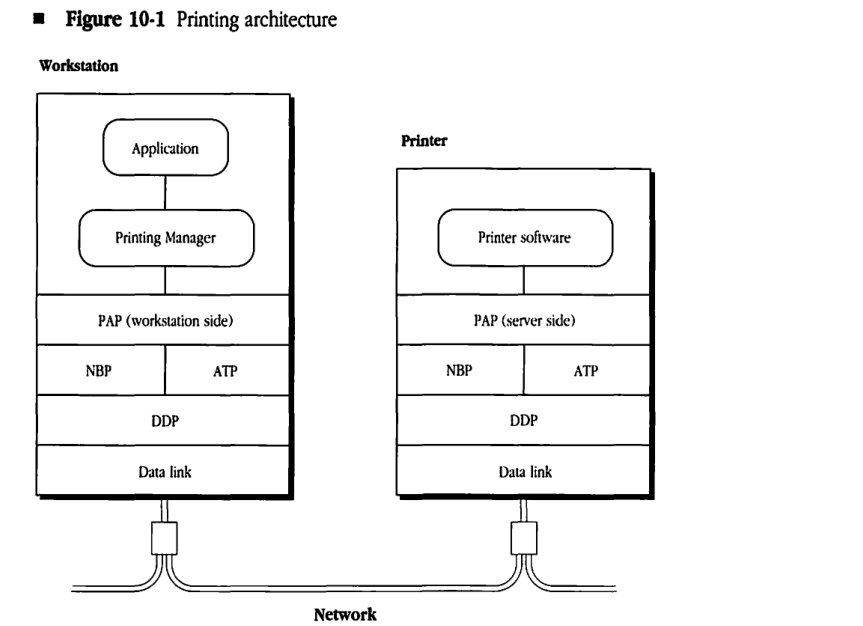

## PAP services

In order to establish a connection with a server, a PAP client in a workstation issues a PAPOpen call that results in the initiation of a connection establishment dialog with a server. The client specifies the server by its complete name; in order to initiate a dialog with the server, PAP calls NBP to obtain the address of the server's **session listening socket** (SLS). PAP also allows implementations in which the workstation's PAP client performs the NBP lookup directly (or obtains the server's address through other means) and then makes the PAPOpen call with the address of the server's SLS.

Once a connection has been opened to the server, the PAP client at either end of the connection can receive data from the other end (by issuing PAPRead calls) and can write data to the other end (through PAPWrite calls). PAP uses ATP transactions (in exactly-once mode) to transfer the data. See Chapter 9, "AppleTalk Transaction Protocol," for further details on ATP transactions.

When the data transfer has been completed, the PAP client on either end issues a PAPClose call.

The PAP client in a workstation can, at any time, issue a PAPStatus call to find out the status of a server. PAP does not restrict the syntactic or semantic structure of the returned status information beyond specifying that it is a string of at most 255 bytes preceded by a length byte. The PAPStatus call can be issued even before a connection has been established with the server.

Since PAP is not a symmetric protocol, several PAP calls are used only in server nodes. The first of these is the SLInit call. This call is issued by a server when it starts up and after it has completed its initialization. The SLInit call opens an SLS (an ATP responding socket) in the server node and causes the server's name to be registered on that socket through NBP. Multiple SLInit calls can be issued to the PAP code in the same server node; each SLInit call opens a new SLS and registers the server name provided on that socket.

A second call, the GetNextJob call, is used by the PAP client in the server to indicate to the PAP connection arbitration code that this client is ready to accept a new connection through a particular SLS opened via a prior SLInit call. The GetNextJob call primes the connection arbitration code to accept another connection establishment request from a workstation.

A server client can issue an SLClose call in order to close the SLS and to shut down any active connections on that socket.

A PAP client in the server node can use two calls, PAPRegName and PAPRemName, to register and remove (deregister), respectively, a server name for a specified SLS. For instance, PAPRegName can be used to assign more than one name to the server on a particular SLS. These calls could also be used at server setup time to change the name associated with a particular SLS.

PAP must be able to handle cases of **half-open connections**, which occur when one of the connection ends goes down or otherwise terminates the connection without informing the other end. Half-open connections must be detected by PAP and torn down. For this purpose, PAP maintains a connection timer at each end. In addition, each end of an open connection must send *tickling packets* to the other end on a periodic basis (determined by the tickle timer). The purpose of these packets is to inform the other end that the sender's end is open and "alive." The receipt of any packet on a connection resets the connection timer at the receiving end. If the connection timer expires without a packet having been received, then PAP determines that the other end is unreachable, and the connection end is torn down.

## The protocol

The basic model of a PAP-based server is that it processes a specific maximum number of jobs from workstations at the same time. The number of jobs that a server can process at once depends on the server's implementation and is not defined by PAP. While the server is processing this maximum number of jobs, it does not accept requests for initiating additional jobs; instead, it informs requesting workstations that it is busy. While a server is processing a job, a connection is said to be open between the workstation being served and the server. A one-to-one correspondence exists between the number of open connections and the number of jobs being processed by the server. When the server completes a particular job, the corresponding connection is closed, and the server can notify its PAP that it is able to accept another connection from a workstation.

When a server process is first started, it goes through its internal initialization and then issues an *SLInit* call to its PAP code. This causes PAP to call ATP to open an ATP responding socket, which is the SLS for that server. Then, PAP calls NBP to register the server's name and to bind it to the SLS. Next, PAP issues an ATP call to receive a request on this socket, so that the server can respond to *PAPOpen* or *PAPStatus* request packets. However, the PAP client may still not be ready to accept a job. Therefore, PAP will still refuse connection-opening requests through this SLS. In this case, the server is said to be in a blocked state. *Figure 10-2* shows the server states.

After the *SLInit* call is completed, the server process issues a series of *GetNextJob* calls to indicate that it is ready to accept jobs. One such call is issued for each job that the server can accept at the time. The server is now in the waiting state and is ready to open connections and accept jobs.

As previously stated, PAP can support multiple servers within one node. Each of these servers is made available on a unique SLS, which is set up through a corresponding *SLInit* call.

#### **Figure 10-2** Server states

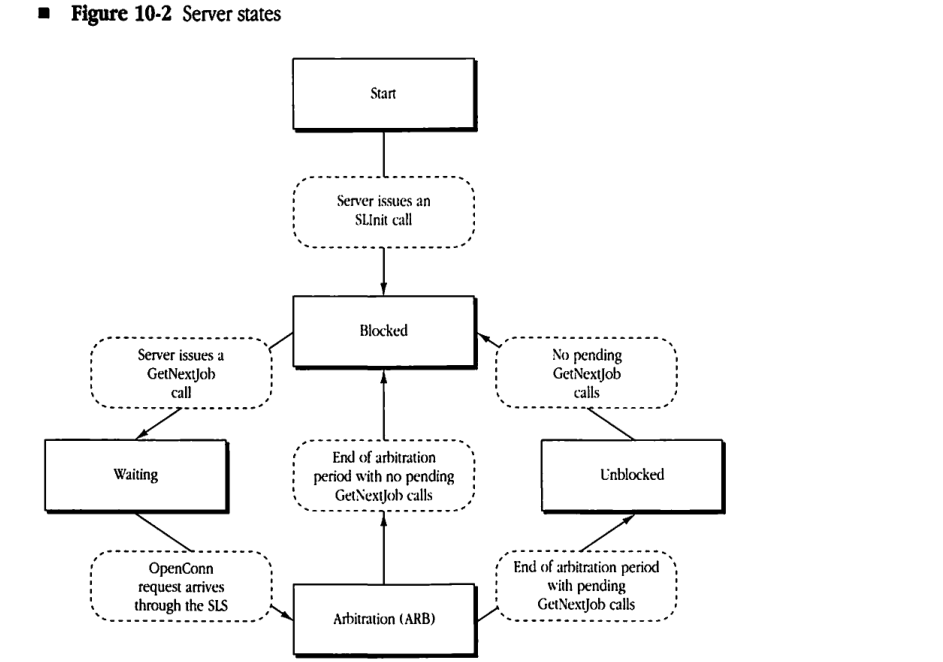

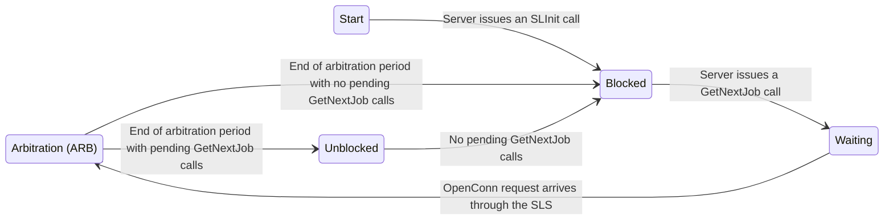
```goat
    .-------.
    | Start |
    '-------'
        |
        v
 . - - - - - - - - - .
 :  Server issues an :
 :    SLInit call    :
 ' - - - - - - - - - '
        |
        v
   .---------.
   | Blocked |<---------------------------.
   '---------'                            |
        |                                 |
 . - - - - - - - - .              . - - - - - - - - - .
 : Server issues a :              :    No pending     :
 : GetNextJob call :              :  GetNextJob calls :
 ' - - - - - - - - '              ' - - - - - - - - - '
        |                                 ^
        v                                 |
   .---------.                    .-----------.
   | Waiting |                    | Unblocked |
   '---------'                    '-----------'
        |                                 ^
        v                                 |
 . - - - - - - - - - .            . - - - - - - - - - - -.
 :  OpenConn request :            : End of arbitration   :
 :  arrives through  :            :  period with pending :
 :      the SLS      :            :  GetNextJob calls    :
 ' - - - - - - - - - '            ' - - - - - - - - - - -'
        |                                 ^
        v                                 |
 .-------------------.                    |
 |                   |--------------------'
 | Arbitration (ARB) |
 |                   |--------------------.
 '-------------------'                    |
        ^                         . - - - - - - - - - .
        |                         : End of arbitration:
        '-------------------------: period with no    :
                                  : pending calls     :
                                  ' - - - - - - - - - '
```

PAP uses NBP to name (in a server) and find (from a workstation) a server's SLS. Apart from these operations, all packets exchanged by PAP are sent through ATP. Each such PAP packet contains a 1-byte quantity in the ATP user bytes that indicates the packet's PAP function.


### Connection establishment phase

A **connection** is a logical relationship between two PAP entities, one in the workstation node and the other in the server node. Data can be exchanged by two PAP clients only after a connection has been established (opened). Since PAP uses ATP to transfer data, the two communicating PAPs must accomplish the following during the connection establishment phase:

- discover the address of the ATP responding socket for the other connection end
- determine the maximum amount of data that can be transferred in an ATP transaction, based on the buffer space available at the data receiving end (This maximum size, called the **flow quantum**, is sent by each end to the other end during the connection establishment phase.)

A PAP client in a workstation initiates connection establishment by issuing a PAPOpen call. Such a client provides the complete name of the server as a call parameter. The PAP code obtains the internet socket address of the server's SLS by issuing an NBP Lookup call. The PAP code then opens an ATP responding socket (Rw), generates an 8-bit **PAP connection identifier (ConnID)**, and then sends a Transaction Request (TReq), with PAP function OpenConn, to the server's SLS. This packet contains the ConnID, the address of socket Rw, the flow quantum for the workstation, and a wait period used by the server for arbitration. All packets related to this connection that are sent by either end must contain this ConnID. PAP should ignore packets with different ConnIDs that are received through sockets associated with the connection. The workstation must generate the ConnIDs in such a way as to minimize the likelihood that any two connections opened by the workstation will have the same ConnID. (This precaution is especially necessary for connections that are established at about the same time.)

When an ATP TReq of PAP function OpenConn is received at the server's SLS, PAP executes a connection-acceptance algorithm as shown in Figure 10-2. If the server is blocked (that is, if there are no outstanding GetNextJob calls), then the server's PAP responds to the OpenConn transaction with an ATP response of PAP function OpenConnReply, indicating "server busy." Included in the OpenConnReply is a status string that is passed back to the workstation client and that can contain further details about the busy state.

If, however, the server is in the waiting state (that is, if one or more GetNextJob calls are pending), then upon receiving an OpenConn (the first one since the server went into the waiting state), the server's PAP goes into an arbitration (ARB) state for a fixed length of time (2 seconds). In the ARB state, PAP receives all incoming OpenConn requests and tries to find the ones corresponding to workstations that have been waiting the longest time for a connection. The ARB interval allows the server to implement a fairness scheme that accepts requests generated by the workstations that have been waiting the longest before accepting those from more recent entrants to the contest.

The length of time in seconds that a workstation has been waiting for a connection (called the WaitTime) is sent with the OpenConn request. When the first OpenConn request since the server went into the waiting state is received, the WaitTime value from that request is loaded into a variable associated with one of the pending GetNextJob calls. This GetNextJob call is marked as having a WaitTime associated with it. If, during the ARB interval, a new OpenConn request is received, the server examines all pending GetNextJob calls to see if any one of them does not have a WaitTime associated with it. If such a free, pending GetNextJob call is found, then the WaitTime of the just-received OpenConn request is saved with this GetNextJob. If no free GetNextJob call is found among the pending calls, then PAP compares the just-received OpenConn request's WaitTime with the values saved in the pending GetNextJobs. If the WaitTime value for the just-received OpenConn request is less than all of the WaitTime values for the pending GetNextJob calls, then PAP responds to the just-received request with an OpenConnReply that indicates "server busy." If, on the other hand, the WaitTime is greater than one or more of the WaitTimes in GetNextJob, PAP associates the new request with the GetNextJob that has the smallest saved WaitTime, replacing that WaitTime with the one from the new request.

At the end of the ARB interval, the server's PAP opens ATP responding socket R<sub>s</sub> for each connection request still associated with a GetNextJob and sends ATP responses of PAP function OpenConnReply indicating "connection accepted" to the selected (but still pending) ATP requests. These ATP responses carry the ConnID received in the OpenConn request, the address of socket R<sub>s</sub>, and the flow quantum of the server end (which is set by the SLInit call that is issued when the server is initialized). The corresponding PAP connections are now open, and the jobs from the corresponding workstations can be processed.

At the end of the ARB interval, if no GetNextJobs are pending, then the server enters the blocked state; if there are pending GetNextJobs, then the server enters the unblocked state. In the blocked state, the server cannot accept incoming OpenConn requests. However, in the unblocked state there are pending GetNextJob calls, and the server can accept additional connections (jobs).

Note that if the server is in the unblocked state, it has just been through the ARB state and has already opened connections to all workstations that have been waiting for a connection. Therefore, when the server is in the unblocked state and receives an OpenConn request, it need not enter the ARB state; the server accepts incoming OpenConn requests and sets up connections immediately. As soon as the server runs out of pending GetNextJob calls, it enters the blocked state. Then when a GetNextJob call is issued, the server again enters the waiting state.


If the workstation's PAP receives an OpenConnReply indicating that the server is busy (that is, in the blocked state), then PAP waits a specified time period (approximately 2 seconds) and issues another connection-opening transaction. Each time the workstation end repeats this process, it updates its WaitTime value. The current value of this WaitTime is sent with each OpenConn packet. Each of these OpenConn ATP transaction requests is issued with a retry count of 5 and a retry interval of 2 seconds. The workstation's PAP should provide some way for its client to abort a PAPOpen call but should otherwise keep trying until the connection is opened.

### Data transfer phase

The opening of a connection initiates PAP's data transfer phase. In this phase, PAP performs the following two functions:

* It transfers data over the connection.
* It detects and tears down half-open connections.

PAP maintains a connection timer (of 2-minute duration) at each end of a connection. This timer, used in detecting half-open connections, is started as soon as the connection is opened. Whenever a packet of any sort is received from the other end of the connection, the timer is reset. If the timer expires (if, for example, no packets are received from the other end during the 2-minute time period), the connection is torn down. This indicates to PAP that the other end has gone down, has closed its connection, or has become otherwise unreachable (if, for example, an internet has become partitioned).

For the timer mechanism to work properly, it is important that, although no client data is being transferred on the connection, PAP exchange control packets to signal that the connection ends are alive. This process is referred to as tickling, and the control packets are called tickling packets. For this purpose, as soon as a connection is established, each end starts an ATP transaction with PAP function Tickle. This transaction, known as a Tickle transaction, has a retry count of infinite and a retry time interval equal to half the connection timeout period. Tickle transactions must be at-least-once (ALO) ATP transactions. Tickle packets are sent to the other end's ATP responding socket (that is, the R_S or R_W socket). The receiver of such a TReq packet must reset its connection timer but must not send a transaction response. Tickle transactions are canceled by each end when the connection is closed.

The data transfer model used by PAP is read-driven. When the PAP client at either end of the connection wants to read data from the other end, it issues a PAPRead call. This call provides PAP with a read buffer into which the data is read; the size of the read buffer must be equal to the end's flow quantum. In response to the PAPRead call, PAP calls ATP to send an ATP transaction request with PAP function SendData and with an ATP bitmap that reflects the size of the call's read buffer. This transaction is issued with a retry count of infinite and a retry time interval of 15 seconds. The call is sent to the other end's ATP responding socket. To prevent duplicate delivery of data to PAP's clients, all ATP data transfer transactions use ATP's exactly-once (XO) mode and a sequence number. This technique of preventing duplicate delivery is described in detail in the following section, "Duplicate Filtration."

The receipt of an ATP TReq packet with PAP function SendData implies that a pending PAPRead is at the other end. This send credit can be remembered by the PAP code and used to service any pending or future PAPWrite calls issued by its client.

When a PAP client (at either end) issues a PAPWrite call, PAP examines its internal data structures to see if it has received a send credit. If it has, then the client takes the data from the PAPWrite call and sends this data in ATP response packets with at most 512 bytes of ATP data in each. The packets are of PAP function Data, and have the end-of-message (EOM) bit set in the last one. If no send credit has been received, then PAP queues the PAPWrite call and awaits a send credit from the other end. (That is, it awaits the receipt of an ATP request of PAP function SendData from the other end.) The amount of data to be sent in a PAPWrite call cannot exceed the flow quantum of the other end; PAPWrite calls that violate this restriction return immediately with an error message.

When a PAP client issues the last PAPWrite call for a particular job, it should ask PAP to send an end-of-file (EOF) indication with that call's data. The EOF indication is delivered to the PAP client at the other end as part of the received information for a PAPRead call; this indication notifies the client that the other end is finished sending data on this connection. In order to specify the end of data, the client can issue a PAPWrite call with no data to be sent; in this case, just an EOF indication is sent to the client at the other end.

### Duplicate filtration

As described in Chapter 9, “AppleTalk Transaction Protocol,” in the case of internets, ATP XO mode does not guarantee XO delivery of requests—it guarantees only that if a duplicate request is delivered to an ATP client, the request can be ignored because all responses to it have been successfully received by the other side. PAP uses a sequence number in SendData requests to enable it to detect these duplicates and to ignore them. Furthermore, since PAP maintains only one outstanding read request at a time, duplicate filtration can be accomplished in a fairly simple manner.

All SendData requests contain a sequence number in the last 2 ATP user bytes. The sequence number starts at 1 with the first such request and takes on successive values up to 65,535 before wrapping around to 1 again. The value 0 is reserved to mean unsequenced. Any SendData request received with a sequence number of 0 should be accepted by PAP without checking for duplication. This use of 0 is for compatibility with previous versions of PAP. If the sequence number is not 0, PAP should verify that the sequence number is equal to the highest sequence number of the last SendData request received. If this is not the case, the packet should be ignored as a duplicate of a previous, already-completed request. Each side of the PAP connection must maintain independently both a sequence number for its SendData requests and a sequence number for the last SendData request accepted from the other end.

### Connection termination phase

When the PAP client at either end issues a PAPClose call, PAP closes the connection. Typically, after the workstation’s PAP client has completed sending all data to the server and has received an EOF in return, the client will issue the PAPClose call. An ATP transaction request is sent to the other end with PAP function CloseConn. An end receiving a CloseConn request should immediately send back, as a courtesy, an ATP transaction response of PAP function CloseConnReply. To close a connection’s end, it is important to cancel any pending ATP transactions issued by that end, including Tickle transactions. An end receiving a CloseConn packet must cancel its pending ATP transactions for that connection as soon as it is able to do so.

At the server end, the receipt of the CloseConn causes the connection to be torn down, but the server may continue to process data for the ongoing job. When this data has been processed, the PAP client in the server can then issue a GetNextJob call in order to accept another job. In fact, the server can issue a GetNextJob call at any time in order to signal to its PAP code that it is willing to accept another job. These GetNextJob calls are queued up by PAP and used to accept incoming OpenConn requests as discussed in “Connection Establishment Phase” earlier in this chapter.

A server can also close all open connections by issuing an SLClose call, which deregisters all names and closes the server’s SLS.

### Status gathering

PAP supports status querying of the server through the PAPStatus call. A workstation client need not open a connection with the server in order to issue this call; this call can be issued at any time. The PAPStatus call results in a SendStatus request packet being sent to the server specified in the call (the server can be specified by name, in which case, PAP calls NBP to determine the server’s address). The request is sent to the server’s SLS. The server’s PAP responds with a Status reply packet that contains a Pascal-format string (length byte first) specifying the server’s status. This response is made without delivering the request to the PAP client in the server. The PAP client in the server must have previously provided the status string to PAP through an SLInit or HeresStatus call. The HeresStatus call, details of which are implementation-dependent, should be made by the PAP server client whenever the server’s status changes. This status string is also returned by PAP in OpenConnReply packets.

## PAP packet formats

As previously stated, PAP uses both NBP and ATP. NBP is used by the server’s PAP to register or remove a name on the server’s SLS. A workstation’s PAP uses NBP to determine the address of a server’s SLS from the server’s name.

Packets sent by ATP in response to PAP calls include a PAP header. The header is built by using the user bytes of the ATP header and, in some cases, by sending 4 or more bytes of the PAP header in the data part of the ATP packet.

The first ATP user byte of the PAP header is the ConnID (except in SendStatus requests and Status replies, whose first byte must be 0). The second ATP user byte is the PAP function of the packet (see the following section for a list of the PAP function values). For packets of PAP function equal to Data, the third ATP user byte is the EOF indication (a number other than 0 indicates EOF). For packets of function SendData, the third and fourth bytes are the sequence number (high byte first). OpenConn and OpenConnReply packets contain, as part of the ATP data, the ATP responding socket numbers and the flow quantum to be used for the connection. The OpenConn request additionally contains the WaitTime; the OpenConn reply contains the open result and the status string. Status replies contain just the status string.

Figures 10-3 through 10-6 illustrate the PAP headers for the various types of PAP packets. For simplicity, the DDP and data-link headers are not included.

#### **Figure 10-3** PAP OpenConn and OpenConnReply packet formats

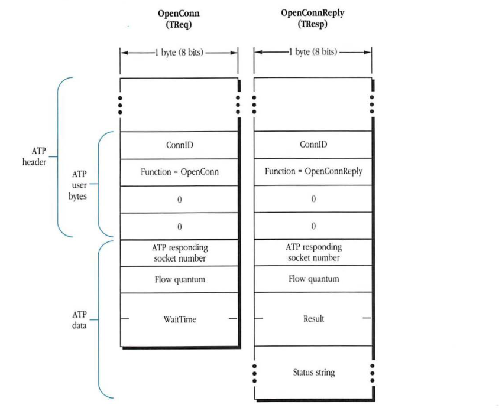

##### OpenConn (TReq)

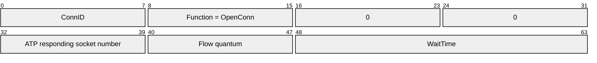

| Field | Bit offset | Width (bits) | Description |
|---|---|---|---|
| ConnID | 0 | 8 | First ATP user byte: Connection ID. |
| Function | 8 | 8 | Second ATP user byte: PAP function (OpenConn). |
| 0 | 16 | 8 | Third ATP user byte: Unused (set to 0). |
| 0 | 24 | 8 | Fourth ATP user byte: Unused (set to 0). |
| ATP responding socket number | 32 | 8 | First byte of ATP data: Responding socket number. |
| Flow quantum | 40 | 8 | Second byte of ATP data: Flow quantum. |
| WaitTime | 48 | 16 | Remaining ATP data: Connection wait time. |

##### OpenConnReply (TResp)

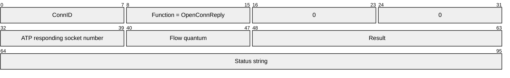

| Field | Bit offset | Width (bits) | Description |
|---|---|---|---|
| ConnID | 0 | 8 | First ATP user byte: Connection ID. |
| Function | 8 | 8 | Second ATP user byte: PAP function (OpenConnReply). |
| 0 | 16 | 8 | Third ATP user byte: Unused (set to 0). |
| 0 | 24 | 8 | Fourth ATP user byte: Unused (set to 0). |
| ATP responding socket number | 32 | 8 | First byte of ATP data: Responding socket number. |
| Flow quantum | 40 | 8 | Second byte of ATP data: Flow quantum. |
| Result | 48 | 16 | ATP data: Result of the open request. |
| Status string | 64 | Variable | ATP data: Status string. |

---

#### **Figure 10-4** PAP SendData, Data, and Tickle packet formats

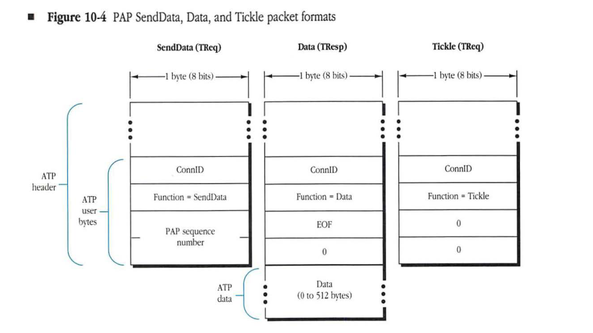

##### SendData (TReq)

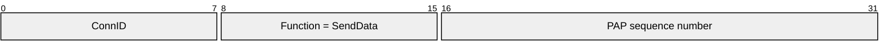

| Field | Bit offset | Width (bits) | Description |
|---|---|---|---|
| ConnID | 0 | 8 | Connection ID |
| Function | 8 | 8 | PAP function (SendData) |
| PAP sequence number | 16 | 16 | PAP sequence number |

##### Data (TResp)

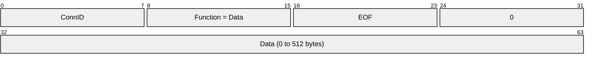

| Field | Bit offset | Width (bits) | Description |
|---|---|---|---|
| ConnID | 0 | 8 | Connection ID |
| Function | 8 | 8 | PAP function (Data) |
| EOF | 16 | 8 | End-of-file flag (non-zero if end of file) |
| 0 | 24 | 8 | Reserved (set to 0) |
| Data | 32 | variable | ATP data payload (0 to 512 bytes) |

##### Tickle (TReq)

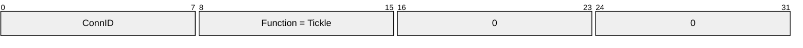

| Field | Bit offset | Width (bits) | Description |
|---|---|---|---|
| ConnID | 0 | 8 | Connection ID |
| Function | 8 | 8 | PAP function (Tickle) |
| 0 | 16 | 8 | Reserved (set to 0) |
| 0 | 24 | 8 | Reserved (set to 0) |

#### **Figure 10-5** PAP CloseConn and CloseConnReply packet formats

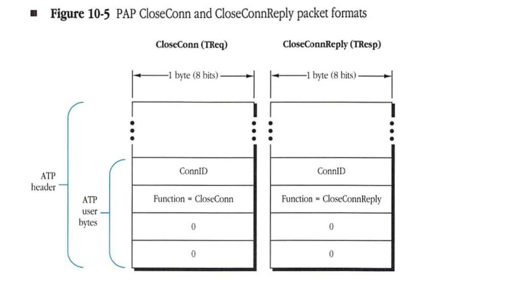

##### CloseConn (TReq)

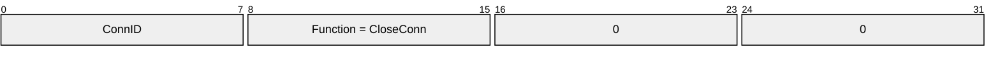

| Field | Bit offset | Width (bits) | Description |
|---|---|---|---|
| ConnID | 0 | 8 | Connection ID |
| Function | 8 | 8 | PAP function (CloseConn) |
| 0 | 16 | 8 | Reserved (set to 0) |
| 0 | 24 | 8 | Reserved (set to 0) |

##### CloseConnReply (TResp)

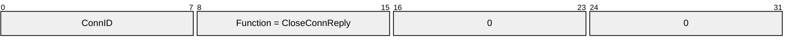

| Field | Bit offset | Width (bits) | Description |
|---|---|---|---|
| ConnID | 0 | 8 | Connection ID |
| Function | 8 | 8 | PAP function (CloseConnReply) |
| 0 | 16 | 8 | Reserved (set to 0) |
| 0 | 24 | 8 | Reserved (set to 0) |


#### **Figure 10-6** PAP SendStatus and Status packet formats

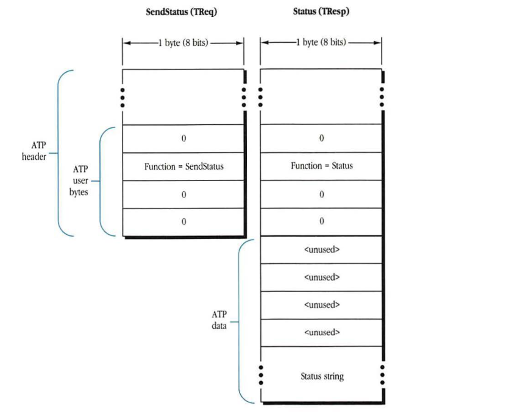

##### SendStatus (TReq)

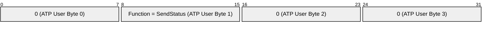

| Field | Bit offset | Width (bits) | Description |
|---|---|---|---|
| ATP User Byte 0 | 0 | 8 | Reserved, set to 0. |
| ATP User Byte 1 | 8 | 8 | Function code: SendStatus. |
| ATP User Byte 2 | 16 | 8 | Reserved, set to 0. |
| ATP User Byte 3 | 24 | 8 | Reserved, set to 0. |

##### Status (TResp)

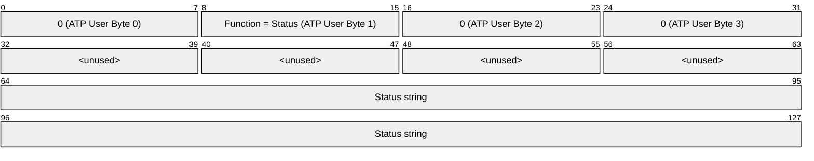

| Field | Bit offset | Width (bits) | Description |
|---|---|---|---|
| ATP User Byte 0 | 0 | 8 | Reserved, set to 0. |
| ATP User Byte 1 | 8 | 8 | Function code: Status. |
| ATP User Byte 2 | 16 | 8 | Reserved, set to 0. |
| ATP User Byte 3 | 24 | 8 | Reserved, set to 0. |
| ATP Data Byte 0 | 32 | 8 | Unused. |
| ATP Data Byte 1 | 40 | 8 | Unused. |
| ATP Data Byte 2 | 48 | 8 | Unused. |
| ATP Data Byte 3 | 56 | 8 | Unused. |
| Status string | 64 | Variable | The status information string. |

## PAP function and result values

The permissible PAP function field values are as follows:

| Function | Value |
|---|---|
| OpenConn | 1 |
| OpenConnReply | 2 |
| SendData | 3 |
| Data | 4 |
| Tickle | 5 |
| CloseConn | 6 |
| CloseConnReply | 7 |
| SendStatus | 8 |
| Status | 9 |

The values that can be returned in the result code field of a OpenConnReply are as follows:

| Result | Value | Meaning |
|---|---|---|
| NoError | 0 | No error—connection opened |
| PrinterBusy | $FFFF | Printer busy |

## PAP client interface

This section describes the PAP calls. It lists the parameters that the client must include and provides the significant interface-level aspects of each call. Some of these calls are available only in workstations, others only in servers, and others in both workstations and servers. The call definitions specify which devices can use the calls.

### PAPOpen call

A PAP client in a workstation issues the PAPOpen call in order to initiate a connection-opening dialog with the specified server.

| | |
|---|---|
| **Call parameters** | specification of the server to which a connection should be opened (either the server's NBP name or the server's SLS address) |
| | flow quantum (the number of 512-byte buffers available for each read) |
| | buffer in which the open status string is to be returned |
| **Returned parameters** | result code |
| | connection refnum (a local number assigned by the workstation's PAP to uniquely identify the connection within the workstation) |

The open status string should be returned by PAP each time it is received in an OpenConnReply and not just upon call completion. The client must use the connection reference number (refnum) in order to refer to this connection in subsequent calls in the workstation.


### PAPClose call

A PAP client in a workstation or a server must issue the PAPClose call in order to close the connection specified by the connection refnum.

| | |
|---|---|
| **Call parameter** | connection refnum |
| **Returned parameter** | result code |


### PAPRead call

The PAP client at either end issues a PAPRead call in order to read data from the other end over the connection specified by the connection refnum.

**Call parameters**
* connection refnum
* buffer in which to read the data

**Returned parameters**
* result code
* size of the data read
* EOF indication

> ◆ **Note:** PAP assumes that the buffer into which the reply data is to be read is no smaller than the flow quantum specified in the PAPOpen or the SLInit call.

### PAPWrite call

The PAP client at either end issues a PAPWrite call in order to write data to the other end over the connection specified by the connection refnum.

**Call parameters**
* connection refnum
* buffer with the data to be written
* size of the data to be written
* EOF indication

**Returned parameter**
* result code

If the data size is larger than the flow quantum of the other end, the call returns with an error.

### PAPStatus call

A PAP client in the workstation issues a PAPStatus call in order to determine the current status of the server. This call can be used at any time, regardless of whether a connection has been opened by the PAP client to the server. Upon completion, this call returns a string that contains the status message sent by the server.

**Call parameters**
* specifications of the server from which status is being requested (either the server's NBP name or the server's SLS address)
* buffer in which the status string is to be returned

**Returned parameter**
* result code

### SLInit call

The PAP client in the server issues an SLInit call in order to open an SLS and to register the server's name on this socket. The client can also include an initial status string in this call.

**Call parameters**
* NBP name of the server
* flow quantum for all connections to the server (the number of 512-byte buffers available for reads)
* status string

**Returned parameters**
* result code
* server refnum

The server refnum must be used by the server when issuing subsequent GetNextJob calls in order to identify the SLS for which the GetNextJob call is being made. The PAP code in the server node must return a unique server refnum for each SLInit call.


### GetNextJob call

The PAP client in the server issues a GetNextJob call whenever it is ready to accept a new job through the SLS specified by a server refnum.

| | |
| :--- | :--- |
| **Call parameter** | server refnum |
| **Returned parameters** | result code |
| | connection refnum (a number assigned by PAP to uniquely identify the connection) |


### SLClose call

The PAP client in the server issues an SLClose call in order to close down a server process.

| | |
| :--- | :--- |
| **Call parameter** | server refnum |
| **Returned parameter** | result code |

### PAPRegName call

The PAPRegName call is used only in server nodes. This call registers a name (as an NBP entity name for the server) on the SLS corresponding to the specified server refnum.

| | |
| :--- | :--- |
| **Call parameters** | server refnum |
| | server name to register |
| **Returned parameter** | result code |


### PAPRemName call

The PAPRemName call is used only in server nodes. This call deregisters a name from the SLS corresponding to the specified server refnum.

**Call parameters**
- server refnum
- server name to deregister

**Returned parameter**
- result code


### HeresStatus call

The PAP client in the server issues a HeresStatus call in order to provide PAP with a new status string. This call should be issued any time the status string has changed.

**Call parameters**
- server refnum
- status string

**Returned parameter**
- result code

## PAP specifications for the Apple LaserWriter printer

The following specifications detail the PAP-client implementation on the Apple LaserWriter printer.

* The flow quantum used by the LaserWriter is 8.
* The LaserWriter printer can handle only one job at a time, so it never has more than one GetNextJob outstanding. Essentially, the unblocked state does not exist on the LaserWriter; the LaserWriter printer can be in only a waiting, arbitration, or blocked state.


