# AppleTalk Session Protocol

| Field | Value |
|-------|-------|
| **Source** | [Inside AppleTalk Second Edition (1990)](https://vintageapple.org/macbooks/pdf/Inside_AppleTalk_Second_Edition_1990.pdf) |
| **Part** | Part IV - Reliable Data Delivery |
| **Chapter** | 11 |
| **Pages** | 247–285 |
| **Converted** | 2026-04-05 |
| **Engine** | gemini-flash |

---

# Chapter 11 AppleTalk Session Protocol

A WIDE VARIETY of higher-level network services are built using the model of a workstation issuing a sequence of commands to a server. The server then carries out these commands and reports the results to the workstation. For example, in a filing service, file system commands are transported to a file server and are executed there; the results are then returned to the workstation.

At the transport layer, the AppleTalk protocol architecture provides a reliable transaction service, via the AppleTalk Transaction Protocol (ATP), that can be used for transporting workstation commands to servers. However, ATP does not provide the full range of transport functions needed by many higher-level network services. This chapter describes the AppleTalk Session Protocol (ASP) designed specifically for the use of these higher-level services.

ASP is a client of ATP; it adds value to ATP to provide the level of transport service needed for higher-level workstation-to-server interaction.

## What ASP does

The concept of a session is central to ASP. Two network entities, one in a workstation and the other in a server, can set up an ASP session between themselves. A **session** is a logical relationship (connection) between two network entities; it is identified by a unique session identifier. For the duration of the session, the workstation entity can (through ASP) send a sequence of commands to the server entity. ASP ensures that the commands are delivered without duplication in the same order as they were sent and conveys the results of these commands (known as a command reply or reply) back to the workstation entity.

ASP sessions are inherently asymmetrical. The process of setting up a session is always initiated by the workstation entity (when it wishes to use the server entity's advertised service). Once the session is established, the workstation client of ASP sends commands, and the server client of ASP replies to the commands. ASP does not allow its server client to send commands to the workstation client. However, ASP provides an attention mechanism by which the server can inform the workstation of a need for attention.

More than one workstation can establish a session with the same server at the same time. ASP uses the **session identifier** (session ID) to distinguish between commands received during these various sessions. The session ID is unique among all the sessions established with the same server.

## What ASP does not do

ASP does not enforce the syntax or interpret the semantics of the commands sent by its workstation clients. Commands are conveyed as blocks of bytes to be interpreted by the server-end client of ASP. Similarly, command replies are sent back over the session to the workstation client without any syntactic or semantic interpretation by ASP.

Although ASP guarantees that commands issued by the workstation end of a session are delivered to its server end in the same order as they were issued, ASP does not ensure that the commands are executed and completed in the specified order by the server end. This proper execution and completion of commands is the responsibility of the ASP client at the server end.

An important goal in the design of ASP was to make its client interface independent of the lower-level transport protocols. Therefore, the higher-level clients of ASP can be moved from one network to another with a minimum of modification. To achieve this, it is necessary to separate from ASP both the mechanism by which a server advertises its service and the manner in which a workstation looks for this advertised service. The way these procedures are accomplished depends primarily upon the transport and naming mechanisms of a particular network; these procedures are the responsibility of the ASP clients, not of ASP itself.

For example, a server entity that needs to make its service known on the AppleTalk network calls ATP to open an ATP responding socket and then calls the Name Binding Protocol (NBP) to register a unique name on this socket. Once that is done, the server entity calls ASP to give to it the address of the ATP responding socket. ASP then starts listening on the socket for session-opening commands coming over the network. A workstation wishing to utilize this advertised service uses NBP to identify the service's socket address. Then the workstation client calls ASP to open a session.

Setting up a responding socket and looking for the socket's address through NBP are done outside the scope of ASP. The participation of ASP starts with the process of setting up a session.

ASP does not provide a user authentication mechanism. If needed, this mechanism must be supplied by a higher-level protocol than ASP. In addition, ASP does not provide any mechanism to allow the use of a particular session by more than one server entity. Such multiplexing of a session can be done by the ASP clients if higher-level protocols divide the function codes into ranges and manage them completely outside the scope of ASP. The use of a single session to gain access to various services on the same node is not recommended.

## ASP services and features

ASP provides the following services to its clients:

* setting up (opening) and tearing down (closing) sessions
* sending commands on an open session to the server and returning command replies (which might include a block of data)
* writing blocks of data from the workstation to the server end of the session
* sending an attention from the server to the workstation
* retrieving service status information from the server without opening a session

### Opening and closing sessions

Before any sessions are opened, both the workstation ASP client and the server ASP client should interrogate ASP to identify the maximum sizes of commands and replies allowed by the underlying transport mechanism. Both ends of the session can use these sizes to determine whether the underlying transport services are adequate to their needs and to optimize the size of their commands and replies.

The server entity makes itself known on the network by calling ATP to open an ATP responding socket, known as the session listening socket (SLS), and by registering its name on this socket. Then ASP begins listening on the SLS for session-opening requests coming in over the network.

After identifying the internet address (the **entity identifier**) of the intended service's SLS, the workstation client calls ASP to open a session to this service. ASP sends a special OpenSess packet (an ATP request) to the SLS; this packet carries the address of a workstation socket to which session maintenance packets (discussed later in this chapter) are to be sent (see Figure 11-1).

#### **Figure 11-1** ASP session-opening dialog

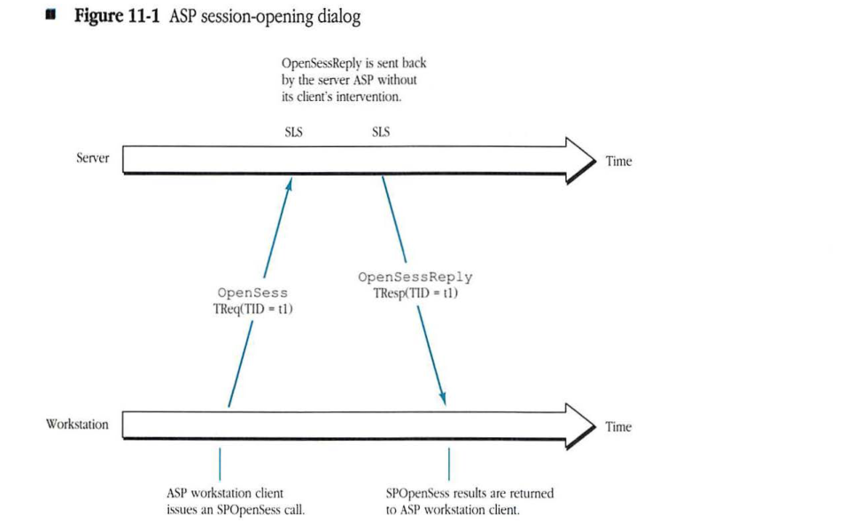

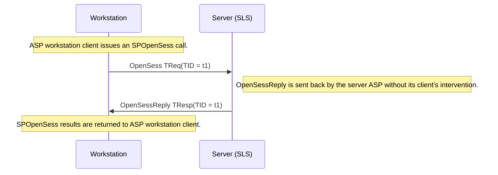
```mermaid
sequenceDiagram
    participant Workstation
    participant Server as Server (SLS)
    
    Note over Workstation: ASP workstation client issues an SPOpenSess call.
    Workstation->>Server: OpenSess TReq(TID = t1)
    Note right of Server: OpenSessReply is sent back by the server ASP without its client's intervention.
    Server->>Workstation: OpenSessReply TResp(TID = t1)
    Note over Workstation: SPOpenSess results are returned to ASP workstation client.
```

This socket is referred to as the **workstation session socket** (WSS). If the server is able to establish a session, it returns a session acceptance indication, a session ID, and the number of the session's server-end socket, referred to as the **server session socket** (SSS). In all further communication over this session, all packets sent from the workstation must carry this session ID and must be sent to the SSS.

ASP allows protocol version verification in this session-opening dialog. ASP in the workstation sends an ASP protocol version number in the OpenSess packet (to identify the version of ASP that the workstation is using). If the server's ASP is unable to handle this version, it returns an error, and the session is not opened.

A session can be closed by the ASP client at either end by issuing the appropriate command to the client's ASP. That node's ASP notifies the other end and then immediately closes the session. If the session termination was initiated by the workstation client, then a session termination notification is sent to the SSS. If the session termination was initiated by the server client, then the notification is sent to the WSS. See *Figure 11-2* and *Figure 11-3*.

#### **Figure 11-2** Session-closing dialog initiated by the workstation

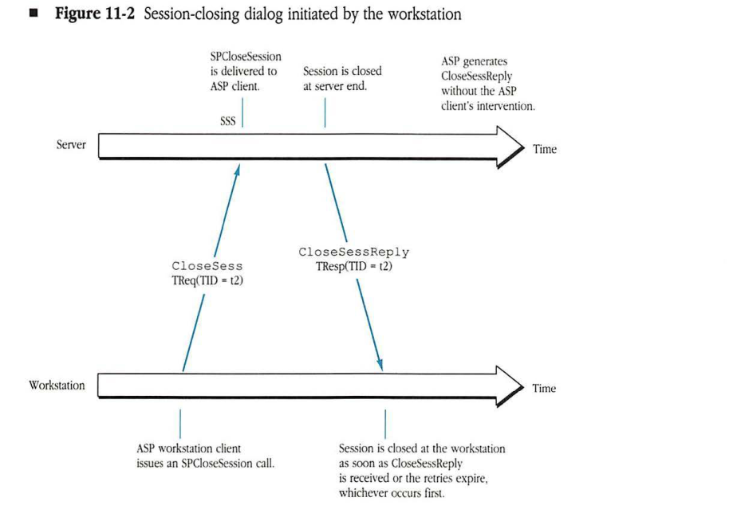

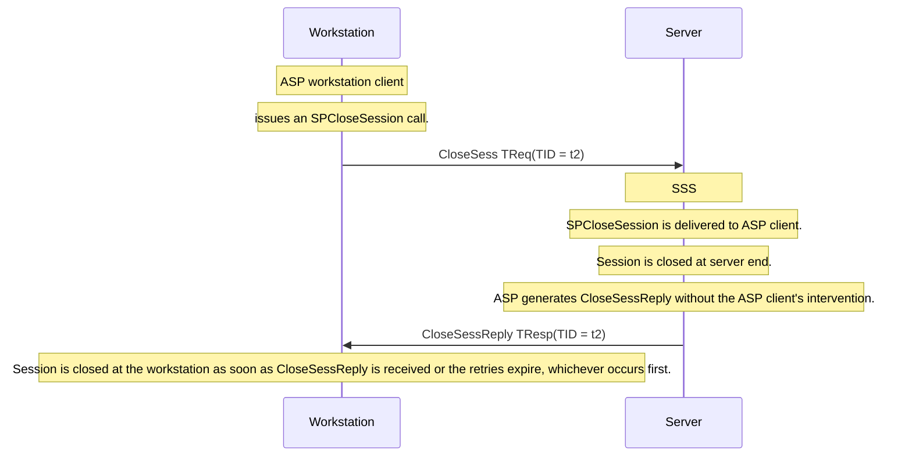
```mermaid
sequenceDiagram
    participant W as Workstation
    participant S as Server
    Note over W: ASP workstation client
    Note over W: issues an SPCloseSession call.
    W->>S: CloseSess TReq(TID = t2)
    Note over S: SSS
    Note over S: SPCloseSession is delivered to ASP client.
    Note over S: Session is closed at server end.
    Note over S: ASP generates CloseSessReply without the ASP client's intervention.
    S->>W: CloseSessReply TResp(TID = t2)
    Note over W: Session is closed at the workstation as soon as CloseSessReply is received or the retries expire, whichever occurs first.
```

---

#### **Figure 11-3** Session-closing dialog initiated by the server

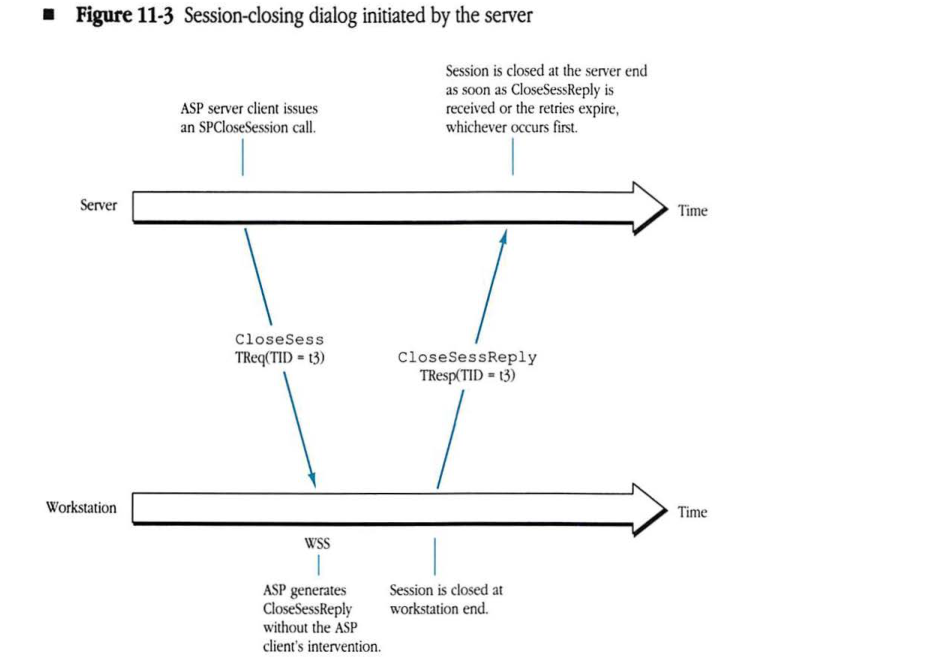

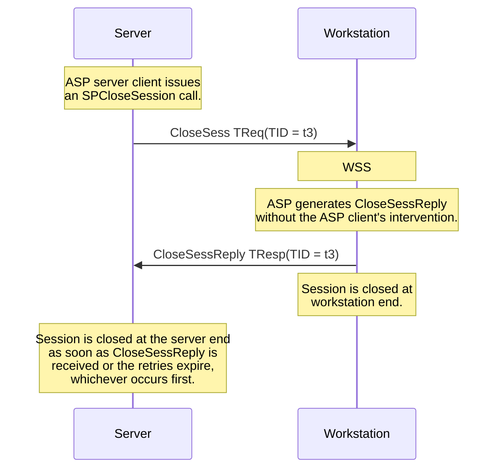
```mermaid
sequenceDiagram
    participant Server
    participant Workstation
    Note over Server: ASP server client issues<br/>an SPCloseSession call.
    Server->>Workstation: CloseSess TReq(TID = t3)
    Note over Workstation: WSS
    Note over Workstation: ASP generates CloseSessReply<br/>without the ASP client's intervention.
    Workstation->>Server: CloseSessReply TResp(TID = t3)
    Note over Workstation: Session is closed at<br/>workstation end.
    Note over Server: Session is closed at the server end<br/>as soon as CloseSessReply is<br/>received or the retries expire,<br/>whichever occurs first.
```

Whenever a session is terminated, the ASP clients at both ends must be notified so that appropriate higher-level action can be taken. This notification is easily done at the server end since it is generally listening for incoming commands on the session. But at the workstation end (if the server end closed the session), the workstation ASP client may not be notified until the next time it tries to issue a command on that session. The actions taken by an ASP client, upon being informed of the closing of a session, vary depending on the higher-level function. For example, the server end might choose to free resources allocated for that session; or, if the higher-level service is a filing service, it might decide to **flush** and close all files opened during that session.


### Session maintenance

A session remains open until it is explicitly terminated by the ASP client at either end or until one end of the session goes down or becomes unreachable. ASP provides a mechanism known as session tickling that is initiated as soon as a session is opened. In session tickling, each end of the session periodically sends a packet to the WSS or SLS to inform the other end that it is functioning properly (see Figure 11-4). The packet sent by either end of the session is known as a tickle packet. If either end fails to receive any packets (tickles, requests, or replies) on a session for a certain predefined **session maintenance timeout**, it assumes that the other end has gone down or has become unreachable. When the session maintenance timeout occurs, the session times out and closes. Tickle packets are no longer sent out.

#### **Figure 11-4** Tickle packet dialog

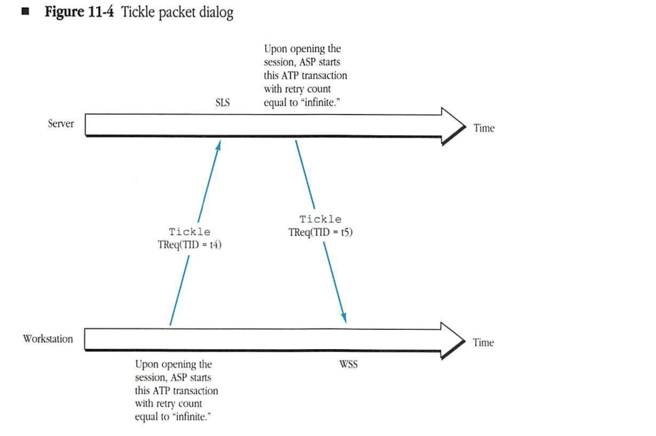

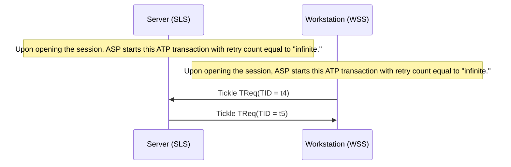
```mermaid
sequenceDiagram
    participant Server as Server (SLS)
    participant Workstation as Workstation (WSS)
    Note over Server: Upon opening the session, ASP starts this ATP transaction with retry count equal to "infinite."
    Note over Workstation: Upon opening the session, ASP starts this ATP transaction with retry count equal to "infinite."
    Workstation->>Server: Tickle TReq(TID = t4)
    Server->>Workstation: Tickle TReq(TID = t5)
```
### Commands on an open session

Once a session has been opened, the workstation client of ASP can send a sequence of commands to the server end. These commands are delivered in the same order as they were issued at the workstation end, and replies to the commands are returned to the workstation end by ASP. The two types of commands, SPCommands and SPWrites, differ in the direction of the primary flow of data. In addition, the server end can send an SPAttention call to the workstation end to inform the workstation of some server need. The following sections describe how ASP uses ATP to perform these commands.

#### SPCommands

SPCommands are very similar to ATP requests. The ASP workstation client sends a command (encoded in a variable-length command block) to the server-end client requesting the server to perform a particular function and to send back a variable-length command reply. Examples of such commands are requests to open a particular file on a file server or to read a certain range of bytes from an already opened file. In the first case, a small amount of reply data is returned; in the second case, a multipacket reply might be generated. Each SPCommand translates into an ATP request sent to the SSS, and the command reply is received as one or more ATP response packets, as shown in *Figure 11-5*.

In any case, ASP does not interpret the command block or in any way participate in the command's function. ASP simply conveys the command block to the server end of the session and returns the command reply to the workstation-end client. The command reply consists of a 4-byte command result (CmdResult) and a variable-length command reply data block (CmdBlock).

#### **Figure 11-5** SPCommand dialog

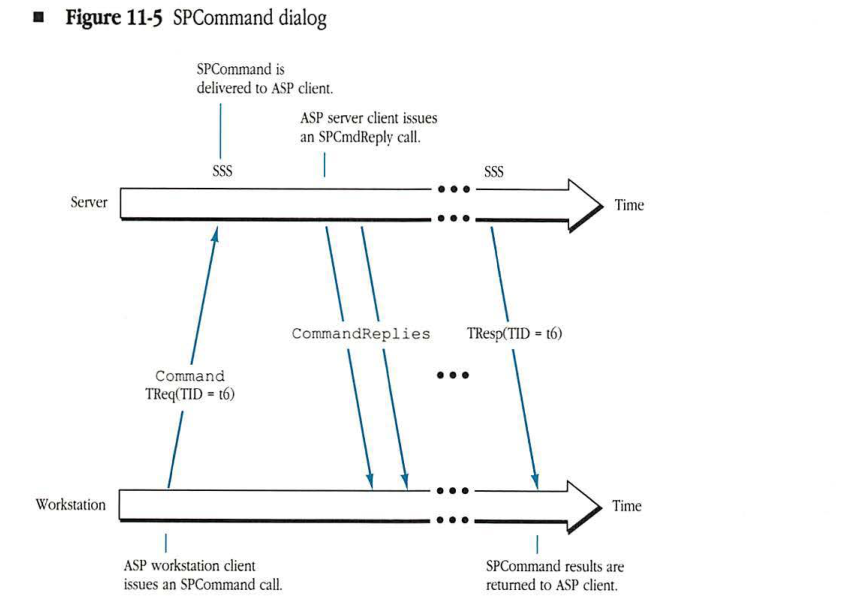

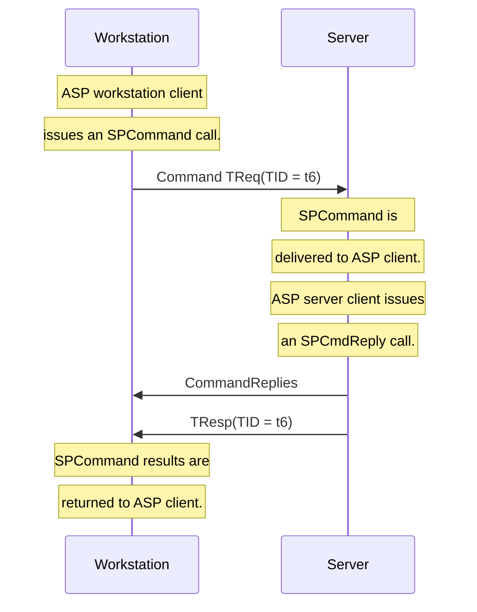
```mermaid
sequenceDiagram
    participant Workstation
    participant Server
    Note over Workstation: ASP workstation client
    Note over Workstation: issues an SPCommand call.
    Workstation->>Server: Command TReq(TID = t6)
    Note over Server: SPCommand is
    Note over Server: delivered to ASP client.
    Note over Server: ASP server client issues
    Note over Server: an SPCmdReply call.
    Server->>Workstation: CommandReplies
    Server->>Workstation: TResp(TID = t6)
    Note over Workstation: SPCommand results are
    Note over Workstation: returned to ASP client.
```

#### SPWrites

When using an SPWrite call, the ASP client in the workstation intends to convey a variable-length block of data to the server end of a session and expects a reply. Since ASP uses ATP as its underlying transport protocol and since ATP is a protocol in which a requesting end essentially *reads* a multipacket block of data from the responding end, for efficiency it is necessary to translate the SPWrite into two transactions. Essentially, a write to the server end is accomplished by having the server initiate a transaction request to read the data from the workstation end.

In the first transaction, ASP sends an ATP request to the SSS carrying the SPWrite's control information, known as the write command block. The server end examines this information to determine whether to proceed with reading the data from the workstation end. If it does not wish to proceed, the server returns an error in the ATP response packet. (This error is conveyed to the workstation client as the 4-byte command result.) Along with the error, up to eight ATP response packets can be sent back to the workstation. This transaction is illustrated in *Figure 11-6*.

#### **Figure 11-6** SPWrite dialog (error condition)

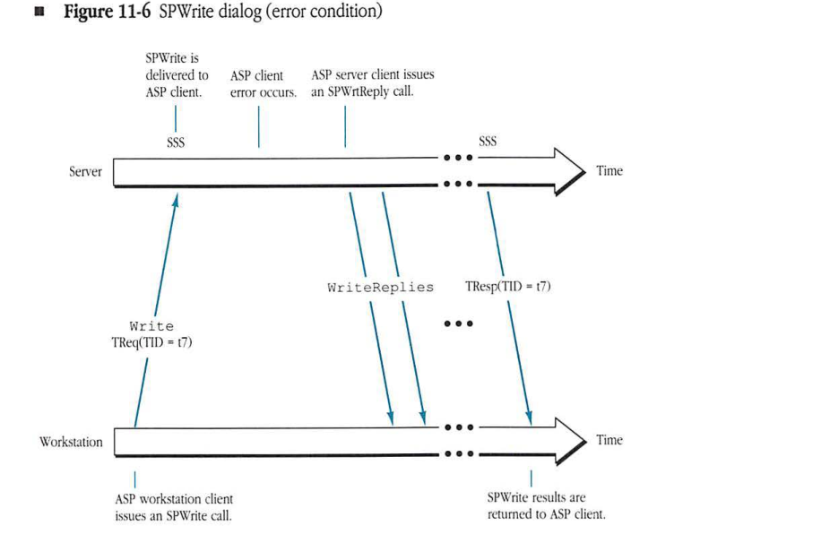

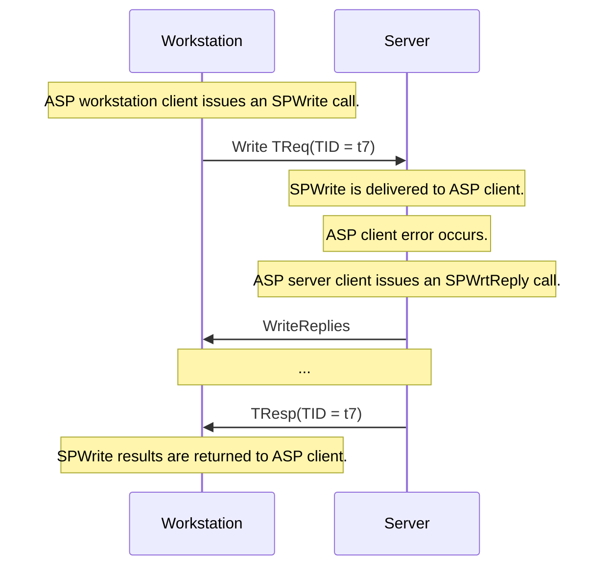
```mermaid
sequenceDiagram
    participant Workstation
    participant Server
    Note over Workstation: ASP workstation client issues an SPWrite call.
    Workstation->>Server: Write TReq(TID = t7)
    Note over Server: SPWrite is delivered to ASP client.
    Note over Server: ASP client error occurs.
    Note over Server: ASP server client issues an SPWrtReply call.
    Server->>Workstation: WriteReplies
    Note over Server, Workstation: ...
    Server->>Workstation: TResp(TID = t7)
    Note over Workstation: SPWrite results are returned to ASP client.
```

If the server decides to read the data, then the server's ASP sends an SPWrtContinue command, which is an ATP request to the WSS to read the data from the workstation end (see Figure 11-7). This ATP request could generate a multipacket ATP response carrying the write data to the server. Upon receiving the write data and performing the particular function requested in the SPWrite call, the server end then responds to the first ATP request (the Write command block) with the appropriate error message (this error message is conveyed to the workstation client as the 4-byte CmdResult) and up to eight WriteReply packets.

#### **Figure 11-7** SPWrite dialog (no error condition)

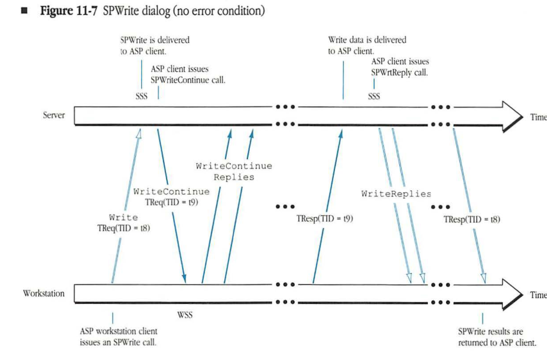

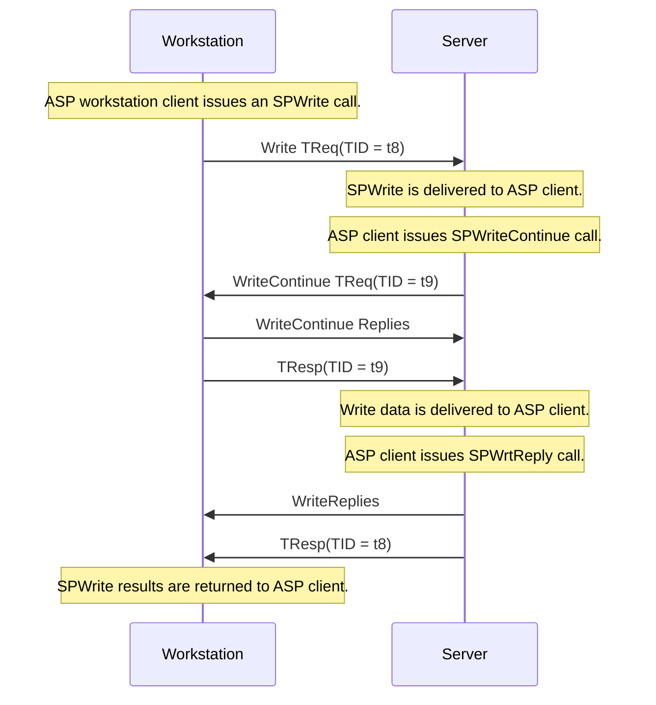
```mermaid
sequenceDiagram
    participant Workstation
    participant Server
    Note over Workstation: ASP workstation client issues an SPWrite call.
    Workstation->>Server: Write TReq(TID = t8)
    Note over Server: SPWrite is delivered to ASP client.
    Note over Server: ASP client issues SPWriteContinue call.
    Server->>Workstation: WriteContinue TReq(TID = t9)
    Workstation->>Server: WriteContinue Replies
    Workstation->>Server: TResp(TID = t9)
    Note over Server: Write data is delivered to ASP client.
    Note over Server: ASP client issues SPWrtReply call.
    Server->>Workstation: WriteReplies
    Server->>Workstation: TResp(TID = t8)
    Note over Workstation: SPWrite results are returned to ASP client.
```

#### SPAttentions

When a session is open, the server client can send an attention command to the workstation client (see *Figure 11-8*). The sole purpose of this command is to alert the workstation client of the server's need for attention. ASP delivers 2 bytes of attention data (from the command ATP user bytes) to the workstation client and acknowledges the attention command (with an ATP response), but the workstation client has the responsibility to act on the command. An example of the use of the attention mechanism might be for a server to notify a workstation of a change in the server's status. Upon receiving the attention command, the workstation could then issue an SPCommand to the server to find out the details of the status change.

#### Figure 11-8 SPAttention dialog

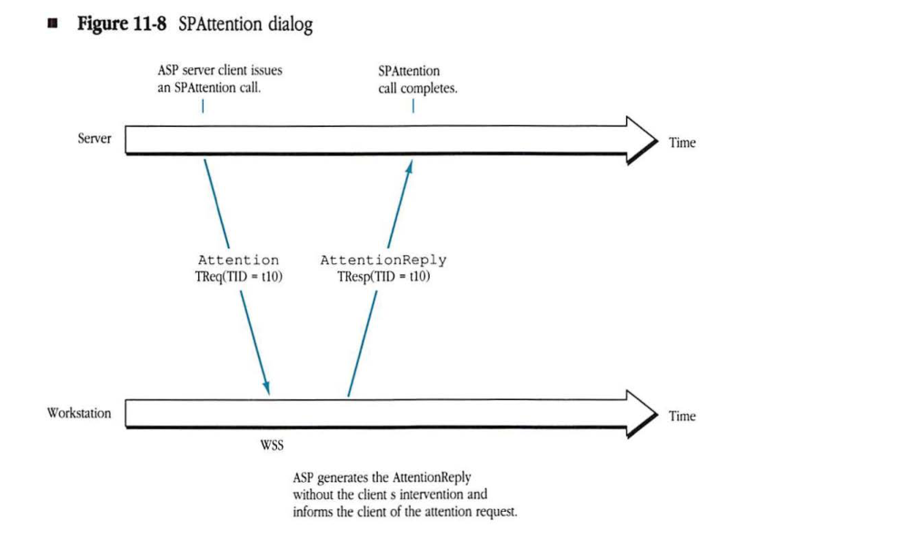

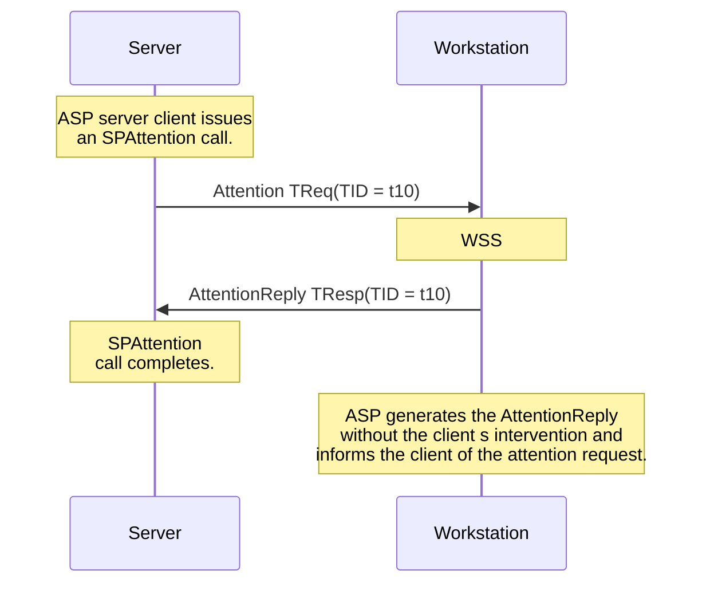
```mermaid
sequenceDiagram
    participant Server
    participant Workstation
    Note over Server: ASP server client issues<br/>an SPAttention call.
    Server->>Workstation: Attention TReq(TID = t10)
    Note over Workstation: WSS
    Workstation->>Server: AttentionReply TResp(TID = t10)
    Note over Server: SPAttention<br/>call completes.
    Note over Workstation: ASP generates the AttentionReply<br/>without the client s intervention and<br/>informs the client of the attention request.
```

### Sequencing and duplicate filtration

By including a sequence number in the appropriate packets exchanged by ASP, ASP ensures that commands are delivered to the server end in the same order as they were issued at the workstation end.

The use of sequence numbers also allows ASP to make the ATP exactly-once (ATP-XO) service more robust. ATP-XO service guarantees that a request is delivered to the ATP client exactly once if the source and destination nodes are on the same AppleTalk network. Over an AppleTalk internet, however, a copy of the ATP request could be delayed in a router node and then delivered as a duplicate after the original transaction has been completed. As a result, a duplicate transaction would be delivered by ATP. This inherent problem of transaction protocols can be eliminated by giving sequence numbers to the transactions belonging to a session in order to filter delayed duplicates.


### Getting service status information

ASP provides an out-of-band service to allow its workstation clients to obtain a block of service status information from the SLS without opening a session. In the server, the status block is provided to ASP by the server-end ASP client and is returned in response to SPGetStatus commands received at the SLS (see *Figure 11-9*).

#### **Figure 11-9** SPGetStatus dialog


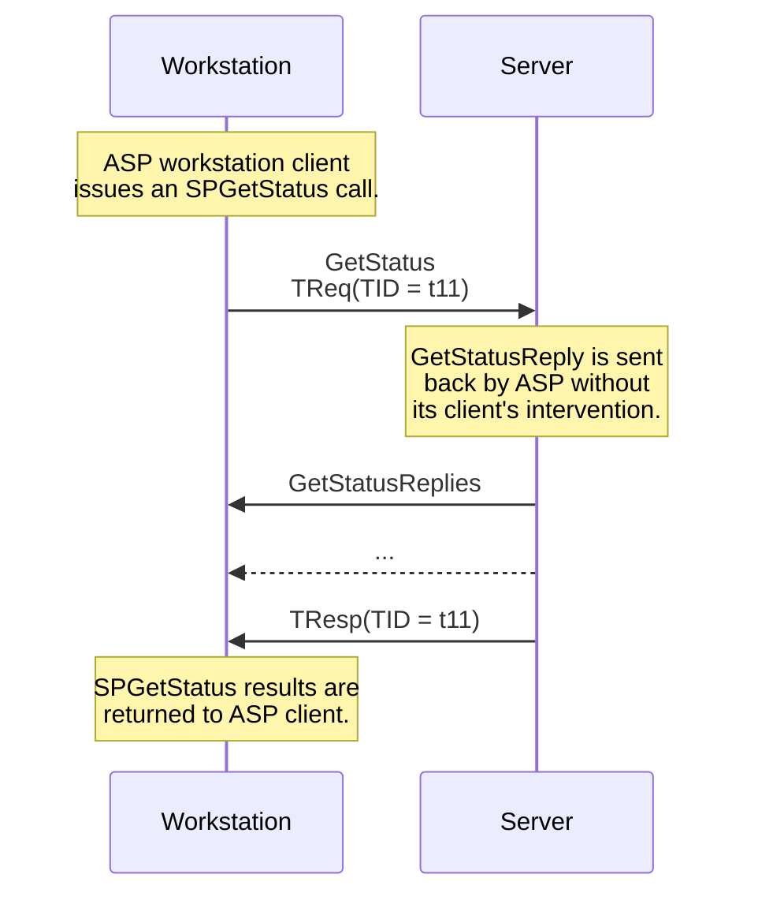
```mermaid
sequenceDiagram
    participant W as Workstation
    participant S as Server

    Note over W: ASP workstation client<br/>issues an SPGetStatus call.
    W->>S: GetStatus<br/>TReq(TID = t11)
    
    Note over S: GetStatusReply is sent<br/>back by ASP without<br/>its client's intervention.
    
    S->>W: GetStatusReplies
    S-->>W: ...
    S->>W: TResp(TID = t11)
    
    Note over W: SPGetStatus results are<br/>returned to ASP client.
```

The diagram illustrates the flow of the `SPGetStatus` command:
1.  **Workstation:** The ASP client issues the call.
2.  **Request:** A `GetStatus` Transaction Request (`TReq`) with a specific Transaction ID (`TID = t11`) is sent to the Service Listening Socket (`SLS`) on the Server.
3.  **Response:** The Server responds with `GetStatusReplies` and the final `TResp`. This happens automatically within the ASP layer without needing the server-side application client to intervene.
4.  **Result:** The status results are delivered back to the requesting ASP workstation client.


## ASP client interface

ASP's service interface is designed to be as independent as possible of the underlying AppleTalk transport mechanisms to allow easy porting of the higher-level protocols (ASP clients) to networks other than AppleTalk and to simplify some of the problems in the design of internet gateways. Regardless of the design, the internal specifications of ASP are very closely related to ATP, and so ASP itself may not be directly portable to other networks.

### Server-end calls

This section describes the calls that can be issued by the server-end ASP client.

### SPGetParms call

Before any sessions are allowed to be opened, the server's ASP client should first issue an SPGetParms call to retrieve the maximum values of command block size and quantum size. The MaxCmdSize is the maximum size command block that can be sent to the server. The QuantumSize returned by this call is the maximum size reply block that can be sent to an SPCommand or SPGetStatus call, and the maximum size of data that can be transferred in an SPWrtContinue transaction. On an AppleTalk network, since ASP is built on top of ATP, the value of MaxCmdSize returned will be 578 bytes and QuantumSize will be 4624 bytes (eight ATP response packets with 578 data bytes each). For client-compatible session protocols implemented on other networks, these values may be different.

**Call parameters** &nbsp;&nbsp;&nbsp;&nbsp; none

**Returned parameters**

| Field | Description |
|---|---|
| *MaxCmdSize* | maximum size of a command block |
| *QuantumSize* | maximum size of a reply block or SPWrtContinue write data |

---

### SPInit call

Once it has opened a socket (SLS) and registered its name, the ASP client in the server must issue an SPInit call, passing the network-dependent SLSEntityIdentifier as well as a ServiceStatusBlock to ASP. This block is used to hold the service status information to be returned in reply to SPGetStatus commands received at the SLS. The SLSEntityIdentifier is the complete internet address of the SLS.

SPInit returns the SLSRefNum (unique among all SLSs on the same server node), which is used in the SPGetSession call to refer to the SLS passed in the SPInit call.

| | | |
|---|---|---|
| **Call parameters** | *SLSEntityIdentifier* | SLS internet address (network-dependent) |
| | *ServiceStatusBlock* | block with status information |
| | *ServiceStatusBlockSize* | size of status information block |
| | | |
| **Returned parameters** | *SLSRefNum* | reference number for the SLS |
| | *SPError* | error code returned by ASP |
| | | *TooManyClients*: Server implementation cannot support another client. |
| | | *SizeErr*: ServiceStatusBlockSize is greater than QuantumSize. |

### SPGetSession call

The SPGetSession call is issued by the ASP server-end client to allow ASP to accept an SPOpenSession command received on the SLS identified by the SLSRefNum. Each SPGetSession call authorizes ASP to accept one more SPOpenSession command. The SPGetSession call completes when the SPOpenSession command is received on the SLS and a corresponding session has been opened. The SessRefNum is returned to the server ASP client and must be used in all further calls to ASP that refer to that session. This number must be unique among all sessions managed by ASP in the server end.

| | | |
|---|---|---|
| **Call parameters** | *SLSRefNum* | reference number for the SLS |
| | | |
| **Returned parameters** | *SessRefNum* | session reference number |
| | *SPError* | error code returned by ASP |
| | | *ParamErr*: SLSRefNum is unknown. |
| | | *NoMoreSessions*: Server implementation cannot support another session. |

---

### SPCloseSession call

The SPCloseSession call is issued by the ASP client to close the session identified by SessRefNum. As a result of the SPCloseSession call, the value of SessRefNum is invalidated and cannot be used in any further calls. In addition, all pending activity on the session is immediately canceled.

| | | |
|---|---|---|
| **Call parameters** | SessRefNum | session reference number |
| **Returned parameters** | SPError | error code returned by ASP |
| | | ParamErr: SessRefNum is unknown. |

### SPGetRequest call

After a session has been opened, the ASP client in the server end must issue SPGetRequest calls to provide buffer space (ReqBuff) for the receipt of requests (workstation commands) on that session. The size (ReqBuffSize) of the buffer for receiving the command block sent with the request depends on the higher-level protocol but need not be greater than QuantumSize.

When a request has been received, the SPGetRequest call completes and returns a unique request identifier (ReqRefNum) and a 1-byte quantity (SPReqType) that identifies the type of ASP request. The permissible values of SPReqType are Command, Write, and CloseSession. If the received command block does not fit in the ReqBuff, ASP returns as much of the command block as will fit, along with a BufTooSmall error.

When the SPGetRequest call completes, the server-end client is given the size of the received command block in the parameter ActRcvdReqLen.

If the session times out and an SPGetRequest call is pending, the call will complete with an SPError value of SessClosed. If no SPGetRequest call is pending, the next SPGetRequest call issued on the session will complete immediately with an error.

**Call parameters**

| | |
| :--- | :--- |
| *SessRefNum* | session reference number |
| *ReqBuff* | buffer for receiving the command block |
| *ReqBuffSize* | buffer size |

**Returned parameters**

| | |
| :--- | :--- |
| *ReqRefNum* | request identifier |
| *SPReqType* | ASP-level request type |
| *ActRcvdReqLen* | actual size of the received request |
| *SPError* | error code returned by ASP |
| | *ParamErr*: *SessRefNum* is unknown. |
| | *BufTooSmall*: *ReqBuff* cannot hold the entire command block. |
| | *SessClosed*: Session has been closed. |

### SPCmdReply call

If the request returned by the SPGetRequest call has SPReqType equal to Command, then the server-end client must respond to the request with an SPCmdReply call to ASP. The value of ReqRefNum passed with this call must be the same as that returned by the corresponding SPGetRequest call. The following two items must be conveyed to the workstation end of the session:

*   a 4-byte command result (CmdResult)
*   a variable-length command reply data block (CmdReplyData)

The actual values, format, and meaning of the CmdResult and of the CmdReplyData are not interpreted by ASP.

♦ **Note:** CmdReplyDataSize must be no greater than QuantumSize; otherwise, a SizeErr will be returned and no CmdReplyData will be sent to the workstation.


| | | |
|:---|:---|:---|
| **Call parameters** | SessRefNum | session reference number |
| | ReqRefNum | request identifier |
| | CmdResult | 4-byte command result |
| | CmdReplyData | command reply data block |
| | CmdReplyDataSize | size of command reply data block |
| | | |
| **Returned parameters** | SPError | error code returned by ASP |
| | | *ParamErr*: SessRefNum or ReqRefNum is unknown. CmdReplyDataSize is bad (negative value). |
| | | *SizeErr*: CmdReplyDataSize is greater than QuantumSize. |
| | | *SessClosed*: Session has been closed. |

## SPWrtContinue call

If the request returned by the SPGetRequest call has SPReqType equal to Write, then the server-end client must respond to the request with either an SPWrtContinue or an SPWrtReply call to ASP. The value of ReqRefNum passed with these calls must be the same as that returned by the corresponding SPGetRequest call.

The ASP client decides which of these calls to make, depending on the higher-level protocol; however, the following general description is provided. Upon receiving a request that has SPReqType equal to Write, the ASP client examines the command block received with the request. This block should contain, in the format appropriate to the higher-level protocol, a description of the type and parameters of the higher-level write operation being requested. The ASP client should use this command block information to decide if the requested operation can be carried out successfully. If the operation cannot be carried out, the ASP client should issue the SPWrtReply call with the appropriate higher-level protocol result code value in CmdResult indicating the failure and the reason for it. If the operation can be carried out, however, then the ASP client in the server should initiate the process of transferring the data to be written from the workstation end of the session by issuing the SPWrtContinue call. An SPWrtReply call should also be issued upon completion of the SPWrtContinue call and the ensuing write.

For example, the higher-level client could be a filing protocol requesting the server-end client to write a certain number of bytes to a particular file. If no such file exists, the server end should send back a *no such file* indication by issuing an SPWrtReply call. Otherwise, the server end issues an SPWrtContinue call with a buffer into which the write data can be brought from the workstation, followed by an SPWrtReply once it has finished the write request.


The maximum size of the write data that will be transferred is equal to QuantumSize.

| | | |
| :--- | :--- | :--- |
| **Call parameters** | *SessRefNum* | session reference number |
| | *ReqRefNum* | request identifier |
| | *Buffer* | buffer for receiving the data to be written |
| | *BufferSize* | size of the buffer |
| | | |
| **Returned parameters** | *ActLenRcvd* | actual amount of data received into buffer |
| | *SPError* | error code returned by ASP |
| | | *ParamErr*: *SessRefNum* or *ReqRefNum* is unknown. *BufferSize* is bad (negative value). |
| | | *SessClosed*: Session has been closed. |

### SPWrtReply call

The SPWrtReply call is issued by the ASP client in the server in order to terminate, either successfully or unsuccessfully, an SPWrite call received through SPGetRequest. With this SPWrtReply call, the ASP client provides ASP with the 4-byte command result and the variable-length command reply data block (maximum size equal to QuantumSize) to be conveyed to the workstation-end client. If a *SizeErr* is returned, no *CmdReplyData* will be sent to the workstation.

| | | |
| :--- | :--- | :--- |
| **Call parameters** | *SessRefNum* | session reference number |
| | *ReqRefNum* | request identifier |
| | *CmdResult* | 4-byte command result |
| | *CmdReplyData* | command reply data block |
| | *CmdReplyDataSize* | size of command reply data block |
| | | |
| **Returned parameters** | *SPError* | error code returned by ASP |
| | | *ParamErr*: *SessRefNum* or *ReqRefNum* is unknown. *CmdReplyDataSize* is bad (negative value). |
| | | *SizeErr*: *CmdReplyDataSize* is greater than QuantumSize. |
| | | *SessClosed*: Session has been closed. |


### SPNewStatus call

The SPNewStatus call is used by the ASP client to update the ServiceStatusBlock first supplied in the SPInit call. The previous status information is lost. All subsequent SPGetStatus calls issued by workstations will retrieve the new status block.

| | | |
|:---|:---|:---|
| **Call parameters** | *SLSRefNum* | reference number for the SLS |
| | *ServiceStatusBlock* | block with status information |
| | *ServiceStatusBlockSize* | size of status information block |
| | | |
| **Returned parameters** | *SPError* | error code returned by ASP |
| | | *ParamErr*: SLSRefNum is unknown |
| | | *SizeErr*: ServiceStatusBlockSize is greater than QuantumSize. |

### SPAttention call

The SPAttention call sends the attention code to the workstation and waits for an acknowledgment. The only restriction placed on the value of the attention code is that it must not be 0.

| | | |
|:---|:---|:---|
| **Call parameters** | *SessRefNum* | session reference number |
| | *AttentionCode* | 2-byte attention code (must be a number other than 0) |
| | | |
| **Returned parameters** | *SPError* | error code returned by ASP |
| | | *ParamErr*: SessRefNum is unknown; AttentionCode cannot be 0. |
| | | *NoAck*: No acknowledgment received from workstation end. |

### Workstation-end calls

This section describes the calls that can be issued to the server end by the workstation-end ASP client.

### SPGetParms call

The SPGetParms call retrieves the maximum value of the command block size and the quantum size. This call is the same as the SPGetParms call for the server end.

**Call parameters** &nbsp;&nbsp; none

**Returned parameters**

| Field | Description |
| :--- | :--- |
| *MaxCmdSize* | maximum size of a command block |
| *QuantumSize* | maximum data size for a command reply or a write |

### SPGetStatus call

The SPGetStatus call is used by a workstation ASP client to obtain status information for a particular server. If the status information received is too large to fit into the StatusBuffer provided with the call, then ASP returns a BufTooSmall error and as much of the status information as will fit in the StatusBuffer.

**Call parameters**

| Field | Description |
| :--- | :--- |
| *SLSEntityIdentifier* | SLS internet address (network-dependent) |
| *StatusBuffer* | buffer for receiving the status information |
| *StatusBufferSize* | size of status information buffer |

**Returned parameters**

| Field | Description |
| :--- | :--- |
| *ActRcvdStatusLen* | size of status information received |
| *SPError* | error code returned by ASP |
| | *NoServer*: Server is not responding. |
| | *BufTooSmall*: StatusBuffer cannot hold entire status. |

### SPOpenSession call

The SPOpenSession call is issued by an ASP client after obtaining the internet address of the SLS through an NBP Lookup call. If a session is successfully opened, then a SessRefNum is returned to the caller and should be used on all subsequent calls referring to this session. If a session cannot be opened, an appropriate SPError value is returned. AttnRoutine specifies a routine (part of the workstation-end ASP client) to be invoked upon receipt of an attention request from the server. The exact form that this parameter takes is implementation-dependent.

| Type | Parameter | Description |
| :--- | :--- | :--- |
| **Call parameters** | _SLSEntityIdentifier_ | SLS internet address (network-dependent) |
| | _AttnRoutine_ | attention routine indicator |
| **Returned parameters** | _SessRefNum_ | session reference number |
| | _SPError_ | error code returned by ASP |
| | | _NoServer_: Server is not responding. |
| | | _ServerBusy_: Server cannot open another session. |
| | | _BadVersNum_: Server cannot support the offered version number. |
| | | _NoMoreSessions_: Workstation implementation cannot support another session. |

### SPCloseSession call

The SPCloseSession call can be issued at any time by the ASP client to close a session previously opened through an SPOpenSession call. As a result of this call, the SessRefNum is invalidated and cannot be used in any further calls. In addition, all pending activity on the session is immediately canceled.

| Type | Parameter | Description |
| :--- | :--- | :--- |
| **Call parameters** | _SessRefNum_ | session reference number |
| **Returned parameters** | _SPError_ | error code returned by ASP |
| | | _ParamErr_: SessRefNum is unknown. |

### SPCommand call

Once a session has been opened, the workstation-end client can send a command to the server end by issuing an *SPCommand* call to ASP. A command block of maximum size (*MaxCmdSize*) can be sent with the command. If *CmdBlockSize* is larger than this maximum allowable size, the call completes with *SPError* equal to *SizeErr*; in this case, no effort is made to send anything to the server end.

In response to an *SPCommand*, the server end returns the following two quantities:

*   a 4-byte command result
*   a variable-length command reply that is returned in the *ReplyBuffer*. The size of the command reply received is returned in *ActRcvdReplyLen*. Since this size can be no larger than *QuantumSize*, it is possible that only part of the reply will be returned in this call. If this happens, an *SPError* code of *no error* will be returned; the ASP workstation-end client is responsible for generating another command to retrieve the rest of the reply.

| | | |
| :--- | :--- | :--- |
| **Call parameters** | *SessRefNum* | session reference number |
| | *CmdBlock* | command block to be sent |
| | *CmdBlockSize* | size of command block |
| | *ReplyBuffer* | buffer for receiving the command reply data |
| | *ReplyBufferSize* | size of the reply buffer |
| | | |
| **Returned parameters** | *CmdResult* | 4-byte command result |
| | *ActRcvdReplyLen* | actual length of command reply data received |
| | *SPError* | error code returned by ASP |
| | | *ParamErr*: *SessRefNum* is unknown. |
| | | *SizeErr*: *CmdBlockSize* is larger than *MaxCmdSize*. |
| | | *SessClosed*: Session has been closed. |
| | | *BufTooSmall*: *ReplyBuffer* cannot hold the whole reply. |

### SPWrite call

The `SPWrite` call is made by the ASP client in order to write a block of data to the server end of the session. The call first delivers the `CmdBlock` (no larger than `MaxCmdSize`) to the server-end client of ASP and, as previously described, the server end can then transfer the write data or return an error (delivered in the `CmdResult`).

The actual amount of data sent will be less than or equal to `WriteDataSize` and will never be larger than `QuantumSize`. The amount of write data actually transferred is returned in `ActLenWritten`.

In response to an `SPWrite`, the server end returns two quantities: a 4-byte command result and a variable-length command reply that is returned in the `ReplyBuffer`. The size of the command reply actually received is returned in `ActRcvdReplyLen`. Note that this size can be no larger than `QuantumSize`.

| | | |
|:---|:---|:---|
| **Call parameters** | *SessRefNum* | session reference number |
| | *CmdBlock* | command block to be sent |
| | *CmdBlockSize* | size of command block |
| | *WriteData* | data block to be written |
| | *WriteDataSize* | size of data block to be written |
| | *ReplyBuffer* | buffer for receiving the command reply data |
| | *ReplyBufferSize* | size of the reply buffer |
| | | |
| **Returned** | *CmdResult* | 4-byte command result |
| **parameters** | *ActLenWritten* | actual number of bytes of data written |
| | *ActRcvdReplyLen* | actual length of command reply data received |
| | | |
| | *SPError* | error code returned by ASP |
| | | *ParamErr*: *SessRefNum* is unknown. |
| | | *SizeErr*: *CmdBlockSize* is larger than *MaxCmdSize*. |
| | | *SessClosed*: Session has been closed. |
| | | *BufTooSmall*: *ReplyBuffer* cannot hold the whole reply. |

## Packet formats and algorithms

This section describes the internal details of ASP, including packet formats. For simplicity, the DDP and data-link headers are omitted from the packets shown in the figures.

### Opening a session

When the workstation client issues an SPOpenSession call, ASP issues an ATP-XO transaction request addressed to the SLS, as shown in Figure 11-1. This ATP transaction request packet is known as an ASP OpenSess packet. The server's ASP returns an ATP transaction response packet known as an OpenSessReply packet.

The OpenSess packet is shown in Figure 11-10 and carries the following in its ASP header (the ASP header is contained entirely in the ATP user bytes):

* a 1-byte SPFunction field equal to OpenSess
* a 1-byte field containing the WSS socket number
* a 2-byte ASP version number field

Upon receiving an OpenSess packet, the server's ASP checks to see if an SPGetSession is pending on that SLS. If no such call is pending, then the server's ASP returns a ServerBusy error in the OpenSessReply packet, and the session is not opened. If an SPGetSession is pending, then ASP checks the ASP version number in the OpenSess packet. If the version number is unacceptable, a BadVersNum error is returned. Otherwise, ASP opens an ATP responding socket (SSS) and generates a unique (per SLS) 1-byte session ID. ASP then creates its internal session management data structures in which the WSS is saved together with the session ID, the SLS, and related items. The OpenSessReply packet is then sent back to the workstation. This packet contains, in its ASP header (contained entirely in the ATP user bytes), a 2-byte error code (returned to the client as SPError), the 1-byte session ID, and the SSS. The server end of the session is now active. The tickling process at this time is initiated from the server end.

Upon receiving the OpenSessReply, the workstation-end ASP examines the packet's error code field. If this field indicates no error, then the session ID and the SSS are taken from the packet and, together with other control information, are saved in a session management data structure. At this point, the workstation end of the session is active, and the tickling process is initiated from the workstation end.


#### **Figure 11-10** ASP packet formats for OpenSess and CloseSess

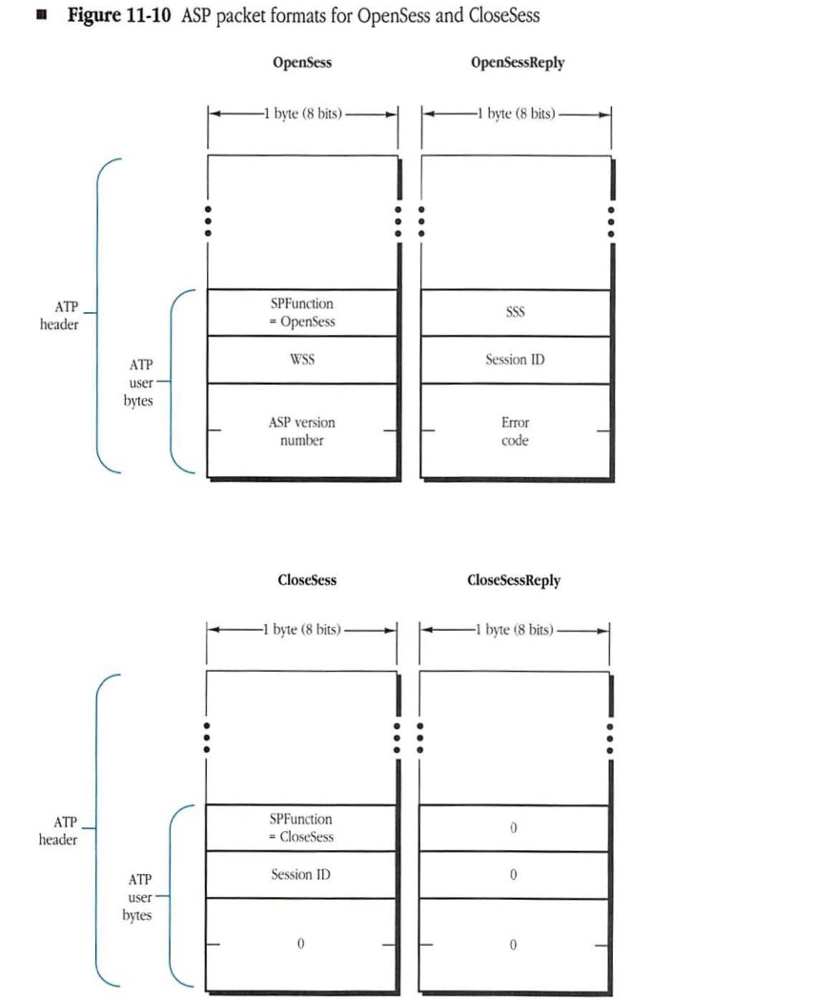

#### OpenSess

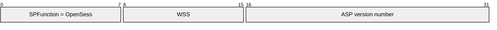
```mermaid
packet-beta
0-7: "SPFunction = OpenSess"
8-15: "WSS"
16-31: "ASP version number"
```

| Field | Bit offset | Width (bits) | Description |
|---|---|---|---|
| SPFunction = OpenSess | 0 | 8 | ASP function code for OpenSess command |
| WSS | 8 | 8 | Workstation service socket |
| ASP version number | 16 | 16 | ASP version number |

#### OpenSessReply

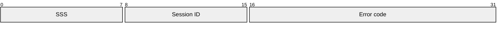
```mermaid
packet-beta
0-7: "SSS"
8-15: "Session ID"
16-31: "Error code"
```

| Field | Bit offset | Width (bits) | Description |
|---|---|---|---|
| SSS | 0 | 8 | Server service socket |
| Session ID | 8 | 8 | Session identifier |
| Error code | 16 | 16 | Error code |

#### CloseSess

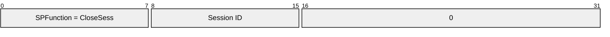
```mermaid
packet-beta
0-7: "SPFunction = CloseSess"
8-15: "Session ID"
16-31: "0"
```

| Field | Bit offset | Width (bits) | Description |
|---|---|---|---|
| SPFunction = CloseSess | 0 | 8 | ASP function code for CloseSess command |
| Session ID | 8 | 8 | Session identifier |
| 0 | 16 | 16 | Reserved (set to zero) |

#### CloseSessReply

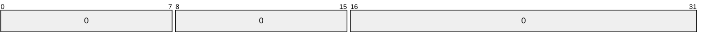
```mermaid
packet-beta
0-7: "0"
8-15: "0"
16-31: "0"
```

| Field | Bit offset | Width (bits) | Description |
|---|---|---|---|
| 0 | 0 | 8 | Reserved (set to zero) |
| 0 | 8 | 8 | Reserved (set to zero) |
| 0 | 16 | 16 | Reserved (set to zero) |


The session management data structure must contain the session ID, the socket number of the other end of the session (the WSS or the SSS), and a 2-byte sequence number (LastReqNum). When the session is opened, the LastReqNum is initialized to 0.


### Getting server status

Because an SPGetStatus call can be made and serviced without opening a session, the corresponding packets do not carry a session ID and do not have a sequence number field. The workstation-end ASP issues an ATP at-least-once transaction request addressed to the SLS. This request, known as a GetStatus packet, is sent to the SLS, as shown in *Figure 11-9*.

The GetStatus packet has SPFunction equal to GetStatus, with the rest of the 3 ATP user bytes being unused and therefore set to 0, as shown in *Figure 11-11*.

Upon receiving a GetStatus packet, the ASP at the server end returns up to eight GetStatusReply packets as the multipacket ATP response. Each of these packets has its 4 ATP user bytes equal to 0.

The status information block provided in the SPInit or SPNewStatus call is sent as the ATP data of the GetStatusReply packets. The status information is packed into the reply packets with as many bytes as will fit (in other words, each GetStatusReply packet will contain 578 bytes of status information except for the last packet, which may contain less).

#### **Figure 11-11** ASP packet formats for GetStatus

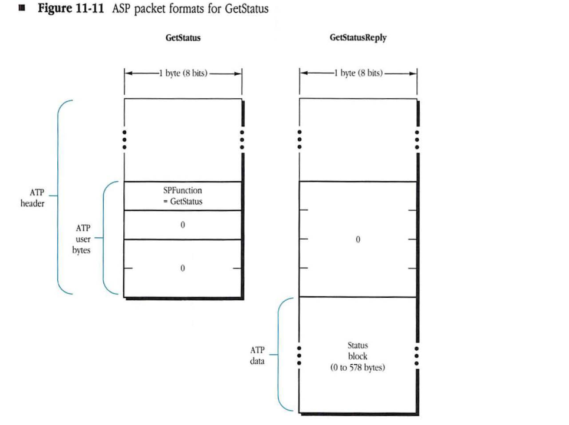

#### GetStatus Packet Layout


```mermaid
packet-beta
0-7: "SPFunction = GetStatus"
8-15: "0"
16-23: "0"
```

| Field | Bit offset | Width (bits) | Description |
| :--- | :--- | :--- | :--- |
| SPFunction | 0 | 8 | ASP function code; for GetStatus, this value is 3. |
| Reserved | 8 | 8 | Reserved; must be 0. |
| Reserved | 16 | 8 | Reserved; must be 0. |

#### GetStatusReply Packet Layout

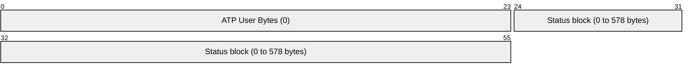
```mermaid
packet-beta
0-23: "ATP User Bytes (0)"
24-55: "Status block (0 to 578 bytes)"
```

| Field | Bit offset | Width (bits) | Description |
| :--- | :--- | :--- | :--- |
| ATP User Bytes | 0 | 24 | ATP user bytes; set to 0. |
| Status block | 24 | Variable | ASP status information, ranging from 0 to 578 bytes. |

### Sending a command request

When the ASP client in the workstation makes an SPCommand call, ASP sends an ATP-XO request to the SSS of the indicated session, as shown in *Figure 11-5*. This packet has SPFunction equal to Command. The packet contains the session ID and a 2-byte sequence number, as shown in *Figure 11-12*. The sequence number must be generated using the following algorithm:

```
If LastReqNum = 65536 then LastReqNum := 0
    else LastReqNum := LastReqNum+1;
Sequence Number := LastReqNum;
```


#### **Figure 11-12** ASP packet formats for Command

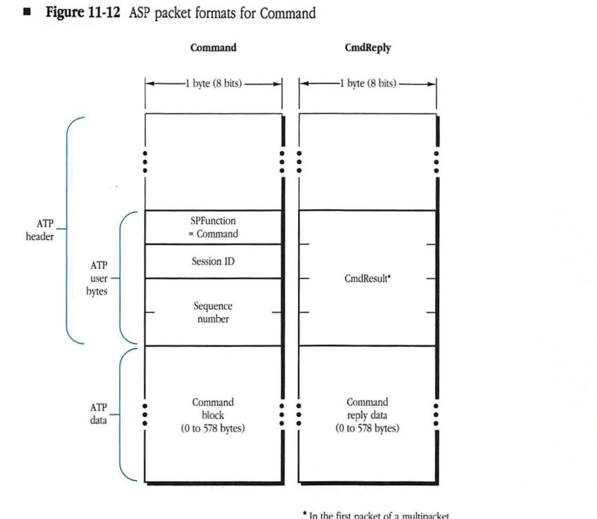

#### Command Packet Structure
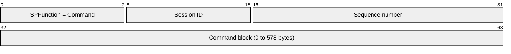
```mermaid
packet-beta
0-7: "SPFunction = Command"
8-15: "Session ID"
16-31: "Sequence number"
32-63: "Command block (0 to 578 bytes)"
```

| Field | Bit offset | Width (bits) | Description |
| :--- | :--- | :--- | :--- |
| SPFunction | 0 | 8 | Always set to "Command" for this packet type. |
| Session ID | 8 | 8 | The ID of the session. |
| Sequence number | 16 | 16 | The sequence number of the command. |
| Command block | 32 | 0 to 4624 | The actual command data (0 to 578 bytes). |

#### CmdReply Packet Structure
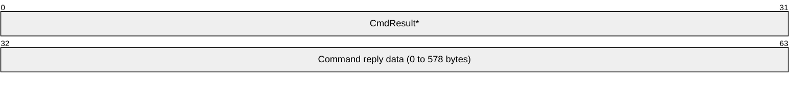
```mermaid
packet-beta
0-31: "CmdResult*"
32-63: "Command reply data (0 to 578 bytes)"
```

| Field | Bit offset | Width (bits) | Description |
| :--- | :--- | :--- | :--- |
| CmdResult* | 0 | 32 | In the first packet of a multipacket ATP transaction response, this field holds the CmdResult. In all subsequent packets, this field must be 0. |
| Command reply data | 32 | 0 to 4624 | The reply data (0 to 578 bytes). |

* In the first packet of a multipacket ATP transaction response, this field holds the CmdResult. In all subsequent packets of a multipacket ATP transaction response, this field must be equal to 0.

In effect, the sequence number will be 1 greater than the sequence number of the last command sent on the session. LastReqNum is initially set to 0 when the session is opened.

The CmdBlock provided in the SPCommand call is sent in the ATP data part of the packet. Therefore, CmdBlock cannot be larger than 578 bytes.

At the server end, ASP delivers the CmdBlock to the ASP client (if an SPGetRequest was pending; otherwise the packet is ignored). The ASP client in the server then makes an SPCmdReply call that is used to pass a 4-byte command result and a variable-length command reply data block to ASP. ASP generates from one to eight ATP response packets, which ASP sends back to the source of the Command packet. These CmdReply packets have the 4 ATP user bytes set to 0 except for the first CmdReply, which carries the command result in its user bytes. The command reply data block is broken up into eight or fewer pieces and sent in the ATP data part of these packets, as shown in Figure 11-12.

### Sending a write request

When the ASP client in the workstation makes an SPWrite call, ASP sends an ATP-XO request to the SSS of the indicated session (shown in Figure 11-7). This packet has SPFunction equal to Write, and it contains the session ID of the session and a 2-byte sequence number, as shown in Figure 11-13. The sequence number must be generated using the algorithm described previously in "Sending a Command Request."

The command block provided in the SPWrite call is sent in the ATP data part of the Write packet. Therefore, CmdBlock cannot be larger than 578 bytes.

At the server end, ASP delivers the Write packet to the ASP client (if an SPGetRequest was pending; otherwise, the packet is ignored). The ASP client in the server determines if it can process the request, presumably by examining the contents of the command block.

If the ASP client in the server cannot process the request, it encodes an appropriate higher-level protocol error message in the 4-byte command result or in the command reply data block or in both and makes an SPWrtReply call to ASP. An ATP response packet known as a WriteReply is then sent back to the source of the SPWrite, as shown in Figure 11-6.

#### Figure 11-13 ASP packet formats for Write

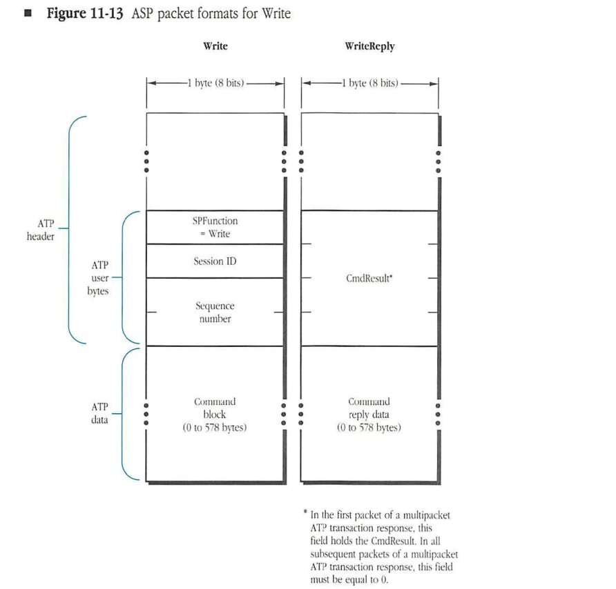

#### Write Packet Structure

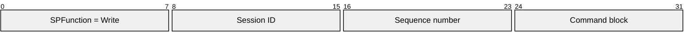
```mermaid
packet-beta
0-7: "SPFunction = Write"
8-15: "Session ID"
16-23: "Sequence number"
24-31: "Command block"
```

| Field | Bit offset | Width (bits) | Description |
| :--- | :--- | :--- | :--- |
| SPFunction | 0 | 8 | Write function code (set to Write) |
| Session ID | 8 | 8 | Session identifier |
| Sequence number | 16 | 8 | Sequence number |
| Command block | 24 | variable | ATP data (0 to 578 bytes) |

#### WriteReply Packet Structure

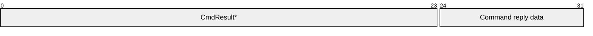
```mermaid
packet-beta
0-23: "CmdResult*"
24-31: "Command reply data"
```

| Field | Bit offset | Width (bits) | Description |
| :--- | :--- | :--- | :--- |
| CmdResult* | 0 | 24 | Command result (see note below) |
| Command reply data | 24 | variable | ATP data (0 to 578 bytes) |

\* In the first packet of a multipacket ATP transaction response, this field holds the CmdResult. In all subsequent packets of a multipacket ATP transaction response, this field must be equal to 0.

If, however, the ASP client in the server can process the request, it reserves a buffer for the data and makes an SPWrtContinue call to ASP. The SPWrtContinue call causes ASP in the server to send an ATP-XO transaction request to the WSS. This call carries the session ID and the sequence number taken from the SPWrite packet (used by ASP to match the WriteContinue with the corresponding Write), as shown in Figure 11-14.

#### **Figure 11-14** ASP packet formats for WriteContinue

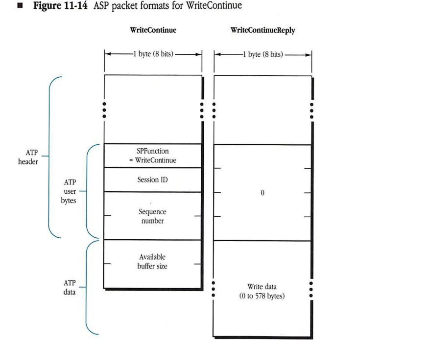

#### WriteContinue Packet Structure

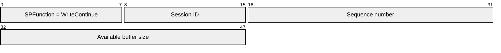
```mermaid
packet-beta
0-7: "SPFunction = WriteContinue"
8-15: "Session ID"
16-31: "Sequence number"
32-47: "Available buffer size"
```

| Field | Bit offset | Width (bits) | Description |
|---|---|---|---|
| SPFunction | 0 | 8 | ASP function code set to WriteContinue |
| Session ID | 8 | 8 | Session identifier |
| Sequence number | 16 | 16 | Sequence number for the write transaction |
| Available buffer size | 32 | 16 | The size in bytes of the buffer reserved by the server client |

#### WriteContinueReply Packet Structure

```mermaid
packet-beta
0-31: "0"
32-63: "Write data (0 to 578 bytes)"
```

| Field | Bit offset | Width (bits) | Description |
|---|---|---|---|
| 0 | 0 | 32 | ATP user bytes, set to zero |
| Write data | 32 | 0-4624 | Data to be written (0 to 578 bytes) |

The WriteContinue packet contains a 2-byte ATP data field that contains the size in bytes of the buffer reserved by the server client for the write data. The workstation then returns the write data in the transaction response packets (WriteContinueReply packets). The data is then delivered to the server-end ASP client. The server-end ASP client then issues an SPWrtReply call to ASP that causes ASP to send one to eight WriteReply packets (the ATP response to the original Write packet). The format of the WriteReply packet is shown in *Figure 11-13*.

### Maintaining the session

Tickle packets (ATP transaction request packets with SPFunction equal to Tickle) must be sent by each end while a session is open, as shown in *Figure 11-4*.

Tickle packets are sent by the workstation to the SLS and by the server to the WSS. These packets contain the following information in their ASP header (the ATP user bytes), as shown in *Figure 11-15*:

* 1-byte SPFunction equal to Tickle
* SessionID
* two unused bytes

Tickle packets are sent by starting an ATP-ALO transaction with retry count equal to infinite and timeout equal to 30 seconds.

Session maintenance at each end is done by starting a session maintenance timeout of 2 minutes. Whenever any packet (tickle or otherwise) is received on the session, this timer is restarted. If the timer expires (in other words, if no packet is received for 2 minutes), then the other end of the session is assumed to have gone down or become unreachable, and the session is closed.

#### **Figure 11-15** ASP packet formats for Attention and Tickle

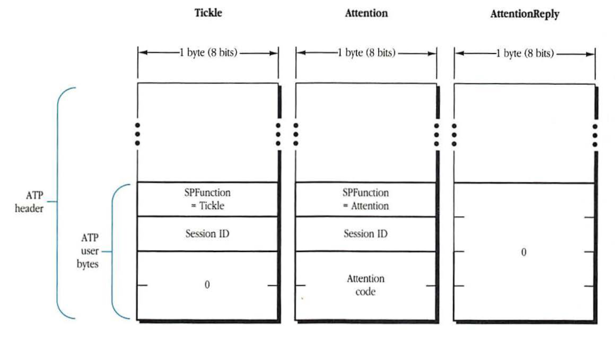

#### Tickle Packet (ATP user bytes)

```mermaid
packet-beta
0-7: "SPFunction = Tickle"
8-15: "Session ID"
16-31: "0"
```

| Field | Bit offset | Width (bits) | Description |
|---|---|---|---|
| SPFunction | 0 | 8 | Set to Tickle |
| Session ID | 8 | 8 | Session identifier |
| Unused | 16 | 16 | Set to 0 |

#### Attention Packet (ATP user bytes)

```mermaid
packet-beta
0-7: "SPFunction = Attention"
8-15: "Session ID"
16-31: "Attention code"
```

| Field | Bit offset | Width (bits) | Description |
|---|---|---|---|
| SPFunction | 0 | 8 | Set to Attention |
| Session ID | 8 | 8 | Session identifier |
| Attention code | 16 | 16 | The specific attention code |

#### AttentionReply Packet (ATP user bytes)

```mermaid
packet-beta
0-31: "0"
```

| Field | Bit offset | Width (bits) | Description |
|---|---|---|---|
| Unused | 0 | 32 | Set to 0 |

### Sending an attention request

When the ASP client in the server makes an SPAttention call, ASP sends an ATP-ALO request to the WSS of the indicated session, as shown in *Figure 11-8*.

This Attention packet requests one response and has SPFunction equal to Attention. It contains the session ID and a 2-byte attention code, as shown in *Figure 11-15*. This attention code is passed by the server client to ASP to be delivered to the workstation client along with the attention request. The attention code is not interpreted by ASP, except that ASP requires the code to be a number other than 0.

Upon receiving an Attention packet, the workstation-end ASP should immediately respond with an AttentionReply. The AttentionReply serves as an acknowledgment of the request, and it completes the SPAttention call on the server end. The workstation ASP should then, in an implementation-dependent manner, alert its client as to the attention request and pass the attention code to the client.

### Closing a session

When the ASP client at either end makes an SPCloseSession call, a session-closing ATP-ALO transaction is initiated, as shown in *Figure 11-2* and *Figure 11-3*.

If the session closing was initiated by the workstation client, then a CloseSess packet (an ATP transaction request) is sent to the SSS in the server. The CloseSess packet is then delivered to the ASP client as part of the SPGetRequest mechanism. The server's ASP generates a transaction response (a CloseSessReply packet) without the ASP client's intervention. Immediately upon sending the CloseSessReply packet, the server end of the session is closed, all pending activity (including tickles) is canceled at that end, and no further server-end calls to this session are accepted. Immediately upon receiving the SPCloseSession command reply, the workstation end of ASP cancels all pending activity (including tickles) on the session and does not accept any more calls from its client. Although implementation-dependent, the workstation end can choose to retransmit the CloseSess packet several times; the workstation will close its end of the session either as soon as the CloseSessReply is received or the retries are exhausted.

On the server end, the possibility exists that no SPGetRequest call was pending when the close request was received. In this case, no further calls on the server end should be accepted from the server-end ASP client, and the session should be marked as closed. When the server client issues the next SPGetRequest call for that session, ASP should return a SessClosed result code or other error.


If the session closing was initiated by the server end, then a CloseSess packet is sent to the WSS. The workstation's ASP closes the session immediately upon receipt of the CloseSess packet, and it generates the CloseSessReply packet without client intervention. The ASP client in the workstation can be informed of the session being closed in some implementation-dependent manner or can be informed the next time it makes a call to ASP and refers to that session. The server can choose to retransmit the CloseSess packet several times; the server end will close its end of the session when the CloseSessReply is received or the retries are exhausted. The formats of the CloseSess and CloseSessReply packets are shown in *Figure 11-10*.

◆ Note: The CloseSess packet does not include a sequence number and therefore must be accepted by the receiving end without sequence number verification. Also, the receipt of the CloseSess packet by the receiving end should immediately lead to the cancellation of all pending activity (including tickles) on the session.

CloseSess packets are sent as a courtesy to the other end of the session and are used to speed up the process of closing a session at both ends.

The possibility exists that the CloseSess packet or the CloseSessReply sent by either end can get lost; then the end initiating the session-closing activity may not receive an acknowledgment to its request and will close the session and stop tickles when its retries are exhausted. If the other end did not receive the CloseSess packet at all, however, that end will not know the session has been closed. This half-open session will be detected when the session maintenance timer at the still active end expires, at which time the active end will close its own end of the half-open session.

### Checking for reply size errors

In the SPGetStatus, SPCommand, and SPWrite requests, the ASP workstation client presents ASP with a buffer that will hold the server's reply. When the reply is received, ASP must check that the reply was not too large to fit into the buffer. Since the server does not directly return the aggregate size of the reply as a parameter, ASP must infer from information returned by ATP whether or not the server's reply fits into the client's buffer.

ASP will try to fill this buffer by requesting from ATP as many 578-byte response packets as needed to fill the buffer. If the server returns fewer than the expected number of response packets, then the reply will clearly fit into the client's buffer. In general, if the server returns the expected number of response packets, then the workstation ASP need only check if the last expected packet fit into the end of the buffer. ATP will indicate to ASP if this packet did not fit.

A difficulty arises if the client’s buffer size was an exact multiple of 578 bytes. If the last expected packet is returned completely filled (contains 578 bytes of data), that might indicate that the buffer was just large enough. However, it could also mean that the reply was larger, yet the workstation ASP did not ask for (and hence could not receive) more response packets. ATP does not indicate to ASP that the server wanted to send additional packets.

To resolve this problem, the workstation ASP must ask ATP for one more response packet than expected if the client’s buffer size is a multiple of 578. If the reply size is larger than the client’s buffer size, this extra response packet will be returned. ASP can infer from the reception of this extra packet that the reply was too large.

This problem will not occur if the size of the client’s buffer is greater than or equal to QuantumSize (a multiple of 578), since this reply is the largest that can be sent. The server’s reply can not overflow this buffer.

### Timeouts and retry counts

ASP uses ATP transactions as its basic building blocks. For each of these transactions, a retransmission timeout value and maximum retry count need to be provided.

Most transactions used by ASP use a retry count of infinite (exceptions: opening a session, getting service status, requesting attention, and closing a session). The retry count of infinite involves no danger of leading to a deadlock, since half-open connections (in other words, the other end is unreachable) are easily detected through the tickling mechanism and the session maintenance timer.

The ASP client should be able to specify the maximum number of retries used by the session opening, get service status information, and get attention and session-closing transactions, although the exact mechanism for doing so is implementation-dependent.

The timeout value to be used in any of the transactions (with the exception of tickles) and how this value is specified by the client or built into ASP are implementation issues; they are not specified here.

The session maintenance timer is of 2-minute duration. Tickles are retransmitted by each end every 30 seconds.

### SPFunction values

The permissible SPFunction values are as follows:

| SPFunction | Value |
|---|---|
| CloseSess | 1 |
| Command | 2 |
| GetStatus | 3 |
| OpenSess | 4 |
| Tickle | 5 |
| Write | 6 |
| WriteContinue | 7 |
| Attention | 8 |

