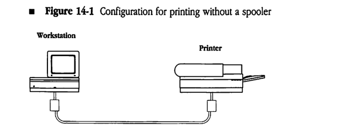
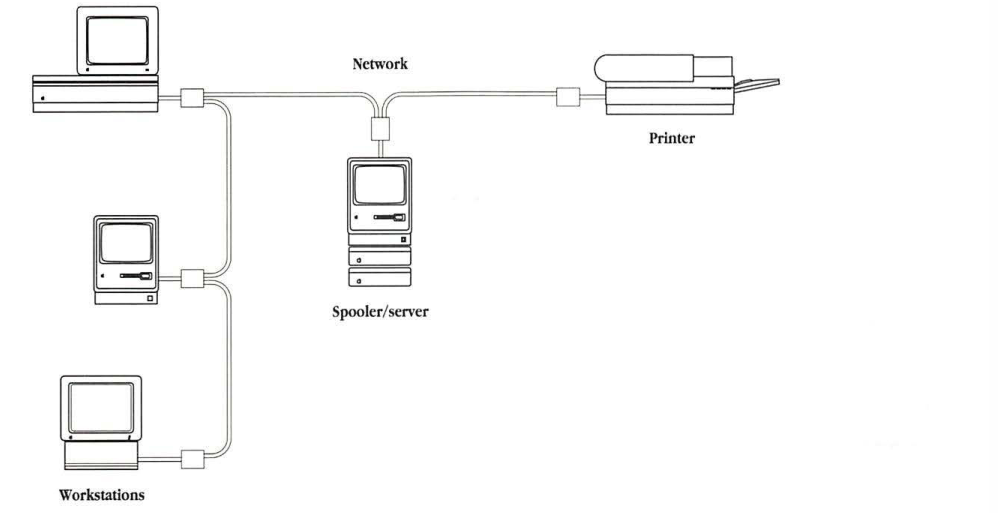
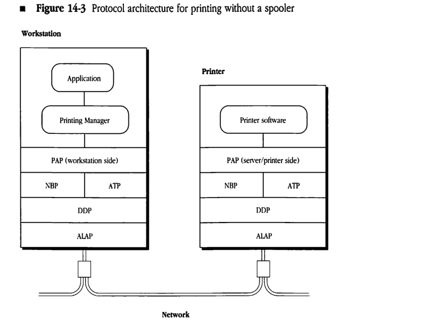
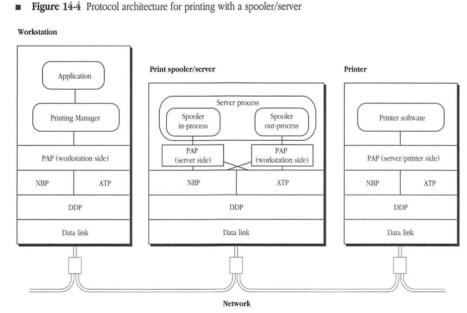
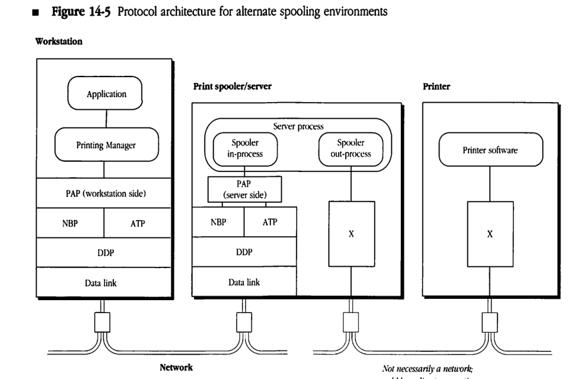
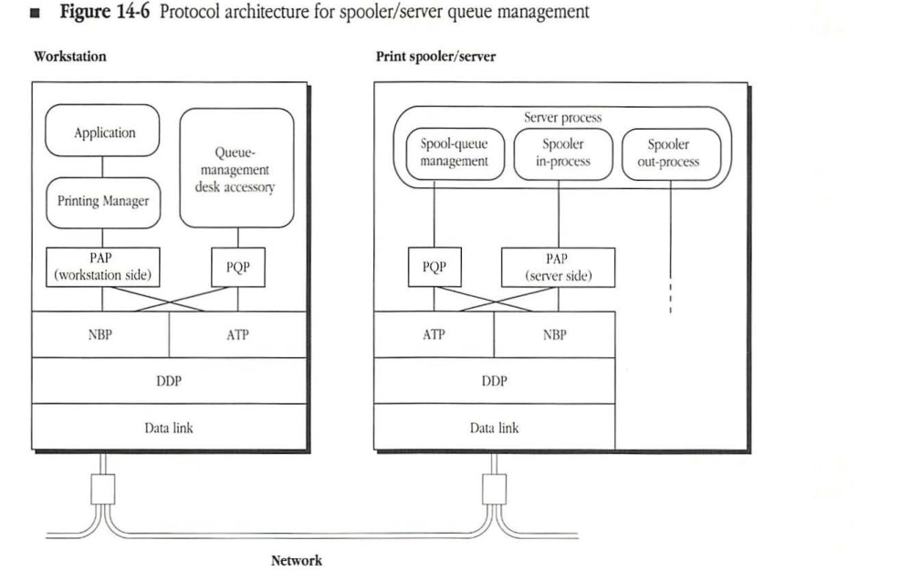
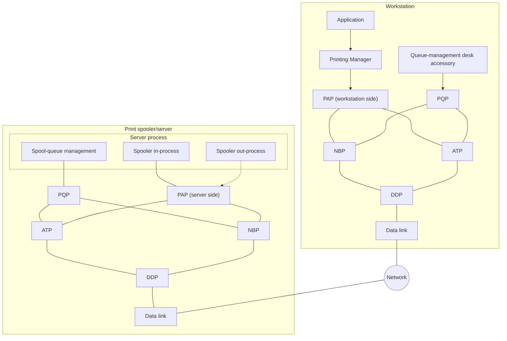

# Print Spooling Architecture

| Field | Value |
|-------|-------|
| **Source** | [Inside AppleTalk Second Edition (1990)](https://vintageapple.org/macbooks/pdf/Inside_AppleTalk_Second_Edition_1990.pdf) |
| **Part** | Part V - End-User Services |
| **Chapter** | 14 |
| **Pages** | 472–515 |
| **Converted** | 2026-04-05 |
| **Engine** | gemini-flash |


# Chapter 14 Print Spooling Architecture

THE WORD *SPOOL* is an acronym for Simultaneous Peripheral Operations On Line, and a print spooler is a hardware application or a software application (or both) that is used to store data on a disk temporarily until the printer is ready to process it. Since the print spooler handles the interaction required with the printer in order to accomplish the printing process, use of a spooler frees the originating computer, such as an Apple Macintosh computer, to perform other activities during the printing process. This chapter describes AppleTalk print spooling in general and compares printing with a spooler to printing without a spooler. In addition, since print spooling can be accomplished either by a spooler/server or as a background process on the originating computer, this chapter also compares these two options.

## Printing without a spooler

In an AppleTalk network, when printing is performed without the benefit of a spooler, the workstation initiating the print job is unavailable for other purposes until the printer has finished processing the print job. This section discusses several factors that affect the length of time that a workstation is tied up for printing.

When a Macintosh workstation user selects a document and invokes a print command, the workstation executes the document-composition application corresponding to that document. The application, in conjunction with the Macintosh Printing Manager, produces the print file information and sends it, in real time, to the printer, as shown in *Figure 14-1*. In this case, the document-composition application has control of the workstation until the print job is completely processed; during this time, a dialog takes place between the workstation and the printer, so the workstation is unavailable for any other purpose. The length of time that the workstation is unavailable to the user is determined by at least the following three factors:

* the speed at which the printer converts the print job into its physical printed form
* the size of the print file being produced
* the type of print file being produced

In an AppleTalk network, when the document-composition application calls the Printing Manager in the Macintosh to send a print job to a LaserWriter (or to an ImageWriter), the Macintosh begins a series of AppleTalk calls in an attempt to establish a connection. These calls perform the following functions in order:

1. Using the Name Binding Protocol (NBP) name-lookup operation, look for the currently selected printer and find its AppleTalk address.
2. Using the Printer Access Protocol (PAP), attempt to open a connection with the printer.

#### **Figure 14-1** Configuration for printing without a spooler




If the printer is busy (that is, if the printer is servicing another job), it refuses to accept a new connection. In this case, the Printing Manager must continue trying to open the connection until the printer finishes processing the current job and breaks the connection established for that job, which frees the printer to establish another connection. During this time, the user's workstation is unavailable for other use. The length of time that the workstation is unavailable to the user is determined not only by the characteristics of the printer and of the user's own print job, but also by the following factors:

* the size and type of job currently being printed
* the number of other workstations contending for the printer

It could be several minutes (on rare occasions, even hours) before the printer accepts the new print job. In the meantime, the user's workstation remains unavailable unless the user cancels the pending print request.

## Benefits of printing with a spooler

Since a print spooler stores a printer-ready file on disk and interacts with the printer until the file is printed, introducing a print spooler between the document-composition system and the printer reduces the length of time that a workstation is tied up for printing. As soon as the print job is ready to be printed, the workstation sends the job to the spooler to store on disk, which releases the workstation for other uses. The spooler then establishes and maintains the required dialog with the printer until the print job is finished.

A print spooler can also provide a mechanism for controlling access to a printer. The spooler can include a user authentication system that would force potential users to enter user identification information (such as user names and passwords) before allowing the users to gain access to a specific printer. The authentication function can be extended to include a wide variety of access options. For example, classes of user authorization could be established, and certain classes of print jobs could be given priority over other jobs.

A print spooler also provides a mechanism for gathering statistical information about printer usage. An accounting department can use information about the printing activity of the users for billing purposes. In addition, management can use statistics about printer access to evaluate a site's design and to plan potential modifications.


## Background spoolers versus spooler/servers

The following two types of spooler implementations can be used with AppleTalk workstations:

* background spoolers
* spooler/servers

A *background spooler* is a software system that runs on a workstation as a background process to spool a print job to the user's local disk (usually a hard disk). With a background spooler, once the print job is ready for printing, the job becomes the spooler's responsibility. The spooler takes charge of storing the print file, establishing a connection with the printer, and interacting with the printer until the job is finished.

When a background spooler is used, although the workstation must remain connected to the network until the job is processed, the user can continue to use the workstation for other operations. However, if the workstation is switched off, or if its connection to the network is otherwise broken, the print job will not be printed. In addition, background spoolers cannot provide mechanisms for controlling printer access or for gathering accounting data about printer usage.

A *spooler/server* is an intermediary (or agent) that is positioned between one or more workstations and one or more printers, as shown in Figure 14-2. When a spooler/server is used, the Macintosh Printing Manager produces the print file and sends it over the network to the spooler/server; the spooler/server then interacts with the printer to print the job.

After receiving the print file, the spooler/server can terminate its connection with the workstation. Then, the workstation is free to perform other tasks or can be switched off. A spooler/server also provides an intermediate point between the workstation and the printer for inserting various kinds of access control and for gathering accounting statistics.

## Impact of the Macintosh on printing

The Macintosh computer's printing architecture tightly binds a document's print file to the printer on which it is to be printed. When a print job is sent from a Macintosh to a LaserWriter or similar printer, the Printing Manager in the Macintosh queries the printer for various parameters throughout the printing process. Therefore, two-way communication is maintained between the Macintosh and the printer for the duration of the job. The spooler/server must emulate a printer during communication with a workstation by responding to queries in the print stream as it receives the print job.


#### **Figure 14-2** Configuration for printing with a spooler/server



The print stream that a Macintosh sends to a LaserWriter is in PostScript. However, document-structuring conventions have been developed to provide guidelines for embedding comments in PostScript code in order to communicate with document managers (such as print spoolers). These comments allow spoolers to respond to queries without having to interpret actual PostScript code.

## Printing without a spooler

Figure 14-3 illustrates the protocol architecture used for printing without a spooler on a LaserWriter (or an ImageWriter) printer from AppleTalk workstations. You can also apply this model to other printers connected to an AppleTalk network.

The Macintosh workstation uses NBP to obtain the AppleTalk address of the printer's listening socket. The Macintosh identifies the printer for NBP by the printer's complete NBP name (if the printer is a LaserWriter, the type field of the entity name is "LaserWriter").


#### **Figure 14-3** Protocol architecture for printing without a spooler



Once the AppleTalk address of the printer's listening socket is determined, the workstation opens a connection to the printer through PAP. When this connection is established, the workstation and the printer interact over the PAP connection.

PAP is a client of the AppleTalk Transaction Protocol (ATP), which in turn uses the Datagram Delivery Protocol (DDP). PAP is an asymmetric protocol; the PAP code in the workstation is different from the PAP code in the printer. Figure 14-3 illustrates this difference.

The commands and data sent through the PAP connection are printer-dependent. For the LaserWriter, the dialog is in the PostScript programming language.

## Printing with a spooler/server

Figure 14-4 illustrates the printing architecture when a spooler/server is introduced between the Macintosh workstation and a printer (such as a LaserWriter or an ImageWriter). The key feature of this architecture is that the spooler/server sets itself up as a surrogate printer. Doing this means that when a workstation looks for a printer of the appropriate type (for example, "LaserWriter"), it views the spooler/server as such a printer. In fact, through this name-lookup process, the workstation cannot distinguish this spooler/server from a printer of the same type. (The spooler/server can set itself up as one or more printers with appropriate names.)

The spooler/server responds to a PAP connection request from the workstation exactly the way a PAP-based printer would. Once the connection is established, the spooler process emulates all of the relevant aspects of a workstation's interaction with a printer, while storing the print files in its internal storage (typically, a hard disk).

#### **Figure 14-4** Protocol architecture for printing with a spooler/server




Through PAP, it is possible to establish multiple connections to a printer. The design of the printer determines the number of connections that a printer services simultaneously. LaserWriter and ImageWriter printers accept only one connection (therefore, one job) at a time. Typically, spooler/servers should accept several connections at a time in order to reduce the delay experienced by workstations that are trying to print.

The spooler/server includes a spooler out-process, which functions exactly as a workstation in transmitting jobs to the printer. The spooler out-process picks up spooled print files from its internal storage and prints them on the destination printer in exactly the same way that a workstation would.

Together with the appropriate protocol modules and drivers, the spooler process converts the spooler/server into a two-sided entity, which appears as a printer to the workstations and as a workstation to the printers. Consequently, the spooler/server includes both the server-end PAP and the workstation-end PAP.

A simple modification of the print-spooling architecture makes it possible to include spooling either to printers that are directly plugged into the spooler/server or to printers with which the spooler/server communicates through a protocol other than PAP. In these cases, the in-process side of the spooler/server remains the same as the in-process side shown in *Figure 14-4*. However, the out-process side is modified to provide a mechanism for transmitting the print files from the server's internal storage to the actual printer. If you are designing a spooler for these purposes, while you can tailor the out-process to meet specific needs, the in-process must strictly obey the disciplines for printers dictated by PAP. *Figure 14-5* provides an example of this type of architecture. In this figure, X represents non-PAP modules and drivers.

## Controlling printer access

Because a spooler/server is positioned between the workstations and the printers, it can be used to control printer access. When a spooler/server is controlling access to a printer, workstations can communicate with this printer only through the spooler/server.

In this case, the spooler/server provides an intermediary location for

*   implementing a user authentication system (see "User Authentication Dialog," next, for details on this implementation)
*   gathering and storing global statistics about printer use (for accounting or planning purposes)


#### **Figure 14-5** Protocol architecture for alternate spooling environments



For example, if a network contains three printers, one printer can be dedicated to jobs from the executive staff; the other two printers can be made available to the rest of the staff and used based on which has the least activity. In addition, the number of pages printed on each printer can be recorded so that the activity levels on the three printers can be compared.

To restrict direct access to a particular printer and to force workstations to obtain access to the printer through the spooler/server, the spooler process renames the printer so that other network devices can no longer recognize it as a printer. In this case, the spooler opens a connection to a printer at startup and then sends a command to the printer to change the type field of its name to a string that does not correspond to any type of printer. For example, a spooler/server may change the type field of the name of a LaserWriter printer from “LaserWriter” to an optional new string. Next, the spooler/server opens its own PAP listening socket and assigns itself a name with


"LaserWriter" in the type field (this name may be either a new string or the string that the printer used before it was renamed). As a result, when workstations use the NBP name-lookup process to search for the printer, they find the spooler/server instead of the printer.

This technique of renaming the printer is not mandated by the print spooling architecture. Additionally, if the spooler/server also includes a direct passthrough service, workstations can still print directly to a printer that has been renamed. When direct passthrough is used, rather than spooling files for the printer, the spooler/server passes messages between the workstations and the printer (see "Direct Passthrough" later in this chapter).

## User authentication dialog

Just after the workstation opens a PAP connection to the spooler/server (or to a printer), the devices engage in an exchange of messages known as the user authentication dialog. This dialog consists of a series of messages whose format coincides with PostScript comment conventions. The spooler/server must be able to carry on this dialog. Details on using PostScript comments are provided later in this chapter.

* **Note:** The discussion that follows applies to printers that implement PostScript (in particular, LaserWriter printers). Other AppleTalk printers (such as ImageWriter printers) require different mechanisms.

The first step of the dialog is to determine whether the device to which the PAP connection has been opened is a spooler/server. To do this, the workstation uses a SpoolerQuery with the following format:

```
%%?BeginQuery: rUaSpooler
false = flush
%%?EndQuery: true
```

If the device is a PostScript device, such as the LaserWriter, and if it does not have the ability to respond to this query, the second line causes the device to send back `false` as a reply. Since a LaserWriter does not interpret comments, it responds with `false`, indicating that it is not a spooler. However, if the device is a spooler/server, when it receives the first line of this query, it skips the second line and sends back `true` as a reply, indicating that it is a spooler.

If the reply to the `SpoolerQuery` query is `false`, the user authentication dialog is skipped, and the connection is used for printing directly to the printer.

However, if the reply to the `SpoolerQuery` query is `true`, the user authentication dialog is continued. The next step in this dialog is to query for a list of the user authentication methods (UAMs) that the particular spooler handles. The following is an example of this query:

```
%%?BeginUAMethodsQuery
%%?EndUAMethodsQuery: NoUserLogin
```

The response to this query is a set of one or more strings, with each string identifying a user authentication method that the spooler supports. The response must terminate with either an asterisk ( `*` ) or the string `NoUserLogin`. There are three standard user authentication methods specified by Apple:

* `NoUserAuthent`
* `CleartxtPasswrd`
* `RandnumExchange`

If you design other special methods for user authentication, you should define a string to identify each of these methods.

* Note: There is a fourth reply, `NoUserLogin`, that is used for spoolers that do not support logging in of users. A spooler that does not want to control user access can return the string `NoUserLogin`. In this case, the workstation bypasses the login dialog completely.

The first standard authentication method requires the spooler to receive a login string. The workstation sends the spooler the following:

```
%%Login: NoUserAuthent
```

The spooler must reply with the message `LoginOK`, and the workstation can then continue with the printing phase of the connection.

The second standard authentication method requires that the spooler receive a user name string and a password, which it compares with a user authentication database to verify that the user is valid. The workstation sends the spooler the following:

```
%%Login: CleartxtPasswrd <user name> <password>
```


If the spooler finds a match for the user name and password pair in its user authentication database, then the spooler responds with the message `LoginOK`. The workstation can then continue the printing phase of the connection. However, if the user information does not match an entry in the user authentication database, then the spooler responds with the message `InvalidUser`. In this case, the spooler does not permit further use of the PAP connection by the user and disconnects the workstation after a few seconds. This disconnection interval should be long enough to ensure the delivery of the `InvalidUser` message to the workstation.

To prevent peek programs from being used to spy and read passwords out of network packets, the third standard authentication method does not send the password over the network cable. In this case, the workstation sends the following:

```
%%Login: RandnumExchange <user name>
```

Upon receiving this information, the spooler examines its user authentication database to see if the indicated user name exists. If the user name is not found in the database, the spooler sends back the message `InvalidUser` and disconnects the workstation, as previously described. If the user name is found, the spooler sends back a message that consists of the word `Randnum`, followed by a space and a 16-character hexadecimal ASCII representation of a 64-bit random number that the server generates. Upon receiving the random number, the workstation uses the user password as the key to encrypt this random number by using the National Bureau of Standards Data Encryption Standard (NBS-DES) algorithm. Then, the workstation sends the following reply in which `XXXX...` represents the encrypted random number:

```
%%LoginContinue: RandnumExchange <XXXX...>
```

In the meantime, the spooler uses the user's password from its database as the key to encrypt its random number. The spooler compares the quantity produced by this encryption with the encrypted value sent by the workstation. If the two values are equal, the user is valid, so the spooler returns the `LoginOK` reply and the printing phase of the connection can begin. If the values are unequal, the spooler replies with the message `InvalidUser` and disconnects the workstation.

## Direct passthrough

In addition to providing a user authentication service, you can design the spooler/server to allow a workstation to establish a direct (or passthrough) connection to a printer. When a direct passthrough is established, the spooler does not spool files for printing, but simply passes messages back and forth between the workstation and the printer.

Direct passthrough is required when the spooler/server has renamed the printer and when a workstation needs to communicate with the printer directly. For example, certain applications can optimize the use of LaserWriter virtual memory by querying the printer at various stages of the print job and then modifying the print file to conform to the actual situation during printing.

There are two ways of accommodating such applications. The first approach, known as spooler bypass, is to leave the printer's name unaltered, so that it is available for direct access by both the workstations and the spooler/server. In this case, the spooler/server must contend with workstations attempting to gain access to the printer.

The second approach is to allow the spooler/server to rename the printer and to force the spooler/server to provide a passthrough option to a workstation that requests a direct connection to the printer. In this case, the workstation connects to the spooler in the typical manner. After completing the user authentication dialog, the workstation sends a PostScript comment to request a passthrough connection to the printer. This comment takes the following form:

```
%%?BeginPassThroughQuery
%%?EndPassThroughQuery false
```

If the spooler receiving this request does not support passthrough, it responds with `false`; if the spooler does support passthrough, it responds with `true`. After a spooler responds with `true`, it acts as a forwarding agent, passing messages between the workstation and the printer in real time.

If there are other jobs for the specified printer in the spooler's queue, the workstation requesting direct passthrough must wait until the spooler finishes all of the jobs for that printer and succeeds in establishing a new connection to the printer.

## Spooler/server queue management

You can design a spooler/server application to offer spool-management functions, such as rearranging the printing order of the jobs in the queue, changing jobs from queue to queue, or deleting jobs from the queue. However, neither PAP nor the Macintosh Printing Manager are designed to accommodate queue-management functions. Therefore, you must provide such functionality through independent means.

Since the design of a mechanism that provides queue management depends on the specific characteristics and functional design of the spooler/server, Apple has not established a standard design for the queue-management functions.


#### **Figure 14-6** Protocol architecture for spooler/server queue management





The PostScript comments:

* provide information needed by document managers for merging, editing, spooling, and accounting
* provide user-friendly comments that describe the print job and divide it into sections
* provide summary information about the resources required by the print job
* surround machine-dependent and job-specific PostScript code
* surround PostScript code that significantly changes the state of the printer
* surround PostScript code that requires a response from the printer and define the minimum valid response


## About document structuring conventions

Adobe Systems has developed general document structuring conventions for PostScript comments so that they can be used universally with a variety of document managers. These conventions include three general classes of comments:

| Comment type | Definition |
| :--- | :--- |
| structure | delimits structural components of a PostScript document file; delimits special text blocks; provides document and page setup information |
| resource | specifies resources that are required in order to print a PostScript document but that are not included within its text (for example, fonts, specific paper color, collating order, or even printer features such as size of paper trays) |
| query | checks the status of the printer (for example, availability of fonts, files, and virtual memory) |

If a PostScript document file obeys a proper subset of these structuring conventions, it is said to be conforming to the PostScript comment conventions. If a file does not follow the structuring conventions, it is said to be nonconforming and cannot be processed by AppleTalk spoolers designed to interface with PostScript printers.

The use of comments is designed to facilitate communication between document-composition systems and document managers. Therefore, the comments that make up the subset to which the document file must conform depend on the installation. For example, the document-composition system can include the resource requirements in the comment subset to ensure that these requirements are handled properly. However, if a document-composition system relies on the printing environment (the spooler and printer) to handle resource requirements appropriately, resource comments need not be included in the comment subset.

### About PostScript document files

A conforming PostScript document file includes the following structural features:

- prologue
- script
- pages


The *prologue* is a set of procedure definitions that define operations required by a document-composition system. The PostScript document begins with a prologue, which typically contains application-dependent definitions and which is stored in a place accessible to an application program. The prologue is used as a standard preface to each page and, generally, should not contain executable code.

The *script* is usually generated automatically by an application program. The script, which contains the data that represents a particular document, should not contain any definitions. The script of a multipage document is organized as a sequence of independent single-page descriptions.

The *pages* in a PostScript script are functionally independent of each other, but they are dependent on the definitions in the prologue. The pages can be executed in any order and rearranged without affecting the printed document. This means that the pages can be printed in parallel as long as the prologue definitions are available to each page.

A document file can contain another document file description as part of its script. An illustration embedded in a document is an example of this structure. One benefit of PostScript document descriptions is that they allow documents from different sources to be merged for final printing.


## About PostScript print jobs

In understanding PostScript document files, you must understand the difference between a document file and a print job. A document file is a data representation that may be transmitted, edited, stored, spooled, or otherwise processed. A document is transmitted to a printer in a series of print jobs, each of which contains a certain type of code. There are three types of PostScript print jobs with which you should be familiar:

- standard print jobs
- queries
- exit server jobs

*Standard print jobs* are those jobs destined for the printer. The print spooler passes these jobs to the PostScript printer. They contain the code for the printed document.

*Queries* are print jobs that check printer status. Queries require a response from the printer. A print spooler must be able to respond to these queries by interpreting query comments.

Exit server jobs bypass the normal server-loop save/restore context. They contain a block of text with resources for the printer (such as fonts that are being downloaded to the printer), rather than an actual printing job. The print spooler generally stores the resources that are contained in an exit server job on its hard disk so that they are permanently available to the printer.

The job type is specified by the Job Identification comment, which is the first line of every print job. Comments consist of a percent sign (%) followed by text and terminated by a newline character. The PostScript interpreter completely ignores the comments. However, comments conforming to the file-structuring conventions can query or convey structural information to document managers. Comments that contain structural information start with %! or %%. Query comments begin with %%?. Comments that do not start with one of these three notations are ignored by document managers (as well as by the PostScript interpreters).


### Comment format

The format of a PostScript comment depends on its function. Comments interpreted by document managers must be in one of the following forms. In these examples, angle brackets (< >) designate required portions of the comment, and square brackets ([ ]) indicate optional portions.

This form is used at the beginning of the PostScript job to identify the job type:

```
%! <keyword> [<argument> ...]
```

This form is used to mark a position or event in the print stream or to supply a value for a keyword:

```
%%<keyword> [<argument> ...]
```

This form is used with machine-dependent or job-dependent code and may supply values that define the specific function of the code:

```
%%Begin <keyword> [<argument> ...]
<PostScript code>
%%End <keyword>
```

This form is used for queries requiring a response from the printer:

```
%%?Begin <keyword> [<argument> ...]
<PostScript code>
%%?End <keyword> <response> [<response> ...]
```

### Syntax conventions

PostScript comments must adhere to the following syntax conventions:

- The case of letters in a comment is significant.
- Each comment must begin with %.
- No spaces are allowed between the %%, %!, or %%? and the keyword, as shown in the following example:

```
%%keyword
```

- Either a colon, one space, or both a colon and a space can be used to separate a keyword and its first argument; however, the colon, when present, is not optional. These three forms are shown in the following examples:

```
%%keyword:argument
%%keyword: argument
%%keyword argument
```

- When a colon follows a keyword, no space is allowed between the keyword and the colon.
- One space should be used between the colon and the first value.
- One space should be used between values, as shown in the following example:

```
%%keyword argument value1 value2
```

- A newline character must follow immediately after the last value.
- Comments may not exceed 255 characters.
- A comment line can be continued on subsequent lines by beginning the continuation with %%+, as shown in the following example:

```
%%keyword: argument value value value value
%%+ value value value
```

- Either parentheses or double quotations marks can be used to set off values, as shown in the following examples:

```
%%keyword: argument (value)
%%keyword: argument "value"
```

- A string argument can contain spaces, provided it is enclosed in either parentheses or double quotation marks, as shown in the following examples:

```
%%keyword: (string comprising argument)
%%keyword: "string comprising argument"
```


## Comments in documents

The first line of every PostScript document file must start with %!, which identifies the program as a PostScript print job. The %! introduces the Job Identification comment, which specifies the Adobe code version and, optionally, the job type, as shown in this example:

```
%!PS-Adobe-2.0
```

The Job Identification comment should be used only once in each print job. If the version is 2.0, the print job conforms to version 2.0 of the Adobe PostScript Document Structuring Conventions.

Following the Job Identification comment is the text of the document itself, interspersed with comment lines that contain structural information and other information about the document. The rest of the comments in a PostScript document file begin with %% (or %? if the file is a query job) and are followed by a keyword. If the comments require one or more values, the keyword is followed by a colon (typically) and the value or values.

Some structure comments and all query comments occur in pairs of beginning and ending comments that surround PostScript code. Comment pairs that enclose PostScript code can also enclose other comments or comment pairs.

All conforming document files must end with %%EOF, which indicates that an End Of File (EOF) message is being sent to the PostScript device.

The following general constraints apply to all document files that conform to version 2.0 of the Adobe PostScript Document Structuring Conventions. If document files do not adhere to these constraints, they are considered nonconforming and may not be handled reliably by document managers.

### Prologue and script

A conforming PostScript document should be divided into a prologue and a script. Nothing can be executed in the prologue and no definitions can be included in the script. The prologue should always be designed so that it can be removed from a document file and downloaded permanently into the printer; then, when subsequent document files containing only the script are downloaded, they can depend on the preloaded prologue for definitions. See "About PostScript Document Files" earlier in this chapter for a more detailed discussion of prologues and scripts.


### Pages

When the Page Marker comment is used within the body of a document, the pages in the document do not depend on each other. Each page can rely on definitions in the prologue, but a page should not depend on a state set in another page of the document. Keeping pages independent allows document managers to rearrange the document pages without affecting the execution of the document. For more information, see "About PostScript Document Files" earlier in this chapter.

### Line length

A PostScript comment can contain a maximum of 255 characters. There are no constraints on the placement of line breaks. When a comment is continued on the next line, the new line should begin with the notation %%+ to indicate that the comment line is continuing. This convention is used most frequently for comments that contain a list of font names, as shown in the following example:

```
%%Document Fonts: Palatino-Roman Palatino-Bold
%%+ Palatino-Italic Palatino-Bold Italic Courier
%%+ Optima Times Geneva Chicago
```

## Structure comments

This section describes the structure comments used in a PostScript document file that an AppleTalk print spooler interprets. These comments are the typical structure comments that should be included in PostScript code in order to communicate with an AppleTalk spooler. In addition, if you are creating a spooler to run in an AppleTalk network, the spooler should be able to interpret this subset of structure comments. For additional structure comments that can be included in PostScript document files, refer to Adobe Document Structuring Conventions, Version 2.0.

Structure comments serve the following purposes:

* They delimit the structural components of a PostScript page. For example, they mark the prologue, script, and PostScript page breaks.
* They provide document and page setup information (such as the document title, date, and page count).
* They provide a markup convention for noting the beginning and ending of particular pieces of the document file that might need to be identified for further use. For example, structure comments can be used to mark embedded font files or procedure definitions, facilitating their removal from the print job or the restructuring of the print job.

Structure comments are divided into the following three categories, which correspond to the parts of the document file in which the comments are used:

| **Comment type** | **Definition** |
| :--- | :--- |
| header | precedes any noncomment PostScript program text and provides information about the document as a whole |
| body | interspersed throughout the PostScript program text; serves mainly to delimit the various parts of the document file |
| trailer | follows all the noncomment PostScript program text and provides additional information about the document as a whole |

The rest of this chapter describes these categories and the comments that they include. Comment definitions are listed alphabetically under each category and include syntax and an example. The structure comments are summarized as follows:

| **Comment** | **Description** |
| :--- | :--- |
| *Header* | |
| `%!PS-Adobe-2.0 [identifier]` | version number/job identifier |
| `%%CreationDate: text` | date assigned to document |
| `%%Creator: text` | name of document-composition application |
| `%%For: text` | person for whom document is being printed |
| `%%Title: text` | document title |


| Comment | Description (continued) |
| :--- | :--- |
| **Body** | |
| `%%BeginExitServer: password`<br>`%%EndExitServer` | introduction to text registered outside of normal server loop |
| `%%BeginProcSet: name version`<br>`revision`<br>`%%EndProcSet` | delimiters of procedure subset |
| `%%Page: label ordinal` | indication of PostScript page break |
| `%%Trailer` | indication of boundary between script and trailer |

## Header comments

Header comments provide general information about the PostScript document file. They include the following types of global information for the print spooler:

* code and job identification
* document title
* document-creation date
* identification of document-composition application
* user name of document originator

◆ *Note: A PostScript header can also include other general comments that are not needed by a print spooler (and that are not interpreted by Apple's LaserShare print spooler), but that could be used by other types of document managers. This chapter describes only those comments interpreted by LaserShare. Refer to the Adobe Document Structuring Conventions, Version 2.0, for other header comments.*

Header comments appear at the beginning of a document file, before any executable PostScript code. Every PostScript job must begin with a Job Identification comment. The header comments continue until the first occurrence of a line that does not start with %% or %! (or until an End Comments comment; see the *Adobe Document Structuring Conventions, Version 2.0*, for a description of this comment). Header comments should be contiguous; if the document manager


encounters a line that does not begin with %%, it may quit parsing for header comments. In general, header comments make up most of the document prologue, ending immediately before the PostScript document description begins.

After the Job Identification comment, the header comments can be listed in any order. However, if two or more comments contain the same keyword, the first comment (and its corresponding value) is the one that the spooler interprets. In this case, the spooler ignores the other occurrences of the comment. This process makes it possible to insert new comments at the beginning of a file without having to search for and delete the old comments embedded in the file.

Some header comments can be deferred to the trailer at the end of the document file. This practice is common for comments containing information that is not available until the end of the document, such as page counts. In this case, a comment with the same keyword and the value `(atend)` must appear in the header-comments section.

#### Creation Date comment

The Creation Date comment indicates the date, the time, or both the date and time assigned to the document. The text string for this comment can be in any format because the date and time are used only for informational purposes (for example, on banner pages).

*Syntax:* `%%CreationDate: text`

*Example:* `%%CreationDate: Tuesday, July 13, 1987`

#### Creator comment

The Creator comment identifies the creator of the document file. The creator is usually the document-composition application that was used to generate the document. However, the text string may optionally (or additionally) include the name of the person creating the document.

*Syntax:* `%%Creator: text`

*Example:* `%%Creator: Write`


#### For comment

The For comment specifies for whom the document is being printed. This specification is usually the user name of the person who composed the document. This information can be included in the banner page and can be used for routing the document to the person printing it.

*Syntax:* `%%For: text`

*Example:* `%%For: Smith, John`

#### Job Identification comment

The Job Identification comment identifies the PostScript job as a document file that conforms to version 2.0 of the Adobe PostScript Document Structuring Conventions. The Job Identification comment must be the first line of the document file. (To avoid confusion, the file should not contain any lines, other than the Job Identification comment, that begin with %!.)

This comment also identifies the PostScript job type of the document file. If no keyword is included in the comment, the job is a standard PostScript printing job. However, the comment can include a keyword that identifies the job as either a query job or an exit server job. PostScript job types are explained in "About PostScript Print Jobs" earlier in this chapter.

If the Query keyword is included in the comment, the entire job consists of PostScript queries to which the spooler must reply. "Query Comments," later in this chapter, contains a discussion of these comments.

If the ExitServer keyword is included in the comment, the job will execute PostScript exit server commands to register the contents of the file outside of the normal server-loop save/restore context. For example, the file may include code for special type fonts that will be permanently available to the printer. See "Exit Server Comments" later in this chapter for more information.

*Syntax:* `%!PS-Adobe-2.0 [identifier]`

*Examples:*

```
%!PS-Adobe-2.0
%!PS-Adobe-2.0 Query
%!PS-Adobe-2.0 ExitServer
```

#### Title comment

The Title comment contains a text title for the document. This title can be used to identify the document on the spooler queue, or it may appear on banner pages to help route the documents. The text string used for the title may be derived from an application-level document name or from a filename.

*Syntax:* `%%Title: text`

*Example:* `%%Title: Project Status Report`


### Body comments

Body comments provide structural information about the PostScript document file's organization. They act as boundary markers between parts of a document file (for example, to separate the prologue from the script or to mark PostScript page breaks). These markers enable an application to extract page subsets or to reverse the order of the pages in a PostScript document file while still maintaining the structure of the document by preserving the prologue at the beginning and the trailer at the end of the file.

Body comments can appear anywhere in a document file. Since body comments frequently delimit a block of text in a PostScript document file, they usually come in pairs, each with a beginning comment and an ending comment.

A print spooler need only interpret those PostScript comments that have a direct effect on document spooling. Therefore, the LaserShare spooler interprets only a subset of the available PostScript body comments. LaserShare ignores any comments that it does not recognize. PostScript document files generated with the Macintosh computer's LaserWriter driver include body comments that do not affect spooling and are therefore ignored by the LaserShare spooler. These comments are not documented here; the following comment descriptions are for those body comments that LaserShare interprets. Refer to the *Adobe Document Structuring Conventions, Version 2.0*, for descriptions of other body comments.


#### Exit Server comments

The Exit Server comments surround PostScript exit server code. The PostScript exit server code introduces a segment of PostScript code, known as a procedure set, that is to be registered outside of the normal server-loop save/restore context. The Exit Server comments immediately precede the Begin Procedure Set comment, which marks the beginning of the text block that bypasses the server loop. Rather than being an actual printing job, the procedure set introduced by Exit Server comments contains resources for the printer, such as fonts that are being downloaded. See "Procedure Set Comments" later in this chapter for further explanation.

Usually, the Exit Server comments are included only in an exit server job. An exit server job begins with the `%!PS-Adobe-2.0 ExitServer` comment and contains a procedure set with permanent resources for the printer. These resources are generally stored on the spooler's disk. "Sample Print Streams," later in this chapter, provides an example of an exit server job.

*   **Note:** Although it is not recommended, the Exit Server comments occasionally can appear as part of a standard PostScript printing job. In this case, when LaserShare encounters the Exit Server comments, it strips them out of the print stream; if a procedure set follows the Exit Server comments, LaserShare does not store the procedure set as a permanent resource, but handles it like any standard procedure set included in a document file. See "Procedure Set Comments" and "Include Procedure Set Comment" later in this chapter.

**Syntax:**

```
%%BeginExitServer: password
%%EndExitServer
```

**Examples:**

```
%%BeginExitServer: 000000
    serverdict begin
    000000
    exitserver
%%EndExitServer
```


#### Page Marker comment

The Page Marker comment marks PostScript page boundaries. This comment usually occurs once for each page and provides information about the page's requirements and structure. Page Marker comments are used to preserve the page order in PostScript documents; they act as counters to track the number of pages in the document file.

The Page Marker comment requires two arguments:

| Argument | Description |
| :--- | :--- |
| label | optional information to identify the page according to the document's internal numbering scheme (The text string should not contain blank space characters.) |
| ordinal | a number reflecting the position of the page within the body of the PostScript file (The number must be a positive integer.) |

A question mark (?) can be used for either of these arguments if the number is unknown.

The Page Marker comment is used frequently. It is required so that pages do not rely on each other but do rely only on the definitions made in the prologue of the document file. A spooler should be able to physically rearrange the contents of the print file into a different order (or to print pages in parallel) based on the information in the Page Marker comment.

*Syntax:* `%%Page: label ordinal`

*Example:* `%%Page: ? 1`

#### Procedure Set comments

The Procedure Set comments surround a procedure set within the body of a PostScript document file. The procedure set typically represents a subset of the document prologue; the prologue can be broken into several subpackages known as procedure sets. Procedure sets can be used to define groups of routines for different imaging requirements. For example, a procedure set may include the code for generating specialized fonts.

The Trailer comment should occur once in each document file, at the end of the document script. This comment separates the script from any trailer comments that may be included in the document file. The print spooler uses the Trailer comment to confirm that the printer has received the entire print document (that is, to detect that the print job was not aborted midstream). Any conforming PostScript document file is expected to include a Trailer comment at the end of its script.

Syntax: `%%Trailer`

Example: `%%Trailer`

## Resource comments

This section describes the resource comments used in PostScript document files that are interpreted by AppleTalk print spoolers. These comments are the typical resource comments that should be included in PostScript code in order to communicate with an AppleTalk spooler. In addition, if you are creating a spooler to run in an AppleTalk network, the spooler should be able to interpret these resource comments. Refer to the *Adobe Document Structuring Conventions, Version 2.0*, for additional resource comments that can be included in PostScript document files.

Resource comments (or resource requirements) specify resources that are required in order to print the PostScript document but are not embedded within its text. (Prologues, fonts, and included files are examples of such resources.) The resource comments can also specify other document requirements, which can vary from particular paper-stock form, to a specific paper color, to a specific collating order. In addition, resource comments can specify requirements for individual printer features, such as the number or size of paper trays that should be attached to the printer.

### Conventions for using resource comments

Resource comments can appear anywhere in a document. They indicate that the named resource should be included in the document at the point at which the comment is inserted. The code included can be for a font, a disk file, or any other resource. If resource comments appear in the body of a document, a corresponding comment should appear in the header of the document to indicate that the entire document requires the files.

The number and types of resource comments included in a document file depend partially on the degree to which the document-composition application relies on the printing environment to provide the required resources. If the document-composition application relies on the printing environment to supply resources, few resource comments are used in the document file; however, if the document-composition application chooses to ensure that resources are available by providing them itself, more resource comments appear in the document file. (Documents with extensive resource requirements are common in large distributed networks that take print spooling for granted and that have centralized resource management.)

### Definitions

AppleTalk print spoolers should be able to interpret and respond to the two resource comments summarized below. The *Adobe Document Structuring Conventions, Version 2.0*, describes additional resource comments that can be used for communicating with spoolers.

| Comment | Description |
| :--- | :--- |
| `%%EOF` | indication of the end of the file |
| `%%IncludeProcSet: name version revision` | instruction to include the specified procedure set |

#### End Of File comment

The End Of File comment indicates that an end-of-file message is being inserted into the print stream. Every PostScript job must begin with the Job Identification comment and end with an End Of File comment.

**Syntax:** `%%EOF`

**Example:** `%%EOF`

#### Include Procedure Set comment

The Include Procedure Set comment directs the spooler to insert the specified procedure set into the header of the document file. The procedure set typically represents a subset of the document prologue; the prologue can be broken into several subpackages known as procedure sets. The procedure sets can be used to define groups of routines for different imaging requirements. For example, a procedure set may include the code for generating specialized fonts.

Each procedure set is identified by the following three arguments:

| Argument | Description |
|---|---|
| name | a disk filename or the PostScript name by which the procedure set is identified |
| version | a sequential number that uniquely identifies a procedure set from earlier or later versions with the same name |
| revision | a sequential number that uniquely identifies different releases within the same version of a procedure set |

*Syntax:* `%%IncludeProcSet: name version revision`

*Example:* `%%IncludeProcSet: "exampleProcSet" 1 0`

## Query comments

This section describes the Query comments used in a PostScript file. Query comments are incorporated in PostScript code that queries PostScript printers so that a spooler/server or other document manager can respond to the queries without having to interpret the PostScript code. Any document manager that spools to a PostScript printer must be able to interpret and respond to these query comments.

A query is any PostScript code that generates a response that is sent back to the originating computer. The originating computer uses the information in the response for decision-making. Query comments always occur in pairs that contain a beginning query and an ending query, with the keywords indicating the query type. The query pairs enclose PostScript code.

In general, queries are used to determine the current state or characteristics of the printer, including the availability of the following resources:

- prologues
- files
- fonts
- virtual memory
- printer-specific features and enhancements

### Conventions for using query comments

Any print file that embeds PostScript queries should follow the query conventions in order to be spooled successfully. "Structure Comments," earlier in this chapter, describes general guidelines for using PostScript comment conventions. This section summarizes some guidelines that apply specifically to using query comments that conform to version 2.0 of the Adobe PostScript Document Structuring Conventions.

Every query comment begins with `%%?Begin` followed by a text string of up to 256 characters and an end-of-line indicator. The end-of-line symbol is typically either a linefeed or a carriage return.

The end of a query is delimited (minimally) by the sequence `%%?End` followed by one or more keywords, an optional colon (:), and the default response to the query.

All End Query comments must include a field for a default value. The print spooler should return the default value when it cannot interpret or does not support the query. The value of the default is entirely application-dependent. The application can use the default field to determine specific information about the spooling environment and to take appropriate action.

A PostScript query should be sent as a separate print job in order to guarantee that it will be fully spoolable; that is, query comments are not valid if they are embedded in either a standard print job or an exit server job. Query jobs must begin with the Job Identification comment `%!PS-Adobe-2.0 Query` and end with `%%EOF`. A query job contains only query comments and need not contain any other standard structuring conventions. A query job can include more than one query. However, if query comments are embedded within the body of a standard print job, there is no guarantee that the spooler will handle the print job properly.

### Spooler responsibilities

A print spooler should be able to extract query information from any print file that begins with `%!PS-Adobe-2.0 Query`. The spooler should fully parse a query job file until it reaches the EOF indicator.

Document spoolers must perform the following tasks in response to query conventions:

* recognize queries
* remove queries from the print stream
* send back some reply to the originating computer

If a spooler cannot interpret a query, the spooler should return the value provided as the default for the End Query comment. A spooler can minimally recognize a query by the sequence `%%?Begin` and can respond with the default. However, a spooler should make an attempt to recognize the full query keyword if possible and should respond to any query that follows the structuring conventions.

Apple's LaserShare print spooler responds to all query comments. In some cases, however, LaserShare simply returns the default, indicating that it cannot provide the information requested. These cases are noted in the comment definitions that follow.


### Definitions

This section contains the query comments defined by version 2.0 of the Adobe PostScript Document Structuring Conventions. The query comments are listed alphabetically in pairs of beginning and ending comments. The descriptions include syntax and an example. Query comments are summarized as follows:

| Comment | Query |
| :--- | :--- |
| `%%?BeginFeatureQuery featuretype option`<br>`%%?EndFeatureQuery: default` | state of printer-specific feature |
| `%%?BeginFileQuery: filename`<br>`%%?EndFileQuery: default` | availability of specified file |
| `%%?BeginFontListQuery`<br>`%%?EndFontListQuery: default` | list of available fonts |
| `%%?BeginFontQuery: fontname`<br>`%%?EndFontQuery: default` | availability of specified fonts |
| `%%?BeginPrinterQuery`<br>`%%?EndPrinterQuery: default` | printer's product name, version number, and revision number |
| `%%?BeginProcSetQuery: name version revision`<br>`%%?EndProcSetQuery: default` | status of procedure set |
| `%%?BeginQuery: identifier`<br>`%%?EndQuery: default` | variable based on identifier |
| `%%?BeginVMStatusQuery`<br>`%%?EndVMStatusQuery: default` | state of PostScript memory |


#### Feature Query comments

The Feature Query comments obtain information about the state of a printer-specific feature, as defined by the printer's Adobe Printer Description (APD) file. LaserShare does not specifically support this query and responds to it with the default.

**Syntax:**

```
%%?BeginFeatureQuery: featuretype option
%%?EndFeatureQuery: default
```

**Examples:**

```
%%?BeginFeatureQuery: @InputSlot manualfeed
    statusdict /manualfeed known {
        statusdict /manualfeed get
    } {
        (unknown)
    } ifelse
    = flush
%%?EndFeatureQuery: unknown
```

#### File Query comments

The File Query comments are used to determine whether the specified file is available to the printer. The standard response consists of a line that contains either 0 or 1, where 0 indicates that the file is not present and 1 indicates that it is present.

When a file system is not available to the spooler, the File Query comments are meaningless to the spooler, which responds to them with the default. Since LaserShare does not support a file system, LaserShare always responds to these comments with the default.

**Syntax:**

```
%%?BeginFileQuery: filename
%%?EndFeatureQuery: default
```

**Examples:**

```
%%?BeginFileQuery: "myFile"
    myDict /myFile known = flush
%%?EndFeatureQuery: false
```


#### Font List Query comments

The Font List Query comments return a list of all fonts available to the printer. The standard response consists of a sequence of lines, each of which contains the name of a font. A newline character should terminate each line; an asterisk (*) should terminate the list itself.

LaserShare responds to this query with a list of the fonts available to the printer that it serves.

**Syntax:**

```
%%?BeginFontListQuery
%%?EndFontListQuery: default
```

**Examples:**

```
%%?BeginFontListQuery
    FontDirectory {pop = flush} forall
    /* = flush
%%?EndFontListQuery
```

#### Font Query comments

The Font Query comments are used to determine whether the specified font is available to the printer. The font name used with these comments should be an appropriate PostScript name. The standard response consists of a line that contains either 0 or 1, where 0 indicates that the font is not present and 1 indicates that it is present. LaserShare responds to this query with either 0 or 1, indicating whether the font is available to the printer.

**Syntax:**

```
%%?BeginFontQuery: fontname
%%?EndFontQuery: default
```

**Examples:**

```
%%?BeginFontQuery: Times
    mark
    /Times
    {
        counttomark 0 gt {
            FontDirectory exch known {1} {0}ifelse = flush
        } {
            pop exit
        } ifelse
    } bind loop
%%?EndFontQuery: unknown
```

#### Global Query comments

The Global Query comments provide a general-purpose query that can serve any function not provided by one of the other query comments. For example, this query can be used to determine whether the remote device is a spooler or a printer.

Syntax:

```
%%?BeginQuery: identifier
%%?EndQuery: default
```

Examples:

```
%%?BeginQuery: rUaSpooler
    false == flush
%%?EndQuery: true
```

#### Printer Query comments

The Printer Query comments request status information about the printer, such as the printer's product name, version number, and revision number. The standard response consists of the printer's product name string, version string, and revision string, each of which should be followed by a newline character. The strings should match the information in the printer's APD file. LaserShare responds to this query with information about the printer that it serves.

Syntax:

```
%%?BeginPrinterQuery
%%?EndPrinterQuery: default
```

Examples:

```
%%?BeginPrinterQuery
    statusdict begin
    revision ==
    version ==
    product ==
    end
    flush
%%?EndPrinterQuery: unknown
```


#### Procedure Set Query comments

The Procedure Set comments check whether the specified procedure set is available to the printer. Each procedure set is identified by the following three arguments:

| Argument | Description |
| :--- | :--- |
| name | a disk filename or the PostScript name by which the procedure set is identified |
| version | a sequential number that uniquely identifies a procedure set from earlier or later versions with the same name |
| revision | a sequential number that uniquely identifies different releases within the same version of a procedure set |

The standard response to this query consists of a line that contains one of the following values:

| Value | Description |
| :--- | :--- |
| 0 | indicates that the procedure set is missing |
| 1 | indicates that the procedure set is present and usable |
| 2 | indicates that the procedure set is present, but that the version does not match the version specified in the query |

LaserShare responds to the Procedure Set Query comments with one of the standard responses.

*Syntax:*

```
%%?BeginProcSetQuery: name version revision
%%?EndProcSetQuery: default
```

*Examples:*

```
%%?BeginProcSetQuery: "privateDict" 25 0
    userdict /privateDict known
        {privateDict /theVersion get 25 eq
            {1}
            {2} ifelse}
        {0} ifelse
    = flush
%%?EndProcSetQuery: unknown
```

#### Virtual Memory Status Query comments

The Virtual Memory Status Query comments check the state of the PostScript printer’s virtual memory. The standard response consists of a line that contains the results of the PostScript vmstatus operator (refer to the Adobe PostScript Language Reference Manual, Version 2.0, for a detailed description of this operator).

Because LaserShare does not specifically support this query, it responds with the default.

*Syntax:*
```
%%?BeginVMStatusQuery
%%?EndVMStatusQuery: default
```

*Examples:*
```
%%?BeginVMStatusQuery
    vmstatus = = = flush
%%?EndVMStatusQuery: unknown
```

## Sample print streams

The following code is an example of the way that structure comments appear in the print stream for a standard PostScript job.

```postscript
%!PS-Adobe-2.0
%%Title: ps test macwrite
%%Creator: MacWrite
%%CreationDate: Monday, July 13, 1987
%%For: Smith, John
%%BeginProcSet: "exampleProcSet" 1 0
        /aSimpleProc
        {newpath 200 350 150 0 360 arc closepath fill}
        def
%%EndProcSet
md begin

T T -31 -30 761 582 100 72 72 1 F F F F T T psu
(Smith, John; document: ps test macwrite) jn
0 mf
od
%%Page: ? 1
op
0 -42 xl
1 1 pen
0 0 gm
(nc 0 0 730 510 6 rc) kp
13 10 gm
(nc 0 5 730 480 6 rc) kp
bu fc

{}mark T /Helvetica-Bold /|______Helvetica-Bold 0 rf
bn
1 setTxMode
1 fs 12.47991 fz
bu fc
2 F /|______Helvetica-Bold fnt
bn
(this is to test PostScript)show
F T cp
%%Trailer
cd
end
%%EOF
```

The following code is an example of the way that comments appear in a print stream for a PostScript query job.

```postscript
%!PS-Adobe-2.0 Query
%%Title: Query job to determine font status
%%?BeginFontQuery: Palatino-Roman Palatino-Bold
mark
 /Palatino-Roman
 /Palatino-Bold
{
 counttomark 0 gt {
  FontDirectory exch known { 1 } { 0 } ifelse = flush
 }{
  pop exit
 } ifelse
} bind loop
%%?EndFontQuery: 0 0
% send an EOF, depending on protocol
%%EOF
```

The following code is an example of the way that comments appear in a print stream for a PostScript exit server job. Exit server jobs are registered outside of the normal server loop.

```postscript
%!PS-Adobe-2.0 Exitserver
%%Title: ps test write
%%Creator: Write
%%CreationDate: Monday, July 13, 1987
%%BeginExitServer: 000000
    serverdict begin
    000000
    exitserver
%%EndExitServer
%%BeginProcSet: "exampleProcSet" 1 0
    /aSimpleProc
    {newpath 200 350 150 0 360 arc closepath fill}
    def
%%EndProcSet
%%Trailer
%%EOF
```


