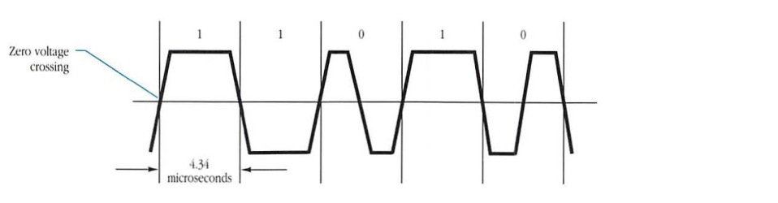
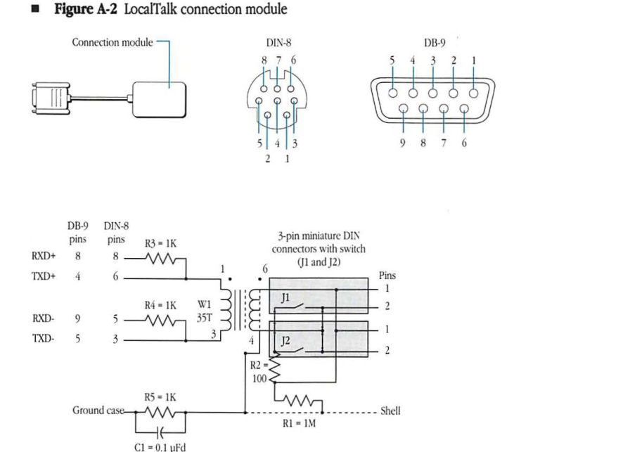
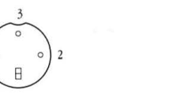
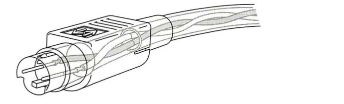
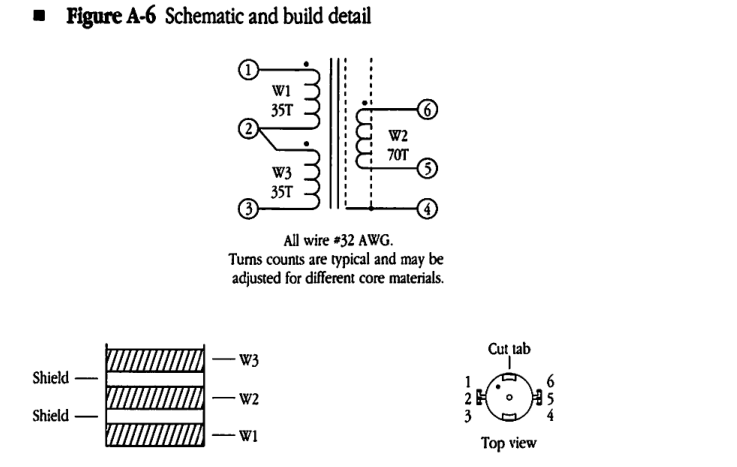

# LocalTalk Hardware Specifications

| Field | Value |
|-------|-------|
| **Source** | [Inside AppleTalk Second Edition (1990)](https://vintageapple.org/macbooks/pdf/Inside_AppleTalk_Second_Edition_1990.pdf) |
| **Part** | Part V - End-User Services |
| **Chapter** | A |
| **Pages** | 516–523 |
| **Converted** | 2026-04-05 |
| **Engine** | gemini-flash |

---

# Appendix A LocalTalk Hardware Specifications

### CONTENTS

**LocalTalk electrical characteristics / A-2**
Bit encoding and decoding / A-2
Signal transmission and reception / A-3
Carrier sense / A-3

**Electrical/mechanical specification / A-3**
Connection module / A-4
LocalTalk connector / A-5
Cable connection / A-5

**Transformer specifications A-5**
Environmental conditions / A-7
Mechanical strength and workmanship / A-8

---

# LocalTalk electrical characteristics

LocalTalk uses **Synchronous Data Link Control (SDLC)** frame format and a frequency modulation technique called FM-0. (**FM-0** is a bit-encoding technique that provides self-clocking.) Balanced signaling is achieved using the Electronics Industries Association (EIA) standard RS-422 hardware drivers and receivers in each of the attached devices. The transformer provides ground isolation as well as protection from static discharge. Since devices are passively connected to the trunk cable by means of a drop cable, an individual device may fail without disturbing communication along the rest of the data link's trunk cable. Devices can be added and removed from the link with only minor disruption of service.

The physical layer performs the following functions:

* bit encoding and decoding
* signal transmission and reception
* carrier sense

## Bit encoding and decoding

Bits are encoded using a self-clocking technique known as FM-0 (also called biphase space). In FM-0, each bit cell (nominally, 4.34 microseconds) contains a transition at each end that provides timing information known as one bit-time. Zeros are encoded by adding transition at midcell, as shown in *Figure A-1*.

### Figure A-1 FM-0 encoding

---

# Signal transmission and reception

The use of the EIA RS-422 signaling standard for transmission and reception over LocalTalk provides significantly higher data rates over longer distances than that of the EIA RS-232-C standard. LocalTalk uses differential, balanced voltage signaling at 230.4 Kbits per second over a maximum distance of 300 meters. The balanced configuration provides better isolation from ground noise currents and is not susceptible to fluctuating voltage potentials between system grounds or common-mode electromagnetic interference (EMI).

## Carrier sense

The physical layer provides an indication to the LocalTalk Link Access Protocol (LLAP) when activity is sensed on the cable. The following two indications are provided:

* SDLC frame in progress
* missing clock detected

In the preferred hardware implementation of LocalTalk, a **Zilog 8530 Serial Communications Controller (SCC)** is used. This semiconductor device provides both of the above carrier-sensing indications. The SCC chip provides a software-readable hunt bit that is set (equal to 1) while the hardware is searching for the start of the next SDLC frame. When this bit is cleared (equal to 0), the hardware is in the middle of an SDLC frame.

◆ Note: A frame cannot be detected until a complete flag has been transmitted on the line and recognized by the hardware. On the other hand, the synchronization pulse sent before frames and the resulting missing clock detected by receivers provide a more immediate indication of an ongoing transmission (see Chapter 1, "LocalTalk Link Access Protocol"). Missing clock indicates the detection and then the absence of a clocking signal on the line.

# Electrical/mechanical specification

The following sections provide a detailed electrical/mechanical specification of LocalTalk, as well as cable and connector characteristics (these specifications correspond to Apple document number 062-0190-B).

---

# Connection module

AppleTalk devices are connected to LocalTalk by a connection module that contains a transformer, a DB-9 or DIN-8 connector at the end of a 460-millimeter cable, and two 3-pin miniature DIN connectors, as shown in Figure A-2.

■ **Figure A-2** LocalTalk connection module

Each 3-pin connector has a coupled switch. If both connectors are used, the switches are open; if one of the connectors is not used, a 100-ohm termination resistor (R2) is connected across the line. The use of the connection module allows devices to be removed from the system by disconnecting them from the module without disturbing the operation of the bus. Resistors R3 and R4 increase the noise immunity of the receivers, while R5 and C1 isolate the frame grounds of devices and prevent ground-loop currents. The resistor (R1) provides static drain for the cable shield to ground.

---

## LocalTalk connector

The LocalTalk connector is a miniature 3-pin connector similar to the Hosiden connector (number TCP8030-01-010). The connector pin assignment is shown in Figure A-3.

* **Figure A-3** Connector pin assignment (looking into the connector)

## Cable connection

The interconnecting cable is wired one-to-one to the LocalTalk connector, as shown in Figure A-4.

* **Figure A-4** Interconnecting cable connection

## Transformer specifications

The transformer is used in the LocalTalk connection module to provide isolation between the LocalTalk cable and the devices that are connected to the cable.

The transformer is a 1:1 turns ratio transformer with tight coupling between primary and secondary and with electrostatic shielding to give excellent common node isolation, as shown in Figure A-5.

---

* **Figure A-6** Schematic and build detail

All wire #32 AWG.
Turns counts are typical and may be adjusted for different core materials.

## Environmental conditions

The transformer is designed to operate properly and to meet its specifications under the following environmental conditions:

| Condition | Range |
|---|---|
| operating temperature | 0° to 70° C |
| storage temperature | -40° to 70° C |
| relative humidity | 5 to 95% |
| altitude | 0 to 4572 meters |

The transformer must also meet the Apple Computer shock and vibration requirements while mounted on a printed circuit board and tested to Apple specification number 062-0086.

---

## Mechanical strength and workmanship

The transformer winding assembly, pins, mounting plate, core, and clamp must be securely mounted and rigid with respect to each other.

The pins must be easily solderable; solderability must meet the EIA RS-186-9E standard. All components must be free of undue mechanical stresses.

---
