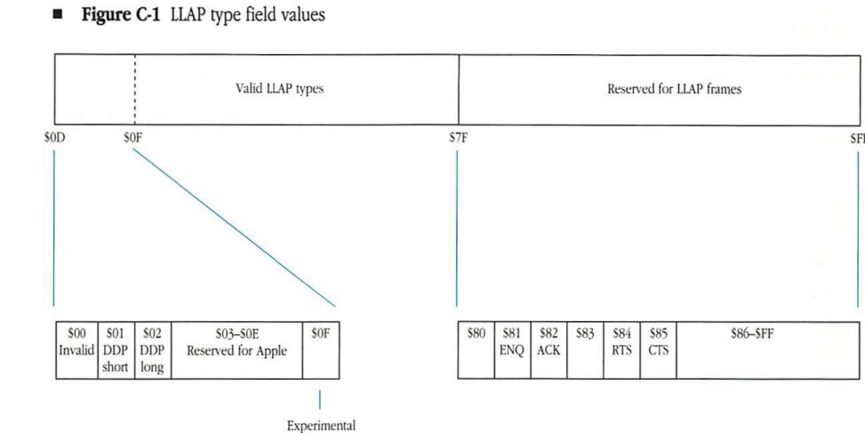
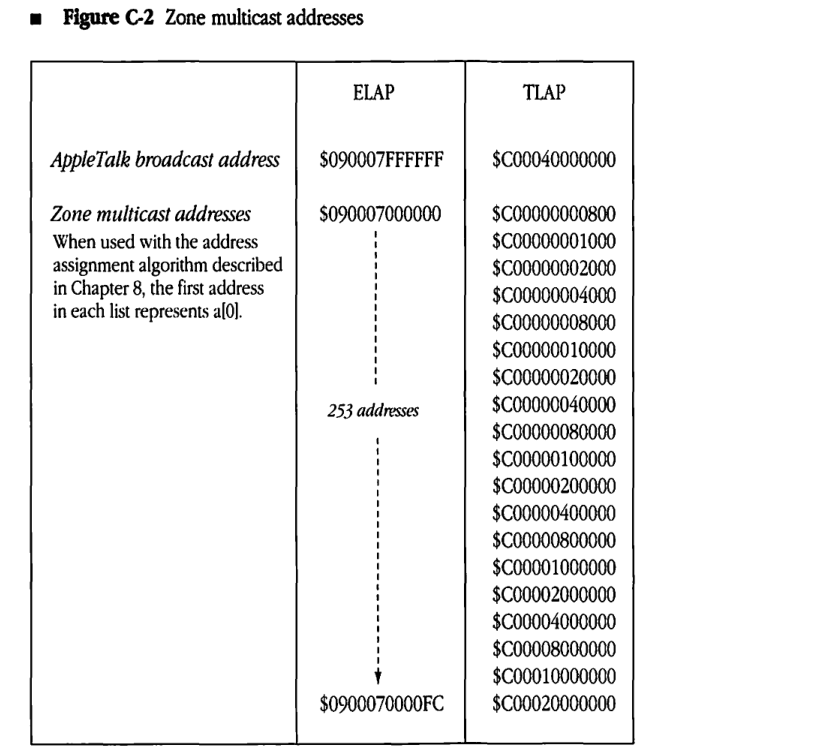
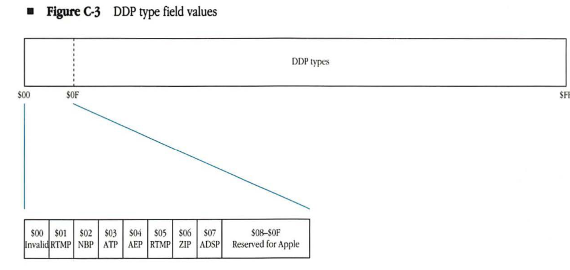
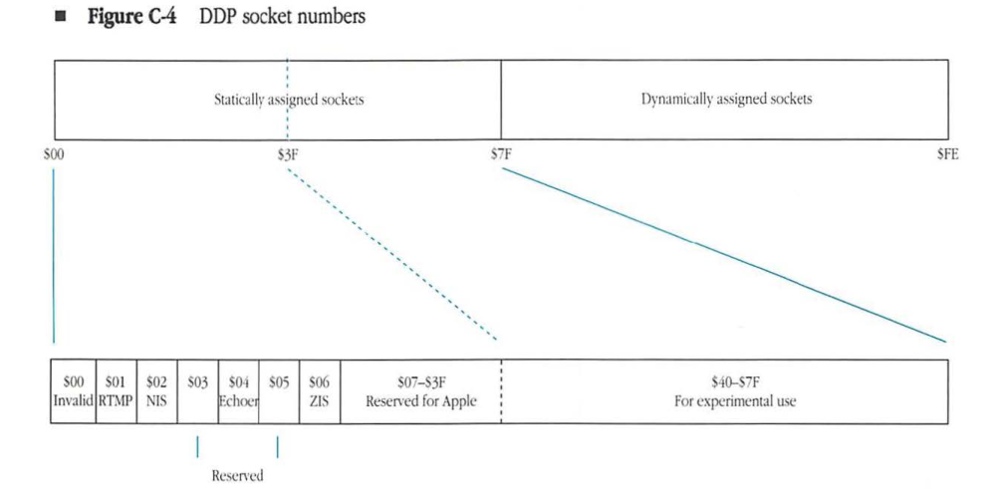

# AppleTalk Parameters

| Field | Value |
|-------|-------|
| **Source** | [Inside AppleTalk Second Edition (1990)](https://vintageapple.org/macbooks/pdf/Inside_AppleTalk_Second_Edition_1990.pdf) |
| **Part** | Part V - End-User Services |
| **Chapter** | C |
| **Pages** | 546–561 |
| **Converted** | 2026-04-05 |
| **Engine** | gemini-flash |

---

# Appendix C AppleTalk Parameters

### CONTENTS

- LLAP parameters / C-2
- AARP parameters / C-4
- EtherTalk and TokenTalk parameters / C-4
- DDP parameters / C-6
- RTMP parameters / C-8
- AEP parameters / C-9
- NBP parameters / C-9
- ZIP parameters / C-10
- ATP parameters / C-10
- PAP parameters / C-11
- ASP parameters / C-12
- ADSP parameters / C-13
- AFP parameters / C-13

---

This appendix summarizes various numerical quantities used in the AppleTalk protocols. This information is organized into subsections, one for each relevant protocol. A $ symbol is used to denote hexadecimal; a % symbol represents binary numbers. All other numerals are decimal.

## LLAP parameters

This section provides values for the LLAP type field, timing constants used by LLAP, and LLAP frame parameters.

| LLAP type field values | Description |
| :--- | :--- |
| $00 | invalid LLAP type value (do not use) |
| $01 through $7F | valid LLAP type values for use in LLAP client packets |
| &nbsp;&nbsp;&nbsp;&nbsp;$01 through $0F | reserved for Apple Computer's use only |
| &nbsp;&nbsp;&nbsp;&nbsp;&nbsp;&nbsp;&nbsp;&nbsp;$01 | DDP short-form header packet |
| &nbsp;&nbsp;&nbsp;&nbsp;&nbsp;&nbsp;&nbsp;&nbsp;$02 | DDP extended-form header packet |
| &nbsp;&nbsp;&nbsp;&nbsp;&nbsp;&nbsp;&nbsp;&nbsp;$0F | experimental LLAP packet (reserved for Apple Computer's use only) |
| $80 through $FF | reserved for LLAP control frames |
| &nbsp;&nbsp;&nbsp;&nbsp;$81 | lapENQ packet |
| &nbsp;&nbsp;&nbsp;&nbsp;$82 | lapACK packet |
| &nbsp;&nbsp;&nbsp;&nbsp;$84 | lapRTS packet |
| &nbsp;&nbsp;&nbsp;&nbsp;$85 | lapCTS packet |

---

### Figure C-1 LLAP type field values

| Value (Hex) | Bit offset | Width (bits) | Description |
|---|---|---|---|
| $00 | 0 | 8 | Invalid |
| $01 | 0 | 8 | DDP short |
| $02 | 0 | 8 | DDP long |
| $03–$0E | 0 | 8 | Reserved for Apple |
| $0F | 0 | 8 | Experimental |
| $10–$7F | 0 | 8 | Valid LLAP types |
| $81 | 0 | 8 | ENQ (Control frame) |
| $82 | 0 | 8 | ACK (Control frame) |
| $84 | 0 | 8 | RTS (Control frame) |
| $85 | 0 | 8 | CTS (Control frame) |
| $80, $83, $86–$FF | 0 | 8 | Reserved for LLAP frames |

| LLAP timing constant | Value |
|---|---|
| interframe gap (IFG) | less than 200 microseconds |
| interdialogue gap (IDG) | at least 400 microseconds |
| IDG slot time | 100 microseconds |

| LLAP frame parameter | Description |
|---|---|
| flag byte used for framing an LLAP packet | %01111110 |
| number of flag bytes needed at the start of a frame | 2 or more flag bytes |
| number of bits in abort sequence | 12–18 bits |
| maximum number of data bytes in LLAP packet (not including LLAP header, frame preamble, and frame trailer) | 600 bytes |

---

# AARP parameters

| AARP packet parameter | Description |
|---|---|
| SNAP protocol discriminator for AARP packets | $00000080F3 |
| broadcast destination address for AARP packets on Ethernet | $090007FFFFFF |
| broadcast destination address for AARP packets on token ring | $C00040000000 |

| AARP command | Value |
|---|---|
| AARP Request | 1 |
| AARP Response | 2 |
| AARP Probe | 3 |

# EtherTalk and TokenTalk parameters

| Packet parameter | Description |
|---|---|
| SNAP protocol discriminator for AppleTalk packets | $080007809B |
| broadcast destination address for AppleTalk packets on Ethernet | $090007FFFFFF (EtherTalk) |
| broadcast destination address for AppleTalk packets on token ring | $C00040000000 (TokenTalk) |

| AARP values as used for EtherTalk | Description |
|---|---|
| hardware type indicating Ethernet | 1 |
| hardware type indicating token ring | 2 |
| protocol type indicating AppleTalk | $809B |
| Ethernet hardware address length | 6 bytes |
| AppleTalk protocol address length | 4 bytes (high byte must be 0) |
| AARP probe retransmission interval | 1/5 of a second |
| AARP probe retry count | 10 |

---

### ■ Figure C-2 Zone multicast addresses

| | ELAP | TLAP |
|---|---|---|
| AppleTalk broadcast address | $090007FFFFFF | $C00040000000 |
| **Zone multicast addresses** When used with the address assignment algorithm described in Chapter 8, the first address in each list represents a[0]. | $090007000000 ⋮ *253 addresses* ⋮ $0900070000FC | $C00000000800 $C00000001000 $C00000002000 $C00000004000 $C00000008000 $C00000010000 $C00000020000 $C00000040000 $C00000080000 $C00000100000 $C00000200000 $C00000400000 $C00000800000 $C00001000000 $C00002000000 $C00004000000 $C00008000000 $C00010000000 $C00020000000 |

---

# DDP parameters

This section provides values for DDP packet parameters, protocol type fields, and socket numbers.

| DDP packet parameter | Description |
|---|---|
| LLAP type value for short-form header DDP packet | 1 |
| LLAP type value for extended-form header DDP packet | 2 |
| maximum number of data bytes in a DDP packet | 586 bytes |

| DDP type field value | Description |
|---|---|
| $00 | invalid DDP type value (do not use) |
| $01 through $FF | valid DDP type values for use in DDP client packets |
| &nbsp;&nbsp;&nbsp;&nbsp;$01 through $0F | reserved for Apple Computer's use only |
| &nbsp;&nbsp;&nbsp;&nbsp;&nbsp;&nbsp;&nbsp;&nbsp;$01 | RTMP Response or Data packet |
| &nbsp;&nbsp;&nbsp;&nbsp;&nbsp;&nbsp;&nbsp;&nbsp;$02 | NBP packet |
| &nbsp;&nbsp;&nbsp;&nbsp;&nbsp;&nbsp;&nbsp;&nbsp;$03 | ATP packet |
| &nbsp;&nbsp;&nbsp;&nbsp;&nbsp;&nbsp;&nbsp;&nbsp;$04 | AEP packet |
| &nbsp;&nbsp;&nbsp;&nbsp;&nbsp;&nbsp;&nbsp;&nbsp;$05 | RTMP Request packet |
| &nbsp;&nbsp;&nbsp;&nbsp;&nbsp;&nbsp;&nbsp;&nbsp;$06 | ZIP packet |
| &nbsp;&nbsp;&nbsp;&nbsp;&nbsp;&nbsp;&nbsp;&nbsp;$07 | ADSP packet |

---

### Figure C-3 DDP type field values

| Hex Value | Assigned Value/Meaning |
| :--- | :--- |
| $00 | Invalid |
| $01 | RTMP |
| $02 | NBP |
| $03 | ATP |
| $04 | AEP |
| $05 | RTMP |
| $06 | ZIP |
| $07 | ADSP |
| $08–$0F | Reserved for Apple |
| $10–$FF | DDP types |

| DDP socket value | Description |
| :--- | :--- |
| $00 | invalid (do not use) |
| $FF | invalid (do not use) |
| $01 through $FE | valid DDP sockets |
| &nbsp;&nbsp;$01 through $7F | statically assigned sockets |
| &nbsp;&nbsp;&nbsp;&nbsp;$01 through $3F | reserved for Apple Computer's use only |
| &nbsp;&nbsp;&nbsp;&nbsp;&nbsp;&nbsp;$01 | RTMP socket |
| &nbsp;&nbsp;&nbsp;&nbsp;&nbsp;&nbsp;$02 | names information socket (NIS) |
| &nbsp;&nbsp;&nbsp;&nbsp;&nbsp;&nbsp;$04 | Echoer socket |
| &nbsp;&nbsp;&nbsp;&nbsp;&nbsp;&nbsp;$06 | zone information socket (ZIS) |
| &nbsp;&nbsp;$40 through $7F | experimental use only (do not use in released products) |

---

### Figure C-4 DDP socket numbers

# RTMP parameters

| RTMP packet parameter | Description |
| :--- | :--- |
| DDP type value for RTMP Response and Data packets | 1 |
| DDP type value for RTMP Request packets | 5 |
| RTMP Request packet function field value | 1 |
| RTMP Route Data Request packet function value | 2 (split horizon processed) 3 (no split horizon processing) |

| RTMP timer value | Description |
| :--- | :--- |
| send-RTMP timer | 10 seconds |
| validity timer | 20 seconds |
| timer for aging A-ROUTER in a nonrouter node | 50 seconds |

| Miscellaneous value | Description |
| :--- | :--- |
| RTMP listening socket | socket 1 |
| maximum number of hops supported | 16 hops |

---

# AEP parameters

| AEP socket parameter | Number |
|---|---|
| AEP socket | socket 4 |

| AEP packet parameter | Description |
|---|---|
| DDP type value for AEP packets | 4 |
| Echo function values | 1 = Echo Request 2 = Echo Reply |
| maximum data size | 585 bytes |

# NBP parameters

| NBP socket parameter | Description |
|---|---|
| names information socket (NIS) | socket 2 |
| maximum number of characters in object, type, or zone fields | 32 characters |

| Wildcard symbol | Description |
|---|---|
| * | used only in the zone field of an entity name to mean the zone of the packet's sender |
| = | used as the object and/or type field of an entity name to mean all objects and/or all types (cannot be used as the zone field) |
| ≈ | characters within object and/or type field used to match zero or more characters. Maximum of one per field. |

| NBP packet parameter | Description |
|---|---|
| DDP type value for NBP packets | 2 |
| NBP control field value | 1 = BrRq 2 = LkUp 3 = LkUp-Reply 4 = FwdReq |

---

# ZIP parameters

| ZIP socket parameter | Number |
|---|---|
| zone information socket | socket 6 |

| ZIP function | Value |
|---|---|
| ZIP Query | 1 |
| ZIP Reply | 2 |
| ZIP GetNetInfo | 5 |
| ZIP GetNetInfoReply | 6 |
| ZIP Extended Reply | 8 |
| ZIP Notify | 7 |
| ZIP GetMyZone | 7 (in ATP user bytes) |
| ZIP GetZoneList | 8 (in ATP user bytes) |
| ZIP GetLocalZones | 9 (in ATP user bytes) |

| ZIP timer value | Description |
|---|---|
| Query retransmission time | 10 seconds |
| ZIP bringback time | 10 minutes |

---

# ATP parameters

| ATP packet parameter | Description |
|---|---|
| DDP type value for ATP packets | 3 |
| function code values | %01 = TReq %10 = TResp %11 = TRel |
| maximum size of data in ATP packet | 578 bytes |

| ATP TRel timer indicator | Value |
|---|---|
| 000 | 30 seconds |
| 001 | 1 minute |
| 100 | 8 minutes |

---

# PAP parameters

| PAP type | Value |
|---|---|
| OpenConn | 1 |
| OpenConnReply | 2 |
| SendData | 3 |
| Data | 4 |
| Tickle | 5 |
| CloseConn | 6 |
| CloseConnReply | 7 |
| SendStatus | 8 |
| StatusReply | 9 |

| PAP packet parameter | Description |
|---|---|
| maximum data size | 512 bytes |
| maximum length of status string | 255 bytes (not including the length byte) |

| PAP timer value | Description |
|---|---|
| OpenConn request ATP retry timer | 2 seconds |
| tickle timer | 60 seconds |
| connection timer | 2 minutes |
| SendData request retry timer | 15 seconds |

| PAP retry count value | Description |
|---|---|
| OpenConn request retry count | 5 |

| PAP result code | Description |
|---|---|
| PrinterBusy | $FFFF |

---

# ASP parameters

| SPFunction | Value |
|---|---|
| CloseSession | 1 |
| Command | 2 |
| GetStatus | 3 |
| OpenSess | 4 |
| Tickle | 5 |
| Write | 6 |
| WriteContinue | 7 |
| Attention | 8 |

| ASP timer value | Description |
|---|---|
| tickle timer | 30 seconds |
| session maintenance timer | 2 minutes |

| Decimal value | Hex value | SPError |
|---|---|---|
| 0 | ($00) | NoError* |
| -1066 | $FBD6 | BadVersNum† |
| -1067 | $FBD5 | BufTooSmall† |
| -1068 | $FBD4 | NoMoreSessions* |
| -1069 | $FBD3 | NoServers† |
| -1070 | $FBD2 | ParamErr* |
| -1071 | $FBD1 | ServerBusy† |
| -1072 | $FBD0 | SessClosed* |
| -1073 | $FBCF | SizeErr* |
| -1074 | $FBCE | TooManyClients‡ |
| -1075 | $FBCD | NoAck‡ |

* This error can be returned on both workstation and server ends.
† This error can be returned on the workstation end only.
‡ This error can be returned on the server end only.

The ASP version number described in Chapter 11, "AppleTalk Session Protocol," is version $0100.

---

The values -1060 to 1065 are reserved for implementation-dependent errors. All other values are invalid in this field. The following error codes are the only ones actually transmitted through ATP (on the OpenSession call): NoError, BadVersNum, and ServerBusy.

# ADSP parameters

| ADSP control code | Value |
|---|---|
| Probe or Acknowledgment | 0 |
| Open Connection Request | 1 |
| Open Connection Acknowledgment | 2 |
| Open Connection Request and Acknowledgment | 3 |
| Open Connection Denial | 4 |
| Close Connection Advice | 5 |
| Forward Reset | 6 |
| Forward Reset Acknowledgment | 7 |
| Retransmit Advice | 8 |

| ADSP packet parameter | Description |
|---|---|
| DDP type value for ZIP packets | 7 |
| maximum data size | 572 bytes |

# AFP parameters

Each function code is a 16-bit integer sent in the packet high-byte first.

| Decimal value | Hex value | AFP function |
|---|---|---|
| 1 | $01 | ByteRangeLock |
| 2 | $02 | CloseVol |
| 3 | $03 | CloseDir |
| 4 | $04 | CloseFork |

(continued) ➡

---

| Decimal value | Hex value | AFP function (continued) |
| :--- | :--- | :--- |
| 5 | $05 | CopyFile |
| 6 | $06 | CreateDir |
| 7 | $07 | CreateFile |
| 8 | $08 | Delete |
| 9 | $09 | Enumerate |
| 10 | $0A | Flush |
| 11 | $0B | FlushFork |
| 14 | $0E | GetForkParms |
| 15 | $0F | GetSrvrInfo |
| 16 | $10 | GetSrvrParms |
| 17 | $11 | GetVolParms |
| 18 | $12 | Login |
| 19 | $13 | LoginCont |
| 20 | $14 | Logout |
| 21 | $15 | MapID |
| 22 | $16 | MapName |
| 23 | $17 | MoveAndRename |
| 24 | $18 | OpenVol |
| 25 | $19 | OpenDir |
| 26 | $1A | OpenFork |
| 27 | $1B | Read |
| 28 | $1C | Rename |
| 29 | $1D | SetDirParms |
| 30 | $1E | SetFileParms |
| 31 | $1F | SetForkParms |
| 32 | $20 | SetVolParms |
| 33 | $21 | Write |
| 34 | $22 | GetFileDirParms |
| 35 | $23 | SetFileDirParms |
| 36 | $24 | ChangePassword |
| 37 | $25 | GetUserInfo |
| 48 | $30 | OpenDT |
| 49 | $31 | CloseDT |
| 51 | $33 | GetIcon |
| 52 | $34 | GetIconInfo |
| 53 | $35 | AddAPPL |

---

| Decimal value | Hex value | AFP function (continued) |
|---|---|---|
| 54 | $36 | RmvAPPL |
| 55 | $37 | GetAPPL |
| 56 | $38 | AddComment |
| 57 | $39 | RmvComment |
| 58 | $3A | GetComment |
| 192 | $C0 | AddIcon |

Each call returns a result code, which is a 4-byte integer.

| Decimal value | Hex value | FPError |
|---|---|---|
| 0 | $0 | NoErr |
| -5000 | $FFFFEC78 | AccessDenied |
| -5001 | $FFFFEC77 | AuthContinue |
| -5002 | $FFFFEC76 | BadUAM |
| -5003 | $FFFFEC75 | BadVersNum |
| -5004 | $FFFFEC74 | BitmapErr |
| -5005 | $FFFFEC73 | CantMove |
| -5006 | $FFFFEC72 | DenyConflict |
| -5007 | $FFFFEC71 | DirNotEmpty |
| -5008 | $FFFFEC70 | DiskFull |
| -5009 | $FFFFEC6F | EOFErr |
| -5010 | $FFFFEC6E | FileBusy |
| -5011 | $FFFFEC6D | FlatVol |
| -5012 | $FFFFEC6C | ItemNotFound |
| -5013 | $FFFFEC6B | LockErr |
| -5014 | $FFFFEC6A | MiscErr |
| -5015 | $FFFFEC69 | NoMoreLocks |
| -5016 | $FFFFEC68 | NoServer |
| -5017 | $FFFFEC67 | ObjectExists |
| -5018 | $FFFFEC66 | ObjectNotFound |
| -5019 | $FFFFEC65 | ParamErr |
| -5020 | $FFFFEC64 | RangeNotLocked |
| -5021 | $FFFFEC63 | RangeOverlap |
| -5022 | $FFFFEC62 | SessClosed |
| -5023 | $FFFFEC61 | UserNotAuth |

---

| Decimal value | Hex value | FPError (continued) |
|---|---|---|
| -5024 | $FFFFEC60 | CallNotSupported |
| -5025 | $FFFFEC5F | ObjectTypeErr |
| -5026 | $FFFFEC5E | TooManyFilesOpen |
| -5027 | $FFFFEC5D | ServerGoingDown |
| -5028 | $FFFFEC5C | CantRename |
| -5029 | $FFFFEC5B | DirNotFound |
| -5030 | $FFFFEC5A | IconTypeError |
| -5031 | $FFFFEC59 | VolLocked |
| -5032 | $FFFFEC58 | ObjectLocked |

---
