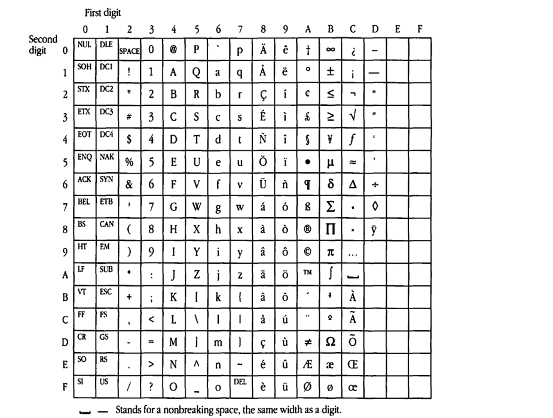
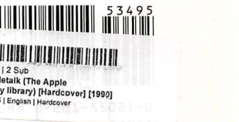

# Character Codes

| Field | Value |
|-------|-------|
| **Source** | [Inside AppleTalk Second Edition (1990)](https://vintageapple.org/macbooks/pdf/Inside_AppleTalk_Second_Edition_1990.pdf) |
| **Part** | Part V - End-User Services |
| **Chapter** | D |
| **Pages** | 562–597 |
| **Converted** | 2026-04-05 |
| **Engine** | gemini-flash |

---

# Appendix D Character Codes

---

Several AppleTalk protocols utilize character string entity names, which can be composed of any 8-bit characters. Their representations are exactly the same as those used by the Macintosh and are shown in *Table D-1* below.

### ■ Table D-1 Character set mapping used in AppleTalk

| Second digit | 0 | 1 | 2 | 3 | 4 | 5 | 6 | 7 | 8 | 9 | A | B | C | D | E | F |
| :--- | :--- | :--- | :--- | :--- | :--- | :--- | :--- | :--- | :--- | :--- | :--- | :--- | :--- | :--- | :--- | :--- |
| **0** | NUL | DLE | SPACE | 0 | @ | P | ` | p | Ä | ê | † | ∞ | ¿ | — | | |
| **1** | SOH | DC1 | ! | 1 | A | Q | a | q | Å | ë | ° | ± | ¡ | – | | |
| **2** | STX | DC2 | " | 2 | B | R | b | r | Ç | í | ¢ | ≤ | ¬ | “ | | |
| **3** | ETX | DC3 | # | 3 | C | S | c | s | É | ì | £ | ≥ | √ | ” | | |
| **4** | EOT | DC4 | $ | 4 | D | T | d | t | Ñ | î | § | ¥ | ƒ | ‘ | | |
| **5** | ENQ | NAK | % | 5 | E | U | e | u | Ö | ï | • | µ | ≈ | ’ | | |
| **6** | ACK | SYN | & | 6 | F | V | f | v | Ü | ñ | ¶ | ∂ | Δ | ÷ | | |
| **7** | BEL | ETB | ' | 7 | G | W | g | w | á | ó | ß | Σ | « | ◊ | | |
| **8** | BS | CAN | ( | 8 | H | X | h | x | à | ò | ® | Π | » | ÿ | | |
| **9** | HT | EM | ) | 9 | I | Y | i | y | â | ô | © | π | ... | | | |
| **A** | LF | SUB | * | : | J | Z | j | z | ä | ö | ™ | ∫ | — | | | |
| **B** | VT | ESC | + | ; | K | [ | k | { | ã | õ | ´ | ª | À | | | |
| **C** | FF | FS | , | < | L | \ | l | \| | å | ú | ¨ | º | Ã | | | |
| **D** | CR | GS | - | = | M | ] | m | } | ç | ù | ≠ | Ω | Õ | | | |
| **E** | SO | RS | . | > | N | ^ | n | ~ | é | û | Æ | æ | Œ | | | |
| **F** | SI | US | / | ? | O | _ | o | DEL | è | ü | Ø | ø | œ | | | |

— Stands for a nonbreaking space, the same width as a digit.

---

An implementation of the AppleTalk protocols such as NBP and ZIP that use character string names must often perform string comparison. Throughout AppleTalk, this comparison is done in a case-insensitive manner (that is, K = k), and it must also be done in a diacritical-sensitive manner (that is, e ≠ é ≠ è). The mapping in Table D-2 shows the rules for uppercase equivalence of characters in AppleTalk. For example, lowercase ç matches uppercase Ç in a string comparison. Any character that does not appear in this table has no uppercase equivalent in AppleTalk and therefore can only match itself. Note that this mapping does not exactly conform to the standards used in all human languages. In certain languages, the uppercase equivalent of é is E; in other languages (and in AppleTalk), it is É.

### ■ Table D-2 Lowercase-to-uppercase mapping in AppleTalk

| Lowercase Value | Lowercase Character | Uppercase equivalent Value | Uppercase equivalent Character |
| :--- | :--- | :--- | :--- |
| $61 | a | $41 | A |
| $62 | b | $42 | B |
| ⋮ | ⋮ | ⋮ | ⋮ |
| $7A | z | $5A | Z |
| $88 | à | $CB | À |
| $8A | ä | $80 | Ä |
| $8B | ã | $CC | Ã |
| $8C | å | $81 | Å |
| $8D | ç | $82 | Ç |
| $8E | é | $83 | É |
| $96 | ñ | $84 | Ñ |
| $9A | ö | $85 | Ö |
| $9B | õ | $CD | Õ |
| $9F | ü | $86 | Ü |
| $BE | æ | $AE | Æ |
| $BF | ø | $AF | Ø |
| $CF | œ | $CE | Œ |

---

# Glossary

**AARP**: see AppleTalk Address Resolution Protocol.

**abort sequence**: 12-18 1's (one bits) at the end of an LLAP frame.

**access modes**: a set of permissions used by AFP to regulate access to a file; AFP supports four access modes: read, write, read-write, and none.

**access privileges**: the privileges given to or withheld from users to open and make changes to a directory and its contents. Through the setting of access privileges, you control access to the information that is stored on a file server.

**Acknowledge control packet**: an LLAP packet sent in response to an Enquiry control packet, indicating that the requested LLAP node number is already in use.

**Address Mapping Table (AMT)**: a collection of protocol-to-hardware address mappings for each protocol stack that a node supports. The AMT is updated by AARP to ensure that current addressing information is available.

**address resolution**: the translation of node addresses between different node-numbering schemes.

**ADSP**: see AppleTalk Data Stream Protocol.

**AEP**: see AppleTalk Echo Protocol.

**AFI**: see AppleTalk Filing Interface.

**AFP**: see AppleTalk Filing Protocol.

**AFP-file-system-visible entity**: a network-visible entity accessible through the AFI.

**AFP translator**: workstation software that translates native file system commands to AFP calls; the AFP translator obtains the commands from the NFI and translates them to the AFI for transmission over the network to a file server.

**ALO transaction**: see at-least-once transaction.

**AMT**: see Address Mapping Table.

**ancestor**: a directory that is along the path to a destination CNode (file or directory), known as the descendent.

**AppleTalk Address Resolution Protocol (AARP)**: the protocol that reconciles addressing discrepancies in networks that support more than one set of protocols. For example, by resolving the differences between an Ethernet addressing scheme and the AppleTalk addressing scheme, AARP facilitates the transport of DDP packets over a high-speed EtherTalk connection.

**AppleTalk Data Stream Protocol (ADSP)**: a connection-oriented protocol that provides a reliable, full-duplex, byte-stream service between any two sockets in an AppleTalk internet. ADSP ensures in-sequence, duplicate-free delivery of data over its connections.

**AppleTalk Echo Protocol (AEP)**: a simple protocol that allows a node to send a packet to any

---

other node in an AppleTalk internet and to receive an echoed copy of that packet in return.

**AppleTalk Filing Interface (AFI):** the interface to an AFP file server through which workstations can gain access to server volumes, files, directories, and forks.

**AppleTalk Filing Protocol (AFP):** the presentation-layer protocol that allows users to share data files and application programs that reside in a shared resource, known as a file server.

**AppleTalk Session Protocol (ASP):** a general-purpose protocol that uses the services of ATP to provide session establishment, maintenance, and teardown, along with request sequencing.

**AppleTalk Transaction Protocol (ATP):** a transport protocol that provides a loss-free transaction service between sockets. This service allows exchanges between two socket clients in which one client requests the other to perform a particular task and to report the results; ATP binds the request and response together to ensure the reliable exchange of request-response pairs.

**ASP:** see AppleTalk Session Protocol.

**at-least-once (ALO) transaction:** an ATP transaction in which the request is repeated until a response is received by the requester or until a maximum retry count is reached. This recovery mechanism ensures that the transaction request is executed at least one time.

**ATP:** see AppleTalk Transaction Protocol.

**backbone network:** a central network to which a number of other smaller, usually lower-speed, networks connect; the backbone (or spine) network is usually constructed with a high-speed communication medium.

**backbone router:** one in a series of internet routers that are used to interconnect several AppleTalk networks through a backbone network.

**background spooler:** a print-spooling process that runs in the background on an originating computer.

**bitmap order:** when data is packed in bitmap order, the parameter corresponding to the least-significant set bit in the bitmap is packed first, followed by the parameter corresponding to the next most-significant set bit; packing continues in this manner, and the packet ends with the parameter corresponding to the most-significant set bit.

**bit stuffing:** a technique used to ensure that the unique bit pattern used to designate a flag byte (01111110) does not occur within the data packet. When bit stuffing is used, the link-level protocol (such as LLAP) inserts a 0 bit after every string of five consecutive 1 bits detected in the data stream being transmitted (the receiving LAP performs the inverse operation, stripping out each 0 bit that follows five consecutive 1 bits, in order to restore the data to its original state).

**broadcast hardware address (broadcast ID):** a hardware address common to all nodes on a data link; packets sent to this address will be delivered to every node on the data link. Broadcast hardware addresses facilitate broadcast transmissions.

**broadcasting:** delivery of a transmission to all active stations at the same time, such as over a bus-type local network.

**broadcast packet:** a packet intended to be received by all nodes in a network. In a LocalTalk implementation, broadcast packets are assigned a destination node identification number of 255 ($FF).

---

**broadcast protocol address**: an address that is accepted by all nodes that support a particular protocol stack; the broadcast protocol address facilitates the directed broadcast of packets to this subset of nodes.

**broadcast transmission dialog**: in a LocalTalk environment, the transmission of packets intended to be received by all nodes in the network. The source sends a lapRTS packet to the broadcast hardware address and then sends the data packet.

**bus**: a single, shared communication link. Messages are broadcast along the whole bus, and each network device listens for and receives messages directed to its unique address. The physical medium of a LocalTalk network is a twisted-pair bus.

**Carrier Sense Multiple Access with Collision Avoidance (CSMA/CA)**: a technique that allows multiple stations to gain access to a transmission medium (multiple access) by listening until no signals are detected (carrier sense), and then signaling their intent to transmit before transmitting. When contention occurs, transmission is based on a randomly selected order (collision avoidance). LLAP, used for node-to-node delivery in a LocalTalk environment, uses the CSMA/CA technique.

**catalog node (CNode)**: an entry (either a directory or a file) in a volume catalog of a disk. AFP recognizes two types of CNodes: internal CNodes, which are always directories, and leaf CNodes, which are located at the end of a limb in the tree-structured catalog and which can be either files or empty directories.

**CCITT**: see Consultative Committee on International Telephone & Telegraph.

**clear-to-send (CTS) control packet**: an LLAP packet sent in response to an RTS control packet, indicating the sending node's receipt of the RTS and its readiness to receive the data packet.

**client**: a software process that makes use of the services of another software process. See socket client.

**closed connection**: a connection that has been torn down. In a closed connection, neither end of the connection is established, so data transmission over the connection is no longer possible.

**CNode**: see catalog node.

**connection**: an association between two sockets that facilitates the establishment and maintenance of an exclusive dialog between two entities. See session.

**connection end**: in a connection, the communicating socket and the connection information associated with it.

**connection identifier (ConnID)**: an identification number associated with each connection; a connection provides a unique identifier by using the socket address and the ConnID of the two connection ends.

**connection-listening socket**: a socket that accepts open-connection requests and passes them along to its ADSP client for further processing.

**connection state**: the term used to refer collectively to control and state information that is maintained by the two ends of a connection.

**connection timer**: a timer that is started when a connection opens. When an end receives a packet from the other end, the timer is reset; the timer

---

expires if the end does not receive any packets within a specified time period (if no data is being transmitted, tickling packets can be sent to keep the connection open). Connection timers are used by the AppleTalk session-layer protocols, such as PAP, ASP, and ADSP.

**ConnID**: see connection identifier.

**Consultative Committee on International Telephone & Telegraph (CCITT)**: a committee formed in 1938 that sets the international standards for the hardware and communications protocols for data and voice transmissions.

**control information (CI)**: the field in an ATP packet indicating the packet type and various control information, such as the end-of-message flag.

**control packets**: messages that do not contain data, but that are used for administrative purposes, such as enquiry, acknowledgment, and notification; control packets are also used to open and close connections.

**CRC**: see cyclic-redundancy check.

**CSMA/CA**: see Carrier Sense Multiple Access with Collision Avoidance.

**CTS**: see clear-to-send control packet.

**cyclic-redundancy check (CRC)**: an error-checking control technique that uses a polynomial algorithm to generate a 16-bit FCS based on the content of the frame. The FCS is appended to the end of each frame and is matched by the receiver to determine whether an error has occurred. LLAP uses the standard CRC-CCITT algorithm: G(x) = x^16 + x^{12} + x^5 + 1.

**DAS**: see dynamically assigned socket.

**datagram**: a self-contained packet, independent of other packets in a data stream. Since a datagram carries its own routing information, its reliable delivery does not depend on earlier exchanges between the source and destination devices. DDP is responsible for delivering AppleTalk transmissions as datagrams.

**Datagram Delivery Protocol (DDP)**: the network-layer protocol that is responsible for the socket-to-socket delivery of datagrams over an AppleTalk internet.

**data packets**: messages that contain client data.

**data transparency**: a technique of data transmission that allows data characters to be sent or received in any form, without regard to their possible interpretation as control characters. For example, to ensure that data containing six consecutive 1 bits is not interpreted as a flag byte, LLAP uses a data transparency mechanism known as bit stuffing. See bit stuffing.

**DDP**: see Datagram Delivery Protocol.

**default zone**: the zone to which any node on an extended network will automatically belong until a different zone is explicitly selected for that node.

**deny modes**: a set of AFP permissions that establishes what rights should be denied to users attempting to open a file fork that has already been opened by another user.

**DES**: data encryption standard published by the National Bureau of Standards (FIPS publication #46).

**descendent**: a destination CNode (an entry in a volume catalog of a disk); the directories along the path to the descendent are considered its ancestors.

**Desktop database**: a database used by a file server to hold information for use by the Macintosh Finder.

---

**Desktop file:** an invisible resource file that holds information for use by the Macintosh Finder.

**directed broadcast:** the transmission of a packet that is intended to be received by all nodes on a network other than the sender's network.

**directed packet:** a packet intended to be received by a single node.

**directed transmission dialog:** in a LocalTalk environment, the transmission of packets intended to be received by a single node. The source sends a lapRTS packet to the destination; the destination responds with a lapCTS packet; then the source sends the data packet.

**directory:** a construct for organizing information stored on a disk; disk directories can contain files and other directories. Each directory for a disk volume has an identifier, through which it and the files and other directories that it contains can be addressed. Sometimes called "folder."

**Directory ID:** a unique value that is assigned to each directory when it is created.

**duplicate transaction-request filtering:** an ATP process used to implement XO transaction service; in this process, the responder searches through a transactions list to determine whether the request has already been received. Duplicates are not delivered to ATP's client.

**dynamically assigned socket (DAS):** a socket assigned dynamically by DDP upon request from clients in the node. In an AppleTalk network, the sockets numbered 128–254 ($80–$FE) are allocated as DASs.

**dynamic node address assignment:** an addressing scheme that assigns node addresses dynamically, rather than associating a permanent address with each node. Dynamic node address assignment facilitates adding and removing nodes from the network by preventing conflicts between old node addresses and new node addresses.

**ELAP:** see EtherTalk Link Access Protocol.

**end of message (EOM):** a signal that indicates the end of a message. When the EOM bit is set in the header of a packet, it indicates that this packet is the last in a multipacket message, such as a multipacket ATP response or an ADSP data stream.

**Enquiry control packet:** an LLAP packet sent as part of the dynamic node number assignment algorithm, asking if any node on the link is currently using the specified LLAP node number.

**entity identifier:** the unique address of a network-visible entity's socket in a node within an internet. The specific format of an entity identifier is network-dependent.

**entity name:** a name that an NVE may assign itself. Although not all NVEs have names, NVEs can possess several names (or aliases). An entity name is made up of three character strings: object, type, and zone.

**entity type:** the part of an entity name that describes to what class the entity belongs; for example, "LaserWriter" or "AFPServer."

**entry state:** a variable associated with each entry in a routing table; three possible values for this variable are good, suspect, and bad.

**enumerate:** to list the offspring (files and directories) of a directory and selected parameters for those offspring.

---

**enumerator value:** a number used to distinguish among several entity names that are registered on the same socket. On a given socket, each entity name will have a unique enumerator value.

**EOM:** see end of message.

**EtherTalk:** Apple's data-link product that allows an AppleTalk network to be connected by Ethernet cables.

**EtherTalk Link Access Protocol (ELAP):** the link-access protocol used in an EtherTalk network. ELAP is built on top of the standard Ethernet data-link layer.

**exactly-once (XO) transaction:** an ATP transaction in which the request is delivered only one time, thus protecting against damage that could result from a duplicate transaction.

**extended AppleTalk network:** an AppleTalk network that allows addressing of more than 254 nodes and can support multiple zones.

**extended DDP header:** the DDP header type used for packets that are transmitted from one network to another network within an AppleTalk internet.

**FCS:** see frame check sequence.

**file:** a collection of related information that is stored on a disk. A file on a disk has a name through which it is accessible. Related files may be grouped together in a common directory. In the Macintosh file system and the AFI, a file is divided into two forks: a data fork and a resource fork.

**file server:** a computer running a specialized program that provides network users with access to shared disks or other mass storage devices. Through the implementation of access controls, a file server facilitates controlled access to common files and applications.

**Finder:** a Macintosh application that allows access to documents and other applications; the Finder uses icons to represent objects on a disk or volume. You use it to manage documents and applications and to get information to and from disks.

**flag byte:** a special bit pattern that is used in bit-oriented protocols to mark the beginning (and often the end) of a frame. The flag byte used as a frame delimiter in LLAP is the bit sequence 01111110 ($7E).

**flow quantum:** the maximum amount of data that can be transferred in a PAP transaction based on the buffer space available at the end that is issuing the read request.

**flush:** to write data from a cache in memory to a disk.

**FM-0:** a bit-encoding technique that provides self-clocking. LocalTalk implementations use FM-0 encoding.

**folder:** see directory.

**fork:** Macintosh files are divided into two parts, known as forks; the data fork is an unstructured finite sequence of data bytes. The resource fork is the part of a file that is accessible through the Macintosh Resource Manager and that contains specialized data used by an application, such as menus, fonts, and icons (as well as the application code for an application file).

**frame:** a group of bits forming a distinct transmission unit that is sent between data-link-layer entities. Each frame contains its own control information for addressing and error checking. The first several bits in a frame form a header that contains address and other control information, followed by the data (or message) being sent, and ending with a check sequence for error detection.

---

**frame check sequence (FCS):** a 16-bit sequence used for error checking that occurs at the end of each frame. In a LocalTalk implementation, the standard CRC-CCITT algorithm is used to compute the FCS. It is computed as a function of the contents of the destination node ID, source node ID, LLAP type, and data fields.

**frame preamble:** the part of an LLAP frame preceding the LLAP packet; specifically, 2 or more flag bytes.

**frame trailer:** the part of an LLAP frame following the LLAP packet; specifically, the FCS, trailing flag byte, and an abort sequence.

**gateways:** nodes that separate and manage communication between different types of networks; for example, a gateway is used to connect an AppleTalk protocol-based network to a non-AppleTalk protocol-based system. The gateway serves as a translator between the protocols of the two connected networks.

**global backoff mask:** a mask used by LLAP that takes on particular values to adjust the amount of time a node waits before transmitting in order to avoid collisions. The possible values in binary are: 0, 01, 011, 0111, 01111.

**guest:** a user who is logged on to a file server without a registered user name and password. A guest cannot own a directory. Guests receive whatever access privileges are assigned to "world."

**half-open connection:** a connection in which one end is established and the other end is closed, unreachable, or not yet open.

**half router:** an internet router used primarily to connect two remote AppleTalk networks. Each remote network contains an internet router that interconnects to the router attached to the other network through a long-distance communication link. This combination of two half-routers serves, in effect, as a single routing unit.

**hardware address:** the unique node address that is determined by the physical and data-link layers of the network.

**header:** the portion of a message, usually at the beginning of a packet, that contains control information, such as the source and destination addresses, packet-type identifiers, sequence numbers, and priority-level indicators.

**HFS:** see hierarchical file system.

**hierarchical file system (HFS):** the file system used on Macintosh hard disks and 800K floppy disks.

**history bytes:** two 8-bit bytes that are maintained by LLAP and that contain the number of times a node has deferred and the number of times it has sensed a collision in the last eight attempts to gain access to the link. These history bytes are used to determine the value of the random wait period.

**hop count:** the number of internet routers that a datagram passes through en route to its destination; each internet router is counted as 1 hop.

**IDG:** see interdialogue gap.

**IEEE 802.2:** The Institute of Electrical and Electronics Engineers standard defining service interfaces and packet formats for data-link service.

**IFG:** see interframe gap.

**interdialogue gap (IDG):** the minimum separation time between dialogues; for LLAP, 400 microseconds.

**interframe gap (IFG):** the maximum separation time between frames of a single dialogue; for LLAP, 200 microseconds.

---

**International Standards Organization-Open System Interconnection (ISO-OSI) reference model**: a seven-layer network architecture reference model established by the ISO and adhered to by the CCITT. The OSI model is intended to provide a common basis for coordinating the development of standards aimed at systems interconnection, while allowing existing standards to be placed in perspective within a common framework. The model represents a network as a hierarchical structure of layers of function; it segments the data communication concept into seven layers and defines the functionality of each layer. Each layer provides a set of functions accessible to the layer above it. In the "open" philosophy, the services provided by one layer to another are strictly defined, but the manner used to provide the services is left open to interpretation.

**internet**: one or more AppleTalk networks connected by intelligent nodes referred to as internet routers.

**internet router (IR)**: an intelligent node that connects AppleTalk networks and serves as the key component in extending the datagram delivery mechanism to an internet setting. An IR functions as a packet-forwarding agent to allow datagrams to be sent between any two nodes of an internet by using a store-and-forward process. AppleTalk internet routers fall into three categories: local routers, half routers, and backbone routers.

**internet socket address**: the address of a socket in an AppleTalk internet. This address is made up of the socket number and the node ID and network number of the node in which the socket is located; the internet address provides a unique identifier for any socket in an AppleTalk internet.

**IR**: see internet router.

**ISO-OSI reference model**: see International Standards Organization-Open System Interconnection reference model.

**LAP**: see Link Access Protocol.

**link**: any data transmission medium shared by a set of nodes and used for communication among these nodes.

**Link Access Protocol (LAP)**: a link-level protocol that is responsible for the transmission of data across the physical link and ensures data integrity on this link. Sometimes called "data-link access protocol." The LocalTalk Link Access Protocol (LLAP) is the LAP protocol used in a LocalTalk environment.

**LLAP**: see LocalTalk Link Access Protocol.

**LLAP type field**: a 1-byte LLAP field that indicates packet type. Values in the range 1-127 ($01-$7F) indicate that the packet is a data packet; the type field specifies the LLAP type of the client to whom the packet's data must be delivered. Values in the range 128-255 ($80-$FF) are reserved for control packets.

**local backoff mask**: similar to the global backoff mask; the local backoff mask is used by LLAP to extend the time period between delivery attempts to a nonlistening node, thereby increasing that node's chances of receiving the packet.

**local router**: an internet router used to connect AppleTalk networks that are in close proximity to each other; the local router is directly connected to each of the AppleTalk networks that it links.

**LocalTalk Link Access Protocol (LLAP)**: the link-level protocol that manages node-to-node delivery of data in a LocalTalk environment. LLAP manages bus access, provides a node-addressing

---

mechanism, and controls data transmission and reception, ensuring packet length and integrity.

**long name**: the name used in AFP for a CNode (file or directory on a volume attached to a file server) so that the CNode can be recognized by a Macintosh workstation.

**LSB**: least-significant bit.

**maximum packet lifetime (MPL)**: the length of time that a packet is allowed to exist in the internet (for AppleTalk, approximately 30 seconds).

**missing clock**: the detection and then absence of clocking information. Used by LLAP transmitters to synchronize their access to the bus.

**mount**: the process of making a disk volume that is attached to a file server available to a workstation.

**MSB**: most-significant bit.

**multicast hardware address**: a destination hardware address common to a designated subset of nodes in a network; a packet with a multicast address as a destination is sent to all network nodes that can be identified by the multicast address. Multicast addresses facilitate directed broadcasts to a group of nodes.

**Name Binding Protocol (NBP)**: the AppleTalk transport-level protocol that translates a character string name into the internet address of the corresponding socket client; NBP enables AppleTalk protocols to understand user-defined zones and device names by providing and maintaining translation tables that map these names to corresponding socket addresses.

**name-lookup process**: the NBP process that binds the entity's name to its internet address.

**names directory (ND)**: a distributed database of entity-name to entity-internet-address mappings; the ND is the union of the individual names tables in all the nodes of an internet.

**names information socket (NIS)**: the NBP socket through which name lookup requests are received.

**names table**: a table in each node that contains entity-name to entity-internet-address mappings (known as NBP tuples) of all named NVEs in the node.

**native file system commands**: commands used to manipulate files on a diskette or other memory resource that is physically connected to a workstation.

**Native Filing Interface (NFI)**: the interface through which native file system commands are made; the NFI defines the nature and format of parameters passed in and returned by the command.

**NBP**: see Name Binding Protocol.

**ND**: see names directory.

**network number**: a 16-bit number used to indicate the AppleTalk network a node is connected to. Nodes choose their network number from within the network number range assigned to their network.

**network number range**: the range of network numbers that are valid for use by nodes on a given AppleTalk network.

**network-specific broadcast**: a broadcast intended only for those nodes with the indicated network number.

---

**network-visible entity (NVE):** resources that are addressable through a network. Typically, the NVE is a socket client for a service available in a node.

**network-wide broadcast:** a broadcast intended for all nodes on a given network.

**NFI:** see Native Filing Interface.

**NIS:** see names information socket.

**node:** a data-link addressable entity on a network.

**node ID:** see node identifier.

**node identifier (node ID):** an 8-bit number that, when combined with the AppleTalk network number of a node, is used to uniquely identify each node on a network.

**nonextended network:** an AppleTalk network that supports addressing of up to 254 nodes and supports only one zone.

**nonrouter node:** a network node that does not function as an internet router.

**NVE:** see network-visible entity.

**offspring:** each CNode (file or directory in a volume catalog) is considered the offspring of the CNode directly above it in the catalog tree; the higher CNode is called the parent (or parent directory).

**open connection:** an association that is set up between two sockets in which both ends have been established so that data can flow over the connection.

**open systems architecture:** a hardware or software architecture that is well defined and whose specifications are publicly available, allowing others to substitute component parts or form interconnections to other architectures.

**packet:** a group of bits, including data and control elements, that is transmitted together as a unit within a frame; the control elements include a source address, a destination address, and possibly error-control information.

**PAP:** see Printer Access Protocol.

**parent (or parent directory):** a directory is considered a parent to the CNode (file or directory) directly below it in the catalog tree; the lower CNode is called an offspring. The Parent ID is the Directory ID of the parent directory.

**password:** a unique string of characters that a user (or program) must supply in order to gain access to a network (or to a specific resource within the network); passwords are frequently encrypted prior to transmission to ensure network security.

**pathname:** the name of a CNode (file or directory) that specifies where the CNode belongs in the catalog tree. The pathname is formed by concatenating the directory names of all ancestor directories that make up the path.

**path type:** indicates whether the elements of the associated AFP pathname are all short names or all long names.

**permissions:** AFP access and deny modes that are used to regulate access to files. The AFP permission modes contribute to the synchronization rules that can prevent applications from damaging files through simultaneous access attempts.

**port descriptor:** information fields used to describe a router port; these fields include a flag that indicates whether the port is connected to an AppleTalk network, the port number, the router's address corresponding to the port, and the network number range for the network to which the port is connected.

---

**Printer Access Protocol (PAP)**: the AppleTalk protocol that manages interaction between workstations and print servers; PAP handles connection setup, maintenance, and termination, as well as data transfer.

**print spooler**: a hardware application or a software application (or both) that intercepts printable document files and that interacts with a printer to print the document, freeing the originating computer of this responsibility.

**probe**: a packet sent requesting acknowledgment from the remote end of a connection; the probe itself serves as an acknowledgment to the remote end.

**protocol**: a set of procedural rules for information exchange over a communication medium; these rules govern the content, format, timing, sequencing, and error control of messages exchanged in a network.

**protocol address**: the unique address that a node assigns to identify the protocol client that is to receive a packet for a particular protocol stack. An example of a protocol address is the 16-bit AppleTalk network number and 8-bit node ID protocol address that DDP and AARP use to verify that an incoming packet is intended for the particular DDP node.

**protocol family**: a collection of related protocols that correspond to the layers of the ISO-OSI reference model and that together enable transmission and reception of packets over a network. The combination of all AppleTalk protocols is an example of a protocol family.

**protocol stack**: a particular implementation of a protocol family within a node.

**provisional node address**: the address used by a node in the process of selecting its network number.

**pseudorandom numbers**: numbers picked via a mathematical process that approximates a truly random process.

**reception window size**: the amount of buffer space that a connection end has available for receiving incoming data.

**reply block**: the format of an AFP call that is sent from the file server to an AFP workstation client; the response to a command block.

**request block**: the format of an AFP call that is sent from the AFP workstation client to the file server.

**request control block (RqCB)**: an information block that an ATP responder maintains for each call for a request issued by its client; the RqCB contains information provided by the call, including all data pertinent to the buffers and to the client delivery mechanism.

**request-to-send (RTS) control packet**: an LLAP packet sent to inform all nodes on the link of a node's desire to transmit a data packet and to request the destination node to send back a CTS control packet.

**response control block (RspCB)**: an information block that an ATP responder maintains in nodes implementing the exactly-once mode of operation; the RspCB holds the information required to filter duplicate requests and to retransmit response packets.

**root**: the base or topmost directory in a volume catalog.

**router**: see internet router.

**routing seed**: the initial routing table set up by an internet router after it is first switched on.

---

**routing table:** a table, resident in each AppleTalk internet router, that serves as a mapping of the internet, specifying the path and distance (in hops) between the internet router and other networks. Routing tables are used to determine whether and where a router will forward a data packet. RTMP is used to update the routing tables.

**Routing Table Maintenance Protocol (RTMP):** the AppleTalk protocol used to establish and maintain the routing information that is required by internet routers in order to route datagrams from any source socket to any destination socket in the internet. Using RTMP, internet routers dynamically maintain routing tables to reflect changes in internet topology.

**routing tuple:** the last part of an RTMP Data packet; routing tuples consist of two values: the destination network number or range and the distance, in hop counts, from the sending internet router to the destination network.

**RqCB:** see request control block.

**RspCB:** see response control block.

**RTMP:** see Routing Table Maintenance Protocol.

**RTMP Stub:** a process that listens on the RTMP socket in nonrouter nodes and that, upon receiving an RTMP Data packet, copies the packet's origination network number range and node address into two variables associated with the nonrouter node; the network number range is copied to THIS-NET-RANGE, and the node address (network number and node ID) is copied to A-ROUTER.

**RTS:** see request-to-send.

**SAS:** see statically assigned socket.

**SCC:** see Zilog 8530 Serial Communications Controller.

**SDLC:** see Synchronous Data Link Control.

**seed router:** an internet router in an AppleTalk network that has the network number range built into its port descriptor. Each AppleTalk network must have at least one seed router. This router will define the network number range for the other routers in that network.

**send transaction status (STS) bit:** a bit in the header of an ATP TResp packet, requesting the receiver of that packet to resend the ATP TReq with the current bitmap.

**Serial Communications Controller (SCC):** see Zilog 8530 Serial Communications Controller.

**server node IDs:** one of two classes of node ID numbers; server node IDs fall within the range 128–254 ($80–$FE) and are used by network servers (such as printers, spoolers, and file servers).

**servers:** network nodes that provide a service to the other nodes in the network, such as shared access to a file system (a file server), control of a printer (a printer server), or storage of messages in a mail system (a mail server).

**server session socket (SSS):** a socket in a server to which all session-related packets are sent.

**session:** a logical connection between two network entities (typically, a workstation and a server) that facilitates establishment and maintenance of an exclusive dialog between the two entities. In an AppleTalk network, ASP can be used to establish, maintain, and tear down sessions; ASP also ensures that the commands transmitted during a session are delivered in the same order as they were sent and that the results of the commands are conveyed back to the originating entity. See connection.

---

**session identifier (session ID):** an identification number associated with each session; the session ID is unique among all the sessions to the same server; since multiple workstations can have sessions to the same server simultaneously, ASP uses session IDs to distinguish between commands received in these various sessions.

**session listening socket (SLS):** a socket in a server on which the server registers its name and listens for requests to open a session.

**session maintenance timeout:** a timeout period that occurs when one end of a session determines that the other end is unreachable because it has been unresponsive; when the session maintenance timeout occurs, ASP closes the session.

**short DDP header:** the DDP header type often used for packets whose source and destination sockets are within the boundaries of a single AppleTalk network. (An extended header is required for packets that are transmitted across network boundaries within an internet.)

**short name:** the name used in AFP for a CNode (file or directory on a volume attached to a file server) so that the CNode can be recognized by an MS-DOS workstation.

**SLS:** see session listening socket.

**SNAP:** Sub-Network Access Protocol; used to distinguish between different protocol families using IEEE 802.2 packets.

**socket:** an addressable entity within a node connected to an AppleTalk network; sockets are owned by software processes known as socket clients. AppleTalk sockets are divided into two groups, statically assigned sockets (SASs), which are reserved for clients such as AppleTalk core protocols, and dynamically assigned sockets (DASs), which are assigned dynamically by DDP upon request from clients in the node.

**socket client:** a software process or function implemented in a network node.

**socket listener:** code provided by a socket client to receive datagrams addressed to the socket.

**socket number:** an 8-bit number that identifies a socket. A maximum of 254 different socket numbers can be assigned in a node.

**sockets table:** a table that maintains an appropriate descriptor of each active socket listener in a node; the data structure for the sockets table is built and maintained by the code that implements DDP in the node.

**spooler/server:** a combination of hardware and software that stores documents sent to it over a network and manages the printing of those documents on a printer.

**SSS:** see server session socket.

**startup range:** the range from which a node selects the network number part of its provisional address if it has no other network number saved.

**statically assigned socket (SAS):** a socket that is permanently reserved for use by a designated process. In an AppleTalk network, SASs are the sockets numbered 1-127 ($01-$7F); they are reserved for use by specific socket clients and for low-level built-in network services.

**STS:** see send transaction status bit.

**synchronization pulse:** in LLAP, a transition period on the link that is followed by an idle period greater than 2 bit-times, resulting in a missing clock

---

indication in all receiving nodes. Used to synchronize access to the link.

**synchronization rules**: rules used by file servers to control simultaneous file access. The synchronization rules used by AFP are based on a set of file-opening permissions: an access mode and a deny mode.

**Synchronous Data Link Control (SDLC)**: a data-link layer protocol for managing synchronous, code-transparent, serial-by-bit information transfer. SDLC transmission exchanges may be full duplex or half duplex over either a switched or nonswitched link. The configuration of the link may be point-to-point, multipoint, or loop. SDLC frame format is used in LocalTalk implementations.

**TCB**: see transaction control block.

**TID**: see transaction identifier.

**TokenTalk**: Apple's data-link product that allows an AppleTalk network to be connected by token ring cables.

**TokenTalk Link Access Protocol (TLAP)**: the link-access protocol used in a TokenTalk network. TLAP is built on top of the standard token ring data-link layer.

**transaction**: an exchange of information between a source and a destination client that accomplishes a particular action or result. In an AppleTalk environment, ATP provides a transaction service that enables a source client's request to be bound to the destination client's response.

**transaction bitmap**: the field in an ATP TReq packet indicating which ATP TResp packets are being requested.

**transaction control block (TCB)**: an information block that the ATP requester must maintain for retransmitting an ATP request and for receiving its responses.

**transaction identifier (TID)**: an identification number provided by ATP to bind together the request and response portions of a transaction.

**Transaction Release (TRel)**: an ATP packet sent in response to XO TResp, specifying that the entire response message was received; upon receiving the TRel, the transaction responder removes the RspCB.

**Transaction Request (TReq)**: an ATP packet sent to ask an ATP client to perform an action and to return a response.

**Transaction Response (TResp)**: an ATP packet sent in response to a TReq, specifying the results of the requested operation.

**transactions list**: a list that the ATP responder maintains of all the recently received transactions; this list is used to implement XO transaction service.

**TRel**: see Transaction Release.

**TReq**: see Transaction Request.

**TResp**: see Transaction Response.

**UAM**: see user authentication method.

**user authentication method (UAM)**: any procedure used by a server and workstation by which the server is convinced of the user's identity.

**user name**: a string of characters that uniquely identifies a user for login purposes; the user name is entered by the user and confirmed in a user-authentication database before the user is permitted to gain access to the network resource.

**user node IDs**: one of two classes of node ID numbers; user node IDs fall within the range 1-127 ($01-$7F) and are generally used by workstations.

---

**volume**: a file storage unit. Each disk attached to an AppleTalk file server is considered a volume, although some disks may contain multiple volumes.

**volume catalog**: a tree-structured catalog of the files and directories on a volume.

**Volume ID**: a session-unique value assigned by a file server to each of its volumes; AFP calls use the Volume ID to specify the desired volume.

**volume signature**: a 2-byte field in AFP calls that identifies the volume type; volumes are of three possible types: flat, fixed Directory ID, or variable Directory ID.

**workstation session socket (WSS)**: a socket in a workstation to which all session-related packets are sent.

**WSS**: workstation session socket.

**XO transaction**: see exactly-once transaction.

**Zilog 8530 Serial Communications Controller (SCC)**: an integrated circuit commonly used to provide controller services in an LLAP implementation.

**ZIP**: see Zone Information Protocol.

**ZIP bringback time**: a specified amount of time after a network is brought down in which the network can be brought up again with a new zone name.

**ZIS**: see zone information socket.

**ZIT**: see zone information table.

**zone**: an arbitrary subset of the nodes within an internet.

**Zone Information Protocol (ZIP)**: the AppleTalk session-layer protocol that is used to maintain and discover the internet-wide mapping of network number ranges to zone names; ZIP is used by NBP to determine which networks contain nodes which belong to a zone.

**zone information socket (ZIS)**: the statically assigned socket (SAS) in each internet router to which nodes address requests for zone information and through which the internet router responds to those requests.

**zone information table (ZIT)**: a complete network-range-to-zones-list mapping of the internet maintained by each internet router in an AppleTalk internet.

**zone multicast address**: a data-link-dependent multicast address at which a node receives the NBP broadcasts directed to its zone.

**zones list**: specifies the zone names that can be chosen by nodes on the network.

---

# Index

## A

* AARP. *See* AppleTalk Address Resolution Protocol (AARP)
* abort sequence LLAP 1-9
* access modes AFP 13-35
* access privileges I-18
* Acknowledge control packet (LLAP) 1-4, 1-5
* AckRequest bit 12-12
* AcquireAddress procedure B-7
* ActLenWritten 11-26
* ActRcvdReqLen 11-18
* addresses I-13. *See also* address mapping; Name Binding Protocol (NBP)
    * filter of 12-37
    * hardware address 2-4
    * protocol address 2-3
    * resolution of 2-3
* address mapping. *See also* Address Mapping Table (AMT)
    * in EtherTalk Link Access Protocol (ELAP) 3-7 to 3-10
    * in TokenTalk Link Access Protocol (TLAP) 3-7 to 3-10
* Address Mapping Table (AMT) 2-7
    * entry aging 2-10 to 2-11
    * gleaning with 2-10
* Adobe PostScript Document Structuring Conventions 14-22
* Adobe Systems 14-18
* ADSP. *See* AppleTalk Data Stream Protocol (ADSP)
* AEP. *See* AppleTalk Echo Protocol (AEP)
* AFP. *See* AppleTalk Filing Protocol (AFP)
* AFP-file-system-visible entities 13-6
* AFP translator 13-5
* AFPVersion strings 13-28
* aging entries
    * of A-ROUTER 5-19
    * on AMT 2-10 to 2-11
    * for DDP routing algorithm 4-20
    * routing table entries 5-12 to 5-13
    * zone names 8-10
* aliases of entity 7-4, 7-6
* AlisaShare I-15
* ALO transactions 9-5
* alternate spooling environments 14-10 to 14-11
* AMT. *See* Address Mapping Table (AMT)
* ancestors of CNodes 13-12
    * pathnames for 13-24
* Apple II, AFP supporting 13-6
* AppleIIGS, LocalTalk and I-10
* AppleShare I-15, I-17 to I-20, I-26
* AppleTalk
    * connectivity I-9 to I-15
    * file service I-17 to I-20
    * goals of I-6 to I-7
    * Phase 2 of I-24
    * printing services I-15 to I-17
* AppleTalk Address Resolution Protocol (AARP) I-11. *See also* protocol address; protocol stack
    * broadcast defined 2-7
    * Ethernet and 3-11 to 3-12
    * EtherTalk Link Access Protocol (ELAP) and 3-2, 3-8 to 3-9
    * filtering incoming packets 2-9
    * formats for packets 2-11 to 2-12
    * gleaning 2-10
    * mapping addresses by 2-7 to 2-8
    * operation of 2-6 to 2-9
    * parameters for C-4
    * queries for mapping 2-6
    * request packets 2-7
    * response packets 2-7 to 2-8
    * retransmission of packets 2-9 to 2-10
    * services 2-5 to 2-6
    * token ring and 3-11 to 3-12
    * TokenTalk Link Access Protocol (TLAP) and 3-2, 3-8 to 3-9
    * verifying packet address 2-10
* AppleTalk Data Stream Protocol (ADSP) I-14 to I-15. *See also* opening connections
    * attention packets 12-19 to 12-22
    * closing connections 12-38 to 12-39
    * connections with 12-4 to 12-6
    * control packets 12-14 to 12-15
    * data flow for 12-6 to 12-11
    * error recovery for 12-7 to 12-8
    * examples of data-flow 12-15 to 12-19
    * flow control with 12-8 to 12-9

---

AppleTalk Data Stream Protocol (*continued*)
* forward reset mechanism 12-9 to 12-10
* idle connection state, example of 12-18
* lost packets, recovery of 12-16 to 12-17, 12-19
* messages on 12-9
* packet formats 12-12 to 12-13
* parameters for C-13
* probe packets 12-14
* sequence numbers with 12-7
* services 12-4
* summary of sequencing variables 12-10 to 12-11
* torn down connection due to lost packets 12-19

AppleTalk Echo Protocol (AEP) 6-1 to 6-4
* packet format 6-3
* parameters for C-9

AppleTalk Filing Interface (AFI) 13-5 to 13-6

AppleTalk Filing Protocol (AFP) I-19 to I-20, 13-1 to 13-146
* abbreviations for call descriptions 13-47
* access modes 13-35
* algorithms with 13-6
* AppleTalk Session Protocol (ASP)
  * with 13-38 to 13-39
* calls 13-46 to 13-146
* descriptions of calls 13-47
* Desktop database 13-37 to 13-38
* directories 13-15 to 13-22
* file access model 13-5
* file calls 13-43
* file servers and 13-8 to 13-9, 13-28 to 13-34
* file sharing modes 13-35
* file system structure 13-7 to 13-23
* fork calls 13-44
* login 13-27 to 13-28
* names, syntax for forming 13-13 to 13-14
* overview of calls 13-39 to 13-46
* parameters for C-13 to C-16
* pathnames 13-24
* permissions 13-35
* protocol architecture and 13-7
* server calls 13-40 to 13-41
* system component parts 13-6
* Version 1.0 13-7
* versions of 13-7
* volume calls 13-41
* volumes for 13-9 to 13-13
* workstation program 13-5

AppleTalk Internet Router in AppleTalk Phase 2 I-24

AppleTalk node ID 4-6

AppleTalk Session Protocol (ASP) I-14, 11-1 to 11-35
* AppleTalk Echo Protocol (AEP) and 6-4
* AppleTalk Filing Protocol (AFP) using 13-27, 13-38 to 13-39
* attention packet formats 11-35
* client interface 11-16 to 11-26
* description of 11-4
* duplicate filtration in 11-14
* features of 11-5
* getting server status 11-29 to 11-30
* limits of 11-4 to 11-5
* maintaining sessions in 11-9, 11-35
* opening a session 11-27 to 11-29
* open session commands 11-10 to 11-14
* packet formats 11-27 to 11-35
* parameters for C-12 to C-13
* sending command request 11-30 to 11-32
* sequencing in 11-14
* server, session-closing dialog initiated by 11-8
* server-end calls, client interface for 11-16 to 11-22
* services of 11-5
* service status information 11-15
* tickle packets 11-9 11-35
* workstation, session-closing dialog initiated by 11-7
* workstation-end calls 11-23 to 11-26
* write request, sending a 11-32 to 11-34

AppleTalk Transaction Protocol (ATP) I-14, 9-1 to 9-28. *See also* TIDs
* AppleTalk Echo Protocol (AEP) and 6-4
* at-least-once (ALO) transactions 9-5
* ATP requester 9-22 to 9-23
* ATP responder 9-24 to 9-25
* bitmap 9-10 to 9-12
* calls in ATP interface 9-16 to 9-20
* closing responding socket call 9-19
* control information (CI) byte 9-13
* duplicate transaction-request filtering 9-6
* exactly-once (XO) transactions 9-6 to 9-9
* idempotent transactions 9-5
* interface 9-16 to 9-20
* limited buffer space 9-12 to 9-13
* multipacket responses 9-9
* nonspooler printing with 14-8
* opening responding socket call 9-18
* optional interface calls 9-26 to 9-27
* packet format 9-13 to 9-15
* parameters for C-10
* receiving request call 9-19
* request control block (RqCB) 9-21

---

response control block (RspCB) 9-21
send transaction status (STS) bit 9-12 to 9-13
sending response call 9-20
sequence number 9-10 to 9-12
state model 9-21 to 9-25
terminology of transactions 9-4
transaction control block (TCB) 9-21
transactions 9-3 to 9-9
wraparound of TIDs 9-27 to 9-28
ZIP ATP requests 8-13 to 8-15
arbitration (ARB), PAP server in 10-7
architecture, open I-7
A-ROUTER 4-19
- aging of 5-19
- name lookup and 7-10
ASCII definitions 7-5
ASP. *See* AppleTalk Session Protocol (ASP)
at-least-once (ALO) transactions 9-5
AtnSendSeq 12-21
ATP. *See* AppleTalk Transaction Protocol (ATP)
ATP requester 9-22 to 9-23
ATP responder 9-24 to 9-25
attention messages 12-12, 12-19 to 12-22
AttnRecvSeq field 12-27
automatic retry mechanism 9-5
Aux Type 13-18 to 13-20

# B

backbone routers 5-4
background spoolers I-16, 14-6
BackupNeeded bits 13-21
best router forwarding algorithm 4-20
binding procedure 7-8
bit encoding and decoding A-2
bitmaps
- in ATP 9-10 to 9-12
- order 13-47
bit stuffing 1-9
Body comments 14-29
broadcast address 1-5, C-5
- protocol address 2-4
broadcast ID 2-4
broadcast packets 1-5, 1-10
- transmission of 1-15
broadcast transmission dialog 1-10
BrRq packet 7-14 to 7-17
buffers, ASPGetRequest call to provide 11-18
BufTooSmall error 11-18, 11-23

# C

cable connection for LocalTalk A-5
cabling methods I-9
carrier sense A-3
- sense defined 1-3
- in LocalTalk Link Access Protocol (LLAP) 1-10
Carrier Sense Multiple Access with Collision Avoidance (CSMA/CA) 1-3
character codes D-1 to D-3
checksums for Datagram Delivery Protocol (DDP) 4-17
cleartext password (Cleartxt Passwrd) 13-29
- for spoolers 14-13
Close Connection Advice Control packet 12-38 to 12-39
CloseConn packet format 10-14
CloseConnReply 10-11
- packet format 10-14
closed connection 12-5
CloseSess packet format 11-28 to 11-29
CmdBlock, in SPCommand call 11-10, 11-31 to 11-32
CmdBlockSize 11-25, 11-26
CmdReplyDataSize 11-19
CmdResult field 11-10, 13-38
CNodes 13-12
- designating path to 13-23 to 13-26
- Directory IDs and 13-16
- examples of paths 13-26
- names 13-13 to 13-15
coding, bit A-2
collisions
- avoidance defined 1-3
- RTS-CTS handshake 1-13
command reply data block (CmdBlock) 11-10, 11-31 to 11-32
command result (CmdResult) 11-10, 13-38
comments. *See also* query comments
- Body comments 14-29
- Creation Date comment 14-26
- Creator comment 14-26
- documents, comments in 14-22 to 14-23
- End-Of-File comment 14-33
- Exit Server comments 14-29
- Feature Query comments 14-37
- File Query comments 14-37
- Font Query comments 14-38
- For comment 14-27
- format of 14-20
- Global Query comments 14-39
- Include Procedure Set comment 14-33 to 14-34
- Job Identification comment 14-27
- Page Marker comment 14-30
- Printer Query comments 14-39
- Procedure Set comments 14-30 to 14-31
- Procedure Set Query comments 14-40
- resource comments 14-32 to 14-34
- structure comments 14-23 to 14-25

---

comments (*continued*)
  syntax for 14-21
  Title comment 14-28
  Trailer comment 14-31 to 14-32
  Virtual Memory Status Query comments 14-40 to 14-41
computing components I-4
confirmation of names 7-8
  call for 7-13
connection identifier (ConnID) 10-7
  ADSP and 12-6
connection-listening sockets 12-35 to 12-36
connection-opening filters with 12-37 to 12-38
connection-opening filters 12-36 to 12-38
connections. *See also* half-open connections; opening connections
  ADSP connections 12-4 to 12-6
  closed connection 12-5
  closing of 12-38 to 12-39
  connection-opening filters 12-36 to 12-38
  defined 10-7
  end 12-4
  LocalTalk connection module A-4
connectivity
  of AppleTalk I-9 to I-15
  components I-4
ConnIDMax 12-6
Consultative Committee on International Telephone and Telegraph (CCITT) 1-9
control information (CI) byte 9-13
control packets
  ADSP control packets 12-14 to 12-15
  Open Connection Request Control packet format 12-27 to 12-29
Copy-in-Tuples routine 5-24
CopyProtect bits 13-21
CRC-CCITT 1-9, B-22
Create-New-Entry routine for RTMP 5-23
Creation Date comment 14-26
Creator comment 14-26
cyclic-redundancy check (CRC) algorithm 1-9

# D

Datagram Delivery Protocol (DDP) 4-1 to 4-21. *See also* AppleTalk Echo Protocol (AEP); internet routers; Routing Table Maintenance Protocol (RTMP)
  AppleTalk node address acquisition 4-7 to 4-9
  best router forwarding algorithm 4-20
  checksum computation 4-17
  comparing two networks 4-21
  extended DDP header 4-9 to 4-11, 4-14 to 4-15, 4-16
  hop counts 4-17
  interface 4-10 to 4-11
  internal algorithm 4-13
  LocalTalk Link Access Protocol (LLAP) and 1-8
  and network-visible entities (NVE) 7-4
  node IDs for 4-6 to 4-7
  packet format 4-14 to 4-17
  parameters for C-6 to C-8
  router internals and 5-7
  routing algorithm 4-18 to 4-20
  short DDP header 4-14, 4-15
  socket listeners 4-10
  sockets 4-5
  socket values for C-7 to C-8
  type field 4-9
data-link methods I-9
data packets
  LocalTalk Link Access Protocol (LLAP) using 1-8
  transmission of 1-10 to 1-15
data stream for ADSP 12-6 to 12-11
data transparency 1-9
date time values 13-21 to 13-22
DDP. *See* Datagram Delivery Protocol (DDP)
decoding bit A-2
default zones 8-5
deferring nodes 1-11
DeleteInhibit bit 13-21
deletion of names 7-8
  call for 7-12
deny modes 13-35
descendents of CNodes 13-12
Desktop database 13-37 to 13-38
  overview of calls 13-45 to 13-46
destination sockets 9-2
directed data packets 1-11
  transmission of 1-14
directed transmission dialog 1-11
director access control 13-31 to 13-34
directories 13-10
  access control 13-31 to 13-34
  AFP directories 13-15 to 13-22
  attributes of 13-17
  combined directory-file calls 13-43
  enumerating 13-33
  overview of calls 13-42
  parameters of 13-16 to 13-17
directory access control, parameters of 13-32
Directory IDs 13-10 to 13-12
  AFP 13-15 to 13-16
  overview of calls 13-42
direct passthrough connections 14-14 to 14-15
direct printing I-16
document structuring conventions 14-18 to 14-19

---

duplicate transaction-request filtering 9-6
    * of exactly-once (XO) transactions 9-8
    * PAP transactions 10-11
* dynamically assigned sockets (DASs) 4-5
    * opening of 4-12
* dynamic node ID assignment 1-3 to 1-6
* dynamic protocol address assignment 2-8 to 2-9

## E

* Echoer socket. See AppleTalk Echo Protocol (AEP)
* Echo Request packet 6-4
* EIA RS-422 signaling standard A-3
* 802.2 standard 3-3
* electromagnetic interference (EMI) A-3
* End-Of-File comment 14-33
* end of message (EOM)
    * in ADSP 12-9, 12-12
    * in ATP 9-10 to 9-12
    * in PAP 10-10
* end-user services I-15 to I-20
* Enquiry control packet (LLAP) 1-4, 1-5
* entity identifier for ASP 11-6
* entity names 7-4 to 7-5
* entity not found error 7-8
* entity types 7-4
* entry state 5-8
* enumerating directories 13-33
* enumerator value 7-6
* error recovery
    * for ADSP 12-7 to 12-8
    * in connection opening dialog 12-30 to 12-34
* errors
    * BufTooSmall error 11-18, 11-23
    * LocalTalk Link Access Protocol (LLAP) transmission 1-16
    * SizeErr 11-25 11-19
    * SPError values 11-18, 11-24
* Ethernet. See also EtherTalk Link Access Protocol (ELAP)
    * AARP packets on 3-11 to 3-12
    * ELAP packet formats 3-5 to 3-6
* EtherTalk I-11. See also EtherTalk Link Access Protocol (ELAP)
    * AARP values used for C-4
    * AppleTalk Internet Router I-24
    * as extended network 4-7
    * installation of I-9
    * parameters for C-4 to C-5
* EtherTalk Link Access Protocol (ELAP) I-11, 3-1 to 3-12
    * address mapping in 3-7 to 3-10
    * 802.2 standard and 3-3
    * node IDs for 3-9
    * packet format 3-5 to 3-6
    * zone multicast addresses used by 3-10
* exactly-once (XO) transactions 9-6 to 9-9
    * ASP and 11-14
    * duplicate delivery of 9-8
    * limited buffer space and 9-12 to 9-13
    * PAP transactions and 10-10
* Exit Server comments 14-29
    * jobs 14-20
    * sample print streams for 14-43
* extended DDP header 4-9 to 4-11, 4-14 to 4-15, 4-16
* extended networks 4-7
    * node address acquisition on 4-8 to 4-9
    * nodes on 5-19 to 5-20
    * routing tuples for 5-16
* extended ZIP reply packets 8-6

## F

* Feature Query comments 14-37
* file calls 13-43
    * combined directory-file calls 13-43
* File Query comments 14-37
* files
    * AFP files 13-15 to 13-22
    * forks 13-22 to 13-23
    * parameters 13-17 to 13-18
* file servers
    * AFP and 13-7, 13-8 to 13-9
    * security 13-28 to 13-34
    * file sharing modes 13-35
* Finder, Desktop database with 13-38
* FirstRtmtSeq 12-8
    * resetting value of 12-10
    * summary of 12-11
* fixed Directory ID volume 13-11
* flag byte 1-9
    * in frame preambles 1-11
    * LocalTalk detecting 1-10
* flow control with ADSP 12-8 to 12-9
* flow quantum 10-7
* flushing files in ASP 11-8
* FM-0 A-2
* folders I-18
* Font List Query comments 14-38
* For comment 14-27
* fork calls 13-44
* forks file 13-22 to 13-23
* Forward Reset Acknowledgment Control packet 12-10, 12-15
* Forward Reset Control packet 12-10, 12-15
* forward reset mechanism of ADSP 12-9 to 12-10, 12-15
* FPAddAPPL call 13-49 to 13-50
* FPAddComment call 13-51 to 13-52
* FPAddIcon call 13-53 to 13-54
* FPByteRangeLock call 13-55 to 13-57
* FPCall 13-48

---

- FPChangePassword call 13-58 to 13-59
- FPCloseDir call 13-60
- FPCloseDT call 13-61
- FPCloseFork call 13-62
- FPCloseVol call 13-63
- FPCopyFile call 13-64 to 13-66
- FPCreateDir call 13-67 to 13-68
- FPCreateFile call 13-69 to 13-70
- FPDelete call 13-71 to 13-72
- FPEnumerate call 13-39, 13-73 to 13-76
- FPError 13-38
- FPFlush call 13-77
- FPFlushFork call 13-78
- FPGetAPPL call 13-79 to 13-80
- FPGetComment call 13-81 to 13-82
- FPGetFileDirParms call 13-83 to 13-88
- FPGetForkParms call 13-89 to 13-90
- FPGetIcon call 13-91 to 13-92
- FPGetIconInfo call 13-93 to 13-94
- FPGetSrvrInfo call 13-28, 13-38, 13-40, 13-95 to 13-97
- FPGetSrvrParms call 13-30, 13-40, 13-98 to 13-99
- FPGetUserInfo call 13-100 to 13-101
- FPGetVolParms call 13-102 to 13-103
- FPLogin call 13-104 to 13-105
- FPLoginCont call 13-3, 13-40, 13-106 to 13-107
- FPLogout 13-39
- FPLogout call 13-108
- FPMapID call 13-109
- FPMapName call 13-110
- FPMoveAndRename call 13-111 to 13-113
- FPOpenDir call 13-11, 13-114 to 13-115
- FPOpenDT call 13-116
- FPOpenFork call 13-35, 13-117 to 13-120
- FPOpenVol call 13-31, 13-121 to 13-122
- FPRead call 13-39, 13-123 to 13-125
- FPRemoveAPPL call 13-126 to 13-127
- FPRemoveComment call 13-128 to 13-129
- FPRename call 13-130 to 13-131
- FPSetDirParms call 13-132 to 13-134
- FPSetFileDirParms call 13-135 to 13-137
- FPSetFileParms call 13-138 to 13-140
- FPSetForkParms call 13-141 to 13-142
- FPSetVolParms call 13-143 to 13-144
- FPWrite call 13-39, 13-145 to 13-146
- frame check sequence 1-9
- frame preamble 1-9
  - flag bytes in 1-11
  - in LLAP 1-9
- frame trailer 1-9
- fully specified names 7-5
- FwdReq packet 7-10, 7-14 to 7-17
  - in ZIP 8-19

# G

- gateways I-26
- generation of TIDs 9-27 to 9-28
- GetLocalZones 8-7 to 8-8
  - packet formats 8-13 to 8-15
- GetMyZone 8-7 to 8-8
  - packet formats 8-15
- GetNetInfo request 4-9, 8-9
  - ZIP packet formats 8-16 to 8-17
- GetNextJob call 10-4, 10-5
  - description of 10-20
  - queuing of calls for 10-11
  - WaitTime for 10-8
- GetStatus packet 11-29 to 11-30
- GetStatus Reply packet 11-29
- GetZoneList 8-7 to 8-8
  - packet formats 8-13 to 8-15
- GetZoneListReply 8-13
- gleaning with AARP 2-10
- global backoff mask B-9 to B-10
- global constants for LLAP B-2 to B-4
- Global Query comments 14-39
- guests I-17

# H

- half-open connections
  - with ADSP 12-5
  - data transfer phase detecting 10-9 to 10-10
  - opening connection error recovery with 12-31 to 12-33
  - PAP handling cases of 10-5
- half routers 5-4
- hardware. See also hardware address
  - interface declarations B-4 to B-5
  - specifications A-1 to A-8
- hardware address 2-4
  - broadcast hardware address 1-5
  - protocol address translated to 2-6
  - request packets and 2-7
  - response packets and 2-7 to 2-8
- header comments 14-25 to 14-26
- HeresStatus call 10-12
- hierarchical file system (HFS) I-20
- history bytes 1-13
- hop counts 4-17
- hops 5-8

# I

- idempotent transactions 9-5
- idle-connection state example 12-18
- ImageWriters
  - end-user services with I-15
  - MS-DOS computers and I-19
- Include Procedure Set comment 14-33 to 14-34
- initialization of RTMP tables 5-21
- InitializeLLAP procedure B-6

---

- Institute of Electrical and Electronics Engineers (IEEE) 3-3
- interdialog gaps (IDG) 1-11
- interface I-22
    - AFI interface 13-5 to 13-6
    - ASP client interface 11-16 to 11-26
    - LLAP interface B-5 to B-6
    - PAP client interface 10-16 to 10-20
- interframe gaps (IFG) 1-11
- internet routers (IRs) 4-3, 5-4 to 5-5
    - backbone routers 5-4
    - defined 4-5
    - diagram of 4-4
    - half routers 5-4
    - local routers 5-4
    - router model 5-6 to 5-7
    - Zone Information Protocol (ZIP) and 8-18 to 8-20
- internets I-9. *See also* internet routers (IRs)
    - ASP and 11-14
    - Name Binding Protocol (NBP) on 7-10 to 7-11
    - name lookup on 7-10 to 7-11
    - routers and I-12 to I-13
    - Routing Table Maintenance Protocol (RTMP) and 5-7
    - routing tuple for 5-16
    - socket address 4-6
    - zones lists and 8-22
- interpersonal computing I-5
- IRs. *See* internet routers
- ISO-OSI reference model I-20 to I-23
    - protocol family 2-3
    - protocol stack 2-3

# J
- Job Identification comment 14-20, 14-22, 14-27

# L
- LANSTAR AppleTalk I-9
- LaserShare print spooler 14-36
- LaserWriters
    - end-user services with I-15
    - LocalTalk and I-10
    - MS-DOS computers and I-19
    - PostScript to 14-7
    - spooler/servers and I-17
- LastConnID 12-6
- LastFlag 8-15
- late-arriving duplicates, connection opening dialog with 12-33 to 12-34
- Line Length comment 14-23
- link independence I-7
- LkUp packet 7-9, 7-14 to 7-17
    - ZIP converting FwdReq to 8-19 to 8-20
- LkUp-Reply packet 7-14 to 7-17, 7-9
- LLAP. *See* LocalTalk Link Access Protocol (LLAP)
- local backoff mask B-9 to B-10
- local routers 5-4
    - AppleTalk node address of 5-7
- LocalTalk. *See also* LocalTalk Link Access Protocol (LLAP)
    - access through I-19
    - AppleTalk Internet Router I-24
    - cable connection A-5
    - carrier sense A-3
    - connection module A-4
    - connectivity with I-10 to I-11
    - connectors A-5
    - electrical characteristics A-2 to A-3
    - electrical/mechanical specifications A-3 to A-5
    - environmental conditions A-8
    - hardware specifications for A-1 to A-8
    - installation of I-9
    - mechanical strength of transformer A-8
    - signal transmission A-3
    - transformer specifications A-5 to A-8
- LocalTalk Link Access Protocol (LLAP) 1-1 to 1-16
    - access control algorithms, appendix of B-1 to B-22
    - acknowledge control packet 1-4, 1-5
    - AcquireAddress procedure B-7
    - appendix for access control algorithms B-1 to B-22
    - assumptions concerning B-2
    - CRC-CCITT calculation B-22
    - data packets 1-8
    - data transparency with 1-9
    - dynamic node ID assignment 1-3 to 1-6
    - Enquiry control packet 1-4, 1-5
    - frame 1-9
    - frame parameter for C-3
    - global backoff mask B-9 to B-10
    - global constants for B-2 to B-4
    - goals of I-10 to I-11
    - hardware interface declarations B-4 to B-5
    - InitializeLLAP procedure B-6
    - interface procedures and functions B-5 to B-6
    - LLAP packets 1-6 to 1-8
    - local backoff mask B-9 to B-10
    - miscellaneous functions B-19 to B-20
    - node addressing with 1-3 to 1-6
    - parameters for C-2 to C-3
    - ReceiveFrame function B-17 to B-19
    - ReceiveLinkMgmt function B-15 to B-17
    - ReceivePacket procedure B-15
    - reception of packets 1-15 to 1-16
    - RTS-CTS handshake 1-13

---

LocalTalk Link Access Protocol
(continued)
* synchronization pulse 1-10
* timing constant for C-3
* transmission dialogs 1-10 to 1-15
* transmission of data packets 1-10 to 1-15
* TransmitFrame procedure B-14
* TransmitLinkMgmt function B-8 to B-13
* TransmitPacket function B-8
* type fields 1-6 to 1-8
Logical Link Control (LLC) 3-3
login process, AFP login 13-27 to 13-28
long name of catalog 13-13 to 13-14
lookup of names. *See* name lookup
lost packets
* ADSP recovery of 12-16 to 12-17, 12-19
* open connection procedures for 12-24, 12-30 to 12-31
lowercase-to-uppercase mapping D-3

# M

Macintosh
* AFP supporting 13-6
* Desktop database for 13-38
* interpersonal computing with I-5
* printing, impact on 14-6 to 14-7
* variable Directory ID volumes use of 13-11
mapping
* of characters D-1 to D-3
* for Desktop database 13-38
MaxCmdSize 11-16, 11-25, 11-26
maximum packet lifetime (MPL) 9-9 to 9-10
* ADSP and 12-6
modulo function 8-18
mounting volumes 13-12
MS-DOS
* file forks with 13-22
* LocalTalk PC Card access to I-10, I-19
multicast addresses 2-4
* ELAP using 3-10
* TLAP using 3-10
multicasting. *See* zone multicasting
multipacket responses 9-9
multiple access defined 1-3

# N

name already taken error 7-9
name binding, of CNodes 13-13 to 13-15
Name Binding Protocol (NBP) I-14, 7-1 to 7-17. *See also* confirmation of names; deletion of names; name lookup; registration of names
* AFP login and 13-27
* aliases 7-4, 7-6
* and statically assigned sockets (SASs) 4-5
* AppleTalk Echo Protocol (AEP) and 6-4
* ASP and 11-5
* calls used with 7-11 to 7-13
* confirmation of names 7-8
* deletion of names 7-8
* entity names 7-4 to 7-5
* entity not found error 7-8
* enumerator value 7-6
* function of packets 7-15
* ID in packets 7-15
* interface 7-11 to 7-13
* on internet 7-10 to 7-11
* multicast addresses and 3-10
* name binding 7-5 to 7-7
* names directory (ND) 7-6
* names information socket (NIS) 7-7
* network-visible entities (NVE) 7-4
* opening connection dialogs using 12-24
* packet formats 7-14 to 7-17
* parameters for C-9
* registration of name 7-7
* routers including 5-7
* services 7-7 to 7-8
* on single network 7-9
* tuples in packets 7-15 to 7-17
* zones, use of 7-10
name lookup I-14, 7-8
* call for 7-13
* on internet 7-10 to 7-11
names I-13. *See also* Name Binding Protocol (NBP)
* user names I-17
names directory (ND) 7-6
name servers I-14
names information socket (NIS) 7-7
names table 7-6
National Bureau of Standards Data Encryption Standard (NBS DES) 13-30
native file system commands 13-5
Native Filing Interface (NFI) 13-5
NBP. *See* Name Binding Protocol (NBP)
NBP name-address tuples 7-6
network system I-8 to I-20
network addresses, filter of 12-37
network numbers I-13, 4-6
* assignment of ranges 5-16 to 5-17
* equivalences 4-21
* on extended network 4-7
* RTMP Data packet including 5-15
network-specific broadcast 4-6
network-visible entities (NVE) 7-4
network-wide broadcast 4-6
NFS, Sun Microsystem I-19
NIL field 8-6
* zones lists and 8-20 to 8-21

---

node address
- Datagram Delivery Protocol (DDP) acquiring 4-7 to 4-9
- extended networks and 4-8 to 4-9
- LocalTalk Link Access Protocol (LLAP) and 1-3 to 1-6
- protocol address as 2-3
node IDs
- AppleTalk node ID 4-6
- for Datagram Delivery Protocol (DDP) 4-6 to 4-7
- for ELAP 3-9
- for LLAP 1-4
- for TLAP 3-9
- RTMP Data packet including 5-15
nodes
- defined I-9
- protocol address of 2-4
- protocol stacks with 2-3
- zone name changes in 8-22
- no more zones message 8-8
nonextended networks 4-7
- DDP routing algorithm for 4-18
- node address acquisition on 4-8
- routing tuples for 5-16
nonrouter nodes 5-17 to 5-20
no such entity result 7-9
notify neighbor technique 5-12
NoUserAuthent 14-13
no user authentication (No User Authent) 13-29
NoUserLogin 14-13

# O
offspring of CNodes 13-12
OForkRefNum 13-23
open architecture I-7
OpenConn 10-7, 10-8
- packet format 10-13
Open Connection Acknowledgment 12-18, 12-27
Open Connection Denial Control packet 12-27 to 12-28
Open Connection Request Control packet 12-23 to 12-27
OpenConnReply 10-7, 10-9
- packet format 10-13
opening connection 12-5, 12-22 to 12-24
- both-end initiated connection opening dialog 12-26
- connection-opening filters 12-36 to 12-38
- control packets 12-27 to 12-29
- denial of request to open connection 12-27
- dialogs for 12-24 to 12-27
- error recovery in 12-30 to 12-34
- half-open connections, error recovery with 12-31 to 12-33
- late-arriving duplicates 12-33 to 12-34
- lost packets, recovery of 12-30 to 12-31
- one-end initiated connection opening dialog 12-25
- outside ADSP 12-34 to 12-35
- packet formats for 12-27 to 12-29
- parameters for 12-22
- simultaneous connection opening dialog with lost packet 12-30 to 12-31
- transmission of data on half-open connection 12-32 to 12-33
OpenSess packet 11-6 to 11-7, 11-27 to 11-29
OpenSessReply packet 11-27
open systems architecture 1-8

# P
PacerShare I-15
packet formats
- AARP packet formats 2-11 to 2-12
- ADSP packet format 12-12 to 12-13
- ASP packet format 11-27 to 11-35
- Open Connection Request Control packet format 12-27 to 12-29
- PAP packet formats 10-12 to 10-15
Page Marker comment 14-30
pages
- comment for making 14-23 in PostScript 14-19
PAP. See Printer Access Protocol (PAP)
PAPClose call 10-4, 10-11 to 10-12
- description of 10-17
PAPOpen call 10-4, 10-7
- description of 10-17
PAPRead call 10-4, 10-10
- description of 10-18
PAPRegName call 10-4
- description of 10-20
PAPRemName call 10-4
PAPStatus call 10-4, 10-12
- description of 10-19
- packet format for 10-15
PAPWrite call 10-4, 10-10
- description of 10-18
parent directory 13-12
Parent ID 13-16
parent of CNodes 13-12
passthrough connections 14-14 to 14-15
passwords I-17
- volume passwords 13-30 to 13-31
pathnames 13-24
- examples of 13-26
path types 13-24
PC-net, SMB I-19
peer-to-peer architecture I-6
permissions 13-35
Phase 2, AppleTalk I-24
PktAttnRecvSeq 12-21

---

PktAttnRecvWdw field 12-21
PktAttnSendSeq 12-21
PktFirstByteSeq 12-7
* resetting value of 12-10
* summary of 12-10
PktNextRecvSeq 12-8
* summary of 12-10
PktRecvWdw 12-10
PktRecvWdw-1 12-9
plug-and-play capability I-6
port descriptor 5-6
port network number range 5-7
PostScript 10-3, 14-7. See also comments; spooler/servers; spooling
* comments 14-20 to 14-23
* document files in 14-18 to 14-19
* exit server jobs 14-20
* pages in 14-19
* print jobs distinguished from
  * document files 14-19 to 14-20
* prologue in 14-19, 14-22 to 14-23
* queue management and 14-15 to 14-17
* script in 14-19, 14-22 to 14-23
* structure comments 14-23 to 14-25
* syntax conventions 14-21
* Title comment 14-28
Printer Access Protocol (PAP) I-16, 10-1 to 10-20
* arbitration, server in 10-7
* client interface 10-16 to 10-20
* connection establishment phase 10-7 to 10-9
* connection termination phase 10-11 to 10-12
* data transfer phase 10-9 to 10-10
* duplicate filtration 10-11
* end-of-file message 10-10
* function and result values 10-16
* half-open connections and 10-5
* model of server 10-5 to 10-6
* nonspooler printing through 14-8
* packet formats 10-12 to 10-15
* parameters for C-11
* result values 10-16
* services 10-4 to 10-5
* tickle transaction 10-9
* WaitTime for 10-8 to 10-9
Printer Query comments 14-39
printer-queue protocol (PQP) 14-16 to 14-17
printing I-15 to I-17. See also comments; ImageWriters; LaserWriters
* access to printer, control of 14-10 to 14-12
* architecture 10-3
* comments 14-20 to 14-23
* direct printing I-16
* header comments 14-25 to 14-26
* Macintosh impact on 14-6 to 14-7
* nonspooler printing 14-4 to 14-5, 14-7 to 14-8
* Query comments 14-39
* sample print streams 14-41 to 14-43
* structure comments 14-23 to 14-25
Print Manager, nonspooler printing with 14-4 to 14-5
PrintMonitor I-15
print spoolers I-16
print streams 14-41 to 14-43
probe with ADSP 12-5, 12-14
Procedure Set comments 14-30 to 14-31
Procedure Set Query comments 14-40
ProDOS information parameter 13-18 to 13-20
prologue 14-19, 14-22 to 14-23
protocol address 2-3. See also dynamic protocol address assignment
* of node 2-4
* request packets and 2-7
* translated to hardware address 2-6
* verifying packet address 2-10
protocol architecture
* AFP and 13-7
* alternate spooling environments 14-11
* diagram of I-21
* and ISO-OSI reference model I-20 to I-23
* nonspooler printing 14-8
* printer-queue protocol 14-17
* spooler/servers, printing with 14-9 to 14-10
protocol family 2-3
protocols
* defined I-4
* ISO-OSI reference model I-20 to I-23
* simplicity of I-7
protocol stack 2-3
* address resolution 2-3
* broadcast protocol address 2-4
* dynamic protocol address assignment 2-8 to 2-9
* filtering incoming packets with 2-9
* single link protocol stack 2-4
provisional node address 4-8 to 4-9
pseudorandom numbers 1-13

# Q
QuantumSize 11-16
queries
* PostScript 14-19 to 14-20
* sample print streams for 14-42
query comments 14-34 to 14-41
* conventions for using 14-35

---

- definitions of 14-36
Feature Query comments 14-37
File Query comments 14-37
Font Query comments 14-38
Global Query comments 14-39
Printer Query comments 14-39
Procedure Set Query comments 14-40
Virtual Memory Status Query comments 14-40 to 14-41
queue management by
- spooler/servers 14-15 to 14-17

# R

random number exchange (Randnum Exchange) 13-29 to 13-30
- for spoolers 14-13, 14-14
read access 13-31
ReadOnly bits 13-21
ReceiveFrame function B-17 to B-19
ReceiveLinkMgmt function B-15 to B-17
ReceivePacket procedure B-15
reception window size 12-8 to 12-9
RecvSeq 12-7, 12-8
- summary of 12-11
RecvWdw 12-11
registration of name 7-7
- call for 7-12
release timer 9-6, 9-21
removing a name. *See* Deletion of names
RenameInhibit bit 13-21
Replace-Entry routine for RTMP 5-23
reply block 13-46 to 13-47
ReqBuffSize 11-18
request block 13-46 to 13-47
request control block (RqCB) 9-21
request packets 2-7
- Echo Request packet 6-4
- formats for 2-11
- gleaning and 2-10
- Routing Table Maintenance Protocol (RTMP) 5-17 to 5-19, 5-23
request-to-send (RTS) frame 1-10
required access rights 13-33 to 13-34
resistors for LocalTalk A-4
resource comments 14-32 to 14-34
- conventions for using 14-32 to 14-33
- definitions of 14-33 to 14-34
response control block (RspCB) 9-21
response packets 2-7 to 2-8
- formats for 2-11
- Routing Table Maintenance Protocol (RTMP) 5-17 to 5-19
Retransmit Advice Control packet 12-15
root 13-11
router model 5-6 to 5-7
routes I-13
routing algorithm 5-25 to 5-26
- for DDP 4-18 to 4-20
routing seed 5-10
Routing Table Maintenance Protocol (RTMP) I-12 to I-13, 5-1 to 5-26. *See also* internet routers (IRs); routing tuples
- aging of entries 5-12 to 5-13
- assignment of network number ranges 5-16 to 5-17
- bad entry identification 5-12 to 5-13
- changing zones lists in 8-21 to 8-22
- Create-New-Entry routine 5-23
- Datagram Delivery Protocol (DDP) and 4-18 to 4-20
- initialization of tables 5-21
- internet topologies and 5-7
- maintenance algorithms 5-21 to 5-25
- model of router 5-6 to 5-7
- nonrouter nodes 5-17 to 5-20
- notify neighbor technique 5-12
- packet format 5-13 to 5-16
- parameters for C-8
- reducing packet size 5-11
- Replace-Entry routine 5-23
- request and response packet formats 5-17 to 5-19
- request packet routine 5-23
- route data requests 5-20
- router model 5-6 to 5-7
- routing algorithm 5-25 to 5-26
- routing seed 5-10
- send-RTMP timers 5-13, 5-24
- sockets 5-7
- split horizon technique 5-11
- and statically assigned sockets (SASs) 4-5
- Update-the-Entry routines 5-22
- validity and 5-13, 5-23
- version number indicator 5-15
- ZIP process and 8-5
routing tables 5-8 to 5-9
- aging of entries 5-12 to 5-13
- entry state 5-8
- example of 5-9
- initialization of 5-21
routing tuples 5-10, 5-16
- Copy-in-Tuples routine 5-24
- matching definitions 5-25
RspCB, releasing of 9-26
RTMP. *See* Routing Table Maintenance Protocol (RTMP)
RTMP data packets, maintenance algorithm for 5-22
RTMP Route Data Request (RDR) packets 5-20
RTMP sockets 5-7
RTMP Stub 4-19, 5-18
- for nodes on extended network 5-19 to 5-20
RTS-CTS handshake 1-13 to 1-14

---

# S

sample print streams 14-41 to 14-43
saved zone names 8-9
script 14-19, 14-22 to 14-23
search access users 13-31
seed routers 5-16
SendData, packet format 10-14
- PAP transactions 10-10, 10-11
send-RTMP timers 5-13
SendSeq 12-7
- resetting value to 12-10
- summary of 12-11
SendStatus 10-12
- packet format 10-15
send transaction status (STS) bit 9-12 to 9-13
SendWdwSeq 12-9
- summary of 12-11
sequence numbers 12-7
server calls 13-40 to 13-41
server node IDs 1-5
server session socket (SSS) 11-7
servers 10-2, 10-3. *See also* AppleTalk Session Protocol (ASP); Printer Access Protocol (PAP)
- and connection-listening sockets 12-35 to 12-36
- name servers 1-14
Service Access Point (SAP) 3-3
ServiceStatusBlock 11-22
session identifier (session ID) 11-4
session listening socket (SLS) 10-2, 10-4
- AFP login and 13-27
sessions
- on ASP 11-4
- maintenance timeout 11-9
- opening and closing 11-6 to 11-8
SessRefNum 11-17, 11-24
set mapping of characters D-2
short DDP header 4-14, 4-15
short name of catalog 13-13 to 13-14
- simplicity of protocols I-7
SizeErr 11-19, 11-25
SLClose call 10-12
- description of 10-20
SLInit call 10-4, 10-5
- description of 10-19
- status gathering with 10-12
SMB, PC-net I-19
socket clients 4-5
socket listeners 4-10. *See also* session listening socket (SLS)
- datagram reception by 4-13
socket numbers 4-5
- internet socket address 4-6
sockets 4-5. *See also* AppleTalk Echo Protocol (AEP); connections; zone information socket (ZIS)
- closing of 4-12
- connection-listening sockets 12-35 to 12-36
- destination sockets 9-2
- internet socket address 4-6
- names information socket (NIS) 7-7
- source sockets 9-2
- terminology table 4-11
sockets table 4-10
source sockets 9-2
SPAttention call 11-13 to 11-14, 11-22
SPCloseSession call 11-18, 11-24
SPCmdReply call 11-19 to 11-20, 11-32
SPCommand call 11-10 to 11-11, 11-25, 11-30 to 11-32
SPError value 11-18, 11-24
SPGetParms call 11-16, 11-23
SPGetRequest call 11-18 to 11-19, 11-20
SPGetSession call 11-17
SPGetStatus call 11-15, 11-23
SPInit calls 11-17
split horizon technique 5-11
SPNewStatus call 11-22
spooler/servers I-16, 14-6, 14-7. *See also* print spoolers
- access to printer, control of 14-10 to 14-12
- direct passthrough connection 14-14 to 14-15
- protocol architecture for printing with 14-9 to 14-10
- queue management 14-15 to 14-17
- user authentication dialog 14-12 to 14-14
SpoolerQuery 14-12 to 14-13
spooling I-15, 14-1 to 14-43 *See also* PostScript; print spoolers
- background spoolers 14-6
- benefits of 14-5
- bypass 14-15
- comments 14-20 to 14-23
- direct passthrough connection 14-14 to 14-15
- document structuring conventions 14-18 to 14-19
- exit server jobs 14-20
- nonspooler printing 14-4 to 14-5, 14-7 to 14-8
- queries 14-19 to 14-20
- query comment, spoolers and 14-35 to 14-36
- resource comments 14-32 to 14-34
- sample print streams 14-41 to 14-43
- standard print jobs 14-19
- syntax conventions 14-21
SPOpenSession call 11-17, 11-24
SPReqType call 11-19
SPWrite call 11-11 to 11-13, 11-26, 11-32
- with error condition 11-12
SPWrtContinue call 11-12, 11-20 to 11-21, 11-33 to 11-34
SPWrtReply call 11-20, 11-21, 11-32
standard print jobs 14-19

---

startup range 4-9
statically assigned sockets (SASs) 4-5
&nbsp;&nbsp;&nbsp;&nbsp;AppleTalk Echo Protocol (AEP)
&nbsp;&nbsp;&nbsp;&nbsp;&nbsp;&nbsp;&nbsp;&nbsp;and 6-1 to 6-4
&nbsp;&nbsp;&nbsp;&nbsp;opening of 4-11
&nbsp;&nbsp;&nbsp;&nbsp;RTMP sockets and 5-7
&nbsp;&nbsp;&nbsp;&nbsp;use of 4-21
Status, in PAP 10-12
stream protocols I-14 to I-15
structure comments 14-23 to 14-25
&nbsp;&nbsp;&nbsp;&nbsp;sample print streams for 14-41 to 14-42
Sub-Network Access Protocol (SNAP) 3-3
&nbsp;&nbsp;&nbsp;&nbsp;EtherTalk Link Access Protocol (ELAP) and 3-6
&nbsp;&nbsp;&nbsp;&nbsp;TokenTalk Link Access Protocol (TLAP) and 3-6
Sun Microsystem I-19
synchronization pulse 1-10
synchronization rules 13-35, 13-36
Synchronous Data Link Control (SDLC) frame format A-2
syntax conventions, PostScript 14-21

# T

THIS-NET 4-19
THIS-NET-RANGE 4-19
&nbsp;&nbsp;&nbsp;&nbsp;extended networks, nodes on 5-19 to 5-20
throughput of half routers 5-4
tickle transaction 10-5, 10-9
&nbsp;&nbsp;&nbsp;&nbsp;ASP, tickle packet in 11-9, 11-35
&nbsp;&nbsp;&nbsp;&nbsp;connection termination phase 10-11
&nbsp;&nbsp;&nbsp;&nbsp;packet format 10-14
TIDs 9-3, 9-9 to 9-10
&nbsp;&nbsp;&nbsp;&nbsp;generation of 9-27 to 9-28
&nbsp;&nbsp;&nbsp;&nbsp;in packet format 9-15
&nbsp;&nbsp;&nbsp;&nbsp;sending response call 9-20
&nbsp;&nbsp;&nbsp;&nbsp;wraparound of 9-27 to 9-28
timers
&nbsp;&nbsp;&nbsp;&nbsp;in Forward Reset Control packet 12-10
&nbsp;&nbsp;&nbsp;&nbsp;ZIP timer values 8-24
Title comment 14-28
TLAP. *See* TokenTalk Link Access Protocol (TLAP)
token ring network. *See also* TokenTalk Link Access Protocol (TLAP)
&nbsp;&nbsp;&nbsp;&nbsp;AARP packets on 3-11 to 3-12
&nbsp;&nbsp;&nbsp;&nbsp;connectivity I-9
&nbsp;&nbsp;&nbsp;&nbsp;TLAP packets and 3-6 to 3-7
TokenTalk I-9, I-11. *See also* TokenTalk Link Access Protocol (TLAP)
&nbsp;&nbsp;&nbsp;&nbsp;AppleTalk Internet Router I-24
&nbsp;&nbsp;&nbsp;&nbsp;as extended network 4-7
&nbsp;&nbsp;&nbsp;&nbsp;parameters for C-4 to C-5
TokenTalk Link Access Protocol (TLAP) I-11, 3-1 to 3-12
&nbsp;&nbsp;&nbsp;&nbsp;address mapping in 3-7 to 3-10
&nbsp;&nbsp;&nbsp;&nbsp;802.2 standard and 3-3
&nbsp;&nbsp;&nbsp;&nbsp;node IDs for 3-9
&nbsp;&nbsp;&nbsp;&nbsp;packet formats 3-6 to 3-7
&nbsp;&nbsp;&nbsp;&nbsp;zone multicast addresses used by 3-10
topology of network I-8
Trailer comment 14-31 to 14-32
transaction control block (TCB) 9-21
&nbsp;&nbsp;&nbsp;&nbsp;releasing of 9-26 to 9-27
transaction identifiers. *See* TIDs
Transaction Release packet. *See* TRel packet
Transaction Request packet. *See* TReq packet
Transaction Response packet. *See* TResp packet
transactions list 9-6
transformer specifications for LocalTalk A-5 to A-8
TransmitFrame procedure B-14
TransmitLinkMgmt function B-8 to B-13
TransmitPacket function B-8
TRel packet 9-6
&nbsp;&nbsp;&nbsp;&nbsp;ATP responder 9-24 to 9-25
&nbsp;&nbsp;&nbsp;&nbsp;timer I-24
TReq packet 9-3, 9-6
&nbsp;&nbsp;&nbsp;&nbsp;ATP responder 9-24 to 9-25
&nbsp;&nbsp;&nbsp;&nbsp;bitmap for 9-10 to 9-12
&nbsp;&nbsp;&nbsp;&nbsp;call for 9-17 to 9-18
&nbsp;&nbsp;&nbsp;&nbsp;closing responding socket call 9-19
&nbsp;&nbsp;&nbsp;&nbsp;generation of TIDs and 9-28
&nbsp;&nbsp;&nbsp;&nbsp;multipacket responses 9-9
&nbsp;&nbsp;&nbsp;&nbsp;opening responding socket call 9-18
&nbsp;&nbsp;&nbsp;&nbsp;PAP receiving 10-7
&nbsp;&nbsp;&nbsp;&nbsp;receiving request call 9-19
TResp packet 9-3
&nbsp;&nbsp;&nbsp;&nbsp;ATP requester 9-22 to 9-23
&nbsp;&nbsp;&nbsp;&nbsp;bitmap for 9-10 to 9-12
&nbsp;&nbsp;&nbsp;&nbsp;multipacket responses 9-9
tuples. *See also* routing tuples
&nbsp;&nbsp;&nbsp;&nbsp;NBP tuples in packets 7-15 to 7-17
type fields, LLAP 1-6 to 1-8

# U

UARights 13-31, 13-32 to 13-33
UNIX file system I-19
Update-the-Entry routines for RTMP 5-22
user access rights 13-31, 13-32 to 13-33
user authentication methods (UAMs) 13-8, 13-28 to 13-30
&nbsp;&nbsp;&nbsp;&nbsp;for spooler/servers 14-12 to 14-14
user names I-17
user node IDs 1-5

# V

variable Directory ID volume 13-11 to 13-12
VAX-resident file services I-15

---

verifying saved zone names 8-9
versatility of system I-6
Virtual Memory Status Query
- comments 14-40 to 14-41
virtual volumes 13-12
volume calls 13-41
volume catalog 13-7 to 13-8. *See also* CNodes
- examples of 13-25
Volume ID 13-10, 10-41
volumes I-17
- AFP and 13-9 to 13-13
- mounting of 13-12
- passwords 13-30 to 13-31
- types of 13-10 to 13-12
volume signature 13-10

# W

WaitTime for PAP 10-8 to 10-9
wildcards in entity name 7-4
workstation session socket (WSS) 11-7
world access rights 13-32
wraparound of TIDs 9-27 to 9-28
write access users 13-31
WriteDataSize 11-26
WriteInhibit bit 13-21

# X

XO transactions. *See* exactly-once (XO) transactions

# Z

Zilog 8530 Serial Communications Controller (SCC) A-3
- implementation of B-20 to B-22
ZIP. *See* Zone Information Protocol (ZIP)
ZIP bringback time 8-22, 8-24
ZIP Notify packet 8-22 to 8-23
ZIP Queries 8-5 to 8-7
- packet formats 8-11 to 8-12
zone name listing 8-7 to 8-8
ZIP Reply 8-5 to 8-7
- extended replies 8-11 to 8-12
- packet formats 8-11 to 8-12
ZIP stub 8-22
Zone Information Protocol (ZIP)
- I-14, 8-1 to 8-24
- acquisition of names 8-9 to 8-10
- aging zone names 8-10
- assignment of zones lists 8-20 to 8-21
- ATP requests 8-13 to 8-15
- changing zones lists 8-21 to 8-24
- default zones 8-5
- for ELAP 3-10
- FwdReq packets 8-19
- GetNetInfo packet formats 8-16 to 8-17
- internet routers and 8-18 to 8-20
- LkUps, converting FwdReqs to 8-19 to 8-20
- multicasting zones 8-10
- network-to-zone name mapping 8-4
- new zone names 8-10
- nodes, changing zone names in 8-22
- packet formats 8-11 to 8-17
- parameters for C-10
- routers including 5-7
- services of 8-4
- timer values 8-24
- for TLAP 3-10
- zone information socket (ZIS) 8-5
- zone information table (ZIT) 8-4 to 8-5
- zones list 8-4
zone information socket (ZIS) 8-5
- GetNetInfo packet formats 8-16 to 8-17
zone information table (ZIT) 8-4 to 8-5
- maintenance of 8-5 to 8-7
zone multicasting 8-10
- addresses C-5
- computation of address 8-18
- GetNetInfo packet formats 8-16 to 8-17
zones. *See also* Zone Information Protocol (ZIP)
- Name Binding Protocol (NBP) and 7-10
zones lists 8-4
- assignment of 8-20 to 8-21
- changing of 8-21 to 8-24
- NIL zones lists 8-20 to 8-21
zone-specific broadcast 4-6

---

## The Apple Publishing System

Inside *AppleTalk*, Second Edition, was written, edited, and composed on a desktop publishing system using Apple® Macintosh® computers and Microsoft® Word. Proof pages were created on the Apple LaserWriter® printers; final pages were printed on a Varityper® VT600™. Line art was created using Adobe Illustrator™ and typeset on a Linotronic® 300. PostScript®, the LaserWriter page-description language, was developed by Adobe Systems Incorporated.

Text type and display type are Apple's corporate font, a condensed version of ITC Garamond®. Bullets are ITC Zapf Dingbats®. Some elements, such as program listings, are set in Apple Courier, a fixed-width font.

---

# Inside AppleTalk, Second Edition

by Gursharan S. Sidhu, Richard F. Andrews, Alan B. Oppenheimer
Apple Computer, Inc.

---

# Inside AppleTalk, Second Edition

*The Official Publication from Apple Computer, Inc.*

Written by Gursharan S. Sidhu, technical director of Network Systems Development at Apple Computer, and two of Apple's senior staff engineers — Richard F. Andrews and Alan B. Oppenheimer — *Inside AppleTalk* provides an in-depth discussion of the protocol architecture of the AppleTalk network system. This Second Edition features completely updated, detailed descriptions of the AppleTalk protocols, including the enhancements of AppleTalk Phase 2, as well as a fundamental overview by Mr. Sidhu.

Key topics covered include:
* Physical and data-link alternatives
* Transmission between nodes via the LocalTalk® Link Access Protocol (LLAP), EtherTalk® Link Access Protocol (ELAP), and TokenTalk® Link Access Protocol (TLAP)
* Handling addressing differences with the AppleTalk Address Resolution Protocol (AARP)
* Facilitating end-to-end transmission of data via the Datagram Delivery Protocol (DDP), Routing Table Maintenance Protocol (RTMP), and AppleTalk Echo Protocol (AEP)
* Handling naming and data flow with the AppleTalk Transaction Protocol (ATP), Name Binding Protocol (NBP), and Zone Information Protocol (ZIP)
* Guaranteeing reliable, sequenced data delivery over the network via the Printer Access Protocol (PAP), AppleTalk Data Stream Protocol (ADSP), and AppleTalk Protocol (ASP) 
* End-user services with the AppleTalk Filing Protocol (AFP) and
* Appendixes that cover LocalTalk specifications, the LLAP procedural model, and AppleTalk parameters

*Inside AppleTalk, Second Edition* is the essential developer tool and programmer's compendium of AppleTalk protocols. With this reference volume, Apple Computer provides developers with the information they need to create applications for the AppleTalk network system.

Part of the Apple® Communications Library

Printed in U.S.A.

Apple Computer, Inc.
20525 Mariani Avenue
Cupertino, CA 95014
(408) 996-1010
TLX 171-576

Addison-Wesley Publishing Company

---

# Inside AppleTalk,
## Second Edition

*The Official Publication from Apple Computer, Inc.*

**About the authors: Gursharan S. Sidhu** is technical director of Network Systems Development at Apple Computer where he has been architect of the AppleTalk network system and a variety of other products, including AppleShare® and the Macintosh® Hierarchical File System. He received his B.S. from the Indian Institute of Technology and his M.S. and Ph.D. from Stanford University. He has been at Apple since 1982. **Richard F. Andrews** and **Alan B. Oppenheimer**, both staff engineers in Apple's Network System Development department since 1983, have played lead roles in the design of the AppleTalk network system. Mr. Andrews, with a B.S.E.E. from The Cooper Union and an M.S.C.S. from U.C.L.A., was project leader for the AppleShare file server and led development of the AppleTalk Filing Protocol. Mr. Oppenheimer, who received his B.S. and M.S. from M.I.T., played a leading role in implementing the AppleTalk core protocols for the Macintosh and worked on the design and implementation of EtherTalk®.

Part of the Apple® Communications Library

### For more information
APDA™ provides a wide range of development products and documentation, from Apple and other suppliers, for programmers and developers who work on Apple equipment. For information about APDA, contact

APDA
Apple Computer, Inc.
20525 Mariani Avenue, Mailstop 33-G
Cupertino, California 95014 USA
(800) 282-APDA or (800) 282-2732

---
