# AppleTalk Data Stream Protocol Preliminary Note

1. TOC
{:toc}

CAT NO: M028

Final Draft: 10/9/87

Gursharan S. Sidhu
Timothy C. Warden
Alan B. Oppenheimer

Communications & Networking
Apple Technical Publications

Copyright © 1987 Apple Computer, INc. All rights Reservered.

This manual is copyrighted, with all rights reserved. Under the copyright laws, this manual may not be copied, in whole or part, without written consent of Apple. Under the law, copying includes translating into another language or format.

© Apple Computer, Inc., 1987
20525 Mariani Ave.
Cupertino, California 95014
(408) 996-1010

Apple, the Apple logo, and AppleTalk are registered trademarks of Apple Computer, Inc.

## AppleTalk Data Stream Protocol

This document provides the specification for the AppleTalk® Data Stream Protocol (ADSP), which is currently being implemented and verified by Apple Computer, Inc. Since this document is a preliminary note, the information that it contains is subject to change. You can use this document to learn about ADSP and the services it provides to the client.

### About AppleTalk Data Stream Protocol

ADSP is a symmetric, connection-oriented protocol that makes possible the establishment and maintenance of full-duplex streams of data bytes between two sockets in an AppleTalk internet. Data flow on an ADSP connection is reliable; ADSP guarantees that data bytes are delivered in the same order as they are sent and free of duplicates. In addition, ADSP includes a flow-control mechanism that uses information supplied by the intended destination socket. These features are implemented by using sequence numbers logically associated with the data bytes.

### ADSP Services

ADSP provides the client with a simple, powerful interface to an AppleTalk network. Using ADSP, the client can accomplish the following:

* open a connection with a remote end
* send data to and receive data from the remote end
* close the connection

The client can either send a continuous stream of data or logically break the data into client-intelligible messages. Additionally, ADSP provides an attention-message mechanism that the client can use for its own internal control. A forward reset mechanism allows the client to abort the delivery of an outstanding stream of bytes to the remote client.

## Connections

This section defines connections, connection ends, and Connection Identifiers (CIDs) and
explains the roles that they play in ADSP.

A *connection* is an association between two sockets that allows reliable, full-duplex flow of
data bytes between the sockets. With ADSP, the data bytes are delivered in the same order
as they are inserted into the connection. In addition, a flow-control mechanism is built into
the protocol, which regulates data transmission based on the availability of reception
buffers at the destination.

At any time, a connection can be set up by either, or both, of the communicating parties.
The connection is torn down when it is no longer required or if either connection end *dies*
(or otherwise becomes unreachable). In order for the protocol to function correctly, a
certain amount of control and state information must be maintained at each end of a
connection. Opening a connection involves setting up this information at each end and
bringing the two ends of the connection to a synchronized condition. The information at
each end is referred to as the state of that connection end; the term *connection state* refers
collectively to the information at both ends. *Connection end* is a general term that covers
both the communicating socket and the connection information associated with it.

### Connection States

A connection between two sockets can either be open or closed. When an association is set
up between two sockets, the connection is considered *open*; when the association is torn
down, the connection is considered *closed*. A connection end can be in one of two states:
*established* or *closed*. For a connection to be open, both its ends must be established. If
one end of a connection is established but the other is closed (or unreachable), the
connection is said to be *half-open*. Data can flow only on an open connection.

ADSP specifies that only one connection at a time can be open between a pair of sockets.
However, a socket can be a connection end for several different connections. (That is,
several connections can be open on the same socket, but the other ends of these various
connections must be on different sockets.)

A connection end can be closed at any time by the connection end's client. The connection
end should inform the remote end that it is going to close. At this time, the connection
could become temporarily half-open until the remote end also closes down. Once both
ends have closed, the connection is closed. Refer to the sections titled "Opening a
Connection" and "Closing a Connection" for details on the mechanisms used to open and
close connections.

### Half-Open Connections and the Connection Timer

A connection is half-open when one of its ends dies or becomes unreachable from the
other. In a half-open connection, the end that is still established could needlessly consume
network bandwidth. Even in the absence of traffic, resources (such as timers and buffers)
would be tied up at the established end. Therefore, it is important that ADSP detect half-
open connections. After detecting a half-open connection, ADSP closes the established end
and informs its client that the connection has been closed.

To detect half-open connections, each end maintains a *connection timer*, which is started when the connection opens. Whenever an end receives a packet from the remote end, the timer is reset. The timer expires if the end does not receive any packets within a period of 30 seconds. At that time, the end sends a probe and restarts the connection timer. A *probe* is a request for the remote end to acknowledge; the probe itself serves as an acknowledgement to the remote end. Failure to receive any packet from the other end before the timer has expired for the fourth time (that is, after 2 minutes) indicates that the connection is half-open. At that time, ADSP immediately closes the connection end, freeing up all associated resources.

### Connection Identifiers

A connection end is identified by its internet socket address, which consists of a socket number, node ID, and network number. In addition, when a connection is set up, each connection end generates a connection identifier, known as a *CID*. A connection can be uniquely identified by using both the socket address and the CID of the two connection ends.

A sender must include its CID in all packets, so that it is clear exactly which connection the packet belongs to. For example, if a connection were set up, closed, and then set up again between the same two sockets, it is possible that undelivered packets from the first connection that remained in internet routers could arrive after the second connection was open. Without the CID, the receiving end could mistakenly accept these packets because they would be indistinguishable from packets belonging to the second connection.

An ADSP implementation maintains a variable, *LastCID*, that contains the last CID used. *LastCID* is initially set to some random number. When establishing a new connection end on a particular socket, ADSP generates a new identifier by incrementing *LastCID* until it reaches a value that is not being used by a currently open connection on the socket. This value becomes the new connection end’s CID. CIDs are treated as unsigned integers in the range of 1 through *CIDMax*. After reaching the value *CIDMax*, CIDs wrap around to 1. A valid CID is never equal to 0; in fact, a CID of 0 must be interpreted as unknown.

The value of *CIDMax*, and therefore the range of the CIDs, is a function of the rate at which connections are expected to be set up and broken down (that is, on how quickly the CID number wraps around) and of the Maximum Packet Lifetime (MPL) for the internet. If connections are set up and broken down more rapidly, then a higher value of *CIDMax* is required. Likewise, the longer the MPL, the higher the value required for *CIDMax*. ADSP uses 16-bit CIDs (that is, *CIDMax* equals $FFFF).

## Data Flow

Either end of an open connection accepts data from its client for delivery to the other end's client. This data is handled as a stream of bytes; the smallest unit of data that can be conveyed over a connection is 1 byte (8 bits). You can view the flow of data between connection ends A and B as two unidirectional streams of bytes—one stream from end A to end B and the other stream from end B to end A. Although the following discussion focuses on the data stream from end A to end B, you can apply it equally well to the stream from end B to end A by interchanging A and B in the discussion.

### Sequence Numbers

ADSP associates a sequence number with each byte that flows over a stream. End B maintains a variable, *RecvSeq*, which is the sequence number of the next byte that end B expects to receive from end A. End A maintains a corresponding variable, *SendSeq*, which is the sequence number of the next new byte that end A will send to end B.

End B initially sets the value of its *RecvSeq* to 0. Upon first establishing itself, end A synchronizes its *SendSeq* to the initial value of end B's *RecvSeq*, which is 0. The first byte that is sent by end A over the connection is treated as byte number 0, with subsequent bytes being numbered 1, 2, 3, and so on. Sequence numbers are treated as unsigned 32-bit integers that wrap around to 0 when incremented by 1 beyond the maximum value $FFFFFFFF.

Since AppleTalk is a packet network, bytes are actually sent over the connection in packets. Each packet carries a field known as *PktFirstByteSeq* in its ADSP header. *PktFirstByteSeq* is the sequence number of the first data byte in the packet. Upon receiving a packet from end A, end B compares the value of *PktFirstByteSeq* in the packet with its own *RecvSeq*. If these values are equal, end B accepts and delivers the data to its client. End B then updates the value of *RecvSeq* by adding the number of data bytes in the packet just received to its current value of *RecvSeq*. Using this process, end B ensures that data bytes are received in the same order as end A accepted them from its client and that no duplicates are received.

When end B receives a packet with a *PktFirstByteSeq* value that does not equal end B's *RecvSeq*, end B discards the data as out-of-sequence. Acceptance of data in only those packets with *PktFirstByteSeq* values that equal the receiver's *RecvSeq* values is referred to as *in-order data acceptance*.

Some ADSP implementations accept and buffer data from early-arriving, out-of-sequence packets, processing the data for client delivery when the intervening data arrives. Such an implementation may also accept packets that contain both duplicate and new data bytes; in this case, the receiving end discards duplicate data and accepts the new data. This approach, which is referred to as *in-window data acceptance*, can reduce data retransmission and improve throughput. However, because in-window data acceptance adds complexity to implementation, it is an option, rather than a requirement, of ADSP.

## Error Recovery and Acknowledgements

The sequence-number mechanism provides the framework for

* acknowledging the receipt of data
* recovering when data packets are lost in the network
* filtering duplicate and out-of-sequence packets

End A maintains a send queue that holds all data sent by it to end B. A variable, *FirstRtmtSeq*, contains the sequence number of the oldest byte in the send queue.

End B acknowledges receipt of data from end A by sending a sequence number, *PktNextRecvSeq*, in the ADSP header of any packet going from end B to end A over the connection. This number is equal to end B's *RecvSeq* at the time that end B sent the packet. When end A receives this packet, the value of *PktNextRecvSeq* informs end A that end B has already received all data sent by end A up to, but not including, the byte numbered *PktNextRecvSeq*. End A uses this information to remove all bytes up to, but not including, number *PktNextRecvSeq* from its send queue. End A must then change its *FirstRtmtSeq* value to equal the value of *PktNextRecvSeq*.

Note that the value of *PktNextRecvSeq* must fall between *FirstRtmtSeq* and *SendSeq* (that is, *FirstRtmtSeq* ≤ *PktNextRecvSeq* ≤ *SendSeq*). If this is not the case, end A should not update *FirstRtmtSeq*. In addition, even if an incoming packet's data is rejected as out-of-sequence, the value of *PktNextRecvSeq*, if in the correct range, is still acceptable and should be used by end A to update *FirstRtmtSeq* (since end B has received all bytes up to that point).

At times, end A may determine that some data within the stream that it already sent may not have been delivered to end B. In such a case, end A retransmits all data bytes in the send queue whose delivery has not been acknowledged by end B; these are those data bytes with sequence numbers *FirstRtmtSeq* through *SendSeq*–1.

One of the advantages of using byte-oriented sequence numbers is that it offers flexibility to data retransmission. Previously sent data can be regrouped and retransmitted more efficiently. For example, if end A has sent several small data packets to end B over some period of time, and end A determines that it must retransmit all the data bytes in its send queue, it is possible that all of the data bytes in the previous small packets could fit within one ADSP packet for retransmission. It is also possible for end A to append some new data to the bytes being retransmitted in the packet.

## Flow Control and Windows

ADSP implements flow control to ensure that one end does not send data that the other end does not have enough buffer space to receive. This can be called *choking data flow at its source*. In order for this mechanism to work, end B must periodically inform end A of the amount of receive buffer space it has available. This process is referred to as informing end A of end B's reception window size.

End B maintains a variable, *RecvWdw*, which is the number of bytes end B currently has space to receive. When sending a packet to end A, end B always includes the current value of its *RecvWdw* in a field of its ADSP header known as *PktRecvWdw*. End A maintains a variable, *SendWdwSeq*, which represents the sequence number of the last byte that end B currently has space for. End A obtains this value from any packet that it receives from end B by adding the value of *PktRecvWdw*-1 to the value of *PktNextRecvSeq*. End A does not send bytes numbered beyond *SendWdwSeq* because end B does not have enough buffer space to receive them. However, if end B receives a packet whose data would exceed the available buffer space, end B discards the data.

As ADSP does not support the ability for a client to revoke buffer space, the value of *SendWdwSeq* should never decrease. If a connection end receives a packet that would cause this to happen, the value of *SendWdwSeq* is not updated.

Note that *RecvWdw* is a 16-bit field; the window size at either end is limited to 64 Kbytes ($FFFF).

## ADSP Messages

ADSP allows its clients to break the data stream into client-intelligible messages. A bit can be set in the ADSP packet header to indicate that the last data byte in the packet constitutes the end of a client message. The receiving end must inform its client after delivering the last byte of a message.

An ADSP packet can have its end-of-message bit set and can contain no client data. This situation would indicate that the last data byte received in the previous packet was the last in a message. In order to handle this case properly, the end-of-message indicator is treated as if it is a byte appended to the end of the message in the data stream. Therefore, an end-of-message always consumes one sequence number in the data stream, just beyond the last byte of the client message. Since no data byte actually corresponds to this end-of-message sequence number, it is possible that an end-of-message packet may contain no data.

## Forward Resets

The forward-reset mechanism allows an ADSP client to abort the delivery of any outstanding data to the remote end’s client. A forward reset causes all bytes in the sending end’s send queue, all bytes in transit on the network, and all bytes in the remote end’s receive queue that have not yet been delivered to the client to be discarded, and the two ends to be resynchronized.

When a client requests a forward reset, its ADSP connection end first removes any unsent bytes from its send queue and then resets the value of its *FirstRtmtSeq* to that of its *SendSeq*. This process effectively flushes all data that has been sent but not yet acknowledged by the remote end. The client’s connection end then sends the remote connection end a Forward Reset control packet with *PktFirstByteSeq* equal *SendSeq*.

Upon receiving a Forward Reset control packet, ADSP validates that the value of *PktFirstByteSeq* falls within the range (*RecvSeq* ≤ *PktFirstByteSeq* ≤ *RecvSeq*+*RecvWdw*). If the value does not fall within this range, the forward reset is disregarded. If the forward reset is accepted, *RecvSeq* is synchronized to the value of *PktFirstByteSeq*, all data in the receive queue up to *RecvSeq* is removed, and the client is informed that a forward reset was received and processed. The receiver then sends back a Forward Reset Acknowledge control packet with *PktNextRecvSeq* set to the newly synchronized value of *RecvSeq*. The Forward Reset Acknowledge control packet is sent even if the Forward Reset control packet was disregarded as out-of-range.

When sending a Forward Reset control packet, the connection end starts a timer. The timer is removed upon receipt of a valid Forward Reset Acknowledge control packet. To be valid, a Forward Reset Acknowledge control packet's *PktNextRecvSeq* must fall within the range (*SendSeq* ≤ *PktNextRecvSeq* ≤ *SendWdwSeq*+1). If the timer expires, the end retransmits the Forward Reset control packet and restarts the timer. This action continues until either a valid Forward Reset Acknowledge control packet is received or until the connection is torn down.

The forward-reset mechanism is nondeterministic from the client's perspective because any or all of the outstanding data could have already been delivered to the remote client. However, the forward-reset mechanism does provide a means for resetting the connection.

## Summary of Sequencing Variables

To summarize, the ADSP header of all ADSP packets includes the following three sequencing variables:

*   *PktFirstByteSeq*: The sequence number of the packet's first data byte
*   *PktNextRecvSeq*: The sequence number of the next byte that the packet's sender expects to receive
*   *PktRecvWdw*: The number of bytes that the packet's sender currently has buffer space to receive

Each connection end must maintain the following variables as part of its connection state descriptor:

*   *SendSeq*: The sequence number to be assigned to the next new byte that the local end will transmit over the connection
*   *FirstRtmtSeq*: The sequence number of the oldest byte in the local end's send queue (initially, the queue is empty so this number equals *SendSeq*)
*   *SendWdwSeq*: The sequence number of the last byte that the remote end has buffer space to receive
*   *RecvSeq*: The sequence number of the next byte that the local end expects to receive
*   *RecvWdw*: The number of bytes that the local end currently has buffer space to receive (initially, the entire buffer is available)

Figure 1 illustrates how these variables would relate to a connection end's send and receive queues and sequence-number space.

### Send Queue

* Bytes sent; have not received Ack yet
* Remaining free space within the send window
* Marks a logical end of message

### Receive Queue

* Bytes received; client has not read yet
* Free buffer space in the receive queue
* Marks a logical end of message

**Figure 1. Send and receive queues**

## Packet Format

Figure 2 illustrates an ADSP packet. The packet consists of the Link Access Protocol (LAP) and Datagram Delivery Protocol (DDP) headers, followed by a 13-byte ADSP header and up to 572 bytes of ADSP data. To identify an ADSP packet, the DDP header's protocol-type field must equal 7.

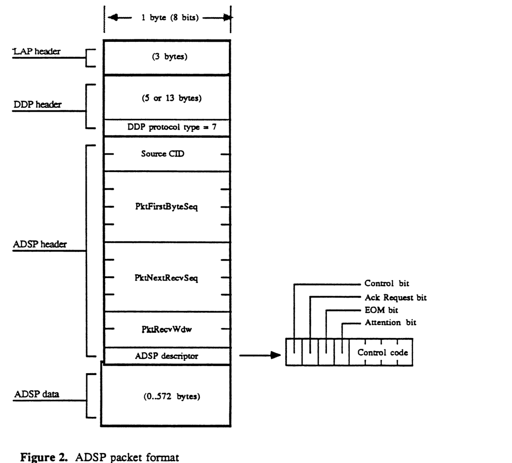

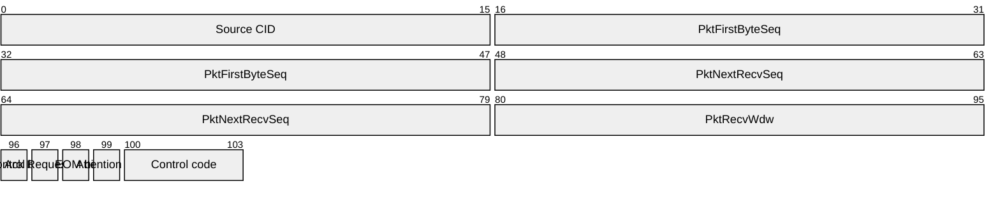
```mermaid
packet-beta
0-15: "Source CID"
16-47: "PktFirstByteSeq"
48-79: "PktNextRecvSeq"
80-95: "PktRecvWdw"
96-96: "Control bit"
97-97: "Ack Request bit"
98-98: "EOM bit"
99-99: "Attention bit"
100-103: "Control code"
```

| Field | Bit offset | Width (bits) | Description |
| :--- | :--- | :--- | :--- |
| Source CID | 0 | 16 | Source Connection Identifier |
| PktFirstByteSeq | 16 | 32 | Sequence number of the first byte of data in this packet |
| PktNextRecvSeq | 48 | 32 | Sequence number of the next byte the source expects to receive |
| PktRecvWdw | 80 | 16 | Available receive window size in bytes |
| Control bit | 96 | 1 | ADSP descriptor bit 7: set if this is a control packet |
| Ack Request bit | 97 | 1 | ADSP descriptor bit 6: set to request an acknowledgment |
| EOM bit | 98 | 1 | ADSP descriptor bit 5: set if this is the end of a message |
| Attention bit | 99 | 1 | ADSP descriptor bit 4: set if this is an attention packet |
| Control code | 100 | 4 | ADSP descriptor bits 3-0: code specifying the type of control packet |

The ADSP header contains the following sequence of fields:

* a 16-bit *Source CID*
* a 32-bit *PktFirstByteSeq*
* a 32-bit *PktNextRecvSeq*
* a 16-bit *PktRecvWdw*
* an 8-bit *Descriptor*

If the *Control* bit in the descriptor field is set, the packet is an ADSP control packet. Control packets are sent for internal ADSP purposes, and they do not carry any ADSP-client data bytes. Control packets do not consume sequence numbers.

In sending either a data packet or a control packet, the ADSP client can set the *Ack Request* bit in the descriptor field to indicate that it wants the remote end’s ADSP to immediately send back an ADSP packet, with *PktNextRecvSeq* and *PktRecvWdw* equal to the current values of its *RecvSeq* and *RecvWdw*. Upon receiving a packet whose *Ack Request* bit is set, an ADSP connection end must respond to the acknowledgement request, even if the packet is to be discarded as out-of-sequence; the *Ack Request* bit forces the receiving end’s ADSP to send an immediate acknowledgement.

Setting the *Attention* bit in the descriptor field designates the packet as an ADSP attention packet. Attention packets are used to send and acknowledge attention messages. Any attention packet that contains a client-attention message will have its *Control* bit clear and its *Ack Request* bit set. Setting the *Ack Request* bit forces the receiver to immediately send an acknowledgement of the attention data. An attention packet with its *Control* bit set is an attention-control packet for internal ADSP purposes. Attention-control packets are used to acknowledge attention messages and should not have the *Ack Request* bit set. The control code in the descriptor field of an ADSP attention packet must always be set to 0. An attention packet received with a nonzero control code should be discarded as invalid. Attention packets are described in detail in the section titled “Attention Messages.”

Setting the *Logical EOM* bit in the descriptor field indicates a logical end-of-message in the data stream. This bit applies only to client data packets, and so neither the *Control* bit nor *Attention* bit can be set in a packet whose *Logical EOM* bit is set.

## Control Packets

There are two broad classes of ADSP packets: *data packets* and *control packets*. Control packets can be distinguished from data packets by examining the *Control bit* in the packet's descriptor field; when set, this bit identifies a control packet. Such packets are sent for ADSP's internal operation and do not contain any client-deliverable data.

Control packets are used to open or to close connections, to act as probes, and to send acknowledgement information. The least-significant 4 bits of a control packet's descriptor contain a *control code*, which identifies the type of the ADSP control packet. The following list shows the control codes and their corresponding types:

* $0 Probe or Acknowledgement
* $1 Open Connection Request
* $2 Open Connection Acknowledgement
* $3 Open Connection Request and Acknowledgement
* $4 Open Connection Denial
* $5 Close Connection Advice
* $6 Forward Reset
* $7 Forward Reset Acknowledgement
* $8 Retransmit Advice

Apple Computer reserves values $9 through $F for potential future use, so, for now, you must treat them as invalid control codes. Control packets with these invalid control codes are rejected by the receiving end.

A control code of 0 can have two different meanings depending on the state of the *Ack Request bit*. If the *Ack Request bit* is set, the packet is a probe packet, so the receiving end should send an acknowledgement immediately. If the *Ack Request bit* is not set, then the control packet is an acknowledgement packet. (Note that an acknowledgement is implicit in any valid ADSP packet; also, the *Ack Request bit* can be set in either a data packet or a control packet. Therefore, a control packet with a control code of 0 is used only when the sending end has no client data to accompany the acknowledgement or acknowledgement request.)

Open-connection control codes are sent as part of the open-connection dialog. This dialog is explained in detail in the section titled "Opening a Connection." Before being closed by ADSP, a connection end sends a Close Connection Advice control packet. This packet is purely advisory and requires no reply. Upon receiving such a packet, ADSP closes down the connection. For additional details, see the section titled "Closing a Connection."

The Forward Reset control packet provides a mechanism for a client to abort the delivery of all outstanding data that it has sent to the remote client. Upon receiving this packet, the remote end synchronizes its *RecvSeq* to the value of *PktFirstByteSeq* in the packet and removes all undelivered bytes from its receive queue. The remote end then returns a Forward Reset Acknowledgement control packet to the other end and informs its client that it has received and processed a forward reset request.

A connection end may send the Retransmit Advice control packet in response to receiving several consecutive out-of-sequence data packets from the remote end. The packet is sent to inform the remote end that it should retransmit the bytes in its send queue beginning with the byte whose sequence number is PktNextRecvSeq.

## Data-Flow Examples

The following figures give examples of data flow on an ADSP connection. In these examples, end A sends data and control packets to end B, and end B receives data and sends acknowledgements to end A. However, the examples apply equally well for the opposite situation in which end B sends the data and control packets to end A, and end A receives the data and sends acknowledgements to end B.

In the figures, the packets are indicated by lines that run diagonally between the two connection ends. The bracketed ranges (for example, [0:5]) indicate the range of sequence numbers assigned to data bytes transmitted in the packet. The first number in the range corresponds to PktFirstByteSeq. Ctl indicates control packets. Events involving a change to any of connection end A's variables are indicated by a grey arrow along end A's time axis. The variable affected is listed with its new value. The packet variables of all packets sent by connection end B are listed along end B's time axis.

Figure 3 illustrates how the ADSP variables relate to the flow of data. In this example, end A sends an acknowledgement request when it exhausts its known send window. Acknowledgements are implicit in all packets sent from end B, regardless of whether they are data packets or control packets.

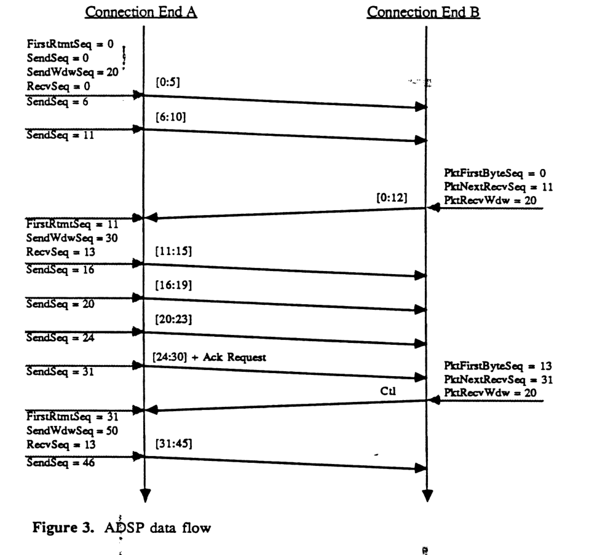

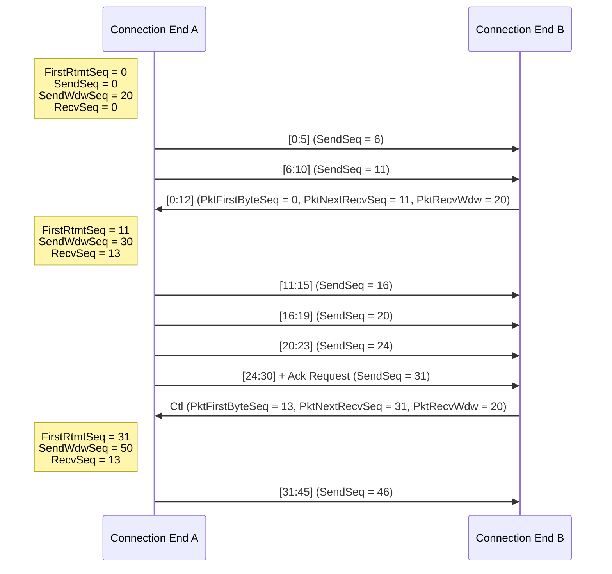
```mermaid
sequenceDiagram
    participant A as Connection End A
    participant B as Connection End B
    Note left of A: FirstRtmtSeq = 0<br/>SendSeq = 0<br/>SendWdwSeq = 20<br/>RecvSeq = 0
    A->>B: [0:5] (SendSeq = 6)
    A->>B: [6:10] (SendSeq = 11)
    B->>A: [0:12] (PktFirstByteSeq = 0, PktNextRecvSeq = 11, PktRecvWdw = 20)
    Note left of A: FirstRtmtSeq = 11<br/>SendWdwSeq = 30<br/>RecvSeq = 13
    A->>B: [11:15] (SendSeq = 16)
    A->>B: [16:19] (SendSeq = 20)
    A->>B: [20:23] (SendSeq = 24)
    A->>B: [24:30] + Ack Request (SendSeq = 31)
    B->>A: Ctl (PktFirstByteSeq = 13, PktNextRecvSeq = 31, PktRecvWdw = 20)
    Note left of A: FirstRtmtSeq = 31<br/>SendWdwSeq = 50<br/>RecvSeq = 13
    A->>B: [31:45] (SendSeq = 46)
```

Figure 3. ADSP data flow

Figure 4 shows an example of recovery from a lost packet. In this example, the first packet sent by end A is lost. The receiver discards subsequent packets because they are out-of-sequence. Some event (a retransmit timer goes off, or perhaps the send window is exhausted) causes end A to send an acknowledgement request. End B acknowledges, and end A retransmits all of the lost data.

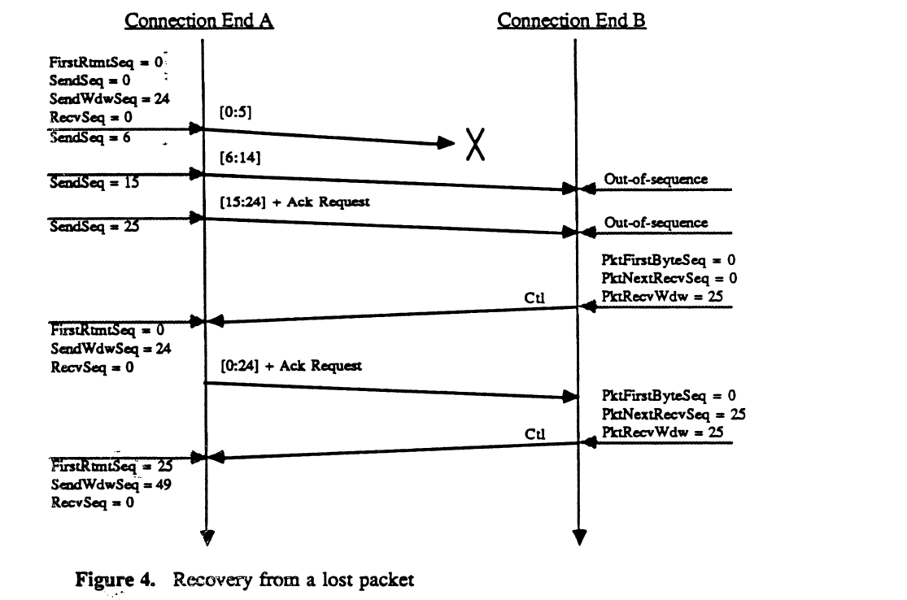

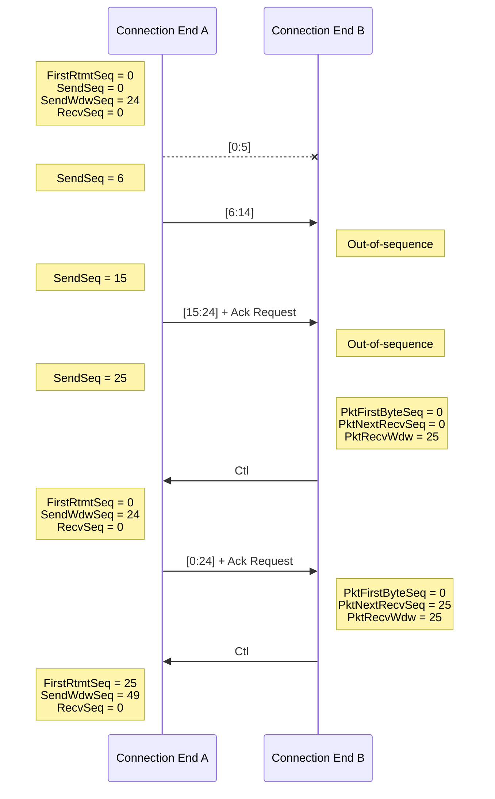
```mermaid
sequenceDiagram
    participant A as Connection End A
    participant B as Connection End B

    Note left of A: FirstRtmtSeq = 0<br/>SendSeq = 0<br/>SendWdwSeq = 24<br/>RecvSeq = 0
    
    A--xB: [0:5]
    Note left of A: SendSeq = 6
    
    A->>B: [6:14]
    Note right of B: Out-of-sequence
    Note left of A: SendSeq = 15
    
    A->>B: [15:24] + Ack Request
    Note right of B: Out-of-sequence
    Note left of A: SendSeq = 25

    Note right of B: PktFirstByteSeq = 0<br/>PktNextRecvSeq = 0<br/>PktRecvWdw = 25
    B->>A: Ctl

    Note left of A: FirstRtmtSeq = 0<br/>SendWdwSeq = 24<br/>RecvSeq = 0
    A->>B: [0:24] + Ack Request

    Note right of B: PktFirstByteSeq = 0<br/>PktNextRecvSeq = 25<br/>PktRecvWdw = 25
    B->>A: Ctl

    Note left of A: FirstRtmtSeq = 25<br/>SendWdwSeq = 49<br/>RecvSeq = 0
```

**Figure 4. Recovery from a lost packet**

Figure 5 gives an example of an idle connection state. Neither client is sending data, so both connection ends periodically send a probe to determine if the connection is still open.

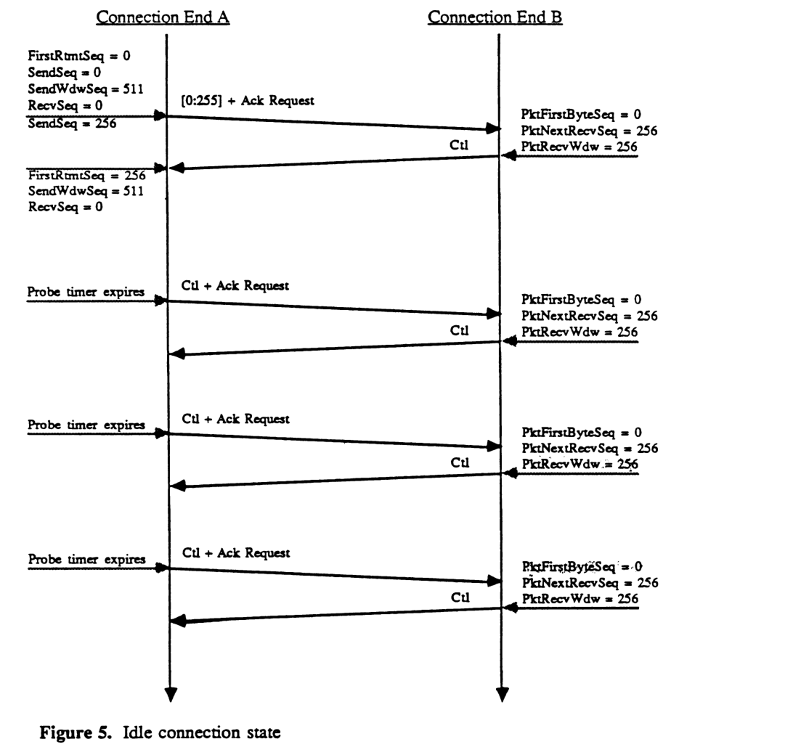

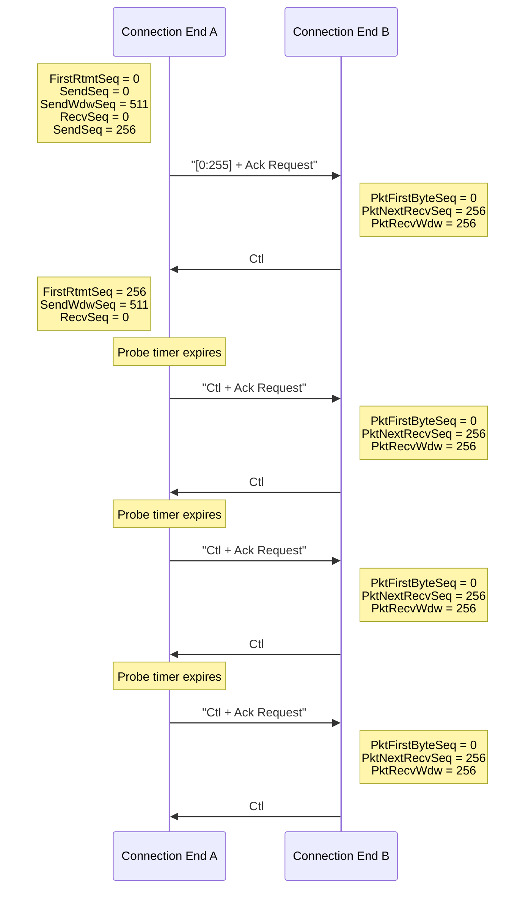
```mermaid
sequenceDiagram
    participant A as Connection End A
    participant B as Connection End B

    Note left of A: FirstRtmtSeq = 0<br/>SendSeq = 0<br/>SendWdwSeq = 511<br/>RecvSeq = 0<br/>SendSeq = 256
    A->>B: "[0:255] + Ack Request"
    Note right of B: PktFirstByteSeq = 0<br/>PktNextRecvSeq = 256<br/>PktRecvWdw = 256
    B->>A: Ctl
    Note left of A: FirstRtmtSeq = 256<br/>SendWdwSeq = 511<br/>RecvSeq = 0

    Note over A: Probe timer expires
    A->>B: "Ctl + Ack Request"
    Note right of B: PktFirstByteSeq = 0<br/>PktNextRecvSeq = 256<br/>PktRecvWdw = 256
    B->>A: Ctl

    Note over A: Probe timer expires
    A->>B: "Ctl + Ack Request"
    Note right of B: PktFirstByteSeq = 0<br/>PktNextRecvSeq = 256<br/>PktRecvWdw = 256
    B->>A: Ctl

    Note over A: Probe timer expires
    A->>B: "Ctl + Ack Request"
    Note right of B: PktFirstByteSeq = 0<br/>PktNextRecvSeq = 256<br/>PktRecvWdw = 256
    B->>A: Ctl
```

Figure 5. Idle connection state

In Figure 6, packets from end B are lost, and so ADSP eventually tears down the connection, as indicated by the X.

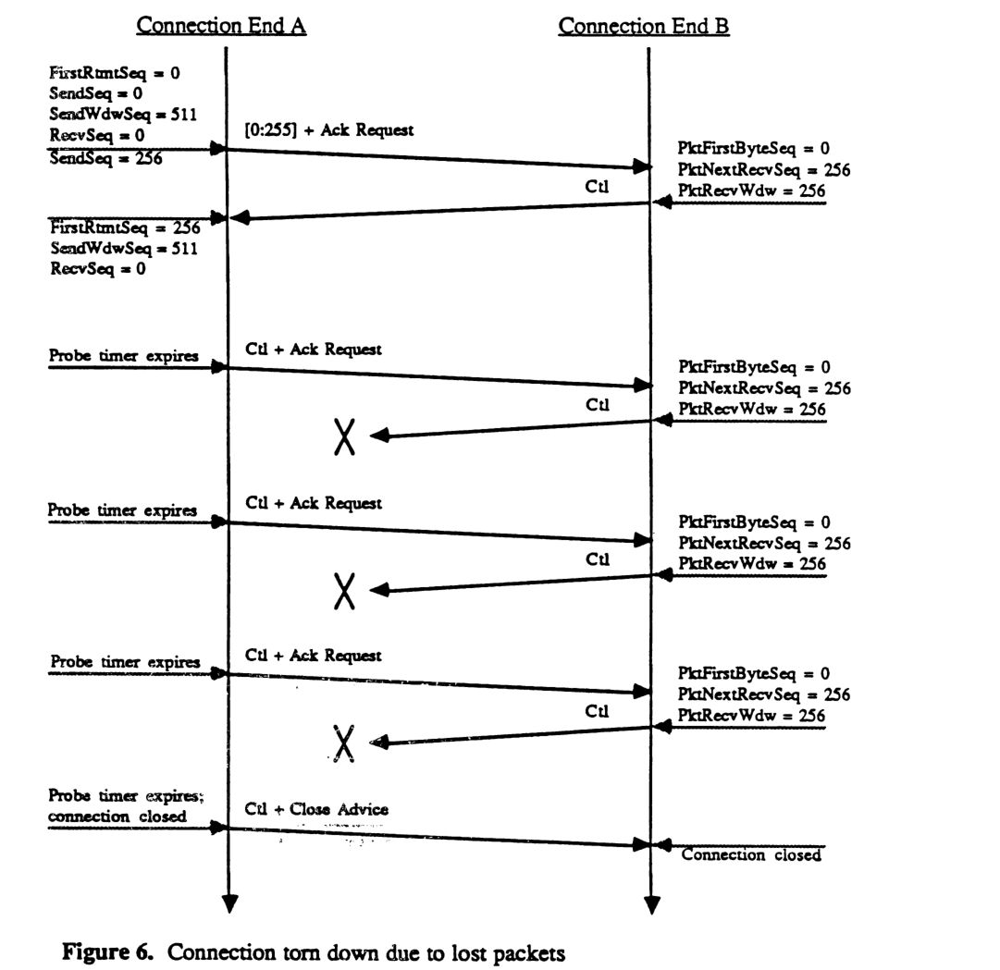

```mermaid
sequenceDiagram
    participant A as Connection End A
    participant B as Connection End B
    
    Note left of A: FirstRtmtSeq = 0<br/>SendSeq = 0<br/>SendWdwSeq = 511<br/>RecvSeq = 0
    A->>B: "[0:255] + Ack Request"
    Note left of A: SendSeq = 256
    
    Note right of B: PktFirstByteSeq = 0<br/>PktNextRecvSeq = 256<br/>PktRecvWdw = 256
    B->>A: "Ctl"
    
    Note left of A: FirstRtmtSeq = 256<br/>SendWdwSeq = 511<br/>RecvSeq = 0
    
    Note over A: Probe timer expires
    A->>B: "Ctl + Ack Request"
    Note right of B: PktFirstByteSeq = 0<br/>PktNextRecvSeq = 256<br/>PktRecvWdw = 256
    B-xA: "Ctl"
    
    Note over A: Probe timer expires
    A->>B: "Ctl + Ack Request"
    Note right of B: PktFirstByteSeq = 0<br/>PktNextRecvSeq = 256<br/>PktRecvWdw = 256
    B-xA: "Ctl"
    
    Note over A: Probe timer expires
    A->>B: "Ctl + Ack Request"
    Note right of B: PktFirstByteSeq = 0<br/>PktNextRecvSeq = 256<br/>PktRecvWdw = 256
    B-xA: "Ctl"
    
    Note over A: Probe timer expires;<br/>connection closed
    A->>B: "Ctl + Close Advice"
    Note right of B: Connection closed
```

**Figure 6. Connection torn down due to lost packets**

The *Attention* bit is set in the packet's descriptor field to designate an attention packet. The data part of an attention packet contains a 2-byte (16-bit) attention code and from 0 to 570 bytes of client-attention data.

The 16-bit attention-code field accommodates a range of values from $0000 through $FFFF. Values in the range $0000 through $EFFF are for the client's use. Values in the range $F000 through $FFFF are reserved for potential future expansion of ADSP.

Attention messages use a packet-oriented sequence-number space that is independent of data-stream sequence numbers. The first attention packet is assigned a sequence number of 0, the second packet is assigned 1, the third packet 2, and so on. Attention sequence numbers are treated as 32-bit unsigned integers that wrap around to 0 when incremented beyond the maximum value $FFFFFFFF.

End B maintains a variable, *AttnRecvSeq*, which contains the sequence number of the next attention message that end B expects to receive from end A. *AttnRecvSeq* is initially set to 0 and is incremented by 1 with each attention message that end B accepts from end A.

End A maintains a corresponding variable, *AttnSendSeq*, which contains the sequence number of the next attention message it will send across the connection. When end A is first established, *AttnSendSeq* is synchronized to the value of end B's *AttnRecvSeq*.

In any attention packet sent from end A to end B, the *PktAttnSendSeq* field of the ADSP packet header contains the current value of end A's *AttnSendSeq*. In any attention packet sent from end B to end A, the *PktAttnRecvSeq* field contains the current value of end B's *AttnRecvSeq*. Upon receiving an attention packet, end A uses the value of *PktAttnRecvSeq* to update its own *AttnSendSeq*. Before updating *AttnSendSeq*, end A must ensure that the value of *PktAttnRecvSeq* equals *AttnSendSeq*+1. If these values are equal, end A increments *AttnSendSeq* to equal *PktAttnRecvSeq*.

Attention data is received into buffer space other than the receive queue in an implementation-dependent manner. End A can send an attention message even if end B's receive window in the regular data stream is closed. However, only one attention message can be outstanding at a time. Once end A sends an attention message to end B, end A cannot send another attention message until it receives acknowledgement from end B. End B accepts and acknowledges receipt of an attention message if the attention message is properly sequenced and if buffer space is available. If buffer space is not available, end B discards the attention message. Because only one attention message can be sent at a time, the *PktAttnRecvWdw* field of ADSP attention-packet headers is not used and must always be set to 0.

When sending an attention message, the end starts a timer. If the timer expires, the end retransmits the attention message and restarts the timer. The sending end continues to retransmit the attention message until it receives the appropriate attention message acknowledgement or until the connection is torn down.

When end A sends an attention message to end B, end A's *PktAttnSendSeq* field is set to the value of end A's *AttnSendSeq*. When end B receives the attention packet, it compares the value of *PktAttnSendSeq* with its own *AttnRecvSeq*. If the values are not equal, end B discards the attention message. If the values are equal and buffer space is available, end B accepts the data and increments *AttnRecvSeq*. Then end B sends end A an attention acknowledgement with the *PktAttnRecvSeq* field set to the current value of end B's *AttnRecvSeq*.

An acknowledgement is implicit in any attention packet sent; that is, acknowledgements are piggybacked on attention messages. The attention acknowledgement itself may be an attention message that end B's client has just asked end B to send, or the acknowledgement may be an ADSP control packet whose sole purpose is to acknowledge the attention message.

## Opening a Connection

This section describes how connections are opened and explains some of the facilities that ADSP provides for opening connections.

A connection is open when both ends of the connection are established. A connection end is established when it knows the values of all of the following:

- *LocAddr*: The internet address of the local end's socket.
- *RemAddr*: The internet address of the remote end's socket
- *LocCID*: The local end's CID
- *RemCID*: The remote end's CID
- *SendSeq*: The sequence number to be assigned to the next byte that the local end's ADSP will send over the connection to the remote end
- *FirstRtmtSeq*: The sequence number of the oldest byte in the local end's send queue (initially, the queue is empty so this number equals *SendSeq*)
- *SendWdwSeq*: The sequence number of the last byte that the remote end has buffer space to receive from the local end
- *RecvSeq*: The sequence number of the next byte that the local end expects to receive from the remote end (initially set to 0)
- *RecvWdw*: The number of bytes that the local end currently has buffer space to receive from the remote end (initially, the local end's entire receive buffer is available)
- *AttnSendSeq*: The sequence number to be assigned to the next attention packet that the local end will transmit over the connection
- *AttnRecvSeq*: The sequence number of the next attention packet that the local end expects to receive from the remote end (initially set to 0)

When attempting to become established, the local end knows the values of *LocAddr*, *LocCID*, *RecvSeq*, *RecvWdw*, and *AttnRecvSeq*. (When a connection is first opened, the values of *RecvSeq* and *AttnRecvSeq* will be 0.) The local end must somehow discover the values of *RemAddr*, *RemCID*, *SendSeq*, *SendWdwSeq*, and *AttnSendSeq*. The objective of the connection-opening dialog is for each end to discover these values.

## AppleTalk Data Stream Protocol

Note: A connection can be opened in a variety of ways. ADSP provides one set of machinery, but a client can use its own separate, parallel mechanisms to discover and to provide the required information to ADSP in order to establish either or both connection ends.

In order to open a connection, ADSP provides a type of control packet known as an Open Connection Request control packet. Since the control packet is an ADSP packet, its header contains the sending end's network address and CID. In addition, the packet includes the sending end's *RecvSeq* (*PktNextRecvSeq* in the packet header) and *RecvWdw* (*PktRecvWdw* in the packet header). The end obtains the value of *AttnRecvSeq* from one of a set of fields in the packet, collectively known as the *open-connection parameters*.

The end initiating the connection-opening dialog sends an Open Connection Request control packet to the intended remote end. This packet provides the remote end with the connection parameters it needs to become established. Upon receiving such a packet, the remote end sets its connection parameters as follows:

- *RemAddr*: Equal to the packet's source network address
- *RemCID*: Equal to the packet's *SourceCID*
- *SendSeq*: Equal to *PktNextRecvSeq*
- *SendWdwSeq*: Equal to *PktNextRecvSeq* + *PktRecvWdw* - 1
- *AttnSendSeq*: Equal to *PktAttnRecvSeq*

Once the remote end has set these parameters (based on the information in the Open Connection Request control packet), the end is considered to be established.

In order for a connection to become open, both ends of the connection must be established. Therefore, in the connection-opening dialog, each end must send an Open Connection Request control packet to the other end (as well as receive an Open Connection Request control packet from the other end).

Since these packets can be lost during transmission, ADSP provides a mechanism for ensuring that the packets are delivered. When a connection end receives an Open Connection Request control packet, the receiving end returns an Open Connection Acknowledgement control packet to the sending end. Upon receiving an Open Connection Acknowledgement control packet, the receiving end is assured that the other end has become established.

After the two connection ends have exchanged both open-connection requests and acknowledgements, the connection is open and data can safely be sent on it.

## Connection-Opening Dialog

The connection-opening mechanism provided by ADSP requires that a connection end must know the internet socket address of the destination socket to which the end is making a connection request. The client must provide this address to ADSP for the purpose of initiating the connection-opening dialog. How this address is determined is up to the client; generally, the AppleTalk Name Binding Protocol (NBP) is used.

## Apple Talk Data Stream Protocol

ADSP connection-opening is a symmetric operation. Either of two peer clients can initiate the connection-opening dialog. In fact, both peers can attempt to open the connection at the same time; however, only one connection between the two peers should be opened. The following discussion focuses on how end A opens a connection with end B.

When attempting to open a connection with a remote end B, end A first chooses a locally unique CID. End A then sends an Open Connection Request control packet to end B's socket address. This request contains end A's initial connection-state information (its *LocCID*, *RecvSeq*, *RecvWdw*, and *AttnRecvSeq*). End B needs this information in order to become established.

Upon receiving the Open Connection Request control packet, end B extracts the sender's internet socket address and *Source CID* and saves them in its *RemAddr* and *RemCID* fields, respectively. The value of the *PktNextRecvSeq* field is saved as end B's *SendSeq*. End B then adds the value of *PktRecvWdw*-1 to *PktNextRecvSeq* to produce its *SendWdwSeq*. Finally, the value of *PktAttnRecvSeq* is saved as end B's *AttnSendSeq*. Connection end B is now established.

At this point, end A is not established and does not know the state of connection end B. End B responds to end A's Open Connection Request control packet by sending back an Open Connection Request and Acknowledgement control packet. End A determines the values of its *RemAddr*, *RemCID*, *SendSeq*, and *SendWdwSeq* from the open connection request, as previously described; then, end A becomes established. The open connection acknowledgement informs end A that end B has accepted end A's Open Connection Request control packet and has become established. End A assumes the connection is now open.

End A informs end B of its state by sending an Open Connection Acknowledgement control packet. Upon receiving the acknowledgement, end B assumes the connection is open. See Figure 8.

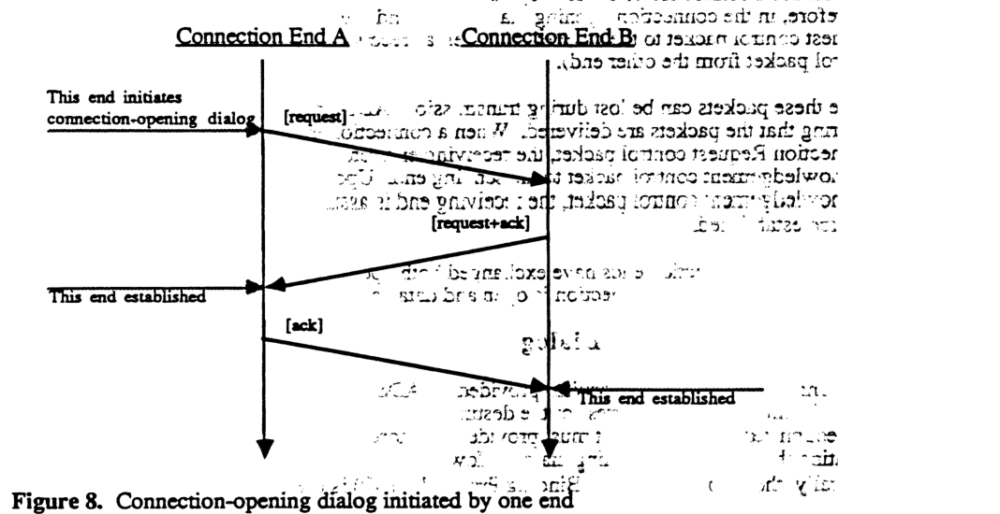

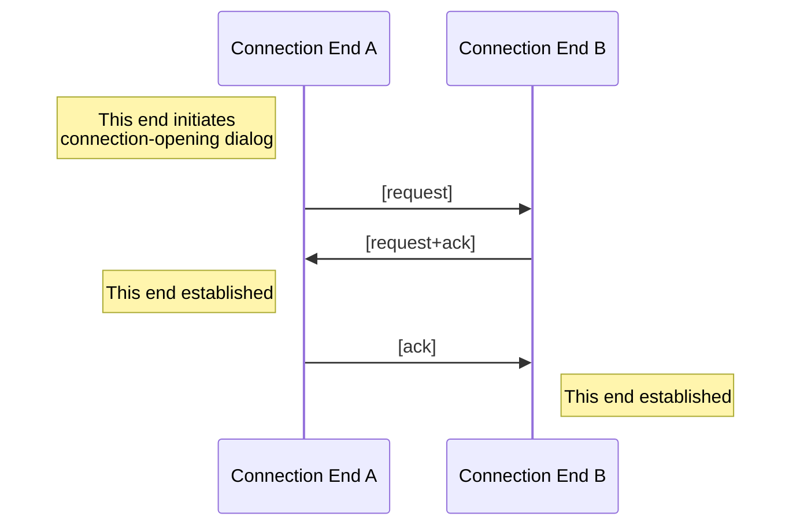
```mermaid
sequenceDiagram
    participant A as Connection End A
    participant B as Connection End B
    Note left of A: This end initiates<br/>connection-opening dialog
    A->>B: [request]
    B->>A: [request+ack]
    Note left of A: This end established
    A->>B: [ack]
    Note right of B: This end established
```

Figure 8. Connection-opening dialog initiated by one end

Both ends can attempt to open the connection simultaneously. In this case, each ADSP socket receives an Open Connection Request control packet from the socket to which it has sent an Open Connection Request control packet. The ADSP implementation identifies end A by matching its *RemAddr* to the source address of the Open Connection Request control packet received from end B. End A extracts the required information from the packet and becomes established. End A then sends back an Open Connection Acknowledgement control packet to inform the remote end that it has become established. This ensures that ADSP establishes only one connection between the two sockets. See Figure 9.

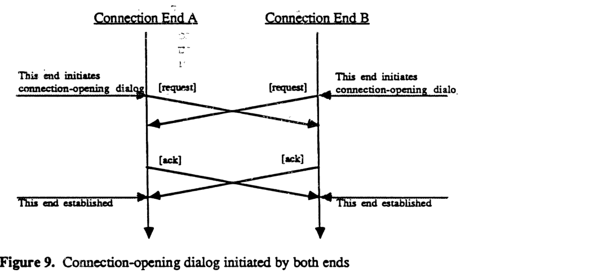

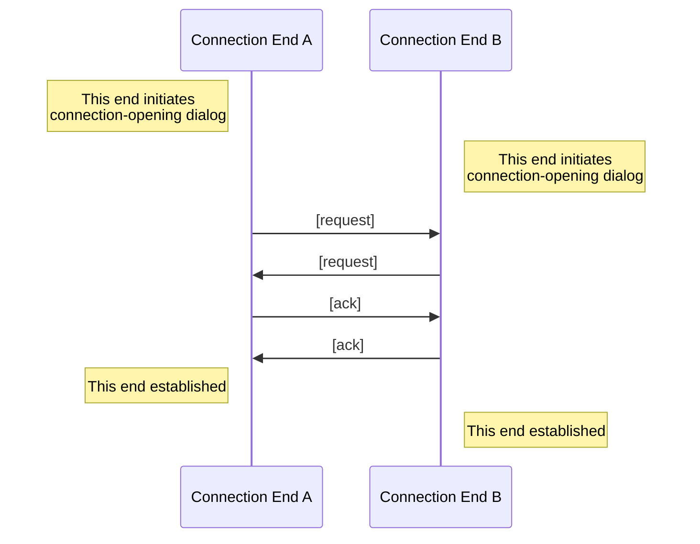
```mermaid
sequenceDiagram
    participant A as Connection End A
    participant B as Connection End B
    Note left of A: This end initiates<br/>connection-opening dialog
    Note right of B: This end initiates<br/>connection-opening dialog
    A->>B: [request]
    B->>A: [request]
    A->>B: [ack]
    B->>A: [ack]
    Note left of A: This end established
    Note right of B: This end established
```

Figure 9. Connection-opening dialog initiated by both ends

If for any reason an ADSP implementation is unable to fulfill the open-connection request, an open-connection denial is sent back to the requestor. In this case, the *Source CID* field of the ADSP packet header is 0, while the *Destination CID* field of the connection-opening parameters is set to the requestor's CID. See Figure 10.

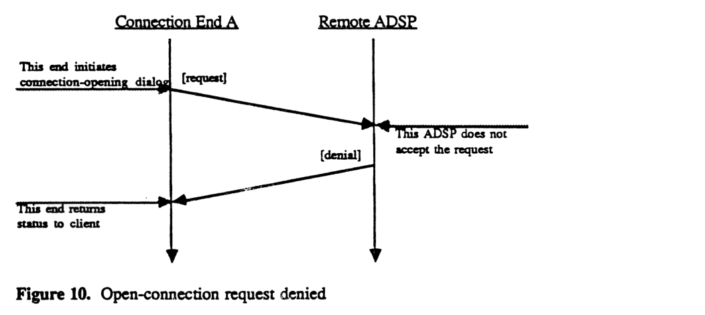

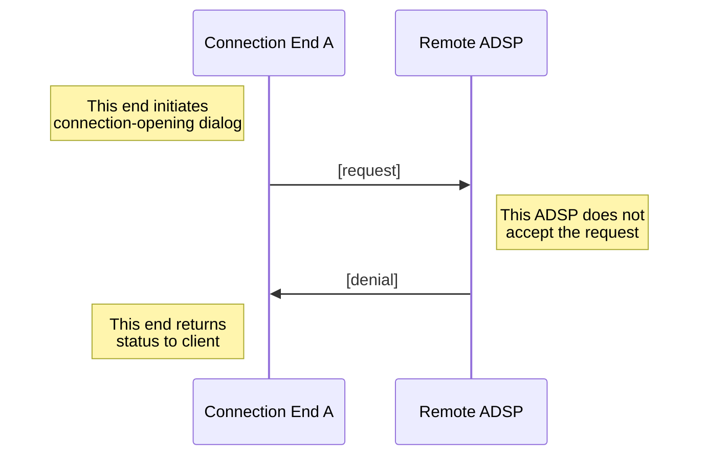
```mermaid
sequenceDiagram
    participant A as Connection End A
    participant R as Remote ADSP
    Note left of A: This end initiates<br/>connection-opening dialog
    A->>R: [request]
    Note right of R: This ADSP does not<br/>accept the request
    R->>A: [denial]
    Note left of A: This end returns<br/>status to client
```

Figure 10. Open-connection request denied

## Open-Connection Control Packet Format

An open-connection request is sent as an ADSP control packet. As such, the request contains all the information required to establish the receiving end. ADSP is a client of the network layer, AppleTalk Datagram Delivery Protocol (DDP), which contains the internet address of the sender. (Note that the packet must be sent through the socket on which the connection is to be established.) The ADSP header contains the *Source CID*, *RecvSeq*, and *RecvWdw*, which are used to determine the receiving end's *RemCID*, *SendSeq*, and *SendWdwSeq*, respectively. The *AttnRecvSeq* field of the open-connection parameters following the header is used to set the value of the receiving end's *AttnSendSeq*.

An ADSP Open Connection Acknowledgement, which is also a control packet, serves to acknowledge the receipt of an Open Connection Request control packet. An end can send both an Open Connection Request control packet and an Open Connection Acknowledgement control packet at the same time by combining these two into one ADSP control packet. ADSP also provides an Open Connection Denial control packet for use when a connection request cannot be honored. In the Open Connection Denial control packet, the *Source CID* should be set to 0 in the packet header.

Figure 11 shows the format of ADSP packets used in the connection-opening dialog. Note the special open-connection parameters that follow the ADSP packet header. These parameters are described in detail after the figure.

## AppleTalk Data Stream Protocol

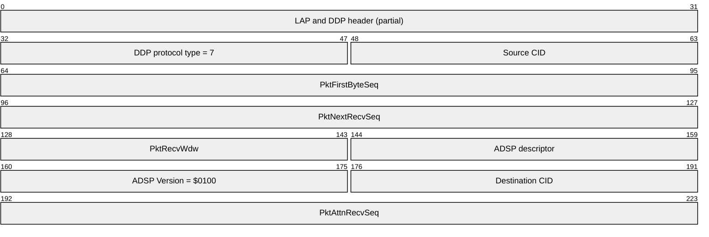
```mermaid
packet-beta
0-31: "LAP and DDP header (partial)"
32-47: "DDP protocol type = 7"
48-63: "Source CID"
64-95: "PktFirstByteSeq"
96-127: "PktNextRecvSeq"
128-143: "PktRecvWdw"
144-159: "ADSP descriptor"
160-175: "ADSP Version = $0100"
176-191: "Destination CID"
192-223: "PktAttnRecvSeq"
```

| Field | Bit offset | Width (bits) | Description |
|---|---|---|---|
| LAP and DDP header | 0 | 32* | Includes source/destination network addresses and other DDP/LAP fields. |
| DDP protocol type | 32 | 16 | Set to 7 for ADSP. |
| Source CID | 48 | 16 | Source Connection ID. |
| PktFirstByteSeq | 64 | 32 | Sequence number of the first byte in the packet's data field. |
| PktNextRecvSeq | 96 | 32 | Sequence number of the next byte the sender expects to receive. |
| PktRecvWdw | 128 | 16 | Size of the receive window in bytes. |
| ADSP descriptor | 144 | 16 | ADSP flags and control code. |
| ADSP Version | 160 | 16 | Protocol version (currently $0100). |
| Destination CID | 176 | 16 | Connection ID of the remote socket. |
| PktAttnRecvSeq | 192 | 32 | Sequence number of the next attention byte the sender expects to receive. |

\* *Note: LAP and DDP header size varies; bit offsets shown from an arbitrary start point in the diagram for relative mapping.*

**Figure 11. Open-connection packet format**

The first field of the open-connection parameters is the 16-bit *ADSP Version* field. In any open-connection packet, *ADSP Version* should be set to the protocol version of the ADSP implementation that sent the packet. An ADSP implementation must deny any open-connection request that has an incompatible *ADSP Version*. This preliminary note documents ADSP version $0100; all other values are reserved by Apple for potential future expansion of the protocol.

The 16-bit *Destination CID* field of the open-connection parameters is used to uniquely associate an open-connection acknowledgement or denial with the appropriate open connection request. The *Destination CID* field of any Open Connection Acknowledgement control packet or Open Connection Denial control packet should be set to the *Source CID* of

the corresponding open-connection request. When an end sending an Open Connection Request control packet does not know the CID of the remote end, the *Destination CID* field in the packet must be set to 0.

The 32-bit *AttnRecvSeq* field of the open-connection parameters contains the sequence number of the first attention packet that the sending end is willing to accept. This value is equal to the sending end's *AttnRecvSeq* variable.

The following table summarizes the packet-descriptor values and CIDs that should be used with each of the open-connection control messages.

### Open-Connection Packet Parameters

| Control packet | ADSP packet descriptor | Source CID | Destination CID |
|---|---|---|---|
| Open Connection Request | $81 | LocCID | 0 |
| Open Connection Request + Ack | $82 | LocCID | RemCID |
| Open Connection Ack | $83 | LocCID | RemCID |
| Open Connection Denial | $84 | 0 | RemCID |

## Error Recovery in the Connection-Opening Dialog

Since delivery of packets sent by the network layer is not guaranteed, connection-opening packets can be lost or delayed. Therefore, ADSP open-connection requests should be retransmitted at client-specified intervals (for a client-specified maximum number of retries). An end receiving an open-connection request must ensure that it is not a duplicate by comparing the request's source CID and address with that of all open or opening connections for the receiving socket. If the request is a duplicate, the appropriate acknowledgement is still sent back. See Figures 12 and 13.

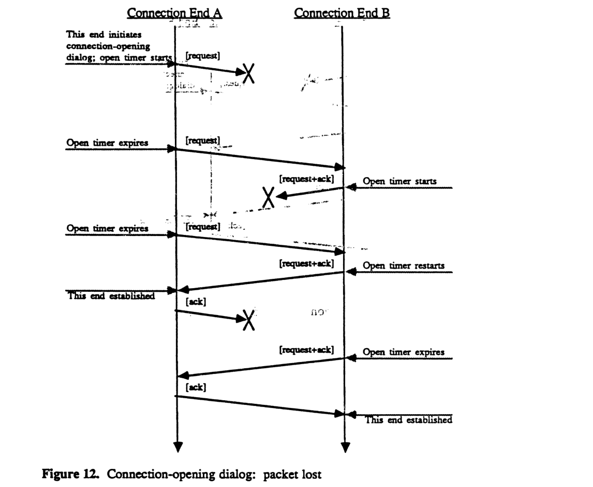

```mermaid
sequenceDiagram
    participant A as Connection End A
    participant B as Connection End B

    Note left of A: This end initiates<br/>connection-opening<br/>dialog; open timer starts
    A-x B: [request]
    Note left of A: Open timer expires
    A->>B: [request]
    Note right of B: Open timer starts
    B-x A: [request+ack]
    Note left of A: Open timer expires
    A->>B: [request]
    Note right of B: Open timer restarts
    B->>A: [request+ack]
    Note left of A: This end established
    A-x B: [ack]
    Note right of B: Open timer expires
    B->>A: [request+ack]
    A->>B: [ack]
    Note right of B: This end established
```

**Figure 12. Connection-opening dialog: packet lost**

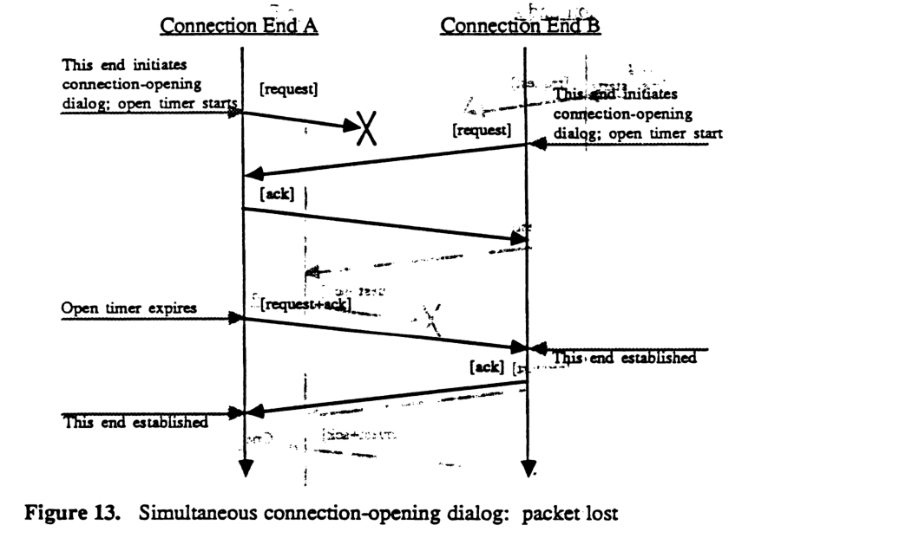

```mermaid
sequenceDiagram
    participant A as Connection End A
    participant B as Connection End B
    Note left of A: This end initiates<br/>connection-opening<br/>dialog; open timer starts
    A-x B: [request]
    Note right of B: This end initiates<br/>connection-opening<br/>dialog; open timer start
    B->>A: [request]
    A->>B: [ack]
    Note left of A: Open timer expires
    A->>B: [request+ack]
    B->>A: [ack]
    Note right of B: This end established
    Note left of A: This end established
```

**Figure 13. Simultaneous connection-opening dialog: packet lost**

If either end dies or becomes unreachable during the connection-opening dialog, one end can become established while the other end does not. This results in a half-open connection. When this situation occurs, the open end is closed down through normal ADSP mechanisms, as shown in Figure 14.

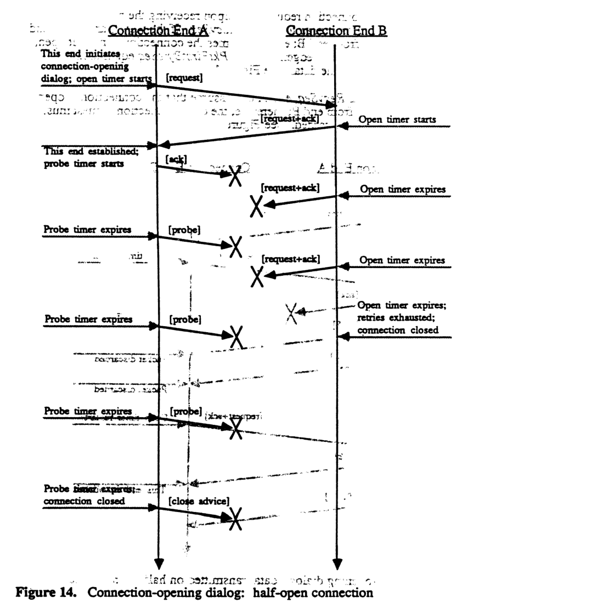

```mermaid
sequenceDiagram
    participant A as Connection End A
    participant B as Connection End B
    Note left of A: This end initiates connection-opening dialog; open timer starts
    A->>B: [request]
    Note right of B: [request+ack]<br/>Open timer starts
    B->>A: [request+ack]
    Note left of A: This end established; probe timer starts
    A-x B: [ack]
    Note right of B: Open timer expires
    B-x A: [request+ack]
    Note left of A: Probe timer expires
    A-x B: [probe]
    Note right of B: Open timer expires
    B-x A: [request+ack]
    Note left of A: Probe timer expires
    A-x B: [probe]
    Note right of B: Open timer expires; retries exhausted; connection closed
    Note left of A: Probe timer expires
    A-x B: [probe]
    Note left of A: Probe timer expires; connection closed
    A-x B: [close advice]
```

**Figure 14. Connection-opening dialog: half-open connection**

Figure 15 shows that it is possible for one end to become established, while the other is still opening. In this case, the connection is half-open: End A can begin to send data packets, but End B will discard the packets because the connection is not yet open (end B has not yet received acknowledgement that end A has become established).

End B will retransmit its open-connection request, and upon receiving the request, end A will compare the value of `PktFirstByteSeq` to its own `RecvSeq`. If the values are equal, end A has not yet received any data from end B; end A assumes the connection is not yet open, sends back an open-connection acknowledgement with `PktFirstByteSeq` equal to its `FirstRtmtSeq`, and then retransmits the data. See Figure 15.

If `PktFirstByteSeq` does not equal `RecvSeq`, end A can assume that the connection is open because end A has received data from end B; therefore, the open connection request must be a late-arriving duplicate and is discarded. See Figure 16.

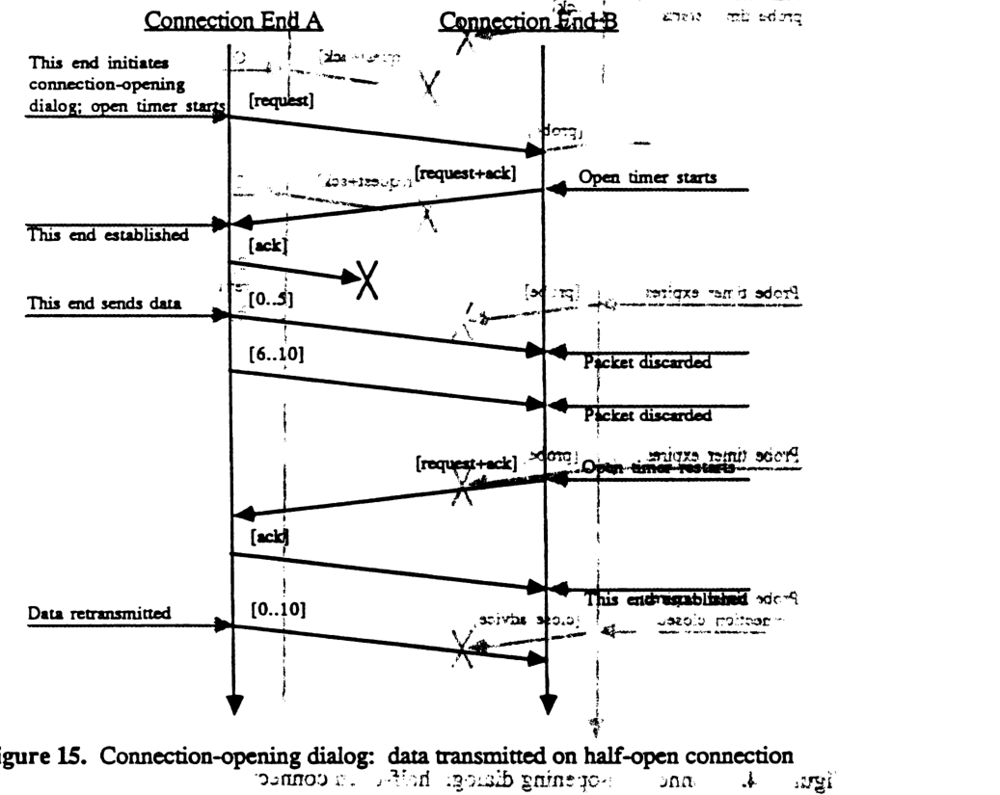

```mermaid
sequenceDiagram
    participant A as Connection End A
    participant B as Connection End B

    Note left of A: This end initiates<br/>connection-opening<br/>dialog; open timer starts
    A->>B: [request]
    B->>A: [request+ack]
    Note right of B: Open timer starts
    Note left of A: This end established
    A->>B: [ack]
    Note left of A: This end sends data
    A-xB: [0..5]
    Note right of B: Packet discarded
    A-xB: [6..10]
    Note right of B: Packet discarded
    B->>A: [request+ack]
    Note right of B: Open timer restarts
    A->>B: [ack]
    Note left of A: Data retransmitted
    A->>B: [0..10]
    Note right of B: This end established
```

Figure 15. Connection-opening dialog: data transmitted on half-open connection

## ADSP Development Kit Version 1.0

In order to ship the AppleTalk Data Stream Protocol with your products, you must first obtain a license from:

Apple Computer Software Licensing
20525 Mariani Avenue, MS: 38-I
Cupertino, CA 95014

