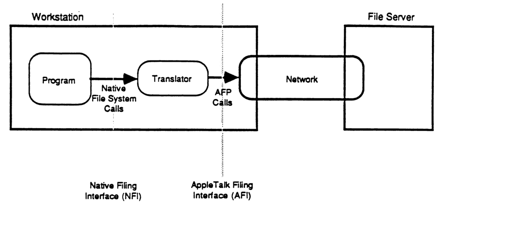
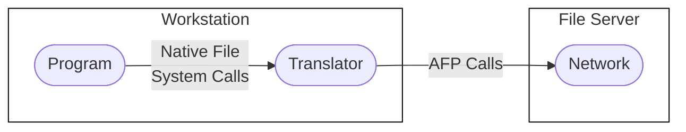
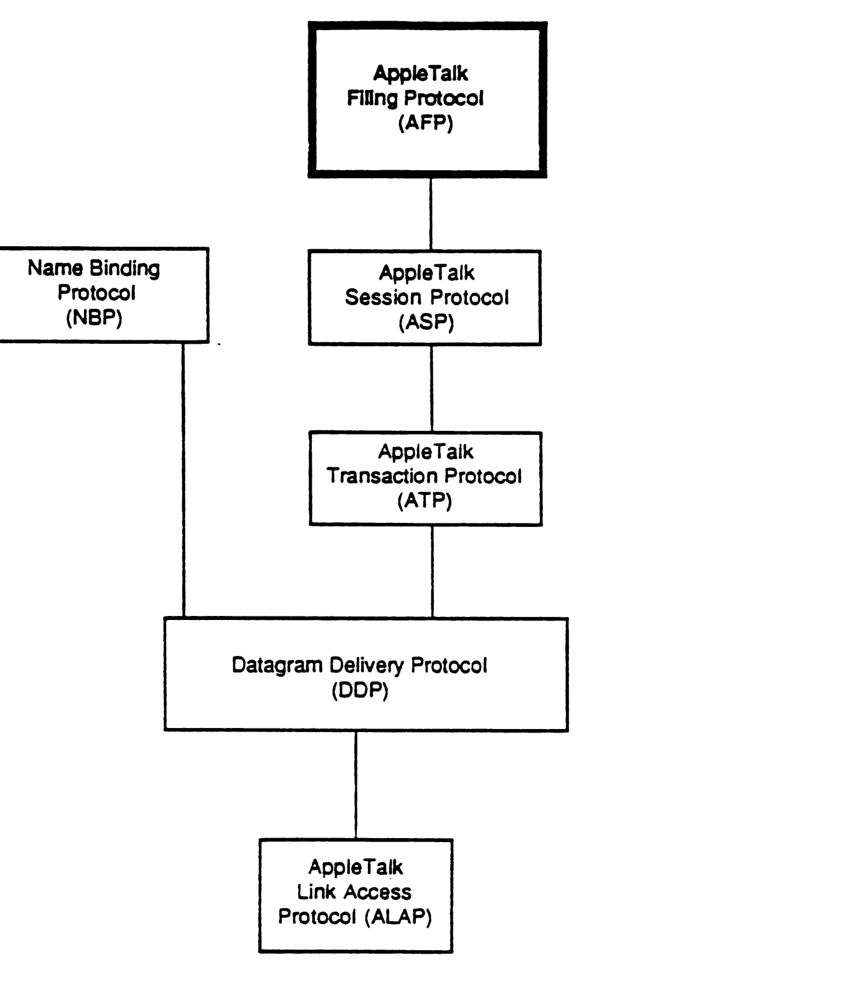
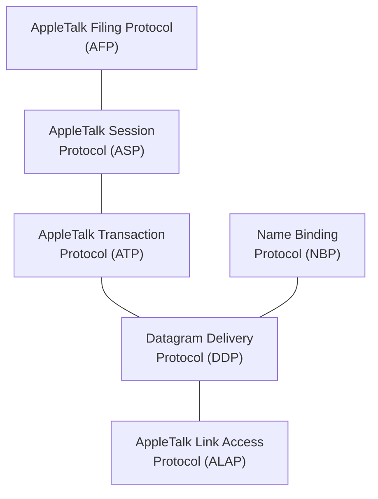

# Chapter 1 - AppleTalk Filing Protocol Design Description

This document specifies version 1.1 of the *AppleTalk Filing Protocol* (AFP). We start by discussing, in general terms, the scope of this protocol and some strategic decisions that have had a fundamental impact on its design. The relationship of this protocol to other parts of the AppleTalk protocol architecture are then spelled out. The detailed specification of the protocol is presented in three main parts: the AFP system model, AFP calls, and AFP packet formats.

1. TOC
{:toc}

## The Basic File Access Model

The overall objective is to allow workstations on AppleTalk to access files on file servers connected to the network. This access occurs at the level of calls to the workstation's native file system. Figure AFP1 illustrates the basic file access model which can be used to make these general notions more precise.

As illustrated, a program running in a workstation issues *native file system commands*. If these commands refer to files on the workstation's local storage, then they are processed by the workstation's local/native file system. If however the commands refer to files on a file server, they are routed inside the workstation to a *Translator*. It is the Translator's responsibility to deliver the desired file system service to the requesting program. This is done by converting the native file system command into one or more AFP requests sent over the network to the appropriate file server. We can isolate two important file service interfaces in Figure AFP1.

The first, labeled *Native Filing Interface* (NFI), is the one through which programs on the workstation issue native file system commands and obtain the relevant file system services. A program "looking through" this interface sees the structures and capabilities of the workstation's native file system.

The second interface, labelled *AppleTalk Filing Interface* (AFI), is the one through which the Translator issues AFP requests to the file server and obtains AFP services. Looking through this interface, the Translator sees what we will call the AFP file system. It is the Translator's responsibility to map requests made through NFI into the requests that must be made through the AFI to the AFP file system in order to satisfy the original NFI request.

Figure AFP1. The Basic File Access Model

Note that in some cases it may be necessary to provide another path from the Program directly to the AppleTalk Filing Interface to allow the Program to make AFP calls which have no equivalent in the Native Filing Interface.

The filing protocol specification in effect is the same as a complete specification of the AFI. This consists of three parts:

* the AFP file system structure;
* the AFP calls;
* the algorithms associated with these calls.

By the AFP file system structure is meant a complete description of entities such as servers, volumes, directories, files, forks, etc., that are "visible" through the AFI, their interrelationship and associated parameters. The client of the AFI (the Translator) sends calls/commands/requests through the AFI to manipulate this AFP file system structure, and the details of what each call does to this structure constitute the algorithms associated with AFP.

It is interesting to consider the relationship between the native file system and the AFP file system. Clearly, the latter must be functionally as powerful as the former. In fact, when the AFP is designed to allow various different types of workstations to use the model of Figure AFP1 at the same time, then the services provided by the AFP file system must, in a sense, be the functional union of the services provided by the various native file systems of these workstations.

This document does not examine in detail the mechanism of translation in the Translator; the focus here is on the AFI and the AFP itself.

## Goals of AFP

We have paid special attention in the design of AFP to allow its extension in a very general fashion. This is essential if, in the future, additional types of workstations are to be supported by the protocol.

AFP version 1.1 is designed to work with Macintoshes (using the hierarchical file system) and MS-DOS workstations. Thus, the protocol is sufficient to successfully support translators on these two workstations under the indicated operating environment. We expect *future* extensions of the protocol to support the Apple-][ (under ProDOS) and Unix workstations (but these are not part of the goals of version 1.1).

Access control mechanisms are an important part of filing protocols. AFP supports user authentication in a flexible fashion allowing the use of two standard password-based schemes but permitting future extension to other more sophisticated methods based, for instance, on public key encryption. AFP does not force the use of a fixed user-authentication method. AFP includes a directory-level access control mechanism based on user authentication at server login time. This scheme is similar to that used by Unix and therefore should be especially easy to implement on Unix-based server machines.

Although in the model of Figure AFP1 we have distinguished between workstations and file servers, AFP does not rule out the possibility of a particular network node being both a workstation and a file server. At the same time, AFP does not attempt to solve various concurrency problems and potential deadlock situations that can arise in such combined workstation/server nodes. This must be done by careful design of the software implemented on such "combined" nodes.

It should also be mentioned that AFP does not include any services or calls needed for administration of file servers. These will depend on the nature of a particular file server and are hence outside the scope of AFP.

## AFP in the AppleTalk Architecture

As illustrated in Figure AFP2, AFP is a client of the AppleTalk Session Protocol (ASP) described in a separate document.

As should be clear from the ASP specification, a file server must call the AppleTalk Transaction Protocol (ATP) to open up a Session Listening Socket (SLS) and then use the Name Binding Protocol (NBP) to register the file service's name on this socket. Workstations wishing to use the file server must use NBP and the file service's name to discover the SLS's network address. With this information the workstation opens an ASP session with the server.

Figure AFP2. AFP and the AppleTalk Protocol Architecture

Once this session has been opened the AFP protocol entity in the workstation must log itself in on the file server as a bonafide user. The login step provides an opportunity to:

* authenticate the file server's user (i.e., the workstation);
* negotiate the version of the AFP protocol to be used during that session.

After the workstation has successfully logged in on the file server, the various AFP commands can be conveyed on the session thus established. When the workstation has finished using the services of the file server, it can logout. At this point all resources related to this filing session are freed up in the file server, and the underlying ASP session is closed.

## Notation

Throughout this document hexadecimal (base 16) values are written with a leading $ sign (for example, $3A), while decimal integers are written with no leading special character (for example, 18).

Acronyms are widely used in this document (a list is provided in Appendix E).

The following abbreviations are used to describe the input and output parameters of AFP calls:

| | |
|---|---|
| BIT | a single binary digit |
| BUF | a buffer; exact method of specifying location and length are dependent on the AFP implementation |
| BYTE | an 8-bit quantity |
| EntityAddr | a network-visible entity's internet address; exact size and format are dependent on the underlying network |
| INT | a 2-byte (16-bit) integer quantity |
| LONG | a 4-byte (32-bit) quantity |
| STR | a string consisting of a one-byte string length value (not including the length byte) followed by the string's characters (one character per byte). Strings cannot have more than 255 characters. |
| ResType | a 4-byte signature used in Finder info fields |

Note that all string comparisons in AFP are case insensitive unless otherwise noted.

All numerical quantities are signed numbers unless otherwise noted.

