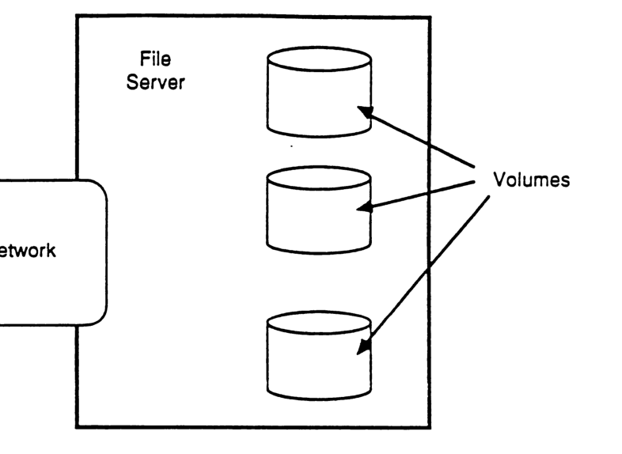
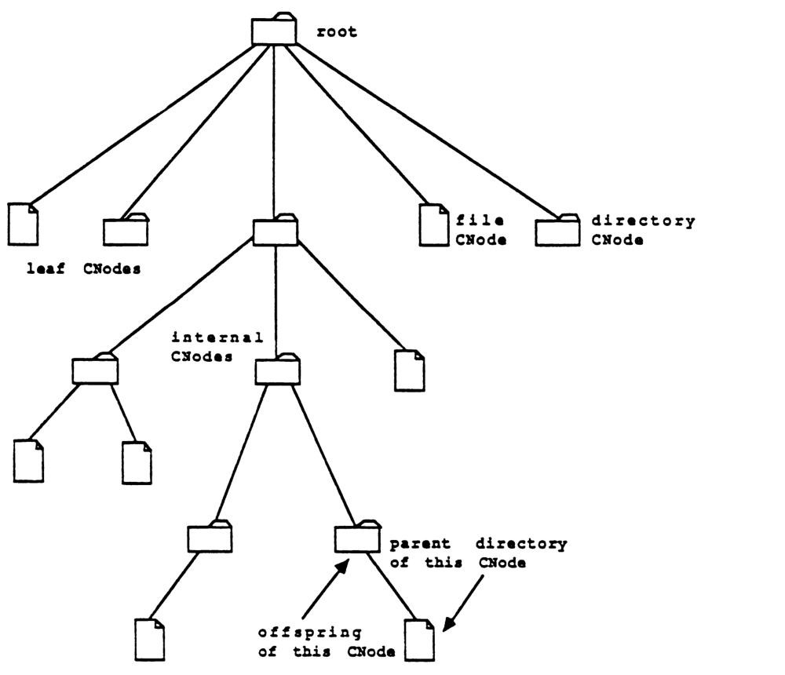

# Chapter 2 AppleTalk Filing Protocol System Description

This chapter contains a fairly detailed discussion of all the major concepts involved in AFP: the AFP file system structure, the login process, access control mechanisms provided by AFP, and a global discussion of the AFP calls.

Chapter 7 contains the detailed specification of the AFP calls. This forms the bulk of this document.

Although AFP has been designed to be used with various underlying transport mechanisms, on AppleTalk it is implemented as a client of the AppleTalk Session Protocol (ASP). In Chapter 8 we include a discussion of how AFP uses the services provided by ASP.

1. TOC
{:toc}


## AFP File System Structure

Once the workstation client of AFP has logged into the server, it can issue any of a set of AFP calls described below. Through these calls the client can obtain descriptive information (collectively referred to below as parameters) about any of a set of entities that comprise the *AFP file system structure*, modify this descriptive information, create or delete entities, read and write to such entities, etc. Before discussing the calls for manipulating the AFP file system structure let us discuss this structure, its entities as seen through the AFI, and the relationship among these entities. [Note that this discussion does not describe how this structure might be implemeted on a server; it just describes the final result of such an implementation.]

The entities comprising the AFP file system structure are: [file] servers, volumes, directories, files, and forks. We now examine each of these and the relationship among them.

### File Servers

The most global entity encompassed by the AFP file system structure and visible through the AFI is a *file server* (server for short). File servers possess names and can be discovered by a workstation as discussed below in connection with the login process. Servers manage one or more volumes which can be accessed through the AFP. (See Figure AFP3.)

There are several parameters associated with a server that are visible through the AFI:

* server name [string: max 32 characters]
* server machine-type identification [string: max 16 characters]




*Figure AFP3: File Servers and Volumes*

* *number of volumes on the server* [2-byte integer]
* *AFP version strings* [strings: maximum 16 characters per string]
* *UAM strings* [strings: maximum 16 characters per string]

In addition, a server can maintain the following optional parameter, which can be used to customize the appearance of a server's volumes on a Macintosh workstation's desktop:

* *server icon* [256 bytes].

The server icon consists of a 32-by-32 bit (128 bytes) icon bitmap followed by a 32-by-32 bit (128 bytes) icon mask. The mask usually consists of the icon's outline filled with black (a bit that is set). This format is exactly that required for the specification of icons for a Macintosh (see the *Structure of a Macintosh Application* chapter of *Inside Macintosh*).

The *server machine-type identification* is provided through a string of at most 16 characters. This string is purely informative, providing a textual description of the type of hardware and/or software system on which the file server has been implemented; it has no significance as far as the AFP is concerned.

The *AFP version strings* and the *UAM strings* will be discussed below in connection with the login process.

### Volumes

As noted a server manages one or more *volumes* that are visible to workstations through the AFI. For each volume the server must maintain and make visible through the AFI the following parameters:

* *volume name* [string: max 27 characters]
* *volume signature* [2 bytes]
* *volume identifier (VolID)* [2 bytes]
* *volume creation date-time* [4 bytes]
* *volume modification date-time* [4 bytes]
* *volume backup date-time* [4 bytes]
* *volume size in bytes* [4-byte unsigned integer]
* *number of free bytes on volume* [4-byte unsigned integer]

In addition a server can maintain the following optional volume parameter which can be used to provide a simple kind of security at the volume level:

* *volume password* [8 bytes].

The *volume name* is a string of up to 27 characters which identifies a server volume. The permissible characters in a volume name are all 8-bit characters not including null ($00) or colon ($3A). A given server's volumes must all have different names. The volume name is used only to identify the volume to the workstation's user. It is not used directly as part of the specification of objects on the volume (see the discussion of pathnames below). Instead, the workstation client makes an AFP call to obtain a particular volume's VolID, which is then used as the volume's identifier in all subsequent AFP calls.

The *volume signature* is a 2-byte quantity used to provide a volume-type identifier. In version 1.1 of AFP only three values of the volume signature are permitted (see the discussion below of volume signatures).

Within each filing session the server assigns a *volume identifier (VolID)* to each of its volumes. This value is unique (within a particular filing session) among the volumes of a given server and can be used in the AFP calls sent over a filing session to uniquely identify the volume to which the calls applies.

The *volume creation, modification, and backup date-time* quantities are maintained in terms of GMT values (see the discussion below). A volume's creation date-time is set by the server when the volume is created. Likewise, the modification date-time is changed by the server every time the volume is modified (see the *FPFlush* call). These two date-time values are managed solely by the server and they cannot be modified by the AFP client. However, the backup date-time is meant to be appropriately set by a backup program each time the volume's contents have been successfully backed up. When a volume is first created, its backup date-time is set to $80000000 (the earliest representable date-time value).

Directories and files are stored in volumes and constitute the next level of entities visible through the AFI.

### The Volume Catalog: Directories, Files and Forks

A volume consists of directories and files arranged in a hierarchical structure known as the *volume catalog* (see Figure AFP4).

The *volume catalog* (also referred to as the *catalog*) is a description of the contents of the volume organized as a tree. The nodes of this tree, known as *catalog nodes* (*CNode* for short) are either files or directories. The *internal* (non-terminal) nodes of the tree are always directories, while the *leaf* (terminal) nodes are files or empty directories. At the base of each catalog is a special CNode (a directory) called the *root*.

A catalog does not span multiple volumes; the AFP client will see a separate catalog for each server volume visible through the AFI.

Directories should be looked upon as "logical containers" which contain other directories and/or files. Thus directories are equivalent to the concept of folders in the Macintosh user interface.

As in the Macintosh file system, a file consists of two *forks*: one, the *data fork*, is an unstructured finite sequence of bytes; the other, the *resource fork*, is typically used to hold Macintosh OS resources and a data structure for mapping them within the fork. As far as AFP is concerned both forks are simply finite-length byte sequences; specification of the resource structure of the resource fork is outside the scope of this protocol. Note that the bytes in a file fork are numbered starting with zero (the first byte in the fork is numbered 0).

A given file can have either or both forks empty. In fact, files created by an MS-DOS machine will most likely have an empty resource fork since this construct is outside the conceptual structure of an MS-DOS file and hence unintelligible to such a system. Likewise an MS-DOS machine accessing a server file created by a Macintosh will, in all likelihood, not access the resource fork of the file, and will in fact be unaware of its existence and significance. However, if applications are written for MS-DOS machines which understand and manipulate resource forks, they may do so; AFP does nothing to prevent this.

Non-Macintosh-based AFP clients that need only one file fork must use the data fork. It is important that the internal structure of the resource fork in terms of resources be maintained correctly. This is essential, since that is what a Macintosh workstation expects to see in the resource fork of any file. For this reason, workstations that do not know how to manage the internal structure of the resource fork should never alter its contents.

The tree structure of a catalog leads naturally to the idea of a CNode's *parent*, i.e., the node containing the given CNode. In terms of the pictorial representation of Figure AFP4, a given CNode's parent is the CNode immediately above it in the catalog tree. A CNode's parent will often also be referred to as its *parent directory*.

The set of CNodes contained in a given directory will be referred to as its *offspring*. This possibly empty set (for an empty directory) is exactly the set of CNodes for which the given directory is the parent. The *valence* of a directory indicates the number of offspring it contains.

Note that the root of the catalog is special in that it has no parent. For a given CNode X there is one path from the root to that CNode. Any CNode on that path is known as an *ancestor* of X. X is said to be a *descendant* of any of its ancestors.




*Figure AFP4: Volume Catalog*

### Catalog Node (CNode) Names: Long and Short Names

Every CNode (including the root) has two names: a *long name* and a *short name*.

Long names are strings of up to 31 characters. All 8-bit characters except for null ($00) and colon ($3A) are permissible characters for long names. With the exception of the null byte restriction, long names correspond exactly in syntax and significance to CNode names in the Macintosh's hierarchical file system (HFS). The mapping of character code to character is the same in AFP as in Macintosh.

Short names are strings of up to 12 characters that follow the well-known 8.3 format (<8 characters>.<3 character extension>) of file/directory names used by the MS-DOS operating system, and consist of a sequence of up to 8 characters followed by an optional extension field consisting of a period ($2E) and up to 3 characters. All characters must be alpha-numeric or from the set ! # $ % & ) ( , - @ _ { } ~ (period is not included).

It should be clear why AFP attaches two names to each CNode, one each for the two native file systems supported by version 1.1 of AFP. Macintosh workstations expect to refer to files and directories by long names, while MS-DOS machines will use the 8.3 format short names. By using appropriate algorithms for creating the "other" name (long or short) when creating or renaming files and directories, a consistent sharing of these objects is possible from these dissimilar workstations.

The rules of uniqueness of long and short names are quite simple. No two offspring of a given directory can have the same short name or the same long name. A short name may match a long name if they both belong to the same object. Thus either name (long or short) uniquely identifies CNodes within the context of a given parent. To ensure that this uniqueness is maintained at all times, a file server must implement carefully-designed file/directory creation and renaming algorithms discussed in the specification section of this document and in Appendix B.

The root of the catalog is in fact a "container" representation of the volume. The root's long name is exactly the same as the volume name, so is therefore restricted to a maximum size of 27 bytes. The root of a volume can neither be deleted nor renamed through AFP. Hence a volume cannot be renamed through AFP.

### Directory IDs

Each directory in the catalog has in addition to its names a numerical (4-byte) identifier known as its *directory ID* (*DirID* for short). The DirID of the root is always equal to 2.

Two directories on a given volume cannot have the same DirID. Thus the DirID uniquely identifies a directory on a given volume.

The DirID of a given CNode's parent is said to be the CNode's *ParentID*. This is a special case of the more general term *AncestorID*, which is the DirID of a CNode's ancestor. Although a given CNode has a unique ParentID (there is only one parent), it may have several AncestorIDs (one for each ancestor). The root's Parent DirID is always equal to 1. Zero is not a valid DirID.

### Volume Signature

AFP allows three types of volumes. To determine what type a particular volume is, we associate a volume signature with each volume. This is a 2-byte quantity that can, for AFP version 1.1, take one of three permissible values:

| Value | Description |
|---|---|
| 01 | Flat volume |
| 02 | Fixed DirID volume |
| 03 | Variable DirID volume. |

Any value other than these should be taken as referring to a volume unintelligible to AFP version 1.1 and is hence an error condition.

A *flat volume* is one whose catalog tree consists of only one directory, the root, containing files. As an example consider the flat Macintosh file system's flat volumes. Attempting to create a directory on a flat volume results in an error. The specification of files on such a volume consists of the VolID, a DirID having a value of 2, and the file name.

A *fixed DirID volume* is one that has a hierarchical catalog in which the directory IDs of the various directories in the catalog are fixed and determined at the time of creation of a directory. The DirID of a directory never changes during the lifetime of the directory. Furthermore, this DirID will not be used for any other directory during the lifetime of the volume (i.e., it is not used again even if the corresponding directory is deleted from the volume).

A *variable DirID volume* differs from a fixed DirID volume in that, although it maintains the uniqueness of DirIDs, it does not associate a fixed DirID with a directory over the entire lifetime of the directory. In fact, for such volumes the file server creates a unique DirID for a directory when the workstation client issues an FPOpenDir call (discussed in Chapter 7) and maintains this DirID value of a directory either until an FPCloseDir call is issued by the client or until the AFP session is terminated. Using a DirID obtained through an FPOpenDir call outside of this range of time will lead to unpredictable results.

Clearly, MS-DOS machines can access any of the three types of server volumes since the concept of DirIDs is foreign to their file system. However, it should be noted that the Macintosh using either MFS or HFS cannot directly use *variable DirID server volumes* (volume signature = 03). Macintosh HFS volumes are *fixed DirID volumes* and Macintosh applications such as the Finder save the DirIDs of various directories and expect these to remain invariant; hierarchical catalog volumes can be handled by this file system (HFS) only if they are *fixed DirID volumes* (volume signature = 02).

It should be noted that particular directories of a *variable DirID volume* can be mounted as flat MFS "volumes" and used by a Macintosh workstation. In this case, the corresponding "virtual" volume will be seen as flat in structure and any directories contained in that "volume"/directory will not be accessible through AFP. This is not a recommended way of implementing file servers for the Macintosh and its use is discouraged. In fact *variable DirID volumes* are included in our definition of AFP only to allow non-Macintosh machines (whose file systems are unable to implement, in an easy way, the *fixed DirID* feature) to function as simple servers offering files within particular directories for access over AppleTalk.

### Directory and File Parameters

A server must maintain the following parameters for each directory:

* *long name* [string: max 31 characters]
* *short name* [string: max 12 characters]
* *DirID* [4 bytes]
* *ParentID* [4 bytes]
* *attributes* [2 bytes]
* *Finder Information* [32 bytes]
* *number of files and directories contained in the directory* [2-byte integer]
* *creation date-time* [4 bytes]
* *modification date-time* [4 bytes]
* *backup date-time* [4 bytes]
* *owner ID* [4 bytes]
* group ID [4 bytes]
* owner's Access Rights [1 byte]
* group's Access Rights [1 byte]
* world's Access Rights [1 byte].

The *Finder Information* is exactly the Finder information for directories that must be saved for HFS directories. This field is not examined by AFP. It is written (set) by the client of AFP. The last five fields in this list are related to access controls in AFP and will be discussed later in this document.

The *attributes* parameter is a bitmap indicating various attributes of the directory. For AFP version 1.1, one directory attribute is defined: *Invisible* (this directory should not be made visible to the workstation's user).

A server must maintain the following parameters for each file:

* long name [string: max 31 characters]
* short name [string: max 12 characters]
* ParentID [4 bytes]
* file number [4 bytes]
* attributes [2 bytes]
* Finder Information [32 bytes]
* data fork length [4-byte unsigned integer]
* resource fork length [4-byte unsigned integer]
* creation date-time [4-byte signed integer]
* modification date-time [4-byte signed integer]
* backup date-time [4-byte signed integer].

The *file number* is a 32 bit number associated with a given file, unique among all files on the volume. This is purely informative, since AFP does not allow the specification of a file by its file number.

The *attributes* parameter is a bitmap indicating various attributes of the file. For AFP version 1.1, five file attributes are defined. The rest of the eleven bits must be equal to zero. The five attributes are: *Read-Only* (cannot write to the file's forks), *DAlreadyOpen* (the file's data fork is currently open by some user), *RAlreadyOpen* (the file's resource fork is currently open by some user), *Multi-User* (the file is an application that has been written for simultaneous use by more than one user) and *Invisible* (this file should not be made visible to the workstation's user).

The *resource* and *data fork lengths* are equal to the number of bytes in the corresponding fork.

The *creation date-time* of a directory or a file is set to the value corresponding to the server's system clock when the file or directory is created. An AFP client with the appropriate access rights can set this date-time to any desired value. The *backup date-time* values are for the use of backup programs. When a file or directory is created the server sets the backup date-time to $80000000.

The *modification date-time* of a file is changed by the server every time either of the file's forks is closed or flushed, if this fork has been written to in that filing session (see the *FPClose* call). Furthermore, an AFP client with the appropriate access rights can set this date-time to any desired value.


The *modification date-time* of a directory is changed by the server every time the directory's contents are modified: this includes renaming the directory, creating or deleting a CNode in the directory, moving the directory, or changing its access privileges. Furthermore, an AFP client with the appropriate access rights can set this date-time to any desired value.

### Date-Time Values

All date-time quantities used by AFP are Greenwich Mean Time (GMT) values. They are 32-bit signed integers corresponding to the number of seconds measured from 12:00 am on January 1, 2000 (the start of the next century corresponds to date-time=0).

The use of GMT makes these AFP date-time quantities independent of the geographical location of the servers and workstations using AFP. The Translator in a given workstation must, if it wishes to present local time-date values, carry out the appropriate conversion based on the geographical time zone and date (to allow for the changes related to Daylight Savings Time, etc.) applicable to the workstation.

Simple implementations of AFP workstations may wish to just obtain the server's time at login (using the FPGetSrvrParms call), calculate the offset between it and the workstation's clock, and then add or subtract this offset to all date-times sent to or received from the server.

### Pathnames

As noted above, CNodes (files and directories) have long and short names, either of which can be used to uniquely identify a CNode within the context of its parent directory.

CNode names can be concatenated with intervening null-byte separators to form *pathnames*. Each element of a pathname must be the name of a directory, except for the last one which can be the name of a directory or a file.

The elements of a pathname can be long or short names; yet a given pathname cannot contain a mix of long and short CNode names. With a given pathname it is necessary to associate a *pathname type* which indicates one of two situations: the elements of the pathname are all short names (*pathname type* = 1), or all long names (*pathname type* = 2).

As the term signifies, a pathname can be used to traverse the catalog tree. The starting point of this path must be a directory which is separately defined (by its DirID). The pathname must be parsed from left to right to obtain each element which is used as the next node on the path. A valid pathname must proceed step by step from parent to offspring. The first element of the pathname is interpreted as an offspring of the starting point directory. A single null-byte separator preceding this first element is ignored.

Provision is made in the pathname syntax for ascending from a particular CNode on the path up to its parent. This is indicated by two consecutive null-bytes in the separator. Three consecutive null-bytes in a separator mean move up two levels in the catalog tree, and so on.

The syntax of an AFP pathname can be summed up in the following BNF-like form:


```bnf
<Sep> ::= <null-byte>+

<Pathname> ::= empty-string |
               <Sep>*<CNode name>(<Sep><Pathname>)*
```

where we use the notation (a\*) to mean a sequence of zero or more (a)'s, while (a\+) stands for a sequence of one or more (a)'s. From this BNF-like specification of pathnames it should be clear that it is a concatenation of CNode names delineated by separators consisting of one or more null bytes. Pathnames may also start or end with a string of null bytes.

AFP does *not* allow the inclusion of the root directory in pathnames, i.e., in the commonly used terminology of pathnames, AFP does not allow the use of full pathnames. The equivalent of a full pathname is achieved in AFP by specifying the starting point of the pathname as the root (DirID = 2) and presenting the pathname as descending down from the root (but not including the root).

Pathnames sent in AFP packets are formatted as Pascal strings starting with a length byte followed by up to 255 characters of the pathname (each pathname element does not include a length byte). In addition the pathname type must be provided. A single null byte is used to indicate that no pathname is supplied; note that even in this case, a valid pathname type must be provided.

### Access Paths and Open File Forks

To read or write the contents of the data or resource fork of a particular file, the AFP client in the workstation must issue a special call to open the particular fork of the specified file. This leads to the creation of an access path to that file fork, and subsequent read and write calls will be processed by reference to that access path. To allow for this the server must generate an access path identifier known as the *Open Fork Refnum*, unique among all open forks on a given session. Also associated with a particular access path is an *Access Mode Descriptor*, which indicates whether this access path (open file fork) was opened for (and allows) reading and/or writing through that path.

For each access path (open file fork) the server must maintain the following parameters:

* *Open Fork Refnum* [2-byte integer] (zero is invalid)
* *Access Mode Descriptor* [2-byte bitmap]
* *Which-fork identifier* [1 significant bit in a byte].

In addition, the server must provide a way of accessing the file parameters of the file to which this open fork belongs.

The *Access Mode Descriptor* is maintained by the server and is inaccessible to workstation clients of AFP. It is used by the server to indicate the access mode with which that access path is open.

##
In AFP a particular CNode (file or directory) can be unambiguously specified to the server by providing the following: VolID, AncestorID, pathname. This specification subsumes special cases such as the specification of a particular directory just by VolID, AncestorID = DirID of the directory, and a null pathname (length byte of the pathname string equal to 0).

