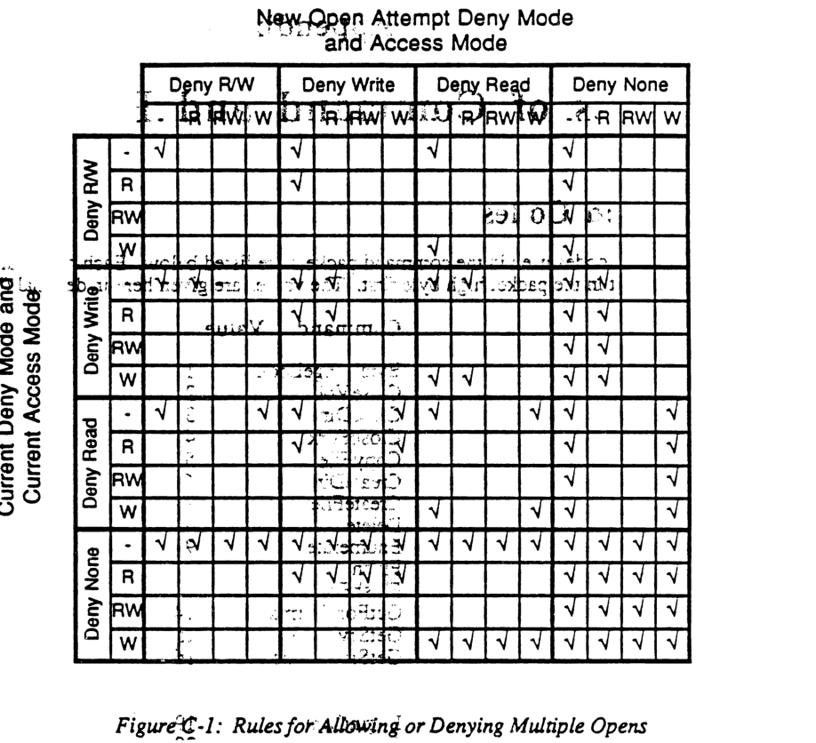

# Appendix C File Sharing Modes

1. TOC
{:toc}

AFP provides much functionality to control the sharing of files, primarily at the Creator/Group/World Access Rights level but also at the time of file fork open. To perform the latter function, the server must enforce the synchronization rules presented below.

When a fork of a file is opened, the user indicates what kind of Access Mode is needed: *Read*, *Write*, *Read/Write*, or *None* (the latter allows no further access to the fork except to close it, yet it is included since it may be useful as a synchronization primitive). In addition, the user indicates to the server a Deny Mode: just what rights should be denied to others trying to open the fork while the current users have it open. Users that subsequently try to open the fork could be denied *None*, *Read*, *Write*, or *Read/Write* access.

An FPOpenFork call could fail for several reasons:
1) The user may not possess the correct rights as Owner/Group/World to allow the desired access. An *AccessDenied* error is returned to the second user.
2) The fork may already be open with a Deny Mode that prohibits the second user's desired access. For example, the first user opened the fork with Deny Mode indicating *Deny Write*, and a second user tries to open the fork for *Write*. A *DenyConflict* error is returned to the second user.
3) The fork may already be open with a Deny Mode that conflicts with the second user's desired Deny Mode. For example, the first user opened the fork for *Write* and *Deny None*. The second user tries to open the fork with Deny Mode indicating *Deny Write*. This request cannot be granted since the fork is already open for *Write*. A *DenyConflict* error is returned to the second user.

Deny Modes are cumulative in that each successful open of a fork "combines" its Deny Mode with previous Deny Modes. That is, if the first open sets a Deny Mode of *Deny Read* and the second sets a Deny Mode of *Deny Write*, the fork's Current Deny Mode (CDM) will be *Deny Read/Write*. *Deny None* and *Deny Read* combine to form a Current Deny Mode of *Deny Read*. Likewise, Access Modes are cumulative: if the first open gets *Read* access and the second gets *Write* access, the Current Access Mode (CAM) is *Read/Write*.

The rules for allowing or denying multiple opens of a fork depend on the Current Deny Mode, the Current Access Mode, and the Deny and Access Modes being requested in a new FPOpenFork call, and are summarized in the table below. A check mark indicates that the new open is allowed, otherwise it is denied.

---

### New Open Attempt Deny Mode and Access Mode

| Current Deny Mode and Current Access Mode | | Deny R/W | | | | Deny Write | | | | Deny Read | | | | Deny None | | | |
|---|---|:---:|:---:|:---:|:---:|:---:|:---:|:---:|:---:|:---:|:---:|:---:|:---:|:---:|:---:|:---:|:---:|
| | | **-** | **R** | **RW** | **W** | **-** | **R** | **RW** | **W** | **-** | **R** | **RW** | **W** | **-** | **R** | **RW** | **W** |
| **Deny R/W** | **-** | √ | | | | √ | | | | √ | | | | √ | | | |
| | **R** | | | | | √ | | | | | | | | √ | | | |
| | **RW** | | | | | | | | | | | | | √ | | | |
| | **W** | | | | | | | | | √ | | | | √ | | | |
| **Deny Write** | **-** | √ | | | | √ | √ | | | √ | | | | √ | √ | | |
| | **R** | | | | | √ | √ | | | | | | | √ | √ | | |
| | **RW** | | | | | | | | | | | | | √ | √ | | |
| | **W** | | | | | √ | √ | | | √ | √ | | | √ | √ | | |
| **Deny Read** | **-** | √ | | | √ | √ | | | √ | √ | | | √ | √ | | | √ |
| | **R** | | | | | √ | | | √ | | | | | √ | | | √ |
| | **RW** | | | | | | | | | | | | | √ | | | √ |
| | **W** | | | | √ | | | | √ | √ | | | √ | √ | | | √ |
| **Deny None** | **-** | √ | √ | √ | √ | √ | √ | √ | √ | √ | √ | √ | √ | √ | √ | √ | √ |
| | **R** | | | | | √ | √ | √ | √ | | | | | √ | √ | √ | √ |
| | **RW** | | | | | | | | | | | | | √ | √ | √ | √ |
| | **W** | | | | | | | | | √ | √ | √ | √ | √ | √ | √ | √ |

Figure C-1: Rules for Allowing or Denying Multiple Opens
