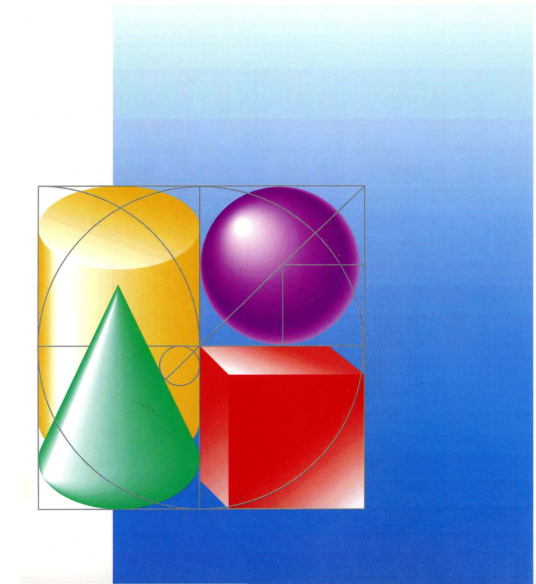

# AppleTalk® Phase 2 Protocol Specification

## *An Addendum to Inside AppleTalk*

APDA™ # C0144LL/A

**Apple Computer, Inc.**
20525 Mariani Avenue
Cupertino, California 95014
(408) 996-1010
TLX 171-576

To reorder products, please call:
Apple Programmers and Developers Association
1-800-282-APDA

Copyright © 1989 by Apple Computer, Inc.
Inc.

All rights reserved. No part of this publication may be reproduced, stored in a retrieval system, or transmitted, in any form or by any means, mechanical, electronic, photocopying, recording, or otherwise, without prior written permission of Apple Computer, Inc. Printed in the United States of America.

© Apple Computer, Inc., 1989  
20525 Mariani Avenue  
Cupertino, CA 95014-6299  
(408) 996-1010

Apple, the Apple logo, AppleTalk, LaserWriter, and Macintosh are registered trademarks of Apple Computer, Inc.

EtherTalk, LocalTalk, and TokenTalk are trademarks of Apple Computer, Inc.

ITC Garamond and ITC Zapf Dingbats are registered trademarks of International Typeface Corporation.

Microsoft is a registered trademark of Microsoft Corporation.

PostScript is a registered trademark, and Illustrator is a trademark, of Adobe Systems Incorporated.

Varityper is a registered trademark, and VT600 is a trademark, of AM International, Inc.

Simultaneously published in the United States and Canada.
