# AppleTalk Phase 2 Protocol Specification June 30, 1989

| Field | Value |
|-------|-------|
| **Source** | AppleTalk_Phase_2_Protocol_Specification_19890630 |
| **Chapter** | 0 |
| **Pages** | 1–24 |
| **Converted** | 2026-04-04 |
| **Engine** | gemini-flash |

---

# AppleTalk Phase 2 Protocol Specification June 30, 1989

## Scope
This document details changes to the AppleTalk protocol suite necessary for AppleTalk Phase 2. AppleTalk Phase 2 is enhancements to the routing and naming services of AppleTalk so as to make possible AppleTalk networks on which more than 254 nodes can reside. Additionally, such networks can, in the presence of a router, be divided into multiple zones. For specifics of the original AppleTalk protocols ("Phase 1") see *Inside AppleTalk*, published by Addison-Wesley.

## Goals
The goal of the AppleTalk Phase 2 effort is to create AppleTalk networks which support more than 254 nodes in a manner that is, to the greatest extent possible, compatible with current AppleTalk implementations and applications. Further goals of the effort are that such networks should operate reasonably without a router, and that, when a router is available, such networks can be sub-divided into multiple zones. Issues of picking the "best" router and of reducing broadcast traffic will also be addressed.

## Non-goal
It is not a goal of the AppleTalk Phase 2 effort to remain compatible with current third-party routers (bridges). Such a goal would lead to many compromises in the Phase 2 architecture. However it is desirable that changes to such routers be minimized.

## General idea
In general, an extended **AppleTalk Network** consists of a number of virtual (non-extended) AppleTalk networks co-existing on the same physical cable. Thus a node is identified not only by its 8-bit (LAP) node ID, but also by its 16-bit (DDP) network number. Instead of 2^8 nodes, there can be, theoretically, up to 2^24.

## Operation without a router
Generally, such large networks will have AppleTalk routers, if only to get to LaserWriters. The current specification attempts to operate without a router so as not to create a potential single point of failure more than for any other reason.

In the absence of a router, upon starting up for the first time (i.e. no information saved in parameter RAM), a node will pick a "network number" (really an extension of its node address) in the **startup range**. This range is specified to be $FF00 to $FFFE (high byte first). The node picks an extended node number using AARP to probe for an address of the form $FFxxyy, where yy is the "node address" part. As before, yy cannot be $00 or $FF, *and in addition we reserve $FE* (as a compatibility aid for some implementations).

After obtaining an address of this form, communication with other nodes on the cable is accomplished as before. AARP is used to obtain the physical node address from the 3-byte extended node address, and then the packet is sent to that physical node. Note that broadcasts can now be of three forms. A **cable-wide broadcast** is addressed to destination network $0000, and received and accepted by everyone. A **network-specific broadcast** is addressed to a specific network number. All nodes will receive this broadcast and must discard it if not intended for them. A third type of broadcast, a **zone-specific broadcast**, is described in a following section.

Note that many extended AppleTalk networks in one organization could be using the same "network numbers" within the startup range, however since there are no routers on any of these, they will not be connected and there will be no conflicts. However, once a router comes up, it is imperative that such network numbers are never exported off the local cable. For this reason, *once a node comes up and acquires a network number in the startup range, it can never communicate through a router — it must be restarted to do so.*

A potential problem exists in the situation where many nodes are starting up concurrently with the first routers (e.g. after a power failure). If the routers take significantly longer to come up than the nodes (which will likely be the case), the nodes could be lead to believe there are no routers and thus need to be restarted almost immediately to communicate on the internet. However, such nodes will almost invariably have been running before on the extended network in an internet situation, and will have acquired network addresses outside of the startup range, which they will have saved in parameter RAM or other long-term storage. They will then AARP on these addresses, and when the router does come up (after suitable confirmation), they will be able to communicate on the internet. The only situation where a router must be brought up first is where nodes are being added to the extended network for the first time, and wish to be able to communicate on the internet.

Note that, until a router appears, all nodes are in zone '*'.

## Operation with a router
Life with a router is more complicated. The router(s) are configured with a network number range for the extended AppleTalk network. The numbers in this range must be unique on the internet, and current conventions about seed routers apply. The routers are also configured with a <u>list</u> of zone names which are valid for that cable.

The extended node number acquiring process occurs in two steps. The node first uses AARP to obtain a unique but potential temporary extended node number for the sole purpose of communicating with a router. If the node is coming up for the first time, this number will be in the startup range. If it has a previous value in pRAM, it will try this first, and then try all other node addresses on this "network," and then, if all else fails, it will proceed to the startup range.

Having obtained this **preliminary** node address, the node proceeds to talk to the router in order to discover information about its environment. It learns from the router the range of valid network numbers for the cable, and confirms that its saved zone name is valid for that cable. If it does not currently have a saved zone name, it can obtain the list of available ones from a router, and pick one in an implementation-dependent manner. 

*Note that, on an extended AppleTalk network, there is no longer an association between network numbers and zone names. Two nodes having the same network number can be in different zones. Zones are associated only with the extended network range as a whole.*

Once a node has obtained the desired information, it can then proceed to AARP for an address within the cable range if it does not already have one. This becomes the node's real address, and is saved in pRAM. Note that, in the normal case, the node's preliminary address will be in the right range, and it will not have to re-AARP.

Sending a packet remains much like the non-extended case. A node determines if the desired destination is on the local cable, and if so obtains the destination node's physical address using AARP and sends the packet out. If the destination node is not on the local cable, AARP can be used to obtain the physical address of a router, and the packet can be sent to that router . This is much like the current DDP's algorithm of comparing the destination network number to THIS-NET and sending the packet to A-BRIDGE if it doesn't match. Instead we compare the destination network number to THIS-CABLE-RANGE (obtained at boot time) and send it to A-BRIDGE if it's not in this or the startup range (note that A-BRIDGE is now a 24-bit quantity). This simple scheme can result in an extra hop for off-cable traffic; a more efficient scheme to choose the "best" router is described in the DDP section.

Routers also provide nodes, at startup, with an additional piece of information known as their **zone multicast address**. This data-link dependent address is based on the zone in which the node resides, and is used to prevent NBP broadcasts from interrupting all AppleTalk nodes on the cable. Nodes register (in a data-link dependent manner) to receive packets sent to this address, and routers direct NBP broadcasts (which are on a zone basis) to this address. This **zone-specific broadcast** (sent to AppleTalk address $0000FF) is received by all nodes in zones assigned to the zone multicast address to which it is sent. As there may be more than one zone per multicast address, NBP must filter the packet by its zone name. Data links not supporting multicast should use the broadcast address as the zone multicast address for all nodes.

### Operational details

(1) **Obtain a preliminary node number.** If there is a saved 24-bit node number of the form "$nnnnyy" in pRAM, use it to send AARP probes. If someone is already using this number, try all other possibilities for "yy" except $00, $FE, $FF. Keep "nnnn" the same until all possibilities are exhausted (net nnnn is probably valid for the cable). If all possibilities are exhausted, start trying random network numbers in the startup range (or, if the presumed cable range has also been saved in pRAM, which is allowed but not required, try other networks in that range).

If there is no saved 24-bit node number, proceed to use AARP to obtain a number in the startup range.

(2) **Determine network information.** Having obtained a preliminary node number, issue, using cable-wide broadcasts, a ZIP GetNetInfo. This request includes, if available, the zone in which the node wants to reside, obtained from long term storage. Retransmit this until a router responds or timeout. The response will provide various pieces of information: the 24-bit node address for the initial A-BRIDGE (or the fact that no router exists); the range of valid network numbers for this cable (THIS-CABLE-RANGE); and the zone multicast address to use for the requested zone name (or the fact that such a zone name is not valid for the cable). Additional information will also be provided if the zone name is invalid.

Note that if the node's obtained pRAM address is not in the cable or startup range, the router will not be able to respond in a directed manner to the ZIPGetNetInfo. The router, however, can determine that this is the case by looking at the packet's source node address, and if this address is not valid for the cable from which the packet was received, can broadcast the response on that cable. To allow for off-cable requests, the router should only broadcast the response if the request was sent via a cable-wide broadcast.

(3) **If there is no router:** set a flag indicating this fact and use the preliminary node address as the permanent node address. Ignore any desired zone name — the node is, for now, in zone '*' and has no zone multicast address. If a router comes up later, the node will still be able to communicate with the internet as long as this permanent node address is still in the range for the cable (which it probably is if it came from pRAM and the node has not changed cables). If it's not, the node may be in trouble. See the section on "If a routers comes up later" for details.

(4) **Make sure our address and zone are valid for the cable.** If the preliminary node number is either in the startup range or in a range which is not valid for the cable, use AARP to obtain a permanent address in the cable range, and save it in pRAM.

If our desired zone name is not valid for the cable, or we did not have an initial zone name, it is possible to obtain the list of zones available on the cable from a router using the new ZIP GetLocalZones request, and pick one in an implementation dependent manner (on the Mac, a dialog box could be put up asking the user to choose one). The ZIP GetNetInfo could then be reissued to obtain our zone multicast address.

Some nodes, however, may not be able to immediately query the user for the desired zone name. For this reason, if the requested zone name is invalid, the GetNetInfo packet also contains the zone name and zone multicast address of the zone on that cable which should be used for all such nodes until they are able to determine their zone name through some other means. This zone is known as the **default zone**.

Note that if a node does not wish to register an NBP name, it does not need to pick a zone at all. Also, a common sub-class of extended networks will be those with just one zone name. _If a node is on an extended network with just one zone name, the user should never be asked to select that node's zone._ In other words, things should look to the user just as they do on a non-extended network. Thus a configure-less system can be maintained if the multiple zone per network feature is not required.

Once our zone multicast address has been acquired from a ZIP GetNetInfo call, register to receive packets sent to that address.

### (5) If a router comes up later:

We would like to be able to communicate on the internet without restarting if at all possible. However if our node number is in the startup range, this is impossible since such network numbers should never be exported off the local cable (other extended networks may be using the exact same numbers). Communication on the internet is also impossible if our node number is not in the cable range, since it may well conflict with a network number in use somewhere else on the internet (probably on the extended AppleTalk network our node was last on). The following is the procedure a node should use when detecting the first router (via RTMP packets).

If the node's address is in the startup range, completely ignore the presence of the router. Possibly alert the user to the fact that he needs to restart to be able to access the internet. Continue to talk to nodes on the local cable in the same way. Never send anything to A-BRIDGE for forwarding or name lookup. The node remains in zone '*', but will continue to see everyone on the cable regardless of their zone (since it will still broadcast NBP lookups). Other nodes on the cable, not in the startup range, will not be able to see startup-range nodes in any zone, since no zone exists corresponding to the startup range (the startup range has no zone multicast address). This view is consistent with that of nodes outside the cable, which also cannot see startup-range nodes.

If the node's address is not in the startup range, upon discovering the first router, the node needs to determine if its address is in the range for the cable as defined by the router. This information can be obtained from the header of the RTMP packet which informed the node of the router's existence.

If the node is in the cable range, it can verify that its desired zone name is valid for the cable, obtain its zone multicast address through a ZIPGetNetInfo request, and register on that address. If its zone name is not valid for the cable, it could either issue a ZIPGetLocalZones and query the user or use the default zone name for that cable.

If the node determines its address is not in the cable's range it should behave exactly as if its address was in the startup range. However nodes which had been talking to that node, who are in the valid cable range, now have a problem. Since they have now set THIS-CABLE-RANGE appropriately, they believe that node is no longer on the local cable and will try to get to it through the router (which will either ignore the packet because its network number is unknown, or route it on to somewhere completely wrong). Thus, under the current scheme, a node which comes up in an invalid cable range (due to the absence of a router at startup) will lose connections with nodes that come up in the valid range once a router appears. Note that nodes in the valid range will still be able to communicate with nodes in the startup range.

(6) **If the last router goes down.** The normal aging mechanism should prevail, however the node should also age THIS-CABLE-RANGE, so the situation reverts back to as if no routers had been available at startup, and new nodes coming up not in the startup range can still be spoken to by old nodes. Likewise, the node's zone name should revert back to '*', since there is now no way of obtaining a zone list for the cable (note that this could cause some name conflicts).

## Protocol details:

### Data-link specifics
Data links must support some form of broadcast. Preferably, this is actually a multicast to what is defined as the **AppleTalk broadcast address**. Data links that support additional multicast addresses should define a number of these to be used as zone multicast addresses. AppleTalk nodes should be able to receive packets sent to the AppleTalk broadcast address, their data link address, and their zone multicast address.

### Determining zone multicast addresses
It is assumed that a data link provides a well-known, ordered list of zone multicast addresses a[0] through a[n-1]. Each zone on that data link must be mapped to one of these addresses. This mapping is done through a simple hash function, details of which are specified by ZIP.

### AppleTalk packet formats:
AppleTalk packets will be sent using 802.2 Type 1 (connectionless) service on data links that support it. Packets will be sent using the Sub-network access protocol (SNAP), i.e. they will be sent to SAP $AA. The SNAP type for AppleTalk will be $080007809B (this is Apple's company code followed by the current EtherTalk protocol type). The data part of the packet will start with the DDP header (long format only!). There will be no ALAP-style header.

### AARP
AARP packets will also be encapsulated in 802.2 where supported, using SNAP and protocol type $00000080F3. AARP will never try to pick AppleTalk addresses of the form $nnnn00, $nnnnFF, or $nnnnFE. When probing, AARP should send 10 probes, at one-fifth second intervals. AARP broadcasts requesting AppleTalk node address mapping should be sent to the AppleTalk
broadcast address.

The exact sequence in which AARP tries 24-bit addresses while probing is not specified here. Subject to the constraints of the range within which AARP is choosing the address, it is free to choose addresses in any "random" order.

### *DDP
DDP on extended networks provides an additional service, for use
primarily by the NBP routing algorithm. A DDP destination ID of the form
$nnnn00 is allowed and means "any router connected to a network whose range
includes nnnn (or whose net number is nnnn)." Packets with such an address
are forwarded via the normal DDP forwarding mechanism until they reach such
a router. The router then delivers the packet to itself instead of to node
$nnnn00 on that cable ($00 is not allowed as an actual AppleTalk node ID).

DDP in routing nodes must provide the router client with the ability to send a
packet to a specific zone multicast address. This ability is used by NBP. Such
ability should *not* be provided in non-routing nodes.

An additional detail of DDP routing relates to network-specific broadcasts.
Routers on extended networks need to be sure to correctly differentiate be-
tween directed broadcasts, which should be forwarded, and network-specific
broadcasts received from their directly connected networks, which should be
discarded. This can be done by examining the destination network of the pack-
et in cases where the destination node ID is $FF. If the destination network is
within the network range of the port through which the packet is received, the
packet should be discarded; otherwise it should be forwarded.

DDP in non-routing nodes on extended networks should always accept packets
addressed to destination network number zero, node ID $FF (these are cable-
wide or zone-specific broadcasts). However DDP should not accept packets
destined for network zero and any other node ID (even the node's own).

Details for a simple DDP in non-routing nodes are specified in a previous
section. However it is desirable that nodes wishing to do so be able to
implement the intelligence necessary to forward packets to the "best" router,
so as to eliminate the extra hop that occurs when packets are sent to a router
not on the shortest path to the destination. This specification does not
attempt to mandate such a strategy, but does present the following optional
method of implementing a "best routing" DDP in non-routing nodes.

When a packet comes in from an off-cable node, DDP looks at the data-link level source. This is the address of the last router on the route from the network that node was on. Sending packets to this router to get to that network should generally be the optimal route in terms of hops (or at least a co-optimal route). DDP maintains a cache of "best routers" for recently heard-from networks, and sends packets to those routers for forwarding to those networks. If there is no cache entry, DDP just sends the packet to any router — a response will probably come back and an entry be made in the cache.

Note that best-router cache entries will have to be aged fairly quickly so that when a router goes down an alternate route will be adopted before connections break.

### RTMP stub

AppleTalk Phase 2 specifies changes to a node's RTMP stub if the node resides on an extended network. First, the router aging time is reduced to 50 seconds. Also, when a router ages out, the RTMP stub must expand THIS-CABLE-RANGE back to 1-$FFFE, and set the node's zone name back to '*'.

Finally, the processing of incoming RTMP packets, for purposes of resetting the router aging timer and setting A-ROUTER, needs to be specified. If A-ROUTER is non-zero (i.e. the node knows about a router), the RTMP stub should reject all RTMP packets unless the packet's first tuple exactly matches the node's values for THIS-CABLE-RANGE. Thus, if a node's cable range were 3-4, it would not process a packet with an initial tuple range of 3-6.

If, however, A-ROUTER is zero (no router is known about), the RTMP stub determines whether to accept the packet based on if the packet's first tuple indicates a range in which the node's "network" address is valid. If the node's "network number" is not in the range indicated by this first tuple, the packet should also not be processed. Otherwise, the packet is accepted, THIS-CABLE-RANGE is set to the value from the first tuple and A-ROUTER is set to the sender's address.

Note that this scheme allows a cable range to be expanded without restarting all the nodes on that cable. If a range is originally 3-4, but the routers are reconfigured to set it to 3-6, nodes will age out the 3-4 value of THIS-CABLE-RANGE (since none of the routers would be sending it) and then set it to 3-6.

### RTMP

RTMP data packets, as sent on both extended and non-extended AppleTalk networks, now contain network ranges as opposed to network numbers. Tuples will be of two forms: either a network number or a network range. The first tuple in packets sent on extended networks is the range for the cable on which it is sent (so nodes hearing this packet can determine their cable range). This tuple may be repeated later in the packet.

Routers must maintain their routing table on a range-by-range basis for extended networks. Each range would have a list of zone names associated with it.

A supplement to the routing table update process must be specified to handle the case of network range mismatch. With single network numbers, a routing table entry, when searched for, would be either found or not found. However, what happens when a network range is searched for and a related range is found which includes some, but not all of the searched-for range? For example, if an incoming RTMP packet contains a tuple indicating network range 3-57, what happens if the current routing table contains an entry for range 2-22 (or 56-59 or 2-60 or 5-8)? All of these conditions clearly indicate an internet configuration error, but how should the new tuple be processed?

In an effort to minimize the effect on the internet of a newly misconfigured router being brought online, the following is specified. If an incoming RTMP packet contains a tuple for which there is no exact match in the routing table (i.e. no entry with the same starting and ending network numbers), but that tuple does overlap with part of some entry's range, that tuple should be disregarded. For purposes of this discussion, non-extended network numbers should be considered as ranges of one.

Note that on a large backbone network, with the current RTMP, there could be many routers, each broadcasting out a large, multi-packet routing table every 10 seconds. In an effort to significantly reduce this traffic, the RTMP routing-table-sending algorithm must be modified. AppleTalk Phase 2 specifies a technique known as "split horizon" for use in sending routing tables (on both extended and non-extended networks). As can be seen in the picture below, it is never useful for a router B to tell a router A that it can get to net n when the path used by B would be to go through A itself (A would just ignore this tuple anyway). Likewise, it is not useful for B to tell any other neighbor routers (C, D) about this information either. Thus, especially on a backbone, most of the routing table need not be sent out at all.


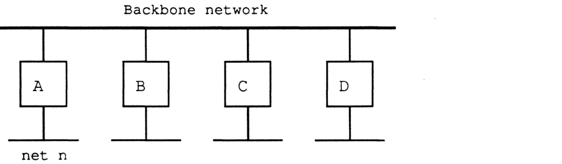

To implement split horizon, a simple modification is made to the RTMP routing-table-sending algorithm. Specifically, when sending the table out a particular port, omit all entries whose next IR is on the network to which that port is connected. That's it. This simple modification not only greatly reduces traffic on a backbone, but also often eliminates the "counting to infinity" problem seen when a network becomes unreachable (the case where each of two routers think they can get to that network through the other).

Split horizon does, however, have an undesired side-effect, which is that it now may take longer for a network to "age out" of the internet once it becomes unreachable (this is especially true in internets with a large diameter). More importantly, it may also take longer for an alternate route to be adopted if one is available. This behavior occurs because each router in a long path ages out the network sequentially.

To help rectify this situation, RTMP also must use a procedure which we call "notify neighbor." Under "notify neighbor," whenever a routing table's entry state is "Bad", instead of omitting that entry from the broadcasted routing table, the entry is sent with a distance of 31. This entry indicates to receiving routers that the entry's network is no longer reachable through the sending router, and that an alternate route, if available, should be adopted. This entry is only sent if it would not otherwise be eliminated by split-horizon processing.

Upon receiving a tuple with an entry of distance 31, *if the router sending that tuple was the forwarding router for the associated network, the state of that entry should immediately be set to "Bad"*. In this way, the fact that a network is unreachable will propagate at the RTMP-table-sending rate. Note that to minimize the effect of lost packets, the time for the "Bad" state is extended from one Validity timer to two Validity timers (i.e. from 20 to 40 seconds).

Routers which are knowingly going down or deactivating a port should, as a courtesy, use "notify neighbor" to inform other routers of this fact.

### NBP
NBP in non-routing nodes on extended AppleTalk networks must now verify that a LkUp packet is intended for the zone on which the node resides or '*' (i.e. NBP must match object, type and zone). This is because more than one zone may correspond to the same zone multicast address (in fact, if the data link doesn't support multicast, all zones will correspond to the same zone multicast address). Thus NBP must maintain a variable THIS-ZONE.

In addition, NBP on extended networks should never send out BrRq's for zone '*', since the router will have no way of determining what '*' is without asking the node itself (since there is no correspondence between network number and zone name). However, in the absence of a router, NBP should always broadcast LkUps to zone '*'.

NBP in routers changes _even if they are only connected to non-extended networks_. Routers must now process NBP packets both at the beginning of their journey and at the end. A router receiving a BrRq must first change any zone name of '*' to the node's actual zone name (note that this can only happen if the node is on a non-extended network). The router then changes the packet type from BrRq to a new packet type, FwdReq (forward request). Then, for each range in the routing table which contains the desired zone, the router uses DDP to send a FwdReq packet to the NIS at address $nnnn00, where nnnn is the first network in that range.

The packet will proceed through the internet until it gets to the NBP process in a router directly connected to the intended destination network. The NBP process then changes the packet type to LkUp, and sends the packet as a zone-specific multicast on the intended cable. Specifically, if the packet is intended for an extended network, NBP changes the destination address to $0000FF, determines the multicast address associated with the intended zone, and calls the DDP for the intended network to send the packet to that zone multicast address. If the packet is intended for a non-extended network, NBP just changes the destination address to $nnnnFF and broadcasts the packet on that network.

Note that routers receiving BrRqs for zones on networks to which they are directly connected need to also broadcast the appropriate LkUp packet on those networks. Again, on extended networks, they should use the appropriate zone multicast address.

Routers on non-extended networks which receive BrRq's for zone '*' and have not yet discovered the zone name associated with the sender's network should broadcast a LkUp packet back out on that network with a zone name of '*'. They should not, however, send out any FwdReq packets.

NBP has also been enhanced to provide additional wildcard support. The character '≈' ($C5) is now reserved in the object name and type strings and used in a lookup to mean "a match of zero or more characters." Thus '≈abc' matches 'abc', 'xabc', 'xxxabc', etc. 'abc≈' matches 'abc', 'abcx', etc., and 'abc≈def' matches 'abcdef', 'abcxdef', etc. At most one '≈' is allowed in any one string. A single standalone '≈' has the same meaning as a single '=', which must continue to be accepted also. The '≈' character has no special meaning in zone names. Clients of NBP must be aware that "old" nodes may not process this new wildcard feature correctly.

### ATP
Strictly speaking, no changes at all are necessary to ATP for the above architectural changes.

Clients currently using and implementing ATP will continue to work under AppleTalk Phase 2 just as they do now. However we are taking this opportunity to provide additional flexibility with ATP XO service.

There are 3 unused bits in the Command/Control Information field of the ATP header. For XO request packets only, these 3 bits are used as an indicator as to the length of the TRel timer the other side should use. In this way, the requester can indicate to the responder an approximate measure of how long to wait for the TRel. If these bits are zero (as they are now), the TRel timer remains at 30 seconds. If these bits are one (001), the TRel timer is set to one minute. Two (010) means 2 minutes, three (011) means 4 minutes and four (100) means 8 minutes. Other values are reserved.

An ATP requesting-end client could use the echo protocol, or other means, to estimate how long it could take for a TRel to be received, and set this timer value accordingly. This value also, however, depends on the client's retransmission rate: if retransmitting slowly, the TRel timer should be set higher, in case a retransmitted request is lost. Certain session level protocols, such as PAP and ASP may wish to set this timer value to the value of their connection timer. Clients of ATP must be aware that "old" nodes may not process this new timer feature correctly.

### ZIP
ZIP provides many additional functions in the new architecture. Each of these is detailed below.

**Assignment of zone multicast addresses:** upon receiving a ZIPGetNetInfo request, the ZIP process in a router verifies that the specified zone name is valid for the cable. If it is, ZIP obtains the associated multicast address, and returns it in the reply.

To obtain the zone multicast address, ZIP first converts the zone name to upper case (since zone names are case-insensitive). This conversion function, the exact one used by the Macintosh, is specified in *Inside Macintosh* and also *Inside AppleTalk* (appendix D). The router then obtains a number, h, in the range 1-$FFFF, associated with this zone name by performing the DDP check-sum algorithm on each byte of the zone name (excluding the length byte). This number is passed to the data link, which is assumed to provide n multicast addresses a[0] through a[n-1]. The multicast address for that zone, returned by the data link, is a[h mod n].

Note that returning the zone multicast address in a ZIPGetNetInfo reply could be considered unnecessary. Since the hashing algorithm is well-defined, each node could compute the hash of its zone name and pick the associated zone multicast address for the link on which it resides. However having routers return this information provides more flexibility in the future (i.e. it is much easier to change the hashing algorithm).

ZIP `GetNetInfo` and ZIP `NetInfoReply`, supported only on extended networks, look much like ZIP query and ZIP reply. `GetNetInfo`'s should be sent (or broadcasted if no routers are known about) to the ZIS, and should be retransmitted if no response is received. NetInfoReply's are directed back to the requestor, unless the router determines that the requestor has a "network number" that is invalid for the cable on which the requestor resides. In this case, the router uses a cable-wide broadcast to send the response back out that cable. Note that the NetInfoReply contains the zone name copied from the request, so the requesting node can be sure the response was intended for him. The requesting node should also be sure to discard "unsolicited" `GetNetInfo` replies, which may be sent later, for example, by a busy router.

`GetNetInfo` is an example of a **port-dependent request**. Like the RTMP request packet, such a request asks for information associated with a specific port. This port is defined as the port connected to the network to which the packet is addressed. The response is sent back to the internet address of the requester where possible. If, however, the request was sent using a cable-wide broadcast and the requester's "network number" is not on that cable, the response should be cable-wide-broadcasted back out the port through which it was received.

If the zone requested by the `GetNetInfo` is not valid for the cable, the response contains a flag indicating this fact and also the default zone name for that cable. The default zone name for a given cable is set as part of the seed information in a router's port descriptor for extended networks. It must be one of the zones in that cable's zone list. Non-seed routers discover this information as part of their startup process through a `GetNetInfo` request.

A router should not respond to a `ZIPGetNetInfo` request if it does not yet have all the zone information associated with the requested network (which can only happen if it is not a seed port for that network).

**ZIP query and response**: the ZIP query/response process becomes more complicated due to the fact that an extended network can now have more zones than can fit in a single packet. ZIP query packets remain exactly the same. The "network number" field for an extended network is set to the first network number in that network's range. Multiple networks can still be included in one packet (both extended and non-extended networks can be mixed).

ZIP response packets remain exactly the same also, in all cases where a network's zone list will fit in one packet (17 maximum size zone names, or 36 zone names with an average length of 16 bytes). For extended networks, the "network number" field is set to the first network number of the range in each zone name for that network. Response packets again can contain multiple network entries, providing an entry is completely contained within the packet.

If a network's zone list cannot fit in one ZIP reply packet, a series of new packets are returned. These packets, called extended ZIP reply packets, have a new ZIP command byte (with a value of 8). Their format is the same as a ZIP reply packet, except that the "network count" field has a new meaning. Instead of indicating the number of network/zone tuples in the packet (which can be determined by reading entries until the packet ends), this field indicates the total number of zones for the extended network. It will be the same for each extended ZIP reply packet for a given network and has a maximum value of 255. The queried router sends as many of these packets as is necessary. The querying router collects all the responses, and can determine if any have been lost. If any are lost, **he asks for all the information again** (i.e. he resends a ZIP query for that network).

Optionally, a queried router could send an extended ZIP reply for every extended network, even if the zone list could be carried in a non-extended reply. This would just mean that replies for multiple networks could not be carried in the same ZIP reply packet.

Note that until a router has all the zone information for a given network, he responds to other routers' ZIP queries for that network as if he had none of the information.

Care must be taken when broadcasting ZIP queries on extended networks (e.g. to get zone information for a non-seed port), since if there is more than one router on that network it may be difficult to sort out one complete response set.

### ZIP ATP requests

ZIP `GetMyZone` does not make sense on an extended network, since the node already knows its zone name and the router could not determine it from the node's address anyway.

ZIP `GetZoneList`, which uses ATP, should remain exactly the same, but must be sent to the full 24-bit A-BRIDGE address on extended networks. ZIP `GetLocalZones` looks exactly like `GetZoneList`, except with a different command byte in the ATP header. A router on a non-extended network should consider this request to be a GetMyZone request and respond accordingly.

#### Changing zone names

On extended networks, nodes must be made aware of changes made to the zone name of the zone in which they reside, since they do their own NBP filtering. Nodes may also need to be given a new zone multicast address.

Nodes on extended networks maintain a ZIP stub on the ZIS. A node's ZIP stub listens for a new ZIP Notify packet, which indicates a change of zone name. The ZIP Notify packet, which is sent via a zone-specific broadcast to the ZIS, contains the old and new zone names and the new multicast address. Nodes receiving such a packet would check to see if they are in the zone being changed. If so, they would change their zone name to the new one (by changing both THIS-ZONE and the copy of it in long term storage), and register on the new multicast address.

This proposal does not attempt to specify the method through which zone names associated with active networks are actually changed. The current process of ZIP takedown and bringup is deemed unacceptable for large networks. ZIP takedown and bringup is not a part of AppleTalk Phase 2, and such packets should be ignored by all AppleTalk Phase 2 routers.

Changing a zone name for a given network involves not only informing the routers (and other nodes) connected to that network, but also informing every router on the internet of that change. AppleTalk Phase 2 removes this function from ZIP and delegates it to network management protocols, to be documented elsewhere. Network management already needs to be aware of all routers on the internet, and can also perform any authentication desired for the zone name change. Thus no attempt is made here to indicate exactly how this "all-routers" broadcast is performed or what its format is. A router receiving such a request would change the indicated zone name(s) for the specified network in its routing/zone table. Additionally, if it is directly connected to and a seed router for that network, it would also make the change in long term storage. Note that at least one such router must also send out a ZIP Notify packet on that network, if it is an extended network.

In the absence of network management software, zone name changing can still be performed by taking down all the routers connected to a given network, reconfiguring the seed routers, and restarting everything.

### Router startup

Both seed and non-seed routers should go through a given startup process for each port to which they are connected. For seed routers this is a **verification** phase; for non-seed routers this is a **discovery** phase. This process should include verifying/discovering the network number or range for that port, the zone name or list for that port, and, for extended ports, the default zone. For a seed port, if the verification fails (i.e. their is a conflict), the router should not use the seed information for that port and should alert the network administrator in some way. For a non-seed port, if no seed routers are available on that port's network, the discovery phase must be postponed until the receipt of an RTMP packet. In this case, the router should not function on that port, but should continue to function correctly on other ports.

## Packet formats

### AppleTalk and AARP:

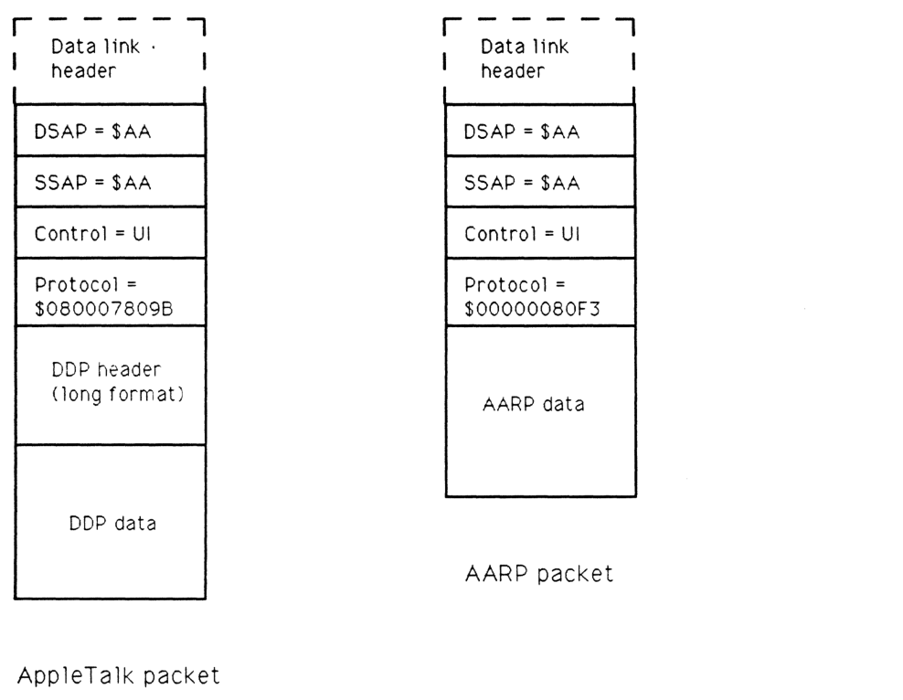

#### AppleTalk packet

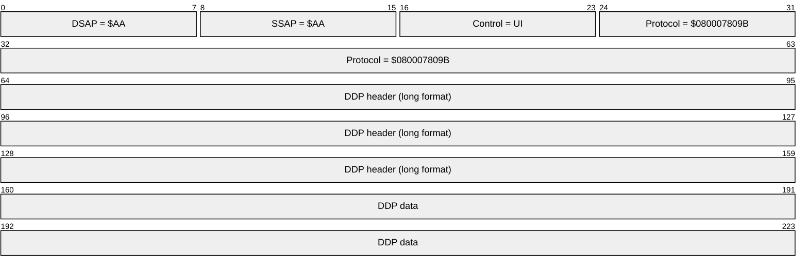

| Field | Bit offset | Width (bits) | Description |
| :--- | :--- | :--- | :--- |
| DSAP | 0 | 8 | Destination Service Access Point, set to $AA for SNAP |
| SSAP | 8 | 8 | Source Service Access Point, set to $AA for SNAP |
| Control | 16 | 8 | Control field, set to UI (Unnumbered Information) |
| Protocol | 24 | 40 | Protocol identifier, $080007809B for AppleTalk Phase 2 |
| DDP header | 64 | 96 | Datagram Delivery Protocol long format header |
| DDP data | 160 | Variable | Application data |

#### AARP packet

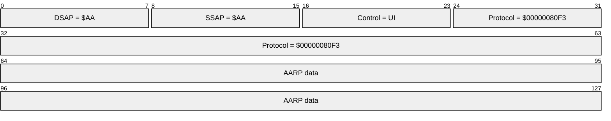

| Field | Bit offset | Width (bits) | Description |
| :--- | :--- | :--- | :--- |
| DSAP | 0 | 8 | Destination Service Access Point, set to $AA for SNAP |
| SSAP | 8 | 8 | Source Service Access Point, set to $AA for SNAP |
| Control | 16 | 8 | Control field, set to UI (Unnumbered Information) |
| Protocol | 24 | 40 | Protocol identifier, $00000080F3 for AARP |
| AARP data | 64 | Variable | AppleTalk Address Resolution Protocol data |

### DDP
DDP packet format remains the same; only the long DDP header format is used. A destination network number of $0000 is accepted by all nodes receiving the packet.

### RTMP
RTMP data packets on extended networks are sent to destination address `$0000FF` using a cable-wide broadcast. The "sender's network number" field always indicates the high 16 bits of the sender's address. The "sender's node ID," always 8 bits on an extended network, indicates the low 8 bits of that address. *On both extended and non-extended networks*, each tuple has a flag indicating whether it is a six byte tuple (range start, distance, range end, and a $82 byte) or a three byte tuple (net number, distance). Tuples for extended networks with a range of one should still be sent as network range tuples.

The RTMP header of packets on both extended and non-extended networks is expanded to include additional information. On extended networks it includes a tuple which indicates the network range of that network. This tuple contains a "distance" of zero and the version number of RTMP being used, which for AppleTalk Phase 2 is $82. On non-extended networks the header includes two bytes of zero (to keep tuple-alignment the same as old RTMP's), followed by the version number of $82. Half-links should always be considered non-extended networks for purposes of sending RTMP packets.

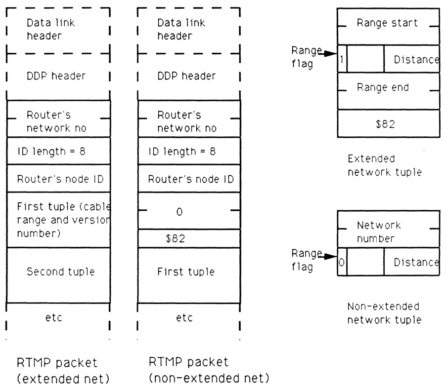

#### Extended network tuple

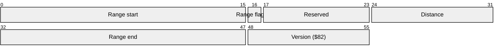

| Field | Bit offset | Width (bits) | Description |
|---|---|---|---|
| Range start | 0 | 16 | The starting network number of the network range. |
| Range flag | 16 | 1 | Set to 1 to indicate an extended network tuple. |
| Reserved | 17 | 7 | Reserved bits. |
| Distance | 24 | 8 | The hop count to the network range. |
| Range end | 32 | 16 | The ending network number of the network range. |
| Version | 48 | 8 | The RTMP version number (set to $82 for AppleTalk Phase 2). |

### Non-extended network tuple

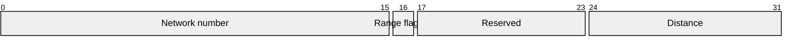

| Field | Bit offset | Width (bits) | Description |
|---|---|---|---|
| Network number | 0 | 16 | The AppleTalk network number. |
| Range flag | 16 | 1 | Set to 0 to indicate a non-extended network tuple. |
| Reserved | 17 | 7 | Reserved bits. |
| Distance | 24 | 8 | The hop count to the network. |

RTMP request packets remain the same. RTMP responses on extended networks should include the initial cable range tuple. All RTMP responses should always be sent back to the requester's socket (not necessarily socket 1). RTMP Route Data Request (RDR) packets, as proposed in the July 5, 1988 document "Proposed RTMP Extension," must change slightly to account for split horizon processing. A command field of 2 indicates to perform normal split horizon processing (note that this is thus a port-dependent request); a command field of 3 indicates to return the entire table (useful for network management). The text of this RDR document is reproduced in an appendix.

### NBP
NBP packet formats remain the same, however a zone name of '*' in BrRq's is not allowed on extended networks if a router is active. The value for a FwdReq packet is 4. AppleTalk Phase 2 also specifically disallows the use of a character with value $FF as the first byte in an NBP object, type or zone string. This is for future flexibility.

### ZIP
ZIP `GetNetInfo` is sent as a cable-wide broadcast to the ZIS when a node is first coming up, or can be directed to a router if one is known. The response is directed to the sending node and socket, unless the router determines the requester has a "network number" which is invalid for the cable on which he resides, in which case the response is cable-wide broadcasted. In either case, the response contains the cable range followed by a copy of the zone name from the request, so it can be matched with the request. The response then contains a zone multicast address, preceded by its length. If the request's zone name was valid, this address is the zone multicast address for that zone. If the zone name was invalid (or NIL), this address is the zone multicast address of the default zone for that cable, whose zone name immediately follows that address.

The response also contains a number of flags. These flags indicate (1) whether the zone name was valid or not, (2) if there is only one zone name for this cable (indicating there is no need to issue a GetLocalZones to find it out), and (3) if the link does not support multicast (in which case the multicast length in the packet will be set to zero).

A `ZIPNotify` packet, which is sent to the ZIS using a zone-specific broadcast, contains the old zone name, the new zone name and the new zone multicast address. It looks just like a ZIP GetNetInfo reply. The ZIP command code is 7. The "zone invalid" flag will never be set. The first zone name is the old one; the second zone name is the new one. The network number fields are unused.


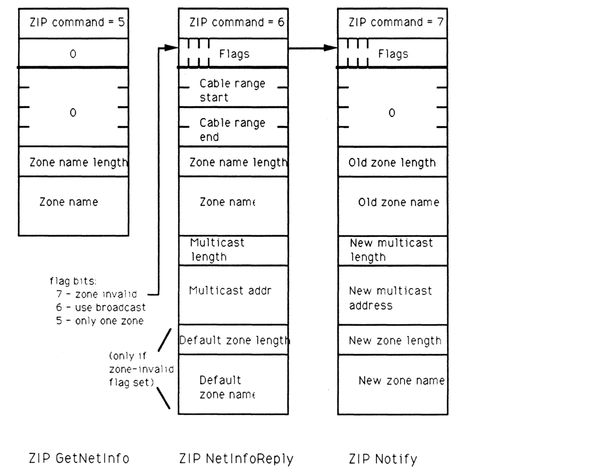

#### ZIP `GetNetInfo`

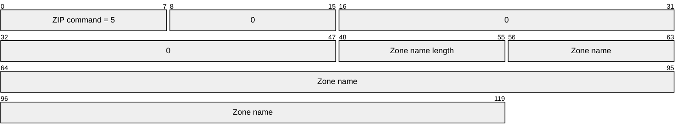

| Field | Bit offset | Width (bits) | Description |
| :--- | :--- | :--- | :--- |
| ZIP command | 0 | 8 | Command code = 5 |
| Unused | 8 | 8 | Reserved, set to 0 |
| Unused | 16 | 32 | Reserved, set to 0 |
| Zone name length | 48 | 8 | Length of the following zone name string |
| Zone name | 56 | Variable | The ASCII name of the zone |

#### ZIP `NetInfoReply`

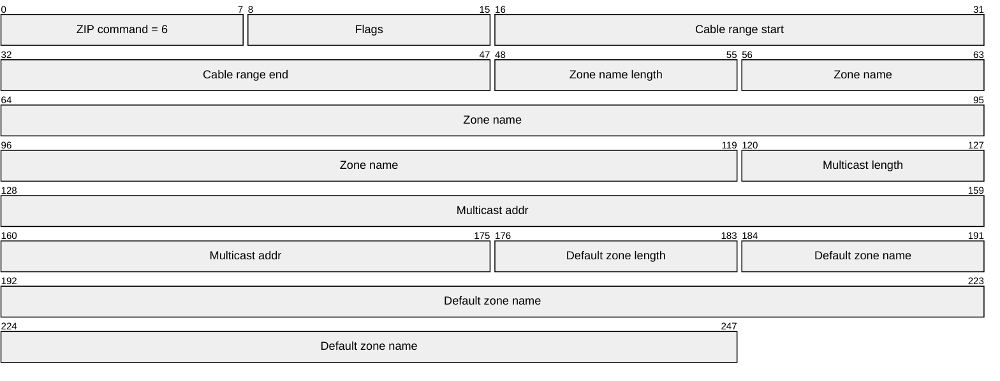

**flag bits:**
7 - zone invalid
6 - use broadcast
5 - only one zone

| Field | Bit offset | Width (bits) | Description |
| :--- | :--- | :--- | :--- |
| ZIP command | 0 | 8 | Command code = 6 |
| Flags | 8 | 8 | Bit 7: zone invalid; Bit 6: use broadcast; Bit 5: only one zone |
| Cable range start | 16 | 16 | Start of the AppleTalk cable range |
| Cable range end | 32 | 16 | End of the AppleTalk cable range |
| Zone name length | 48 | 8 | Length of the zone name |
| Zone name | 56 | Variable | The zone name |
| Multicast length | Variable | 8 | Length of the multicast address |
| Multicast addr | Variable | Variable | The multicast address to use |
| Default zone length | Variable | 8 | Length of the default zone name (present only if zone-invalid flag is set) |
| Default zone name | Variable | Variable | The default zone name (present only if zone-invalid flag is set) |

#### ZIP Notify

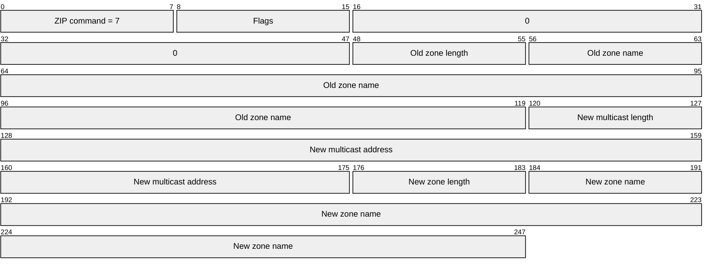

| Field | Bit offset | Width (bits) | Description |
| :--- | :--- | :--- | :--- |
| ZIP command | 0 | 8 | Command code = 7 |
| Flags | 8 | 8 | Reserved flags |
| Unused | 16 | 32 | Reserved, set to 0 |
| Old zone length | 48 | 8 | Length of the old zone name |
| Old zone name | 56 | Variable | The name of the old zone |
| New multicast length | Variable | 8 | Length of the new multicast address |
| New multicast address | Variable | Variable | The new multicast address |
| New zone length | Variable | 8 | Length of the new zone name |
| New zone name | Variable | Variable | The name of the new zone |

ZIP GetLocalZones looks just like ZIP GetZoneList, but has a command byte in the ATP header of 9. The same algorithms for obtaining the full list apply.


## Appendix 1: Copy of "Proposed RTMP Extension, July 5 1988"

As defined in *Inside AppleTalk*, RTMP is provided to enable communication in an internet environment. Its use is primarily for AppleTalk internet routers. Normal workstations use an *RTMP Request* to "learn" about the existence of routers on a directly connected AppleTalk network. When a router receives one of these requests, whether broadcast or directed, it responds directly to the originating node's RTMP socket with an *RTMP Response*, which serves to identify both the network number and node-id of the router to the requester. Once a workstation knows these values, it is capable of carrying out internet communications.

During normal router operations, information stored in each router is periodically broadcasted to inform other routers of the shortest routes for networks, as well as the appearance of new networks. This robust protocol affords great reliability and ease-of-use of Appletalk internets.

It is also useful to routers and network management software to obtain routing information from any router on-demand. This information can be used for a variety of purposes. To accommodate this need, the *RTMP Request* has been extended to form a new datagram which is called *RTMP Route Data Request* or RDR. This request datagram is really a simple extension to the normal *RTMP Request*. The difference between an *RTMP Request* and an RDR is in the value of the **Command** field, which is either 1 or 2 respectively.

Upon receiving an RDR, a router responds by sending its routing data directly to the internet address (including the source socket) of the requesting node. An interested node can therefore obtain routing information by opening a socket and sending an RDR through it to the interesting router.

The router returns the data to the requester's source socket using DDP datagrams in the form of special *RTMP Data Packets*. Normally, *RTMP Responses* and broadcasted *RTMP Data Packets* are sent to the well-known RTMP socket (1). An *RTMP Data Packet* in response to an RDR is sent to the requester's source socket.

Routing information may require multiple response datagrams. Since DDP is used to transmit the response(s), the requester should not assume that all responses will be received (especially if the responding router is on another network). Note that a full response datagram contains 194 routing tuples, and that a tuple never spans datagrams.


## Appendix 2: Addresses, etc. used in EtherTalk and TokenTalk

This appendix enumerates the specific multicast addresses used by EtherTalk 2.0 and TokenTalk for the AppleTalk broadcast address and the various zone multicast addresses. It also lists the SNAP protocol discriminators for AppleTalk and AARP packets.

### AppleTalk broadcast address:

TokenTalk: $C00040000000
EtherTalk: $090007FFFFFF

### Zone multicast addresses:

TokenTalk (19 addresses):

```
$C00020000000 (this is a[18]),
$C00010000000, $C00008000000, $C00004000000, $C00002000000,
$C00001000000, $C00000800000, $C00000400000, $C00000200000,
$C00000100000, $C00000080000, $C00000040000, $C00000020000,
$C00000010000, $C00000008000, $C00000004000, $C00000002000,
$C00000001000, $C00000000800 (this is a[0])
```

EtherTalk (253 addresses): The first one is a[0], next a[1], etc.
```
$090007000000 - $0900070000FC
```

### SNAP protocol discriminators:

AppleTalk: $080007809B
AARP: $00000080F3

## Appendix 3: LocalTalk non-routing node changes

This appendix lists those changes that should be made to non-routing implementations on LocalTalk to fully conform to AppleTalk Phase 2. These changes are not required in current LocalTalk nodes. Future products, however, may require these changes to provide full functionality to LocalTalk nodes.

(1) Additional NBP wildcard character - '≈'.

(2) ATP TRel timer.

(3) A-ROUTER aging time of 50 seconds.

(4) Best router - optional, but a performance improvement.

