# Analyzing Apple Computer's AppleTalk

1. TOC
{:toc}

Apple Computer's AppleTalk is an operating system with an architecture designed using the same philosophy behind developing the Apple Macintosh: to provide an easy-to-use user interface with "plug-and-play" networking capabilities. The concept of "plug-and-play" was designed into the Macintosh itself, since there is a LocalTalk network interface built into the computer. For example, a Mac connected to a LaserWriter printer could be easily configured with only a twisted-pair cable between them. This type of twisted-pair connection has come to be called LocalTalk, where the network architecture itself is referred to as AppleTalk.

There are many companies supporting AppleTalk networks. For example, Farallon Computing Inc., duPont Electronics, and Dayna Communications offer twisted-pair and fiber-optic cabling alternatives. Many firms, including Apple, Adaptec Inc., Everex, Racal-Interlan, Standard Microsystems Corporation, and Thomas-Conrad Corporation, supply network interface cards (NICs) for Ethernet/IEEE 802.3, token ring (IEEE 802.5), and ARCNET networks. Repeaters are available from such firms as TOPS Division, Sun Microsystems Inc., and Hayes Microcomputer Products Inc. Routers for internetworking are available from Apple and Kinetics Inc. Gateways for using TCP/IP within AppleTalk protocols can be obtained from Kinetics and Cayman Systems Inc. In addition, other operating systems vendors support the Macintosh and AppleTalk protocols within their networks, including TOPS, 3Com, and Novell. Apple provides AppleTalk protocol stacks for MS-DOS and DEC VMS environments as well. In summary, AppleTalk is a well-respected architecture with more than 2 million nodes installed on more than 250,000 networks.

What's more, Apple continues to enhance the AppleTalk architecture. AppleTalk Phase 1 (1985) can handle up to 254 node connections per network. Phase 2 (1989) adds extended addressing that can accommodate up to 16 million unique nodes. Support for token-ring networks (IEEE 802.5) also has been added with Phase 2. Phases 1 and 2 are also referred to as non-extended and extended networks, respectively. There are some differences between Phases 1 and 2 protocols, primarily at the Network Layer for routers. We'll point out those differences as they are encountered throughout this chapter.

Several references are invaluable for a more detailed study of the AppleTalk protocols. The Macintosh series (reference [7-1]) has good information about Macintosh communication issues as well as AppleTalk. The AppleTalk System Overview (reference [7-2]) provides a high-level tutorial on the network from Apple's perspective, while reference [7-3] discusses the TOPS network and other vendors' products. Bit-level detail on all the AppleTalk protocols is given in references [7-4] and [7-5], which cover AppleTalk Phase 1 and Phase 2, respectively.

To begin, we'll compare the AppleTalk architecture with the OSI Reference Model.

## 7.1 AppleTalk and the OSI Model

As in previous chapters, we'll begin our tour through the OSI model at the Physical and Data Link Layers (see Figure 7-1). AppleTalk defines Ethernet (the DEC, Intel, and Xerox versions) and LocalTalk in Phase 1; and CSMA/CD bus networks (IEEE 802.3) and token ring (IEEE 802.5) in Phase 2. In addition, Phase 2 packets use the IEEE 802.2 and Subnetwork Access Protocol (SNAP) headers (review section 1.4.5) within 802.3 or 802.5 frames.


### Figure 7-1 Comparing AppleTalk with the OSI Model

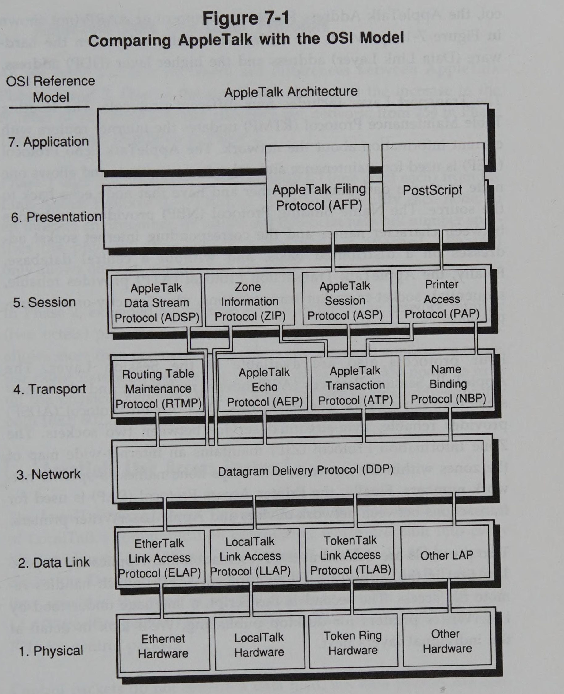

| OSI Reference Model | AppleTalk Architecture |
|---|---|
| 7. Application | |
| 6. Presentation | AppleTalk Filing Protocol (AFP), PostScript |
| 5. Session | AppleTalk Data Stream Protocol (ADSP), Zone Information Protocol (ZIP), AppleTalk Session Protocol (ASP), Printer Access Protocol (PAP) |
| 4. Transport | Routing Table Maintenance Protocol (RTMP), AppleTalk Echo Protocol (AEP), AppleTalk Transaction Protocol (ATP), Name Binding Protocol (NBP) |
| 3. Network | Datagram Delivery Protocol (DDP) |
| 2. Data Link | EtherTalk Link Access Protocol (ELAP), LocalTalk Link Access Protocol (LLAP), TokenTalk Link Access Protocol (TLAB), Other LAP |
| 1. Physical | Ethernet Hardware, LocalTalk Hardware, Token Ring Hardware, Other Hardware |

The Network Layer is implemented using the Datagram Delivery Protocol (DDP) which provides for communication between two sockets, which are the addressable entities within a node. Another protocol, the AppleTalk Address Resolution Protocol or AARP (not shown in Figure 7-1), provides the address translations between the hardware (Data Link Layer) address and the higher layer (DDP) address.

The Transport Layer includes four different protocols. The Routing Table Maintenance Protocol (RTMP) updates the internet routers with current information about the network. The AppleTalk Echo Protocol (AEP) is used for maintenance and delay measurements and allows one node to send a datagram to another and have that node echo back to the source. The Name Binding Protocol (NBP) provides translations between character names and the corresponding internet socket addresses on a distributed basis, and without a central database. Finally, the AppleTalk Transaction Protocol (ATP) provides reliable, sequential, socket-to-socket transmissions, plus "exactly-once" transmissions.

Four protocols also are available at the Session Layer. The AppleTalk Session Protocol (ASP) opens, maintains, and closes sessions between sockets. The AppleTalk Data Stream Protocol (ADSP) provides reliable, byte-streamed service between two sockets. The Zone Information Protocol (ZIP) maintains an internet-wide map of the zones within the network, and maps zone names to specific network numbers. Finally, the Printer Access Protocol (PAP) is used for transactions between network devices and Apple LaserWriter printers.

Two protocols are defined at the Presentation and Application Layers. The first is the AppleTalk Filing Protocol (AFP), which handles remote file access. The second is PostScript, a language understood by LaserWriter printers for desktop publishing. We'll look in detail at the individual layers next.

## 7.2 AppleTalk Data Link Layer Protocols

As we have touched on, there are differences between AppleTalk Phases 1 and 2. One of the significant changes is the increase in the number of addressable nodes allowable per network, from 254 in Phase 1 to more than 16 million in Phase 2.

Phase 1 uses the Destination/Source node ID (one octet each) from the Link Access Protocol (LAP) header to uniquely identify each node. In an internet environment, an additional two-octet network number specifies the physical cable to which that node is attached. Phase 1 only allows one network number per cable.

In Phase 2, extended addressing always includes the network number (two octets) plus the node ID (one octet) of the DDP header. Phase 2 allows more than one network number, specified as a contiguous range, per cable. Extended addressing permits up to 16,515,334 nodes to exist on the physical network. We'll discuss the use of this addressing for both IEEE 802.3 and IEEE 802.5 networks.

### 7.2.1 LocalTalk Link Access Protocol

The LocalTalk Link Access Protocol (LLAP) frame is an integral part of LocalTalk's communication capabilities, which are built into every Macintosh and LaserWriter (see Figure 7-2a). The LLAP header includes the Destination and Source Node IDs and the LLAP Type field that specifies the type of packet contained within the Data field. LLAP specifies packet types 01 - 7FH for data packets and types 80 - FFH for control packets.

Control packets do not contain a data field, but data packets can contain up to 600 octets of information. The low-order 10 bits of the first two octets within the data field contain the length (0 - 600) of the data field. Then comes the Frame Check Sequence (FCS), which is followed by a Flag (7EH), and an Abort Sequence (12 - 18 ONES) that indicates the end of the frame.

### Figure 7-2a AppleTalk LLAP Frame

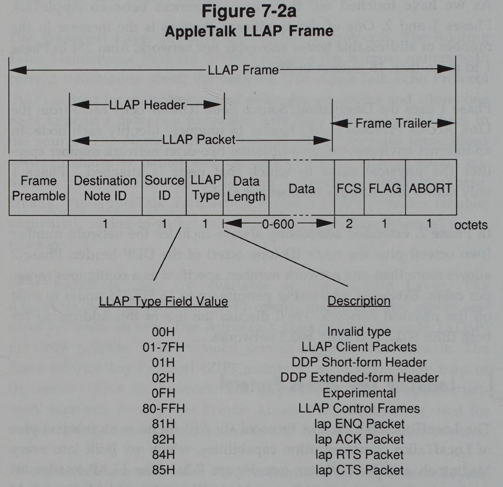

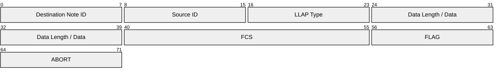
```mermaid
packet-beta
0-7: "Destination Note ID"
8-15: "Source ID"
16-23: "LLAP Type"
24-39: "Data Length / Data"
40-55: "FCS"
56-63: "FLAG"
64-71: "ABORT"
```

| Field | Bit offset | Width (bits) | Description |
|---|---|---|---|
| Destination Note ID | 0 | 8 | Destination node address (1 octet). |
| Source ID | 8 | 8 | Source node address (1 octet). |
| LLAP Type | 16 | 8 | LLAP packet type field (1 octet). |
| Data Length / Data | 24 | 0-4800 | Payload containing data length and the actual data (0-600 octets). |
| FCS | Variable | 16 | Frame Check Sequence (2 octets). |
| FLAG | Variable | 8 | End-of-frame flag (1 octet, 7EH). |
| ABORT | Variable | 8 | Abort sequence (1 octet, 12-18 ones). |

| LLAP Type Field Value | Description |
|---|---|
| 00H | Invalid type |
| 01-7FH | LLAP Client Packets |
| 01H | DDP Short-form Header |
| 02H | DDP Extended-form Header |
| 0FH | Experimental |
| 80-FFH | LLAP Control Frames |
| 81H | lap ENQ Packet |
| 82H | lap ACK Packet |
| 84H | lap RTS Packet |
| 85H | lap CTS Packet |

## 7.2.2 EtherTalk 1.0 (Phase 1) Link Access Protocol

The EtherTalk Link Access Protocol (ELAP) encapsulates the LAP information within an Ethernet frame (see Figure 7-2b). The first 14 octets are the Ethernet header, including the Ethernet Destination and Source Addresses (six octets each) and the Ethernet Type (two octets), which is set to 809BH for AppleTalk. Next are the AppleTalk Address and Type fields, as with LLAP, and then the Data Length and Data fields. Note that a Pad may be required to satisfy the minimum length requirement for an Ethernet frame.

### Figure 7-2b AppleTalk Ethernet Frame

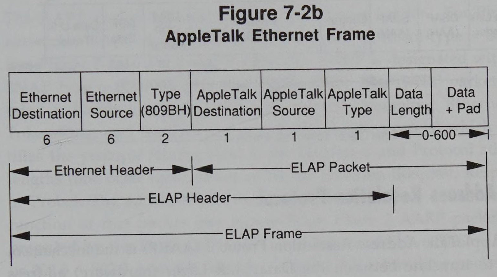

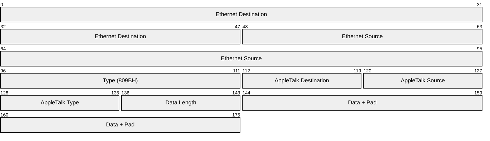
```mermaid
packet-beta
0-47: "Ethernet Destination"
48-95: "Ethernet Source"
96-111: "Type (809BH)"
112-119: "AppleTalk Destination"
120-127: "AppleTalk Source"
128-135: "AppleTalk Type"
136-143: "Data Length"
144-175: "Data + Pad"
```

| Field | Bit offset | Width (bits) | Description |
|---|---|---|---|
| Ethernet Destination | 0 | 48 | Destination MAC address (6 octets) |
| Ethernet Source | 48 | 48 | Source MAC address (6 octets) |
| Type (809BH) | 96 | 16 | Ethernet protocol type, set to 0x809B for AppleTalk (2 octets) |
| AppleTalk Destination | 112 | 8 | AppleTalk destination node ID (1 octet) |
| AppleTalk Source | 120 | 8 | AppleTalk source node ID (1 octet) |
| AppleTalk Type | 128 | 8 | AppleTalk protocol type (1 octet) |
| Data Length | 136 | 8 | Length of the data field (1 octet) |
| Data + Pad | 144 | Variable | Data field plus optional padding (0-600 octets) |

### 7.2.3 EtherTalk 2.0 (Phase 2) and TokenTalk Link Access Protocols

Apple has revised the Data Link Layer frame formats in AppleTalk Phase 2 so they conform to IEEE 802.2, 802.3, and 802.5 standards (see Figure 7-2c). In Phase 2, the Data Link header for either 802.3 or 802.5 is followed by the 802.2 and SNAP headers. The LLC header contains the DSAP and SSAP addresses (both set to AAH) and a Control field (set to 03H for unnumbered information). The next five octets are the SNAP header containing the Organization Code (080007H for Apple) and EtherType (809BH for AppleTalk Phase 2). Following the SNAP header is the DDP header (note that there is no LAP header) and DDP data that will be discussed in detail in Section 7.3.


### Figure 7-2c AppleTalk Phase 2 802.3/802.5 Frames

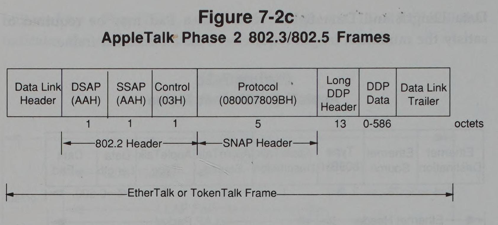

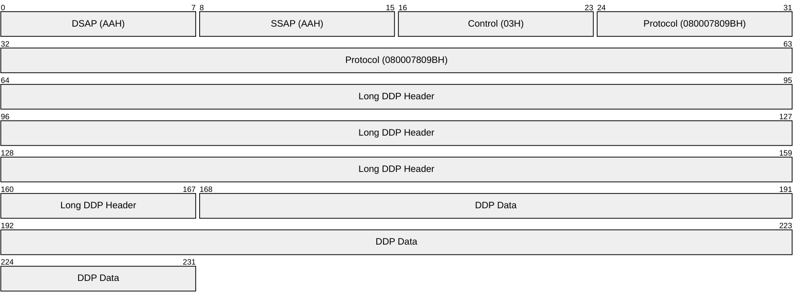
```mermaid
packet-beta
0-7: "DSAP (AAH)"
8-15: "SSAP (AAH)"
16-23: "Control (03H)"
24-63: "Protocol (080007809BH)"
64-167: "Long DDP Header"
168-231: "DDP Data"
```

| Field | Bit offset | Width (bits) | Description |
|---|---|---|---|
| Data Link Header | - | - | Variable length data link layer header (e.g. IEEE 802.3 or 802.5) |
| DSAP (AAH) | 0 | 8 | Destination Service Access Point, set to 0xAA (part of 802.2 Header) |
| SSAP (AAH) | 8 | 8 | Source Service Access Point, set to 0xAA (part of 802.2 Header) |
| Control (03H) | 16 | 8 | Control field, set to 0x03 (Unnumbered Information, part of 802.2 Header) |
| Protocol (080007809BH) | 24 | 40 | SNAP Header Protocol ID (OUI 080007 + Protocol Type 809B) |
| Long DDP Header | 64 | 104 | AppleTalk Datagram Delivery Protocol (DDP) Header (13 octets) |
| DDP Data | 168 | 0-4688 | AppleTalk payload data (up to 586 octets) |
| Data Link Trailer | - | - | Variable length data link layer trailer |

## 7.2.4 Address Resolution Protocol

The AppleTalk Address Resolution Protocol (AARP) is the mechanism used to translate between the Data Link Layer (hardware) address and the higher layer protocol address. Each node maintains an Address Mapping Table (AMT) for each higher layer protocol suite in use, and AARP maps between any two sets of the hardware and higher layer addresses.

If a node receives an AARP Request for a protocol address that matches its own, it sends an AARP Response containing its hardware address. In this instance the AMT is not involved. If a node wishes to transmit a packet, the AMT is checked by AARP. If a match for the desired higher layer protocol stack is not found, an AARP Request is initiated in order to find a match, as above. AARP dynamically performs this function using one of three different packet types: Request, Response, and Probe.

When a node is initialized, AARP assigns a tentative address for each protocol set on that node, which in most cases is just AppleTalk). AARP then broadcasts Probe packets to determine if any other node is using that address. A Response packet from another node would indicate that the address is already in use and the process must be repeated with a new tentative address. If the address is unique, the tentative address is considered permanent, and the node will now re-

---

ply to any AARP Request or Probe packets that contain its protocol address.

The AARP packet follows the Data Link Layer header. For Phase 1 networks, AARP is designated with Ethernet protocol type = 80F3H (see Figure 7-3a). For Phase 2 networks, AARP is designated with the SNAP type = 00000080F3H (see Figure 7-3b). The AARP packet contains a Hardware type field (two octets) specifying Ethernet or Token-Ring, and the Protocol type field (also two octets) which identifies the protocol family. Next is the Hardware and Protocol address lengths (one octet each), followed by the Function (Request, Response, or Probe). The addresses are then transmitted, and are defined by the function of that packet (see Figure 7-3a). Phase 2 AARP packets are preceded by the Phase 2 Data Link header, e.g. 802.3 + 802.2 + SNAP or 802.5 + 802.2 + SNAP (shown in Figure 7-3b), but these packets are otherwise identical. A value of 0 in the Destination Hardware Address field indicates that an unknown quantity is being requested in Request and Probe packets.

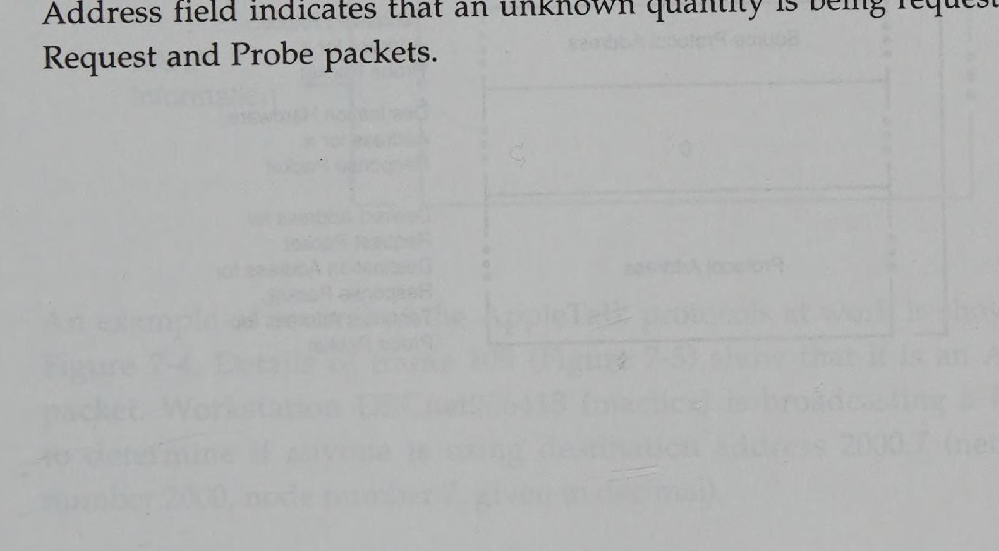

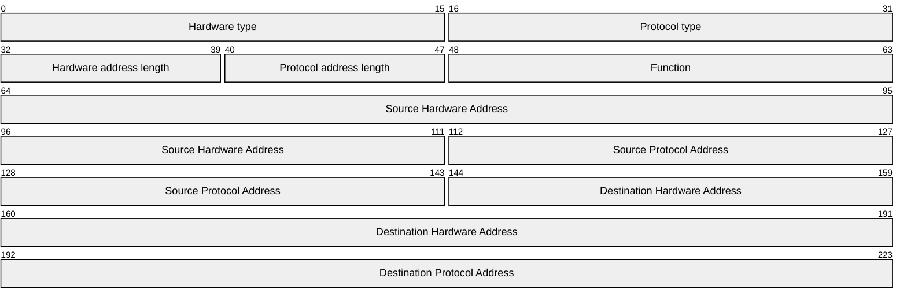
```mermaid
packet-beta
0-15: "Hardware type"
16-31: "Protocol type"
32-39: "Hardware address length"
40-47: "Protocol address length"
48-63: "Function"
64-111: "Source Hardware Address"
112-143: "Source Protocol Address"
144-191: "Destination Hardware Address"
192-223: "Destination Protocol Address"
```

| Field | Bit offset | Width (bits) | Description |
|---|---|---|---|
| Hardware type | 0 | 16 | Specifies Ethernet or Token-Ring. |
| Protocol type | 16 | 16 | Identifies the protocol family (e.g., AppleTalk). |
| Hardware address length | 32 | 8 | Length of the hardware address in octets. |
| Protocol address length | 40 | 8 | Length of the protocol address in octets. |
| Function | 48 | 16 | Request (1), Response (2), or Probe (3). |
| Source Hardware Address | 64 | n*8 | Hardware address of the sender (n octets). |
| Source Protocol Address | 64 + n*8 | m*8 | Protocol address of the sender (m octets). |
| Destination Hardware Address | 64 + n*8 + m*8 | n*8 | Hardware address of the target (n octets). |
| Destination Protocol Address | 64 + 2n*8 + m*8 | m*8 | Protocol address of the target (m octets). |

An example of the AppleTalk protocols at work is shown in Figure 7-4. Details of frame 105 (Figure 7-5) show that it is an AARP packet. Workstation 08000720b113 (in practice) is broadcasting a Probe to determine if anyone is using destination address 2000.7 (network number 2000, node number 7, given in decimal).

### Figure 7-3a AppleTalk AARP Packet (Phase 1 and Phase 2)

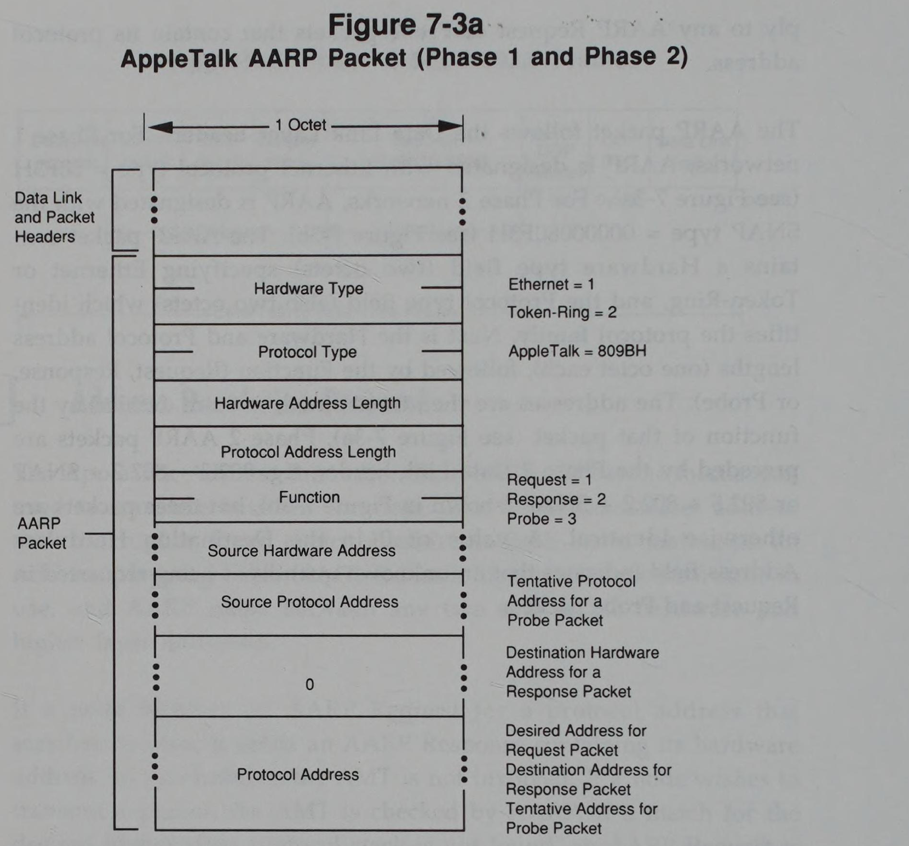

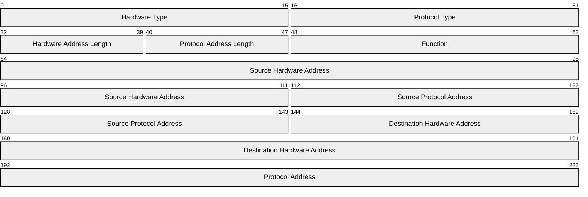
```mermaid
packet-beta
0-15: "Hardware Type"
16-31: "Protocol Type"
32-39: "Hardware Address Length"
40-47: "Protocol Address Length"
48-63: "Function"
64-111: "Source Hardware Address"
112-143: "Source Protocol Address"
144-191: "Destination Hardware Address"
192-223: "Protocol Address"
```

| Field | Bit offset | Width (bits) | Description |
|---|---|---|---|
| Hardware Type | 0 | 16 | Hardware type identifier (Ethernet = 1, Token-Ring = 2) |
| Protocol Type | 16 | 16 | Protocol type identifier (AppleTalk = 809BH) |
| Hardware Address Length | 32 | 8 | Length of hardware address in octets |
| Protocol Address Length | 40 | 8 | Length of protocol address in octets |
| Function | 48 | 16 | Packet function: Request = 1, Response = 2, Probe = 3 |
| Source Hardware Address | 64 | Variable | Hardware address of the source node |
| Source Protocol Address | Variable | Variable | Protocol address of the source node. This is the tentative protocol address for a Probe Packet. |
| Destination Hardware Address | Variable | Variable | Set to 0 in Request and Probe packets. Contains the destination hardware address for a Response Packet. |
| Protocol Address | Variable | Variable | Desired address for Request Packet; Destination address for Response Packet; Tentative address for Probe Packet. |

### Field Values and Descriptions

*   **Hardware Type**
    *   Ethernet = 1
    *   Token-Ring = 2
*   **Protocol Type**
    *   AppleTalk = 809BH
*   **Function**
    *   Request = 1
    *   Response = 2
    *   Probe = 3
*   **Source Protocol Address**: Tentative Protocol Address for a Probe Packet
*   **Destination Hardware Address (0)**: Destination Hardware Address for a Response Packet
*   **Protocol Address**:
    *   Desired Address for Request Packet
    *   Destination Address for Response Packet
    *   Tentative Address for Probe Packet


### Figure 7-3b AppleTalk AARP Packet Header (Phase 2)

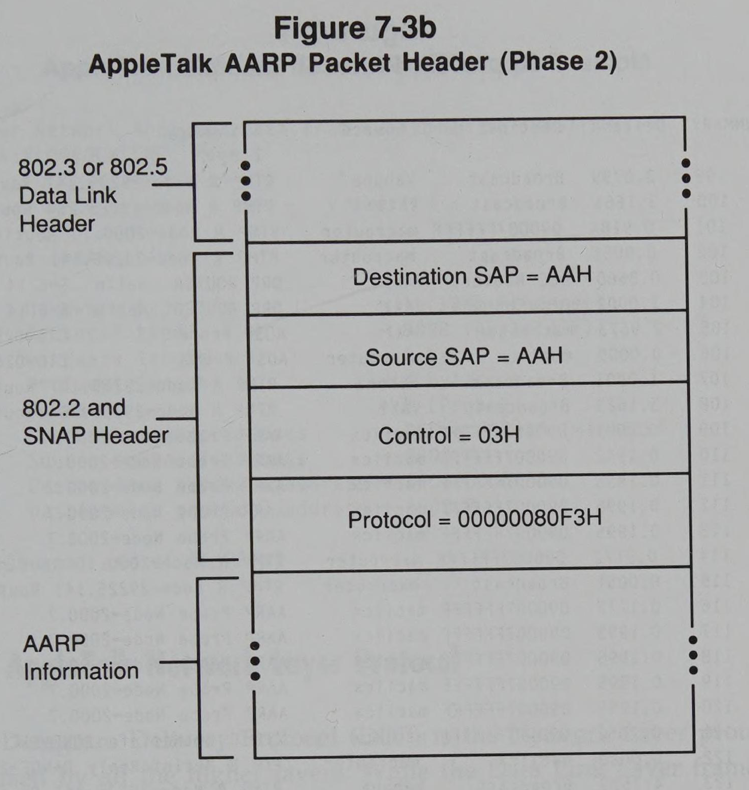

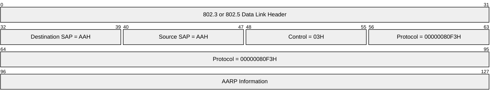
```mermaid
packet-beta
0-31: "802.3 or 802.5 Data Link Header"
32-39: "Destination SAP = AAH"
40-47: "Source SAP = AAH"
48-55: "Control = 03H"
56-95: "Protocol = 00000080F3H"
96-127: "AARP Information"
```

| Field | Bit offset | Width (bits) | Description |
| :--- | :--- | :--- | :--- |
| 802.3 or 802.5 Data Link Header | 0 | Variable | Standard MAC layer header for Ethernet or Token Ring networks. |
| Destination SAP | Variable | 8 | Destination Service Access Point, set to AAH (SNAP). |
| Source SAP | Variable + 8 | 8 | Source Service Access Point, set to AAH (SNAP). |
| Control | Variable + 16 | 8 | LLC Control field, set to 03H (Unnumbered Information). |
| Protocol | Variable + 24 | 40 | SNAP Protocol Identifier (OUI 000000 + Type 80F3H for AARP). |
| AARP Information | Variable + 64 | Variable | Contains the AARP protocol-specific information. |

An example of several of the AppleTalk protocols at work is shown in Figure 7-4. Details of frame 109 (Figure 7-5) show that it is an AARP packet. Workstation DECnet006418 (maciicx) is broadcasting a Probe to determine if anyone is using destination address 2000.7 (network number 2000, node number 7, given in decimal).


### Figure 7-4 AppleTalk Protocol Examples

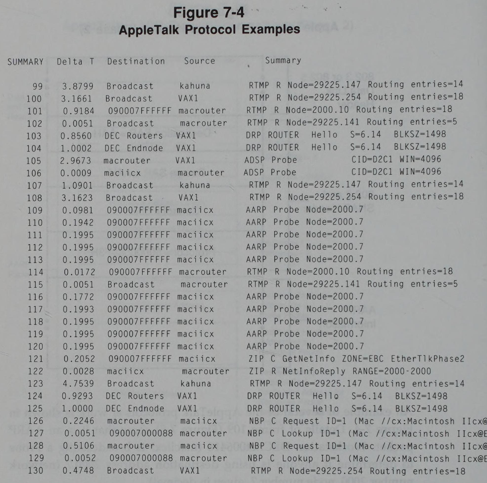

| SUMMARY | Delta T | Destination | Source | Summary |
|:---|:---|:---|:---|:---|
| 99 | 3.8799 | Broadcast | kahuna | RTMP R Node=29225.147 Routing entries=14 |
| 100 | 3.1661 | Broadcast | VAX1 | RTMP R Node=29225.254 Routing entries=18 |
| 101 | 0.9184 | 090007FFFFFF | macrouter | RTMP R Node=2000.10 Routing entries=18 |
| 102 | 0.0051 | Broadcast | macrouter | RTMP R Node=29225.141 Routing entries=5 |
| 103 | 0.8560 | DEC Routers | VAX1 | DRP ROUTER Hello S=6.14 BLKSZ=1498 |
| 104 | 1.0002 | DEC Endnode | VAX1 | DRP ROUTER Hello S=6.14 BLKSZ=1498 |
| 105 | 2.9673 | macrouter | VAX1 | ADSP Probe CID=D2C1 WIN=4096 |
| 106 | 0.0009 | maciicx | macrouter | ADSP Probe CID=D2C1 WIN=4096 |
| 107 | 1.0901 | Broadcast | kahuna | RTMP R Node=29225.147 Routing entries=14 |
| 108 | 3.1623 | Broadcast | VAX1 | RTMP R Node=29225.254 Routing entries=18 |
| 109 | 0.0981 | 090007FFFFFF | maciicx | AARP Probe Node=2000.7 |
| 110 | 0.1942 | 090007FFFFFF | maciicx | AARP Probe Node=2000.7 |
| 111 | 0.1995 | 090007FFFFFF | maciicx | AARP Probe Node=2000.7 |
| 112 | 0.1995 | 090007FFFFFF | maciicx | AARP Probe Node=2000.7 |
| 113 | 0.1995 | 090007FFFFFF | maciicx | AARP Probe Node=2000.7 |
| 114 | 0.0172 | 090007FFFFFF | macrouter | RTMP R Node=2000.10 Routing entries=18 |
| 115 | 0.0051 | Broadcast | macrouter | RTMP R Node=29225.141 Routing entries=5 |
| 116 | 0.1772 | 090007FFFFFF | maciicx | AARP Probe Node=2000.7 |
| 117 | 0.1993 | 090007FFFFFF | maciicx | AARP Probe Node=2000.7 |
| 118 | 0.1995 | 090007FFFFFF | maciicx | AARP Probe Node=2000.7 |
| 119 | 0.1995 | 090007FFFFFF | maciicx | AARP Probe Node=2000.7 |
| 120 | 0.1995 | 090007FFFFFF | maciicx | AARP Probe Node=2000.7 |
| 121 | 0.2052 | 090007FFFFFF | maciicx | ZIP C GetNetInfo ZONE=EBC EtherTlkPhase2 |
| 122 | 0.0028 | maciicx | macrouter | ZIP R NetInfoReply RANGE=2000-2000 |
| 123 | 4.7539 | Broadcast | kahuna | RTMP R Node=29225.147 Routing entries=14 |
| 124 | 0.9293 | DEC Routers | VAX1 | DRP ROUTER Hello S=6.14 BLKSZ=1498 |
| 125 | 1.0000 | DEC Endnode | VAX1 | DRP ROUTER Hello S=6.14 BLKSZ=1498 |
| 126 | 0.2246 | macrouter | maciicx | NBP C Request ID=1 (Mac //cx:Macintosh IIcx@EBC) |
| 127 | 0.0051 | 090007000088 | macrouter | NBP C Lookup ID=1 (Mac //cx:Macintosh IIcx@EBC) |
| 128 | 0.5106 | macrouter | maciicx | NBP C Request ID=1 (Mac //cx:Macintosh IIcx@EBC) |
| 129 | 0.0052 | 090007000088 | macrouter | NBP C Lookup ID=1 (Mac //cx:Macintosh IIcx@EBC) |
| 130 | 0.4748 | Broadcast | VAX1 | RTMP R Node=29225.254 Routing entries=18 |


### Figure 7-5 AppleTalk Address Resolution Protocol Example

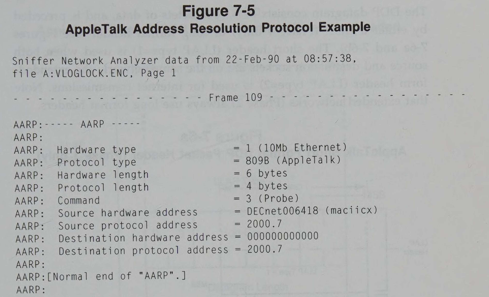

```text
Sniffer Network Analyzer data from 22-Feb-90 at 08:57:38,
file A:VLOGLOCK.ENC, Page 1

- - - - - - - - - - - - - - - Frame 109 - - - - - - - - - - - - - - -

AARP:----- AARP -----
AARP:
AARP: Hardware type                = 1 (10Mb Ethernet)
AARP: Protocol type                = 809B (AppleTalk)
AARP: Hardware length              = 6 bytes
AARP: Protocol length              = 4 bytes
AARP: Command                      = 3 (Probe)
AARP: Source hardware address      = DECnet006418 (maciicx)
AARP: Source protocol address      = 2000.7
AARP: Destination hardware address = 000000000000
AARP: Destination protocol address = 2000.7
AARP:
AARP:[Normal end of "AARP".]
AARP:
```

## 7.3 AppleTalk Network Layer Protocol

The Datagram Delivery Protocol (DDP) is the Network Layer protocol used by all the higher layers. While the Data Link Layer frames deliver information between nodes on a single network, DDP is responsible for delivering datagrams between sockets (higher layer process addresses) on the internet. The internet consists of individual AppleTalk networks connected by routers, and these routers, in turn, could be connected via telephone circuits, a public data network, or higher speed LAN backbones such as IEEE 802.3 or 802.5.

Node addresses within the internet consist of a network number (two octets) followed by a node ID (one octet). Sockets are addressed with a network number (two octets), node ID (one octet), and a socket number (one octet). Network number 0 is reserved for unknown networks. On AppleTalk Phase 2, however, only broadcast to net zero is supported, i.e. Net=0, Node=FFH means "all nodes on my network (cable)".

The DDP datagram consists of 0 - 586 octets of data, and is preceded by either a short (Phase 1 only) or long format header (see Figures 7-6a and 7-6b). The short header (LLAP type=1) is used when both source and destination sockets are on the same network; the extended-form header (LLAP type=2) is used for internet transmissions. Note that extended networks (Phase 2) always use long format headers.

### Figure 7-6a AppleTalk Short Format DDP Packet Header (Phase 1 only)

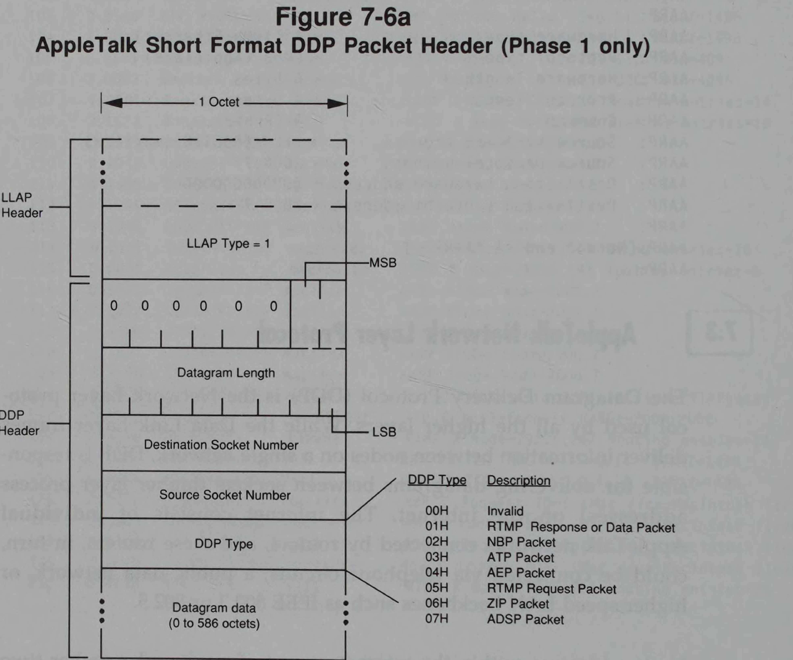

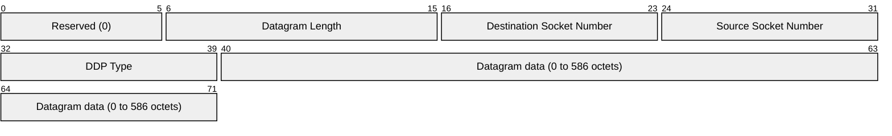
```mermaid
packet-beta
0-5: "Reserved (0)"
6-15: "Datagram Length"
16-23: "Destination Socket Number"
24-31: "Source Socket Number"
32-39: "DDP Type"
40-71: "Datagram data (0 to 586 octets)"
```

| Field | Bit offset | Width (bits) | Description |
| :--- | :---: | :---: | :--- |
| Reserved | 0 | 6 | Must be zero. |
| Datagram Length | 6 | 10 | Length of the DDP datagram including the header. |
| Destination Socket Number | 16 | 8 | Socket number on the destination node. |
| Source Socket Number | 24 | 8 | Socket number on the source node. |
| DDP Type | 32 | 8 | Protocol type of the data field. |
| Datagram data | 40 | 0-4688 | 0 to 586 octets of data. |

| DDP Type | Description |
| :--- | :--- |
| 00H | Invalid |
| 01H | RTMP Response or Data Packet |
| 02H | NBP Packet |
| 03H | ATP Packet |
| 04H | AEP Packet |
| 05H | RTMP Request Packet |
| 06H | ZIP Packet |
| 07H | ADSP Packet |

---

### Figure 7-6b AppleTalk Phase 2 DDP Packet Format (Extended Header)

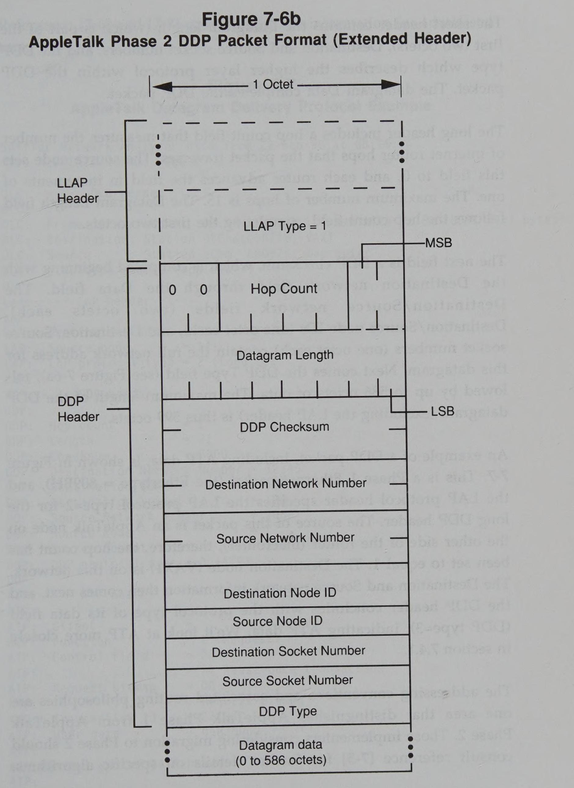

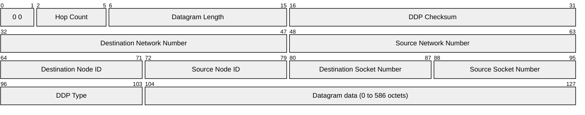
```mermaid
packet-beta
0-1: "0 0"
2-5: "Hop Count"
6-15: "Datagram Length"
16-31: "DDP Checksum"
32-47: "Destination Network Number"
48-63: "Source Network Number"
64-71: "Destination Node ID"
72-79: "Source Node ID"
80-87: "Destination Socket Number"
88-95: "Source Socket Number"
96-103: "DDP Type"
104-127: "Datagram data (0 to 586 octets)"
```

| Field | Bit offset | Width (bits) | Description |
| :--- | :--- | :--- | :--- |
| Reserved | 0 | 2 | Must be set to zero. |
| Hop Count | 2 | 4 | Number of routers the packet has passed through. |
| Datagram Length | 6 | 10 | The total length of the DDP datagram including the header, in octets. |
| DDP Checksum | 16 | 16 | A 16-bit checksum used for error detection in the DDP datagram. |
| Destination Network Number | 32 | 16 | The 16-bit network number of the destination node. |
| Source Network Number | 48 | 16 | The 16-bit network number of the source node. |
| Destination Node ID | 64 | 8 | The 8-bit identifier of the destination node. |
| Source Node ID | 72 | 8 | The 8-bit identifier of the source node. |
| Destination Socket Number | 80 | 8 | The 8-bit socket number of the process on the destination node. |
| Source Socket Number | 88 | 8 | The 8-bit socket number of the process on the source node. |
| DDP Type | 96 | 8 | Specifies the protocol type of the data payload. |
| Datagram data | 104 | 0-4688 | The data payload from a higher-layer protocol, up to 586 octets. |


The short header contains the Datagram length (which is part of the first two octets), Destination and Source socket numbers, and the DDP type which describes the higher layer protocol within the DDP packet. The datagram Data completes the DDP packet.

The long header includes a hop count field that measures the number of internet router hops that the packet traverses. The source node sets this field to 0, and each router advances the field in increments of one. The maximum number of hops is 15. The Datagram Length field follows the hop count field, completing the first two octets.

The next field is a DDP checksum, which is computed beginning with the Destination network field through the Data field. The Destination/Source network fields (two octets each), Destination/Source node IDs (one octet each), and Destination/Source socket numbers (one octet each) contain the full network address for this datagram. Next comes the DDP Type field (see Figure 7-6a), followed by up to 586 octets of data. The maximum length of the DDP datagram (excluding the LAP header) is thus 599 octets.

An example of a DDP packet, including ATP data, is shown in Figure 7-7. This is a Phase 1 Ethernet packet (the Ethertype = 809BH), and the LAP protocol header specifies the LAP protocol type=2 for the long DDP header. The source of this packet is an AppleTalk node on the other side of the router (macrouter), therefore, the hop count has been set to equal 1. The Destination node (VAX1) is on this network. The Destination and Source network information then comes next, and the DDP header concludes with the protocol type of its data field (DDP type=3), indicating ATP data. We'll look at ATP more closely in section 7.4.1.

The addressing conventions and associated routing philosophies are one area that distinguishes AppleTalk Phase 1 from AppleTalk Phase 2. Those implementers considering migration to Phase 2 should consult reference [7-5] for further details on specific algorithms.

References [7-6] and [7-7] provide upgrade information for administrators.

### Figure 7-7 AppleTalk Datagram Delivery Protocol Example

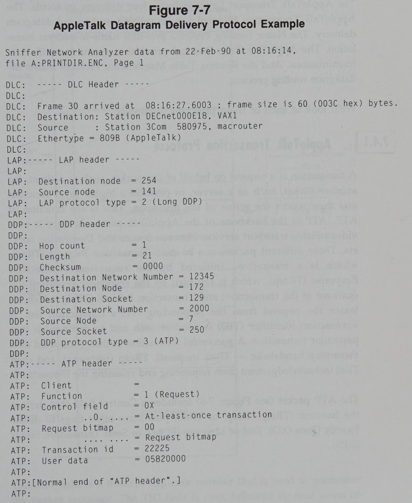

```text
Sniffer Network Analyzer data from 22-Feb-90 at 08:16:14,
file A:PRINTDIR.ENC, Page 1

DLC:  ----- DLC Header -----
DLC:
DLC:  Frame 30 arrived at  08:16:27.6003 ; frame size is 60 (003C hex) bytes.
DLC:  Destination: Station DECnet000E18, VAX1
DLC:  Source      : Station 3Com 580975, macrouter
DLC:  Ethertype = 809B (AppleTalk)
DLC:
LAP:----- LAP header -----
LAP:
LAP:  Destination node = 254
LAP:  Source node      = 141
LAP:  LAP protocol type = 2 (Long DDP)
LAP:
DDP:----- DDP header -----
DDP:
DDP:  Hop count            = 1
DDP:  Length               = 21
DDP:  Checksum             = 0000
DDP:  Destination Network Number = 12345
DDP:  Destination Node           = 172
DDP:  Destination Socket         = 129
DDP:  Source Network Number      = 2000
DDP:  Source Node                = 7
DDP:  Source Socket              = 250
DDP:  DDP protocol type = 3 (ATP)
DDP:
ATP:----- ATP header -----
ATP:
ATP:  Client            =
ATP:  Function          = 1 (Request)
ATP:  Control field     = 0X
ATP:       ..0. ....    = At-least-once transaction
ATP:  Request bitmap    = 00
ATP:       .... ....    = Request bitmap
ATP:  Transaction id    = 22225
ATP:  User data         = 05820000
ATP:
ATP:[Normal end of "ATP header".]
ATP:
```


# 7.4 AppleTalk Transport Layer Protocols

The AppleTalk Transport Layer includes four different protocols. The AppleTalk Transaction Protocol assures reliable, end-to-end datagram delivery. The Name Binding Protocol provides name-to-address translation. The AppleTalk Echo Protocol provides a means to verify data transmissions. And the Routing Table Maintenance Protocol assists the datagram routing process.

We'll look at each of these protocols separately.

## 7.4.1 AppleTalk Transaction Protocol

A transaction is a request on behalf of one socket, such as a client, for another socket, such as a server, to perform a higher layer function and then report the status of the operation. This is the function of ATP. ATP is the backbone of the AppleTalk protocols since it provides reliable transport services between Source and Destination sockets. Three different packets can be sent: Transaction Request (TReq), which is a transaction initiated by the requester; Transaction Response (TResp), which is returned by the responder reporting the outcome of the transaction; and Transaction Release (TRel), which releases the request from the responding ATP's transaction list. A Transaction identifier (TID) is used at each end to distinguish that particular transaction. A successful transaction is thus conducted as a three-way handshake — TReq (request), TResp (response), and then TRel (acknowledgement from requesting end releasing the transaction).

The ATP packet (see Figure 7-8) includes a Control field that defines the function (TReq, TResp, or TRel), plus three other flags to define Exactly Once (XO), End of Message (EOM), or Send Transaction Status (STS).


### Figure 7-8 AppleTalk ATP Packet

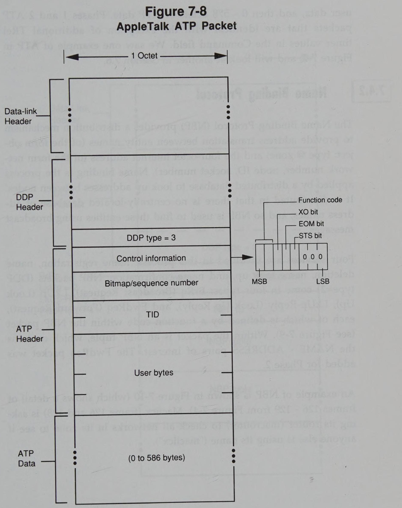

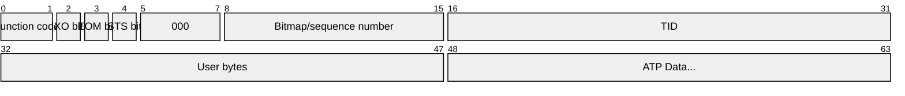
```mermaid
packet-beta
0-1: "Function code"
2: "XO bit"
3: "EOM bit"
4: "STS bit"
5-7: "000"
8-15: "Bitmap/sequence number"
16-31: "TID"
32-47: "User bytes"
48-63: "ATP Data..."
```

| Field | Bit offset | Width (bits) | Description |
|---|---|---|---|
| Function code | 0 | 2 | Identifies the ATP function code. |
| XO bit | 2 | 1 | Exactly-once bit. |
| EOM bit | 3 | 1 | End-of-message bit. |
| STS bit | 4 | 1 | Send-transmission-status bit. |
| Reserved | 5 | 3 | Constant bits set to 000. |
| Bitmap/sequence number | 8 | 8 | Used for transaction bitmap or packet sequencing. |
| TID | 16 | 16 | Transaction ID. |
| User bytes | 32 | 16 | Transaction-specific user bytes. |
| ATP Data | 48 | 0-4688 | Data field (0 to 586 bytes). |

The next field is a bitmap/sequence number that is used to guarantee the packet sequence. The TID field is next, followed by four octets of user data, and then 0 - 578 octets of ATP data. Phases 1 and 2 ATP packets that are identical with the exception of additional TRel timer values in the Command field. We saw one example of ATP in Figure 7-7, and will look at another in Section 7.6.

## 7.4.2 Name Binding Protocol

The Name Binding Protocol (NBP) provides a distribution mechanism to provide address translation between entity names (of the form object: type @ zone) and the four-octet internet address (of the form network number, node ID, socket number). Name binding is the process applied by a distributed database to look up addresses between nodes. It is distributed in that there is no centrally-located database of address names, and so NBP is used to find these entities using broadcast messages.

Four services are involved in this process: name registration, name deletion, name look up, and name confirmation. NBP packets (DDP type=2) come in four types: BrRq (Broadcast Request), LkUp (Look Up), LkUp-Reply (Look Up Reply), and FwdReq (Forward Request), each of which is defined by a function code within the NBP packet (see Figure 7-9). Within the packet is an NBP tuple, which contains the NAME - ADDRESS pairs of interest. The FwdReq packet was added for Phase 2.

An example of NBP is shown in Figure 7-10 (which shows a detail of frames 126 - 129 from Figure 7-4). Maciicx (frame 126 and 128) is asking its router (macrouter) to check all networks in its zone to see if anyone else is using its name ("maciicx").


### Figure 7-9 AppleTalk NBP Packet

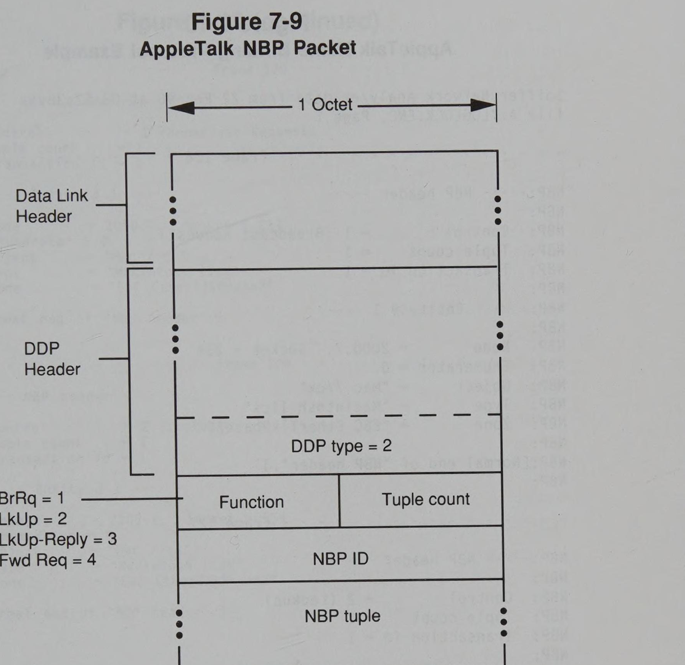

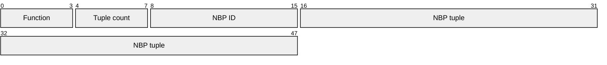
```mermaid
packet-beta
0-3: "Function"
4-7: "Tuple count"
8-15: "NBP ID"
16-31: "NBP tuple"
32-47: "NBP tuple"
```

| Field | Bit offset | Width (bits) | Description |
| :--- | :--- | :--- | :--- |
| Function | 0 | 4 | NBP function: 1=BrRq (Broadcast Request), 2=LkUp (Lookup), 3=LkUp-Reply, 4=Fwd Req (Forward Request) |
| Tuple count | 4 | 4 | Number of tuples contained in the packet |
| NBP ID | 8 | 8 | Identifier used to match replies to requests |
| NBP tuple | 16 | Variable | Contains the name, address, and socket of a service |

### 7.4.3 AppleTalk Echo Protocol

Each AppleTalk node contains a process known as an Echoer process that is used to respond to requests from an Echoer process. AEP uses DDP type 4, and includes an Echo-Request and an Echo-Reply (see Figure 7-11). Phase 1 and Phase 2 use the same format, and echo data is simply taken from the Echo-Request packet and returned to the sender. AEP is used for two applications: to determine if a particular node is accessible over an internet, or to obtain an estimate of the round-trip delay time for a data transmission to a particular node.


### Figure 7-10 AppleTalk Name Binding Protocol Example

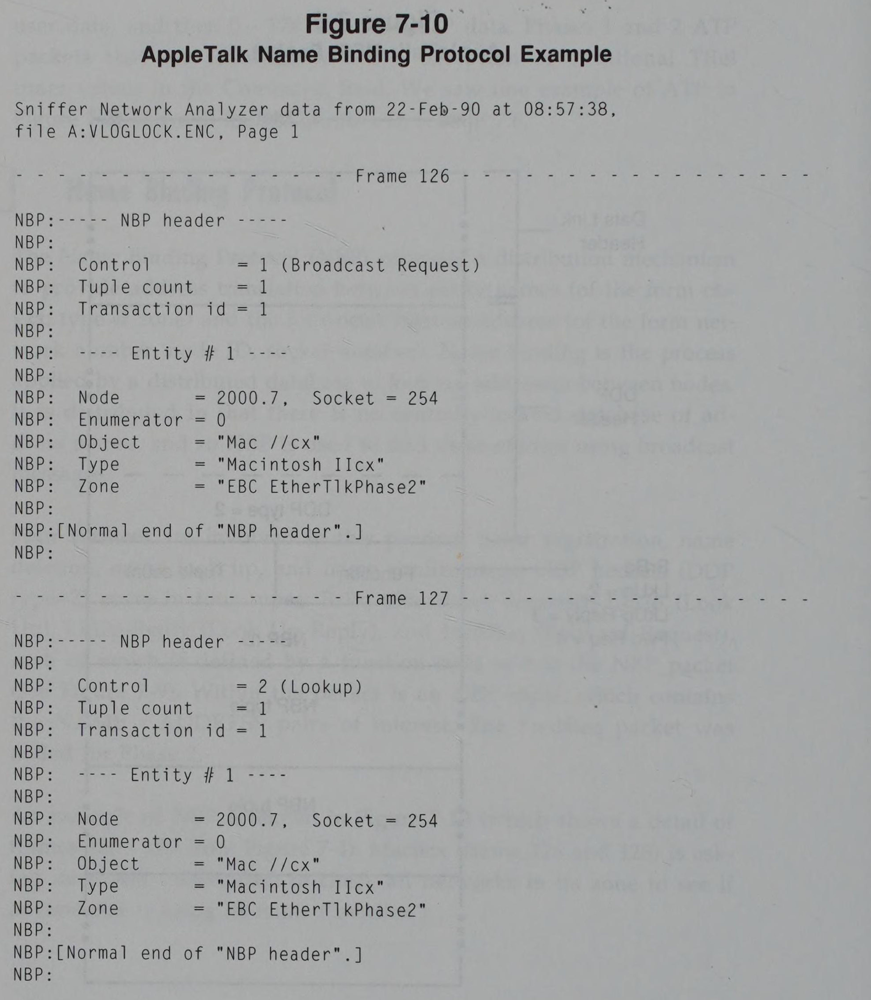
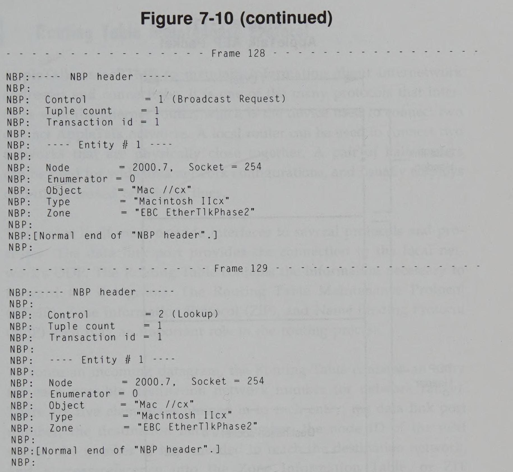

```text
Sniffer Network Analyzer data from 22-Feb-90 at 08:57:38,
file A:VLOGLOCK.ENC, Page 1

- - - - - - - - - - - - - - - - Frame 126 - - - - - - - - - - - - - - - - -

NBP:----- NBP header -----
NBP:
NBP:  Control         = 1 (Broadcast Request)
NBP:  Tuple count     = 1
NBP:  Transaction id  = 1
NBP:
NBP:  ---- Entity # 1 ----
NBP:
NBP:  Node            = 2000.7,  Socket = 254
NBP:  Enumerator      = 0
NBP:  Object          = "Mac //cx"
NBP:  Type            = "Macintosh IIcx"
NBP:  Zone            = "EBC EtherTlkPhase2"
NBP:
NBP:[Normal end of "NBP header".]
NBP:

- - - - - - - - - - - - - - - - Frame 127 - - - - - - - - - - - - - - - - -

NBP:----- NBP header -----
NBP:
NBP:  Control         = 2 (Lookup)
NBP:  Tuple count     = 1
NBP:  Transaction id  = 1
NBP:
NBP:  ---- Entity # 1 ----
NBP:
NBP:  Node            = 2000.7,  Socket = 254
NBP:  Enumerator      = 0
NBP:  Object          = "Mac //cx"
NBP:  Type            = "Macintosh IIcx"
NBP:  Zone            = "EBC EtherTlkPhase2"
NBP:
NBP:[Normal end of "NBP header".]
NBP:
- - - - - - - - - - - - - - Frame 128 - - - - - - - - - - - - - -
NBP:----- NBP header -----
NBP:
NBP: Control          = 1 (Broadcast Request)
NBP: Tuple count      = 1
NBP: Transaction id   = 1
NBP:
NBP: ---- Entity # 1 ----
NBP:
NBP: Node             = 2000.7, Socket = 254
NBP: Enumerator       = 0
NBP: Object           = "Mac //cx"
NBP: Type             = "Macintosh IIcx"
NBP: Zone             = "EBC EtherTlkPhase2"
NBP:
NBP:[Normal end of "NBP header".]
NBP:

- - - - - - - - - - - - - - Frame 129 - - - - - - - - - - - - - -
NBP:----- NBP header -----
NBP:
NBP: Control          = 2 (Lookup)
NBP: Tuple count      = 1
NBP: Transaction id   = 1
NBP:
NBP: ---- Entity # 1 ----
NBP:
NBP: Node             = 2000.7, Socket = 254
NBP: Enumerator       = 0
NBP: Object           = "Mac //cx"
NBP: Type             = "Macintosh IIcx"
NBP: Zone             = "EBC EtherTlkPhase2"
NBP:
NBP:[Normal end of "NBP header".]
NBP:
```

### 7.4.3 AppleTalk Echo Protocol

Each AppleTalk node contains a socket, known as the Echoer socket, that is used to return (or echo) incoming data back to the sender. AEP uses DDP type=4, and has only two functions: Echo Request and Echo Reply (see Figure 7-11). Phase 1 and Phase 2 use the same packet format, and echoed data (0 - 586 octets) is sent to the destination node and returned to the sender. AEP is used for two applications: to determine if a particular node is accessible over an internet; or to obtain an estimate of the round-trip delay time for a data transmission to a particular node.

### Figure 7-11 AppleTalk AEP Packet

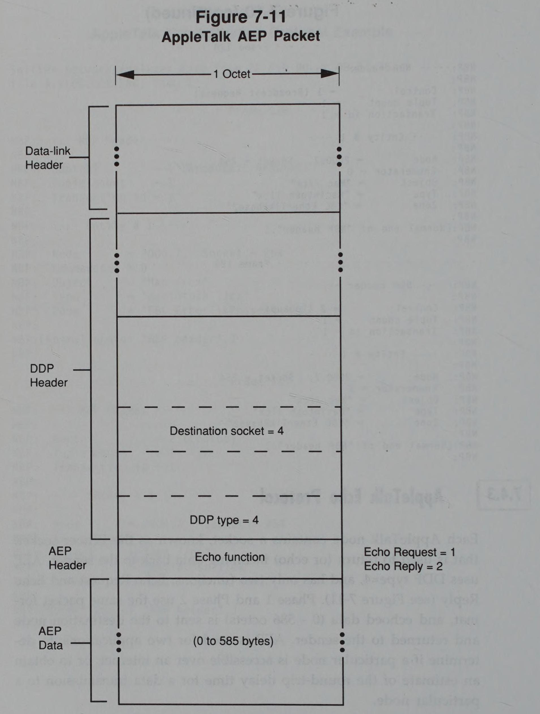

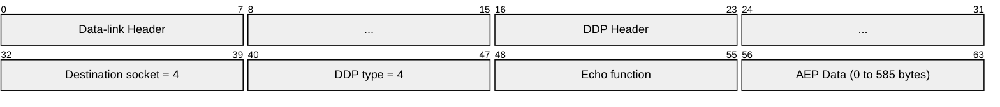
```mermaid
packet-beta
0-7: "Data-link Header"
8-15: "..."
16-23: "DDP Header"
24-31: "..."
32-39: "Destination socket = 4"
40-47: "DDP type = 4"
48-55: "Echo function"
56-63: "AEP Data (0 to 585 bytes)"
```

| Field | Bit offset | Width (bits) | Description |
| :--- | :--- | :--- | :--- |
| Data-link Header | 0 | Variable | Underlying network media header (e.g., Ethernet, Token Ring). |
| DDP Header | Variable | Variable | AppleTalk Datagram Delivery Protocol header. |
| Destination socket | Variable | 8 | The destination socket for AppleTalk Echo Protocol (AEP), which is always 4. |
| DDP type | Variable | 8 | The DDP protocol type for AEP, which is always 4. |
| Echo function | Variable | 8 | Specifies the AEP message type: Echo Request = 1, Echo Reply = 2. |
| AEP Data | Variable | 0–4680 | Data field containing between 0 and 585 bytes. |


### 7.4.4 Routing Table Maintenance Protocol

AppleTalk uses RTMP to maintain information about internetwork addresses and connections. It is one of the many protocols that interfaces with the internet router, which is the device used to connect two distinct AppleTalk networks. A local router can be used to connect two networks that are physically close together. A pair of half routers can be used for wide area network configurations, and usually employs dial-up or leased telephone lines.

The router itself must provide interfaces to several protocols and processes. The data link port provides the connection to the local network's DDP. The Routing Table contains the information necessary to forward the datagrams. The Routing Table Maintenance Protocol (RTMP), Zone Information Protocol (ZIP), and Name Binding Protocol (NBP) each play an important role in the routing process.

To route an incoming datagram, the Routing Table contains an entry for each possible destination network number (or network range). There are five elements contained in to each entry: the data link port number, the destination network number, the node ID of the next router, the number of hops needed to reach the destination network, and a cross-reference into the Zone Information Table, or ZIT (discussed in section 7.5.1). RTMP is used by the routers to exchange this routing information, thereby keeping their respective tables current and minimizing internetwork processing delays.

RTMP has three different packets: Data, Request, and Response (see Figures 7-12a and 7-12b). The Data packet (DDP type 1) is used to maintain the routing tables and contains routing tuples (network number and distance) which are the table entries to be exchanged. RTMP Request (DDP type 5) and RTMP Response (DDP type 1) packets are used by non-router nodes to obtain information about the routers connected to their network. Phase 2 has added a fourth packet, a Route Data Request (RDR) packet that is used to obtain information on demand from any router.


### Figure 7-12a AppleTalk RTMP Packets (Phase 1)

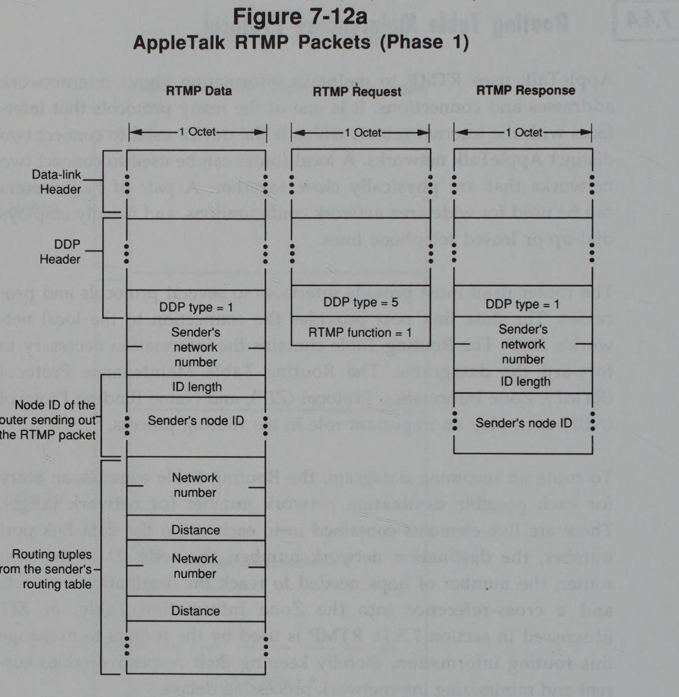

### RTMP Data (Phase 1)

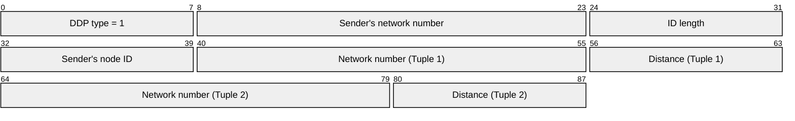
```mermaid
packet-beta
0-7: "DDP type = 1"
8-23: "Sender's network number"
24-31: "ID length"
32-39: "Sender's node ID"
40-55: "Network number (Tuple 1)"
56-63: "Distance (Tuple 1)"
64-79: "Network number (Tuple 2)"
80-87: "Distance (Tuple 2)"
```

| Field | Bit offset | Width (bits) | Description |
|---|---|---|---|
| DDP type | 0 | 8 | The DDP protocol type. For RTMP Data, this is 1. |
| Sender's network number | 8 | 16 | The network number of the router sending the RTMP packet. |
| ID length | 24 | 8 | The length of the Node ID field. In Phase 1, this is 8 bits. |
| Sender's node ID | 32 | 8 | The node ID of the router sending the RTMP packet. |
| Network number | 40 + 24n | 16 | The network number for a routing tuple from the sender's routing table. |
| Distance | 56 + 24n | 8 | The distance (hop count) to the network specified in the network number field. |

### RTMP Request (Phase 1)


```mermaid
packet-beta
0-7: "DDP type = 5"
8-15: "RTMP function = 1"
```

| Field | Bit offset | Width (bits) | Description |
|---|---|---|---|
| DDP type | 0 | 8 | The DDP protocol type. For RTMP Request, this is 5. |
| RTMP function | 8 | 8 | The RTMP function code. Set to 1 for an RTMP request. |

### RTMP Response (Phase 1)

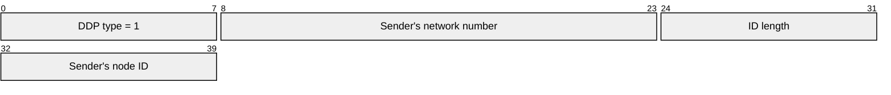
```mermaid
packet-beta
0-7: "DDP type = 1"
8-23: "Sender's network number"
24-31: "ID length"
32-39: "Sender's node ID"
```

| Field | Bit offset | Width (bits) | Description |
|---|---|---|---|
| DDP type | 0 | 8 | The DDP protocol type. For RTMP Response, this is 1. |
| Sender's network number | 8 | 16 | The network number of the router sending the RTMP packet. |
| ID length | 24 | 8 | The length of the Node ID field. |
| Sender's node ID | 32 | 8 | The node ID of the router sending the RTMP packet. |

---

### Figure 7-12b AppleTalk RTMP Packets (Phase 2)

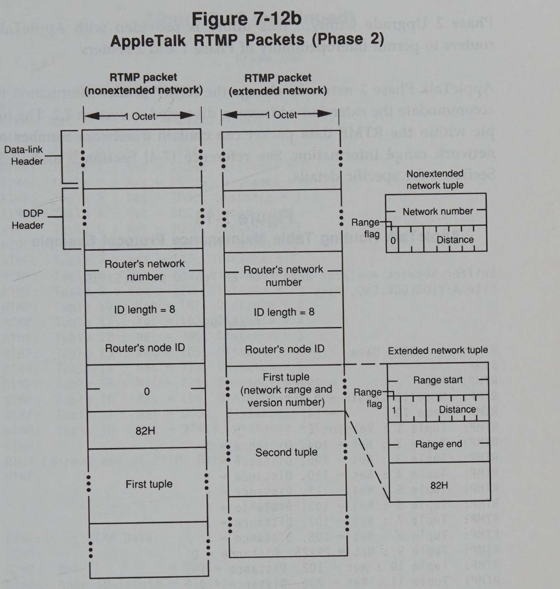

### RTMP packet (nonextended network)

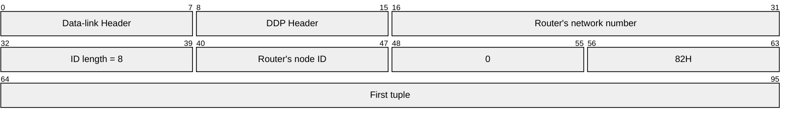
```mermaid
packet-beta
0-7: "Data-link Header"
8-15: "DDP Header"
16-31: "Router's network number"
32-39: "ID length = 8"
40-47: "Router's node ID"
48-55: "0"
56-63: "82H"
64-95: "First tuple"
```

| Field | Bit offset | Width (bits) | Description |
|---|---|---|---|
| Data-link Header | 0 | 8 | Data-link layer header (variable length, shown as 1 octet for diagram purposes) |
| DDP Header | 8 | 8 | Datagram Delivery Protocol header (variable length, shown as 1 octet for diagram purposes) |
| Router's network number | 16 | 16 | Network number of the sending router |
| ID length = 8 | 32 | 8 | Length of the node ID in bits, must be 8 |
| Router's node ID | 40 | 8 | Node ID of the sending router |
| 0 | 48 | 8 | Constant value 0 |
| 82H | 56 | 8 | Version number (0x82) |
| First tuple | 64 | 32 | The first routing tuple in the packet |

### RTMP packet (extended network)

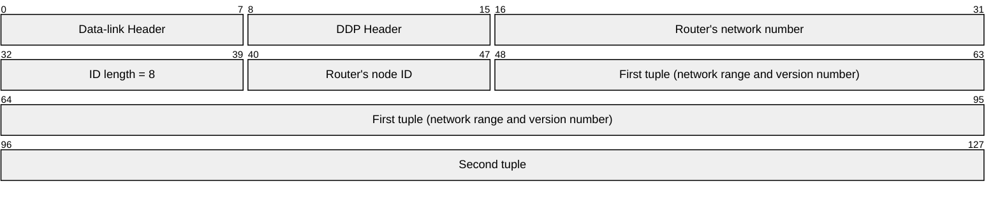
```mermaid
packet-beta
0-7: "Data-link Header"
8-15: "DDP Header"
16-31: "Router's network number"
32-39: "ID length = 8"
40-47: "Router's node ID"
48-95: "First tuple (network range and version number)"
96-127: "Second tuple"
```

| Field | Bit offset | Width (bits) | Description |
|---|---|---|---|
| Data-link Header | 0 | 8 | Data-link layer header (variable length, shown as 1 octet for diagram purposes) |
| DDP Header | 8 | 8 | Datagram Delivery Protocol header (variable length, shown as 1 octet for diagram purposes) |
| Router's network number | 16 | 16 | Network number of the sending router |
| ID length = 8 | 32 | 8 | Length of the node ID in bits, must be 8 |
| Router's node ID | 40 | 8 | Node ID of the sending router |
| First tuple | 48 | 48 | First tuple containing network range and version number (6 octets) |
| Second tuple | 96 | 32 | The second routing tuple in the packet |

### Nonextended network tuple


```mermaid
packet-beta
0-15: "Network number"
16: "Range flag (0)"
17-23: "Distance"
```

| Field | Bit offset | Width (bits) | Description |
|---|---|---|---|
| Network number | 0 | 16 | 16-bit AppleTalk network number |
| Range flag | 16 | 1 | Bit indicating a non-extended network tuple (0) |
| Distance | 17 | 7 | Hop count to the specified network |

### Extended network tuple

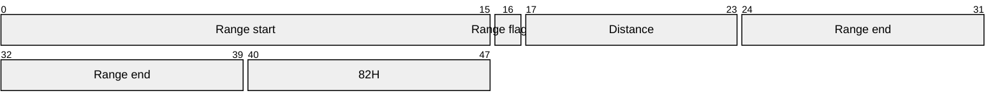
```mermaid
packet-beta
0-15: "Range start"
16: "Range flag (1)"
17-23: "Distance"
24-39: "Range end"
40-47: "82H"
```

| Field | Bit offset | Width (bits) | Description |
|---|---|---|---|
| Range start | 0 | 16 | Start of the network number range |
| Range flag | 16 | 1 | Bit indicating an extended network tuple (1) |
| Distance | 17 | 7 | Hop count to the specified network range |
| Range end | 24 | 16 | End of the network number range |
| 82H | 40 | 8 | Version number (0x82) |

An example of four RTMP Request packets is shown in Figure 7-13 (also extracted from Figure 7-4). Frame 99 is a Phase 1 broadcast from a routing entity (kahuna), network 29225, node 147. Frame 100 is a broadcast from another routing entity (VAX1), network 29225, node 254. Frame 101 is a Phase 2 multicast from macrouter to all AppleTalk nodes (delineated by the destination address 090007FFFFFFH) on network 2000. Frame 102 is a Phase 1 broadcast from macrouter, network 29225, node 141. Note that macrouter is handling both Phase 1 and Phase 2 protocols, and is running the Apple Phase 2 Upgrade Utility. This utility is provided with AppleTalk routers to permit interoperability of Phase 1 and 2 routers.

AppleTalk Phase 2 networks change the RTMP header information to accommodate the extended addressing discussed in section 7.2. The tuple within the RTMP data packet can contain a network number or network range information. See reference [7-4] Section 5 and [7-5] Section 4 for specific details.

### Figure 7-13 AppleTalk Routing Table Maintenance Protocol Example

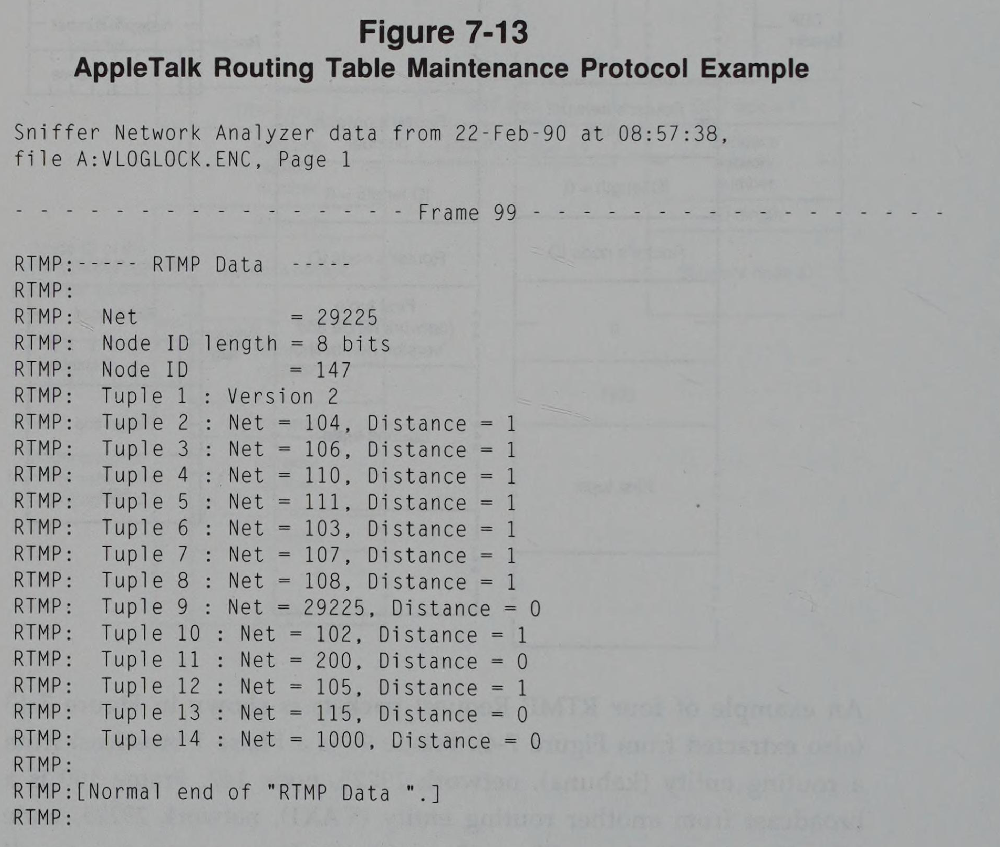
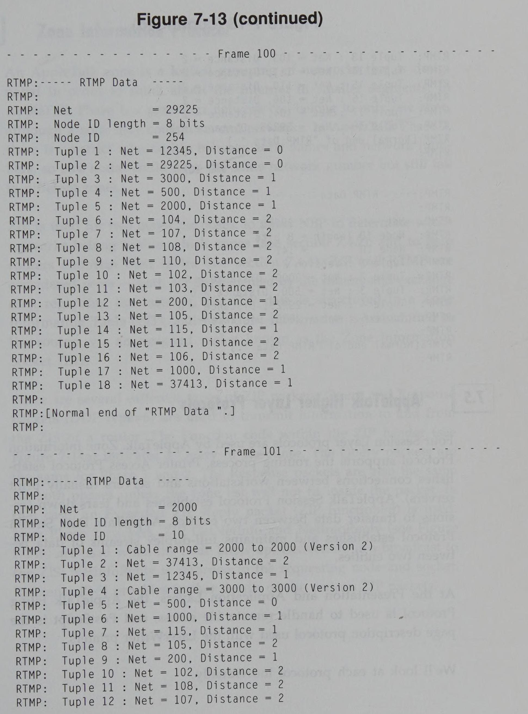
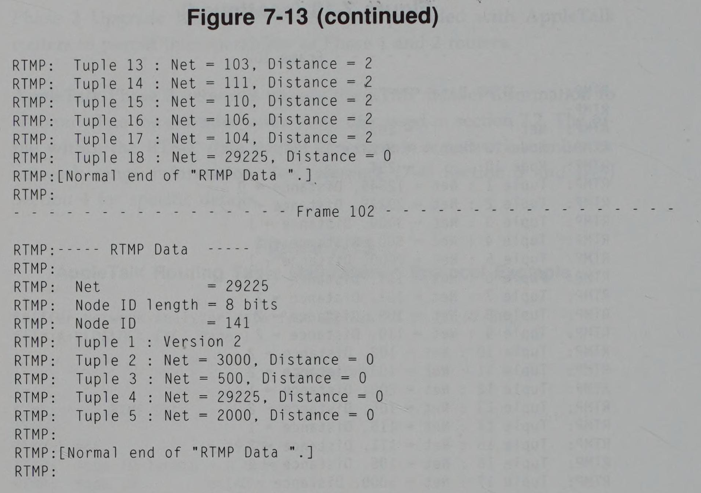

```
Sniffer Network Analyzer data from 22-Feb-90 at 08:57:38,
file A:VLOGLOCK.ENC, Page 1

- - - - - - - - - - - - - - Frame 99 - - - - - - - - - - - - - -

RTMP:----- RTMP Data -----
RTMP:
RTMP: Net = 29225
RTMP: Node ID length = 8 bits
RTMP: Node ID = 147
RTMP: Tuple 1 : Version 2
RTMP: Tuple 2 : Net = 104, Distance = 1
RTMP: Tuple 3 : Net = 106, Distance = 1
RTMP: Tuple 4 : Net = 110, Distance = 1
RTMP: Tuple 5 : Net = 111, Distance = 1
RTMP: Tuple 6 : Net = 103, Distance = 1
RTMP: Tuple 7 : Net = 107, Distance = 1
RTMP: Tuple 8 : Net = 108, Distance = 1
RTMP: Tuple 9 : Net = 29225, Distance = 0
RTMP: Tuple 10 : Net = 102, Distance = 1
RTMP: Tuple 11 : Net = 200, Distance = 0
RTMP: Tuple 12 : Net = 105, Distance = 1
RTMP: Tuple 13 : Net = 115, Distance = 0
RTMP: Tuple 14 : Net = 1000, Distance = 0
RTMP:
RTMP:[Normal end of "RTMP Data ".]
RTMP:

- - - - - - - - - - - - - - - Frame 100 - - - - - - - - - - - - - - -

RTMP:----- RTMP Data -----
RTMP:
RTMP: Net             = 29225
RTMP: Node ID length  = 8 bits
RTMP: Node ID         = 254
RTMP: Tuple 1 : Net = 12345, Distance = 0
RTMP: Tuple 2 : Net = 29225, Distance = 0
RTMP: Tuple 3 : Net = 3000, Distance = 1
RTMP: Tuple 4 : Net = 500, Distance = 1
RTMP: Tuple 5 : Net = 2000, Distance = 1
RTMP: Tuple 6 : Net = 104, Distance = 2
RTMP: Tuple 7 : Net = 107, Distance = 2
RTMP: Tuple 8 : Net = 108, Distance = 2
RTMP: Tuple 9 : Net = 110, Distance = 2
RTMP: Tuple 10 : Net = 102, Distance = 2
RTMP: Tuple 11 : Net = 103, Distance = 2
RTMP: Tuple 12 : Net = 200, Distance = 1
RTMP: Tuple 13 : Net = 105, Distance = 2
RTMP: Tuple 14 : Net = 115, Distance = 1
RTMP: Tuple 15 : Net = 111, Distance = 2
RTMP: Tuple 16 : Net = 106, Distance = 2
RTMP: Tuple 17 : Net = 1000, Distance = 1
RTMP: Tuple 18 : Net = 37413, Distance = 1
RTMP:
RTMP: [Normal end of "RTMP Data ".]
RTMP:

- - - - - - - - - - - - - - - Frame 101 - - - - - - - - - - - - - - -

RTMP:----- RTMP Data -----
RTMP:
RTMP: Net             = 2000
RTMP: Node ID length  = 8 bits
RTMP: Node ID         = 10
RTMP: Tuple 1 : Cable range = 2000 to 2000 (Version 2)
RTMP: Tuple 2 : Net = 37413, Distance = 2
RTMP: Tuple 3 : Net = 12345, Distance = 1
RTMP: Tuple 4 : Cable range = 3000 to 3000 (Version 2)
RTMP: Tuple 5 : Net = 500, Distance = 0
RTMP: Tuple 6 : Net = 1000, Distance = 1
RTMP: Tuple 7 : Net = 115, Distance = 1
RTMP: Tuple 8 : Net = 105, Distance = 2
RTMP: Tuple 9 : Net = 200, Distance = 1
RTMP: Tuple 10 : Net = 102, Distance = 2
RTMP: Tuple 11 : Net = 108, Distance = 2
RTMP: Tuple 12 : Net = 107, Distance = 2
RTMP: Tuple 13 : Net = 103, Distance = 2
RTMP: Tuple 14 : Net = 111, Distance = 2
RTMP: Tuple 15 : Net = 110, Distance = 2
RTMP: Tuple 16 : Net = 106, Distance = 2
RTMP: Tuple 17 : Net = 104, Distance = 2
RTMP: Tuple 18 : Net = 29225, Distance = 0
RTMP:[Normal end of "RTMP Data ".]
RTMP:
- - - - - - - - - - - - - Frame 102 - - - - - - - - - - - - -

RTMP:----- RTMP Data -----
RTMP:
RTMP:  Net            = 29225
RTMP:  Node ID length = 8 bits
RTMP:  Node ID        = 141
RTMP:  Tuple 1 : Version 2
RTMP:  Tuple 2 : Net = 3000, Distance = 0
RTMP:  Tuple 3 : Net = 500, Distance = 0
RTMP:  Tuple 4 : Net = 29225, Distance = 0
RTMP:  Tuple 5 : Net = 2000, Distance = 0
RTMP:
RTMP:[Normal end of "RTMP Data ".]
RTMP:
```

## 7.5 AppleTalk Higher Layer Protocols

Four Session Layer protocols are used by AppleTalk. Zone Information Protocol supports the routing process. Printer Access Protocol establishes connections between workstations and servers (usually print servers). AppleTalk Session Protocol establishes and tears down sessions to transfer data between two entities. AppleTalk Data Stream Protocol establishes and maintains full-duplex streams of data between two entities.

At the Presentation and Application Layers, the AppleTalk Filing Protocol is used to handle remote file access, and PostScript is the page description protocol used with the LaserWriter printers.

We'll look at each protocol individually.

## 7.5.1 Zone Information Protocol

An AppleTalk zone is a logical grouping of networks that is designated in order to think about the internet in smaller segments. In AppleTalk Phase 1, a particular network can belong to only one zone, although a zone may contain several networks. In AppleTalk Phase 2, there is no strict relationship between zone names and network numbers, so two nodes could have the same network number but still fall in different zones.

ZIP is used for two major purposes: to allow NBP to determine which networks belong within which zones (see section 7.4.2); and to help routers maintain their tables (see section 7.4.4). ZIP and RTMP are considered peers — both are implemented by the routers and exchange data regarding the internet. The ZIP data is structured in a Zone Information Table (ZIT), and new zone information is transmitted to the routers via an assigned socket known as the Zone Information Socket (ZIS).

There are several different types of ZIP packets. Query and Response packets (DDP type=6) are used to transmit information to and from the ZIS of a router. The Function code within the ZIP header (see Figure 7-14a) indicates a Query or Response. The Query packets are the same for Phase 1 and 2. The Response packets are also the same for both phases unless the zone list will not fit inside the packet. In that case, an Extended ZIP Reply packet (ZIP function=8) is used. New Phase 2 packets, ZIP GetNetInfo and NetInfoReply (see Figure 7-14b) are used when the node boots up. GetNetInfo is a broadcast to the ZIS; NetInfoReply is returned to the requesting node and socket. Reference [7-5] provides further details on the various ZIP packets.

### Figure 7-14a AppleTalk ZIP Query and Reply Packets

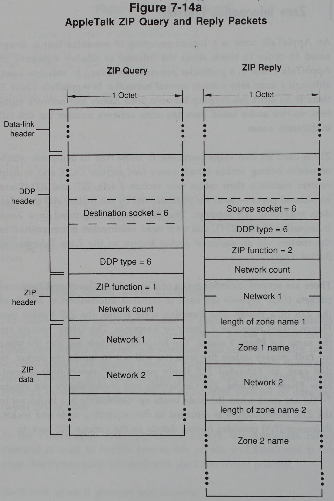

#### ZIP Query

**Data-link header**
(variable length)

**DDP header**
- ...
- Destination socket = 6
- DDP type = 6

**ZIP header**
- ZIP function = 1
- Network count

**ZIP data**
- Network 1
- Network 2
- ...

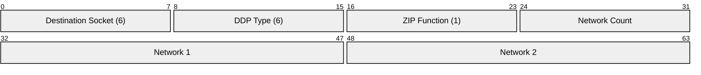
```mermaid
packet-beta
0-7: "Destination Socket (6)"
8-15: "DDP Type (6)"
16-23: "ZIP Function (1)"
24-31: "Network Count"
32-47: "Network 1"
48-63: "Network 2"
```

| Field | Bit offset | Width (bits) | Description |
| :--- | :--- | :--- | :--- |
| Destination socket | 0 | 8 | DDP Destination Socket, set to 6 for ZIP packets. |
| DDP type | 8 | 8 | DDP Protocol Type, set to 6 for ZIP. |
| ZIP function | 16 | 8 | ZIP function code, 1 for ZIP Query. |
| Network count | 24 | 8 | The number of network numbers following in the query. |
| Network 1 | 32 | 16 | The first 16-bit network number being queried. |
| Network 2 | 48 | 16 | The second 16-bit network number being queried. |

#### ZIP Reply

**Data-link header**
(variable length)

**DDP header**
- ...
- Source socket = 6
- DDP type = 6

**ZIP header**
- ZIP function = 2
- Network count

**ZIP data**
- Network 1
- length of zone name 1
- Zone 1 name
- Network 2
- length of zone name 2
- Zone 2 name
- ...

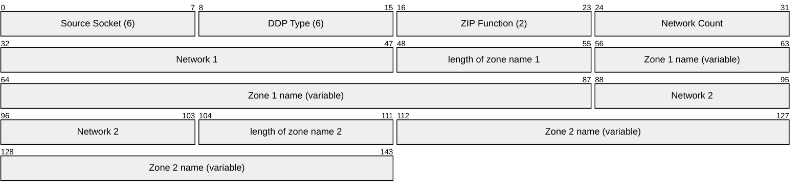
```mermaid
packet-beta
0-7: "Source Socket (6)"
8-15: "DDP Type (6)"
16-23: "ZIP Function (2)"
24-31: "Network Count"
32-47: "Network 1"
48-55: "length of zone name 1"
56-87: "Zone 1 name (variable)"
88-103: "Network 2"
104-111: "length of zone name 2"
112-143: "Zone 2 name (variable)"
```

| Field | Bit offset | Width (bits) | Description |
| :--- | :--- | :--- | :--- |
| Source socket | 0 | 8 | DDP Source Socket, set to 6 for ZIP packets. |
| DDP type | 8 | 8 | DDP Protocol Type, set to 6 for ZIP. |
| ZIP function | 16 | 8 | ZIP function code, 2 for ZIP Reply. |
| Network count | 24 | 8 | The number of networks in the reply. |
| Network 1 | 32 | 16 | The first 16-bit network number. |
| length of zone name 1 | 48 | 8 | The length of the first zone name in octets. |
| Zone 1 name | 56 | Variable | The name of the zone associated with Network 1. |
| Network 2 | Variable | 16 | The second 16-bit network number. |
| length of zone name 2 | Variable | 8 | The length of the second zone name in octets. |
| Zone 2 name | Variable | Variable | The name of the zone associated with Network 2. |


### Figure 7-14b AppleTalk ZIP GetNetInfo and ZIP NetInfo Reply Packets

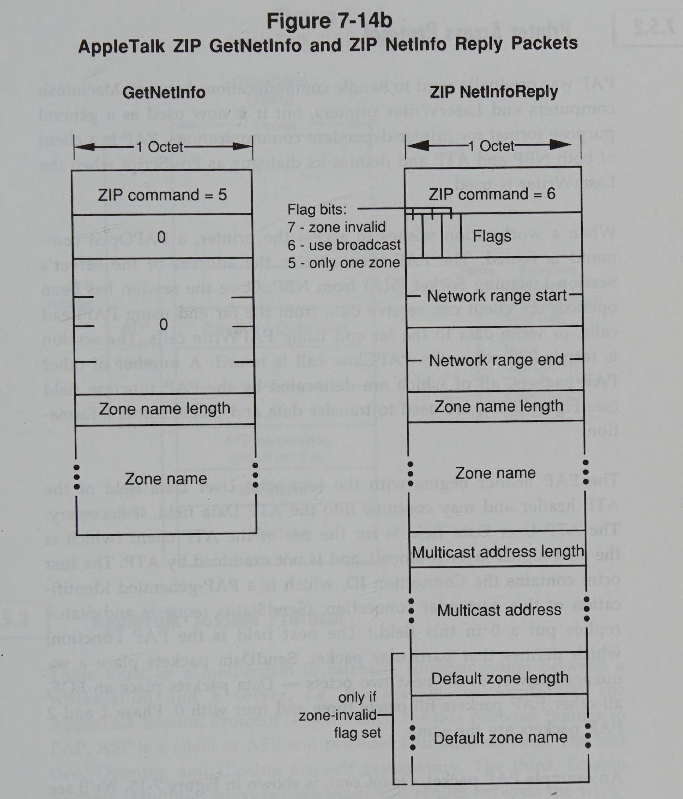

#### GetNetInfo

```mermaid
packet-beta
0-7: "ZIP command = 5"
8-15: "0"
16-31: "0"
32-39: "Zone name length"
40-47: "Zone name"
```

| Field | Bit offset | Width (bits) | Description |
|---|---|---|---|
| ZIP command | 0 | 8 | ZIP command code (5 for GetNetInfo). |
| Reserved | 8 | 8 | Reserved field, set to 0. |
| Reserved | 16 | 16 | Reserved field, set to 0. |
| Zone name length | 32 | 8 | Length of the zone name field in octets. |
| Zone name | 40 | Variable | The zone name. |

#### ZIP NetInfoReply

```mermaid
packet-beta
0-7: "ZIP command = 6"
8: "Zone invalid"
9: "Use broadcast"
10: "Only one zone"
11-15: "Reserved"
16-31: "Network range start"
32-47: "Network range end"
48-55: "Zone name length"
56-63: "Zone name"
64-71: "Multicast address length"
72-79: "Multicast address"
80-87: "Default zone length"
88-95: "Default zone name"
```

| Field | Bit offset | Width (bits) | Description |
|---|---|---|---|
| ZIP command | 0 | 8 | ZIP command code (6 for NetInfoReply). |
| Flags | 8 | 8 | Control flags for the reply. |
| - Zone invalid | 8 | 1 | Bit 7: set if the requested zone is invalid. |
| - Use broadcast | 9 | 1 | Bit 6: set if broadcast should be used. |
| - Only one zone | 10 | 1 | Bit 5: set if there is only one zone on this network. |
| - Reserved | 11 | 5 | Bits 4-0 are reserved and set to 0. |
| Network range start | 16 | 16 | Start of the cable network number range. |
| Network range end | 32 | 16 | End of the cable network number range. |
| Zone name length | 48 | 8 | Length of the zone name field. |
| Zone name | 56 | Variable | The zone name. |
| Multicast address length | 64 | 8 | Length of the multicast address field. |
| Multicast address | 72 | Variable | The multicast address for the zone. |
| Default zone length | 80 | 8 | Length of the default zone name (only present if zone-invalid flag is set). |
| Default zone name | 88 | Variable | The default zone name (only present if zone-invalid flag is set). |


## 7.5.2 Printer Access Protocol

PAP was originally used to handle communications between Macintosh computers and LaserWriter printers, but it is now used as a general purpose format for printer-dependent communications. PAP is a client of both NBP and ATP and defines its dialogue as PostScript when the LaserWriter is used.

When a workstation wishes to access the printer, a PAPOpen command is issued. The PAP then obtains the address of the server's Session Listening Socket (SLS) from NBP. Once the session has been opened, the client can receive data from the far end using PAPRead calls, or write data to the far end using PAPWrite calls. The session is terminated when the PAPClose call is issued. A number of other PAP packets, all of which are delineated by the PAP function field (see Figure 7-15), are used to transfer data and obtain status information.

The PAP header begins with the four-octet User Data field of the ATP header and may continue into the ATP Data field, if necessary. The ATP User Data field is for the use of the ATP client (which is the next higher layer protocol), and is not examined by ATP. The first octet contains the Connection ID, which is a PAP-generated identification of this particular connection. (SendStatus requests and Status replies put a 0 in this field.) The next field is the PAP Function, which defines that particular packet. SendData packets place a sequence number in the next two octets — Data packets place an EOF; all other PAP packets fill octets three and four with 0. Phase 1 and 2 PAP packets are the same.

An example PAP packet, OpenConn, is shown in Figure 7-15. We'll see these protocols in use later when we analyze a print job.


### Figure 7-15 AppleTalk PAP packets

OpenConn (TReq)

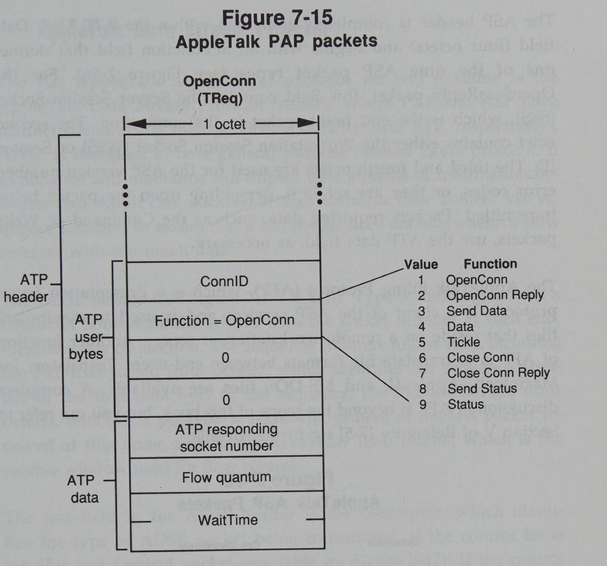

```mermaid
packet-beta
0-7: "ConnID"
8-15: "Function"
16-23: "0"
24-31: "0"
32-39: "ATP responding socket number"
40-47: "Flow quantum"
48-63: "WaitTime"
```

| Field | Bit offset | Width (bits) | Description |
|---|---|---|---|
| ConnID | 0 | 8 | Connection Identifier |
| Function | 8 | 8 | PAP function code (e.g., 1 for OpenConn) |
| 0 | 16 | 8 | Reserved (zero) |
| 0 | 24 | 8 | Reserved (zero) |
| ATP responding socket number | 32 | 8 | Socket number for PAP response |
| Flow quantum | 40 | 8 | Flow quantum for PAP flow control |
| WaitTime | 48 | 16 | Time to wait for PAP response |

**Function Values:**

| Value | Function |
|---|---|
| 1 | OpenConn |
| 2 | OpenConn Reply |
| 3 | Send Data |
| 4 | Data |
| 5 | Tickle |
| 6 | Close Conn |
| 7 | Close Conn Reply |
| 8 | Send Status |
| 9 | Status |

### 7.5.3 AppleTalk Session Protocol

There must be a mechanism to establish communication between a workstation and a server, i.e. the session. In AppleTalk, the AppleTalk Session Protocol (ASP) is used for this purpose. Similar to PAP, ASP is a client of ATP and provides four basic services. The first two, Opening and Closing are self explanatory. The third, Session Request Handling, conveys commands and replies between the workstation and the server. The fourth, Session Management, determines the current status of the remote end (known as tickling), and assures the reliability of the session packets.

The ASP header is completely contained within the ATP User Data field (four octets) and begins with an SPFunction field that defines one of the nine ASP packet types (see Figure 7-16). For the OpenSessReply packet, this field contains the Server Session Socket (SSS), which is the end point socket in the connection. The second octet contains either the Workstation Session Socket (WSS) or Session ID. The third and fourth octets are used for the ASP version number, error codes, or they are set to 0, depending upon the packet being transmitted. Packets requiring data, such as the Command or Write packets, use the ATP data field, as necessary.

The AppleTalk Filing Protocol (AFP), which is a Presentation Layer protocol, is a client of the ASP services and is used to manipulate files that reside on a remote workstation or server. Another function of AFP is to translate file formats between end-users. Translators for Macintosh, Apple II, and MS-DOS files are available. A complete discussion of AFP is beyond the scope of this book, but you can refer to Section V of Reference [7-5] for further details.

### Figure 7-16 AppleTalk ASP Packets

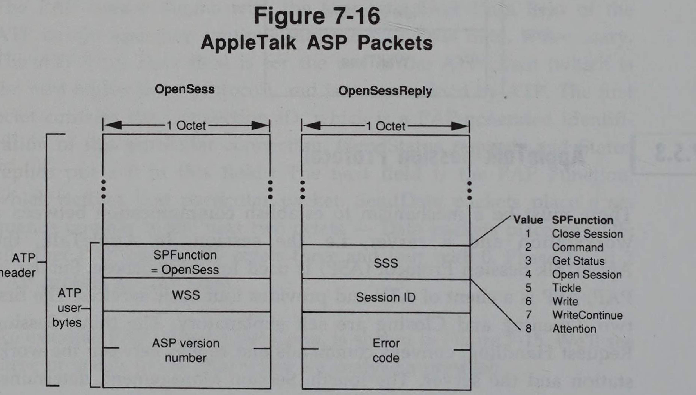

#### OpenSess Packet

```mermaid
packet-beta
0-7: "SPFunction = OpenSess"
8-15: "WSS"
16-31: "ASP version number"
```

| Field | Bit offset | Width (bits) | Description |
|---|---|---|---|
| SPFunction | 0 | 8 | Packet type identifier (set to OpenSess/4) |
| WSS | 8 | 8 | Workstation Session Socket |
| ASP version number | 16 | 16 | Version of the ASP protocol being used |

#### OpenSessReply Packet

```mermaid
packet-beta
0-7: "SSS"
8-15: "Session ID"
16-31: "Error code"
```

| Field | Bit offset | Width (bits) | Description |
|---|---|---|---|
| SSS | 0 | 8 | Server Session Socket |
| Session ID | 8 | 8 | Unique session identifier |
| Error code | 16 | 16 | ASP error code result |

#### SPFunction Values

| Value | SPFunction |
| :--- | :--- |
| 1 | Close Session |
| 2 | Command |
| 3 | Get Status |
| 4 | Open Session |
| 5 | Tickle |
| 6 | Write |
| 7 | WriteContinue |
| 8 | Attention |

---

## 7.5.4 AppleTalk Data Stream Protocol

The last AppleTalk higher layer protocol we will examine is the AppleTalk Data Stream Protocol (ADSP). Where PAP and ASP have distinct clients using their services (PostScript and AFP, respectively), ADSP is designed to be a general purpose Session Layer protocol. It establishes and maintains full-duplex data streams of information between two AppleTalk sockets. It also includes flow control via sequence numbers to assure that a fast sender does not overwhelm a slow receiver with too much data.

The ADSP header (see Figure 7-17) is DDP Type=7 and begins with a two-octet SourceConnID which, with the socket number at each end, identifies this connection. The sequence counters follow next, including the PktFirstByteSeq (four octets), which identifies the sequence number of the first data byte in the sequence; the PktNextRcvSeq (four octets), which is a piggyback acknowledgement of the last packet received at this node; and finally RecvWdw (two octets), which is the receive window used for flow control.

The last field in the ADSP header is the Descriptor, which identifies the type of ADSP packet being transmitted. If the control bit is set, this is a Control packet (see table on Figure 7-17). If the control bit is not set, the packet is a data packet. The Ack Request forces the receiving end to send an immediate acknowledgement; the EOM bit indicates the logical end of message in a data stream; and the Attention bit indicates an attention packet.

### Figure 7-17 AppleTalk ADSP Packet

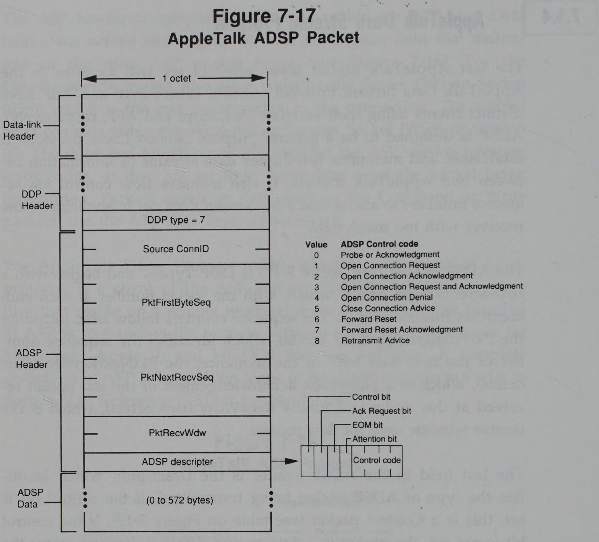

```mermaid
packet-beta
0-7: "DDP type = 7"
8-23: "Source ConnID"
24-55: "PktFirstByteSeq"
56-87: "PktNextRecvSeq"
88-103: "PktRecvWdw"
104: "Control bit"
105: "Ack Request bit"
106: "EOM bit"
107: "Attention bit"
108-111: "Control code"
112-143: "ADSP Data (0 to 572 bytes)"
```

| Field | Bit offset | Width (bits) | Description |
| :--- | :--- | :--- | :--- |
| DDP type | 0 | 8 | Protocol type, set to 7 for AppleTalk Data Stream Protocol (ADSP). |
| Source ConnID | 8 | 16 | Source Connection Identifier. |
| PktFirstByteSeq | 24 | 32 | Sequence number of the first data byte in the packet. |
| PktNextRecvSeq | 56 | 32 | Sequence number of the next expected data byte from the other end. |
| PktRecvWdw | 88 | 16 | Available receive window size in bytes. |
| Control bit | 104 | 1 | 1 indicates a control packet, 0 indicates a data packet. |
| Ack Request bit | 105 | 1 | If set, requests the receiver to send an acknowledgment packet. |
| EOM bit | 106 | 1 | End-of-message flag. |
| Attention bit | 107 | 1 | Indicates an attention message. |
| Control code | 108 | 4 | Specifies the control operation. |
| ADSP Data | 112 | 0-4576 | Variable length data field (0 to 572 bytes). |

**ADSP Control code values:**

| Value | ADSP Control code |
| :--- | :--- |
| 0 | Probe or Acknowledgment |
| 1 | Open Connection Request |
| 2 | Open Connection Acknowledgment |
| 3 | Open Connection Request and Acknowledgment |
| 4 | Open Connection Denial |
| 5 | Close Connection Advice |
| 6 | Forward Reset |
| 7 | Forward Reset Acknowledgment |
| 8 | Retransmit Advice |

# 7.6 Protocol Analysis with AppleTalk

To complete our study of the AppleTalk protocols, let's examine the details of two common operations: printing to a LaserWriter located on another AppleTalk network, and accessing a file on the same network.

In the first example, to access the printer, the client (maciicx, which is a Phase 2 node) must communicate with the router (macrouter, which is running both Phase 1 and 2 in the AppleTalk Upgrade Utility) that provides the connection to the other network. The printing process begins in frame 2 of Figure 7-18, and includes two ZIP packets (frames 31 and 32) that provide zone information to the client. The internet router tables are updated with the RTMP packets broadcast from the Phase 1 servers, such as kahuna (frame 1) and VAX1 (frame 14). The NBP request to find the name LaserWriter in frame 46 initiates the logical connection. The PAP connection is started in frame 59, and confirmed in frame 68. Actual transfer of the data begins in frame 72.

### Figure 7-18 AppleTalk Printing Analysis Summary

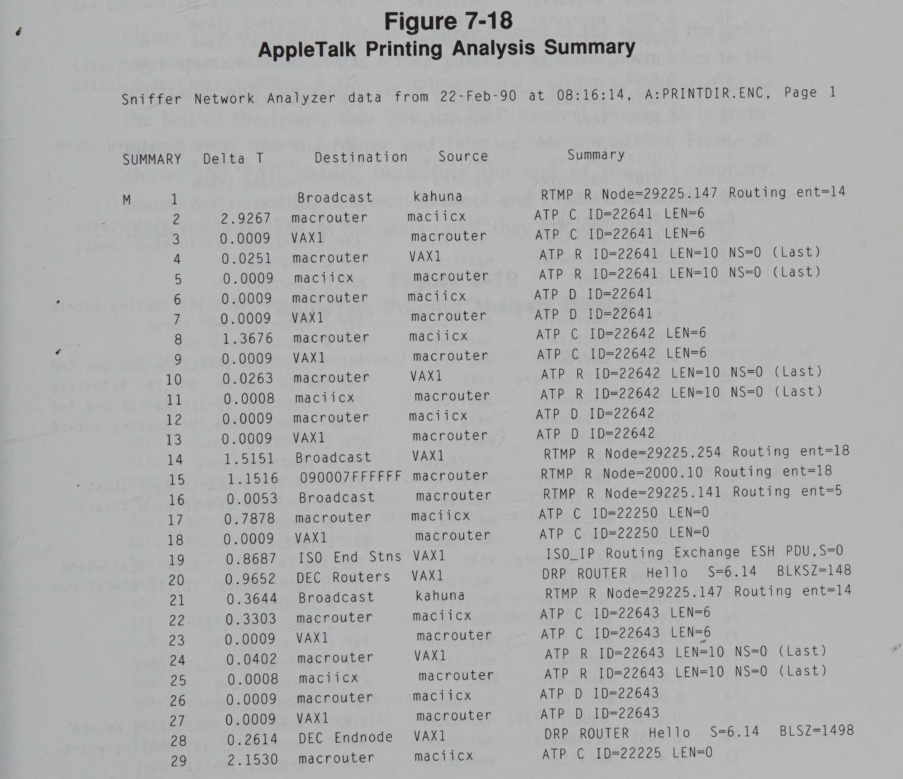
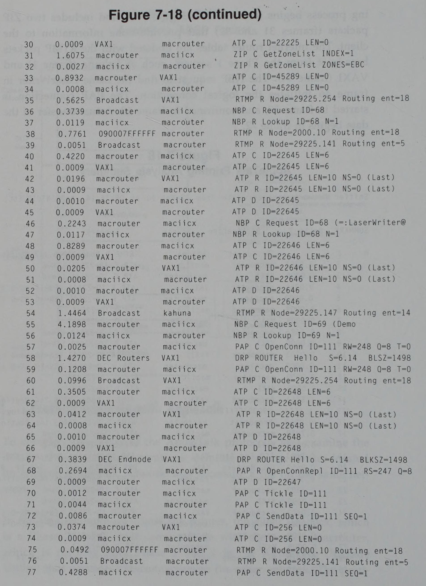
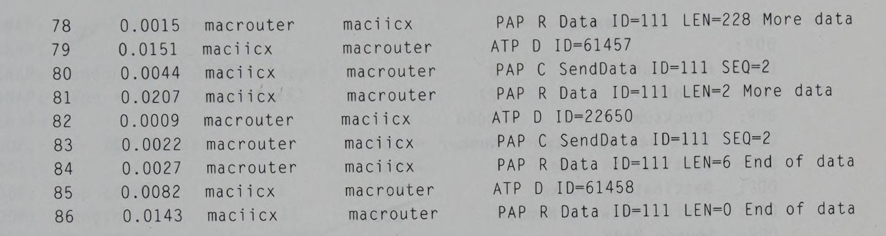

```text
Sniffer Network Analyzer data from 22-Feb-90 at 08:16:14, A:PRINTDIR.ENC, Page 1

SUMMARY  Delta T      Destination    Source       Summary

M   1                 Broadcast      kahuna       RTMP R Node=29225.147 Routing ent=14
    2    2.9267       macrouter      maciicx      ATP C ID=22641 LEN=6
    3    0.0009       VAX1           macrouter    ATP C ID=22641 LEN=6
    4    0.0251       macrouter      VAX1         ATP R ID=22641 LEN=10 NS=0 (Last)
    5    0.0009       maciicx        macrouter    ATP R ID=22641 LEN=10 NS=0 (Last)
    6    0.0009       macrouter      maciicx      ATP D ID=22641
    7    0.0009       VAX1           macrouter    ATP D ID=22641
    8    1.3676       macrouter      maciicx      ATP C ID=22642 LEN=6
    9    0.0009       VAX1           macrouter    ATP C ID=22642 LEN=6
   10    0.0263       macrouter      VAX1         ATP R ID=22642 LEN=10 NS=0 (Last)
   11    0.0008       maciicx        macrouter    ATP R ID=22642 LEN=10 NS=0 (Last)
   12    0.0009       macrouter      maciicx      ATP D ID=22642
   13    0.0009       VAX1           macrouter    ATP D ID=22642
   14    1.5151       Broadcast      VAX1         RTMP R Node=29225.254 Routing ent=18
   15    1.1516       090007FFFFFF   macrouter    RTMP R Node=2000.10 Routing ent=18
   16    0.0053       Broadcast      macrouter    RTMP R Node=29225.141 Routing ent=5
   17    0.7878       macrouter      maciicx      ATP C ID=22250 LEN=0
   18    0.0009       VAX1           macrouter    ATP C ID=22250 LEN=0
   19    0.8687       ISO End Stns   VAX1         ISO_IP Routing Exchange ESH PDU,S=0
   20    0.9652       DEC Routers    VAX1         DRP ROUTER Hello S=6.14 BLKSZ=148
   21    0.3644       Broadcast      kahuna       RTMP R Node=29225.147 Routing ent=14
   22    0.3303       macrouter      maciicx      ATP C ID=22643 LEN=6
   23    0.0009       VAX1           macrouter    ATP C ID=22643 LEN=6
   24    0.0402       macrouter      VAX1         ATP R ID=22643 LEN=10 NS=0 (Last)
   25    0.0008       maciicx        macrouter    ATP R ID=22643 LEN=10 NS=0 (Last)
   26    0.0009       macrouter      maciicx      ATP D ID=22643
   27    0.0009       VAX1           macrouter    ATP D ID=22643
   28    0.2614       DEC Endnode    VAX1         DRP ROUTER Hello S=6.14 BLSZ=1498
   29    2.1530       macrouter      maciicx      ATP C ID=22225 LEN=0
   30    0.0009       VAX1           macrouter    ATP C ID=22225 LEN=0
   31    1.6075       macrouter      maciicx      ZIP C GetZoneList INDEX=1
   32    0.0027       maciicx        macrouter    ZIP R GetZoneList ZONES=EBC
   33    0.8932       macrouter      VAX1         ATP C ID=45289 LEN=0
   34    0.0008       maciicx        macrouter    ATP C ID=45289 LEN=0
   35    0.5625       Broadcast      VAX1         RTMP R Node=29225.254 Routing ent=18
   36    0.3739       macrouter      maciicx      NBP C Request ID=68
   37    0.0119       maciicx        macrouter    NBP R Lookup ID=68 N=1
   38    0.7761       090007FFFFFF   macrouter    RTMP R Node=2000.10 Routing ent=18
   39    0.0051       Broadcast      macrouter    RTMP R Node=29225.141 Routing ent=5
   40    0.4220       macrouter      maciicx      ATP C ID=22645 LEN=6
   41    0.0009       VAX1           macrouter    ATP C ID=22645 LEN=6
   42    0.0196       macrouter      VAX1         ATP R ID=22645 LEN=10 NS=0 (Last)
   43    0.0009       maciicx        macrouter    ATP R ID=22645 LEN=10 NS=0 (Last)
   44    0.0100       macrouter      maciicx      ATP D ID=22645
   45    0.0009       VAX1           macrouter    ATP D ID=22645
   46    0.2243       macrouter      maciicx      NBP C Request ID=68 (=:LaserWriter@
   47    0.0117       maciicx        macrouter    NBP R Lookup ID=68 N=1
   48    0.8289       macrouter      maciicx      ATP C ID=22646 LEN=6
   49    0.0009       VAX1           macrouter    ATP C ID=22646 LEN=6
   50    0.0205       macrouter      VAX1         ATP R ID=22646 LEN=10 NS=0 (Last)
   51    0.0008       maciicx        macrouter    ATP R ID=22646 LEN=10 NS=0 (Last)
   52    0.0010       macrouter      maciicx      ATP D ID=22646
   53    0.0009       VAX1           macrouter    ATP D ID=22646
   54    1.4464       Broadcast      kahuna       RTMP R Node=29225.147 Routing ent=14
   55    4.1898       macrouter      maciicx      NBP C Request ID=69 (Demo
   56    0.0124       maciicx        macrouter    NBP R Lookup ID=69 N=1
   57    0.0025       macrouter      maciicx      PAP C OpenConn ID=111 RW=248 Q=8 T=0
   58    1.4270       DEC Routers    VAX1         DRP ROUTER Hello S=6.14 BLSZ=1498
   59    0.1208       macrouter      maciicx      PAP C OpenConn ID=111 RW=248 Q=8 T=0
   60    0.0996       Broadcast      VAX1         RTMP R Node=29225.254 Routing ent=18
   61    0.3505       macrouter      maciicx      ATP C ID=22648 LEN=6
   62    0.0009       VAX1           macrouter    ATP C ID=22648 LEN=6
   63    0.0412       macrouter      VAX1         ATP R ID=22648 LEN=10 NS=0 (Last)
   64    0.0008       maciicx        macrouter    ATP R ID=22648 LEN=10 NS=0 (Last)
   65    0.0010       macrouter      maciicx      ATP D ID=22648
   66    0.0009       VAX1           macrouter    ATP D ID=22648
   67    0.3839       DEC Endnode    VAX1         DRP ROUTER Hello S=6.14 BLSZ=1498
   68    0.2694       maciicx        macrouter    PAP R OpenConnRepl ID=111 RS=247 Q=8
   69    0.0009       macrouter      maciicx      ATP D ID=22647
   70    0.0012       macrouter      maciicx      PAP C Tickle ID=111
   71    0.0044       maciicx        macrouter    PAP C Tickle ID=111
   72    0.0086       macrouter      maciicx      PAP C SendData ID=111 SEQ=1
   73    0.0374       macrouter      VAX1         ATP C ID=256 LEN=0
   74    0.0009       maciicx        macrouter    ATP C ID=256 LEN=0
   75    0.0492       090007FFFFFF   macrouter    RTMP R Node=2000.10 Routing ent=18
   76    0.0051       Broadcast      macrouter    RTMP R Node=29225.141 Routing ent=5
   77    0.4288       maciicx        macrouter    PAP C SendData ID=111 SEQ=1
   78    0.0015       macrouter      maciicx      PAP R Data ID=111 LEN=228 More data
   79    0.0151       maciicx        macrouter    ATP D ID=61457
   80    0.0044       maciicx        macrouter    PAP C SendData ID=111 SEQ=2
   81    0.0207       maciicx        macrouter    PAP R Data ID=111 LEN=2 More data
   82    0.0009       macrouter      maciicx      ATP D ID=22650
   83    0.0022       macrouter      maciicx      PAP C SendData ID=111 SEQ=2
   84    0.0027       macrouter      maciicx      PAP R Data ID=111 LEN=6 End of data
   85    0.0082       maciicx        macrouter    ATP D ID=61458
   86    0.0143       maciicx        macrouter    PAP R Data ID=111 LEN=0 End of data
```

Figure 7-19 shows the details of three frames at the end of the printing sequence. Frame 84 is a PAP packet sent from the maciicx to the macrouter and containing six octets of data, which is indicated to be the last of the transaction (see the PAP header). Frame 85 is transmitted from the macrouter and releases the connection. Frame 86 shows the PAP header indicating the end of file. In summary, macrouter is routing between Phase 1 and Phase 2 networks. While these networks are on the same cable, they are logically different.

### Figure 7-19 AppleTalk Printing Analysis Details

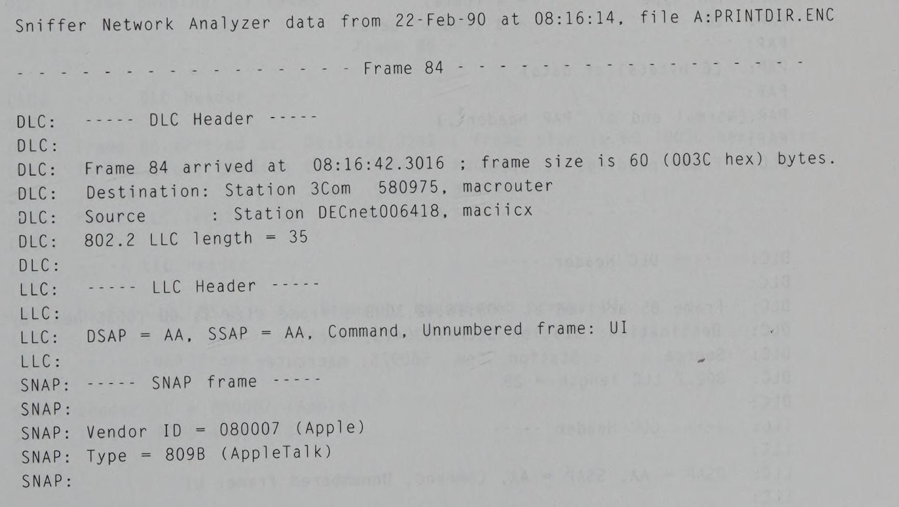
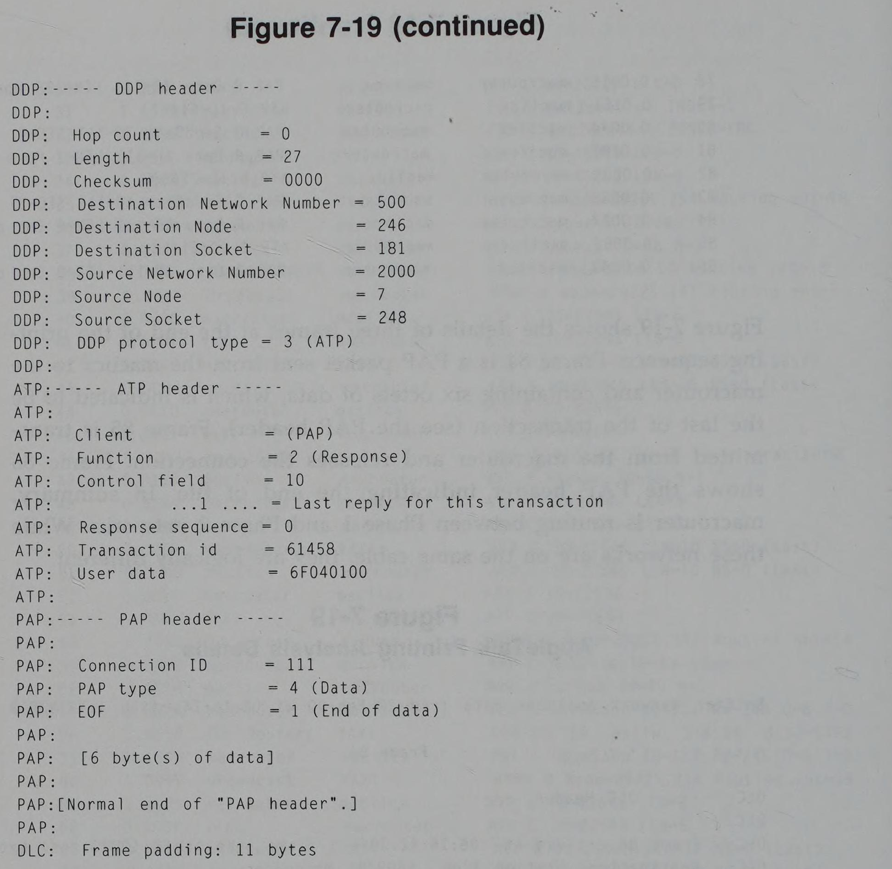
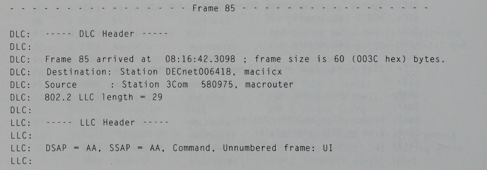
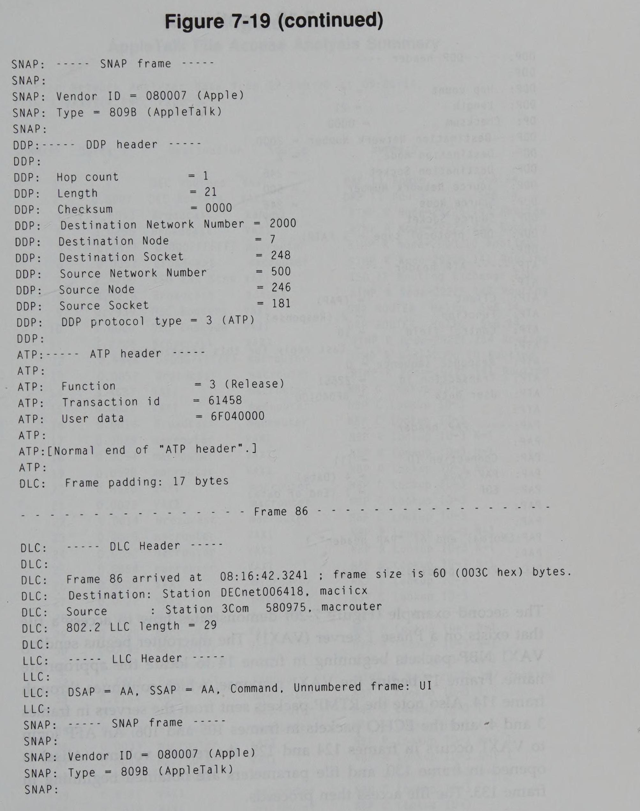
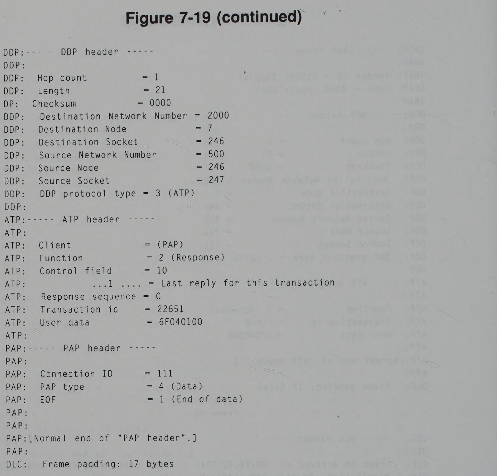

```
Sniffer Network Analyzer data from 22-Feb-90 at 08:16:14, file A:PRINTDIR.ENC

- - - - - - - - - - - - - - Frame 84 - - - - - - - - - - - - - -

DLC:   ----- DLC Header -----
DLC:
DLC:   Frame 84 arrived at  08:16:42.3016 ; frame size is 60 (003C hex) bytes.
DLC:   Destination: Station 3Com   580975, macrouter
DLC:   Source       : Station DECnet006418, maciicx
DLC:   802.2 LLC length = 35
DLC:
LLC:   ----- LLC Header -----
LLC:
LLC:   DSAP = AA, SSAP = AA, Command, Unnumbered frame: UI
LLC:
SNAP:  ----- SNAP frame -----
SNAP:
SNAP:  Vendor ID = 080007 (Apple)
SNAP:  Type = 809B (AppleTalk)
SNAP:
DDP:----- DDP header -----
DDP:
DDP: Hop count           = 0
DDP: Length              = 27
DDP: Checksum            = 0000
DDP: Destination Network Number = 500
DDP: Destination Node           = 246
DDP: Destination Socket         = 181
DDP: Source Network Number      = 2000
DDP: Source Node                = 7
DDP: Source Socket              = 248
DDP: DDP protocol type = 3 (ATP)
DDP:
ATP:----- ATP header -----
ATP:
ATP: Client              = (PAP)
ATP: Function            = 2 (Response)
ATP: Control field       = 10
ATP:       ...1 ....     = Last reply for this transaction
ATP: Response sequence = 0
ATP: Transaction id    = 61458
ATP: User data         = 6F040100
ATP:
PAP:----- PAP header -----
PAP:
PAP: Connection ID       = 111
PAP: PAP type            = 4 (Data)
PAP: EOF                 = 1 (End of data)
PAP:
PAP: [6 byte(s) of data]
PAP:
PAP: [Normal end of "PAP header".]
PAP:
DLC: Frame padding: 11 bytes

- - - - - - - - - - - - - - - - - Frame 85 - - - - - - - - - - - - - - - - -

DLC: ----- DLC Header -----
DLC:
DLC: Frame 85 arrived at 08:16:42.3098 ; frame size is 60 (003C hex) bytes.
DLC: Destination: Station DECnet006418, maciicx
DLC: Source      : Station 3Com 580975, macrouter
DLC: 802.2 LLC length = 29
DLC:
LLC: ----- LLC Header -----
LLC:
LLC: DSAP = AA, SSAP = AA, Command, Unnumbered frame: UI
LLC:
SNAP: ----- SNAP frame -----
SNAP:
SNAP: Vendor ID = 080007 (Apple)
SNAP: Type = 809B (AppleTalk)
SNAP:
DDP: ----- DDP header -----
DDP:
DDP:  Hop count           = 1
DDP:  Length              = 21
DDP:  Checksum            = 0000
DDP:  Destination Network Number = 2000
DDP:  Destination Node    = 7
DDP:  Destination Socket  = 248
DDP:  Source Network Number = 500
DDP:  Source Node         = 246
DDP:  Source Socket       = 181
DDP:  DDP protocol type = 3 (ATP)
DDP:
ATP: ----- ATP header -----
ATP:
ATP:  Function           = 3 (Release)
ATP:  Transaction id     = 61458
ATP:  User data          = 6F040000
ATP:
ATP: [Normal end of "ATP header".]
ATP:
DLC:  Frame padding: 17 bytes

--------------------------- Frame 86 ---------------------------

DLC: ----- DLC Header -----
DLC:
DLC:  Frame 86 arrived at  08:16:42.3241 ; frame size is 60 (003C hex) bytes.
DLC:  Destination: Station DECnet006418, maciicx
DLC:  Source      : Station 3Com  580975, macrouter
DLC:  802.2 LLC length = 29
DLC:
LLC: ----- LLC Header -----
LLC:
LLC:  DSAP = AA, SSAP = AA, Command, Unnumbered frame: UI
LLC:
SNAP: ----- SNAP frame -----
SNAP:
SNAP: Vendor ID = 080007 (Apple)
SNAP: Type = 809B (AppleTalk)
SNAP:
DDP:----- DDP header -----
DDP:
DDP:  Hop count              = 1
DDP:  Length                 = 21
DP:   Checksum               = 0000
DDP:  Destination Network Number = 2000
DDP:  Destination Node       = 7
DDP:  Destination Socket     = 246
DDP:  Source Network Number  = 500
DDP:  Source Node            = 246
DDP:  Source Socket          = 247
DDP:  DDP protocol type = 3 (ATP)
DDP:
ATP:----- ATP header -----
ATP:
ATP:  Client                 = (PAP)
ATP:  Function               = 2 (Response)
ATP:  Control field          = 10
ATP:           ...1 ....     = Last reply for this transaction
ATP:  Response sequence = 0
ATP:  Transaction id    = 22651
ATP:  User data         = 6F040100
ATP:
PAP:----- PAP header -----
PAP:
PAP:  Connection ID          = 111
PAP:  PAP type               = 4 (Data)
PAP:  EOF                    = 1 (End of data)
PAP:
PAP:
PAP:[Normal end of "PAP header".]
PAP:
DLC:  Frame padding: 17 bytes
```

The second example (Figure 7-20) demonstrates how to access a file that exists on a Phase 1 server (VAX1). The macrouter begins sending VAX1 NBP packets beginning in frame 14 to locate the appropriate name. Frame 17 begins the VAX1 response, which continues through frame 114. Also note the RTMP packets sent from the servers in frames 3 and 4, and the ECHO packets in frames 105 and 106. An AFP login to VAX1 occurs in frames 124 and 125, the remote volume (Alisa) is opened in frame 130, and file parameters are obtained beginning in frame 133. The file access then proceeds.


### Figure 7-20 AppleTalk File Access Analysis Summary

Sniffer Network Analyzer data from 22-Feb-90 at 09:21:14.
file A:VAXFILE.ENC, Page 1

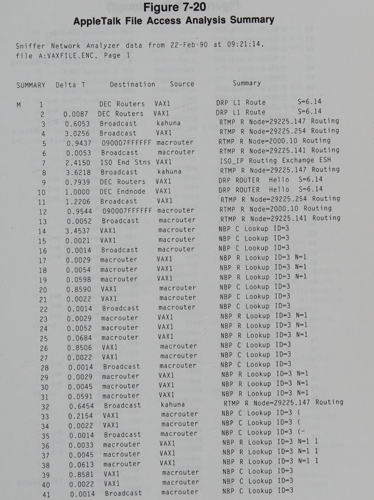
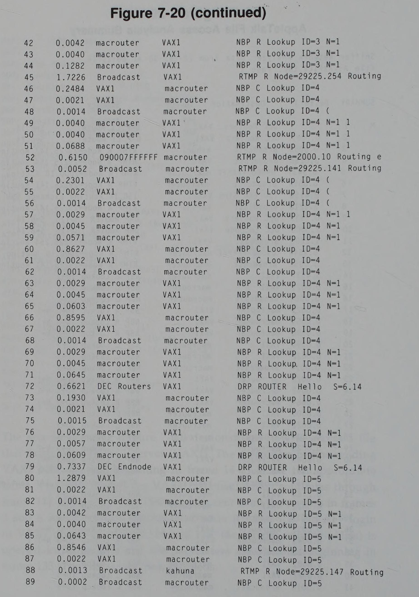
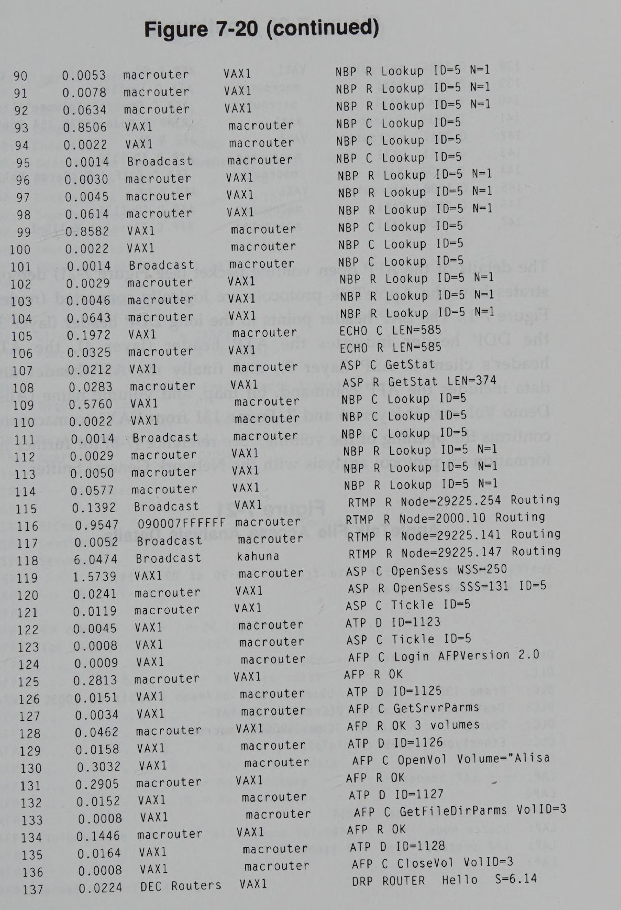
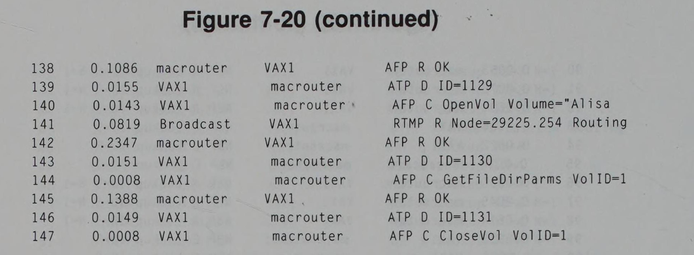

| SUMMARY | Delta T | Destination | Source | Summary |
|---|---|---|---|---|
| M 1 | | DEC Routers | VAX1 | DRP L1 Route S=6.14 |
| 2 | 0.0087 | DEC Routers | VAX1 | DRP L1 Route S=6.14 |
| 3 | 0.6053 | Broadcast | kahuna | RTMP R Node=29225.147 Routing |
| 4 | 3.0256 | Broadcast | VAX1 | RTMP R Node=29225.254 Routing |
| 5 | 0.9437 | 090007FFFFFF | macrouter | RTMP R Node=2000.10 Routing |
| 6 | 0.0053 | Broadcast | macrouter | RTMP R Node=29225.141 Routing |
| 7 | 2.4150 | ISO End Stns | VAX1 | ISO_IP Routing Exchange ESH |
| 8 | 3.6218 | Broadcast | kahuna | RTMP R Node=29225.147 Routing |
| 9 | 0.7939 | DEC Routers | VAX1 | DRP ROUTER Hello S=6.14 |
| 10 | 1.0000 | DEC Endnode | VAX1 | DRP ROUTER Hello S=6.14 |
| 11 | 1.2206 | Broadcast | VAX1 | RTMP R Node=29225.254 Routing |
| 12 | 0.9544 | 090007FFFFFF | macrouter | RTMP R Node=2000.10 Routing |
| 13 | 0.0052 | Broadcast | macrouter | RTMP R Node=29225.141 Routing |
| 14 | 3.4537 | VAX1 | macrouter | NBP C Lookup ID=3 |
| 15 | 0.0021 | VAX1 | macrouter | NBP C Lookup ID=3 |
| 16 | 0.0014 | Broadcast | macrouter | NBP C Lookup ID=3 |
| 17 | 0.0029 | macrouter | VAX1 | NBP R Lookup ID=3 N=1 |
| 18 | 0.0054 | macrouter | VAX1 | NBP R Lookup ID=3 N=1 |
| 19 | 0.0598 | macrouter | VAX1 | NBP R Lookup ID=3 N=1 |
| 20 | 0.8590 | VAX1 | macrouter | NBP C Lookup ID=3 |
| 21 | 0.0022 | VAX1 | macrouter | NBP C Lookup ID=3 |
| 22 | 0.0014 | Broadcast | macrouter | NBP C Lookup ID=3 |
| 23 | 0.0029 | macrouter | VAX1 | NBP R Lookup ID=3 N=1 |
| 24 | 0.0052 | macrouter | VAX1 | NBP R Lookup ID=3 N=1 |
| 25 | 0.0684 | macrouter | VAX1 | NBP R Lookup ID=3 N=1 |
| 26 | 0.8506 | VAX1 | macrouter | NBP C Lookup ID=3 |
| 27 | 0.0022 | VAX1 | macrouter | NBP C Lookup ID=3 |
| 28 | 0.0014 | Broadcast | macrouter | NBP C Lookup ID=3 |
| 29 | 0.0029 | macrouter | VAX1 | NBP R Lookup ID=3 N=1 |
| 30 | 0.0045 | macrouter | VAX1 | NBP R Lookup ID=3 N=1 |
| 31 | 0.0591 | macrouter | VAX1 | NBP R Lookup ID=3 N=1 |
| 32 | 0.6454 | Broadcast | kahuna | RTMP R Node=29225.147 Routing |
| 33 | 0.2154 | VAX1 | macrouter | NBP C Lookup ID=3 ( |
| 34 | 0.0022 | VAX1 | macrouter | NBP C Lookup ID=3 ( |
| 35 | 0.0014 | Broadcast | macrouter | NBP C Lookup ID=3 (- |
| 36 | 0.0033 | macrouter | VAX1 | NBP R Lookup ID=3 N=1 1 |
| 37 | 0.0045 | macrouter | VAX1 | NBP R Lookup ID=3 N=1 1 |
| 38 | 0.0613 | macrouter | VAX1 | NBP R Lookup ID=3 N=1 1 |
| 39 | 0.8581 | VAX1 | macrouter | NBP C Lookup ID=3 |
| 40 | 0.0022 | VAX1 | macrouter | NBP C Lookup ID=3 |
| 41 | 0.0014 | Broadcast | macrouter | NBP C Lookup ID=3 |
| 42 | 0.0042 | macrouter  | VAX1          | NBP R Lookup ID=3 N=1 |
| 43 | 0.0040 | macrouter  | VAX1          | NBP R Lookup ID=3 N=1 |
| 44 | 0.1282 | macrouter  | VAX1          | NBP R Lookup ID=3 N=1 |
| 45 | 1.7226 | Broadcast  | VAX1          | RTMP R Node=29225.254 Routing |
| 46 | 0.2484 | VAX1       | macrouter     | NBP C Lookup ID=4 |
| 47 | 0.0021 | VAX1       | macrouter     | NBP C Lookup ID=4 |
| 48 | 0.0014 | Broadcast  | macrouter     | NBP C Lookup ID=4 ( |
| 49 | 0.0040 | macrouter  | VAX1          | NBP R Lookup ID=4 N=1 1 |
| 50 | 0.0040 | macrouter  | VAX1          | NBP R Lookup ID=4 N=1 1 |
| 51 | 0.0688 | macrouter  | VAX1          | NBP R Lookup ID=4 N=1 1 |
| 52 | 0.6150 | 090007FFFFF| macrouter     | RTMP R Node=2000.10 Routing e |
| 53 | 0.0052 | Broadcast  | macrouter     | RTMP R Node=29225.141 Routing |
| 54 | 0.2301 | VAX1       | macrouter     | NBP C Lookup ID=4 ( |
| 55 | 0.0022 | VAX1       | macrouter     | NBP C Lookup ID=4 ( |
| 56 | 0.0014 | Broadcast  | macrouter     | NBP C Lookup ID=4 ( |
| 57 | 0.0029 | macrouter  | VAX1          | NBP R Lookup ID=4 N=1 1 |
| 58 | 0.0045 | macrouter  | VAX1          | NBP R Lookup ID=4 N=1 |
| 59 | 0.0571 | macrouter  | VAX1          | NBP R Lookup ID=4 N=1 |
| 60 | 0.8627 | VAX1       | macrouter     | NBP C Lookup ID=4 |
| 61 | 0.0022 | VAX1       | macrouter     | NBP C Lookup ID=4 |
| 62 | 0.0014 | Broadcast  | macrouter     | NBP C Lookup ID=4 |
| 63 | 0.0029 | macrouter  | VAX1          | NBP R Lookup ID=4 N=1 |
| 64 | 0.0045 | macrouter  | VAX1          | NBP R Lookup ID=4 N=1 |
| 65 | 0.0603 | macrouter  | VAX1          | NBP R Lookup ID=4 N=1 |
| 66 | 0.8595 | VAX1       | macrouter     | NBP C Lookup ID=4
| 67 | 0.0022 | VAX1       | macrouter     | NBP C Lookup ID=4
| 68 | 0.0014 | Broadcast  | macrouter     | NBP C Lookup ID=4
| 69 | 0.0029 | macrouter  | VAX1          | NBP R Lookup ID=4 N=1
| 70 | 0.0045 | macrouter  | VAX1          | NBP R Lookup ID=4 N=1
| 71 | 0.0645 | macrouter  | VAX1          | NBP R Lookup ID=4 N=1
| 72 | 0.6621 | DEC Routers| VAX1          | DRP ROUTER Hello  S=6.14
| 73 | 0.1930 | VAX1       | macrouter     | NBP C Lookup ID=4
| 74 | 0.0021 | VAX1       | macrouter     | NBP C Lookup ID=4
| 75 | 0.0015 | Broadcast  | macrouter     | NBP C Lookup ID=4
| 76 | 0.0029 | macrouter  | VAX1          | NBP R Lookup ID=4 N=1
| 77 | 0.0057 | macrouter  | VAX1          | NBP R Lookup ID=4 N=1
| 78 | 0.0609 | macrouter  | VAX1          | NBP R Lookup ID=4 N=1
| 79 | 0.7337 | DEC Endnode| VAX1          | DRP ROUTER Hello  S=6.14
| 80 | 1.2879 | VAX1       | macrouter     | NBP C Lookup ID=5
| 81 | 0.0022 | VAX1       | macrouter     | NBP C Lookup ID=5
| 82 | 0.0014 | Broadcast  | macrouter     | NBP C Lookup ID=5
| 83 | 0.0042 | macrouter  | VAX1          | NBP R Lookup ID=5 N=1
| 84 | 0.0040 | macrouter  | VAX1          | NBP R Lookup ID=5 N=1
| 85 | 0.0643 | macrouter  | VAX1          | NBP R Lookup ID=5 N=1
| 86 | 0.8546 | VAX1       | macrouter     | NBP C Lookup ID=5
| 87 | 0.0022 | VAX1       | macrouter     | NBP C Lookup ID=5
| 88 | 0.0013 | Broadcast  | kahuna        | RTMP R Node=29225.147 Routing
| 89 | 0.0002 | Broadcast  | macrouter     | NBP C Lookup ID=5
| 90 | 0.0053 | macrouter | VAX1 | NBP R Lookup ID=5 N=1 |
| 91 | 0.0078 | macrouter | VAX1 | NBP R Lookup ID=5 N=1 |
| 92 | 0.0634 | macrouter | VAX1 | NBP R Lookup ID=5 N=1 |
| 93 | 0.8506 | VAX1 | macrouter | NBP C Lookup ID=5 |
| 94 | 0.0022 | VAX1 | macrouter | NBP C Lookup ID=5 |
| 95 | 0.0014 | Broadcast | macrouter | NBP C Lookup ID=5 |
| 96 | 0.0030 | macrouter | VAX1 | NBP R Lookup ID=5 N=1 |
| 97 | 0.0045 | macrouter | VAX1 | NBP R Lookup ID=5 N=1 |
| 98 | 0.0614 | macrouter | VAX1 | NBP R Lookup ID=5 N=1 |
| 99 | 0.8582 | VAX1 | macrouter | NBP C Lookup ID=5 |
| 100 | 0.0022 | VAX1 | macrouter | NBP C Lookup ID=5 |
| 101 | 0.0014 | Broadcast | macrouter | NBP C Lookup ID=5 |
| 102 | 0.0029 | macrouter | VAX1 | NBP R Lookup ID=5 N=1 |
| 103 | 0.0046 | macrouter | VAX1 | NBP R Lookup ID=5 N=1 |
| 104 | 0.0643 | macrouter | VAX1 | NBP R Lookup ID=5 N=1 |
| 105 | 0.1972 | VAX1 | macrouter | ECHO C LEN=585 |
| 106 | 0.0325 | macrouter | VAX1 | ECHO R LEN=585 |
| 107 | 0.0212 | VAX1 | macrouter | ASP C GetStat |
| 108 | 0.0283 | macrouter | VAX1 | ASP R GetStat LEN=374 |
| 109 | 0.5760 | VAX1 | macrouter | NBP C Lookup ID=5 |
| 110 | 0.0022 | VAX1 | macrouter | NBP C Lookup ID=5 |
| 111 | 0.0014 | Broadcast | macrouter | NBP C Lookup ID=5 |
| 112 | 0.0029 | macrouter | VAX1 | NBP R Lookup ID=5 N=1 |
| 113 | 0.0050 | macrouter | VAX1 | NBP R Lookup ID=5 N=1 |
| 114 | 0.0577 | macrouter | VAX1 | NBP R Lookup ID=5 N=1 |
| 115 | 0.1392 | Broadcast | VAX1 | RTMP R Node=29225.254 Routing |
| 116 | 0.9547 | 090007FFFFFF | macrouter | RTMP R Node=2000.10 Routing |
| 117 | 0.0052 | Broadcast | macrouter | RTMP R Node=29225.141 Routing |
| 118 | 6.0474 | Broadcast | kahuna | RTMP R Node=29225.147 Routing |
| 119 | 1.5739 | VAX1 | macrouter | ASP C OpenSess WSS=250 |
| 120 | 0.0241 | macrouter | VAX1 | ASP R OpenSess SSS=131 ID=5 |
| 121 | 0.0119 | macrouter | VAX1 | ASP C Tickle ID=5 |
| 122 | 0.0045 | VAX1 | macrouter | ATP D ID=1123 |
| 123 | 0.0008 | VAX1 | macrouter | ASP C Tickle ID=5 |
| 124 | 0.0009 | VAX1 | macrouter | AFP C Login AFPVersion 2.0 |
| 125 | 0.2813 | macrouter | VAX1 | AFP R OK |
| 126 | 0.0151 | VAX1 | macrouter | ATP D ID=1125 |
| 127 | 0.0034 | VAX1 | macrouter | AFP C GetSrvrParms |
| 128 | 0.0462 | macrouter | VAX1 | AFP R OK 3 volumes |
| 129 | 0.0158 | VAX1 | macrouter | ATP D ID=1126 |
| 130 | 0.3032 | VAX1 | macrouter | AFP C OpenVol Volume="Alisa" |
| 131 | 0.2905 | macrouter | VAX1 | AFP R OK |
| 132 | 0.0152 | VAX1 | macrouter | ATP D ID=1127 |
| 133 | 0.0008 | VAX1 | macrouter | AFP C GetFileDirParms VolID=3 |
| 134 | 0.1446 | macrouter | VAX1 | AFP R OK |
| 135 | 0.0164 | VAX1 | macrouter | ATP D ID=1128 |
| 136 | 0.0008 | VAX1 | macrouter | AFP C CloseVol VolID=3 |
| 137 | 0.0224 | DEC Routers | VAX1 | DRP ROUTER Hello S=6.14 |
| 138 | 0.1086 | macrouter   | VAX1        | AFP R OK |
| 139 | 0.0155 | VAX1        | macrouter   | ATP D ID=1129 |
| 140 | 0.0143 | VAX1        | macrouter   | AFP C OpenVol Volume="Alisa |
| 141 | 0.0819 | Broadcast   | VAX1        | RTMP R Node=29225.254 Routing |
| 142 | 0.2347 | macrouter   | VAX1        | AFP R OK |
| 143 | 0.0151 | VAX1        | macrouter   | ATP D ID=1130 |
| 144 | 0.0008 | VAX1        | macrouter   | AFP C GetFileDirParms VolID=1 |
| 145 | 0.1388 | macrouter   | VAX1        | AFP R OK |
| 146 | 0.0149 | VAX1        | macrouter   | ATP D ID=1131 |
| 147 | 0.0008 | VAX1        | macrouter   | AFP C CloseVol VolID=1 |


The details of the AFP open volume packet (see Figure 7-21) demonstrates how the AppleTalk protocols are logically connected (review Figure 7-1). The LAP header points to the long DDP header (layer 3), the DDP header indicates the ATP header (layer 4), the ATP header's client is ASP (layer 5), and finally the ASP header and data includes the AFP command, bit map, and volume name (Alisa Demo Volume) at layers 6 and 7. Frame 131 from VAX1 to macrouter confirms the opening of the volume. See reference [7-8] for further information on protocol analysis with the Network General Sniffer.

### Figure 7-21 AppleTalk File Access Analysis Details

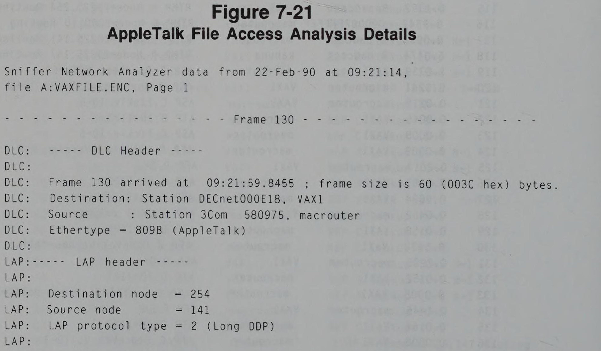
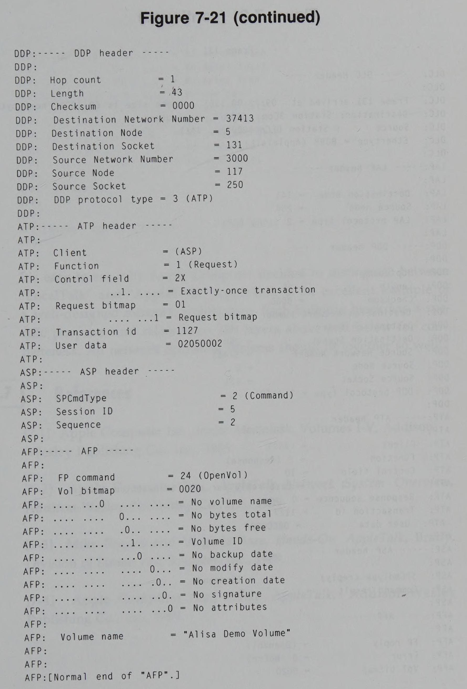
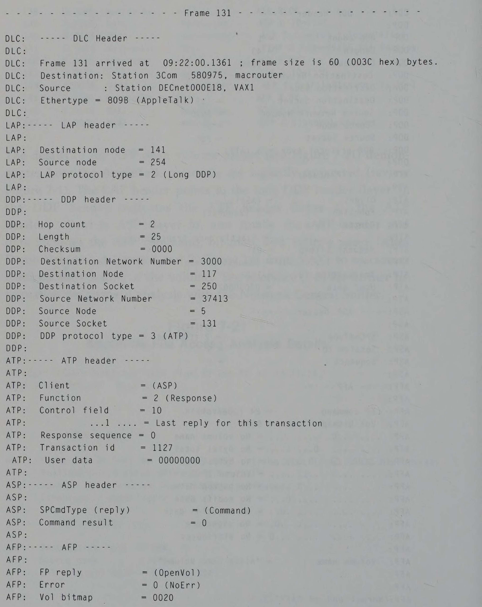
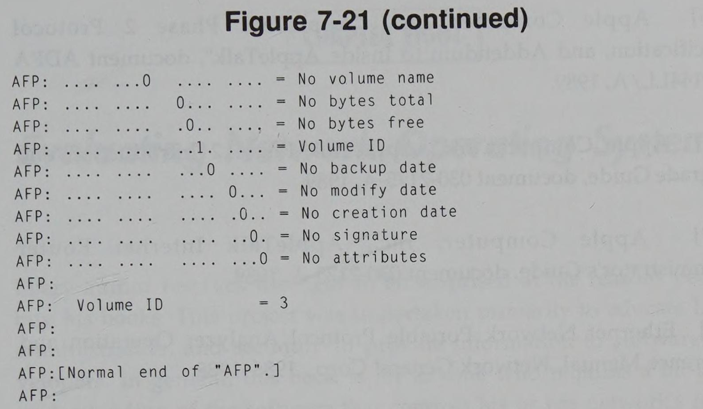

```text
Sniffer Network Analyzer data from 22-Feb-90 at 09:21:14,
file A:VAXFILE.ENC, Page 1

- - - - - - - - - - - - - - - - - - Frame 130 - - - - - - - - - - - - - - - - -

DLC:  - - - - DLC Header - - - - -
DLC:
DLC:  Frame 130 arrived at  09:21:59.8455 ; frame size is 60 (003C hex) bytes.
DLC:  Destination: Station DECnet000E18, VAX1
DLC:  Source       : Station 3Com    580975, macrouter
DLC:  Ethertype = 809B (AppleTalk)
DLC:
LAP: - - - - LAP header - - - - -
LAP:
LAP:  Destination node = 254
LAP:  Source node      = 141
LAP:  LAP protocol type = 2 (Long DDP)
LAP:
DDP:----- DDP header -----
DDP:
DDP:  Hop count                  = 1
DDP:  Length                     = 43
DDP:  Checksum                   = 0000
DDP:  Destination Network Number = 37413
DDP:  Destination Node           = 5
DDP:  Destination Socket         = 131
DDP:  Source Network Number      = 3000
DDP:  Source Node                = 117
DDP:  Source Socket              = 250
DDP:  DDP protocol type = 3 (ATP)
DDP:
ATP:----- ATP header -----
ATP:
ATP:  Client                     = (ASP)
ATP:  Function                   = 1 (Request)
ATP:  Control field              = 2X
ATP:              ..1. ....      = Exactly-once transaction
ATP:  Request bitmap             = 01
ATP:              .... ...1      = Request bitmap
ATP:  Transaction id             = 1127
ATP:  User data                  = 02050002
ATP:
ASP:----- ASP header -----
ASP:
ASP:  SPCmdType                  = 2 (Command)
ASP:  Session ID                 = 5
ASP:  Sequence                   = 2
ASP:
AFP:----- AFP -----
AFP:
AFP:  FP command                 = 24 (OpenVol)
AFP:  Vol bitmap                 = 0020
AFP:  ....  ...0  ....  ....     = No volume name
AFP:  ....  ....  0...  ....     = No bytes total
AFP:  ....  ....  .0..  ....     = No bytes free
AFP:  ....  ....  ..1.  ....     = Volume ID
AFP:  ....  ....  ...0  ....     = No backup date
AFP:  ....  ....  ....  0...     = No modify date
AFP:  ....  ....  ....  .0..     = No creation date
AFP:  ....  ....  ....  ..0.     = No signature
AFP:  ....  ....  ....  ...0     = No attributes
AFP:
AFP:  Volume name                = "Alisa Demo Volume"
AFP:
AFP:
AFP:[Normal end of "AFP".]

- - - - - - - - - - - - Frame 131 - - - - - - - - - - - -

DLC: ----- DLC Header -----
DLC:
DLC: Frame 131 arrived at 09:22:00.1361 ; frame size is 60 (003C hex) bytes.
DLC: Destination: Station 3Com 580975, macrouter
DLC: Source      : Station DECnet000E18, VAX1
DLC: Ethertype = 809B (AppleTalk)
DLC:
LAP:---- LAP header -----
LAP:
LAP: Destination node = 141
LAP: Source node      = 254
LAP: LAP protocol type = 2 (Long DDP)
LAP:
DDP:----- DDP header -----
DDP:
DDP: Hop count              = 2
DDP: Length                 = 25
DDP: Checksum               = 0000
DDP: Destination Network Number = 3000
DDP: Destination Node           = 117
DDP: Destination Socket         = 250
DDP: Source Network Number      = 37413
DDP: Source Node                = 5
DDP: Source Socket              = 131
DDP: DDP protocol type = 3 (ATP)
DDP:
ATP:---- ATP header -----
ATP:
ATP: Client             = (ASP)
ATP: Function           = 2 (Response)
ATP: Control field      = 10
ATP:           ...1 .... = Last reply for this transaction
ATP: Response sequence  = 0
ATP: Transaction id     = 1127
ATP: User data          = 00000000
ATP:
ASP:---- ASP header -----
ASP:
ASP: SPCmdType (reply)       = (Command)
ASP: Command result          = 0
ASP:
AFP:---- AFP -----
AFP:
AFP: FP reply           = (OpenVol)
AFP: Error              = 0 (NoErr)
AFP: Vol bitmap         = 0020
AFP: .... ...0           = No volume name
AFP: .... .... 0... .... = No bytes total
AFP: .... .... .0.. .... = No bytes free
AFP: .... .... ..1. .... = Volume ID
AFP: .... .... ...0 .... = No backup date
AFP: .... .... .... 0... = No modify date
AFP: .... .... .... .0.. = No creation date
AFP: .... .... .... ..0. = No signature
AFP: .... .... .... ...0 = No attributes
AFP:
AFP: Volume ID           = 3
AFP:
AFP:
AFP: [Normal end of "AFP".]
AFP:
```


```mermaid
packet-beta
0: "Attributes"
1: "Signature"
2: "Creation Date"
3: "Modification Date"
4: "Backup Date"
5: "Volume ID"
6: "Bytes Free"
7: "Bytes Total"
8: "Volume Name"
9-15: "Reserved"
```

| Field | Bit offset | Width (bits) | Description |
|---|---|---|---|
| Attributes | 0 | 1 | Flag for volume attributes |
| Signature | 1 | 1 | Flag for volume signature |
| Creation Date | 2 | 1 | Flag for volume creation date |
| Modification Date | 3 | 1 | Flag for volume modification date |
| Backup Date | 4 | 1 | Flag for volume backup date |
| Volume ID | 5 | 1 | Flag for Volume ID |
| Bytes Free | 6 | 1 | Flag for bytes free on volume |
| Bytes Total | 7 | 1 | Flag for total bytes on volume |
| Volume Name | 8 | 1 | Flag for volume name |
| Reserved | 9 | 7 | Reserved bits |

It's easy to see why Apple Computer decided to distinguish between "LocalTalk" and "AppleTalk." AppleTalk is an excellent example of a well-designed network architecture. Each building block has a specific purpose, and relies upon the layers above and below for completeness. All network operating systems should fit together so well!

## 7.7 References

[7-1] Apple Computer Inc., Inside Macintosh, Volumes I-V, Addison-Wesley Publishing Co., Inc., 1985

[7-2] Apple Computer Inc., AppleTalk Network System Overview, Addison-Wesley Publishing Co., Inc., 1989.

[7-3] Mike Rogers and Virginia Bare, Hands-On AppleTalk, Brady, Division of Simon and Schuster, Inc., 1989.

[7-4] Apple Computer Inc., Inside AppleTalk, Addison-Wesley Publishing Co., Inc., 1989.

[7-5] Apple Computer Inc., "AppleTalk Phase 2 Protocol Specification, and Addendum to Inside AppleTalk", document ADPA #C0144LL/A, 1989.

[7-6] Apple Computer Inc., AppleTalk Phase 2 Introduction and Upgrade Guide, document 030-2175-A, 1989.

[7-7] Apple Computer, Inc., AppleTalk Internet Router Administrator's Guide, document 030-2175-A, 1989.

[7-8] Ethernet Network Portable Protocol Analyzer Operation and Reference Manual, Network General Corp., 1986–1988.
