# Part I Physical and Data Links

PART I of *Inside AppleTalk* discusses the protocols used to communicate between the nodes of a single AppleTalk network. These protocols comprise the two lowest layers of the AppleTalk protocol architecture (as shown in Figure I-9 of the Introduction).

In particular, Part I specifies:

* the LocalTalk Link Access Protocol (LLAP)
* the AppleTalk Address Resolution Protocol (AARP)
* the EtherTalk Link Access Protocol (ELAP)
* the TokenTalk Link Access Protocol (TLAP)

AppleTalk's node-to-node packet transmission is the responsibility of the Datagram Delivery Protocol (DDP). DDP was designed to be data-link independent. This means that DDP can send its packets through any data-link and physical technology.

The Macintosh and Apple IIGS computers, and most LaserWriter printers, have built-in hardware for LocalTalk network connectivity, which is based on LLAP, as specified in Chapter 1, "LocalTalk Link Access Protocol." An important feature of the design of LLAP and DDP is that the node-addressing mechanisms used by these two protocols are identical. Hence, DDP can directly call and use the services provided by LLAP.

For LocalTalk hardware specifications, see Appendix A. Various alternative hardware implementations are available that provide exactly the same service as LocalTalk. These alternative data links directly use LLAP but substitute different hardware for LocalTalk cabling. The use of these links requires no additional protocol.

When using an arbitrary data link below DDP, a fundamental problem of address mismatch can arise. This problem results from the different forms of the node addresses used by DDP and the particular data link. AppleTalk provides an address-resolution capability for mapping between these addresses. This service is provided by AARP and is specified in Chapter 2, "AppleTalk Address Resolution Protocol."

The first use of AARP was made by Apple in the EtherTalk connectivity product, which sends DDP packets over an industry-standard Ethernet local area network. In this situation, the node addresses of DDP are converted, through the use of AARP, into 48-bit Ethernet node addresses. DDP packets are wrapped in appropriate headers and sent through the standard Ethernet data-link services. Furthermore, a node's AppleTalk address is dynamically assigned despite Ethernet's use of statically assigned addresses. These various services, together with the mechanisms used by the Ethernet data link, are referred to as ELAP and are specified in Chapter 3, "EtherTalk and TokenTalk Link Access Protocols."

Apple's TokenTalk product provides many of the same services as EtherTalk. AARP is used to map node addresses used by DDP into the 48-bit addresses used by token ring. DDP packets are wrapped in token ring headers and sent through the standard token ring data-link services. A node's AppleTalk address is dynamically assigned. These services are referred to as TLAP and are specified in Chapter 3, "EtherTalk and TokenTalk Link Access Protocols."

The discussion in Part I is restricted to mechanisms for node-to-node delivery of AppleTalk packets on a single network. Routing extensions in the case of multiple, interconnected AppleTalk networks are discussed in Part II.

In Part I, the term *AppleTalk node address* (or simply **AppleTalk address**) refers to the node address used by DDP and higher levels of the AppleTalk protocol architecture. Likewise, *hardware node address* (or simply **hardware address**) refers to the address used by a particular data-link layer.

# Chapter 1 LocalTalk Link Access Protocol

## THE LOCALTALK LINK ACCESS PROTOCOL (LLAP)

corresponds to the data-link layer of the ISO-OSI reference model and allows network devices to share the communication medium. This protocol provides the basic service of packet transmission between the nodes of a single LocalTalk or compatible network.

The physical hardware offers the connected nodes a shared data transmission medium, referred to as the **link**. LLAP is responsible for regulating the access to this shared link by the nodes of the network.

LLAP accepts data from its clients in the node and then encapsulates it in an LLAP data packet. The encapsulation adds a destination node address to the packet, allowing LLAP to deliver the data packet to its destination node. The packet also contains the sending node's address, which is delivered by LLAP to the data's recipient.

Furthermore, LLAP ensures that any packets damaged in transit are discarded and not delivered to their destination node. In that situation, however, LLAP itself makes no effort to ensure delivery of the packet. It provides a best-effort delivery of the packet.

The main responsibilities of LLAP are to

* provide link access control
* provide a way to address nodes
* perform data transmission and reception

## Link access control

The nodes on a given link compete for access to the link. Without a way of controlling their access, data could not be transferred reliably over the link. The different nodes would in a sense "stumble" over each other's transmissions. LLAP provides appropriate link-access management to ensure fair access to all nodes.

LLAP manages access to the shared link by using an access discipline known as **Carrier Sense Multiple Access with Collision Avoidance** (CSMA/CA). There are three parts to the CSMA/CA technique.

*Carrier sense* means that a node wishing to send a data frame first checks the transmission medium before sending any data. The node is said to "sense" the activity on the link. If the link is in use, then the node defers to the ongoing transmission.

*Multiple access* refers to the fact that more than one node can obtain access to the link.

*Collision avoidance* means that the protocol attempts to minimize the occurrence of collisions on the link. A collision occurs when two or more nodes transmit data at the same time. In the LLAP CSMA/CA technique, all transmitters wait until the line has been idle for a specified minimum amount of time plus an additional random period before attempting to transmit.

The use of random wait periods has the effect of spreading the data transmissions over time. This dispersion is greater when traffic is higher and when more collisions are expected to occur.

It is important to note that LLAP does not require suitable hardware to detect the occurrence of collisions. Instead it has to infer that a collision might have occurred. LLAP uses a "handshake" mechanism to allow it to make this inference. Furthermore, the handshake mechanism reduces the loss of channel bandwidth when a collision occurs because the collision normally occurs in the handshake phase. Since the handshake messages are short in length, only a small amount of the link's time is wasted by a collision.

## Node addressing

Node addressing provides a means of uniquely identifying each node connected to the link. LLAP uses a technique called **dynamic node ID assignment**, a method that eliminates a configuration step and also allows easy movement of nodes between networks.

### Node IDs

LLAP's node-addressing mechanism consists of assigning an identification number to each node and including that number in all packets destined for that node.
LLAP uses an 8-bit **node identifier number (node ID)** to identify each node on a link. A node's ID is its data-link address.
Each LLAP packet includes the node IDs of its sender and its intended destination. These addresses are used by the network hardware to ensure that the packet is delivered only to the correct destination node.

### Dynamic node ID assignment

Unlike other network data links, LLAP uses a dynamic node-ID-assignment scheme. With dynamic node ID assignment, a node does not have a fixed, unique address. Instead, a node assigns itself a node ID upon activation.
A key goal of dynamic node ID assignment is to prevent a conflict that otherwise might occur when a node is moved between networks and when the old node ID of the device is already in use on the new network. Other solutions to this problem have relied on building universally unique node addresses into each device when it is manufactured.
LLAP's dynamic address-assignment scheme eliminates what has been a typical part of network configuration. It does so without the need to build a universally unique number into each node or to administer the assignment of such numbers to different vendors.
When a node is activated on the network, the node makes a "guess" at its own node ID, either by extracting this number from some form of long-term memory (for example, nonvolatile RAM or disk) or by generating a random number. The node then verifies that this guessed number is not already in use on that network.
The node verifies the uniqueness of its node ID number by sending out an LLAP **Enquiry control packet**, as shown in *Figure 1-1*, to the guessed node address and by waiting for acknowledgment. If the guessed node ID is in use, then the node using it will receive the LLAP Enquiry control packet and will respond with an LLAP **Acknowledge control packet**. The reception of the Acknowledge control packet notifies the new node that its guessed node ID is already in use. The node must then repeat the process with a different guess. Each Enquiry control packet is transmitted repeatedly to account for cases in which a packet is lost or a node already using the guessed node ID is busy and therefore might miss an Enquiry packet.

#### Figure 1-1 Under dynamic node ID assignment, a new node tests its randomly assigned ID

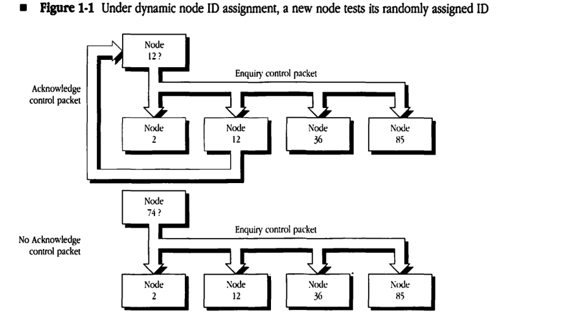

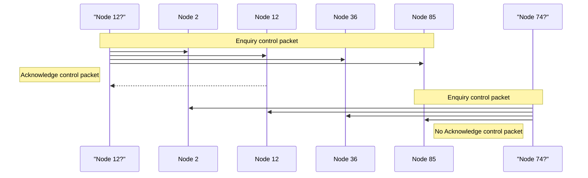

LLAP node IDs are divided into two classes: user node IDs and server node IDs. **User node IDs** are in the range 1–127 ($01–$7F); **server node IDs** are in the range 128–254 ($80–$FE). A destination node ID of 255 ($FF) is called the **broadcast hardware address** (broadcast ID) and has a special meaning. Packets sent with the destination node ID equal to 255 are accepted by all nodes, permitting the **broadcasting** of packets to all nodes on the network. A destination node ID equal to 0 ($00) is not allowed and is treated as unknown.

| Node ID range | Description |
|---|---|
| 0 ($00) | not allowed (unknown) |
| 1–127 ($01–$7F) | user node IDs |
| 128–254 ($80–$FE) | server node IDs |
| 255 ($FF) | broadcast ID |

The division of node IDs into two groups minimizes the negative impact of a node acquiring another node's ID when the latter is busy and fails to respond to the entire series of Enquiry packets. This situation can occur because some nodes may be unable to receive packets for extended periods of time (for example, if they are engaged in a device-intensive operation such as gaining access to a disk or transferring a bitmap document to a directly connected laser printer). Such a node would not respond to another node's Enquiry packets, which could result in two nodes acquiring the same node ID.

Excluding user (nonserver) node IDs from the server node ID range eliminates the possibility that user nodes (which are switched on and off with greater frequency) will conflict with server nodes. It is imperative that no node ever acquire the number of a node functioning as a server; this would disrupt service not only between the two conflicting nodes but also for users trying to communicate with either of those nodes.

Within the user node ID range, verification can be performed quickly (that is, with fewer retransmissions of the Enquiry control packet), thus decreasing the LLAP initialization time for user nodes. A more thorough node ID verification is performed by servers (in other words, additional time is taken to ensure that they acquire unique node IDs on the link). This scheme increases the initialization time for server nodes but is not detrimental to the server's operation since such nodes are rarely switched on and off.

## Data transmission and reception

LLAP uses two kinds of packets: control packets, which are used for internal protocol control purposes, and data packets, which include data provided by LLAP's client.

### LLAP packet

An LLAP packet consists of a 3-byte LLAP header followed by a variable-length data field (0-600 bytes). (See *Figure 1-2*.) The LLAP header contains the packet's destination node ID, the source node ID, and a 1-byte LLAP type field. The **LLAP type field** specifies the type of packet. Values in the range 128–255 ($80–$FF) are reserved to identify **LLAP control packets**. LLAP control packets do not contain a data field.

#### Figure 1-2 LLAP frame and packet format

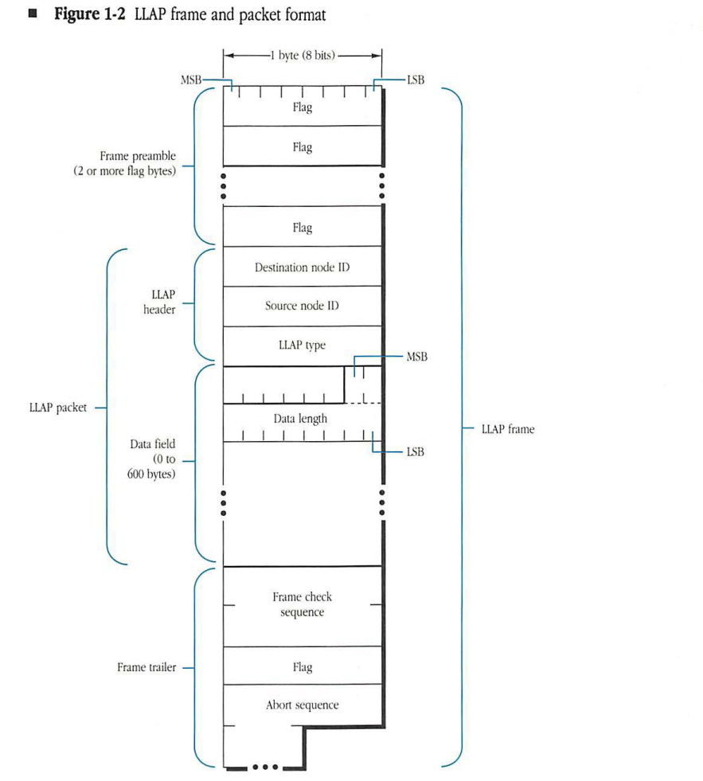

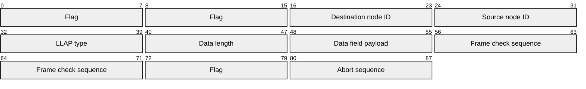

| Field | Bit offset | Width (bits) | Description |
| :--- | :--- | :--- | :--- |
| **Frame preamble** | 0 | 16+ | Two or more flag bytes (0x7E) used for receiver synchronization. |
| **LLAP packet** | 16 | Variable | The core data unit, consisting of the header and data field. |
| &nbsp;&nbsp;&nbsp;&nbsp;**LLAP header** | 16 | 24 | Contains addressing and protocol information. |
| &nbsp;&nbsp;&nbsp;&nbsp;Destination node ID | 16 | 8 | The address of the destination node. |
| &nbsp;&nbsp;&nbsp;&nbsp;Source node ID | 24 | 8 | The address of the source node. |
| &nbsp;&nbsp;&nbsp;&nbsp;LLAP type | 32 | 8 | The protocol type of the packet. |
| &nbsp;&nbsp;&nbsp;&nbsp;**Data field** | 40 | 8 to 4808 | Contains the length indicator and the actual payload. |
| &nbsp;&nbsp;&nbsp;&nbsp;Data length | 40 | 8 | Indicates the size of the following data in bytes. |
| &nbsp;&nbsp;&nbsp;&nbsp;Data | 48 | 0 to 4800 | The payload data, ranging from 0 to 600 bytes. |
| **Frame trailer** | Variable | Variable | Marks the end of the frame and provides error detection. |
| &nbsp;&nbsp;&nbsp;&nbsp;Frame check sequence | Variable | 16 | A 16-bit CRC for error checking. |
| &nbsp;&nbsp;&nbsp;&nbsp;Flag | Variable | 8 | A closing flag byte (0x7E). |
| &nbsp;&nbsp;&nbsp;&nbsp;Abort sequence | Variable | Variable | A sequence used to signal that a frame transmission has been aborted. |

Four types of control packets are currently in use. All other LLAP type field values in the range 128–255 ($80–$FF) are reserved by Apple for future use.

| Name | LLAP type field value | Description |
| :--- | :--- | :--- |
| lapENQ | $81 | Enquiry packet used for dynamic node ID assignment |
| lapACK | $82 | Acknowledgment packet responding to a lapENQ |
| lapRTS | $84 | request-to-send (RTS) packet notifying the destination node that a data packet awaits transmission |
| lapCTS | $85 | clear-to-send (CTS) packet response to lapRTS, indicating readiness to accept a data packet |

◆ **Note:** LLAP control packets received with values in the LLAP type field other than those previously listed are currently invalid and must be discarded.

LLAP type fields with values in the range 1–127 ($01–$7F) are used for LLAP **data packets**; these packets carry client data in the data field. In such packets, the type field specifies the LLAP type of the client to whom the data must be delivered. This specification allows the concurrent use of LLAP by several network layer protocols and is crucial to maintaining an **open systems architecture**. The LLAP implementation in the receiving node uses the LLAP type field to determine the client for whom the data is intended. The client, in turn, uses this field to decide how to interpret the LLAP data for use by a higher-level protocol. As an example, Datagram Delivery Protocol (DDP) packets correspond to the values 1 and 2 in the LLAP type field.

LLAP transmits and receives data packets on behalf of its clients. The format and interpretation of the data field are defined by higher-level protocols.

The low-order 10 bits of the first 2 bytes of the data field must contain the length in bytes (most-significant bits first) of the LLAP data field itself. The data length includes the length field itself. The high-order 6 bits of the length field are reserved for use by higher-level protocols.

The LLAP header is 3 bytes long, and the data field can contain from 2 to 600 bytes. Therefore, the smallest valid LLAP data packet is 5 bytes long; the largest is 603 bytes.

### LLAP frame

An LLAP frame encapsulates an LLAP packet with a frame preamble and a frame trailer, as shown in *Figure 1-2*.

On the link itself, LLAP uses a bit-oriented link protocol for transmitting and receiving packets. The **frame preamble** precedes the packet and is used to identify the start of the frame. The **frame trailer** has two objectives. First, it includes a 2-byte quantity called the **frame check sequence (FCS)** that is used to detect and discard packets received with errors. Second, the last portion of the trailer, consisting of a flag byte and an **abort sequence** (12-18 1's), serves to demarcate the end of the frame.

The use of a bit-oriented protocol allows the presence of all possible bit patterns between the frame's leading and trailing flags. The frame delimiter for LLAP, known as a **flag byte**, is the distinctive bit sequence 01111110 ($7E). Typically, flags are generated by hardware transmitters at the beginning and end of frames and are used by hardware receivers to detect frame boundaries.

In order for a data-link protocol to transmit all possible bit patterns within a frame, the protocol must ensure **data transparency**. LLAP accomplishes data transparency through a technique known as **bit stuffing**. When transmitting a frame, LLAP inserts a 0 after each string of 5 consecutive 1's detected in the client data; this process guarantees that the data transmitted on the link contains no sequences of more than 5 consecutive 1's. A receiving LLAP performs the inverse operation, *stripping* a 0 that follows 5 consecutive 1's.

The 16-bit FCS is computed as a function of the contents of the packet itself (that is, the flags and the abort bits of the frame are not included): the destination node ID, source node ID, LLAP type, and the data field, using the standard cyclic-redundancy check (CRC) algorithm of the Consultative Committee on International Telephone and Telegraph (CCITT). This algorithm, known as CRC-CCITT, is described in detail in Appendix B.

Prior to transmitting a packet, LLAP sends out a synchronization pulse, a transition period on the link that is followed by an idle period (see "Carrier Sensing and Synchronization" later in this chapter). A frame preamble, consisting of 2 or more flag bytes, follows the synchronization pulse. The frame terminates with a frame trailer, which consists of the FCS, 1 flag byte, and the abort sequence. The abort sequence indicates the end of the frame.

## Data packet transmission

The transmission of a data packet by LLAP involves a special dialog consisting of one or more LLAP control frames followed by the data frame. This dialog is based on a CSMA/CA access protocol, some aspects of which were outlined in "Link Access Control" earlier in this chapter.

### Carrier sensing and synchronization

LLAP packet transmission dialogs require each node to sense the use of the transmission medium. Two techniques are used by LLAP for this purpose.

First, LocalTalk hardware can detect a flag byte, the distinctive bit sequence 01111110 ($7E). This hardware capability is provided to allow the receiving node to achieve byte synchronization with the sender. LLAP can thus provide a certain measure of link-use sensing capability. The flag byte in the trailer is also detected by LocalTalk hardware and provides an indication of the end of the packet. The abort sequence at the end of the frame also forces every node's hardware to lose byte synchronization, thus confirming the end-of-line use by the current sender.

A drawback of the flag-byte synchronization approach is that synchronization can take 2 or more flag bytes to be achieved; during that time the node could determine the line to be idle when it is, in fact, being used by another node.

LLAP supplements this byte synchronization for carrier sensing with a variant of the hardware's bit-clock synchronization capability. For this purpose, prior to sending a request-to-send (RTS) frame, LLAP transmits a synchronization pulse. A **synchronization pulse** is a transition on the link, followed by an idle period greater than 2 bit-times. The synchronization pulse is obtained by momentarily enabling the hardware line driver for at least 1 bit-time before disabling it, causing a transition on the line that will be detected as a clock by all receivers on the network. However, since the transition is followed by an idle period of sufficient length, all receivers conclude that they have lost the clock. They are said to have detected a missing clock. The hardware can detect this missing clock much more rapidly than it can achieve byte synchronization. With the synchronization pulse at the leading edge of an RTS frame, the detection of a missing clock provides a very quick way to detect use of the line by a sender.

The missing clock allows transmitters to synchronize their access to the line (transmitters become immediately aware if a transmission is about to take place). Synchronization pulses can also be sent at the beginning of other LLAP frames.

Further details of carrier-sensing aspects of LocalTalk hardware are discussed in [Appendix A](A-localtalk-hardware-specifications.md).

### Transmission dialogs

For the purpose of transmitting information, LLAP distinguishes between two kinds of data packets and, consequently, two kinds of transmission dialogs. A **directed packet** is sent to a single node and hence is transmitted via a **directed transmission dialog**. Similarly, a **broadcast packet** (destination node ID equals 255 ($FF)) goes to all nodes on the link via a **broadcast transmission dialog**.

Dialogs must be separated by a minimum **interdialog gap (IDG)** of 400 microseconds. The different frames of a single dialog must follow one another with a maximum **interframe gap (IFG)** of 200 microseconds.

* **Note:** A frame preamble contains 2 or more flag bytes. If more than 2 flag bytes are transmitted, the source must ensure that the destination will receive the flag bytes and the destination address byte within the interframe gap (IFG). In other words, the IFG is defined as the time from the end of the abort sequence of the previous frame's trailer to the end of the current frame's destination address byte.

The transmission dialog is described separately for directed and broadcast packets. *Figure 1-3* illustrates the frames and the timing used in the dialogs. LLAP transmission dialogs are best understood in the case of directed data packets.

The transmitting node uses the ability of the physical layer to sense if the line is in use. If the line is busy, the node waits until the line becomes idle. While the node is waiting, it is said to *defer*. Upon sensing an idle line, the transmitter waits for a time equal to the minimum IDG (400 microseconds) plus a randomly generated period. During this wait, the transmitter continues to monitor the line. If the line becomes busy at any time during this wait period, the node must again defer. If the line remains idle throughout this wait period, then the node sends an RTS packet to the intended receiver of the data packet. The receiver must return a clear-to-send (CTS) packet to the transmitting node within the maximum IFG (200 microseconds). Upon receiving this packet, the transmitter must start sending the data packet within the maximum IFG.

#### Figure 1-3 LLAP transmission dialogs

End of previous frame. Line becomes idle.

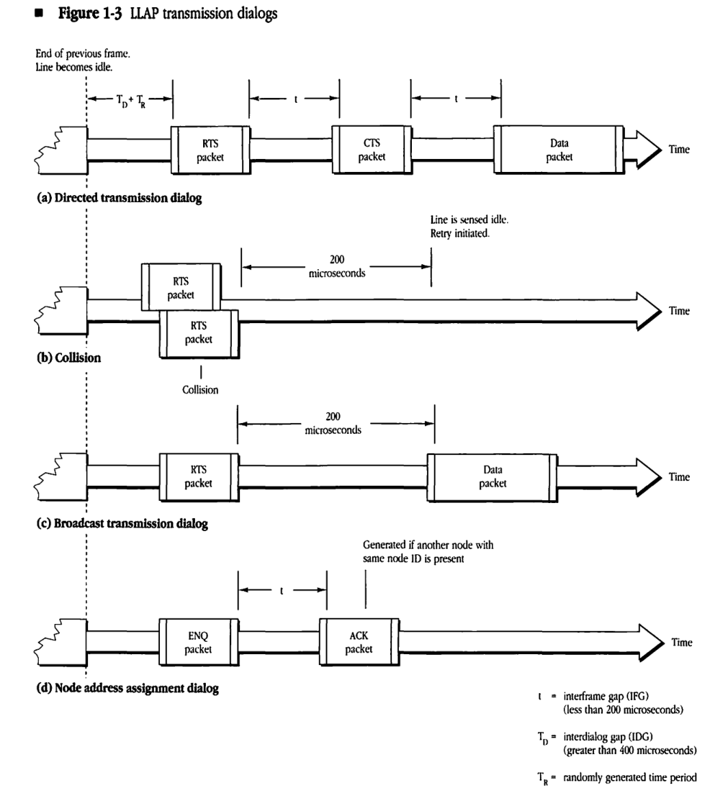

#### (a) Directed transmission dialog

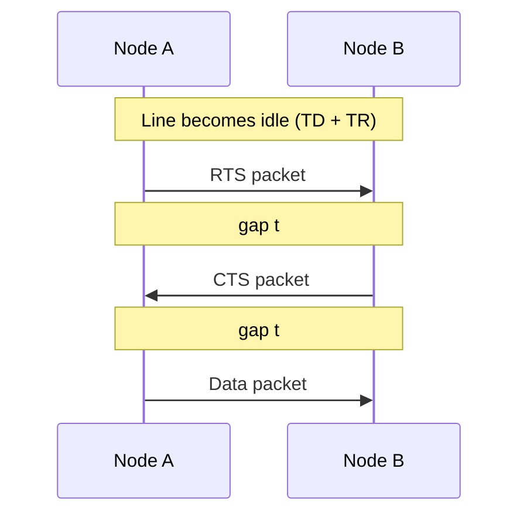

### (b) Collision

Line is sensed idle. Retry initiated.

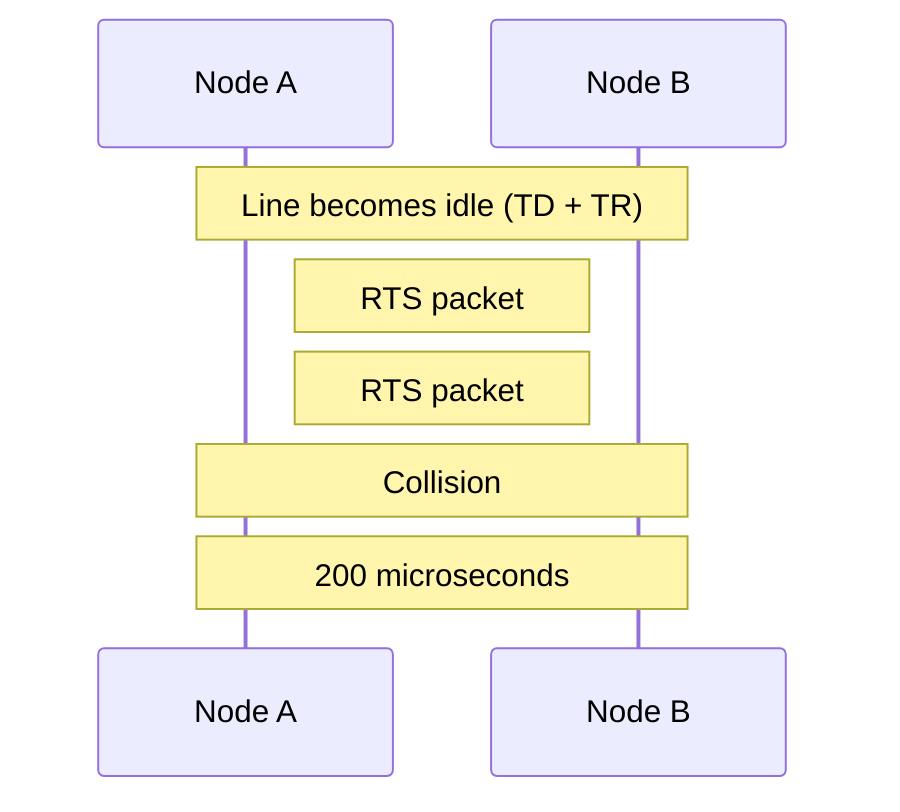

### (c) Broadcast transmission dialog

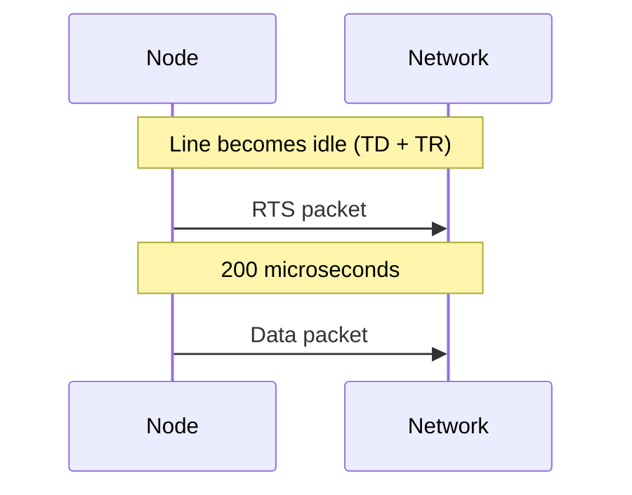

### (d) Node address assignment dialog

Generated if another node with same node ID is present

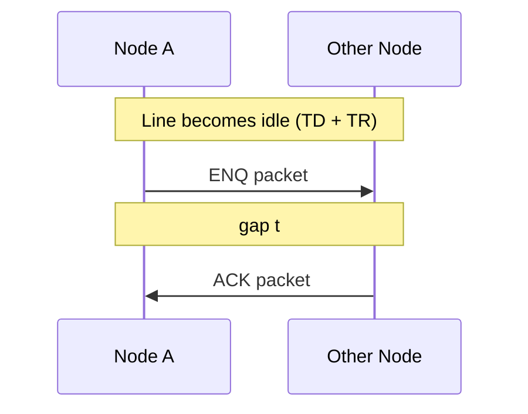

* **t** = interframe gap (IFG) (less than 200 microseconds)
* **TD** = interdialog gap (IDG) (greater than 400 microseconds)
* **TR** = randomly generated time period

The purpose of this algorithm is to

*   restrict the situations in which collisions are more likely to occur (the RTS-CTS handshake); in these situations, a minimum amount of line time is wasted by the collision
*   spread out the use of line time among transmitters that are waiting for the line to become idle

The RTS-CTS handshake is said to be successful if a valid CTS packet is received by the transmitter after it has sent out an RTS packet. A successful RTS-CTS handshake signifies that a collision did not occur and that all intending transmitters have heard of the coming data packet transmission and are deferring.

If a collision does occur during the RTS-CTS handshake, then the corresponding LLAP control packet will be corrupted by the collision. This corruption will be detected by using the FCS, and the corresponding packet will be discarded by its receiving node. The net result is that a CTS packet will not be received by the sender of the RTS packet within the maximum permissible time of 200 microseconds, and the sending node will then *back off* and retry. In this situation, the sending node is said to *assume* a collision has occurred.

Two factors are used for adjusting the range of the randomly generated period:

*   the number of times the node has to defer
*   the number of times it assumes a collision has occurred

This history is maintained in two **8-bit history bytes**, one each for deferrals and collisions. At each attempt to send a packet, these bytes are shifted left 1 bit. The lowest bit of each byte is then set if the node had to defer or had to assume a collision has occurred, respectively. Otherwise, this bit is cleared. In effect, the history bytes retain the deferral and collision history for the last eight attempts.

The random wait time is generated as a **pseudorandom number**. These numbers (produced through an arithmetic process) are close to a true random sequence. The range of numbers is adjusted according to the current link traffic and collision history. If collisions have been assumed for recently sent packets, it is reasonable to expect heavy traffic and higher contention for the link. In this case, the random wait period should be generated over a larger range, thus spreading out (in time) the different contenders for use of the line. Conversely, if the node has not had to defer on recent transmissions, a lighter offered traffic is inferred, and the random wait period should be generated over a smaller range, therefore reducing dispersion of transmission.

The exact use of the history bytes for determining random wait periods is described in "Algorithms" in Appendix B.

### Directed data packet transmission

Directed packets are sent according to the following procedure, as shown in Figure 1-4:

1. The transmitter senses the link until the link has been idle for the minimum IDG (400 microseconds).
2. The transmitter then waits an additional random time period.
3. If the link is still free, the transmitter sends an RTS frame to the intended destination node.
4. The destination node responds with a CTS frame.
5. The transmitter, upon successful reception of the CTS frame, sends the data frame (in which it encapsulates the client's data).

The destination node must start sending the CTS frame within the maximum IFG of 200 microseconds. Otherwise, the transmitter will assume that a collision has occurred and will return to step 1. For each attempt, a new random number must be generated in step 2. If the transmitter is unable to send the data packet after 32 attempts, it reports failure to its client.

#### Figure 1-4 RTS-CTS handshake during a directed data transmission

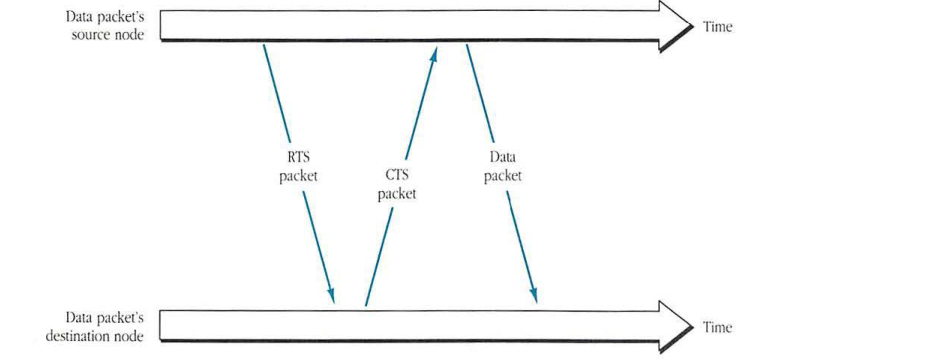

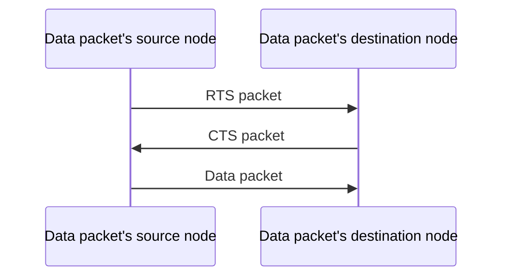

### Broadcast data packet transmission

Broadcast packets, which go to all nodes on the link, have a destination node ID of 255 ($FF). Broadcast packets are sent without collision except if another transmitter attempts to broadcast at the same time.

Broadcast frames are sent according to the following procedure:

1. The transmitter senses the link until the link has been idle continuously for the minimum IDG (400 microseconds).
2. The transmitter then waits an additional random time period.
3. If the link is still free, the transmitter sends an RTS frame with destination address of 255 ($FF).
4. The transmitter checks the line for the maximum IFG (200 microseconds).
5. If the line stays idle throughout step 4, the transmitter sends the data frame.

Although it does not expect to receive a response, the transmitting node sends an RTS frame to notify all other transmitters of its intent to broadcast. Furthermore, the RTS frame forces a collision if another transmitter happens to start a directed transmission at the same time, causing that node to back off.

If the transmitter detects link activity during step 4, it returns to step 1 to try again. The node will make 32 attempts, beginning with step 1, before reporting failure to its client.

### Packet reception

A node will accept an incoming packet if

* its destination address is the same as the node's ID (or is the broadcast address)
* the frame's FCS is verified to be correct

A receiving node will reject bad frames resulting from one of several error conditions. LLAP handles these situations internally, without referring them to its client.

| Error conditions | Description |
| :--- | :--- |
| packet size | packet length is less than 5 bytes or more than 603 bytes |
| overrun/underrun | LLAP could not stay synchronized with the incoming data |
| frame type | the type field does not match a valid LLAP value |
| frame check sequence | CRC-CCITT has detected an FCS error |

The above discussion describes in general terms LLAP's transmission and reception mechanisms. A more detailed specification of these packet transmission and reception disciplines is given in Appendix B.

Also included in Appendix B are detailed algorithms of LLAP's dynamic node ID assignment as well as the CRC-CCITT computation of the FCS.

