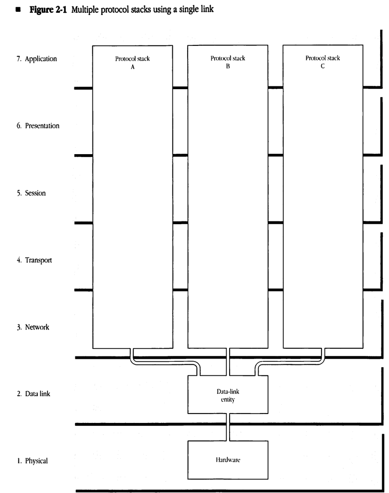
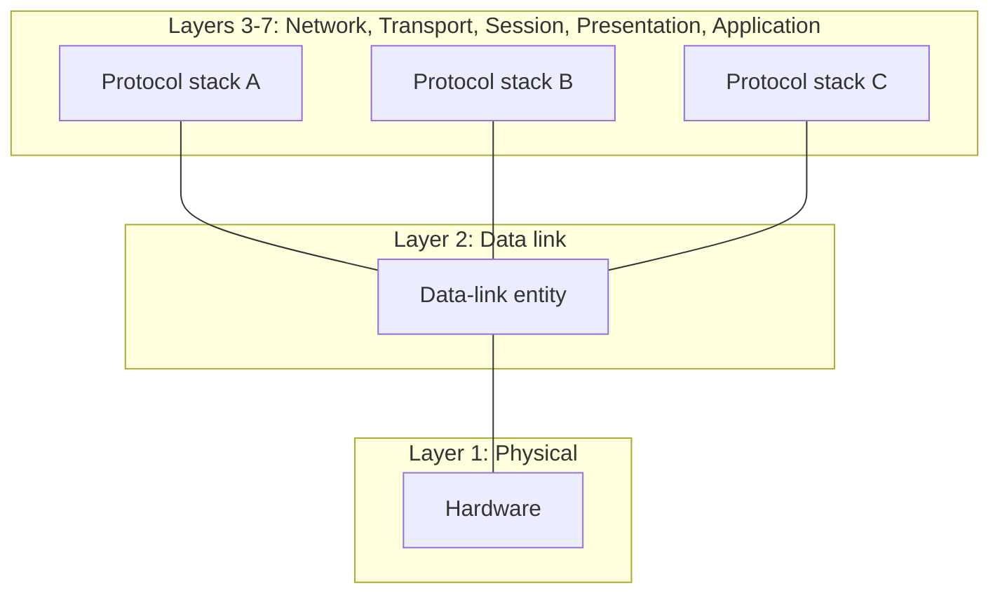
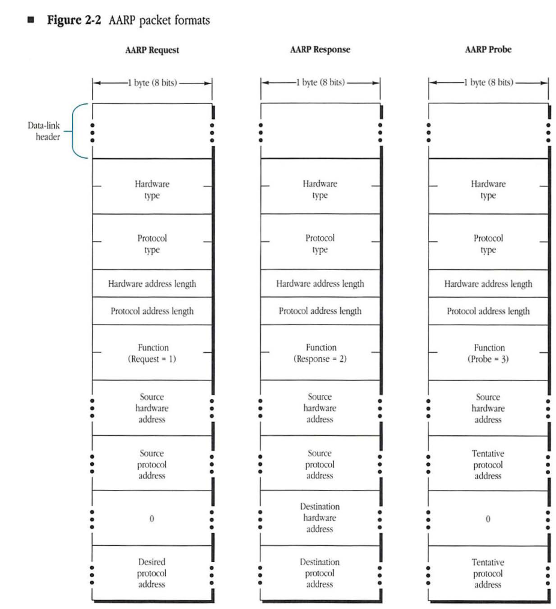
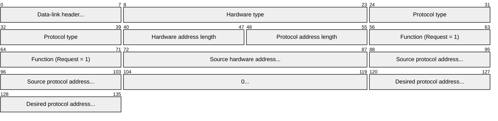
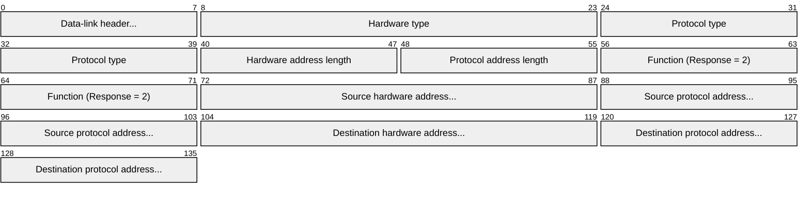
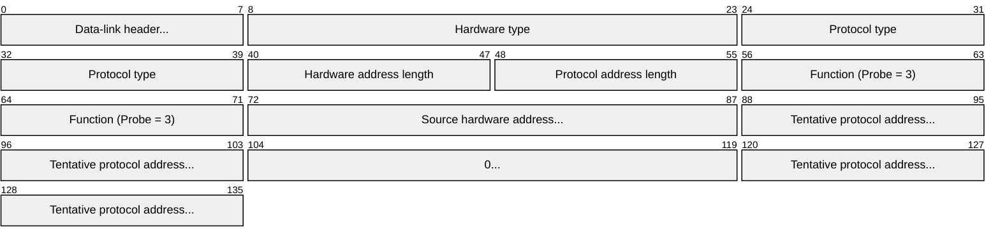

# Chapter 2 AppleTalk Address Resolution Protocol

1. TOC
{:toc}

## THE APPLETALK ADDRESS RESOLUTION PROTOCOL

(AARP) maps between any two sets of addresses at any level of one or more protocol stacks. Specifically, in the AppleTalk protocol architecture, AARP is used to map between AppleTalk node addresses, used by the Datagram Delivery Protocol (DDP) as well as higher-level AppleTalk protocols, and the addresses of the underlying data link that is providing AppleTalk connectivity. AARP makes it possible for AppleTalk systems to run on any data link. ■

## Protocol families and stacks

The collection of all the protocols, corresponding to the upper five layers of the ISO-OSI reference model, used in a particular protocol architecture is referred to as a **protocol family**. An instance of a protocol family in a given node is known as a **protocol stack**. This terminology allows us to distinguish between the protocol architecture itself and an instance of that architecture implemented in a particular node.

## Protocol and hardware addresses

*Figure 2-1* shows a node in which several protocol stacks (for instance, AppleTalk, TCP/IP, XNS) are in simultaneous use. The node is connected to a single data link, and the packets of the different protocol families running in the node are all sent through this same data link. Each of the node's protocol stacks must use its own addressing scheme to specify the address of the node. The node address used by one protocol family will usually not be intelligible to any of the other families. In addition, the data-link layer has its own scheme for assigning an address to the node. Thus, a node can have multiple addresses, each of which is intelligible to one particular protocol family or data link.*

The node address used by a protocol stack is said to be the node's **protocol address** corresponding to the particular protocol family. This address identifies the particular stack among its peers on the same network and is used to communicate with these peer entities.

The node address used by a data link is the node's **hardware address**.

### Address resolution

A protocol stack can send a packet through the node's data link to another node in which the same protocol family is resident. For this purpose, when the protocol stack calls the data link to send a packet to its peer stack in another node, it will specify the destination node by using the latter's protocol address. Since this address is not intelligible to the data link, it must first be translated to the equivalent data-link or hardware address of the destination node. This translation of addresses is known as **address resolution**.

■ **Figure 2-1** Multiple protocol stacks using a single link

A *hardware address* is the address used by the physical and data-link layers of a network. Each node must have a hardware address that is unique on the link that it is using.

In addition to receiving packets addressed to its own hardware address, a node will generally accept packets that are addressed to the data link's broadcast hardware address (broadcast ID) or to a **multicast hardware address**.

When a node transmits a packet that has the broadcast hardware address as its destination address, then all nodes on the link will receive the packet. Each data link defines the value of its broadcast hardware address.

A multicast hardware address is similar to the broadcast hardware address. When a node transmits a packet that has a multicast hardware address as its destination address, then only a specific subset of the nodes on the link will receive the packet. Some nodes on the link may *not* have a multicast address; other nodes may have one or more multicast addresses.

In summary, a node on the link receives all packets sent to the node's unique hardware address, to the broadcast hardware address, and to any of the node's multicast hardware addresses.

The *protocol address* of a node is the address that uniquely identifies a protocol stack in that node among all other instances of stacks of that type on the network. A protocol address is used by a protocol stack to identify a peer protocol stack to which packets are to be sent.

In addition to receiving packets that contain its unique protocol address, a protocol stack may also receive packets addressed to a **broadcast protocol address**. Just as the broadcast hardware address causes all nodes on the network to receive the packet at the data-link level, the broadcast protocol address causes all nodes on the network to receive the packet at the level of the protocol stack.

For example, a packet could be addressed to the broadcast protocol address for a protocol stack. If all nodes with instances of that protocol stack belong to a particular multicast hardware address, then the data link would use this multicast hardware address to ensure delivery of the packet to all these nodes.

If a node supports more than one protocol stack and uses a single data link, then the node has a protocol address associated with each stack but has only one hardware address.

## AARP services

When a stack calls the data-link layer to send a packet to a particular node, the stack will supply the destination address in terms of a protocol address. This address must first be resolved into the corresponding hardware address of the destination node. AARP provides the services needed to perform this address resolution.

As indicated earlier, AARP can be used to map between any two sets of addresses at any protocol level. Although this chapter discusses AARP's use in mapping between protocol addresses and hardware addresses, the concepts presented here can be applied to the more general case.

An AARP implementation has as its clients the various protocol stacks in a given node. AARP uses the node's data link to

*   **translate a protocol address into a hardware address**
    Given a protocol address for a particular protocol family, AARP determines the hardware address of the node that is currently using that protocol address.

*   **determine the node's protocol address**
    AARP dynamically assigns a protocol address to a stack in the node. AARP ensures that this address is unique among all nodes on the network of that protocol family.

*   **filter incoming packets**
    AARP interposes itself in the packet reception path between the data link and each protocol stack. For all data packets received by the node, AARP verifies that the packet's destination protocol address is equal to either the node's protocol address or the broadcast protocol address for that protocol family. Otherwise, AARP discards the packet.

## AARP operation

AARP's key service is address resolution. For this purpose, each node has a cache of mappings between the various protocol addresses and the corresponding hardware addresses. When one of the node's protocol stacks asks AARP to resolve a given protocol address, AARP starts by looking in the cache for the appropriate mapping. In the event that the necessary mapping is not found in the cache, then AARP queries all the nodes on the data link for the desired mapping by using the broadcast or multicast capability of the underlying data link.

The query can be done by using the data link's broadcast capability. In this case, the query packet sent out by AARP will be received by every node on the data link, regardless of whether that node has a protocol stack corresponding to the protocol family of the requested protocol address. The use of an appropriately set up multicast hardware address can help ensure that only the relevant nodes receive the AARP query.

In the description below, various AARP operations require the broadcasting of AARP packets. The word *broadcast* here refers to broadcasting at the protocol stack level; it does not necessarily have to be sent as a data-link broadcast. An AARP broadcast means that the AARP packet is to be delivered to all nodes implementing the protocol family to which the AARP packet refers.

In each node, AARP maintains a cache of known protocol-to-hardware address mappings, known as an **Address Mapping Table (AMT)**. Such an AMT must be maintained for each protocol stack that wishes to use AARP services. Whenever AARP discovers a new address mapping, it creates a corresponding AMT entry to reflect the new mapping. If no more space is available in the AMT for the new mapping, AARP purges one of the existing AMT mappings by using some type of least-recently-used algorithm. Likewise, AARP modifies existing AMT entries to reflect changes in address mappings.

### Address mapping

AARP queries for address mappings are made by using two types of AARP packets: AARP Request and AARP Response packets.

#### Request packets

When asked by a client to determine the hardware address corresponding to a given protocol address, AARP first scans the associated AMT for that protocol address. If the protocol address is found in the AMT, AARP reads the corresponding hardware address and immediately delivers it to the client.

If the hardware address is *not* found in the AMT, then AARP attempts to determine the hardware address by querying all nodes supporting the corresponding protocol family. AARP uses the data link to broadcast a series of AARP Request packets. The objective of broadcasting the AARP Request packet is to discover the node that is using the protocol address.

The AARP Request packet carries in it an identifier of the protocol family and the value of the protocol address to be mapped.

#### Response packets

When a node receives an AARP Request packet, its AARP implementation compares the protocol address from the packet with the node's protocol address for the indicated protocol family. If the addresses match, then the node's AARP returns an AARP Response packet to the requester. This packet contains the hardware address requested by the sender of the AARP Request packet.

Upon receiving this Response packet, the requesting node's AARP inserts the newly discovered mapping into the corresponding AMT. AARP then returns the requested hardware address to its client.

If a Response packet is not received within a specified time interval, then AARP retransmits the Request packet. This process is repeated a specified maximum number of times. If after these retries a Response packet is not received, then AARP returns an error to its client. This error implies that the protocol address is not in use and that no corresponding node exists on the link.

### Dynamic protocol address assignment

Each protocol stack in a given node must have a protocol address. This address is usually assigned when the stack is initialized. AARP provides one way of making this assignment. However, a protocol stack may choose to assign its protocol address using a different method and then inform AARP of this address. The only requirement is that the protocol address be unique across all nodes of a given protocol family.

When a protocol stack asks AARP to pick a unique protocol address, AARP first chooses a tentative protocol address for the node. It starts either by choosing an address value from some nonvolatile memory or by generating a random number. If a mapping for that address value already exists in the corresponding AMT, then AARP knows that another node on the network is using this protocol address. It then picks a new random value for the protocol address until it identifies an address that is not in that AMT.

Having picked a suitable tentative protocol address, AARP must then make sure that this address is not being used by any other node on the data link. It does so by using the data link to broadcast a number of AARP Probe packets, which contain the tentative protocol address. When a node's AARP receives a Probe packet corresponding to one of its protocol stacks, it examines the protocol address of that stack. If the Probe's tentative protocol address matches the receiving node's protocol address, AARP sends back an AARP Response packet to the probing node.

If the probing node receives an AARP Response packet, then the tentative protocol address is already in use and the node must pick a new tentative address and repeat the probing process. If the probing node does not receive a Response packet after a specified amount of time, then it retransmits the probe. If after a specified maximum number of retries the node has still not received a response, then the node's AARP accepts the tentative address as the node's protocol address. AARP returns this value to its client.

Although it is unlikely, two nodes on the link could simultaneously pick the same value for their tentative protocol addresses. To handle this situation properly, a probing node receiving a Probe packet whose tentative address matches its own tentative address concludes that this address is in use. The node then proceeds to select another tentative protocol address. While it is sending Probe packets, a node should not respond to AARP Probe or Request packets.

## Retransmission of AARP packets

As described above, AARP retransmits probes and requests until it either receives a reply or exceeds a maximum number of retries. The retransmission interval and count depend on how thorough a search the client requires.

In general, the retransmission interval and count for probes are determined based on the characteristics of the particular data link. These values are chosen to minimize the possibility of duplicate protocol addresses.

The retransmission interval and count for requests may be optionally provided by AARP's clients.

### Filtering incoming packets

For two reasons, it is desirable that AARP examine all incoming packets before they are delivered to the node's protocol stacks. First, AARP can help verify that an incoming packet is actually intended for the corresponding protocol stack. Second, AARP can gather address-resolution information from every incoming packet. This information will help maintain AMTs in the node and may result in fewer AARP packets being sent.

The filtering of incoming packets is an optional aspect of AARP; its use is not required.

In the discussion below, it is assumed that each protocol stack has supplied AARP with the stack's protocol address and with any corresponding broadcast protocol address that the stack recognizes. Furthermore, each stack must provide AARP with a mechanism for extracting the destination protocol address from an incoming packet.

### Verifying packet addresses

To verify that an incoming data packet is intended for one of the node's protocol stacks, AARP examines the packet's destination protocol address. If this address does not match the node's protocol address or any of the node's broadcast protocol addresses, then AARP must discard the packet.

### Gleaning address information

Since all incoming packets intended for one of the node's protocol stacks contain both the hardware address and the protocol address of the sender, AARP can extract the corresponding address mapping from the packet. This mapping can then be used to update the appropriate AMT.

Obtaining mapping information in this way is known as *gleaning*. The use of gleaning eliminates the need to send an AARP Request packet when the stack itself responds to the packet from which the information was gleaned.

In addition to its basic process of extracting mappings from AARP Response packets, AARP can glean information from every AARP Request packet received by the node. Since these packets are broadcast, every node's AARP receives them. AARP can extract a protocol mapping by reading the hardware and protocol addresses of the packet's sender. AARP can insert this mapping into the corresponding AMT.

It is important to note that AARP should *not* glean an address mapping from an AARP Probe packet. The sender's protocol address in such packets is tentative and hence not reliable.

## AMT entry aging

The foregoing discussion has described the mechanisms used by AARP for creating and updating AMT entries in response to the various types of incoming packets.

Any particular entry of an AMT could become invalid, however, if the corresponding node is switched off or otherwise becomes unreachable over the link. More seriously, a new node could later come on line and pick the same protocol address. To ensure that an AMT's entries respond correctly to such events, an AARP implementation should age these entries. AARP provides two methods for AMT entry aging.

The first method is to associate a timer with each AMT entry. Every time AARP receives a packet that causes the entry to be modified or confirmed, AARP resets that entry's timer. If the timer expires, the entry has not been confirmed or updated for that period of time. The entry is then declared to be unreliable, and AARP deletes it from the AMT.

If a client now requests a mapping of the protocol address of the deleted entry, then AARP will have to send out an AARP Request. If an address resolution is achieved, then a new entry will be inserted in the AMT.

The second method prescribes that an AMT entry be deleted whenever AARP receives a Probe packet for the entry's protocol address. The reception of such a probe indicates the possibility that the corresponding address might now be used by a different node; the entry should be considered suspect. Note that this method might unnecessarily remove a valid entry if a new node probes for the same protocol address.

Every implementation of AARP is required to use at least one of these two entry-aging methods.

## AARP packet formats

Each AARP packet starts with the data-link header for the particular link in use. The rest of the packet consists of the AARP information. This AARP information consists of fields for the hardware and protocol address pairs. In addition, there are fields identifying the data link and protocol family for these addresses.
Specifically, the AARP information is

*   a 2-byte hardware type, which identifies the data-link type
*   a 2-byte protocol type, which identifies the protocol family
*   a 1-byte hardware address length, which indicates the length in bytes of the hardware address field
*   a 1-byte protocol address length, which indicates the length in bytes of the protocol address field

Immediately following these fields is a 2-byte function field that indicates the packet function (1 for AARP Request, 2 for AARP Response, or 3 for AARP Probe). The next two fields are the hardware and protocol addresses of the sending node.

Finally, the last two fields of the packet contain a hardware and a protocol address respectively. The actual values in these two fields depend on the type of the packet (its function field).

For an AARP Request packet, the hardware address is the unknown quantity being requested; it should be set to a value of 0. The protocol address field should contain the address for which a hardware address is desired.

For an AARP Response packet, these fields contain the hardware and protocol addresses of the node to which the response is being sent.

For an AARP Probe packet, the hardware address should again be set to 0, and the protocol address field should be set to the sender's tentative protocol address.
Figure 2-2 presents the generic AARP packet formats.

### Figure 2-2 AARP packet formats

#### AARP Request

| Field | Bit offset | Width (bits) | Description |
|---|---|---|---|
| Hardware type | 8 | 16 | The type of hardware network. |
| Protocol type | 24 | 16 | The type of protocol. |
| Hardware address length | 40 | 8 | Length of the hardware address in bytes. |
| Protocol address length | 48 | 8 | Length of the protocol address in bytes. |
| Function | 56 | 16 | Operation code: Request = 1. |
| Source hardware address | 72 | Variable | Hardware address of the sender. |
| Source protocol address | Variable | Variable | Protocol address of the sender. |
| 0 | Variable | Variable | Padding field, set to 0. Length equals hardware address length. |
| Desired protocol address | Variable | Variable | Protocol address of the target. |

#### AARP Response

| Field | Bit offset | Width (bits) | Description |
|---|---|---|---|
| Hardware type | 8 | 16 | The type of hardware network. |
| Protocol type | 24 | 16 | The type of protocol. |
| Hardware address length | 40 | 8 | Length of the hardware address in bytes. |
| Protocol address length | 48 | 8 | Length of the protocol address in bytes. |
| Function | 56 | 16 | Operation code: Response = 2. |
| Source hardware address | 72 | Variable | Hardware address of the responder. |
| Source protocol address | Variable | Variable | Protocol address of the responder. |
| Destination hardware address | Variable | Variable | Hardware address of the original requestor. |
| Destination protocol address | Variable | Variable | Protocol address of the original requestor. |

#### AARP Probe

| Field | Bit offset | Width (bits) | Description |
|---|---|---|---|
| Hardware type | 8 | 16 | The type of hardware network. |
| Protocol type | 24 | 16 | The type of protocol. |
| Hardware address length | 40 | 8 | Length of the hardware address in bytes. |
| Protocol address length | 48 | 8 | Length of the protocol address in bytes. |
| Function | 56 | 16 | Operation code: Probe = 3. |
| Source hardware address | 72 | Variable | Hardware address of the sender. |
| Tentative protocol address | Variable | Variable | The AppleTalk address the sender is probing for. |
| 0 | Variable | Variable | Padding field, set to 0. Length equals hardware address length. |
| Tentative protocol address | Variable | Variable | Repeated tentative AppleTalk address. |

