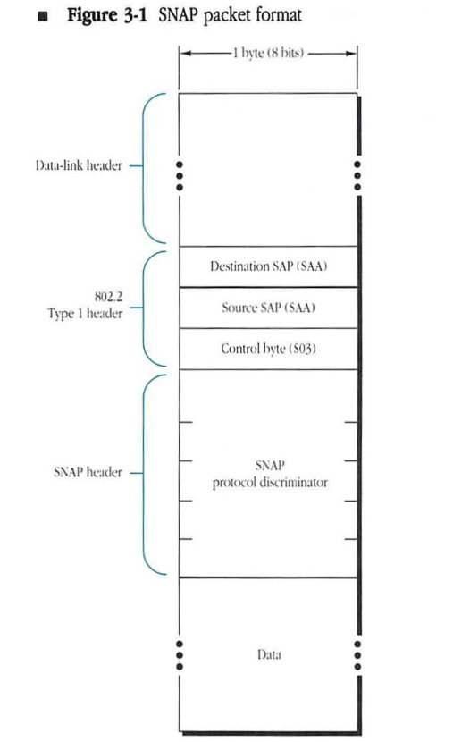
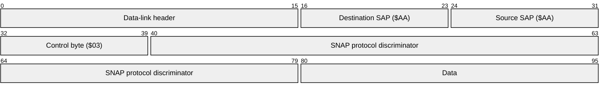
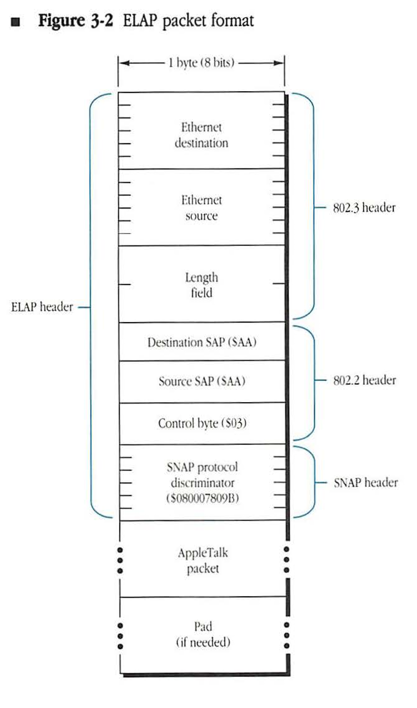
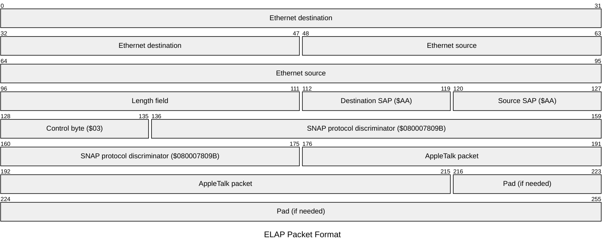
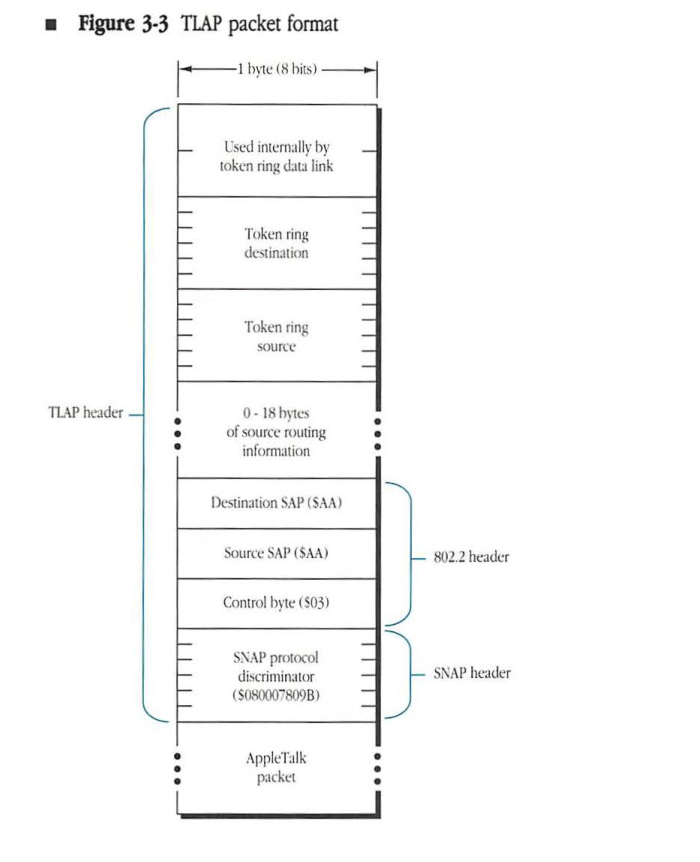
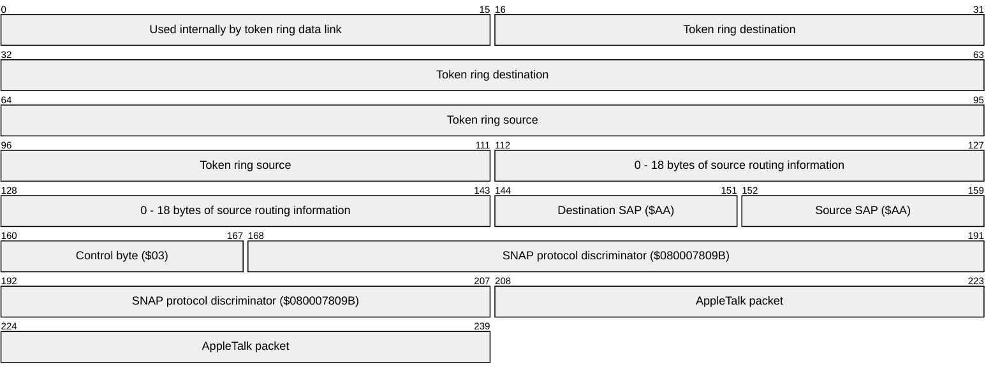
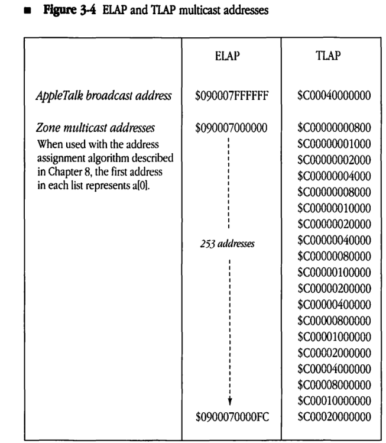
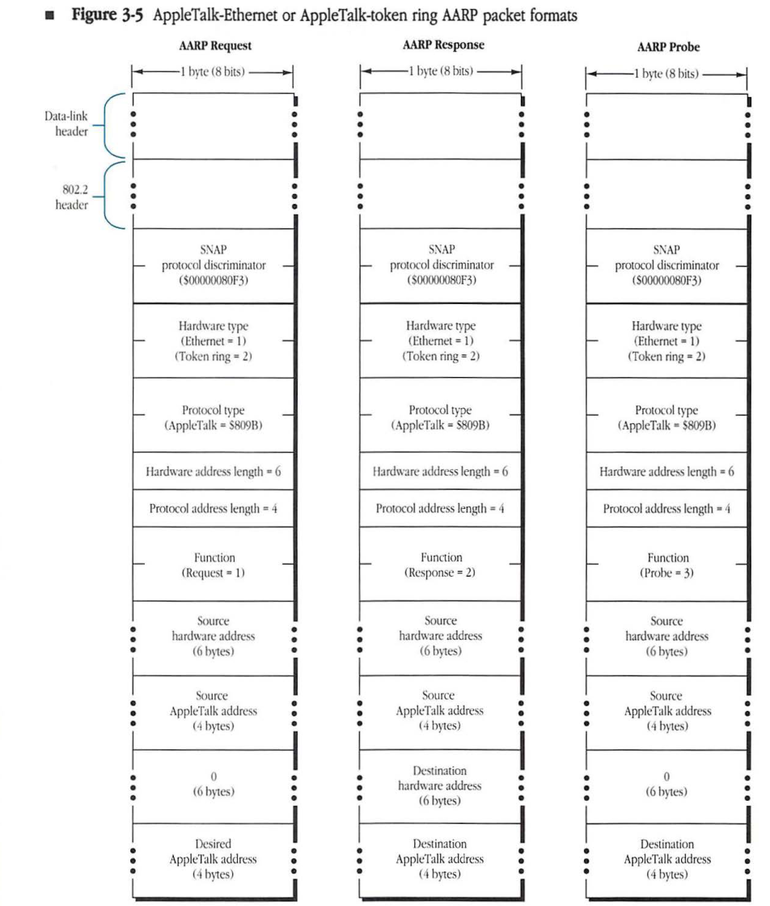
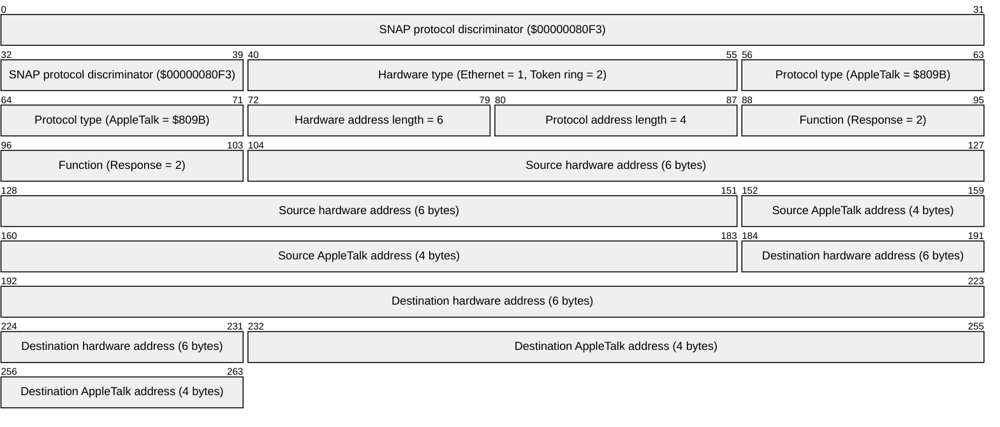
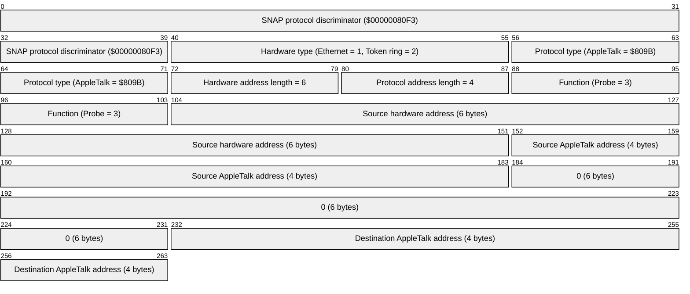

# Chapter 3 EtherTalk and TokenTalk Link Access Protocols

1. TOC
{:toc}

WHEN AN APPLETALK PROTOCOL STACK asks the data link to transmit an AppleTalk packet, its objective is to send the packet to the destination node's AppleTalk protocol stack. Consequently, it will provide the data link with the destination's AppleTalk protocol address, a 16-bit network number and an 8-bit node ID. On LocalTalk, which supports no more than 254 nodes, the lower 8 bits of this address can be used directly as the data-link address. Except when AppleTalk uses the LocalTalk data link, the data link will be unable to understand and use the destination's protocol address directly.

In the cases of EtherTalk and TokenTalk, the AppleTalk network system uses industry standards as the underlying data link. Both these data links use 48-bit hardware addresses to identify the network nodes. Thus, EtherTalk and TokenTalk products must translate the AppleTalk protocol address to the 48-bit hardware address before the packet can be transmitted to its destination node.

EtherTalk and TokenTalk were developed by Apple as extensions of these industry-standard data links to allow the use of industry-standard data links and cabling in the AppleTalk network. The extended data-link protocol used by EtherTalk is referred to as the EtherTalk Link Access Protocol (ELAP). The extended data-link protocol used by TokenTalk is referred to as the TokenTalk Link Access Protocol (TLAP). This chapter specifies ELAP and TLAP and also gives an example of the use of the address resolution protocol described in Chapter 2.

ELAP and TLAP use the AppleTalk Address Resolution Protocol (AARP) to map AppleTalk protocol addresses into 48-bit data-link addresses. They then encapsulate the AppleTalk datagram before using the data-link to send the packet. When the AppleTalk protocol stack is initialized, ELAP and TLAP, in combination with DDP, use AARP to acquire the stack's AppleTalk protocol address (node address). ■

## 802.2

The Institute of Electrical and Electronics Engineers (IEEE) has specified a standard for Logical Link Control (LLC) for use on Ethernet, token ring, and other data links. This standard, 802.2, involves a set of interfaces, packet formats, and procedures for use on these data links. 802.2 Type 1 specifies a connectionless or datagram service; 802.2 Type 2 is connection-based. ELAP and TLAP use 802.2 Type 1 packet formats. Details of the interfaces and procedures for 802.2 Type 1 are beyond the scope of this book, however it is necessary to understand 802.2 Type 1 packet formats to be able to understand packets as sent by AppleTalk on Ethernet and token ring.

802.2 defines the concept of a Service Access Point or SAP. SAPs are used to differentiate between the different protocol stacks using 802.2 in a given node. A SAP is a 1-byte quantity, and most SAPs are reserved for use by IEEE-standard protocols. One SAP, however, has been reserved by the IEEE for use by all non-IEEE-standard protocols. This SAP, with value $AA, is the SAP to which all AppleTalk packets are sent. However, it is also used by other protocol families. Therefore a way of differentiating the various protocols using the $AA SAP was necessary. For this reason, all packets sent to the $AA SAP begin with a 5-byte protocol discriminator. This protocol discriminator identifies the protocol family to which the packet belongs. Use of the $AA SAP in this way is known as the Sub-Network Access Protocol or SNAP.

Figure 3-1 shows the packet format for an 802.2 Type 1 SNAP packet. The packet consists of four parts. First is the data-link header for the data link on which the packet is sent. Second is the 3-byte 802.2 Type 1 header. This header consists of the destination and source SAPs (both $AA for SNAP) and a control byte indicating that Type 1 service is being used. The 802.2 header is followed by the five-byte SNAP protocol discriminator. Finally, the SNAP protocol discriminator is followed by the data part of the packet.

SNAP protocol discriminators used by AppleTalk include $080007809B for AppleTalk data packets and $00000080F3 for AARP packets.

■ Figure 3-1 SNAP packet format

| Field | Bit offset | Width (bits) | Description |
|---|---|---|---|
| Data-link header | 0 | Variable | Underlying network frame header (e.g., Ethernet or Token Ring). |
| Destination SAP (DSAP) | Variable | 8 | Destination Service Access Point, fixed at $AA for SNAP. |
| Source SAP (SSAP) | Variable + 8 | 8 | Source Service Access Point, fixed at $AA for SNAP. |
| Control byte | Variable + 16 | 8 | Unnumbered Information control byte, fixed at $03. |
| SNAP protocol discriminator | Variable + 24 | 40 | 5-byte identifier consisting of a 3-byte Organizationally Unique Identifier (OUI) and a 2-byte Protocol ID. |
| Data | Variable + 64 | Variable | The encapsulated protocol data unit. |

The SNAP protocol discriminator used by AppleTalk is $080007809B. The AppleTalk packet continues, following the ELAP header, with the start of the DDP header.

## ELAP packet format

*Figure 3-2* shows the data packet format for AppleTalk packets on Ethernet. The ELAP header consists of the 14-byte 802.3 header followed by the 802.2 and SNAP headers. 802.3 is an IEEE standard which specifies the format of the data-link header bytes on Ethernet. This header consists of the packet's 48-bit destination and source hardware (Ethernet) addresses and a 2-byte length field indicating the length of the data that follows. 802.3 also specifies that if the total length of the packet is less than 60 bytes (the minimum for Ethernet), pad bytes must be added after the data to bring the packet size up to 60 bytes. Pad bytes are not counted in the 802.3 length field.

### Figure 3-2 ELAP packet format

The SNAP protocol discriminator used by AppleTalk is `$080007809B`. The AppleTalk packet continues, following the ELAP header, with the start of the DDP header.

## TLAP packet format

Figure 3-3 shows the data packet format for AppleTalk packets on a token ring network. The TLAP header consists of a 14-byte token ring header followed by optional source routing information and then by the 802.2 and SNAP headers. The token ring header begins with two bytes that are used by the token ring data link. These bytes are followed by the packet's 48-bit destination and source hardware addresses.

The token ring header is followed by variable length source routing information. Source routing is a method used on token ring to surpass the limits on length and number of devices that exist on a single token ring network. Through use of source routing bridges, token ring networks may be combined so as to appear to the upper protocol layers as a single token ring network. The source routing information is used to specify (or in some cases to collect) the route followed by the packet through the source routing bridges. An implementation of TLAP that supports source routing must take into account acquisition and maintenance of source routing information, as this is not performed by the token ring data link.

When source routing information is sent, the high-order bit of the source hardware address is set. (This bit is available because it is never part of a hardware address.) A set bit indicates that between 2 and 18 bytes of source routing information immediately follow the token ring header.

As in ELAP, the SNAP protocol discriminator used by AppleTalk is $080007809B. The AppleTalk packet continues, following the TLAP header, with the start of the DDP header.

■ Figure 3-3 TLAP packet format

| Field | Bit offset | Width (bits) | Description |
| :--- | :--- | :--- | :--- |
| Used internally by token ring data link | 0 | 16 | Access Control and Frame Control bytes used internally by the token ring data link. |
| Token ring destination | 16 | 48 | The 6-byte destination address. |
| Token ring source | 64 | 48 | The 6-byte source address. |
| Source routing information | 112 | 0 - 144 | Optional source routing information (up to 18 bytes). |
| Destination SAP ($AA) | 112 + SR | 8 | The Destination Service Access Point, always set to $AA. |
| Source SAP ($AA) | 120 + SR | 8 | The Source Service Access Point, always set to $AA. |
| Control byte ($03) | 128 + SR | 8 | The LLC control byte, always set to $03. |
| SNAP protocol discriminator | 136 + SR | 40 | The SNAP protocol discriminator, set to $080007809B for AppleTalk. |
| AppleTalk packet | 176 + SR | Variable | The encapsulated AppleTalk packet. |

## Address mapping in ELAP and TLAP

Ethernet and token ring provide addressing schemes structurally similar to that of LLAP. Nodes on Ethernet and token ring links are identified by unique addresses, and a broadcast capability is provided. These links also provide a multicasting capability, which is used by ELAP and TLAP to minimize the interference of AppleTalk broadcast packets on non-AppleTalk nodes.

However, Ethernet and token ring addresses are different from those expected by the AppleTalk protocol family. Instead of using a dynamically assigned 8-bit node ID, they use a statically assigned 48-bit hardware address. Their broadcast hardware address is also different than AppleTalk’s broadcast protocol address of 255 ($FF).

There are conditions under which the AppleTalk protocol family will ask ELAP or TLAP to send a packet directly to a hardware address. If this is the case, no address mapping is performed and the packet is sent directly to the desired address.

### Use of AARP by ELAP and TLAP

When the AppleTalk stack is initialized, ELAP or TLAP use AARP’s dynamic protocol address assignment to pick an AppleTalk node address unique to the data link on which the node is operating. The network number part of this node address is chosen from within the network number range assigned to the network. The actual use of AARP to choose this address is described in Chapter 4, “Datagram Delivery Protocol.”

Unlike the LocalTalk Link Access Protocol (LLAP), ELAP and TLAP make no distinction between server and workstation nodes when they perform this dynamic address assignment. The hardware for those data links provides enough buffering to reduce the chance of an AARP Probe packet being lost by busy nodes. Consequently, the probability of two nodes acquiring the same address is low.

Once an AppleTalk node address has been obtained, AppleTalk operation proceeds in the normal fashion. When ELAP or TLAP is asked to send a packet, it looks at the requested destination address to determine how to proceed. There are three possibilities.

1. If ELAP or TLAP is asked to send the packet directly to a 48-bit hardware address, it calls the underlying data link to perform this operation. Certain operations in DDP require the ability to send a packet directly to a specified hardware address.
2. If ELAP or TLAP is asked to send the packet to an AppleTalk address that is not a broadcast AppleTalk address, it uses AARP to map the packet’s destination address into the corresponding hardware address and uses the underlying data link to send the packet to this hardware address. A broadcast AppleTalk address (detailed in Chapter 4), is any address whose node ID (low-order eight bits) is $FF.

3. If ELAP or TLAP is asked to send the packet to a broadcast AppleTalk address, it must send that packet in such a way that all AppleTalk nodes on that data link receive the packet. It is also desirable, however, that non-AppleTalk nodes on the same data link not be interrupted by these packets. The multicasting capability of the Ethernet and token ring data links is utilized to accomplish this goal. A specific multicast hardware address is assigned for AppleTalk broadcasts. ELAP or TLAP, in each AppleTalk node, registers itself with the underlying data link to receive all packets addressed to that multicast hardware address. Packets addressed to a broadcast AppleTalk address are then sent by ELAP or TLAP to this multicast address and received by all AppleTalk nodes on the data link. Since non-AppleTalk nodes will not have registered on this multicast address, they will not be interrupted by the packet.

The multicast address used by ELAP for AppleTalk broadcasts is $090007FFFFFF. The multicast hardware address used by TLAP for AppleTalk broadcasts is $C00040000000. ELAP and TLAP also use these multicast addresses for AARP broadcasts.

### AARP specifics for ELAP and TLAP

ELAP and TLAP impose restrictions on the tentative AppleTalk node address that AARP picks when attempting to dynamically choose a unique AppleTalk node address. These node IDs must not be chosen by AARP: Node ID 0 (invalid as an AppleTalk node ID), $FF (AppleTalk broadcast node ID), and $FE (reserved as an AppleTalk node ID on Ethernet and token ring).

In addition, during the address acquisition process, ELAP and TLAP are asked by the AppleTalk stack to choose the network number part of the node address in a specific range. Thus, when picking tentative node addresses, AARP must be sure to pick them in this requested range.

Incoming data packets contain the source data-link address and the source AppleTalk address. Source address gleaning can be performed easily by AARP by obtaining the source's AppleTalk and data-link addresses from the packet and then updating the AMT. This gleaning is not a required part of ELAP or TLAP. For example, some developers might consider the computational overhead of gleaning to be excessive and therefore not include the capability in their implementation.

The AARP probe-retransmission interval and count for ELAP and TLAP is specified as 1/5 second and 10 retransmissions, respectively. For AARP requests, the corresponding parameters are left to the discretion of the specific implementer. AARP request and probe packets are sent to the same multicast hardware address used for AppleTalk broadcasts and thus interrupt only AppleTalk nodes. This address is $090007FFFFFF for ELAP and $C00040000000 for TLAP.

### Zone multicast addresses used by ELAP and TLAP

AppleTalk data links should allocate a number of multicast addresses for use in the name lookup process, as indicated in Chapter 8, "Zone Information Protocol." ZIP and NBP use these addresses to minimize the effect of the name lookup process on nodes not in the desired zone. The specific zone multicast addresses defined for use by ELAP and TLAP are illustrated in Figure 3-4.

■ **Figure 3-4** ELAP and TLAP multicast addresses

| | ELAP | TLAP |
|---|---|---|
| *AppleTalk broadcast address* | $090007FFFFFF | $C00040000000 |
| *Zone multicast addresses* When used with the address assignment algorithm described in Chapter 8, the first address in each list represents a[0]. | $090007000000 ⋮ *253 addresses* ⋮ $0900070000FC | $C00000000800 $C00000001000 $C00000002000 $C00000004000 $C00000008000 $C00000010000 $C00000020000 $C00000040000 $C00000080000 $C00000100000 $C00000200000 $C00000400000 $C00000800000 $C00001000000 $C00002000000 $C00004000000 $C00008000000 $C00010000000 $C00020000000 |

## AppleTalk AARP packet formats on Ethernet and token ring

Each AARP packet on Ethernet and token ring begins with the same set of headers used by ELAP or TLAP. The SNAP protocol discriminator defined for AARP is $00000080F3. Following these headers, 6 bytes of AARP information identify the packet as requesting an AppleTalk-to-Ethernet or AppleTalk-to-token-ring address mapping:

* a 2-byte hardware type, with value of 1, indicating Ethernet, or value of 2, indicating token ring as the data link
* a 2-byte protocol type, with value of $809B, indicating the AppleTalk protocol family
* a 1-byte hardware address length, with value of 6, indicating the length in bytes of the field containing the Ethernet or token ring address
* a 1-byte protocol address length, with value of 4, indicating the length in bytes of the field containing the AppleTalk protocol address (The high byte of the address field must be set to 0, followed by the 2-byte network number, and then the 1-byte node ID.)

The rest of the AARP packet contains the source and destination hardware and AppleTalk addresses, the latter always in 4-byte fields with the upper byte set to 0. Figure 3-5 shows the AARP packet formats for Ethernet or token ring.

#### Figure 3-5 AppleTalk-Ethernet or AppleTalk-token ring AARP packet formats

### AARP Request

| Field | Bit offset | Width (bits) | Description |
|---|---|---|---|
| SNAP protocol discriminator | 0 | 40 | Protocol discriminator value: $00000080F3 |
| Hardware type | 40 | 16 | Hardware type: Ethernet = 1, Token ring = 2 |
| Protocol type | 56 | 16 | Protocol type: AppleTalk = $809B |
| Hardware address length | 72 | 8 | Length of hardware address: 6 bytes |
| Protocol address length | 80 | 8 | Length of protocol address: 4 bytes |
| Function | 88 | 16 | Packet function: Request = 1 |
| Source hardware address | 104 | 48 | Hardware address of the sender (6 bytes) |
| Source AppleTalk address | 152 | 32 | AppleTalk address of the sender (4 bytes) |
| 0 | 184 | 48 | Reserved field, set to 0 (6 bytes) |
| Desired AppleTalk address | 232 | 32 | The AppleTalk address being requested (4 bytes) |

### AARP Response

| Field | Bit offset | Width (bits) | Description |
|---|---|---|---|
| SNAP protocol discriminator | 0 | 40 | Protocol discriminator value: $00000080F3 |
| Hardware type | 40 | 16 | Hardware type: Ethernet = 1, Token ring = 2 |
| Protocol type | 56 | 16 | Protocol type: AppleTalk = $809B |
| Hardware address length | 72 | 8 | Length of hardware address: 6 bytes |
| Protocol address length | 80 | 8 | Length of protocol address: 4 bytes |
| Function | 88 | 16 | Packet function: Response = 2 |
| Source hardware address | 104 | 48 | Hardware address of the responder (6 bytes) |
| Source AppleTalk address | 152 | 32 | AppleTalk address of the responder (4 bytes) |
| Destination hardware address | 184 | 48 | Hardware address of the requester (6 bytes) |
| Destination AppleTalk address | 232 | 32 | AppleTalk address of the requester (4 bytes) |

### AARP Probe

| Field | Bit offset | Width (bits) | Description |
|---|---|---|---|
| SNAP protocol discriminator | 0 | 40 | Protocol discriminator value: $00000080F3 |
| Hardware type | 40 | 16 | Hardware type: Ethernet = 1, Token ring = 2 |
| Protocol type | 56 | 16 | Protocol type: AppleTalk = $809B |
| Hardware address length | 72 | 8 | Length of hardware address: 6 bytes |
| Protocol address length | 80 | 8 | Length of protocol address: 4 bytes |
| Function | 88 | 16 | Packet function: Probe = 3 |
| Source hardware address | 104 | 48 | Hardware address of the sender (6 bytes) |
| Source AppleTalk address | 152 | 32 | AppleTalk address of the sender (4 bytes) |
| 0 | 184 | 48 | Reserved field, set to 0 (6 bytes) |
| Destination AppleTalk address | 232 | 32 | The AppleTalk address being probed (4 bytes) |

