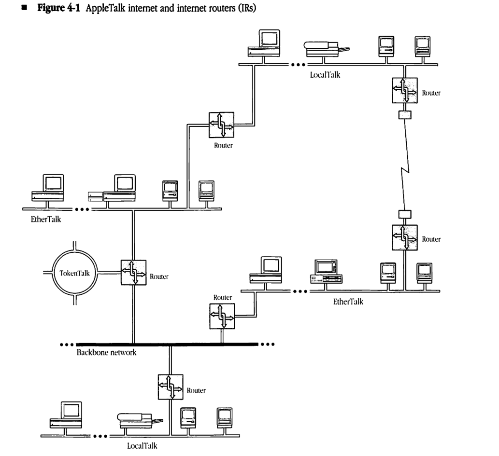
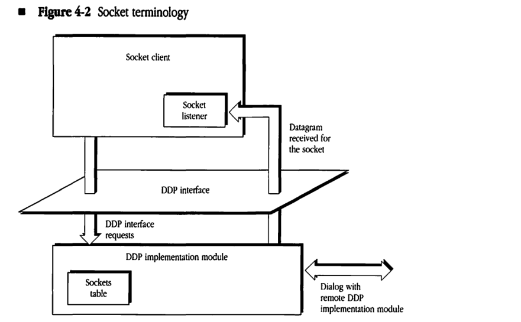
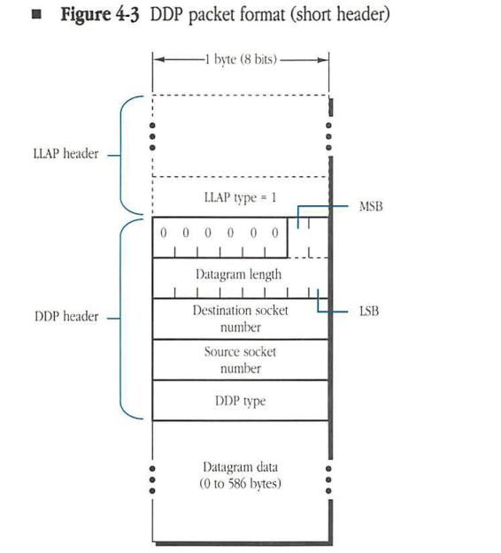
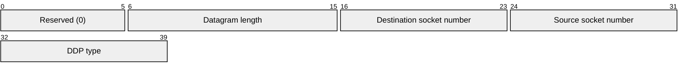
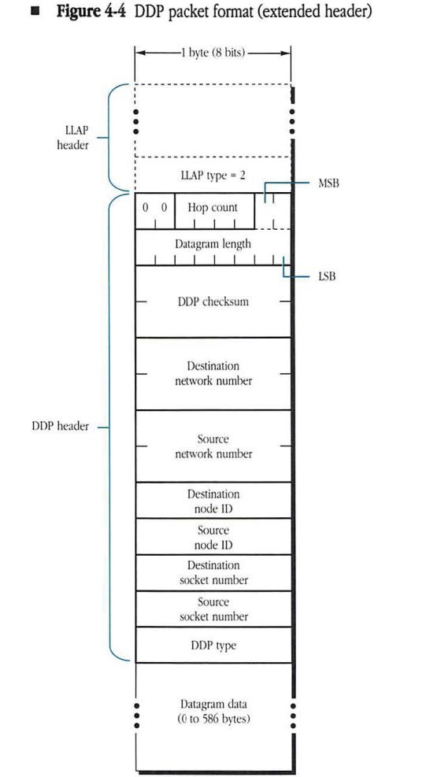
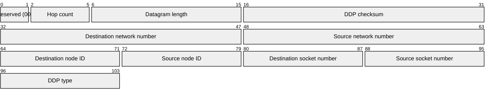

# Part II End-to-End Data Flow

PART I of *Inside AppleTalk* specifies the LocalTalk, EtherTalk, and TokenTalk link access protocols. These protocols govern the operation of local-area data links that can be used to connect network nodes in a geographically restricted area.

In particular, LocalTalk can be used to connect up to 32 network nodes with a maximum cumulative link span of 300 meters. EtherTalk and TokenTalk use standard networking technology to build a local area network (LAN) with a large number of nodes and a cable length of up to several kilometers.

Larger networks than those permitted by these local-area data links can also be set up. This extension can be achieved in two ways:

*   by using bridges to extend a single LAN or data link
*   by interconnecting several LANs through routers to build an internet

Bridges and routers are intelligent devices that extend network systems by storing and forwarding packets on a path from the packet's source node to its destination node.

A *bridge* operates at the data-link layer (level 2 of the ISO-OSI reference model in *Figure I-9*). It examines the data-link level destination addressing information of packets received by it on the link segments to which the bridge is connected. It then retransmits each packet on the appropriate segment toward the packet's destination node. In effect, bridges extend the effective length and maximum number of nodes limit of a single data link or local area network (LAN). Bridges are widely used in Ethernet-based systems such as DECnet™, and source-routing bridges are widely used in token ring based systems. Since bridges simply extend a particular LAN, their use is transparent to the various protocols of the network system.

Routers are used to interconnect several different LANs or data links situated over a widely distributed geographical area. Routers forward packets by using an address extension defined at the network layer (level 3 of the ISO-OSI reference model).

This address extension, known as a network number, is provided by the Datagram Delivery Protocol (DDP), which is described in Chapter 4, "Datagram Delivery Protocol."

While bridges allow extension of a single data link or LAN, routers can be used to interconnect dissimilar data links into a single internet. In particular, as shown in Figure 4-1, routers can be used to enable communication between nodes on LocalTalk, EtherTalk, and TokenTalk data links, thus forming an AppleTalk internet incorporating dissimilar link technologies.

Routers forward packets by consulting routing tables. The Routing Table Maintenance Protocol (RTMP), specified in Chapter 5, governs this table maintenance operation in all AppleTalk routers.

The AppleTalk Echo Protocol (AEP) of Chapter 6 provides the ability to measure round-trip travel times between any two nodes of an AppleTalk internet. This information is useful in a variety of network management functions and for setting retry timers in various transport-level and session-level protocols. ■

---

# Chapter 4 Datagram Delivery Protocol

THE LOCALTALK LINK ACCESS PROTOCOL (LLAP) and other AppleTalk data links provide a best-effort, node-to-node delivery of packets on a single AppleTalk network. The Datagram Delivery Protocol (DDP) is designed to extend this mechanism to the socket-to-socket delivery of datagrams over an AppleTalk internet. Datagrams are packets of data carried by DDP between the sockets of an internet. An AppleTalk internet consists of one or more AppleTalk networks connected by intelligent nodes referred to as **internet routers** (IRs), as shown in *Figure 4-1*.

◆ *Note: Internet routers should not be confused with gateways. Gateways are nodes that separate and manage communication between different protocol families.*

This chapter specifies DDP. In particular it describes:

- sockets and their relation to DDP
- acquisition of a DDP network number and node ID
- calls at the DDP interface
- the algorithms used within DDP


### ■ Figure 4-1 AppleTalk internet and internet routers (IRs)




## Internet routers

IRs are packet-forwarding agents. Packets can be sent between any two nodes of an internet by using a store-and-forward process through a series of IRs. An IR often consists of a single node connected to two or more AppleTalk networks; it might also consist of two nodes connected to each other through a communication channel. In the latter case, the channel between the two halves of the IR could take any of the following forms:

* a leased or dial-up line
* another network (for example, a wide-area packet-switched or circuit-switched public network)
* a higher-speed broadband or baseband local area network (LAN) used as a backbone

## Sockets and socket identification

Sockets are logical entities within the nodes connected to an AppleTalk internet. Sockets are owned by socket clients. **Socket clients** are typically processes (or functions in processes) implemented in software in the node. A socket client can send and receive datagrams only through sockets that it owns.

Each socket within a given node is identified by an **8-bit socket number**. Socket numbers are treated as unsigned integers. There can be at most 254 different socket numbers in a node. (The values 0 and 255 are reserved and cannot be used to identify sockets.)

Sockets are classified into two groups: statically assigned and dynamically assigned. **Statically assigned sockets (SASs)** have socket numbers in the range 1–127. SASs are reserved for use by clients such as the lower-level AppleTalk protocols (for example, Name Binding Protocol (NBP) and Routing Table Maintenance Protocol (RTMP)). Socket numbers 1–63 are specifically reserved for use by Apple. Socket numbers 64–127 are available for unrestricted experimental use. Use of these experimental SAS numbers is not recommended for released products, since there is no mechanism for eliminating conflicting usage of the same socket(s) by different developers (see "Sockets and Use of Name Binding" later in this chapter). See Appendix C for a summary of socket number usage.

Socket numbers 128–254 are assigned dynamically by DDP upon request from clients in that node; sockets of this type are known as **dynamically assigned sockets (DASs)**.


## Network numbers and a node's AppleTalk address

Each AppleTalk network in an internet is assigned a range of 16-bit network numbers. These ranges are specified in such a way that no two ranges in an internet have any network numbers in common. An AppleTalk device is identified by a 16-bit network number, chosen from within the range assigned for the node's network, combined with its 8-bit, dynamically assigned **AppleTalk node ID**. The details of choosing this unique network number/node ID combination are discussed in the next section. Combining the socket number with the node's network number and node ID enables any socket on the internet to be uniquely identified. The **internet socket address** of a socket consists of its socket number and the node ID and network number of the node in which the socket is located. As a result, the source and destination sockets of a datagram can be fully specified by their internet socket addresses.

The network number 0 is reserved to mean unknown; by default it specifies the local network to which the node is connected. Packets whose destination network number is 0 are addressed to a node on the local network. This address allows systems consisting of a single AppleTalk network to operate without network numbers. Network numbers $FF00 through $FFFE are reserved for nodes to use during the startup process and at times when an internet router is unavailable. Their use is described in the following sections.

## Special DDP node IDs

Certain node IDs are reserved and have special meaning to DDP. These node IDs should never be chosen as a part of an AppleTalk node address. Node ID $FF indicates a broadcast to all nodes with a network number equal to that indicated by the specified network number. As long as this network number is nonzero, the packet is refered to as a **network-specific broadcast**. Although it will be received by all AppleTalk nodes on the data link, it should only be accepted by those with the indicated network number.

If the network number is zero, node ID $FF indicates either a network-wide or zone-specific broadcast. A **network-wide broadcast** is sent to all AppleTalk nodes on the data link and should be accepted by all those nodes. A **zone-specific broadcast** is sent to a particular zone multicast address. DDP should always accept such a packet, however higher level protocols like NBP and ZIP will discard the packet if it is not intended for the node's zone (see Chapter 8, "Zone Information Protocol," for details of zone multicast addressing).

Node ID 0 indicates any router on the network specified by the network number part of the node address. Packets addressed to node ID 0 are routed through the internet until they reach the first router directly connected to a network whose range includes the indicated network number. The packet is then delivered to that router. This facility is used by NBP.

Node ID $FE is reserved on EtherTalk and TokenTalk networks and should not be used as a node ID. This address is a valid node ID on LocalTalk networks.

## AppleTalk node address acquisition

DDP is responsible for acquiring a node's AppleTalk address at startup time. This address must be unique throughout the AppleTalk internet. DDP combines with the underlying data link being used by the node, and with internet routers on that data link, to acquire this address. The details of DDP's AppleTalk node address acquisition process depend on the type of network to which the node is connected.

A **nonextended network** is an AppleTalk network on which each node's 8-bit AppleTalk node ID is unique. Thus no more than 254 nodes can be concurrently active on such a network (node IDs 0 and $FF are reserved). Nonextended networks are assigned exactly one network number and exactly one zone name (zones are described in Chapter 7, "Name Binding Protocol"). LocalTalk is an example of a nonextended network.

An **extended network** is an AppleTalk network on which nodes are differentiated by unique network number/node ID pairs. Theoretically, up to 16 million or so nodes can be concurrently active on such a network. Extended networks are assigned a range of network numbers, and all network numbers are chosen from within this range. A second aspect of extended networks is that they can be assigned multiple zone names.

The range of network numbers on an extended network determines the maximum number of concurrently active devices. The maximum number of concurrently active devices on an extended network is equal to the number of network numbers multiplied by the number of possible node IDs. In addition to node IDs 0 and $FF, node ID $FE is reserved on extended networks, and thus there are 253 possible node IDs per network number.

An extended network can be thought of as a number of nonextended networks, each residing on the same physical data link, and each capable of supporting up to 253 nodes. EtherTalk and TokenTalk are examples of extended networks.

### Node address acquisition on nonextended networks

The acquisition of an AppleTalk node address on a nonextended network is greatly simplified by the fact that all nodes on the data link have a unique 8-bit AppleTalk node ID. This being the case, the network needs only one network number to guarantee all nodes on it have addresses that are unique in the internet. The underlying data link (LLAP for LocalTalk) is used to dynamically assign this unique node ID. The node’s network number is then obtained from a router using an RTMP Request packet. Details of this exchange are specified in Chapter 5, “Routing Table Maintenance Protocol.”

If a nonextended network is operating without a router, no reply will be received from the RTMP Request. In this case, the network number is set to zero. If a router later becomes available, the network number is then set to the one specified by the router.

### Node address acquisition on extended networks

The acquisition of an AppleTalk network number and node ID on an extended network takes place in two steps. First a **provisional node address** is obtained through the data link for purposes of talking to a router and thereby discovering the network number range that is valid for the network to which the node is connected. Following this, the node’s actual network number and node ID are obtained through the underlying data link.

When a node is started for the first time on an extended network, it asks the underlying data link for a provisional node address. The node ID part of this address is chosen at random, and the network number part is chosen from the range $FF00 to $FFFE. This range is reserved for the startup process, and is referred to as the **startup range**.

If the node had been previously started on the extended network, it will have saved the last network number and node ID it used on that network (in non-volatile or disk storage). Upon startup, the node instructs the data link to obtain its provisional node address by trying this “hint” first. If this “hint” is in use, the data link should then try all node IDs with the same network number as the hint. In this way, there is a good chance that the node’s provisional node address will include a network number within the network number range for its data link, and there will be no need to obtain another one. If all node IDs with the old network number are in use, the node should proceed to obtain a provisional node address in the startup range. Optionally, it could have saved the entire range of network numbers for the network it was last on and could try other valid network numbers in this range before proceeding to the startup range.

Once a provisional node address has been acquired, the node can proceed to talk to a router to find out the actual network number range in which its network number should be chosen. This is done through a ZIP GetNetInfo request, details of which are described in Chapter 8, “Zone Information Protocol.” The response to this request includes the network number range that has been assigned to the node’s network. If the node’s provisional address contains a network number within this range, it is kept as the node’s final network number and node ID. Otherwise, the node instructs its data link to obtain a unique address containing a network number within the range specified by the router. In either case, the node’s final network number and node ID are saved in long-term storage for the next time the node starts up.

In the case of an extended network operating without a router, no reply will be received from the GetNetInfo request. In this case, the node’s provisional node address becomes its final network number and node ID. Extended networks do not have the concept of a zero network number when no router is available, since that would limit such networks to 253 nodes. If a router does become available later, the node must verify that its network number is within the range specified by the router. This will generally be the case as long as the node was previously started up on its current network.

In the rare case where a router becomes available after the node has started up and the node’s network number is not within the range specified by the router, a new address must be acquired before the node can communicate on the internet. However, since the node has been active on its local network for some time, it may already have established network connections. These connections are usually based on the node’s address, and thus will probably break when a new node address is acquired. For this reason, the node may continue to operate for some time as if the router had not become active.

During the startup process, the node also acquires information about its zone. Details of this process are specified in Chapter 8, “Zone Information Protocol.”

## DDP type field

The AppleTalk architecture allows the implementation of a large number (up to 255) of parallel protocols that are clients of DDP. Note that socket numbers are not associated with a particular protocol type and should not be used to demultiplex among parallel protocols at the transport level. Instead, a 1-byte DDP type field is provided in the DDP header for this purpose. See Appendix C for a summary of the use of the DDP type field.


## Socket listeners

Socket clients provide code, referred to as the **socket listener**, that receives datagrams addressed to that socket. The specific implementation of a socket listener is node-dependent. For efficiency, the socket listener should be able to receive datagrams asynchronously through either an interrupt mechanism or an input/output request completion routine.

The code that implements DDP in the node must contain a data structure called a **sockets table** to maintain an appropriate descriptor of each open socket's listener.

## DDP interface

As shown in Figure 4-2, the DDP interface is the boundary at which the socket client can issue calls to and obtain responses from the DDP implementation module in the node. The DDP implementation module supports the following four calls:

* opening a statically assigned socket
* opening a dynamically assigned socket
* closing a socket
* sending a datagram

These calls are described in the following sections.

#### Figure 4-2 Socket terminology



### Opening a statically assigned socket

This call specifies the socket number (in the range 1–127) and the socket listener for that socket. The call returns with a result code, which has the following possible values:

| Result code | Meaning |
|---|---|
| success | socket opened |
| error | various cases such as socket already open, not a statically assigned socket (outside the permissible range), or sockets table full |


### Datagram reception by the socket listener

In addition to the four calls just described, a socket listener mechanism must be provided for the reception of datagrams. Although details of the socket listener are not specified (since these are implementation-dependent), some mechanism is needed to deliver datagrams within the node to the destination client. The DDP module should attempt this delivery only if the destination socket is currently open. DDP must discard datagrams if they are addressed to a closed socket or if the datagram is received with an invalid DDP checksum.

## DDP internal algorithm

Since DDP is a simple, best-effort protocol for internet-wide, socket-to-socket delivery of datagrams, it does not provide a mechanism for recovery from packet loss or error situations.

The primary function of the DDP implementation module is to form the DDP header on the basis of the destination address and then to pass the packet to the appropriate data link. Similarly, for packets received from the data-link layer, DDP must examine the datagram’s destination address in the DDP header and route the datagram accordingly. Details of this operation depend on whether or not the node is an IR (see “DDP Routing Algorithm” later in this chapter).

## DDP packet format

A datagram consists of the DDP header followed immediately by the data. The first 2 bytes of the DDP header contain a 10-bit datagram length field. The value in this field is the length in bytes of the datagram counted by starting with the first byte of the DDP header and including all bytes up to the last byte of the data part of the datagram. Upon receiving a datagram, the receiving node’s DDP implementation must reject any datagram whose indicated length is not equal to the actual received length. The maximum length of the data part of a datagram is 586 bytes; longer datagrams must be rejected.

### Short and extended headers

The DDP header also contains the source and destination socket addresses and the DDP type. Each of these addresses could be specified as a 4-byte internet socket address. However, for datagrams whose source and destination sockets are on the same network, the network number fields are unnecessary. Similarly, for such datagrams on LocalTalk, the source and destination node IDs are found in the LLAP header and would be redundant in the DDP header. Therefore, DDP uses two types of header—short and extended. A **short DDP header** is used on nonextended networks when source and destination sockets have the same network number. An **extended DDP header** is used for exchanging datagrams between sockets with different network numbers. DDP uses the value of the LLAP type field to determine if the packet has a short or an extended DDP header. The LLAP type field value is 1 for the short and 2 for the extended.

A datagram with a short header is shown in *Figure 4-3*. The short DDP header is 5 bytes long. The first 2 bytes of the header contain the datagram length, with the most-significant bits in the first byte. The upper 6 bits of this byte are not significant and should be set to 0. The datagram length field is followed by a 1-byte destination socket number, a 1-byte source socket number, and a 1-byte DDP type field. Datagrams with short headers can be sent only if the source and destination sockets have the same network number. Short headers are used solely for efficiency reasons; in fact, an implementation of DDP is permitted to send datagrams with extended headers even when source and destination sockets are on the same network. Extended headers are required on extended networks; datagrams with short headers should never be used on extended networks.

#### Figure 4-3 DDP packet format (short header)





| Field | Bit offset | Width (bits) | Description |
|---|---|---|---|
| Reserved | 0 | 6 | Reserved bits, must be set to zero. |
| Datagram length | 6 | 10 | The length of the DDP datagram (header plus data) in bytes. |
| Destination socket number | 16 | 8 | The socket number of the destination socket. |
| Source socket number | 24 | 8 | The socket number of the source socket. |
| DDP type | 32 | 8 | The DDP protocol type for the data in the datagram. |

A datagram with an extended header is shown in *Figure 4-4*. The extended DDP header is 13 bytes long. It contains the full internet socket addresses of the source and destination sockets as well as the datagram length and DDP type fields. For such packets, there is a 6-bit hop count field in the most-significant bits of the first byte of the DDP header. See "Hop Counts" later in this chapter. In addition, the extended header may include an optional 2-byte (16-bit) DDP checksum field. See "Checksum Computation" later in this chapter. All 2-byte fields are specified with the high byte first. Datagrams exchanged between sockets on different AppleTalk networks and on any extended network must use an extended header.


#### Figure 4-4 DDP packet format (extended header)





| Field | Bit offset | Width (bits) | Description |
|---|---|---|---|
| Reserved | 0 | 2 | Reserved bits, set to 00. |
| Hop count | 2 | 4 | The number of routers the packet has passed through. |
| Datagram length | 6 | 10 | The total length of the DDP datagram, including the header and data. |
| DDP checksum | 16 | 16 | A 16-bit checksum used for error detection in the DDP datagram. |
| Destination network number | 32 | 16 | The network number of the destination node. |
| Source network number | 48 | 16 | The network number of the source node. |
| Destination node ID | 64 | 8 | The node ID of the destination node. |
| Source node ID | 72 | 8 | The node ID of the source node. |
| Destination socket number | 80 | 8 | The socket number of the destination application. |
| Source socket number | 88 | 8 | The socket number of the source application. |
| DDP type | 96 | 8 | The protocol type of the data field (e.g., RTMP, NBP, ATP, etc.). |


### DDP checksum computation

The DDP checksum is provided to detect errors caused by faulty operation (such as memory and data bus errors) within routers on the internet. Implementers of DDP should treat generation of the checksum as an optional feature. The 16-bit DDP checksum is computed as follows:

```text
CkSum := 0 ;

FOR each datagram byte starting with the byte immediately following the
Checksum field

REPEAT the following algorithm:
    CkSum := CkSum + byte; (unsigned addition)
    Rotate CkSum left one bit, rotating the most significant bit into the
           least significant bit;

IF, at the end, CkSum = 0 THEN
    CkSum := $FFFF (all ones).
```

Reception of a datagram with CkSum equal to 0 implies that a checksum is not performed.

### Hop counts

For datagrams that are exchanged between sockets on two different AppleTalk networks in an internet, a provision is made to limit the maximum number of IRs the datagram can traverse. Limiting this number is done by including in such internet datagrams a **hop count field**.

The source node of the datagram sets this field to 0 before sending the datagram. Each IR increases this field by 1. An IR receiving a datagram with a hop count value of 15 should not forward it to another IR; if such a datagram's destination node is on a network directly connected to the IR, then the IR should send the datagram to that destination node. Otherwise, the datagram should be discarded by the IR. This provision is made to filter out the internet packets that might be circulating in closed routes. Such a closed route (*loop*) is a transient situation that can occur for a short period of time while the routing tables are being updated by the RTMP. Non-IR nodes ignore the hop count field.

The upper 2 bits of the hop count currently are not used by DDP but are reserved for future use (such as the extension of the maximum value of the hop count beyond the currently allowed value of 15).

## DDP routing algorithm

A datagram is conveyed from its source to its destination socket over the internet through IRs. The DDP implementation in the source node examines the destination network number of the datagram and determines whether or not the destination is on the local network. If the destination node is on the local network, the data-link layer is called to send the packet to the destination node. (The short DDP header can be used if the nodes are on a nonextended network.) However, if the destination is not on the local network, DDP builds the extended header and calls the data link to send the packet to an IR on the local network. (If there is more than one such IR, any one will do.) IRs examine the destination network number of the datagram and use routing tables to forward the datagram to subsequent IRs until an IR is reached that is connected to the destination network. (Routers forward datagrams through the data links of intervening local networks.) At the destination network, the datagram is sent to its destination node through the local network's data-link protocol.

Each node on an AppleTalk network maintains (as an internally stored value) the network number range of the local network to which it is attached. The DDP implementation in a datagram's source node determines whether the destination network is the local network by comparing the destination network number to the internally stored network number range. If the destination network number is in the local network number range, the packet can be delivered to a node on the local network. The packet should also be delivered locally if the destination network number is in the startup range ($FF00-$FFFE).

A special case arises on a nonextended network when the internally stored value is 0 (unknown). In this case, if the datagram's destination network number is not 0, then DDP should assume that the packet is intended for a node on the local network. However, DDP must in this case build an extended DDP header and call the data link to send the packet to the specified destination node on the local network. The extended DDP header enables the receiving node to throw away the packet if that node's DDP module determines that it was not the intended recipient (that is, if the destination network number of the packet is not equal to its internally stored local network number).

On an extended network, until a router is heard from, the local network number range should be set to 0-$FFFE. In this way, all packets will be delivered on the local network until a router becomes available.

Using RTMP, IRs maintain routing tables (discussed in detail in Chapter 5, "Routing Table Maintenance Protocol"). For each network number in the internet, the routing tables indicate the node ID (on the appropriate local network) of the next router on the proper route.

Nodes that are not IRs (nonrouter nodes) are not required to maintain routing tables. Such nodes need maintain only the following two pieces of information:

* the network number (THIS-NET) or network number range (THIS-NET-RANGE) of the local network
* the 16-bit network number and 8-bit node ID of any router (A-ROUTER) on the local network

This information can be obtained by implementing a simple subset of RTMP, called the **RTMP Stub**, in each nonrouter node. For nodes on systems consisting of a single network and no router, the values of THIS-NET and A-ROUTER will be 0 (unknown). On extended networks the value of THIS-NET-RANGE will be 0-$FFFE.

The following Pascal-like description specifies the internal routing algorithm used by the DDP implementation module on a nonrouter node on a non-extended network. The sending client issues a call to send a datagram, specifying the destination's internet socket address.

```pascal
IF (destination network number = 0) OR (destination network number = THIS-NET) THEN
    BEGIN
        build the DDP header (it may be the short form);
        call the data link to send the datagram to the destination node
    END
ELSE
    BEGIN
        build the extended DDP header;
        IF THIS-NET = 0 THEN call the data link to send the packet to the destination node
        ELSE IF A-ROUTER <> 0 THEN call the data link to send the packet to A-ROUTER
        ELSE return an error (no router available)
    END;
```

The following is the equivalent algorithm used by the DDP implementation module on a nonrouter node on an extended network. This algorithm is simplified by the fact that if there is no router, THIS-NET-RANGE will always be the full internet range, $0-$FFFE.

```pascal
IF (dest net no. = 0) OR (dest net no. within THIS-NET-RANGE) OR
                        (dest net no. between $FF00 and $FFFE)
    THEN
        BEGIN
            build the extended DDP header;
            call the data link to send the datagram to the dest node
        END
    ELSE
        BEGIN
            build the extended DDP header;
            call the data link to send the datagram to A-ROUTER
        END;
```


For packets received by nonrouter nodes, the routing function simply delivers the datagram to the destination socket in the node. DDP must first verify that the destination network number (in an extended DDP header) is equivalent to that node's internally stored value of its network number. Otherwise, the packet is ignored. (For a precise definition of this equivalence, see “Network Number Equivalence” later in this chapter.) It is also advisable for such nodes to verify that the destination node ID in an extended DDP header matches the node's identifier (or is equal to the broadcast address, 255 ($FF)).

In IRs, the routing algorithm is somewhat more complex (see Chapter 5, “Routing Table Maintenance Protocol”).


### Optional “best router” forwarding algorithm

The routing algorithm given earlier, combined with the operation of the internet routers, is sufficient to deliver a packet to its destination socket. However this algorithm may result in an extra hop in getting to that destination. This will be the case if the initial router chosen by DDP is not on the shortest path to the destination network (remember DDP picked any router to send the packet to for forwarding). This section details an optional “best router” implementation for eliminating this extra hop under most conditions. “Best router” is highly recommended on extended networks, which often consist of many network segments interconnected by bridges.

When a packet comes in to DDP whose source network number is not within THIS-NET-RANGE (or the startup range), DDP looks at the sender's data-link address. This is the address of the last router on the route from the network the source node was on. Sending packets to this router to get to that network should be the best route in terms of hops. DDP maintains a cache of recently heard from network numbers and the data-link addresses of the “best” router for each of those networks.

When DDP determines that a packet needs to be sent to a router, it examines the “best router” cache to determine if it has an entry for the packet's destination network. If so, DDP calls the underlying data link to send the packet to the data-link address maintained in that cache. Otherwise it calls the data link to send the packet to the AppleTalk address indicated by A-ROUTER — a response will probably come back and an entry will then be made in the cache.

It is recommended that the “best router” cache be aged every 40 seconds or so, so that if a router goes down, an alternate route will be adopted in an expedient manner and network connections will not break. *Aging* in this case means that if no packets are received with a particular source network number for this period of time, the entry for that network should be removed from the cache.


## Sockets and use of name binding

Developers of products for AppleTalk should not use SASs except for purely experimental purposes. This restriction is imposed in order to avoid the conflicting use of the same SAS by different developers. Such conflicts are difficult to avoid in the absence of a central administering body.

Instead, developers should use the name-binding technique to allow workstations to discover their server/service socket addresses. As a result, developers must identify their server/service by a unique name. Workstations would then use NBP to bind an address to this name (for details, see Chapter 7, "Name Binding Protocol"). Once the client process has determined the proper destination socket address, it can then proceed to transmit packets to that socket.

This technique requires that developers implement NBP in their servers. While not significant for larger servers, implementation of NBP could pose a problem for smaller, memory-bound devices. Thus, NBP has been designed so that only a subset is required for such memory-bound servers. The NBP subset simply responds to *lookup* packets received over the network. Since the names table of such a server will contain only a single name, the NBP subset need not implement functions such as names table management.

## Network number equivalence

The use of network number 0 to indicate unknown introduces some complexity for DDP clients. A DDP client may want to compare two network numbers to determine if they are equivalent. For example, if a request is sent to a node on network 7 and a response is received from a node on network 0, a question arises as to whether the response received was from the same network to which the request was sent. Therefore, it must be clearly defined when two network numbers match (in other words, when they are equivalent). The rule to use is "zero matches anything." As a result, network A is equivalent to network B if A=B or A=0 or B=0. All DDP clients must use this definition of network equivalence.

