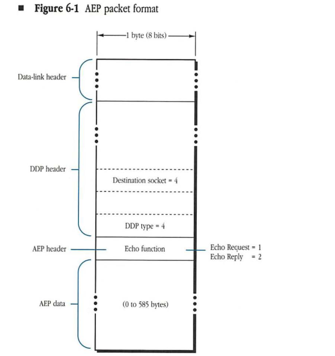
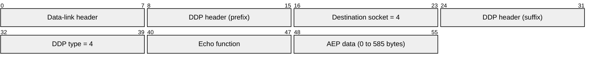

# Chapter 6 AppleTalk Echo Protocol

THE APPLETALK ECHO PROTOCOL (AEP) is implemented in each node as a process on a statically assigned socket (socket number 4, known as the Echoer socket). The Echoer listens for packets received through this socket. Whenever a packet is received, the Echoer examines its Datagram Delivery Protocol (DDP) type and the DDP data length in the packet to determine if the packet is an AEP packet. If it is, then a copy of the packet is returned to the sender.

Figure 6-1 shows the format of an AEP packet. If the DDP type field in a packet is not equal to 4 (the DDP type for AEP) or if the DDP data length is 0, then the Echoer discards the packet and ignores it. However, if the packet has a DDP type equal to 4 and the DDP data length is not 0, then the Echoer examines the AEP header (the first byte of the DDP data). If the first byte, known as the Echo function field, is equal to 1, then the packet is an Echo Request packet. In this case, the Echoer changes the function field to 2, which indicates that the packet is an Echo Reply packet, and the Echoer calls DDP to send the packet back to the sender of the Echo Request packet. ■ 

#### **Figure 6-1** AEP packet format

| Field | Bit offset | Width (bits) | Description |
|---|---|---|---|
| Data-link header | 0 | Variable | Underlying network layer header. |
| DDP header | Variable | Variable | Datagram Delivery Protocol header. |
| Destination socket | Variable | 8 | Must be set to 4 for AppleTalk Echo Protocol (AEP). |
| DDP type | Variable | 8 | Must be set to 4 for AEP. |
| Echo function (AEP header) | Variable | 8 | Specifies the AEP operation: 1 = Echo Request, 2 = Echo Reply. |
| AEP data | Variable | 0-4680 | Data to be echoed, between 0 and 585 bytes in length. |

When using AEP services, the client must first determine the internet address of the node from which an echo is being sought (the client process usually uses the Name Binding Protocol (NBP) for this purpose). The client then calls DDP to send an Echo Request packet to the Echoer socket (socket number 4) in that node. The client can send the Echo Request datagram through any socket the client has open, and the Echo Reply will come back to this socket. The client then waits for the receipt of the Echo Reply packet.

* **Note:** The client can set the AEP data part of the Echo Request packet to any pattern and then examine the data in the Echo Reply packet (which will be the data sent in the Request packet). The client can use the data in the Reply packet to distinguish between the replies to various Echo Request packets the client has sent.

The client may fail to receive an Echo Reply under the following conditions:

* The AEP packets are lost in the network system.
* The target node does not have an Echoer.
* The target node is currently unreachable or has gone down.

The client should determine how long to wait for the Echo Reply packet before concluding that one of these conditions exists. The client could retransmit the Echo Request packet several times before concluding that the remote node will not respond.

AEP can be used

* by any DDP client to determine whether a particular node, known to have an Echoer, is accessible over an internet
* to obtain an estimate of the round-trip time for a typical packet to reach a particular remote node, usually a server (This time estimate is extremely useful in developing certain heuristic methods, for example those used for estimating the timeouts to be specified by clients of the AppleTalk Transaction Protocol (ATP), the AppleTalk Session Protocol (ASP), and other higher-level protocols.)

