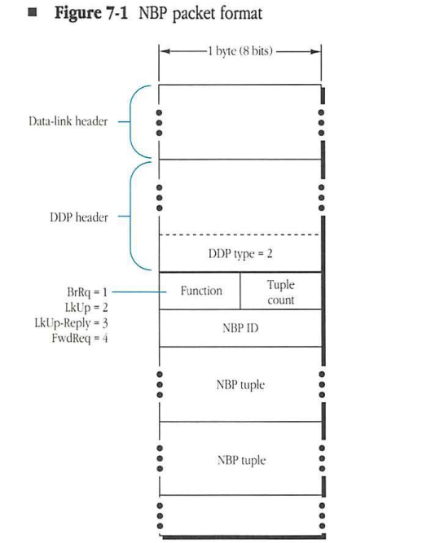
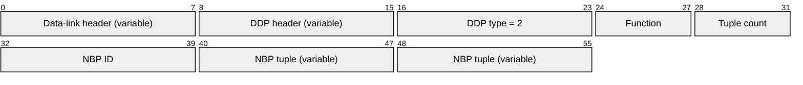
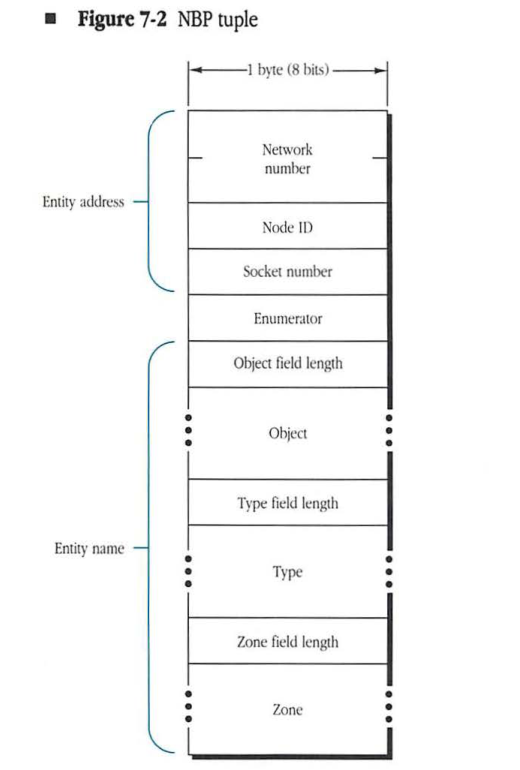
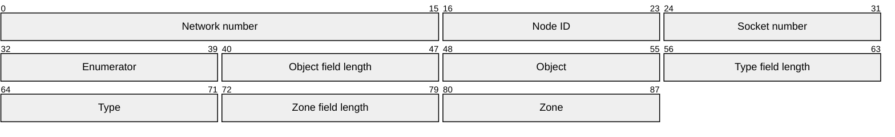

# Part III Named Entities
1. TOC
{:toc}

PART III DISCUSSES in detail the Name Binding Protocol (NBP) and the Zone Information Protocol (ZIP).

Part I and Part II described protocols by which AppleTalk conveys packets from one network entity to any other entity on that network or an AppleTalk internet. These protocols use numerical addresses to identify a packet's source and destination entity. From these addresses AppleTalk determines the route the packet uses on its path through the internet.

Although addresses are efficient for internal use, network users prefer names. Names are character strings that can more naturally convey semantic and contextual information to the user. Part III describes the protocols by which names can be converted to addresses. ■

# Chapter 7 Name Binding Protocol

APPLETALK PROTOCOLS RELY on numeric identifiers, such as node IDs, socket numbers, and network numbers, to provide the addressing capability essential for communication over the network. However, numbers are sometimes hard for users to memorize and are easily confused and misused. For network users, names are a more familiar form of identification. If an entity is referred to by name, the name must be converted into a network address for use by the other protocols. The Name Binding Protocol (NBP) performs the conversion of entity names into addresses.

An AppleTalk network uses dynamic node address assignment; therefore, addresses can change from time to time and cannot be configured into software to gain access to network resources. Name binding provides a way of translating names, which change infrequently, into addresses, which change frequently (see "Sockets and Use of Name Binding" in Chapter 4, "Datagram Delivery Protocol").

This chapter describes NBP and includes information about

- network-visible entities and entity names
- name binding protocol services on a single network and on an internet

## Network-visible entities

A network-visible entity (NVE) is any entity that is accessible over an AppleTalk network system through the Datagram Delivery Protocol (DDP). Thus, the socket clients on an internet are its NVEs.

The nodes of the internet are not NVEs; rather, any services in the nodes available for access over the network system are NVEs. For example, a network print server itself is not the NVE. The print service will typically be a socket client on what might be called the server's request listening socket. The request listening socket is the server's NVE.

The same distinction applies to the users of the network system. They themselves are not network-visible. But a user can have an electronic mailbox on a mail server. This mailbox is network-visible and will have a network address. Although the network does not provide any protocols for conversing directly with the individual user, the protocols communicate with applications and services to which the user can gain access.

## Entity names

An NVE can assign itself a name, called an entity name, although not all NVEs need to have names. Entity names are character strings. A particular entity could, in fact, possess several names (aliases).

An **entity name** is a character string consisting of three fields—object, type, and zone—in this order with colon (:) and at-sign (@) separators (for example, Judy:Mailbox@Bandley3). Each field is a string of a maximum of 32 characters.

In addition to a name, an entity can also have certain attributes. For example, a print server's request receiver might have associated with it a list of the printer's attributes such as its type (daisy wheel, dot matrix, laser) and the kind of paper the printer holds. These attributes are specified in a part of the entity name called the **entity type**.

In addition to attributes, some location information about the entity can prove useful for users. For example, a print server might belong to a particular department or building. Users of the network should be able to select a print server on the basis of some appropriate information such as its convenient location. As a result, a zone field has been included in the entity name.

In the entity name, certain special characters can be used in place of strings. For the object and type fields, an equal sign (=) wildcard can be substituted, signifying all possible values. A single approximately equal sign (≈) can also be used to match zero or more characters anywhere within an object or type string. For the zone field, an asterisk (*) can be substituted signifying the default value (that is, the zone in which the node specifying the name resides).

If a network name does not contain special characters, the name is said to be fully specified. For example, Mona:Mailbox@Bandley3 is fully specified. The network name =:Mailbox@* refers to all mailboxes in the same zone as the information requester. The network name =:=@* means all named entities of all types in the requester's zone. Mona:=@* refers to all entities named Mona in the requester's zone regardless of their type. ≈Mona:=@* refers to all entities in the requestor's zone with a name that ends with Mona (e.g. Molly Mona).

Entity names by definition are case-insensitive. Thus, Mona:Mailbox@Bandley3 is considered the same as Mona:mailbox@bandley3 and MONA:MAILBOX@BANDLEY3. For characters in the standard ASCII character set, it is fairly clear what this means: A ($41) is the same as a ($61), B is the same as b, and so forth through Z and z. But the string MAGAÑA should also be considered the same as the string Magaña. ASCII definitions for non-English characters are not standardized. See Appendix D for a complete description of the diacritical matching used in AppleTalk.

* Note: The character $FF is reserved as the first byte of an NBP object, type, or zone string. This character is reserved to provide flexibility in future development.

## Name binding

Before a named entity can be accessed over an AppleTalk network or internet, the address of that entity must be obtained through a process known as name binding.

Name binding can be visualized as a mapping of an entity name into its internet socket address or, equivalently, as a lookup of the address in a large database. For the case of a single nonextended network, the network number field of the internet socket address will always be equal to 0 (unknown).

Name binding can be done at various times. One strategy is to configure the address of the named entity into the system trying to gain access to that entity. This strategy, static binding, is not appropriate for systems such as AppleTalk in which the node ID can change every time a node is activated on the network.

Although entities can move on a network, their names seldom change. For this reason, it is preferable to use names in identifying entities. Services, such as NBP, can then be used to bind names dynamically to internet addresses. This binding can be done when the user's node is first brought up (known as early binding) or just before access to the named entity is obtained (known as late binding). Early binding may result in the use of out-of-date information when the resource is accessed, possibly long after the user's node was brought up. However, since the binding process adds further delay, late binding could slow down the user's initial access to the named entity. Late binding is the appropriate method to use when the entity is expected to move on the internet.

### Names directory and names tables

Each node maintains a **names table** containing name-to-entity internet address mappings (known as NBP name-address tuples) of all entities in *that* node. The **names directory** (ND) is a distributed database of name-to-address mappings; it is the union of the individual names tables in the nodes of the internet. The database does not require different portions to be duplicated. The database can be distributed among all nodes containing named NVEs.

Name binding is accomplished by using NBP to look up the entity's address in the names directory. NBP does not require the use of name servers. However, its design allows the use of name servers if they are available.

### Aliases and enumerators

NBP allows an NVE to have more than one name. Each of these aliases must be included in the names table as an independent entity.

To simplify and speed up the ability to distinguish between multiple names associated with a particular socket, an enumerator value is associated with each names table entry. The **enumerator value** is a 1-byte integer, invisible to the clients of NBP. Each NBP implementation can develop its own scheme for generating enumerator values to be included in the names table. The scheme developed requires that no two entries corresponding to the same socket have the same enumerator value.

### Names information socket

Each node implements an NBP process on a statically assigned socket (socket number 2) known as the names information socket (NIS). This process is responsible for maintaining the node's names table and for accepting and servicing requests to look up names from within the node and from the network.

## Name binding services

The name binding protocol provides four basic services:

* name registration
* name deletion
* name lookup
* name confirmation

These services are described in the following sections.

### Name registration

Any entity can enter its name and socket number into its node's names table to make itself *visible by name* by using the name registration call to the node's NBP process.

The node's NBP process must first verify that the name is not already in use by looking up the name in the node's zone. If the name is already in use, the registration attempt is aborted. Otherwise, the name and the corresponding socket number are inserted into the node's names table. The NBP process then enters the corresponding name-to-address mapping in the ND.

When a node starts up, its names table is empty. When restarted, each NVE must reregister its name(s) in the names table.

### Name deletion

A named entity should delete its name-to-address mapping from the ND when it wants to make itself invisible. The most common reason for deleting the mapping is that the entity terminates operation.

To cause a name to be deleted, the entity issues a name deletion call to the node's NBP process. The name deletion call deletes the corresponding name-to-address mapping from the node's names table.

### Name lookup

Before obtaining access to a named entity, the user (or application) must perform a binding of the entity's name to its internet socket address. *Binding* is done by issuing a name lookup call to the user node's NBP process. This process then uses NBP to perform a search through the ND for the named entity. If it is found, then the corresponding address is returned to the caller. Otherwise, an *entity not found* error condition is returned by NBP.

The name lookup operation can find more than one entity matching the name specified in the call, especially when the name includes wildcards (= and ≈). The interface to the user must have provisions for handling this case.

NBP does not allow the use of abbreviated names; for example, NBP does not permit reference to `Mona:Mailbox`. The complete reference `Mona:Mailbox@Bandley3` or `Mona:Mailbox@*` must be provided. Provisions can be made in the user interface to permit abbreviations. The interface must then produce the complete name before passing it on to NBP.

### Name confirmation

The name lookup call performs a zone-wide ND search. More specific confirmation is needed in certain situations. For example, if early binding was performed, the binding must be confirmed when access to the named entity has been obtained. For this purpose, NBP has a name confirmation call in which the caller provides the complete name and address of the entity. This call in effect performs a name search in the entity's node to confirm that the mapping is still valid.

Although a new name lookup can lead to the same result, the confirmation produces less network traffic. Name confirmation is the recommended and preferable call to use when confirming mappings obtained through early binding.

## NBP on a single network

Name lookup is quite simple on a system consisting of a single AppleTalk network.

When a user issues a name registration (or lookup) call to the NBP process in its node, this process first examines its own names table to determine whether the name is available there. If it is, in the case of a registration attempt, the call is aborted with a *name already taken* error condition. In the case of a name lookup, the information in the names table is a partial response. (Entities in other nodes may match the specified name.)

NBP then prepares an NBP Lookup packet (LkUp packet) and calls DDP to broadcast the LkUp packet over the network for delivery to the NIS. Only nodes that have an NBP process will have the NIS open. In these nodes, the LkUp packet is delivered to the NBP process, which searches its names table for a potential match. If no match is found, the packet is ignored. If a match is found, a LkUp-Reply packet is returned to the address from which the LkUp packet was received. This LkUp-Reply packet contains the matching name-address tuples found in the replying node's names table.

The receipt of one or more replies allows the requesting NBP process to compile a list of name-to-address mappings. If the lookup was performed in response to a name registration call, then the call must be aborted since the name is already taken.

Since DDP provides only a best-effort delivery service, the requesting NBP process sends the LkUp packet several times before returning the compiled mappings to the requesting user. If no replies are received, then no entity is currently using the specified name. For a name registration call, the requested name-to-address mapping is entered into the node's names table. For a name lookup call, the user is informed of a *no such entity* result.

Sending the LkUp packet several times implies that the same name-to-address mapping could be received several times by the requesting node. These duplicates must be filtered out of the list of mappings. One way to filter the list of mappings is to compare the name strings and the address fields with each entry in the compiled list; this method, however, is inefficient. Comparison of the 4-byte address fields is insufficient because of the possibility of aliases. Using the enumerator value together with the address resolves this problem and accelerates the filtering of duplicates.

Name confirmation is similar to name lookup except that the caller provides the name-to-address mapping to be confirmed. The LkUp packet is not broadcast; it is sent directly to the NIS at the specified internet node address. This process can be repeated several times to protect against lost packets or against the target node being temporarily busy.

- **Note:** On a single AppleTalk network, there is only one zone, which should be considered unnamed (zone names originate in routers). Any request made by a client to perform a lookup with a zone name other than an asterisk (*) should be rejected with an error.

## NBP on an internet

The use of broadcast packets to perform name lookup is impractical in internets because DDP does not allow a broadcast to all nodes in the internet. DDP can broadcast datagrams to all nodes with a single specified network number in the internet. These broadcasts are known as **directed broadcasts**. If NBP were to send a directed broadcast to every network in the internet, the traffic generated would be considerable. Furthermore, in some cases, the excessively large lists of name-address mappings compiled would be cumbersome for the user. For these reasons, the concept of zones is introduced.

### Zones

A zone is an arbitrary subset of the AppleTalk nodes in an internet. A particular network can contain nodes belonging to any number of zones (although all nodes in a non-extended network must belong to the same zone). A particular node belongs to only one zone. Nodes choose their zone at startup time from a list of zones available for their network. The union of all zones is the internet. A zone is identified by a string of no more than 32 characters.

The concept of zones is provided to establish departmental or other user-understandable groupings of the entities of the internet. Zones are intelligible only to NBP and to the related Zone Information Protocol (ZIP). (See Chapter 8, "Zone Information Protocol.")

### Name lookup on an internet

Internet routers (IRs) participate in the name lookup protocol of an internet. The NBP process in the requesting node prepares an NBP Broadcast Request packet (BrRq packet) and sends it to the NIS of A-ROUTER (see "RTMP and Nonrouter Nodes" in Chapter 5, "Routing Table Maintenance Protocol"). The NBP process in the router, in cooperation with the NBP processes in the other routers of the internet, arranges to convert the BrRq packet into one Forward Request (FwdReq) packet for each network that contains nodes in the target zone of the lookup request. (The exact details of this algorithm are specified in Chapter 8, "Zone Information Protocol.") Each of these FwdReq packets is then sent to the NIS in any router directly connected to the corresponding network. (These packets are addressed to DDP node address zero.) When this router receives the FwdReq, it converts the FwdReq to a LkUp packet and broadcasts it to the NIS in all nodes in the target zone on the destination network. Where possible this broadcasting is done using zone-specific multicast, described in Chapter 8, "Zone Information Protocol." The NBP replies are returned to the original requester.

Since routers on the internet are responsible for generating zone-wide broadcasts, routers must have a complete mapping of zone names to their corresponding networks. ZIP establishes and maintains these mappings, as discussed in Chapter 8, "Zone Information Protocol." Nodes that are not routers do not need to know anything about the mapping between networks and zones. Nodes only need to be able to verify that a lookup is intended for their zone or a zone name of asterisk ( * ). (Nodes on nonextended networks need not even do this.)

◆ Note: On an internet, nodes on extended networks performing lookups in their own zone must replace a zone name of asterisk ( * ) with their actual zone name before sending the packet to A-ROUTER. All nodes performing lookups in their own zone will receive LkUp packets from themselves (actually sent by a router). The node's NBP process should expect to receive these packets and must reply to them.

## NBP interface

The following sections describe the four calls that provide the user with all the functionality of name binding:

* registering a name
* removing a name
* looking up a name
* confirming a name

◆ Note: All calls to NBP take an entity name as a parameter. However, the zone name is meaningful only in the lookup call. In all other calls, the zone name is required, for consistency, to be an asterisk (*).

### Registering a name

This call is used by an NBP client to register an entity name and its associated socket address. Special characters are not allowed in the object and type fields; the zone name field must be equal to an asterisk ( * ) or its equivalent.

| | |
|---|---|
| **Call parameters** | entity name |
| | socket number |
| **Returned** | success |
| **parameters** | failure: name conflict; invalid name or socket |

Although this feature is not required in NBP, the implementation of the name registration call could verify that the socket is actually open.

### Removing a name

This call is made to remove an entity name from the node's names table. Wildcard characters are not allowed in the object and type fields; the zone name field must be an asterisk ( * ).

| | |
|---|---|
| **Call parameter** | entity name |
| **Returned** | success |
| **parameters** | failure: name not found |

### Looking up a name

This call is used to map between an entity's name and its internet socket address. Special characters are allowed in the name to make the search as general as necessary. More than one address matching the entity name is possible. For each match, this call returns the name and its internet socket address. The names returned contain fully specified object and type fields; the zone name, however, may be returned as an asterisk ( * ), regardless of the zone specified.

| | |
|---|---|
| **Call parameters** | entity name |
| | maxMatches |
| **Returned parameters** | success |
| | failure: name not found |
| | list of entity names and their corresponding internet socket addresses |

The parameter maxMatches is a positive integer that specifies the maximum number of matching name-to-address mappings needed. This parameter is useful if wildcards, such as equal signs (≈), are used by the caller in the entity name parameter.

◆ **Note:** All AppleTalk Phase 2 nodes must support the approximately equal sign (≈) wildcard feature. However, some nodes on LocalTalk may not have implemented this feature yet. Such nodes may not respond correctly to lookups containing this character in the object and type fields.

### Confirming a name

This call confirms a caller-supplied mapping between entity name and address. Special characters are not allowed in the object and type fields of the name.

| | |
|---|---|
| **Call parameters** | entity name |
| | socket address |
| **Returned parameters** | success: mapping still valid |
| | wrong-socket: net and node number valid and socket number invalid |
| | failure: mapping invalid |
| | new socket: returned only in the case of a wrong-socket error |

## NBP packet formats

NBP packets are identified by a DDP type field of 2. NBP packets are of four types:

*   BrRq
*   LkUp
*   LkUp-Reply
*   FwdReq

The format of NBP packets is shown in *Figure 7-1*. The packet consists of an NBP header followed by one or more name-address tuples.

The following sections describe the NBP packet fields: function, tuple count, NBP ID, and NBP tuple.

#### ■ **Figure 7-1** NBP packet format

| Field | Bit offset | Width (bits) | Description |
| :--- | :--- | :--- | :--- |
| Function | 0 | 4 | NBP packet type: BrRq = 1, LkUp = 2, LkUp-Reply = 3, FwdReq = 4 |
| Tuple count | 4 | 4 | The number of NBP tuples following the NBP header |
| NBP ID | 8 | 8 | Transaction ID for the request or reply |
| NBP tuple | 16 | variable | Name-address tuple; one or more may be present |

### Function

The high-order 4 bits of the first byte of the NBP header are used to indicate the type of NBP packet. The values are 1 for BrRq, 2 for LkUp, 3 for LkUp-Reply, and 4 for FwdReq.

### Tuple count

The low-order 4 bits of the first byte of the NBP header contain a count of the number of NBP tuples in that packet. BrRq, FwdReq, and LkUp packets carry one tuple (the name being looked up or confirmed). The tuple-count field for these packets is always equal to 1.

### NBP ID

In order to allow a node to have multiple pending lookup requests, an 8-bit ID is generated by the NBP process issuing the BrRq or LkUp packets. The LkUp-Reply packets must contain the same NBP ID as the LkUp or BrRq packet to which they correspond.

### NBP tuple

The format of the NBP tuples, the name-address pairs, is shown in Figure 7-2. The tuple consists of the entity’s internet socket address, a 1-byte enumerator field, and the entity name. The address field appears first in the tuple. The fifth byte in a tuple is the enumerator field. The enumerator field is included to handle the situation in which more than one name has been registered on the same socket. The entity name consists of three string fields: one each for the object, type, and zone names. Each of these strings consists of a leading 1-byte string length followed by no more than 32 string bytes. The string length represents the number of bytes (characters) in the string. The three strings are concatenated without intervening fillers.

* Note: NBP specifically permits the use of aliases (or, alternately, the use of a single socket by more than one NVE). In this case, each alias is given a unique enumerator value, which is kept in the names table along with the name-address mapping. The enumerator field is not significant in a LkUp or BrRq packet and is ignored by the recipient of these packets.

In `BrRq`, `FwdReq`, and `LkUp` packets, which carry only a single tuple, the address field contains the internet address of the requester, allowing the responder to address the LkUp-Reply datagram. In a LkUp-Reply packet, the correct enumerator value must be included in each tuple. This value is used for duplicate filtering.

#### **Figure 7-2** NBP tuple

| Field | Bit offset | Width (bits) | Description |
| :--- | :--- | :--- | :--- |
| Network number | 0 | 16 | The AppleTalk network number of the entity. |
| Node ID | 16 | 8 | The node ID of the entity. |
| Socket number | 24 | 8 | The socket number of the entity. |
| Enumerator | 32 | 8 | A value used for filtering duplicate names during lookups. |
| Object field length | 40 | 8 | The length of the object field in bytes. |
| Object | 48 | Variable | The entity's object name string. |
| Type field length | Variable | 8 | The length of the type field in bytes. |
| Type | Variable | Variable | The entity's type name string. |
| Zone field length | Variable | 8 | The length of the zone field in bytes. |
| Zone | Variable | Variable | The entity's zone name string. |

Because normal nodes on nonextended networks (and hence their NBP processes) are sometimes unaware of zone names, including their own zone name, tuples in LkUp-Reply packets may not specify a zone name. The zone names in these tuples may be an asterisk ( * ), regardless of the zone in which the lookup is performed. Requesters will know the zone name of these responses, because it must be the zone they asked for in the lookup request.

- *Note: In a LkUp, FwdReq, or BrRq request, a null zone name (length byte equals 0) should be treated as equivalent to an asterisk ( * ).*
