# Chapter 8 Zone Information Protocol

ONE OF THE FUNCTIONS of routers is to maintain a mapping between networks and zone names, as mentioned in Chapter 7, "Name Binding Protocol." This network-to-zone-name mapping is maintained by the Zone Information Protocol (ZIP).

This chapter describes ZIP and provides information about

- network-to-zone-name mapping
- acquisition of a zone name by a node
- the structure of a ZIP packet


## ZIP services

An important feature of ZIP is that most of its services are transparent to nonrouter nodes. Nonrouter nodes use a small subset of ZIP during the startup process to choose their zone and also to obtain information about the zone structure of the internet. But ZIP is implemented primarily by routers. ZIP provides three major services as follows:

* maintenance of the network-to-zone-name mapping of the internet
* support for the selection of a zone name by a node at startup
* support for various commands that may be needed by nonrouter nodes for obtaining this mapping

The first of these services applies only to routers; the second and third applies to both router and nonrouter nodes.

## Network-to-zone-name mapping

Each AppleTalk network has associated with it a **zones list**. This list specifies the zone names that can be chosen by nodes on that network during the startup process and is used by the NBP process in routers to construct a zone-wide broadcast. An extended network can be set up with from 1 to 255 zone names in its zones list; a nonextended network can only contain 1 zone name in its zones list.

The network-to-zone-name mapping service of ZIP is provided by routers. These nodes have a ZIP process that opens the zone information socket and maintains a zone information table (see Figure 5-2).

### Zone information table

Under stable conditions, each router maintains a complete network-to-zone-name mapping of the internet, known as the **zone information table (ZIT)**. This table consists of one entry for each network in the internet. The entry is a tuple of the form <network range, zones list>. The zones list field can be NIL, indicating that the zones list for that network is unknown (this condition is temporary); otherwise, the zones list field consists of a number of a case-insensitive strings specifying the zone names for that network.

◆ Note: See Appendix D for a precise definition of case-insensitivity.

The ZIP process in a router recognizes new networks on the internet by monitoring the routing table of the Routing Table Maintenance Protocol (RTMP). (For more information on the routing table, refer to Chapter 5.) When the ZIP process identifies an entry in the routing table that is not in the ZIT, the ZIP process creates a new ZIT entry for that network with a zones list of NIL and initiates an attempt to determine the network's zone list. Likewise, if the ZIP process discovers that the ZIT contains an entry whose network number range is not in the routing table, the ZIP process then concludes that the network is no longer on the internet and removes the network's entry from the ZIT.


### Zone information socket: ZIP Queries and Replies

Associated with the ZIP process in routers is a statically assigned socket known as the **zone information socket (ZIS)**. During its initialization, the ZIP process opens the ZIS (socket number 6). Requests for zone information must be addressed to this socket. Routers also respond to those requests through this socket. The requests, known as ZIP Queries, contain a list of network numbers whose corresponding zones lists the requesting node wishes to determine. A router receiving such a request responds with a ZIP Reply listing the requested zones lists known to it. (The router does not respond if it does not know any of the requested zones lists.)


### ZIT maintenance

In addition to the port descriptor fields used by a router's RTMP (as described in Chapter 5), ZIP requires a field to hold the zones list of the port's network. The zones list field is necessary only for ports connected to AppleTalk networks and only for those ports for which the router contains seed information. One of the zone names in each list in the port descriptors is chosen as the **default zone**. Its use is described later in the section "Zone Name Acquisition." The zones list field can be NIL, indicating unknown, as long as the restrictions specified in "Zone Name Assignment," later in this chapter, are adhered to.

At the time the router is initialized, its ZIT consists of one entry for each directly connected AppleTalk network for which it is a seed router. Both the network number ranges and the zones list fields are taken from the port descriptor for those networks. Additionally, ZIP monitors the routing table for the addition of networks that the router has just discovered. When the router first recognizes such a network, it creates a new ZIT entry with a zones list field of NIL. Whenever a ZIT entry is created with a zones list of NIL (either as just described or at initialization when a ZIT entry is taken from a port descriptor), the router's ZIP process sends a ZIP Query in an attempt to discover the zone list for that network.

This query is sent to the ZIS of the destination node whose address is determined as follows. If the network is directly connected to the router, then the query is broadcast on that network. Otherwise, the query is sent to the router indicated in the next-router field of the network's routing table entry.

A router that receives a ZIP Query should respond to the requesting socket with a series of ZIP Replies indicating the requested zones lists. Routers that are unaware of the requested zones lists or do not yet have complete zones lists should ignore the ZIP Query and need not respond. Upon receiving a ZIP Reply, a router enters the zones lists provided by the reply into the appropriate ZIT entries. For some queries, no reply or an incomplete reply may be received; the query may have been lost, or the queried routers may not have the requested information. For this case, ZIP maintains a background timer for the purpose of retransmitting these queries. Whenever this timer expires, ZIP retransmits one query for each entry in its ZIT whose zones list is still NIL or incomplete.

There are two forms of ZIP Replies. The first form is used when the zones list for a given network (or networks) can fit in one reply packet. This will generally be the case. However if this is not the case, the router replies with a series of **extended ZIP reply** packets. Each packet indicates the total number of zone names for the requested network, and contains as many zone names as will fit. The router receiving the extended ZIP replies adds the zone names to the list for the requested network, and then checks to see if that list contains the indicated total number of zone names. This being the case, the list is said to be complete, and can be used to answer other routers' ZIP queries and for purposes of NBP lookups. If the list is not complete, it should not be used for these purposes until it is completed.

If ZIP's background timer expires and a list is still incomplete (a packet may have been lost), ZIP should retransmit the ZIP Query. It will then receive the entire reply sequence over again, and should be able to complete its list. In this case it will have to filter out names that are already in its list so as to not add them to the list twice.

Through ZIP Queries and Replies zone names will propagate outward dynamically from the named network itself. Those routers that are 1 hop away receive the information on the first query, those 2 hops away may not receive it until the second, and so forth. Eventually, on a stable internet, the ZIT in every router will contain the complete network-to-zone-name mapping and no further ZIP activity will take place.

ZIP also monitors the routing table to determine whether a network has gone down (in other words, to determine whether the network is listed in the ZIT but not in the routing table). In this case, ZIP deletes the corresponding ZIT entry. The network could reappear later with a different zones list, which will then be discovered anew.

## Zone name listing

Any AppleTalk node can send ZIP Queries to routers in order to obtain the zones list corresponding to one or more networks, including the network to which the node itself is connected. The routers respond with ZIP Replies, which contain the desired zones list.

However, the use of ZIP Queries for the purpose of compiling zones lists has two shortcomings, especially for nonrouter nodes. First, the ZIP Query and Reply mechanism does not provide a simple way of obtaining a list of *all* the zones in the internet. Second, since ZIP Queries and Replies are datagrams delivered on a best-effort basis, the requesting node has to implement a timeout-and-retry mechanism in order to ensure the reception of a response.

To overcome these limitations, ZIP provides three additional requests, GetZoneList GetLocalZones, and GetMyZone. The purpose of the GetZoneList request is to obtain a list of all the zones in the internet; GetLocalZones is used to obtain the list of all the zones on the requestor's network. The GetMyZone request is used to obtain the name of the zone in which the requesting node is located (only on nonextended networks, since the node knows this information on an extended network).

These functions are typical request-response transactions. The nonrouter node requests some information from a router, and the router responds with that information. For this reason, the AppleTalk Transaction Protocol (ATP), described in Chapter 9, is used for implementing these three functions.

GetZoneList, GetLocalZones, and GetMyZone are sent by ZIP as ATP requests of the at-least-once type (see Chapter 9). The requests are sent to the ZIS in any router on any network (usually the network to which the requesting node is attached). These requests always ask for a single response packet.

The response to the GetZoneList or GetLocalZones request provides a list of all the zones on the internet or the requestor’s network. Since this list may not fit in one ATP response packet, each request contains an index value from which to start including names in the corresponding response (zone names in the router are assumed to be numbered starting with 1). To obtain the complete zones list, a node sends a series of GetZoneList or GetLocalZones requests. The first of these requests specifies an index of 1. The user bytes field of the corresponding response contains the number of zone names in that response packet; these bytes also specify whether more zone names exist that did not fit in the response. In that instance, the requesting node sends out another request, with the index equal to the index sent in the previous request plus the number of names in the last response. By repeating this process, the node can obtain the complete zones list from the router.

Additionally, if more than one request is necessary to obtain the complete zones list, then all requests must be sent to the same router because different routers may have their zones lists arranged in a different order. Furthermore, a particular zone name cannot be partitioned between two response packets.

*   *Note:* A 0-byte response will be returned by a router if the index specified in the request is greater than the index of the last zone in the list (and the user bytes field will indicate *no more zones*). Routers should make every attempt to send a particular zone's name only once in response to a GetZoneList request. A node may receive a particular zone's name more than once, especially during periods when zone names are being changed.
    GetLocalZones on a nonextended network should be treated exactly as a GetMyZone—that is the router should return the zone name associated with the requestor's network.

A GetMyZone request is used to obtain the name of the zone in which the requesting node is located. A GetMyZone request asks a router to provide the zone name of the network through which the request was received by the router. This request is essentially a simplified version of the GetZoneList request, in which only one zone name is returned. A 0-byte response is returned if the router does not know the name of the zone (this condition is temporary). This request should only be made by nodes on nonextended networks; nodes on extended networks obtain this information as part of the startup process.

## Zone name acquisition

Nodes on extended networks choose their zone during the startup process. The zone name is chosen from the list that has been set up in the routers for their network. The zone name acquisition process is only undertaken by nodes on extended networks; nodes on nonextended networks need not even be aware of their zone name.

### Verifying a saved zone name

Nodes save their last zone name in long term storage. When a node starts up, it obtains a provisional node address as described in Chapter 4, "Datagram Delivery Protocol." It then broadcasts a GetNetInfo request containing the saved zone name (or NIL if there is no saved zone name) to the zone information socket (socket 6). Routers receiving the request respond to the requester's internet address with information about the network connected to the port through which the request was received (which is the network on which the node resides). This information includes the network number range (for verifying that the node's provisional address is valid) and an indication as to whether the requested zone name is a valid one for that network. If the requested zone name is valid, it should be used as the node's current zone. If the requested zone name is invalid, the GetNetInfo response also includes the default zone name for that network, which should then be used by the node until another one is chosen.

In cases where a node's provisional address is invalid, routers will not be able to respond to the node in a directed manner. An address is invalid if the network number is neither in the startup range nor in the network number range assigned to the node's network. In these cases, if the request was sent via a broadcast, the routers should respond with a broadcast.

The GetNetInfo request sent by a node during startup should be retransmitted several times to insure that a response is received if a router is available. If no response is received, it should be assumed that no router is available. In this case, the network contains no zone names; only a zone name of asterisk (\*) is valid in NBP lookups. If a router becomes available later (as indicated by receipt of an RTMP Data packet), the node can send a GetNetInfo request again.

### Choosing a new zone name

In many cases a node may wish to choose a new zone name, for example when the node has no saved zone name at startup or when that saved zone name is invalid. The node can obtain the list of valid zone names for its network through the GetLocalZones request and choose one from that list. At that time, it must also register on a new zone multicast address (see the following section).

It is recommended that changing a node's zone name be done with care if it is performed at any time other than startup, since changing a node's zone name while it has NBP names registered could result in duplicate NBP names in the node's new zone. The node may wish to reregister these names to be safe.

### Zone multicasting

A response to the GetNetInfo request also provides the requesting node with the node's zone multicast address. This address, computed in the routers, is a data-link level multicast address used by the node for receiving NBP lookups. NBP lookups are multicasted by routers to the zone multicast address associated with the lookup's destination zone name. The details of this process are described later in the section, "NBP Routing in IRs"; details of the computation of zone multicast addresses are described later in the section "Zone Multicast Address Computation."

Zone multicasting is intended to prevent nodes not in the lookup's destination zone from being interrupted by lookup packets. However, certain data links may not support multicasting or may provide only a limited number of multicast addresses. For this reason, even though registered on a zone multicast address, nodes may receive lookup packets for other zones. Nodes must respond only to NBP lookups for their zone name.

### Aging the zone name

Zones lists are defined in routers. If the last router on an extended network goes down, the situation should revert to that in which no routers exist on the network. Details of aging A-ROUTER and THIS-NET-RANGE are specified in Chapter 5, "Routing Table Maintenence Protocol." At the same time as these two quantities are aged, the node's zone name also becomes invalid. Until a router reappears on the network, the node should only respond to NBP lookups with a zone name of asterisk (*). If a router becomes available later, the node's saved zone name should be verified as if a router had never been active before on the network.


## Packet formats

Some ZIP packets are identified by a DDP type field of 6. Other ZIP packets use ATP. ZIP packets (described in the following sections) are of three types:

* Query and Reply
* ATP Requests
* GetNetInfo request and reply

### ZIP Query and Reply

Figure 8-1 summarizes the formats for ZIP Query and Reply packets. ZIP Queries are always sent to the ZIS of a router (or broadcast to the ZIS); ZIP Replies are always sent from the router to the source socket of the corresponding ZIP Query. The DDP type field in these packets is set to 6 to indicate ZIP. These packets contain a ZIP header that includes a ZIP function byte indicating the following:

* 1 = Query
* 2 = Reply
* 8 = Extended Reply

The ZIP header also contains a network count (*n*). Queries contain *n* network numbers for which zone lists are being sought. These network numbers indicate the start of the range associated with the desired networks. Replies contain the number of zones lists indicated in the Reply header. Replies (but not Extended Replies) can contain any number of zones lists, as long as the zones list for each network is entirely contained in the Reply packet. Replies consist of a series of network-number/zone-name pairs, with zone names preceded by a length byte. The zones list for a given network must be contiguous in the packet, with each zone name in that list preceded by the first network number in the range of the requested network.

Extended Replies can contain only one zones list. The Extended Reply packet consists of a series of network-number/zone-name pairs, with the network number indicating the start of the requested range (the network numbers in each pair will all be the same in an Extended Reply). The network count in the header indicates, not the number of zones names in the packet, but the number of zone names in the entire zones list for the requested network, which may span more than one packet.

* **Note:** Extended ZIP Replies may also be used for responding to ZIP queries with zones lists that all fit in one Reply packet. In this case, the network count will be equal to the number of zone names in the packet.

#### **Figure 8-1** ZIP Query and Reply packet formats

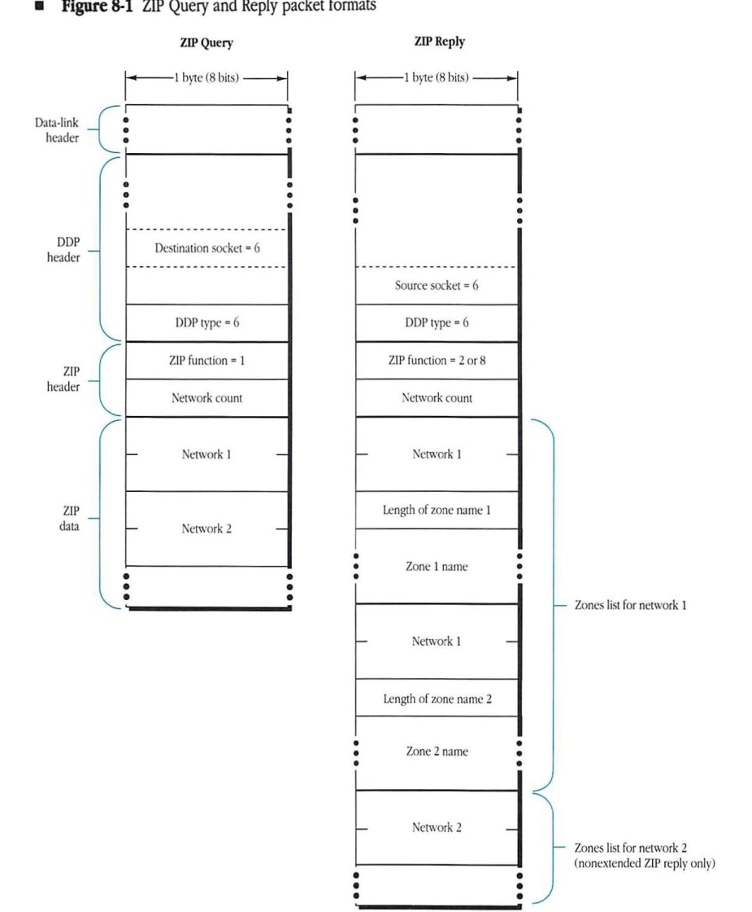

#### ZIP Query

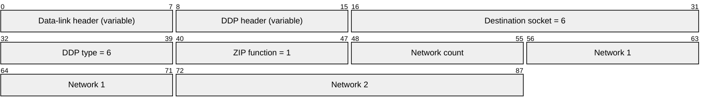

| Field | Bit offset | Width (bits) | Description |
|---|---|---|---|
| Data-link header | 0 | Variable | Standard data-link layer header. |
| DDP header | Variable | Variable | Datagram Delivery Protocol header. |
| Destination socket | Variable | 16 | The destination socket number, set to 6 for ZIP. |
| DDP type | Variable | 8 | DDP protocol type, set to 6 for ZIP. |
| ZIP function | Variable | 8 | ZIP function code, set to 1 for a Query. |
| Network count | Variable | 8 | Number of network entries in the query. |
| Network 1 | Variable | 16 | The first network number being queried. |
| Network 2 | Variable | 16 | The second network number being queried. |

#### ZIP Reply

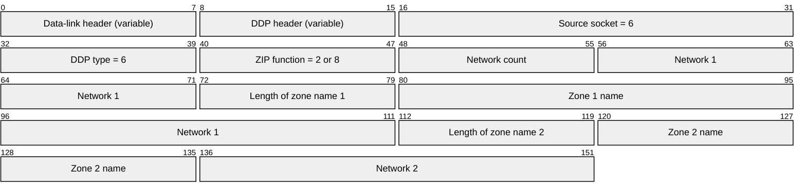

| Field | Bit offset | Width (bits) | Description |
|---|---|---|---|
| Data-link header | 0 | Variable | Standard data-link layer header. |
| DDP header | Variable | Variable | Datagram Delivery Protocol header. |
| Source socket | Variable | 16 | The source socket number, set to 6 for ZIP. |
| DDP type | Variable | 8 | DDP protocol type, set to 6 for ZIP. |
| ZIP function | Variable | 8 | ZIP function code, set to 2 or 8 for a Reply. |
| Network count | Variable | 8 | Number of network entries in the reply. |
| Network 1 | Variable | 16 | Part of the Zones list for network 1. |
| Length of zone name 1 | Variable | 8 | Length of the first zone name for network 1. |
| Zone 1 name | Variable | Variable | The name of the first zone. |
| Network 1 | Variable | 16 | Repeated network number for the next zone entry. |
| Length of zone name 2 | Variable | 8 | Length of the second zone name for network 1. |
| Zone 2 name | Variable | Variable | The name of the second zone. |
| Network 2 | Variable | 16 | Start of Zones list for network 2 (nonextended ZIP reply only). |

### ZIP ATP Requests

Figure 8-2 summarizes the format of the GetZoneList and GetLocalZones request and reply packets. The GetZoneList request contains a function code of 8, indicating GetZoneList, and the desired start index, both in the ATP user bytes field. The GetZoneListReply contains in the ATP user bytes field a LastFlag that is not 0 if the response contains the last zone name in the zone list. A field indicating the number of zones contained in the ATP data part is also in the user bytes field. The GetLocalZones request contains a function code of 9 and is otherwise similar to the GetZoneList request.


#### Figure 8-2 GetZoneList and GetLocalZones request and reply packets

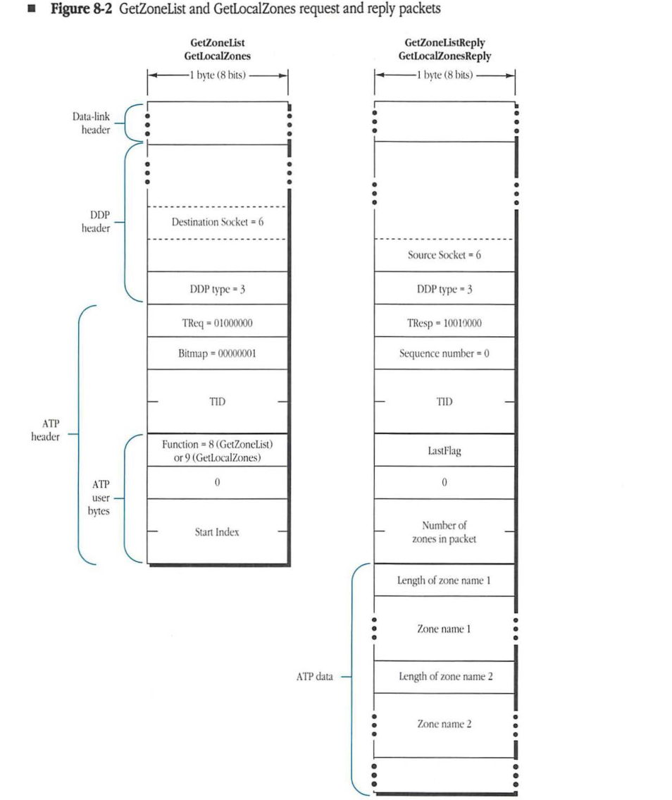

#### GetZoneList / GetLocalZones Request Packet

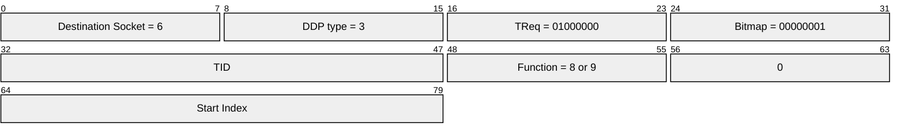

| Field | Bit offset | Width (bits) | Description |
|---|---|---|---|
| Destination Socket | 0 | 8 | DDP destination socket, ZIP uses socket 6 |
| DDP type | 8 | 8 | DDP protocol type, 3 for ATP |
| TReq | 16 | 8 | ATP transaction request control (01000000) |
| Bitmap | 24 | 8 | ATP bitmap (00000001) |
| TID | 32 | 16 | ATP Transaction ID |
| Function | 48 | 8 | ZIP function: 8 (GetZoneList) or 9 (GetLocalZones) |
| 0 | 56 | 8 | Reserved, set to 0 |
| Start Index | 64 | 16 | The index of the first zone name to be returned |

#### GetZoneListReply / GetLocalZonesReply Packet

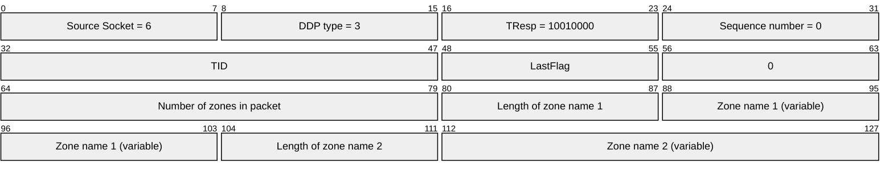

| Field | Bit offset | Width (bits) | Description |
|---|---|---|---|
| Source Socket | 0 | 8 | DDP source socket, ZIP uses socket 6 |
| DDP type | 8 | 8 | DDP protocol type, 3 for ATP |
| TResp | 16 | 8 | ATP transaction response control (10010000) |
| Sequence number | 24 | 8 | ATP sequence number (always 0 for this reply type) |
| TID | 32 | 16 | ATP Transaction ID |
| LastFlag | 48 | 8 | Indicates if this is the last packet of the transaction |
| 0 | 56 | 8 | Reserved, set to 0 |
| Number of zones in packet | 64 | 16 | Count of zone names included in this packet |
| Length of zone name 1 | 80 | 8 | Length in bytes of the following zone name string |
| Zone name 1 | 88 | Variable | The first zone name string |
| Length of zone name 2 | variable | 8 | Length in bytes of the second zone name string |
| Zone name 2 | variable | Variable | The second zone name string |


#### **Figure 8-4** GetNetInfo request and reply packets

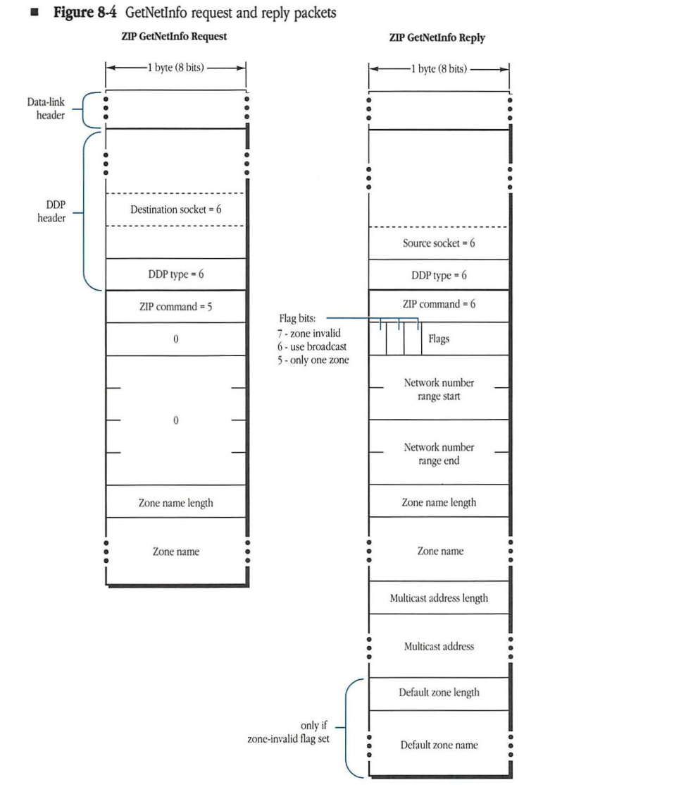

#### ZIP GetNetInfo Request

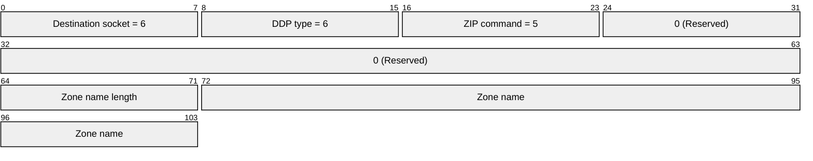

| Field | Bit offset | Width (bits) | Description |
|---|---|---|---|
| Destination socket | 0 | 8 | The destination socket for the request, set to 6. |
| DDP type | 8 | 8 | The DDP protocol type, set to 6 for ZIP. |
| ZIP command | 16 | 8 | The ZIP command code, set to 5 for a GetNetInfo request. |
| Reserved (0) | 24 | 8 | A reserved byte, set to 0. |
| Reserved (0) | 32 | 32 | Reserved bytes, set to 0. |
| Zone name length | 64 | 8 | The length of the zone name in bytes. |
| Zone name | 72 | Variable | The name of the zone. |

#### ZIP GetNetInfo Reply

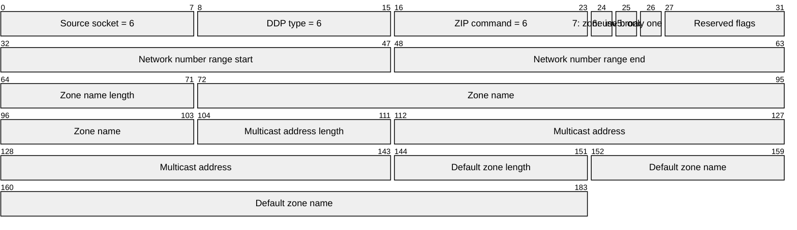

| Field | Bit offset | Width (bits) | Description |
|---|---|---|---|
| Source socket | 0 | 8 | The source socket for the reply, set to 6. |
| DDP type | 8 | 8 | The DDP protocol type, set to 6 for ZIP. |
| ZIP command | 16 | 8 | The ZIP command code, set to 6 for a GetNetInfo reply. |
| Flags | 24 | 8 | Flag bits for the reply (Bits 7, 6, and 5 are defined). |
| Network number range start | 32 | 16 | The beginning of the network number range. |
| Network number range end | 48 | 16 | The end of the network number range. |
| Zone name length | 64 | 8 | The length of the zone name in bytes. |
| Zone name | 72 | Variable | The name of the zone. |
| Multicast address length | 104 | 8 | The length of the multicast address in bytes. |
| Multicast address | 112 | Variable | The multicast address. |
| Default zone length | 144 | 8 | The length of the default zone name. Included only if the zone-invalid flag (bit 7) is set. |
| Default zone name | 152 | Variable | The name of the default zone. Included only if the zone-invalid flag is set. |

**Flag bits:**
* 7 - zone invalid
* 6 - use broadcast
* 5 - only one zone

### Zone multicast address computation

The zone multicast address associated with a given zone name, on a given data link, is computed by the ZIP process in routers. It is then returned to requesting nodes through a GetNetInfo reply packet. The zone multicast address is based on the bytes in the zone name and the specific data link on which the address is to be used.

To compute the zone multicast address, the ZIP process first converts the zone name to all uppercase characters (since zone names are case insensitive). The details of this conversion are documented in Appendix D. ZIP then converts this string into a number in the range 1-$FFFF by performing the DDP checksum algorithm on each byte of the zone name (not including the length byte). This algorithm, documented in Chapter 4, "Datagram Delivery Protocol," is repeated here:

```pascal
CkSum := 0 ;
FOR each byte in the zone name
REPEAT the following algorithm:
    CkSum := CkSum + byte; (unsigned addition)
    Rotate CkSum left one bit, rotating the most significant bit into the 
        least significant bit;
IF, at the end, CkSum = 0 THEN
    CkSum := $FFFF (all ones).
```

This hashed value, *h*, is then used as an index into an ordered list of zone multicast addresses associated with the underlying data link. If the data link provides *n* zone multicast addresses, a[0] through a[n-1], then the zone multicast address associated with index h is a[h mod n]. *mod* is the modulo function, in other words, the remainder when h is divided by n.

## NBP routing in IRs

As indicated in Chapter 7, "Name Binding Protocol," routers contain an NBP process that is responsible for the conversion of an NBP Broadcast Request (BrRq) to a zone-wide broadcast of NBP Lookup (LkUp) requests.

The process consists of two stages. In the first stage, the router converts the BrRq packet into a series of FwdReq packets, one for each network which has been set up to include the specified zone. These FwdReq's are sent to the first router directly connected to each of these networks. The second stage of the process consists of the router receiving the FwdReq converting it to a LkUp and sending that LkUp to the correct zone multicast address.


### Generating FwdReq packets

The process of converting a BrRq into a series of FwdReqs is straightforward. The router obtains from its ZIT a list of all networks that include the specified zone. The router then uses DDP to send a FwdReq to the NIS of the first router directly connected to each of these networks. To do this, the router sends a FwdReq to node ID 0 of each network. Specifically, each FwdReq is sent to AppleTalk network number nnnn, node ID 0, where nnnn is the start of the range associated with each network.

The DDP data part of a FwdReq packet is the same as that from the NBP Broadcast Request, except that the NBP function field must be equal to FwdReq. If, however, the BrRq originated on a nonextended network, the destination target zone name could be equal to asterisk (*). In this case, the router must substitute the zone name associated with that nonextended network before sending out the FwdReqs. (The router receiving the FwdReq would have no way of knowing this information.) If the router does not know the zone name yet, it should broadcast a LkUp packet on the requesting network, but not send out any FwdReqs.

If the router receiving the BrRq is directly connected to one or more networks that include the specified zone name, these networks will be included in the list obtained from the ZIT. In this case, the router should send out LkUp packets on these directly connected networks as specified in the next section.

### Converting FwdReqs to LkUps

A BrRq packet is converted into a series of FwdReq packets, one for each network containing the zone specified in the BrRq packet. The destination of each of these FwdReq packets is the first router directly connected to the destination network. Along the way, routers that are not directly connected to the destination network will forward the packet towards the destination network in the usual manner. When a FwdReq packet is received by the router directly connected to the target network, that router is responsible for converting that packet to a LkUp request and broadcasting it on the appropriate zone multicast address. The DDP data part of a LkUp packet is exactly the same as that from the NBP FwdReq, except that the NBP function field must be equal to LkUp.

If the destination network of the LkUp packet is a nonextended network, the router simply changes the destination node ID to $FF and broadcasts the packet on that network (since a nonextended network has only one zone). If the destination network is extended, however, the router must also change the destination network number to $0000, so that the packet is received by all nodes on the network (within the correct zone multicast address). The router must compute the zone multicast address for the packet, based on the zone name in the packet and the data link on which the packet is to be sent. The router then calls DDP to broadcast the packet to the indicated multicast address. DDP in routers must provide the ability to send a packet directly to a data-link level multicast address.

* Note: NBP is defined so that the router's NBP process does not participate in the NBP response process; the response is sent directly to the original requester through DDP. It is important that the original requester's field be obtained from the address field of the NBP tuple.

## Zones list assignment

The structure of a router's port descriptor is defined in Chapter 5, "Routing Table Maintenance Protocol." ZIP requires an additional zones list field in port descriptors. Zones lists are included in the port descriptors of router ports and are then propagated dynamically through ZIP to all internet routers. Zones lists in port descriptors include an indicator as to which zone name is the default zone.

Only router ports connected to AppleTalk networks need to be associated with zones lists. For each AppleTalk network, at least one router on that network must be configured with the network's zones list; all other routers could have a zones list of NIL in their port descriptor for that network. If, for a given network, more than one router is configured with a non-NIL zone list, these lists must be the same (including the same default zone). In addition, only seed routers used for the purpose of specifying the network number range should contain zones lists that are not NIL. (In other words, if a router is not a seed router for routing information, it should not be a seed router for zone information.) Seed routers should confirm that their zone information does not conflict with that from another router on the same network, for instance through ZIP queries or GetLocalZones requests.

A router having a NIL zone list discovers the names in that list by broadcasting a ZIP query on the network of interest, as described previously. To determine which zone name in the list is the default zone, the router broadcasts a ZIP GetNetInfo request with a NIL zone name on that network (this packet can be sent directly to a router on that network if the address of one is known).

◆ Note: The default zone name for a given network is of interest only to routers (and nodes) on that network. Unlike the network's zone list, this information is not propagated to other routers on the internet.

## Zones list changing

Under stable conditions, each network's zones list appears in the ZIT of every internet router. Changing a particular network's zones list requires changing that list in every internet router. Indeed, although routers on the stable internet are no longer sending ZIP Queries, each router must still be notified of the change in the zones list. One possible method of notifying all routers of the zones list change would be to send an internet-wide broadcast of the change request. Internet-wide broadcasting, however, is not supported by DDP and is both complicated and expensive in terms of network traffic.

### Changing zones lists in routers

ZIP does not specify a way for changing the zones list of a network while that network is active as a part of the internet. It is envisioned that future network management protocols, to be defined by Apple, will provide this functionality. A network management system needs to be aware of all the routers on the internet, and with this knowledge it can implement an all-routers broadcast that notifies all routers on the internet as to the change in a zones list.

Until such network management protocols are defined, the zones list associated with a network can only be changed by temporarily isolating that network from the internet. All the routers directly connected to the network should be brought down and the zones list changed in each of the seed routers. All the routers can then be brought back up. The routers, however, can not be brought back up until the old zones list from that network has disappeared from all the ZITs in the internet. It takes a certain amount of time for the network number range and zone name information about a network to age out of all routers in the internet once that network is no longer connected. Although this parameter is a function of the internet topology, ZIP defines it as a constant known as the **ZIP bringback time**. The exact value of the ZIP bringback time is defined in "Timer Values" later in this chapter.


### Changing zone names in nodes

Nodes on an extended network will need to be told if their zone name has been changed. This is so they can register on a new zone multicast address, and so they can perform correct NBP filtering. ZIP specifies a packet, referred to as a ZIP Notify, which accomplishes this function. The format of a ZIP Notify packet is essentially the same as a ZIP GetNetInfo Reply, except the function byte is 7 to indicate Notify (see *Figure 8-5*). The packet specifies the old and new zone names, and the new zone multicast address. It is sent as part of a zones list change operation to the ZIS of nodes on the affected network. It should be sent to the old zone multicast address. Nodes on extended networks should maintain a *ZIP stub* on the ZIS for purposes of receiving ZIP Notifies. Upon receipt of a ZIP Notify (for the zone in which the node resides), the node should register on the new zone multicast address and change its zone name to that specified in the packet. This zone name should also be changed in long term storage.

* ***Note:*** It is not currently a requirement that nodes implement processing of ZIP Notifies. ZIP Notify processing will be required once the network management protocols for changing zones lists are specified.


#### **Figure 8-5** ZIP Notify packet

ZIP Notify

Flag bits:
* 7 - zone invalid
* 6 - use broadcast
* 5 - only one zone

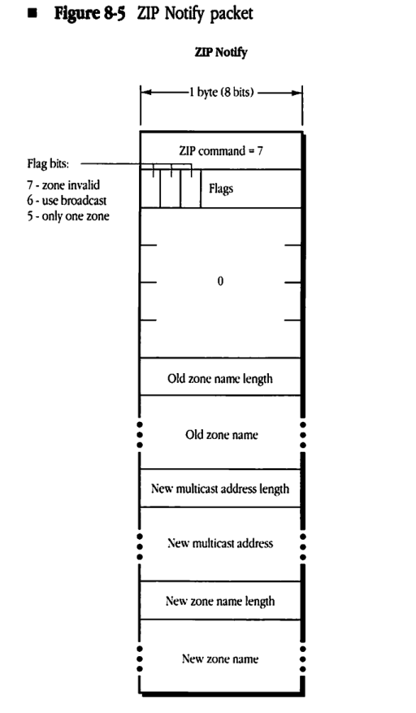

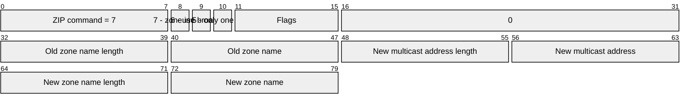

| Field | Bit offset | Width (bits) | Description |
| :--- | :--- | :--- | :--- |
| ZIP command | 0 | 8 | The ZIP command code, fixed at 7 for Notify packets. |
| zone invalid | 8 | 1 | Flag bit 7. Indicates if the zone is no longer valid. |
| use broadcast | 9 | 1 | Flag bit 6. Indicates that a broadcast should be used. |
| only one zone | 10 | 1 | Flag bit 5. Indicates if there is only one zone involved. |
| Flags (4-0) | 11 | 5 | Reserved flag bits. |
| Reserved | 16 | 16 | Fixed value of 0. |
| Old zone name length | 32 | 8 | Length in bytes of the following Old zone name. |
| Old zone name | 40 | Variable | String containing the old zone name. |
| New multicast address length | Variable | 8 | Length in bytes of the following New multicast address. |
| New multicast address | Variable | Variable | The new multicast address. |
| New zone name length | Variable | 8 | Length in bytes of the following New zone name. |
| New zone name | Variable | Variable | String containing the new zone name. |

## Timer values

Two parameter values associated with ZIP must be specified. The first is the value for the ZIP Query retransmission time. This value is equal to the send-RTMP timer, or 10 seconds. The second is the ZIP bringback time. The ZIP bringback time is defined as the minimum time required between bringing a network down and bringing it back up with a new zones list. Since it is desired that this value be a constant, independent of internet topology, the worst-case internet must be used in determining it. Since a network's zone name rarely changes, this value has been conservatively defined as 10 minutes.
