# Chapter 12 AppleTalk Data Stream Protocol

## ADSP services

ADSP provides the client with a simple, powerful interface to an AppleTalk network. Using ADSP, the client can open a connection with a remote end, send data to and receive data from the remote end, and close the connection.

The client can either send a continuous stream of data or logically break the data into messages that can be understood by the remote end client. ADSP also provides an attention message mechanism that the client can use for its own internal control. A forward-reset mechanism allows the client to abort the delivery of an outstanding stream of bytes to the remote client.

## Connections

This section defines connections, connection ends, and connection identifiers (ConnIDs) and explains the roles that they play in ADSP.

A connection is an association between two sockets that allows reliable, full-duplex flow of data bytes between the sockets. With ADSP, the data bytes are delivered in the same order as they were inserted into the connection. In addition, ADSP includes a flow-control mechanism that regulates data transmission based on the availability of reception buffers at the destination.

At any time, a connection can be set up by either or both of the communicating parties. The connection is torn down when it is no longer required or if either connection end becomes unreachable. In order for the protocol to function correctly, a certain amount of control and state information must be maintained at each end of a connection. Opening a connection involves setting up this information at each end and bringing the two ends of the connection to a synchronized condition. The information at each end is referred to as the state of that connection end; the term **connection state** refers collectively to the information at both ends. **Connection end** is a general term that covers both the communicating socket and the connection information associated with it.

### Connection states

A connection between two sockets can be either open or closed. When an association is set up between two sockets, the connection is considered an **open connection**; when the association is torn down, the connection is considered a **closed connection**. A connection end can be in one of two states: established or closed. For a connection to be open, both its ends must be established. If one end of a connection is established but the other is closed (or unreachable), the connection is said to be half-open. Data can flow only on an open connection.

ADSP specifies that only one connection at a time can be open between a pair of sockets. However, several connections can be open on the same socket, but the other ends of these various connections must be on different sockets.

A connection end can be closed at any time by the connection end's client. The connection end should inform the remote end that it is going to close. At this time, the connection could become temporarily half-open until the remote end also closes. Once both ends have closed, the connection is closed. See "Connection Opening" and "Connection Closing" later in this chapter for details on the mechanisms used to open and close connections.

### Half-open connections and the connection timer

A connection is half-open when one end goes down or becomes unreachable from the other end. In a half-open connection, the end that is still established could needlessly consume network bandwidth. Even in the absence of network traffic, resources (such as timers and buffers) would be tied up at the established end. Therefore, it is important that ADSP detect half-open connections. After detecting a half-open connection, ADSP closes the established end and informs its client that the connection has been closed.

To detect half-open connections, each end maintains a **connection timer** that is started when the connection opens. Whenever an end receives a packet from the remote end, the timer is reset. The timer expires if the end does not receive any packets within 30 seconds. When the timer expires, the end sends a probe and restarts the connection timer. A **probe** is a request for the remote end to acknowledge; the probe itself serves as an acknowledgment to the remote end. Failure to receive any packet from the other end before the timer has expired for the fourth time (that is, after 2 minutes) indicates that the connection is half-open. At that time, ADSP immediately closes the connection end, freeing all associated resources.

### Connection identifiers

A connection end is identified by its internet socket address, which consists of a socket number, a node ID, and a network number. In addition, when a connection is set up, each connection end generates a ConnID. A connection can be uniquely identified by using both the internet socket address and the ConnID of the two connection ends.

A sender must include its ConnID in all packets, so that it is clear to which connection the packet belongs. For example, if a connection were set up, closed, and then set up again between the same two sockets, it is possible that undelivered packets from the first connection that remained in internet routers could arrive after the second connection was open. Without the ConnID, the receiving end could mistakenly accept these packets because they would be indistinguishable from packets belonging to the second connection.

An ADSP implementation maintains a variable, LastConnID, that contains the last ConnID used. LastConnID is initially set to some random number. When establishing a new connection end on a particular socket, ADSP generates a new identifier by increasing LastConnID until it reaches a value that is not being used by a currently open connection on the socket. This value becomes the ConnID of the new connection end. ConnIDs are treated as unsigned integers in the range of 1 through ConnIDMax. After reaching the value ConnIDMax, ConnIDs wrap around to 1. A valid ConnID is never equal to 0; in fact, a ConnID of 0 must be interpreted as unknown.

The value of ConnIDMax, and therefore the range of the ConnIDs, is a function of the rate at which connections are expected to be set up and broken down (that is, how quickly the ConnID number wraps around) and of the maximum packet lifetime (MPL) for the internet. If connections are set up and broken down rapidly, then a higher value of ConnIDMax is required. Likewise, the longer the MPL, the higher the value required for ConnIDMax. ADSP uses 16-bit ConnIDs (that is, ConnIDMax equals $FFFF).

## Data flow

Either end of an open connection accepts data from its client for delivery to the other end's client. This data is handled as a stream of bytes; the smallest unit of data that can be conveyed over a connection is 1 byte (8 bits). The flow of data between connection ends A and B can be viewed as two unidirectional streams of bytes—one stream from end A to end B and the other stream from end B to end A. Although the following discussion focuses on the data stream from end A to end B, it can be applied equally well to the stream from end B to end A by interchanging A and B in the discussion.

### Sequence numbers

ADSP associates a sequence number with each byte that flows over the connection. End B maintains a variable, RecvSeq, which is the sequence number of the next byte that end B expects to receive from end A. End A maintains a corresponding variable, SendSeq, which is the sequence number of the next new byte that end A will send to end B.

End B initially sets the value of its RecvSeq to 0. Upon first establishing itself, end A synchronizes its SendSeq to the initial value of end B's RecvSeq, which is 0. The first byte that is sent by end A over the connection is treated as byte number 0, with subsequent bytes numbered 1, 2, 3, and so on. Sequence numbers are treated as unsigned 32-bit integers that wrap around to 0 when increased by 1 beyond the maximum value $FFFFFFFF.

Since AppleTalk is a packet network, bytes are actually sent over the connection in packets. Each packet carries a field known as PktFirstByteSeq in its ADSP header. PktFirstByteSeq is the sequence number of the first data byte in the packet. Upon receiving a packet from end A, end B compares the value of PktFirstByteSeq in the packet with its own RecvSeq. If these values are equal, end B accepts and delivers the data to its client. End B then updates the value of RecvSeq by adding the number of data bytes in the packet just received to its current value of RecvSeq. Using this process, end B ensures that data bytes are received in the same order as end A accepted them from its client and that no duplicates are received.

When end B receives a packet with a PktFirstByteSeq value that does not equal end B's RecvSeq, end B discards the data as out of sequence. Acceptance of data in only those packets with PktFirstByteSeq values equal to the receiver's RecvSeq values is referred to as in-order data acceptance.

Some ADSP implementations accept and buffer data from early-arriving, out-of-sequence packets, processing the data for client delivery when the intervening data arrives. Such an implementation may also accept packets that contain both duplicate and new data bytes; in this case, the receiving end discards duplicate data and accepts the new data. This approach, which is referred to as in-window data acceptance, can reduce data retransmission and improve throughput. However, because in-window data acceptance adds complexity to implementation, it is an option, rather than a requirement, of ADSP.

### Error recovery and acknowledgments

The sequence-number mechanism provides the framework for acknowledging the receipt of data, recovering data packets when they are lost in the network, and filtering duplicate and out-of-sequence packets.

End A maintains a send queue that holds all data sent by it to end B. A variable, FirstRtmtSeq, contains the sequence number of the oldest byte in the send queue.

End B acknowledges receipt of data from end A by sending a sequence number, PktNextRecvSeq, in the ADSP header of any packet going from end B to end A over the connection. This number is equal to end B's RecvSeq at the time that end B sent the packet. When end A receives this packet, the value of PktNextRecvSeq informs end A that end B has already received all data sent by end A up to, but not including, the byte numbered PktNextRecvSeq. End A uses this information to remove all bytes up to, but not including, number PktNextRecvSeq from its send queue. End A must then change its FirstRtmtSeq value to equal the value of PktNextRecvSeq.

Note that the value of PktNextRecvSeq must fall between FirstRtmtSeq and SendSeq (that is, FirstRtmtSeq ≤ PktNextRecvSeq ≤ SendSeq). If the value does not fall in that range, end A should not update FirstRtmtSeq. In addition, even if an incoming packet's data is rejected as out of sequence, the value of PktNextRecvSeq, if in the correct range, is still acceptable and should be used by end A to update FirstRtmtSeq (since end B has received all bytes up to that point).

At times, end A may determine that some data within the stream that it already sent may not have been delivered to end B. In such a case, end A retransmits all data bytes in the send queue whose delivery has not been acknowledged by end B; these data bytes have sequence numbers from FirstRtmtSeq through SendSeq–1.

One of the advantages of using byte-oriented sequence numbers is that they offer flexibility for data retransmission. Previously sent data can be regrouped and retransmitted more efficiently. For example, if end A has sent several small data packets to end B over some period of time, and end A determines that it must retransmit all the data bytes in its send queue, it is possible that all of the data bytes in the previous small packets could fit within one ADSP packet for retransmission. It is also possible for end A to append some new data to the bytes being retransmitted in the packet.

### Flow control and windows

ADSP implements a flow-control mechanism to ensure that one end does not send data that the other end does not have enough buffer space to receive (known as choking data flow at its source). In order for this mechanism to work, end B must periodically inform end A of the amount of receive buffer space it has available. This process is referred to as informing end A of end B's **reception window size.**

End B maintains a variable, RecvWdw, which is the number of bytes end B currently has space to receive. When sending a packet to end A, end B always includes the current value of its RecvWdw in a field of its ADSP header known as PktRecvWdw. End A maintains a variable, SendWdwSeq, which represents the sequence number of the last byte for which end B currently has space. End A obtains this value from any packet that it receives from end B by adding the value of PktRecvWdw–1 to the value of PktNextRecvSeq. End A does not send bytes numbered beyond SendWdwSeq because end B does not have enough buffer space to receive them. However, if end B receives a packet whose data would exceed the available buffer space, end B discards the data.

Since ADSP does not support the ability for a client to revoke buffer space, the value of SendWdwSeq should never decrease. If a connection end receives a packet that would cause SendWdwSeq to decrease, this value is not updated.

Note that RecvWdw is a 16-bit field; the window size at either end is limited to 64 Kbytes ($FFFF).

### ADSP messages

ADSP allows its clients to break the data stream into client-intelligible messages. A bit can be set in the ADSP packet header to indicate that the last data byte in the packet constitutes the end of a client message. The receiving end must inform its client after delivering the last byte of a message.

An ADSP packet can have its end-of-message (EOM) bit set and must not contain client data. This situation would indicate that the last data byte received in the previous packet was the last in a message. In order to handle this case properly, the EOM indicator is treated as if it were a byte appended to the end of the message in the data stream. Therefore, an EOM always consumes one sequence number in the data stream, just beyond the last byte of the client message. Since no data byte actually corresponds to this EOM sequence number, it is possible that an EOM packet may contain no data.

### Forward resets

The forward-reset mechanism allows an ADSP client to abort the delivery of any outstanding data to the remote end’s client. A forward reset causes all bytes in the sending end’s send queue, all bytes in transit on the network, and all bytes in the remote end’s receive queue that have not yet been delivered to the client to be discarded, and it then causes the two ends to be resynchronized.

When a client requests a forward reset, its ADSP connection end first removes any unsent bytes from its send queue and then resets the value of its FirstRtmtSeq to that of its SendSeq. This process effectively flushes all data that has been sent but not yet acknowledged by the remote end. The client's connection end then sends the remote connection end a Forward Reset Control packet with PktFirstByteSeq equal to SendSeq.

Upon receiving a Forward Reset Control packet, ADSP verifies that the value of PktFirstByteSeq falls within the range from RecvSeq to RecvSeq+RecvWdw, inclusive. If the value does not fall within this range, the forward reset is disregarded. If the forward reset is accepted, RecvSeq is synchronized to the value of PktFirstByteSeq, all data in the receive queue up to RecvSeq is removed, and the client is informed that a forward reset was received and processed. The receiver then sends back a Forward Reset Acknowledgment Control packet with PktNextRecvSeq set to the newly synchronized value of RecvSeq. The Forward Reset Acknowledgment Control packet is sent even if the Forward Reset Control packet was disregarded as out of range.

When sending a Forward Reset Control packet, the connection end starts a timer. The timer is removed upon receipt of a valid Forward Reset Acknowledgment Control packet. To be valid, a Forward Reset Acknowledgment Control packet's PktNextRecvSeq must fall within the range SendSeq ≤ PktNextRecvSeq ≤ SendWdwSeq+1. If the timer expires, the end retransmits the Forward Reset Control packet and restarts the timer. This action continues until either a valid Forward Reset Acknowledgment Control packet is received or until the connection is torn down.

The forward-reset mechanism is nondeterministic from the client's perspective because any or all of the outstanding data could have already been delivered to the remote client. However, the forward-reset mechanism does provide a means for resetting the connection.

### Summary of sequencing variables

To summarize, the ADSP header of all ADSP packets includes the following three sequencing variables:

| Variable | Description |
| :--- | :--- |
| PktFirstByteSeq | the sequence number of the packet's first data byte |
| PktNextRecvSeq | the sequence number of the next byte that the packet's sender expects to receive |
| PktRecvWdw | the number of bytes that the packet's sender currently has buffer space to receive |

Each connection end must maintain the following variables as part of its connection-state descriptor:

*   **SendSeq**: the sequence number to be assigned to the next new byte that the local end will transmit over the connection
*   **FirstRtmtSeq**: the sequence number of the oldest byte in the local end's send queue (Initially, the queue is empty so this number equals SendSeq.)
*   **SendWdwSeq**: the sequence number of the last byte that the remote end has buffer space to receive
*   **RecvSeq**: the sequence number of the next byte that the local end expects to receive
*   **RecvWdw**: the number of bytes that the local end currently has buffer space to receive (Initially, the entire buffer is available.)

Figure 12-1 illustrates how these variables would relate to a connection end's send and receive queues and sequence-number space.

#### ■ Figure 12-1 Send and receive queues

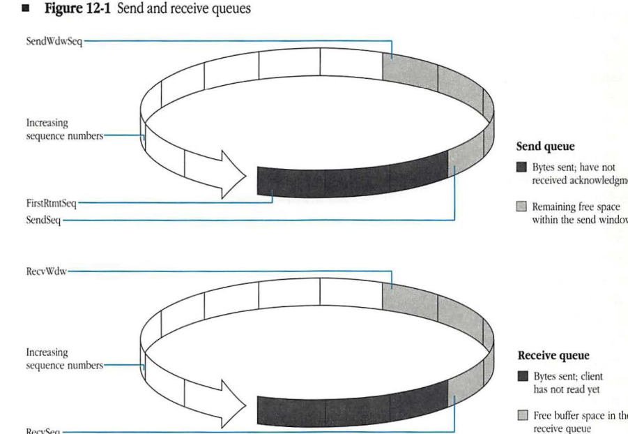

## Packet format

Figure 12-2 illustrates an ADSP packet. The packet consists of the data-link and Datagram Delivery Protocol (DDP) headers, followed by a 13-byte ADSP header and up to 572 bytes of ADSP data. To identify an ADSP packet, the DDP type field must equal 7.

The ADSP header contains the following sequence of fields:

* a 16-bit source ConnID
* a 32-bit PktFirstByteSeq
* a 32-bit PktNextRecvSeq
* a 16-bit PktRecvWdw
* an 8-bit ADSP descriptor

If the Control bit in the descriptor field is set, the packet is an ADSP Control packet. Control packets are sent for internal ADSP purposes, and they do not carry any ADSP data bytes. Control packets do not consume sequence numbers.

In sending either a Data packet or a Control packet, the ADSP client can set the Ack Request bit in the descriptor field to indicate that it wants the remote end's ADSP to send back an ADSP packet immediately, with PktNextRecvSeq and PktRecvWdw equal to the current values of its RecvSeq and RecvWdw. Upon receiving a packet whose Ack Request bit is set, an ADSP connection end must respond to the acknowledgment request, even if the packet is to be discarded as out of sequence; the Ack Request bit forces the receiving end's ADSP to send an immediate acknowledgment.

Setting the Attention bit in the ADSP descriptor field designates the packet as an ADSP Attention packet. Attention packets are used to send and acknowledge attention messages. Any Attention packet that contains a client-attention message will have its Control bit clear and its Ack Request bit set. Setting the Ack Request bit forces the receiver to immediately send an acknowledgment of the attention data. An Attention packet with its Control bit set is an attention-control packet for internal ADSP purposes. Attention-control packets are used to acknowledge attention messages and should not have the Ack Request bit set. The Control code in the ADSP descriptor field of an ADSP Attention packet must always be set to 0. An Attention packet received with a Control code number other than 0 should be discarded as invalid. Attention packets are described in detail in "Attention Messages" later in this chapter.

Setting the EOM bit in the ADSP descriptor field indicates a logical end of message in the data stream. This bit applies only to client Data packets, and so neither the Control bit nor the Attention bit can be set in a packet whose EOM bit is set.

#### Figure 12-2 ADSP packet format

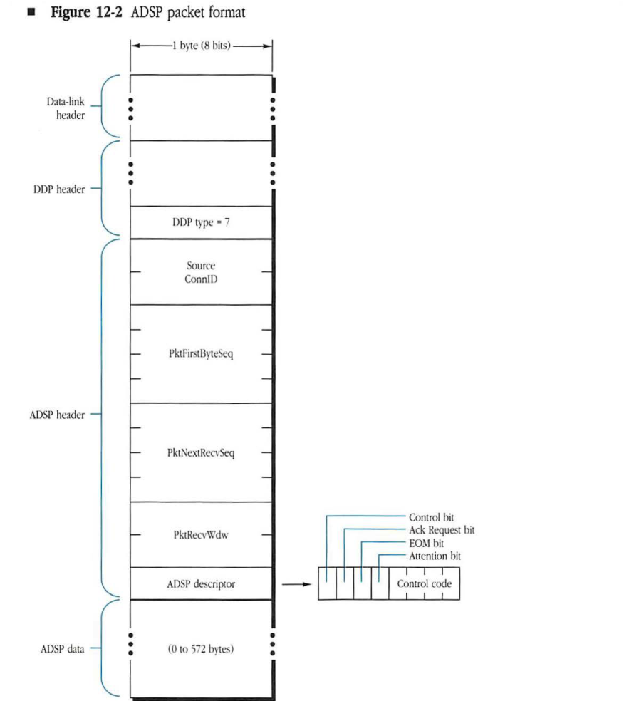

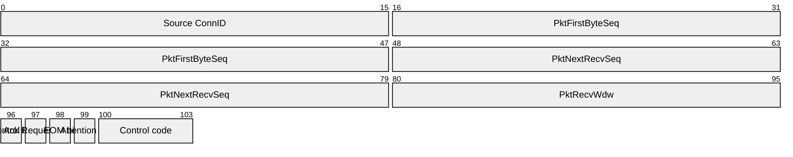
```mermaid
packet-beta
0-15: "Source ConnID"
16-47: "PktFirstByteSeq"
48-79: "PktNextRecvSeq"
80-95: "PktRecvWdw"
96: "Control bit"
97: "Ack Request bit"
98: "EOM bit"
99: "Attention bit"
100-103: "Control code"
```

| Field | Bit offset | Width (bits) | Description |
|---|---|---|---|
| Source ConnID | 0 | 16 | The connection identifier of the source end of the connection. |
| PktFirstByteSeq | 16 | 32 | The sequence number of the first byte of data in the packet. |
| PktNextRecvSeq | 48 | 32 | The sequence number of the next byte of data expected by the sender of the packet. |
| PktRecvWdw | 80 | 16 | The number of bytes of data the sender is prepared to receive. |
| ADSP descriptor | 96 | 8 | A byte containing control flags and a control code. |
| -- Control bit | 96 | 1 | If set, the packet is a control packet. |
| -- Ack Request bit | 97 | 1 | If set, the sender is requesting an acknowledgment. |
| -- EOM bit | 98 | 1 | End-of-message bit; if set, indicates the last packet of a message. |
| -- Attention bit | 99 | 1 | If set, the packet contains an attention message. |
| -- Control code | 100 | 4 | A code specifying the type of control message. |

Data-link header (variable length)
DDP header (variable length, includes DDP type = 7)
ADSP header (13 bytes)
ADSP data (0 to 572 bytes)

## Control packets

ADSP packets are of two broad classes: Data packets and Control packets. Control packets can be distinguished from Data packets by examining the Control bit in the packet’s ADSP Descriptor field; when set, this bit identifies a Control packet. Such packets are sent for ADSP’s internal operation and do not contain any client-deliverable data.

Control packets are used to open or to close connections, to act as probes, and to send acknowledgment information. The least-significant 4 bits of a Control packet’s descriptor field contain a Control code that identifies the type of the ADSP Control packet. The following list shows the Control codes and their corresponding types:

| Value | ADSP Control code |
| :--- | :--- |
| 0 | Probe or Acknowledgment |
| 1 | Open Connection Request |
| 2 | Open Connection Acknowledgment |
| 3 | Open Connection Request and Acknowledgment |
| 4 | Open Connection Denial |
| 5 | Close Connection Advice |
| 6 | Forward Reset |
| 7 | Forward Reset Acknowledgment |
| 8 | Retransmit Advice |

Apple Computer reserves values $9 through $F for potential future use, so these values must be treated as invalid. Control packets with these invalid Control codes are rejected by the receiving end.

A Control code of 0 can have two different meanings, depending on the state of the Ack Request bit. If the Ack Request bit is set, the packet is a Probe packet, so the receiving end should send an acknowledgment immediately. If the Ack Request bit is not set, then the control packet is an Acknowledgment packet. (Note that an acknowledgment is implicit in any valid ADSP packet; also, the Ack Request bit can be set in either a Data packet or a Control packet. Therefore, a Control packet with a Control code of 0 is used only when the sending end has no client data to accompany the acknowledgment or acknowledgment request.)

Open-connection Control codes are sent as part of the open-connection dialog. This dialog is explained in detail in “Connection Opening” later in this chapter. Before being closed by ADSP, a connection end sends a Close Connection Advice Control packet. This packet is purely advisory and requires no reply. Upon receiving such a packet, ADSP closes the connection. For additional details, see “Connection Closing” later in this chapter.

The Forward Reset Control packet provides a mechanism for a client to abort the delivery of all outstanding data that it has sent to the remote client. Upon receiving this packet, the remote end synchronizes its RecvSeq to the value of PktFirstByteSeq in the packet and removes all undelivered bytes from its receive queue. The remote end then returns a Forward Reset Acknowledgment Control packet to the other end and informs its client that it has received and processed a forward reset request.

A connection end may send the Retransmit Advice Control packet in response to receiving several consecutive out-of-sequence Data packets from the remote end. The packet is sent to inform the remote end that it should retransmit the bytes in its send queue beginning with the byte whose sequence number is PktNextRecvSeq.

## Data-flow examples

The following figures give examples of data flow on an ADSP connection. In these examples, end A sends Data and Control packets to end B, and end B receives data and sends acknowledgments to end A. However, the examples apply equally well for the opposite situation in which end B sends the Data and Control packets to end A, and end A receives the data and sends acknowledgments to end B.

In the figures, the packets are indicated by arrows that run diagonally between the two connection ends. The bracketed ranges (for example, [0:5]) indicate the range of sequence numbers assigned to data bytes transmitted in the packet. The first number in the range corresponds to PktFirstByteSeq. *Ctl* indicates Control packets. A vertical line above or below the time arrows indicates an event, either the transmission or reception of a packet. The values of variables before an event occurs are shown on the left side of the vertical line; values after the event are shown on the right side. The packet variables of all packets sent by connection end B are listed along end B's time axis.

Figure 12-3 illustrates how the ADSP variables relate to the flow of data. In this example, end A sends an acknowledgment request when it exhausts its known send window. Acknowledgments are implicit in all packets sent from end B, regardless of whether they are Data packets or Control packets.

#### Figure 12-3 ADSP data flow

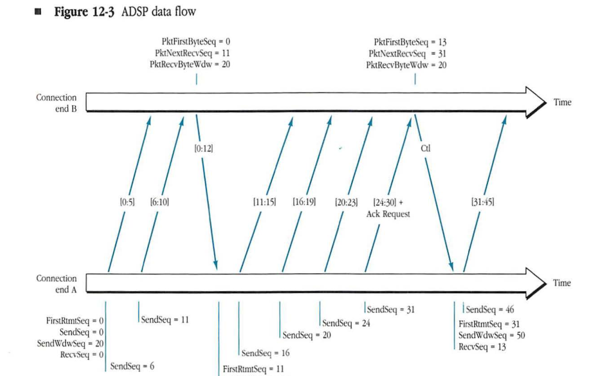

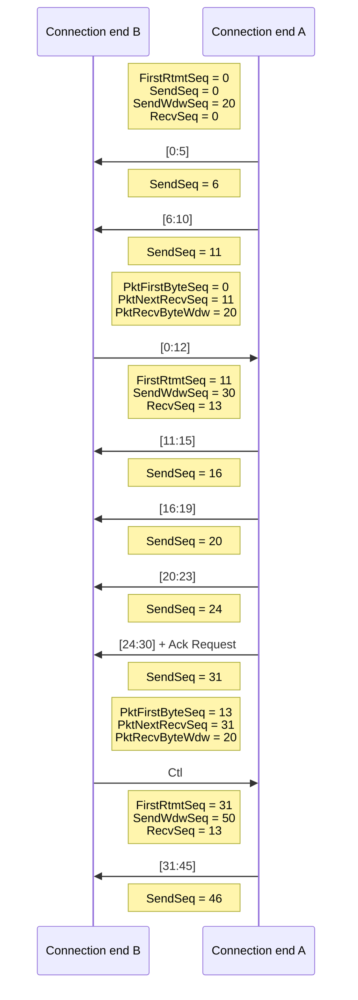
```mermaid
sequenceDiagram
    participant B as Connection end B
    participant A as Connection end A

    Note left of A: FirstRtmtSeq = 0<br/>SendSeq = 0<br/>SendWdwSeq = 20<br/>RecvSeq = 0
    A->>B: [0:5]
    Note left of A: SendSeq = 6
    A->>B: [6:10]
    Note left of A: SendSeq = 11

    Note right of B: PktFirstByteSeq = 0<br/>PktNextRecvSeq = 11<br/>PktRecvByteWdw = 20
    B->>A: [0:12]

    Note left of A: FirstRtmtSeq = 11<br/>SendWdwSeq = 30<br/>RecvSeq = 13
    
    A->>B: [11:15]
    Note left of A: SendSeq = 16
    A->>B: [16:19]
    Note left of A: SendSeq = 20
    A->>B: [20:23]
    Note left of A: SendSeq = 24
    A->>B: [24:30] + Ack Request
    Note left of A: SendSeq = 31

    Note right of B: PktFirstByteSeq = 13<br/>PktNextRecvSeq = 31<br/>PktRecvByteWdw = 20
    B->>A: Ctl

    Note left of A: FirstRtmtSeq = 31<br/>SendWdwSeq = 50<br/>RecvSeq = 13
    A->>B: [31:45]
    Note left of A: SendSeq = 46
```

Figure 12-4 shows an example of recovery from a lost packet. In this example, the first packet sent by end A is lost. The receiver discards subsequent packets because they are out of sequence. Some event (a retransmit timer goes off or perhaps the send window is exhausted) causes end A to send an acknowledgment request. End B acknowledges, and end A retransmits all of the lost data.

#### Figure 12-4 Recovery from a lost packet

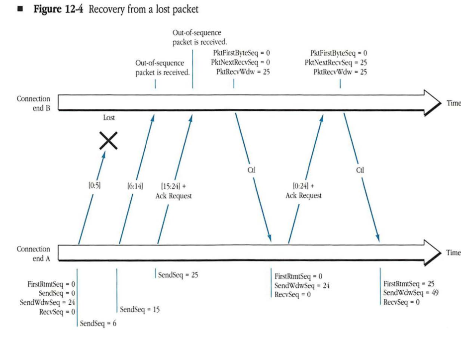

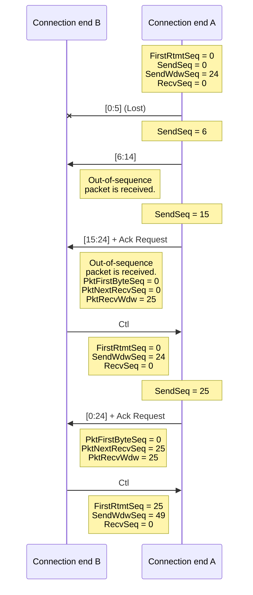
```mermaid
sequenceDiagram
    participant B as Connection end B
    participant A as Connection end A

    Note over A: FirstRtmtSeq = 0<br/>SendSeq = 0<br/>SendWdwSeq = 24<br/>RecvSeq = 0

    A-x B: [0:5] (Lost)

    Note over A: SendSeq = 6
    A->>B: [6:14]
    Note right of B: Out-of-sequence<br/>packet is received.

    Note over A: SendSeq = 15
    A->>B: [15:24] + Ack Request
    Note right of B: Out-of-sequence<br/>packet is received.<br/>PktFirstByteSeq = 0<br/>PktNextRecvSeq = 0<br/>PktRecvWdw = 25

    B->>A: Ctl
    Note left of A: FirstRtmtSeq = 0<br/>SendWdwSeq = 24<br/>RecvSeq = 0

    Note over A: SendSeq = 25
    A->>B: [0:24] + Ack Request
    Note right of B: PktFirstByteSeq = 0<br/>PktNextRecvSeq = 25<br/>PktRecvWdw = 25

    B->>A: Ctl
    Note left of A: FirstRtmtSeq = 25<br/>SendWdwSeq = 49<br/>RecvSeq = 0
```

Figure 12-5 gives an example of an idle connection state. Neither client is sending data, so both connection ends periodically send a probe to determine whether the connection is still open.

In Figure 12-6, packets from end B are lost, so ADSP eventually tears down the connection.

#### Figure 12-5 Idle connection state

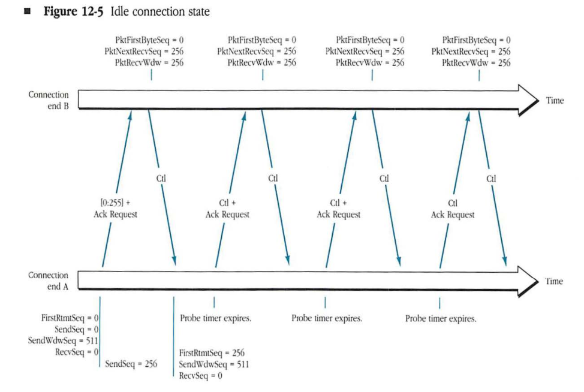

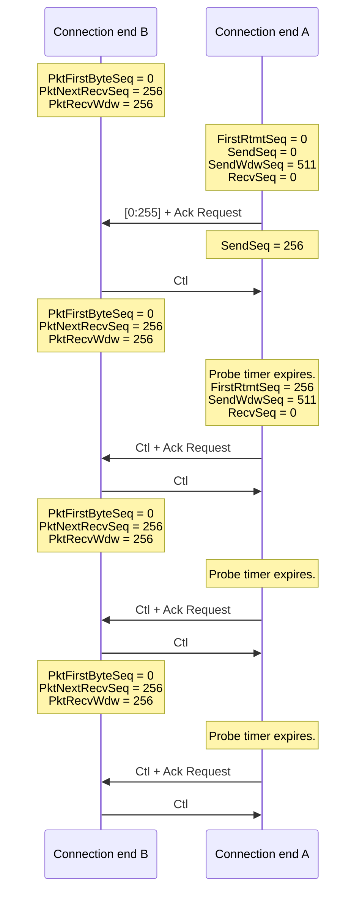
```mermaid
sequenceDiagram
    participant B as Connection end B
    participant A as Connection end A

    Note over B: PktFirstByteSeq = 0<br/>PktNextRecvSeq = 256<br/>PktRecvWdw = 256
    Note over A: FirstRtmtSeq = 0<br/>SendSeq = 0<br/>SendWdwSeq = 511<br/>RecvSeq = 0

    A->>B: [0:255] + Ack Request
    Note over A: SendSeq = 256
    B->>A: Ctl

    Note over B: PktFirstByteSeq = 0<br/>PktNextRecvSeq = 256<br/>PktRecvWdw = 256
    Note over A: Probe timer expires.<br/>FirstRtmtSeq = 256<br/>SendWdwSeq = 511<br/>RecvSeq = 0

    A->>B: Ctl + Ack Request
    B->>A: Ctl

    Note over B: PktFirstByteSeq = 0<br/>PktNextRecvSeq = 256<br/>PktRecvWdw = 256
    Note over A: Probe timer expires.

    A->>B: Ctl + Ack Request
    B->>A: Ctl

    Note over B: PktFirstByteSeq = 0<br/>PktNextRecvSeq = 256<br/>PktRecvWdw = 256
    Note over A: Probe timer expires.

    A->>B: Ctl + Ack Request
    B->>A: Ctl
```

#### **Figure 12-6** Connection torn down due to lost packets

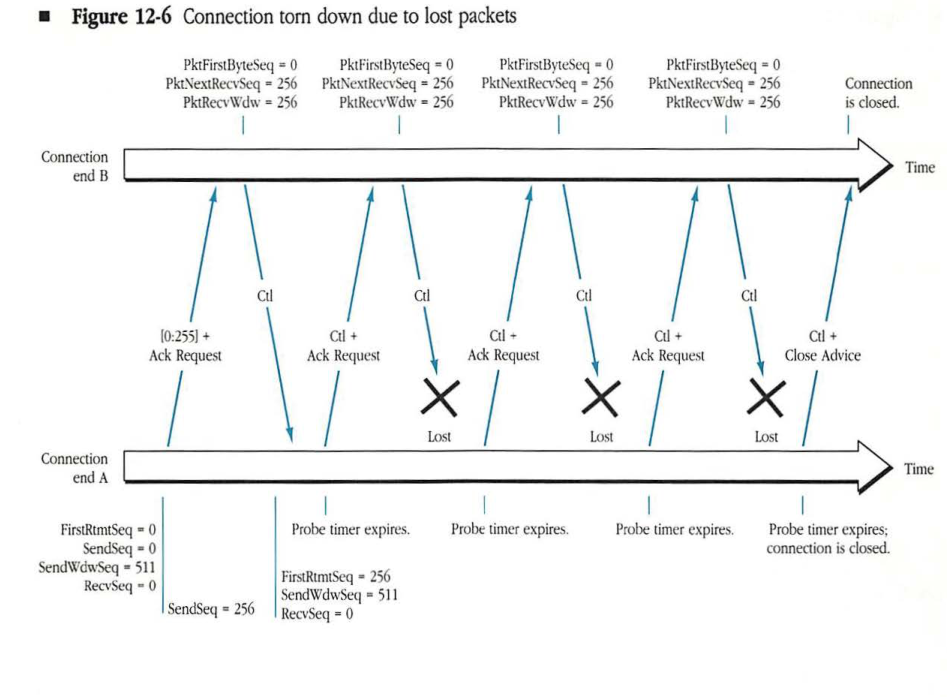

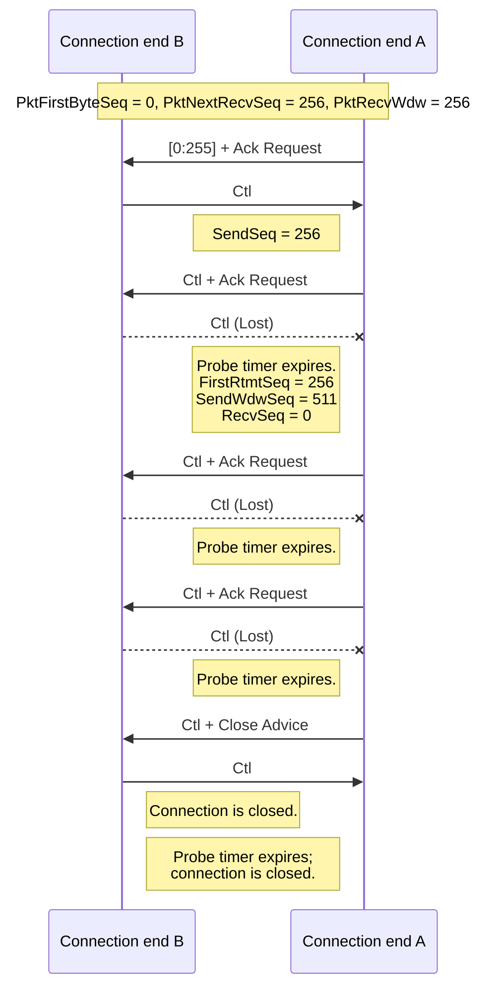
```mermaid
sequenceDiagram
    participant B as Connection end B
    participant A as Connection end A
    Note over A, B: PktFirstByteSeq = 0, PktNextRecvSeq = 256, PktRecvWdw = 256
    A->>B: [0:255] + Ack Request
    B->>A: Ctl
    Note left of A: SendSeq = 256
    A->>B: Ctl + Ack Request
    B--x A: Ctl (Lost)
    Note left of A: Probe timer expires.<br/>FirstRtmtSeq = 256<br/>SendWdwSeq = 511<br/>RecvSeq = 0
    A->>B: Ctl + Ack Request
    B--x A: Ctl (Lost)
    Note left of A: Probe timer expires.
    A->>B: Ctl + Ack Request
    B--x A: Ctl (Lost)
    Note left of A: Probe timer expires.
    A->>B: Ctl + Close Advice
    B->>A: Ctl
    Note right of B: Connection is closed.
    Note left of A: Probe timer expires#59;<br/>connection is closed.
```

## Attention messages

Attention messages provide a method for the clients of the two connection ends to signal each other outside the normal flow of data across the connection. ADSP attention messages are delivered reliably, in order, and free of duplicates.

ADSP Attention packets are used for delivering and acknowledging attention messages. Figure 12-7 shows an ADSP Attention packet. The Attention bit is set in the packet's ADSP descriptor field to designate an Attention packet. The data part of an Attention packet contains a 2-byte (16-bit) attention code and from 0 to 570 bytes of client attention data.

The 16-bit attention-code field accommodates a range of values from $0000 through $FFFF. Values in the range $0000 through $EFFF are for the client's use. Values in the range $F000 through $FFFF are reserved for potential future expansion of ADSP.

#### Figure 12-7 ADSP Attention packet format

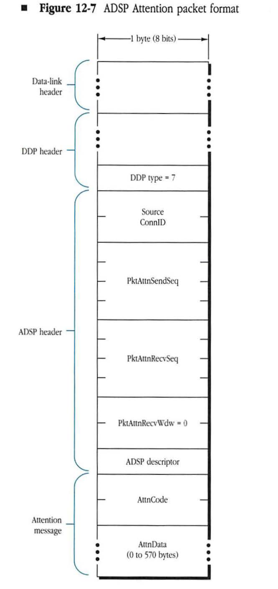

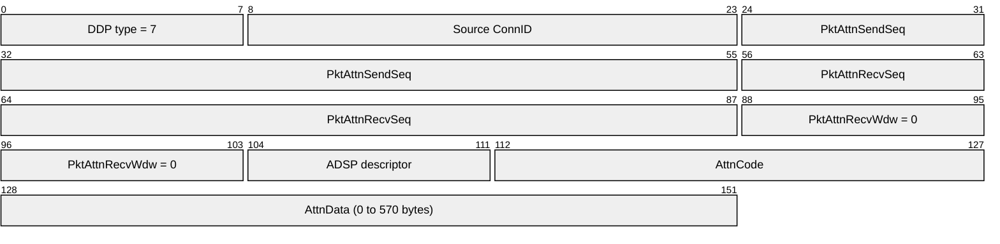
```mermaid
packet-beta
0-7: "DDP type = 7"
8-23: "Source ConnID"
24-55: "PktAttnSendSeq"
56-87: "PktAttnRecvSeq"
88-103: "PktAttnRecvWdw = 0"
104-111: "ADSP descriptor"
112-127: "AttnCode"
128-151: "AttnData (0 to 570 bytes)"
```

| Field | Bit offset | Width (bits) | Description |
|---|---|---|---|
| Data-link header | - | Variable | Link-layer header |
| DDP header | - | Variable | Datagram Delivery Protocol header |
| DDP type | 0 | 8 | Protocol type field in DDP header, set to 7 for ADSP |
| Source ConnID | 8 | 16 | ADSP source connection identifier |
| PktAttnSendSeq | 24 | 32 | ADSP attention send sequence number |
| PktAttnRecvSeq | 56 | 32 | ADSP attention receive sequence number |
| PktAttnRecvWdw | 88 | 16 | ADSP attention receive window, set to 0 |
| ADSP descriptor | 104 | 8 | ADSP control flags (descriptor byte) |
| AttnCode | 112 | 16 | Attention code for the message |
| AttnData | 128 | 0-4560 | Attention message data (0 to 570 bytes) |

Attention messages use a packet-oriented sequence-number space that is independent of data-stream sequence numbers. The first Attention packet is assigned a sequence number of 0, the second packet is assigned 1, the third packet 2, and so on. Attention sequence numbers are treated as 32-bit unsigned integers that wrap around to 0 when increased by 1 beyond the maximum value $FFFFFFFF.

End B maintains a variable, AttnRecvSeq, which contains the sequence number of the next attention message that end B expects to receive from end A. AttnRecvSeq is initially set to 0 and is increased by 1 with each attention message that end B accepts from end A.

End A maintains a corresponding variable, AttnSendSeq, which contains the sequence number of the next attention message it will send across the connection. When end A is first established, AttnSendSeq is synchronized to the value of end B's AttnRecvSeq.

In any Attention packet sent from end A to end B, the PktAttnSendSeq field of the ADSP packet header contains the current value of end A's AttnSendSeq. In any Attention packet sent from end B to end A, the PktAttnRecvSeq field contains the current value of end B's AttnRecvSeq. Upon receiving an Attention packet, end A uses the value of PktAttnRecvSeq to update its own AttnSendSeq. Before updating AttnSendSeq, end A must ensure that the value of PktAttnRecvSeq equals AttnSendSeq+1. If these values are equal, end A increases AttnSendSeq to equal PktAttnRecvSeq.

Attention data is received into buffer space other than the receive queue in an implementation-dependent manner. End A can send an attention message even if end B's receive window in the regular data stream is closed. However, only one attention message can be outstanding at a time. Once end A sends an attention message to end B, end A cannot send another attention message until it receives an acknowledgment from end B. End B accepts and acknowledges receipt of an attention message if the attention message is properly sequenced and if buffer space is available. If buffer space is not available, end B discards the attention message. Because only one attention message can be sent at a time, the PktAttnRecvWdw field of ADSP attention-packet headers is not used and must always be set to 0.

When sending an attention message, the end starts a timer. If the timer expires, the end retransmits the attention message and restarts the timer. The sending end continues to retransmit the attention message until it receives the appropriate attention-message acknowledgment or until the connection is torn down.

When end A sends an attention message to end B, end A's PktAttnSendSeq field is set to the value of end A's AttnSendSeq. When end B receives the Attention packet, it compares the value of PktAttnSendSeq with its own AttnRecvSeq. If the values are not equal, end B discards the attention message. If the values are equal and buffer space is available, end B accepts the data and increases AttnRecvSeq by 1. Then end B sends end A an attention acknowledgment with the PktAttnRecvSeq field set to the current value of end B's AttnRecvSeq.

An acknowledgment is implicit in any Attention packet sent; that is, acknowledgments are piggybacked on attention messages. The attention acknowledgment itself may be an attention message that end B's client has just asked end B to send, or the acknowledgment may be an ADSP Control packet whose sole purpose is to acknowledge the attention message.

## Connection opening

This section describes how connections are opened and explains some of the facilities that ADSP provides for opening connections.

A connection is open when both ends of the connection are established. A connection end is established when it knows the values of all of the following parameters:

| Parameter | Description |
| :--- | :--- |
| LocAddr | the internet address of the local end's socket |
| RemAddr | the internet address of the remote end's socket |
| LocConnID | the local end's ConnID |
| RemConnID | the remote end's ConnID |
| SendSeq | the sequence number to be assigned to the next byte that the local end's ADSP will send over the connection to the remote end |
| FirstRtmtSeq | the sequence number of the oldest byte in the local end's send queue (Initially, the queue is empty so this number equals SendSeq.) |
| SendWdwSeq | the sequence number of the last byte that the remote end has buffer space to receive from the local end |
| RecvSeq | the sequence number of the next byte that the local end expects to receive from the remote end (Initially, this number is set to 0.) |
| RecvWdw | the number of bytes that the local end currently has buffer space to receive from the remote end (Initially, the local end's entire receive buffer is available.) |
| AttnSendSeq | the sequence number to be assigned to the next Attention packet that the local end will transmit over the connection |
| AttnRecvSeq | the sequence number of the next Attention packet that the local end expects to receive from the remote end (Initially, this number is set to 0.) |

When attempting to become established, the local end knows the values of LocAddr, LocConnID, RecvSeq, RecvWdw, and AttnRecvSeq. (When a connection is first opened, the values of RecvSeq and AttnRecvSeq will be 0.) The local end must somehow discover the values of RemAddr, RemConnID, SendSeq, SendWdwSeq, and AttnSendSeq. The objective of the connection-opening dialog is for each end to discover these values.

◆ Note: A connection can be opened in a variety of ways. ADSP provides one mechanism, but a client can use its own separate, parallel mechanism to discover and provide the required information to ADSP in order to establish either or both connection ends.

In order to open a connection, ADSP provides a type of Control packet known as an Open Connection Request Control packet. Since the Control packet is an ADSP packet, its header contains the sending end's network address and ConnID. In addition, the packet includes the sending end's RecvSeq (PktNextRecvSeq in the packet header) and RecvWdw (PktRecvWdw in the packet header). The end obtains the value of AttnRecvSeq from one of a set of fields in the packet, collectively known as the open-connection parameters.

The end initiating the connection-opening dialog sends an Open Connection Request Control packet to the intended remote end. This packet provides the remote end with the connection parameters it needs to become established. Upon receiving such a packet, the remote end sets its connection parameters as follows:

| Parameter | Description |
|---|---|
| RemAddr | equal to the packet's source network address |
| RemConnID | equal to the packet's source ConnID |
| SendSeq | equal to PktNextRecvSeq |
| SendWdwSeq | equal to PktNextRecvSeq+PktRecvWdw–1 |
| AttnSendSeq | equal to PktAttnRecvSeq |

Once the remote end has set these parameters (based on the information in the Open Connection Request Control packet), the end is considered to be established.

In order for a connection to become open, both ends of the connection must be established. Therefore, in the connection-opening dialog, each end must send an Open Connection Request Control packet to the other end (as well as receive an Open Connection Request Control packet from the other end).

Since these packets can be lost during transmission, ADSP provides a mechanism for ensuring that the packets are delivered. When a connection end receives an Open Connection Request Control packet, the receiving end returns an Open Connection Acknowledgment Control packet to the sending end. Upon receiving an Open Connection Acknowledgment Control packet, the receiving end is assured that the other end has become established.

After the two connection ends have exchanged both open-connection requests and acknowledgments, the connection is open and data can safely be sent on it.

### Connection-opening dialog

The connection-opening mechanism provided by ADSP requires that a connection end must know the internet socket address of the destination socket to which the end is making a connection request. The client must provide this address to ADSP for the purpose of initiating the connection-opening dialog. How this address is determined is up to the client; generally, the AppleTalk Name Binding Protocol (NBP) is used.

The ADSP connection-opening mechanism is a symmetric operation. Either of two peer clients can initiate the connection-opening dialog. In fact, both peers can attempt to open the connection at the same time; however, only one connection between the two peers should be opened. The following discussion focuses on how end A opens a connection with end B.

When attempting to open a connection with a remote end B, end A first chooses a locally unique ConnID. End A then sends an Open Connection Request Control packet to end B's socket address. This request contains end A's initial connection-state information (its LocConnID, RecvSeq, RecvWdw, and AttnRecvSeq). End B needs this information in order to become established.

Upon receiving the Open Connection Request Control packet, end B extracts the sender's internet socket address and source ConnID and saves them in its RemAddr and RemConnID fields, respectively. The value of the PktNextRecvSeq field is saved as end B's SendSeq. End B then adds the value of PktRecvWdw-1 to PktNextRecvSeq to produce its SendWdwSeq. Finally, the value of PktAttnRecvSeq is saved as end B's AttnSendSeq. Connection end B is now established.

At this point, end A is not established and does not know the state of connection end B. End B responds to end A's Open Connection Request Control packet by sending back an Open Connection Request and Acknowledgment Control packet. End A determines the values of its RemAddr, RemConnID, SendSeq, and SendWdwSeq from the open-connection request, as previously described; then, end A becomes established. The open-connection acknowledgment informs end A that end B has accepted end A's Open Connection Request Control packet and has become established. End A assumes the connection is now open.

End A informs end B of its state by sending an Open Connection Acknowledgment control packet. Upon receiving the acknowledgment, end B assumes the connection is open (see Figure 12-8).

Both ends can attempt to open the connection simultaneously. In this case, each ADSP socket receives an Open Connection Request Control packet from the socket to which it has sent an Open Connection Request Control packet. The ADSP implementation identifies end A by matching its RemAddr to the source address of the Open Connection Request Control packet received from end B. End A extracts the required information from the packet and becomes established. End A then sends back an Open Connection Acknowledgment Control packet to inform the remote end that it has become established. This ensures that ADSP establishes only one connection between the two sockets (see Figure 12-9).

#### **Figure 12-8** Connection-opening dialog initiated by one end

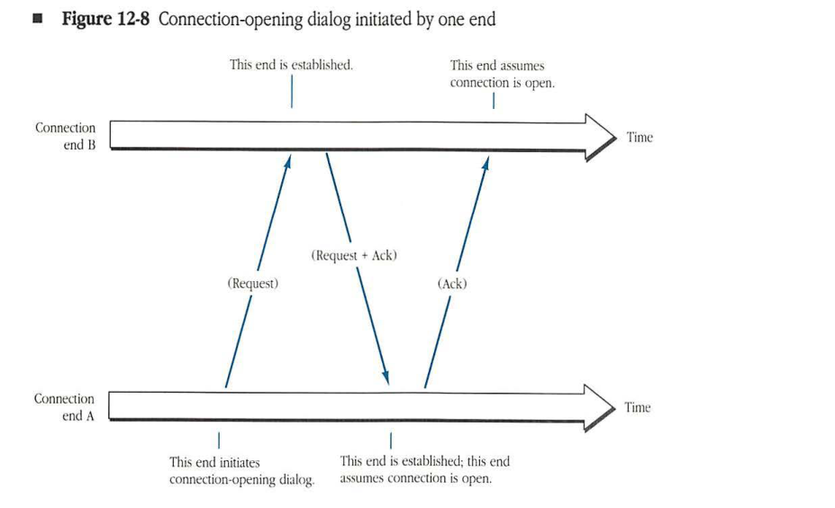

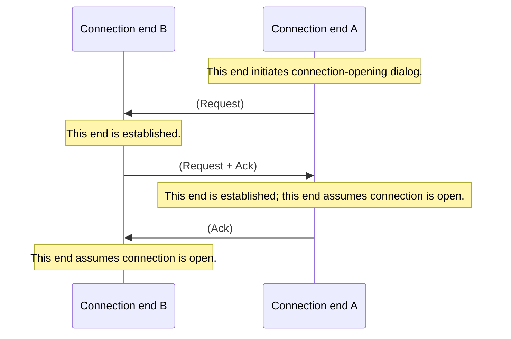
```mermaid
sequenceDiagram
    participant B as Connection end B
    participant A as Connection end A

    Note over A: This end initiates connection-opening dialog.
    A->>B: (Request)
    Note over B: This end is established.
    B->>A: (Request + Ack)
    Note over A: This end is established#59; this end assumes connection is open.
    A->>B: (Ack)
    Note over B: This end assumes connection is open.
```

#### Figure 12-9 Connection-opening dialog initiated by both ends

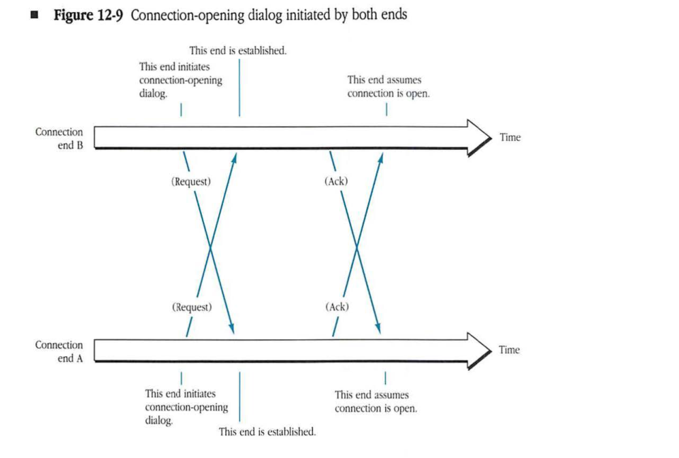

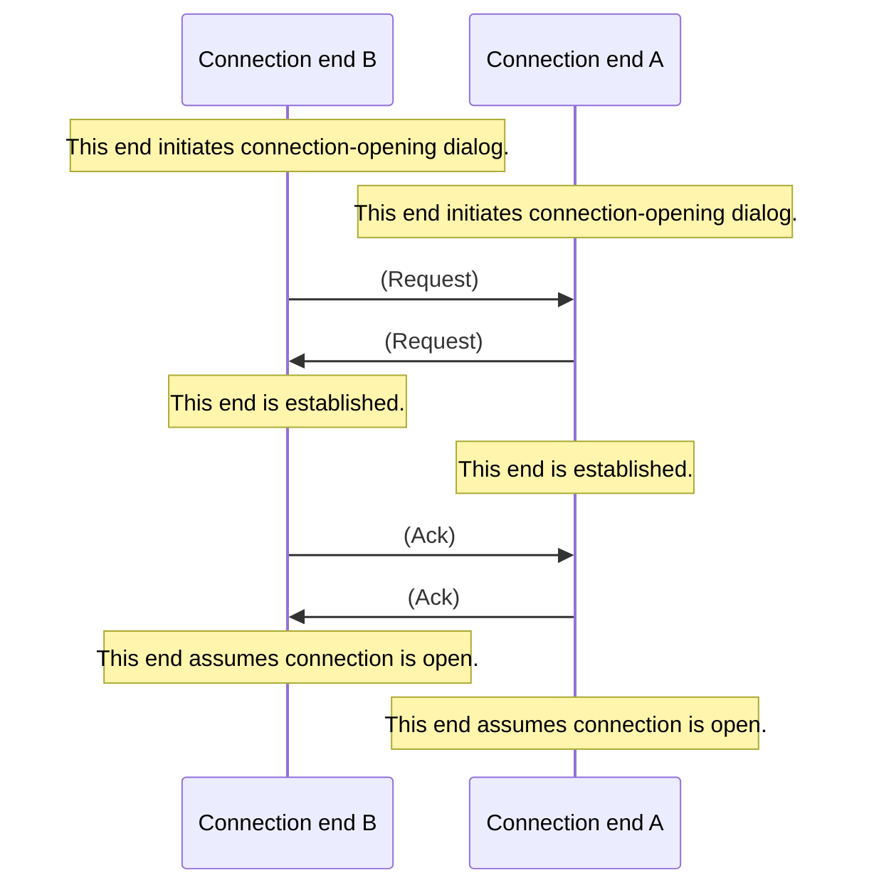
```mermaid
sequenceDiagram
    participant B as Connection end B
    participant A as Connection end A
    Note over B: This end initiates connection-opening dialog.
    Note over A: This end initiates connection-opening dialog.
    B->>A: (Request)
    A->>B: (Request)
    Note over B: This end is established.
    Note over A: This end is established.
    B->>A: (Ack)
    A->>B: (Ack)
    Note over B: This end assumes connection is open.
    Note over A: This end assumes connection is open.
```

If for any reason an ADSP implementation is unable to fulfill the open-connection request, an open-connection denial is sent back to the requester. In this case, the source ConnID field of the ADSP packet header is 0, while the destination ConnID field of the connection-opening parameters is set to the requester's ConnID (see Figure 12-10).

#### Figure 12-10 Open-connection request denied

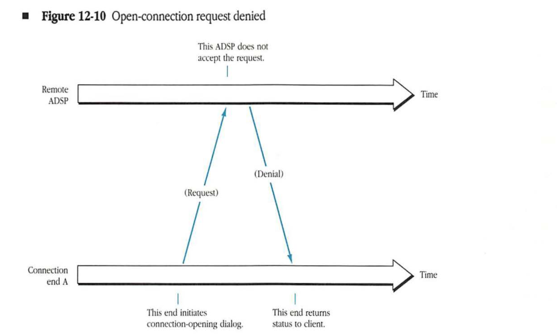

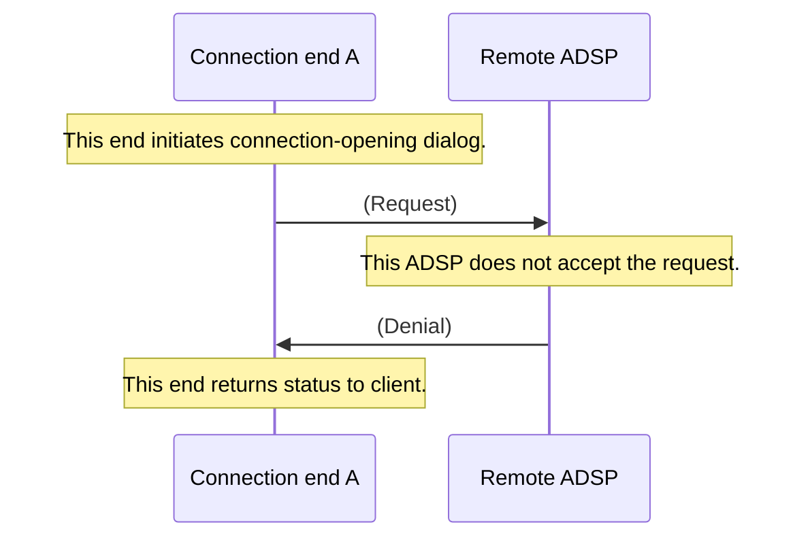
```mermaid
sequenceDiagram
    participant A as Connection end A
    participant R as Remote ADSP
    Note over A: This end initiates connection-opening dialog.
    A->>R: (Request)
    Note over R: This ADSP does not accept the request.
    R->>A: (Denial)
    Note over A: This end returns status to client.
```

### Open-connection Control packet format

An open-connection request is sent as an ADSP Control packet. As such, the request contains all the information required to establish the receiving end. ADSP is a client of the network layer, DDP, which contains the internet address of the sender. (Note that the packet must be sent through the socket on which the connection is to be established.) The ADSP header contains the source ConnID, RecvSeq, and RecvWdw, which are used to determine the receiving end's RemConnID, SendSeq, and SendWdwSeq, respectively. The AttnRecvSeq field of the open-connection parameters following the header is used to set the value of the receiving end's AttnSendSeq.

An ADSP Open Connection Acknowledgment, which is also a Control packet, serves to acknowledge the receipt of an Open Connection Request Control packet. An end can send both an Open Connection Request Control packet and an Open Connection Acknowledgment Control packet at the same time by combining them into one ADSP Control packet. ADSP also provides an Open Connection Denial Control packet for use when a connection request cannot be honored. In the Open Connection Denial Control packet, the source ConnID should be set to 0 in the packet header.

Figure 12-11 shows the format of ADSP packets that are used in the connection-opening dialog. Note the special open-connection parameters that follow the ADSP packet header. These parameters are described in detail after the figure.

The first field of the open-connection parameters is the 16-bit ADSP version field. In any open-connection packet, the ADSP version should be set to the protocol version of the ADSP implementation that sent the packet. An ADSP implementation must deny any open-connection request that has an incompatible ADSP version. This chapter documents ADSP version $0100; all other values are reserved by Apple for potential future expansion of the protocol.

The 16-bit destination ConnID field of the open-connection parameters is used uniquely to associate an open-connection acknowledgment or denial with the appropriate open-connection request. The destination ConnID field of any Open Connection Acknowledgment Control packet or Open Connection Denial Control packet should be set to the source ConnID of the corresponding open-connection request. When an end sending an Open Connection Request Control packet does not know the ConnID of the remote end, the destination ConnID field in the packet must be set to 0.

The 32-bit PktAttnRecvSeq field of the open-connection parameters contains the sequence number of the first Attention packet that the sending end is willing to accept. This value is equal to the sending end's AttnRecvSeq variable.

The following table summarizes the packet-descriptor values and ConnIDs that should be used with each of the open-connection control messages.

| Control packet | ADSP packet descriptor | Source ConnID | Destination ConnID |
|---|---|---|---|
| Open Connection Request | $81 | LocConnID | 0 |
| Open Connection Ack | $82 | LocConnID | RemConnID |
| Open Connection Request+Ack | $83 | LocConnID | RemConnID |
| Open Connection Denial | $84 | 0 | RemConnID |

#### Figure 12-11 Open-connection packet format

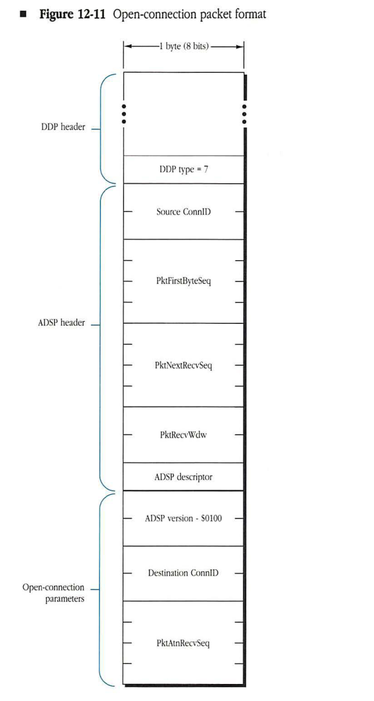

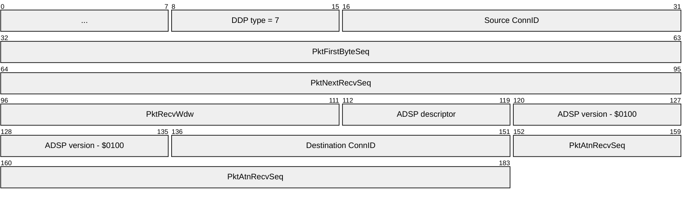
```mermaid
packet-beta
0-7: "..."
8-15: "DDP type = 7"
16-31: "Source ConnID"
32-63: "PktFirstByteSeq"
64-95: "PktNextRecvSeq"
96-111: "PktRecvWdw"
112-119: "ADSP descriptor"
120-135: "ADSP version - $0100"
136-151: "Destination ConnID"
152-183: "PktAtnRecvSeq"
```

| Field | Bit offset | Width (bits) | Description |
| :--- | :--- | :--- | :--- |
| DDP header (partial) | 0 | 8 | Indicated by ellipses in diagram; represents the start of the DDP header |
| DDP type | 8 | 8 | Set to 7 for ADSP |
| Source ConnID | 16 | 16 | Source connection identifier |
| PktFirstByteSeq | 32 | 32 | Sequence number of the first byte of data in this packet |
| PktNextRecvSeq | 64 | 32 | Sequence number of the next byte expected to be received by the sender of this packet |
| PktRecvWdw | 96 | 16 | Size of the receiver's window |
| ADSP descriptor | 112 | 8 | Control flags for the ADSP packet |
| ADSP version | 120 | 16 | Version of ADSP being used, set to $0100 |
| Destination ConnID | 136 | 16 | Destination connection identifier |
| PktAtnRecvSeq | 152 | 32 | Sequence number of the next attention byte expected to be received |

### Error recovery in the connection-opening dialog

Since delivery of packets sent by the network layer is not guaranteed, connection-opening packets can be lost or delayed. Therefore, ADSP open-connection requests should be retransmitted at intervals specified by the client (for a maximum number of retries also specified by the client). An end receiving an open-connection request must ensure that it is not a duplicate by comparing the request's source ConnID and address with that of all open or opening connections for the receiving socket. If the request is a duplicate, the appropriate acknowledgment is still sent back. See Figure 12-12 and Figure 12-13, where *X* indicates lost or delayed packets.

#### **Figure 12-12** Connection-opening dialog: packet lost

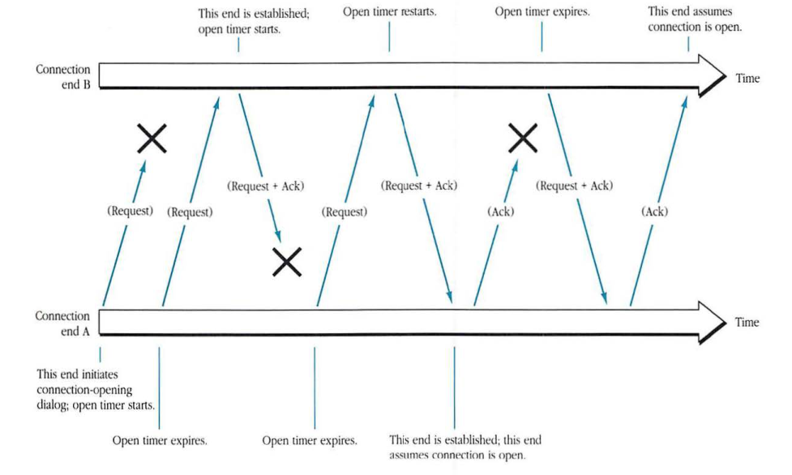

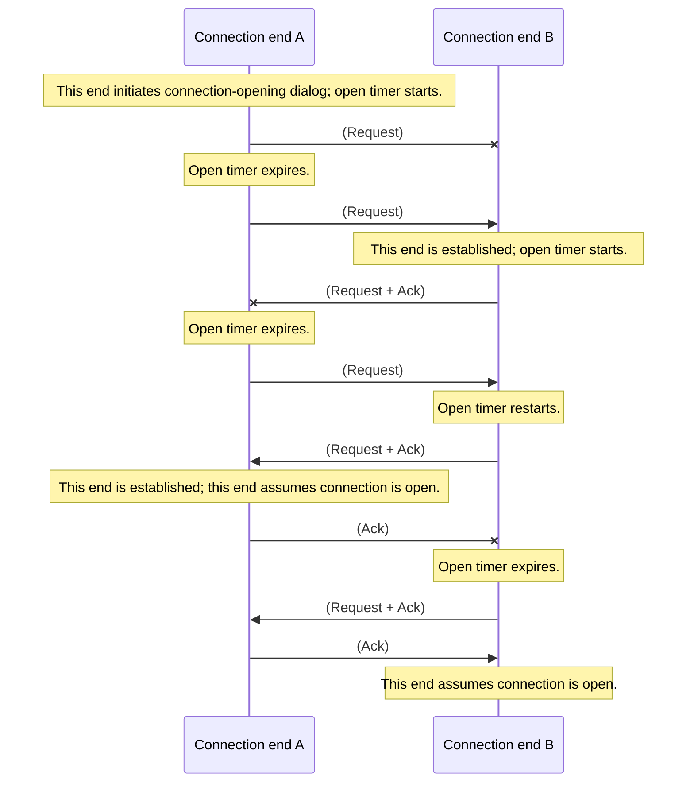
```mermaid
sequenceDiagram
    participant A as Connection end A
    participant B as Connection end B
    Note over A: This end initiates connection-opening dialog#59; open timer starts.
    A-x B: (Request)
    Note over A: Open timer expires.
    A->>B: (Request)
    Note over B: This end is established#59; open timer starts.
    B-x A: (Request + Ack)
    Note over A: Open timer expires.
    A->>B: (Request)
    Note over B: Open timer restarts.
    B->>A: (Request + Ack)
    Note over A: This end is established#59; this end assumes connection is open.
    A-x B: (Ack)
    Note over B: Open timer expires.
    B->>A: (Request + Ack)
    A->>B: (Ack)
    Note over B: This end assumes connection is open.
```

#### Figure 12-13 Simultaneous connection-opening dialog: packet lost

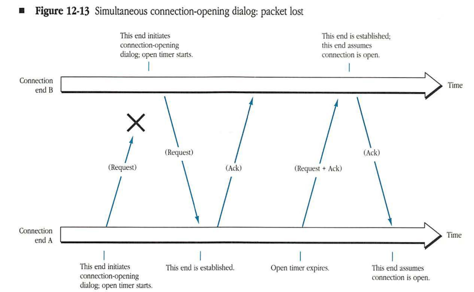

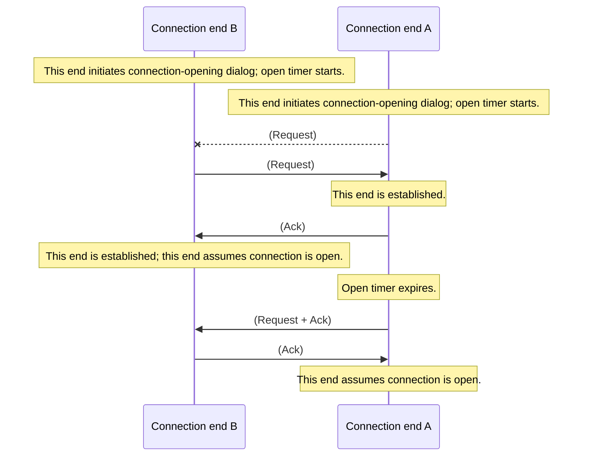
```mermaid
sequenceDiagram
    participant B as Connection end B
    participant A as Connection end A
    Note over B: This end initiates connection-opening dialog#59; open timer starts.
    Note over A: This end initiates connection-opening dialog#59; open timer starts.
    A--xB: (Request)
    B->>A: (Request)
    Note over A: This end is established.
    A->>B: (Ack)
    Note over B: This end is established#59; this end assumes connection is open.
    Note over A: Open timer expires.
    A->>B: (Request + Ack)
    B->>A: (Ack)
    Note over A: This end assumes connection is open.
```

If either end goes down or becomes unreachable during the connection-opening dialog, one end can become established while the other end does not. This results in a half-open connection. When this situation occurs, the open end is closed through normal ADSP mechanisms, as shown in Figure 12-14.

#### Figure 12-14 Connection-opening dialog: half-open connection

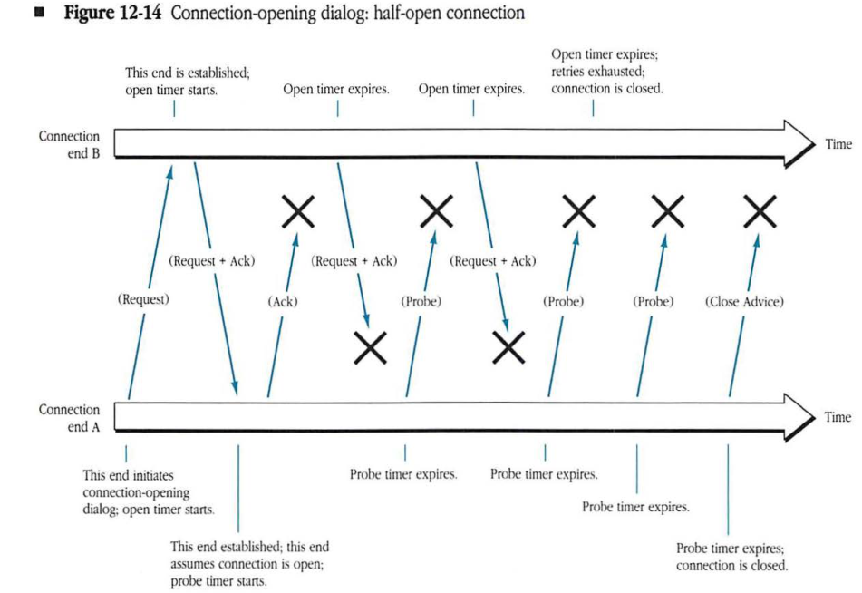

```mermaid
sequenceDiagram
    participant B as Connection end B
    participant A as Connection end A

    Note over A: This end initiates connection-opening dialog; open timer starts.
    A->>B: (Request)
    Note over B: This end is established#59; open timer starts.
    B->>A: (Request + Ack)
    Note over A: This end established#59; this end assumes connection is open; probe timer starts.
    A--xB: (Ack)
    Note over B: Open timer expires.
    B->>A: (Request + Ack)
    A--xB: (Probe)
    Note over B: Open timer expires.
    B->>A: (Request + Ack)
    A--xB: (Probe)
    Note over B: Open timer expires; retries exhausted#59; connection is closed.
    Note over A: Probe timer expires.
    A--xB: (Probe)
    Note over A: Probe timer expires.
    A--xB: (Probe)
    Note over A: Probe timer expires.
    A--xB: (Close Advice)
    Note over A: Probe timer expires#59; connection is closed.
```

Figure 12-15 shows that it is possible for one end to become established while the other is still opening. In this case, the connection is half open. End A can begin to send Data packets, but end B will discard the packets because the connection is not yet open (end B has not yet received acknowledgment that end A has become established).

End B will retransmit its open-connection request and, upon receiving the request, end A will compare the value of PktFirstByteSeq to its own RecvSeq. If the values are equal, end A has not yet received any data from end B; end A assumes the connection is not yet open, sends back an open-connection acknowledgment with PktFirstByteSeq equal to its FirstRtmtSeq, and then retransmits the data (see Figure 12-15).

#### Figure 12-15 Connection-opening dialog: data transmitted on half-open connection

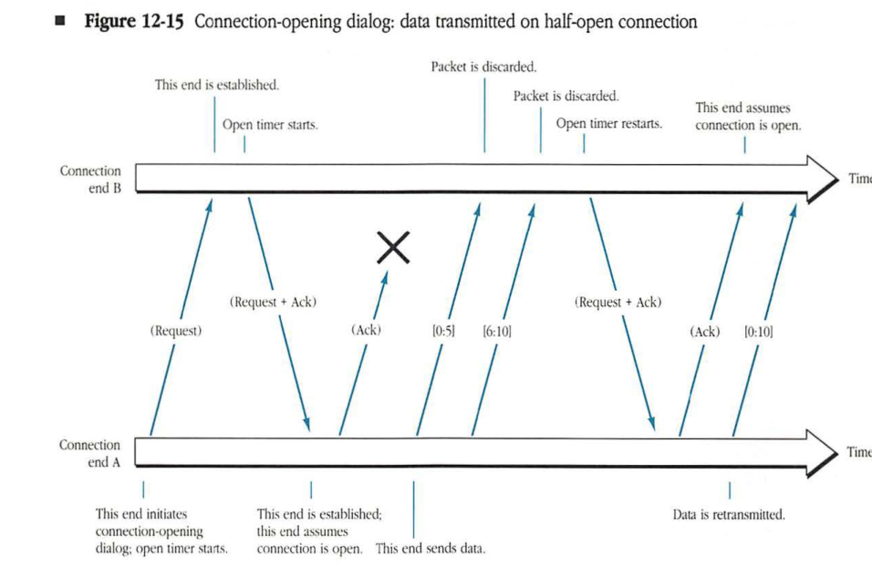

```mermaid
sequenceDiagram
    participant A as Connection end A
    participant B as Connection end B

    Note over A: This end initiates connection-opening dialog; open timer starts.
    A->>B: (Request)
    Note over B: This end is established.
    Note over B: Open timer starts.
    B->>A: (Request + Ack)
    Note over A: This end is established#59; this end assumes connection is open.
    A-x B: (Ack)
    Note over B: Packet is discarded.
    Note over A: This end sends data.
    A->>B: [0:5]
    Note over B: Packet is discarded.
    A->>B: [6:10]
    Note over B: Open timer restarts.
    B->>A: (Request + Ack)
    A->>B: (Ack)
    Note over B: This end assumes connection is open.
    A->>B: [0:10]
    Note over A: Data is retransmitted.
```

If PktFirstByteSeq does not equal RecvSeq, end A can assume that the connection is open because end A has received data from end B; therefore, the open-connection request must be a late-arriving duplicate and is discarded (see Figure 12-16).

#### Figure 12-16 Connection-opening dialog: late-arriving duplicate

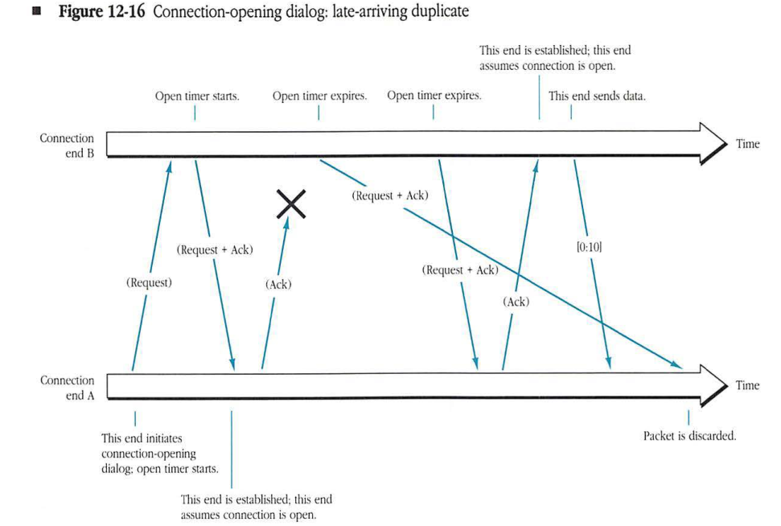

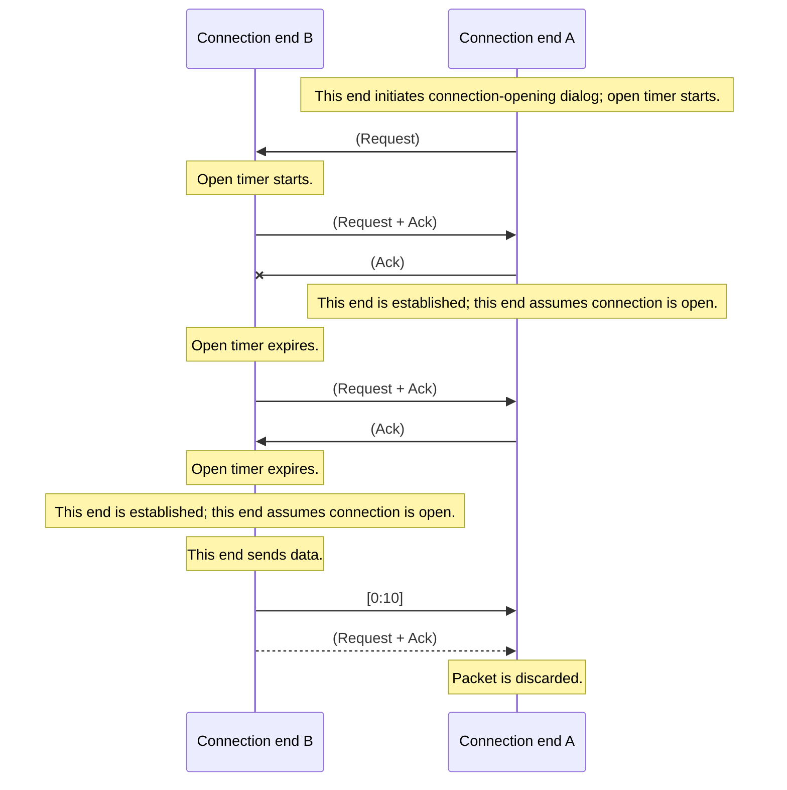
```mermaid
sequenceDiagram
    participant B as Connection end B
    participant A as Connection end A

    Note over A: This end initiates connection-opening dialog#59; open timer starts.
    A->>B: (Request)
    Note over B: Open timer starts.
    B->>A: (Request + Ack)
    A-x B: (Ack)
    Note over A: This end is established#59; this end assumes connection is open.
    Note over B: Open timer expires.
    B->>A: (Request + Ack)
    A->>B: (Ack)
    Note over B: Open timer expires.
    Note over B: This end is established#59; this end assumes connection is open.
    Note over B: This end sends data.
    B->>A: [0:10]
    B-->>A: (Request + Ack)
    Note over A: Packet is discarded.
```

### Connection opening outside of ADSP

The preceding discussion focused on one typical connection-opening situation: the opening of a connection between two specific peer sockets. Although this example illustrates and defines the connection-opening concepts and facilities in ADSP, a connection can be opened in other ways. For example, each of the two clients of ADSP may know the connection-opening information of the other end based on an established convention between these clients. In this situation, each client makes a call to its local ADSP to set up the connection, providing the necessary connection-opening parameters. At each end, the ADSP implementation assumes the connection is open.

In a variation of this situation, the two ADSP clients exchange the required connection-opening information via an independent channel, and then each client calls its local ADSP, as previously described, to open the connection.

In both of these cases, ADSP makes no attempt to send any connection-opening packets to the other end; the underlying assumption is that the cooperating clients have adequately synchronized the parameters before calling their respective ADSP implementations.

### Connection-listening sockets and servers

A common situation involves one or more clients opening connections to a server. The server sets up a connection-listening socket to which the server's clients send their ADSP open-connection requests.

A **connection-listening socket** is a socket that accepts open-connection requests and passes them along to its client (the server process) for further processing. In general, the client then selects a socket and requests ADSP to establish a connection end on that socket. The client passes to ADSP the information from the received open-connection request (that is, the sender's socket address, source ConnID, RecvSeq, RecvWdw, and AttnRecvSeq). ADSP continues the open-connection dialog, sending an Open Connection Request and Acknowledgment Control packet to the specified remote end.

No restriction defines the socket that the server process picks for the connection end; the socket could be the connection-listening socket itself, another socket on the same node, a socket on another node in the same network, or a socket on a node in another network. If the socket is on a node different from the connection-listening socket, then the server must use its own process (outside of ADSP) to convey the call to the target node's ADSP implementation. The client must be aware of the possibility of duplicate open-connection requests and should forward such requests to ADSP, specifying the same connection end (see *Figure 12-17*).

#### **Figure 12-17** Open-connection request made to connection-listening socket; alternate socket chosen for connection

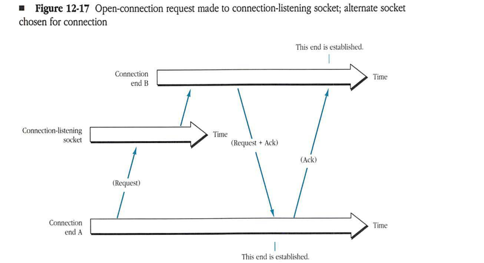

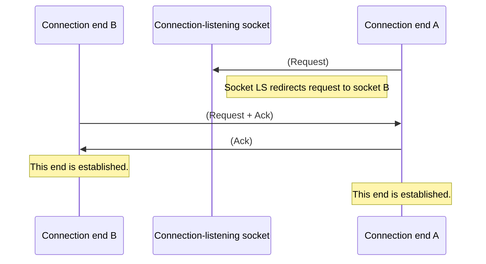
```mermaid
sequenceDiagram
    participant B as Connection end B
    participant LS as Connection-listening socket
    participant A as Connection end A

    A->>LS: (Request)
    Note right of LS: Socket LS redirects request to socket B
    B->>A: (Request + Ack)
    A->>B: (Ack)
    Note over B: This end is established.
    Note over A: This end is established.
```

### Connection-opening filters

The ADSP client may need to be selective about establishing connections with remote clients; the addresses of some remote clients that make open-connection requests may not be acceptable to the local client. In order to establish a selection criterion, the client can provide ADSP with a filter of valid network addresses with which it is willing to establish connections. This filter could be as simple as specifying "open a connection only with the socket to which you are sending the open-connection request" or "open a connection only with a socket on a particular node." If ADSP receives an open-connection request from an address that does not match the filter, it sends back a connection denial and ignores the packet (see *Figure 12-18*).

---

#### **Figure 12-18** Connection-opening filters: open connection denied

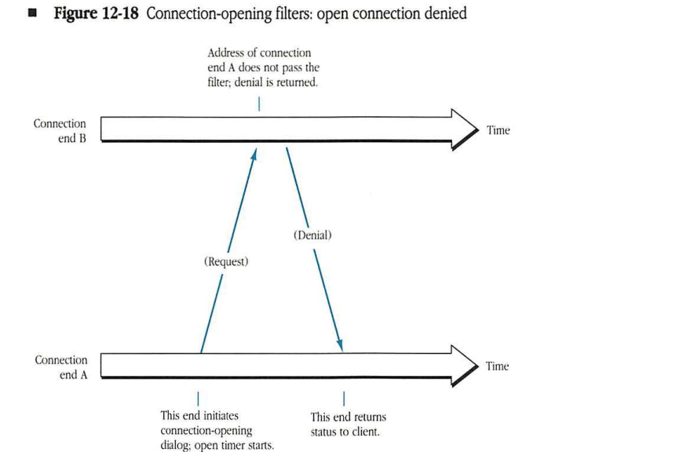

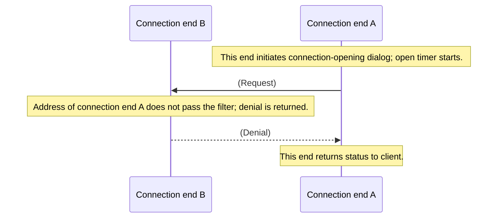
```mermaid
sequenceDiagram
    participant B as Connection end B
    participant A as Connection end A
    Note over A: This end initiates connection-opening dialog#59; open timer starts.
    A->>B: (Request)
    Note over B: Address of connection end A does not pass the filter#59; denial is returned.
    B-->>A: (Denial)
    Note over A: This end returns status to client.
```

In the case of a connection-listening socket, the end could conceivably become established with a different network address than the one to which the original open request was sent. The new address may not be acceptable to the original requester. In this case, the original requester can provide ADSP with a filter of network addresses with which it is willing to establish a connection (see Figure 12-19).

#### Figure 12-19 Connection-opening filters with a connection-listening socket

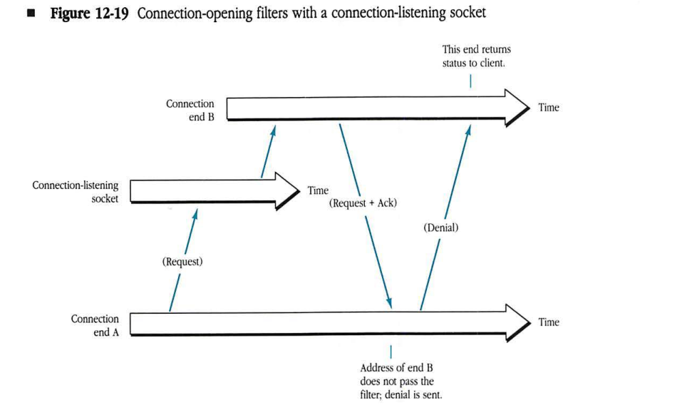

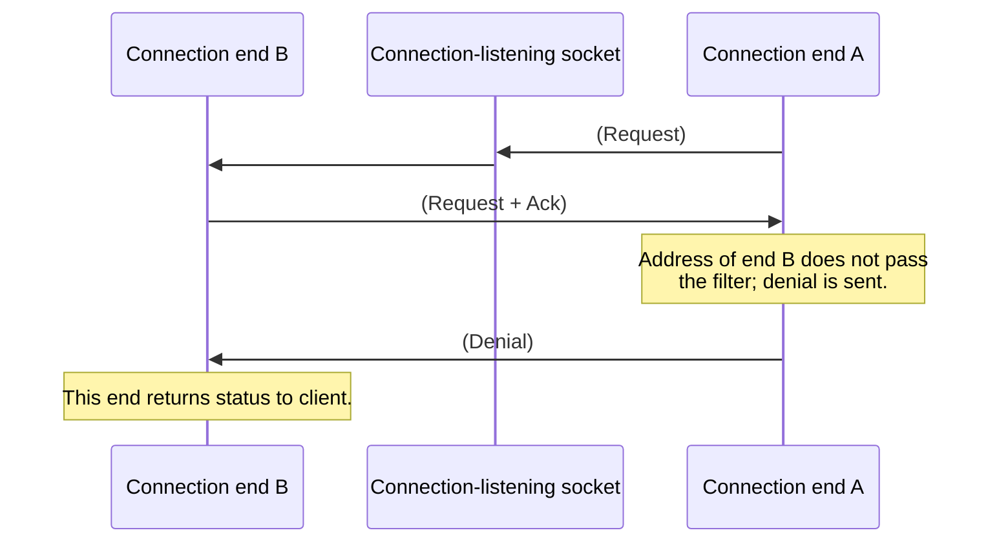
```mermaid
sequenceDiagram
    participant B as Connection end B
    participant LS as Connection-listening socket
    participant A as Connection end A

    A->>LS: (Request)
    LS->>B: 
    B->>A: (Request + Ack)
    Note over A: Address of end B does not pass<br/>the filter#59; denial is sent.
    A->>B: (Denial)
    Note over B: This end returns status to client.
```

## Connection closing

An ADSP connection is closed under one of two circumstances. The first circumstance occurs when either end determines that the other end is not responding to repeated probes. In this event, ADSP immediately closes the remote connection end and notifies the local end's client that the connection is closed.

The second circumstance occurs when either client calls ADSP to close the connection. An ADSP client can make this call at any time. Typically, the local connection end's ADSP awaits acknowledgment of the delivery of any outstanding bytes in its send queue before closing the connection.

Before closing an open connection, ADSP sends a Close Connection Advice Control packet to the remote end. The packet is sent as a courtesy, and its delivery is not guaranteed. If the packet is not successfully delivered to the remote end, the remote end will eventually time out and tear down.

- **Note:** Since the close-connection advice message is sent as an ADSP Control packet, no data can accompany it.

Upon receiving a Close Connection Advice Control packet, an ADSP connection end verifies that the packet is sequenced properly. If the packet has arrived early, the receiving end may discard or buffer it until any intervening data packets have arrived. This action avoids prematurely closing the connection while data packets are delayed in internet routers. If the Close Connection Advice Control packet is acceptable, ADSP immediately closes the connection and informs the client of the change in status.

Occasionally, clients need to inform each other reliably that they have completed their conversation and are ready to close the connection. This process can be accomplished if each end sends an attention message to the other end indicating that it has sent and received acknowledgment of all of its data. Upon completing this handshake, each end can safely issue a call to its local ADSP to close the connection.

