# Part V End-User Services

PART V of *Inside AppleTalk* describes the protocols that provide end-user services in an AppleTalk network. This part includes a complete description of the AppleTalk Filing Protocol (AFP). It also includes the architectural specification for print spooling in an AppleTalk network. 


# Chapter 13 AppleTalk Filing Protocol

THE PURPOSE of the AppleTalk Filing Protocol (AFP) is to allow workstation users to share files. Sharing files across a network requires that the user application know where and how to find a file. This chapter introduces the file access model used by AFP to enable file sharing and discusses the components of AFP software.

The AFP file access model is shown in *Figure 13-1*, which illustrates the discussion that follows. ■


#### **Figure 13-1** The AFP file access model

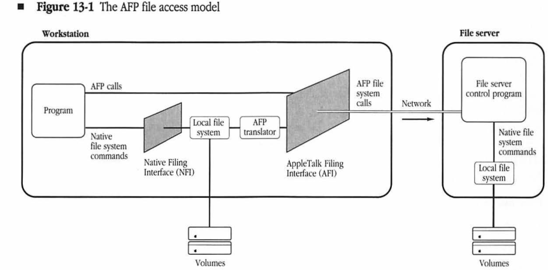

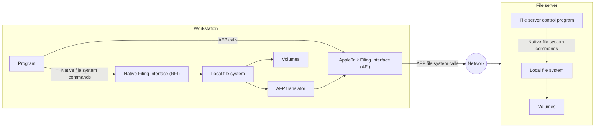
```mermaid
graph LR
    subgraph Workstation
        Program[Program]
        NFI["Native Filing Interface (NFI)"]
        LFS["Local file system"]
        AFPTranslator["AFP translator"]
        AFI["AppleTalk Filing Interface (AFI)"]
        WVolumes[Volumes]

        Program -- "Native file system commands" --> NFI
        Program -- "AFP calls" --> AFI
        NFI --> LFS
        LFS --> WVolumes
        LFS --> AFPTranslator
        AFPTranslator --> AFI
    end

    AFI -- "AFP file system calls" --> Network((Network))
    Network --> FileServer

    subgraph FileServer ["File server"]
        FSCP["File server control program"]
        SLFS["Local file system"]
        SVolumes[Volumes]

        FSCP -- "Native file system commands" --> SLFS
        SLFS --> SVolumes
    end
```

A program running in a workstation (the workstation client or AFP client) requests and manipulates files by using the workstation's **native file system commands**. These commands manipulate files on a diskette or other memory resource that is physically connected to the workstation (a local resource). Through AFP, a workstation program can use the same native file system commands to manipulate files on a shared memory resource that resides on a different node (a remote resource).

A workstation program sends a file system command through the **Native Filing Interface** (NFI) in the workstation. A data structure in local memory indicates whether the volume is managed by the native file system or by some external file system. The native file system discovers whether the requested file resides locally or remotely by looking at this data structure. If the data structure indicates an external file system, the native file system then routes the command to the **AFP translator**.

The translator, as its name implies, translates the native commands into AFP calls and sends them through the **AppleTalk Filing Interface** (AFI) to the file server that manages the remote resource.

The AFP specification defines the AFI part of the file access model. The translator is not defined in the AFP specification; it is up to the applications programmer to design it.

A workstation program may need to gain access to the AFI directly because the program needs to make an AFP call for which no equivalent command exists in the native file system. For example, user authentication might have to be handled through an interface written for that purpose. In *Figure 13-1*, the line leading directly from the program to the AFI illustrates such AFP calls.

Any implementation of AFP must take into account the capabilities of the networked workstation’s native file system and simulate its functionality in the shared environment. In other words, the shared file system should duplicate the characteristics of a workstation’s local file system. Simulating the functionality of each workstation’s native file system becomes increasingly complex as different workstation types share the same file server. Because each workstation type has different characteristics in the way it manipulates files, the shared file system needs to possess the combined capabilities of all workstations on the same network.

Three system components make up AFP:

*   a file system structure
*   AFP calls
*   algorithms associated with the calls

The first component, the AFP file system structure is made up of resources (such as file servers, volumes, directories, files, and forks) that are addressable through the network. These resources are called **AFP-file-system-visible entities** because they are visible through the AFI. In other words, the translator can send commands through AFI to manipulate them.

AFP specifies the relationship between these entities. For example, one directory can be the parent of another. (For descriptions of AFP-file-system-visible entities, see “File System Structure” later in this chapter.)

AFP calls, the second component, are the commands the workstation uses to manipulate the AFP file system structure. As mentioned earlier, the translator sends file system commands to the file server in the form of AFP calls, or the workstation application can make AFP calls directly. (See “AFP Calls” later in this chapter.)

The third software component of AFP is the set of algorithms associated with AFP calls. These algorithms specify the actions performed by the calls.

AFP supports Macintosh computers, Apple II computers running ProDOS®, and personal computers using MS-DOS. AFP can be extended to support additional types of workstations.

Although this chapter distinguishes between workstations and file servers, AFP can support these two functions within the same node. However, AFP does not solve the concurrency problems that can arise in a combined workstation–server node. The software on such combined nodes must be carefully designed to avoid potential conflicts.

AFP does not provide calls that support administration of the file server. Administrative functions, such as registering users and changing passwords, must be handled by separate network-administration software. Additional software must also be provided to add, remove, and find servers within the network.

AFP Version 1.0, which was never released, was developed as a joint effort between Apple Computer, Inc. and Centram Systems West. This chapter describes AFP Versions 1.1 and 2.0. AFP 2.0 provides certain extensions to AFP 1.1; these extensions will be pointed out in the following sections. Unless otherwise noted, all information herein applies to both versions.

Figure 13-2 shows AFP within the AppleTalk protocol architecture.

#### **Figure 13-2** AFP and the AppleTalk protocol architecture

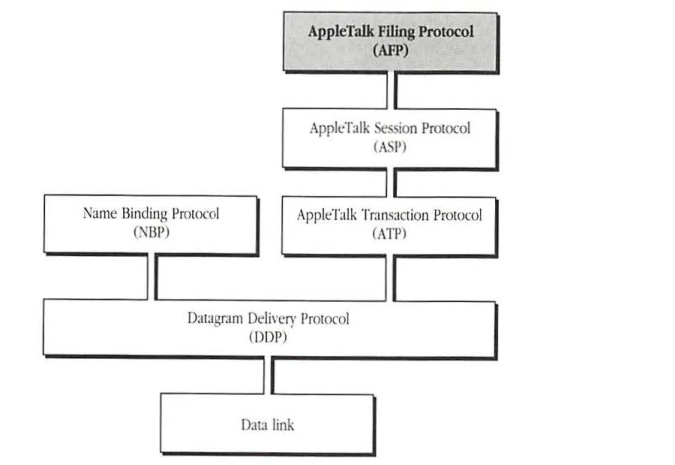

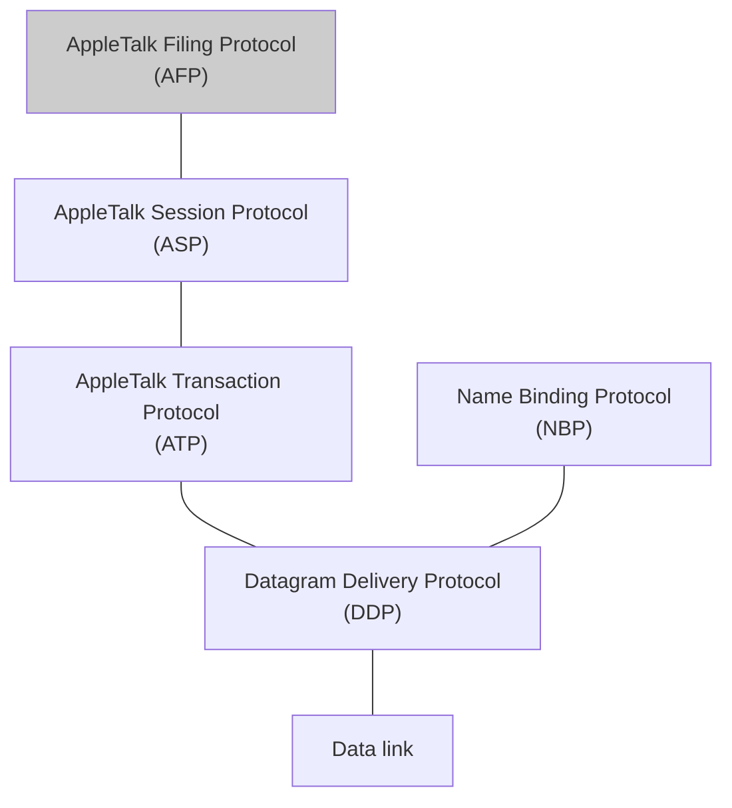
```mermaid
graph TD
    AFP["AppleTalk Filing Protocol\n(AFP)"] --- ASP["AppleTalk Session Protocol\n(ASP)"]
    ASP --- ATP["AppleTalk Transaction Protocol\n(ATP)"]
    ATP --- DDP["Datagram Delivery Protocol\n(DDP)"]
    NBP["Name Binding Protocol\n(NBP)"] --- DDP
    DDP --- DL["Data link"]
    style AFP fill:#ccc
```

## File system structure

This section describes the AFP file system structure and the parameters associated with its AFP-file-system-visible entities. These entities include the file server, its volumes, directories (“folders” in Macintosh terminology), files, and file forks. This section also describes the tree structure, called the volume catalog, which is a description of the relationships between directories and files.


By submitting AFP calls, the workstation client can

*   obtain information about the file server and other parts of the file system structure
*   modify this information
*   create and delete files and directories
*   retrieve and store information within individual files

The following sections describe the file system structure's AFP-file-system-visible entities.


### File server

A **file server** is a computer with at least one large-capacity disk that allows other computers on the network to share the information stored in it. The maximum number of disks is not limited by AFP. Each disk attached to a file server usually contains one volume, although the disk may be subdivided into multiple volumes. Each volume appears as a separate entity to the workstation client.

A file server has a unique name and other identifying parameters. These parameters identify the server's machine type and number of attached volumes, the AFP versions that the server can understand, and the **user authentication methods** (UAMs) that the server supports. AFP file server parameters are listed below.

| **Parameter** | **Description** |
| :--- | :--- |
| server name | string of up to 32 characters |
| server machine type | string of up to 16 characters |
| number of volumes | 2-byte integer |
| AFP version strings | strings of up to 16 characters each |
| UAM strings | strings of up to 16 characters each |
| server icon | 256 bytes |


> Note: Unless mentioned otherwise, all numerical values are signed numbers. AFP strings can be up to 255 characters long and are case-insensitive and diacritical-sensitive. Strings appear in what is commonly called Pascal format; that is, a length byte followed by the same number of characters. The string "hello" would be encoded as 05 "h" "e" "l" "l" "o". A string of up to 16 characters would require up to 17 bytes to encode (1 byte for the length and up to 16 bytes of characters). The character-code mapping is as defined in Appendix D. All date-time parameters are signed 4-byte integers representing the number of seconds measured from 12:00 A.M. on January 1, 2000.

In this section, strings, file creators, and file types are shown in monospaced font enclosed by single quotes (for example, 'B3   '). The single quotes are delimiters and are not part of the string, file creator, or file type.

The server machine-type string is purely informative, providing text that describes the file server's hardware and software; it has no significance to AFP.

For descriptions of AFP version strings and UAM strings, see "AFP Login" later in this chapter.

The server icon is optional and is used to customize the appearance of server volumes on a Macintosh Desktop. It consists of a 32-by-32 bit (128 bytes) icon bitmap followed by a 32-by-32 bit (128 bytes) icon mask. The mask usually consists of the icon's outline filled with black (bits that are set). This format fits the specification of icons for a Macintosh (for more information about icons, refer to *Inside Macintosh*).

Figure 13-1 illustrates a file server with two attached volumes.

### Volumes

A file server can have one or more volumes that are visible to workstations through the AFP. Each volume has identifying parameters associated with it, as listed below. To provide security at the level of each volume, the server can also maintain an optional password parameter.


| Parameter | Description |
|---|---|
| volume name | string of up to 27 characters |
| volume signature | 2 bytes |
| volume identifier | 2 bytes |
| volume creation date-time | 4 bytes |
| volume modification date-time | 4 bytes |
| volume backup date-time | 4 bytes |
| volume size (in bytes) | 4-byte unsigned long integer |
| free bytes on volume | 4-byte unsigned long integer |
| volume password (optional) | 8 bytes |

The volume name identifies a server volume to a workstation user, so it must be unique among all
volumes managed by the server. All 8-bit ASCII characters, except null ($00) and colon ($3A), are
permitted in a volume name. This name is not used directly to specify files and directories on the
volume. Instead, the workstation makes an AFP call to obtain a particular volume identifier, which
it then uses in all subsequent AFP calls. (See “Designating a Path to a CNode” later in this chapter.)

The **volume signature** identifies the volume type. Permitted values are discussed in the next
section.

For each session between the server and a workstation, the server assigns a **Volume ID** to each
of its volumes. This value is unique among the volumes of a given server for that session.

A volume's creation date-time is set by the server when the volume is created. Similarly, the
modification date-time is changed by the server each time anything on the volume is modified.
These two date-time values are managed solely by the server and cannot be modified by the
workstation client. However, the backup date-time can be set by a backup program each time the
volume's contents are backed up. When a volume is created, its backup date-time is set to $80000000
(the earliest representable date-time value).

#### Volume types

An AFP volume is structured in one of two ways: flat or hierarchical. The latter organizes
information into containers (**directories**), which in turn contain files. Flat volumes contain only
one directory. Directories and files are described in more detail later. This section discusses only
directories and their identifiers, **Directory IDs**, as they relate to the structure of volumes.

An application can be written that allows a workstation with a flat local file system to use parts of a variable Directory ID volume. Such an application would mount selected directories of a variable Directory ID volume as flat volumes. (To **mount** a volume is to make it available to a workstation. The volume is not physically mounted on a local disk drive; it only appears that way.) Each corresponding “virtual” volume would appear flat, because only one directory and its offspring files would be visible through the AFI. However, writing such applications is not recommended. This view of the volume is very limited; if the directory contained other directories, they would not be available to the workstation.
Variable Directory ID volumes are included in this definition of AFP to accommodate non-Macintosh machines with file systems that are unable to implement the fixed Directory ID feature. Variable Directory ID volumes allow such machines to function as file servers and to make their files and directories accessible through AFP.

#### Volume catalog

The volume catalog is the structure that describes the branching tree arrangement of files and directories on a hierarchical volume (fixed and variable Directory ID volumes). The catalog does not span multiple volumes; the workstation client sees a separate volume catalog for each server volume that is visible through the AFI. *Figure 13-3* shows an example of a volume catalog and illustrates its elements.
The volume catalog contains directories and files branching from a base directory known as the root. These directories and files are referred to as **catalog nodes** or **CNodes** (not to be confused with devices on a network, which are also called nodes). Within the tree structure, CNodes can be positioned in two ways; either at the end of a limb, in which case it is called a leaf, or connected from above and below to other CNodes, in which case it is called internal. Internal CNodes are always directories; leaf CNodes can be either files or empty directories.
CNodes have a parent/offspring relationship: A given CNode is the **offspring** of the CNode above it in the catalog tree, and the higher CNode is considered its **parent** or **parent directory**. Offspring are contained within the parent directory. The only CNode without a true parent is the root directory.
When an AFP call makes its way through the volume catalog, it can take only one shortest path from the root to a specific CNode. The CNodes along that path are said to be **ancestors** of the destination node, which in turn is called the **descendent** of each of its ancestors.


#### **Figure 13-3** The volume catalog

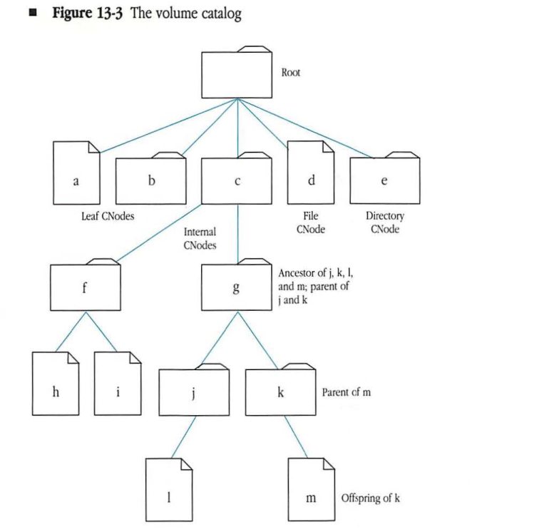

### Catalog node names

CNode names identify every file and directory in a volume catalog, and each file or directory has both a long name and a short name. The root directory of a volume catalog represents the volume, and the root's long name is the same as the volume name. The volume essentially has a short name, which is the short name of the root directory, although AFP does not allow its use. Neither the root nor the volume can be deleted or renamed through AFP.

Long names and short names correspond to two of the native file systems that AFP supports: Macintosh workstations refer to files and directories by long names; MS-DOS workstations use the short-name format. To allow these dissimilar workstations to share resources, the file server provides CNode names in both formats. When creating or renaming files and directories, the workstation user provides a name consistent with the native file system. The server then uses an algorithm to generate the other name (long or short). This section describes the rules for forming CNode names and the algorithm used for creating and maintaining dual names.

The syntax for forming AFP long names is the same as the naming syntax used by the Macintosh HFS, with one exception: Null ($00) is not a permissible character in AFP long names. Otherwise, the mapping of character code to character is the same for AFP as it is for the Macintosh (see Appendix D). AFP long names are made up of at most 31 characters; valid characters are any printable ASCII code except colon ($3A) and null ($00). The volume name, and by inference the root's long name, cannot be longer than 27 bytes.

The syntax for forming AFP short names is the same as the naming syntax used by MS-DOS, which is more restrictive than the naming syntax used in the Macintosh: Names may be up to eight alphanumeric characters, optionally followed by a period ($2E) and a one-to-three alphanumeric character extension.

To ensure that a CNode can be uniquely specified by either name, AFP defines the following rules:

*   No two offspring of a given directory can have the same short name or the same long name.
*   A short name can match a long name if they both belong to the same file or directory.

Therefore, either name, long or short, uniquely identifies CNodes within a parent directory.

AFP naming rules are such that any MS-DOS name can be used directly as a CNode short name, and any Macintosh name can be used directly as a long name. The file server generates the other name for each CNode, deriving it from the first name specified and matching the second name as closely as possible. The long-name format is a superset of the short-name format. The name management algorithm mandates that whenever a CNode is created or renamed with a short name, the long name will always match. Deriving a short name from a long name is not so simple, and AFP does not stipulate an exact algorithm for this derivation. Therefore, different servers may perform this short-name creation differently.

When a CNode is created, the caller supplies the node's name and a name type that indicates whether the name is in short or long format. The server then checks the name to verify that it conforms to the accepted format. The algorithm that follows describes how servers assign short and long names to a CNode (referred to as an object in this algorithm).


```pascal
IF name type is short OR name is in short format
THEN check for new name in list of short names
    IF name already exists
    THEN return ObjectExists result
    ELSE set object's short and long names to new name

ELSE { name type is long OR name is in long format }
    check for new name in list of long names
    IF name already exists
    THEN return ObjectExists result
    ELSE set object's long name to new name
         derive short name from long name
```

This algorithm is used for renaming as well as for creating new names. When a user renames an object, its other name is changed using the above algorithm.

One limitation of this algorithm is that it does not prevent a user from specifying a long name that matches a short name generated by the file server for another file. A server-generated short name is normally not visible to a workstation that sees only long names. If a user inadvertently specifies a long name that matches a preexisting short name, the call fails and the server returns an `ObjectExists` result code.

For example, for a Macintosh file created with the long name `MacFileLongName`, a file server can generate a short name of `MacFile`. When the user tries to create a new file with the long name `MacFile` in the same directory, the call fails, since the above algorithm stipulates that the long name and short name would both have to be set to `MacFile`.

### Directories and files

Directories and files are stored in volumes and constitute the next level of the file system structure visible through the AFI. As was shown in *Figure 13-3*, directories branch to files and other directories. Each directory has an identifier through which it and its offspring can be addressed. Therefore, directories can be thought of as logically containing their offspring directories and files with the parameters described below.

#### Directory IDs

Each directory in the volume catalog is identified by a 4-byte long integer known as its Directory ID. Because two directories on the same volume cannot have the same Directory ID, the Directory ID uniquely identifies a directory within a volume.

Within the volume catalog, as mentioned earlier, directories have ancestor, parent, and offspring relationships with each other. The Directory ID of a CNode's parent is called the CNode's Parent ID.

A CNode can have only one parent, so a given CNode has a unique Parent ID. However, a CNode can have several ancestor directory identifiers, one for each ancestor. The parent directory is considered an ancestor.

The Directory ID of the root is always 2. The root's Parent ID is always 1. (The root does not really have a parent; this value is returned only if a call asks for the root's Parent ID.) Zero (0) is not a valid Directory ID.

#### Directory parameters

In AFP Versions 1.1 and 2.0, a server must maintain the following parameters for each directory:

| Directory parameter (1.1 and 2.0) | Description |
|---|---|
| long name | string of up to 31 characters |
| short name | string of up to 12 characters |
| Directory ID | 4 bytes |
| Parent ID | 4 bytes |
| attributes | 2 bytes |
| Finder information | 32 bytes |
| offspring count (number of files and directories contained in the directory) | 2 bytes |
| creation date-time | 4 bytes |
| modification date-time | 4 bytes |
| backup date-time | 4 bytes |
| owner ID | 4 bytes |
| group ID | 4 bytes |
| owner access rights | 1 byte |
| group access rights | 1 byte |
| world access rights | 1 byte |

The Finder information parameter accompanies directories that are used by workstations with HFS. This parameter is maintained by the workstation client and is not examined by AFP. The last five directory parameters listed above relate to directory access controls, discussed later in this chapter.
In AFP Version 2.0, the server must maintain one more parameter in addition to those just listed; the ProDOS information parameter is discussed later in this section.

| Directory parameter (2.0) | Description |
|---|---|
| ProDOS information | 6 bytes |

The attributes parameter is a bitmap indicating various attributes of the directory. One directory attribute is defined in AFP Version 1.1. (The other attribute bits must be set to 0.)

| Directory attribute (1.1) | Description |
|---|---|
| Invisible | directory should not be made visible to the workstation user |

The following directory attributes are defined in AFP Version 2.0:

| Directory attribute (2.0) | Description |
|---|---|
| Invisible | directory should not be made visible to the workstation user |
| System | directory is a system directory |
| BackupNeeded | directory needs to be backed up |
| RenameInhibit | directory cannot be renamed |
| DeleteInhibit | directory cannot be deleted |

* The definition of system directory is left up to the workstation.
* The BackupNeeded bit is set whenever the directory's modification date-time changes.
* No specific bit exists to inhibit moving a directory, but directory movement is constrained by the RenameInhibit bit when a directory is moved or moved and renamed. This is true whether the workstation is using AFP Version 1.1 or 2.0.

#### File parameters

In Versions 1.1 and 2.0, a server must maintain the following parameters for each file:

| File parameter (1.1 and 2.0) | Description |
|---|---|
| long name | string of up to 31 characters |
| short name | string of up to 12 characters |
| Parent ID | 4 bytes |
| file number | 4 bytes |

File parameter (1.1 and 2.0) | Description (continued)
|---|---|
| attributes | 2 bytes |
| Finder information | 32 bytes |
| data fork length | 4-byte unsigned integer |
| resource fork length | 4-byte unsigned integer |
| creation date-time | 4-bytes |
| modification date-time | 4-bytes |
| backup date-time | 4-bytes |

In AFP Version 2.0, the server must maintain one more parameter:

File parameter (2.0) | Description
|---|---|
| ProDOS information | 6 bytes |

The ProDOS information parameter contains a 2-byte File Type and a 4-byte Aux Type intended for use by ProDOS workstations. Note that ProDOS-8 defines the File Type field to be 1 byte and the Aux Type field to be 2 bytes. The extra bytes are reserved for future expansion. The type fields are arranged in the ProDOS information parameter as shown in *Figure 13-4*.

For directories, the ProDOS File Type is always set to $0F. The server will return an afpAccessDenied error if the user attempts to set the ProDOS File Type of a directory to anything other than $0F. No restriction is made on the value of the directory's Aux Type, although it is initially set to $0200 when the directory is created.

#### **Figure 13-4** ProDOS information format

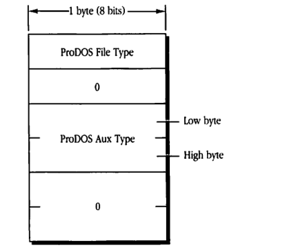

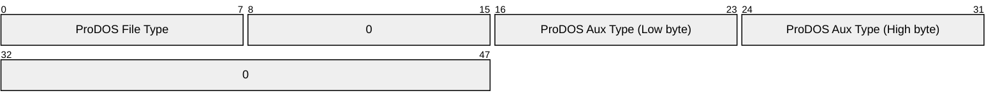
```mermaid
packet-beta
0-7: "ProDOS File Type"
8-15: "0"
16-23: "ProDOS Aux Type (Low byte)"
24-31: "ProDOS Aux Type (High byte)"
32-47: "0"
```

| Field | Bit offset | Width (bits) | Description |
|---|---|---|---|
| ProDOS File Type | 0 | 8 | The 1-byte ProDOS File Type field. |
| Reserved | 8 | 8 | Reserved for future expansion; must be set to 0. |
| ProDOS Aux Type (Low byte) | 16 | 8 | Low byte of the ProDOS Aux Type field. |
| ProDOS Aux Type (High byte) | 24 | 8 | High byte of the ProDOS Aux Type field. |
| Reserved | 32 | 16 | Reserved for future expansion; must be set to 0. |


For files, the ProDOS File Type is analogous to the Macintosh Finder Info fdType field. In an FPSetFileDirParms or FPSetFileParms call, if either field is set without setting the other, the server will derive an appropriate value for the other field. For example, if a ProDOS workstation sets a file's ProDOS File Type to $04 and the Aux Type to $0000 without setting the Finder Info, the server will set the Finder Info fdCreator to 'pdos' and the fdType to 'TEXT'. The following ProDOS-to-Finder Info mappings are defined in AFP Version 2.0:

| | ProDOS Info | ProDOS Info | Finder Info | Finder Info |
| :--- | :--- | :--- | :--- | :--- |
| **Description** | **File Type** | **Aux Type** | **fdCreator** | **fdType** |
| ProDOS text | $04 | $0000 | 'pdos' | 'TEXT' |
| ProDOS-8 application | $FF | any | 'pdos' | 'PSYS' |
| ProDOS-16 application | $B3 | any | 'pdos' | 'PS16' |
| Unknown | $00 | any | 'pdos' | 'BINA' |
| All others | any | any | 'pdos' | 'p'XYY |

If ProDOS Info does not fall into any of the above special categories, the server sets the fdCreator field to 'pdos' and the fdType field to 'p'XYY, where X is equal to the ProDOS File Type and YY is equal to the ProDOS Aux Type. For example, a ProDOS File Type of $32 and Aux Type of $5775 will map to an fdType field of 'p2Wu'. Some values of File Type and Aux Type will map to unprintable characters.

The above mapping is performed only if the Finder Info (fdCreator or fdType) is actually changed. In other words, if a workstation sets the Finder Info to its current value, the ProDOS Info field will be left untouched.

The ProDOS Info field is derived from Finder Info when a workstation client makes a call specifying new Finder Info without specifying new ProDOS Info. The following Finder-to-ProDOS Info mappings are defined in AFP Version 2.0:

| | Finder Info | Finder Info | ProDOS Info | ProDOS Info |
| :--- | :--- | :--- | :--- | :--- |
| **Description** | **fdCreator** | **fdType** | **File Type** | **Aux Type** |
| ProDOS text | any | 'TEXT' | $04 | $0000 |
| ProDOS-8 application | 'pdos' | 'PSYS' | $FF | unchanged |
| ProDOS-16 application | 'pdos' | 'PS16' | $B3 | unchanged |
| Unknown | 'pdos' | 'BINA' | $00 | unchanged |
| Special format #1 | 'pdos' | 'p'XYY | $X | $YY |
| Special format #2 | 'pdos' | 'XX  ' | $XX | unchanged |
| All others | any | any | $00 | $0000 |


Two special formats are designed to encode ProDOS Info. The first is denoted by an `fdType` made up of the letter 'p' followed by a 1-byte ProDOS File Type and a 2-byte ProDOS Aux Type (high order byte first). The ProDOS File Type and Aux Type are simply unpacked from the `fdType` field. The second special format is denoted by an `fdType` field consisting of a two-character hexadecimal number followed by two spaces (for example, 'B3  '). In this format, the 2-character string is converted to its numerical value and stored as the ProDOS File Type field. The Aux Type field is left unchanged.

If the Finder Info does not fall into any of the above specific mappings, the server sets the ProDOS File Type to $00 and the Aux Type to $0000.

The file number is a unique number associated with each file on the volume. This number is purely informative; AFP does not allow the specification of a file by its file number.

The attributes parameter is a bitmap indicating various attributes of the file. Five file attributes are defined in AFP Version 1.1, and the rest of the 11 bits must be equal to 0. The 5 attributes are:

| File attribute (1.1) | Description |
|---|---|
| Invisible | file should not be made visible to the workstation user |
| MultiUser | file is an application that has been written for simultaneous use by more than one user |
| RAlreadyOpen | file's resource fork is currently open by a user |
| DAlreadyOpen | file's data fork is currently open by a user |
| ReadOnly | user cannot write to the file's forks |

In AFP Version 2.0, 10 file attributes are defined; the other bits must be equal to 0. The 10 attributes are:

| File attribute (2.0) | Description |
|---|---|
| Invisible | file should not be made visible to the workstation user |
| MultiUser | file is an application that has been written for simultaneous use by more than one user |
| RAlreadyOpen | file's resource fork is currently open by a user |
| DAlreadyOpen | file's data fork is currently open by a user |
| WriteInhibit | user cannot write to the file's forks |
| System | file is a system file |
| BackupNeeded | file needs to be backed up |
| RenameInhibit | file cannot be renamed |


| File attribute (2.0) | Description (continued) |
|---|---|
| DeleteInhibit | file cannot be deleted |
| CopyProtect | file should not be copied |

The ReadOnly bit is named WriteInhibit in AFP 2.0.

For servers that support both AFP Version 1.1 and 2.0, the following rules will maintain consistency among the file attributes: If a workstation using Version 1.1 sets or clears the ReadOnly bit, the server sets or clears the WriteInhibit, RenameInhibit, and DeleteInhibit bits. Likewise, when this workstation tries to read the state of the ReadOnly bit, the server logically-ORs the Write-, Rename-, and DeleteInhibit bits together and returns the result as the state of the ReadOnly bit.

A workstation using Version 2.0 must be able to set and clear the Write-, Rename-, and DeleteInhibit bits individually, but the server enforces the actions specified by each bit, even for 1.1 workstations. For example, if a 2.0 workstation set a file's RenameInhibit bit, then a 1.1 workstation would not be able to rename the file. It would appear as a ReadOnly file to the latter workstation, and clearing the ReadOnly bit would clear the RenameInhibit bit and therefore allow the file to be renamed.

No specific bit exists to inhibit moving a file, but file movement is constrained by the RenameInhibit bit only when a file is moved and renamed, not when it is simply moved. This constraint occurs whether the workstation is using AFP Version 1.1 or 2.0.

The Macintosh Finder will not copy a file whose CopyProtect bit is set. An attempt to copy the file using the FPCopyFile command will result in an error. This bit may be read, but not set, using AFP. It is to be set by some administrative program, whose specification is beyond the scope of this chapter.

* The BackupNeeded bit is set whenever the file's modification date-time changes.
* The data fork length and resource fork length are equal to the number of bytes in the corresponding fork.
* The creation, backup, and modification date-time parameters are described next.

#### Date-time values

All date-time quantities used by AFP specify values of the server's clock. These values correspond to the number of seconds measured from 12:00 A.M. on January 1, 2000. In other words, the start of the next century corresponds to a date-time of 0. AFP represents date-time values with 4-byte signed integers.

One of the AFP calls allows the workstation to obtain the current value of the server's clock. At login time, the workstation should read this value (*s*) and the value of the workstation's clock (*w*) and compute the offset between these values: *s* – *w*. All subsequent date-time values read from the server should be adjusted by subtracting this offset from the date-time. All subsequent date-time values sent to the server should be adjusted by adding this offset to the date-time. This adjustment will correct for differences between the two clocks and will ensure that all workstations see a consistent time base.

The creation date-time of a directory or a file is set to the server's system clock when the file or directory is created. The backup date-time is set by backup programs. When a file or directory is created, the server sets the backup date-time to $80000000, which is the earliest representable time.

The server changes the modification date-time of a file that has been written to in a particular session when either of the file's forks is closed or flushed for that session (see the FPCloseFork call under "AFP Calls" later in this chapter).

The server changes the modification date-time of a directory each time the directory's contents are modified. Therefore, any of the following actions will cause the server to assign a new modification date-time to the directory: renaming the directory; creating or deleting a CNode in the directory; moving the directory; changing its access privileges, Finder Info, or ProDOS Info; or changing the Invisible attributes of one of its offspring.

An AFP client with the appropriate access rights can set the creation and modification date-time parameters to any value.

### File forks

As in the Macintosh file system, a file consists of two **forks**: a data fork and a resource fork. The bytes in a file fork are sequentially numbered starting with 0. The data fork is an unstructured finite sequence of bytes. The resource fork is used to hold Macintosh operating system resources, such as icons and drivers, and a data structure for mapping them within the fork. AFP is designed to consider both forks as finite-length byte sequences; however, AFP contains no rules relating to the structure of the resource fork. For more information about resource forks, refer to *Inside Macintosh*.

Either or both forks of a given file can be empty. Non-Macintosh AFP clients that need only one file fork must use the data fork. Files created by a workstation with an MS-DOS operating system will have an empty resource fork, because a resource fork is unintelligible to that operating system. Consequently, an MS-DOS workstation that has gained access to a server file created by a Macintosh may not be aware of the existence of the file's resource fork.

Although AFP allows the creation of MS-DOS applications that can understand and manipulate resource forks, such applications would have to preserve the internal structure of the forks. Users of workstations that cannot manage the internal structure of the resource fork should never alter its contents because Macintosh workstations expect a specific format in the resource fork of any file.

To read from or write to the contents of a file's data or resource fork, the workstation client first issues a call to open the particular fork of the file, creating an access path to that file fork. The access path is not to be confused with the paths and pathnames described in the next section.

Once the workstation client creates this access path, all subsequent read and write calls refer to it for the duration of the session.

For each access path, the server maintains the following parameters:

| Parameter | Description |
|---|---|
| OForkRefNum | 2 bytes (0 is invalid) |
| AccessMode | 2-byte bitmap |
| Rsrc/DataFlag | 1 bit |

The OForkRefNum uniquely identifies the access path among all access paths within a given session. The AccessMode indicates to the server whether this access path allows reading or writing. It is maintained by the server and is inaccessible to workstation clients of AFP. Rsrc/DataFlag indicates to the server that the access path belongs to the data or resource fork.

In addition to the above parameters, the server must provide a way to gain access to the parameters of the file to which this open fork belongs (see the FPGetForkParms call under "AFP Calls" later in this chapter).

## Designating a path to a CNode

In order to perform any action on a CNode, the workstation must designate a path to the CNode. AFP provides rules for specifying a path to any CNode in the volume catalog. A CNode (file or directory) can be unambiguously specified to the server by the identifiers shown in Figure 13-5.

#### **Figure 13-5** CNode specification

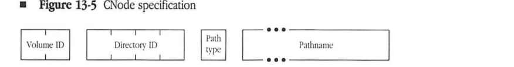

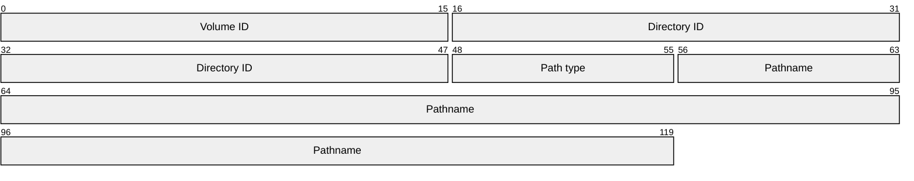
```mermaid
packet-beta
0-15: "Volume ID"
16-47: "Directory ID"
48-55: "Path type"
56-119: "Pathname"
```

| Field | Bit offset | Width (bits) | Description |
|---|---|---|---|
| Volume ID | 0 | 16 | Identifier for the volume |
| Directory ID | 16 | 32 | Identifier for the directory |
| Path type | 48 | 8 | Type of the path |
| Pathname | 56 | Variable | The actual path string |

The Volume ID specifies the volume on which the destination CNode resides. The Directory ID can belong to the destination CNode (if the CNode is a directory) or to any one of its ancestor directories, up to and including the root directory and the root's parent directory.

An **AFP pathname** is formatted as a Pascal string (length byte followed by that number of characters). It is made up of CNode names, concatenated with intervening null-byte separators. Each element of a pathname must be the name of a directory, except for the last one, which can be the name of a directory or a file.

The elements of a pathname can be long or short names. However, a given pathname cannot contain a mixture of long and short names. A **path type** byte, which indicates whether the elements of the pathname are all short or all long names, is associated with each pathname. A pathname consisting of short names has a path type of 1. A pathname consisting of long names has a path type of 2.

A pathname can be up to 255 characters long. A single null byte as the length byte indicates that no pathname is supplied. Because the length byte is included at the beginning of the string, each pathname element (CNode name) does not include a length indicator.

The syntax of an AFP pathname follows this paragraph. The asterisk (*) represents a sequence of 0 or more of the preceding elements of the pathname; the plus (+) represents a sequence of 1 or more of the preceding elements; <Sep> represents the separators in the pathname; the vertical bar (|) is an OR operator; and the term on the left side of the ::= symbol is defined as the term(s) on the right side.

```
<Sep> ::= <null-byte>+
<Pathname> ::= empty-string |
    <Sep>*<CNode name>(<Sep><Pathname>)*
```

This syntax represents a concatenation of CNode names separated by one or more null bytes. Pathnames can also start or end with a string of null bytes.

A pathname can be used to traverse the volume catalog in any direction. The pathname syntax allows paths either to descend from a particular CNode through its offspring or to ascend from a CNode to its ancestors. In either case, the directory that is the starting point of this path is defined separately from the pathname by its Directory ID. The first element of the pathname is an offspring of the starting point directory. The pathname must be parsed from left to right to obtain each element that is used as the next node on the path.

To descend through a volume, a valid pathname must proceed in order from parent to offspring. A single null-byte separator preceding this first element is ignored.

To ascend through a volume, a valid pathname must proceed from a particular CNode to its ancestor. To ascend one level in the catalog tree, two consecutive null bytes should follow the offspring CNode name. To ascend two levels in the catalog tree, three consecutive null bytes are used as the separator, and so on.

A particular pathname may descend and ascend through the volume catalog. Because of this, many valid pathnames may refer to the same CNode.

A complete path specification can take a number of forms. The table that follows summarizes the different kinds of path specifications that can be used to traverse the volume catalog illustrated in *Figure 13-6*. A zero in square brackets [0] represents a null-byte separator.

The descriptions and examples that follow refer to this table and the corresponding volume catalog illustrated in *Figure 13-6*. To simplify these examples, the CNodes in this catalog are named *a* through *j*, except the root, which is named *x*. The path type will be ignored in this example. The letter *v* represents the volume's 2-byte Volume ID. Lines connect the CNodes; the unconnected lines indicate that other CNodes in this volume are not shown here.

#### **Figure 13-6** Example 1 of a volume catalog

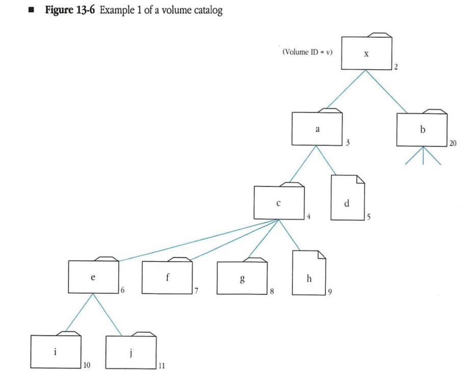

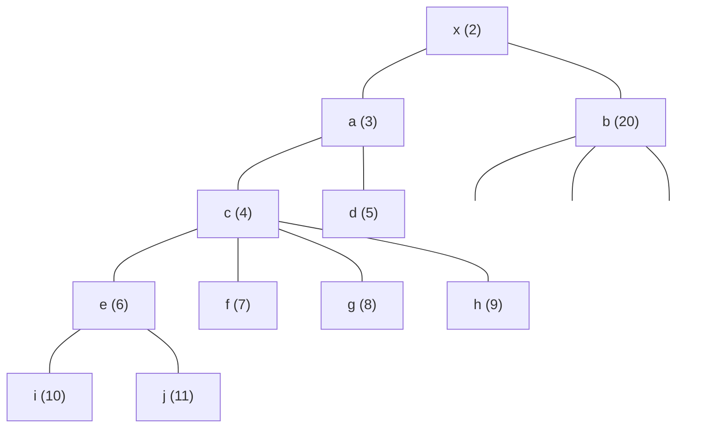
```mermaid
graph TD
    x["x (2)"] --- a["a (3)"]
    x --- b["b (20)"]
    a --- c["c (4)"]
    a --- d["d (5)"]
    c --- e["e (6)"]
    c --- f["f (7)"]
    c --- g["g (8)"]
    c --- h["h (9)"]
    e --- i["i (10)"]
    e --- j["j (11)"]
    
    %% Unconnected lines indicating other nodes
    b --- u1[ ]
    b --- u2[ ]
    b --- u3[ ]
    
    style u1 fill:none,stroke:none
    style u2 fill:none,stroke:none
    style u3 fill:none,stroke:none
```

| Examples | Volume ID | Directory ID | Pathname |
|---|---|---|---|
| First | v | 2 | a [0] c [0] e [0] j [0] |
| Second | v | 4 | e [0] j |
| Third | v | 6 | [0] j |
| Fourth | v | 6 | j |
| Fifth | v | 6 | [0] |
| Sixth | v | 4 | e [0][0] g [0][0] h |
| Seventh | v | 4 | e [0][0][0] |
| Eighth | v | 1 | x [0] a [0] c [0] h |

The *first* example path specification in the table above contains the Volume ID, the root directory's Directory ID, which is always a value of 2, and a pathname. In this case, the pathname must contain the names of all the destination file's ancestors, except the root, and it must end with the name of the file itself. The single trailing null-byte is ignored.

The *second* path specification contains the Volume ID, the Directory ID of an ancestor, and a pathname.

The *third* path is essentially the same as the second. The single leading null-byte is ignored.

In the *fourth* path specification, the Directory ID is the Parent ID of the destination file. In this case, the pathname need contain only the name of the destination file itself.

The *fifth* path specification illustrates another way to uniquely specify a descending path to a directory. It includes the CNode's Volume ID, its Directory ID, and a null pathname. This path specification is used to specify the directory *e*.

The *sixth* path specification is an example of an ascending path. The first CNode in the pathname is the offspring of the starting-point Directory ID. Then the pathname ascends through *e*'s parent (*c*) down to directory *g*, back up to *g*'s parent (*c*), and down again to *h*.

The *seventh* example shows an ascending pathname that starts at directory *c* (whose Directory ID is 4), moves down to *e*, and then ascends two levels to *e*'s parent's parent (*a*).

The *eighth* example is a special case in which the starting point of the path is Directory ID 1, the parent of the root. The first name of the pathname must be the volume name or root directory name corresponding to Volume ID *v*; beyond that, pathname traversal is performed as in the other examples.

## AFP login

In order to make use of any resource managed by a file server, the workstation must first log in to the server. This section provides an overview of the AFP login process. (AFP login is described in relation to specific calls in "An Overview of AFP Calls" later in this chapter.)

During the AFP login process, the workstation performs the following steps:

1. It finds the server.
2. It determines which AFP versions the server understands.
3. It determines which UAMs the server recognizes.
4. It indicates the AFP version it will use for the session.
5. It tells the server which UAM to use.
6. It prompts the user to provide authentication information. (This step is optional.)

Before a session can be established, the file server must have a session listening socket (SLS). When a server first becomes active on the network, it calls the AppleTalk Session Protocol (ASP) to open an SLS. AFP uses the Name Binding Protocol (NBP) to register the file server's name and type on the socket. For the file server, the NBP type is 'AFPServer'. When the SLS has been opened and the file server's name has been registered, the file server is available to workstations.

To find the file server, the workstation submits a lookup call to NBP. NBP returns the addresses of all network-visible entities that match the lookup request within the zone specified by the workstation.

The string used to find the names of all file servers is case-insensitive and diacritical-sensitive, and has the following form:

```
=:AFPServer@<zone  name>
```

NBP responds to this lookup string with a list of all active file servers in the zone, including the internet addresses of their SLSs. The workstation must then choose a server from among those listed. The way it does this is implementation-dependent.

Another way a workstation can find a file server is to request it by name using the following form:

```
<server's  name>:AFPServer@<zone  name>
```

If the server is running, NBP will return the internet address of its SLS.

After the workstation picks a server, it uses the FPGetSrvInfo call to request information
about that server. The server returns information that includes which AFP versions and UAMs the
server recognizes. Each AFP version is uniquely described by a string of up to 16 characters called the
AFPVersion string. The AFPVersion strings for the two protocol versions described in this chapter
are `'AFPVersion 1.1'` and `'AFPVersion 2.0'`. Each UAM is described by a UAM string.
(See "User Authentication Methods" later in this chapter for information about this string.)

From the list returned by the server, the workstation chooses which AFP versions and UAM
strings the workstation and the server will use for the session that is about to begin.

The workstation initiates the login process by submitting an FPLogin call to the server. This call
includes the AFPVersion string, the UAM string, and the internet address of the SLS. The UAM
string describes only the UAM; it does not include user login information. Depending on the UAM
method used, the FPLogin call can include user login information (such as a user name or password),
or subsequent FPLoginCont calls may be required to complete authentication of the user, as
described in the next section.

If the user authentication method succeeds, an AFP session between the workstation and the
server will begin.

## File server security

Information stored in a shared resource sometimes needs protection from unauthorized users. The
role of file server security is to provide varying amounts and kinds of protection, depending on
what users feel is necessary.

AFP provides security in three ways:

* user authentication when the user logs in to the server
* an optional volume-level password when the user first attempts to gain access to a volume
* directory access control


### User authentication methods

AFP provides the capability for servers and workstations to use a variety of methods to
authenticate users. Three user authentication methods are already defined: no user authentication,
cleartext password, and random number exchange. (Others can be easily added later.)

The workstation indicates its choice of UAM by giving the server a UAM string. These strings are intended to be case-insensitive and diacritical-sensitive.

Some of these methods require additional user authentication information to be passed to the server in the FPLogin call. The following paragraphs describe the three user authentication methods and the kinds of information they require as User Auth Info (user authentication information).

#### No user authentication

The first of these methods, no user authentication, needs no specification. No user name or password information is required in the FPLogin call. The call, therefore, has no User Auth Info field. The corresponding UAM string is `'No User Authent'`.

In order to implement the directory access control described later in this section, the server must assign a user ID and group ID to the user for that session. In this UAM, the server assigns to the user world access rights for every directory in every server volume. World access rights are described in “Directory Access Control” later in this chapter.

#### Cleartext password

The second method, cleartext password, uses the corresponding UAM string of `'Cleartxt Passwrd'`. This method transmits the password as clear, rather than encoded, text along with the user name. The User Auth Info part of the FPLogin call consists of the user name (a string of up to 31 characters) followed by the user’s password. In order to ensure that the user’s password is aligned on an even byte boundary in the packet, the workstation may have to insert a null byte ($00) between the user name and the password. The user’s password is an 8-byte quantity. If the user provides a shorter password, it must be padded on the end with null bytes to make it 8 bytes long. The permissible set of characters in passwords consists of all 7-bit ASCII characters.

User name comparison must be case-insensitive, but password comparison is intended to be case-sensitive in this user authentication method.

The cleartext password method should be used by workstations only if the intervening network is secure against eavesdropping. Otherwise, the password information can be read from FPLogin call packets by anyone listening to the network.

#### Random number exchange

In environments in which the network is not secure against eavesdropping, random number exchange is a more secure user authentication method. This method corresponds to the UAM string `'Randnum Exchange'`. With random number exchange, the user’s password is never sent over the network and cannot be picked up by eavesdropping. Deriving the password from the information sent over the network is essentially impossible.

In this UAM method, the server provides a random number to the workstation. The user then enters a password that the workstation uses as an encryption key applied to the random number. The encrypted random number is sent to the server. The server takes the same random number and encrypts it with what the server believes is the user's password. If both encrypted numbers match, the user is authenticated. This method provides network security that is as secure as the basic encryption method.

The random number exchange UAM consists of the following steps:

1. The workstation client sends the FPLogin call with the UAM string and the User Auth Info field containing the user name string.
2. Upon receiving this call, the server examines its user database to determine whether the user name is valid.
3. If the server does not find the user name in the user database, it sends an error code to the workstation indicating that the user name is not valid and then denies the login request. If the server finds the name in the user database, it generates an 8-byte random number and sends it back to the workstation, along with an ID number and an AuthContinue result code. The AuthContinue indicates that all is well at this point, but the user is not yet authenticated.
4. Both the workstation and the server use the National Bureau of Standards Data Encryption Standard (NBS DES) algorithm to encrypt the random number. The user's case-sensitive password is applied as the encryption key to generate an 8-byte value. The server applies the same algorithm to the password it finds associated with the user name in its database.
5. The workstation sends the encrypted value back to the server in the User Auth Info field of the FPLoginCont call, along with the ID number it received from the server. The server uses this ID number to associate the two calls, FPLogin and FPLoginCont.
6. The server compares the workstation's encrypted value with the encrypted value obtained using the password from its user database. If the two encrypted values match, the authentication process is complete and the login succeeds. The server returns a NoErr result code to the workstation. If the two encrypted values do not match, the server returns the UserNotAuth result code.

### Volume passwords

AFP provides an optional second level of access control through volume passwords. A server can associate a fixed-length 8-character password with each volume it makes visible through the AFP.

The workstation can issue an FPGetSrvrParms call to the server to discover the names of each volume and to get an indication of whether each of them is password-protected.

To make AFP calls that refer to a server volume, the workstation uses a volume identifier called the Volume ID. The workstation obtains this ID by sending an FPOpenVol call to the server. This call contains the name of the volume as one of its parameters. If a password is associated with the volume, the call must also include the password as another parameter.

Volume passwords constitute a simple protection mechanism for servers that do not need to implement the directory access control described in the next section. However, volume passwords are not as secure as directory access control.

### Directory access control

The directory access control method provides the greatest degree of network security in AFP. This method assigns access rights to users. Once the user has logged in to the file server, access rights allow users varying degrees of freedom for performing actions within the directory structure.

AFP defines three directory access rights: search, read, and write:

*   A user with *search* access to a directory can list the parameters of directories contained within the directory.
*   A user with *read* access to a directory can list the parameters of files contained within the directory, in addition to being able to read the contents of a file.
*   A user with *write* access to a directory can modify the contents of a directory, including the parameters of files and directories contained within the directory. Write access allows the user to add and delete directories and files as well as modify the data contained within a file.

Each directory on a server volume has an *owner* and a *group* affiliation. Initially, the owner is the user who created the directory, although ownership of a directory may be transferred to another user. Only the owner of a directory can change its access rights. The server uses a name of up to 31 characters and a 4-byte ID number to represent owners of directories. Owner name and owner ID are synonymous with user name and user ID.

The group affiliation is used to assign a different set of access rights for the directory to a group of users. For each group, the server maintains a name of up to 31 characters, a 4-byte ID number, and a list of users belonging to that group. Assigning group access rights to a directory gives those rights to that set of users.

Each user may belong to any number of groups or to no group. One of the user's group affiliations may be designated as the user's primary group. This group will be assigned initially to each new directory created by the user. The directory's group affiliation may be removed or changed later by the owner of the directory.

The term *world* is used to indicate every user that is able to log on to the server. A directory may be assigned certain world access rights that would be granted to a user who is neither the directory’s owner nor a member of the group with which the directory is affiliated.

With each directory, the file server stores three access rights bytes, which correspond to the owner of the directory, its group affiliation, and the world. Each of these bytes is a bitmap that encodes the access rights (search, read, or write) that correspond to each category. The most significant 5 bits of each access rights byte must be 0.

To perform directory access control, AFP associates the following five parameters with each directory:

| Parameter | Description |
|---|---|
| owner ID | 4 bytes |
| group ID | 4 bytes |
| owner access rights | 1 byte |
| group access rights | 1 byte |
| world access rights | 1 byte |

The owner ID is the same as the owner’s user ID. The group ID is the ID number of the group with which the directory is affiliated, or 0. The file server maintains a one-to-one mapping between the owner ID and the user name and between the group ID and the group name. As a result, each name is associated with a unique ID. AFP includes calls that allow users to map IDs to names and vice versa. Assignment of user IDs, group IDs, and primary groups is an administrative function and is outside the scope of this protocol.

A group ID of 0 means that the directory has no group affiliation; the group’s access rights (search, read, and write) are ignored.

When a user logs on to a server, identifiers are retrieved from a user database maintained on the server. These identifiers include the user ID (a 4-byte number unique among all server users) and one or more 4-byte group IDs, which indicate the user’s group affiliations. The exact number of group affiliations is implementation-dependent. One of these group IDs may represent the user’s primary group.

The server must be able to derive what access rights a particular user has to a certain directory. The user access rights (UARights) contain a summary of what the rights are, regardless of the category (owner, group, world) from which they were obtained. In addition, the user access rights contain a flag indicating whether the user owns the directory.

The following algorithm is used by the server to extract the user access rights. The OR in this algorithm indicates inclusive OR operations.


```pasca;
UARights := world's access rights;
clear UARights owner flag
If (owner ID = 0) then
    set UARights owner flag
If (user ID = owner ID) then
    UARights := UARights OR owner's access rights;
    set UARights owner flag
If (any of user's group IDs = directory's group ID) then
    UARights := UARights OR directory's group's access rights
```

An owner ID of 0 means that the directory is unowned or is owned by any user. The owner bit of the access rights byte is always set for such a directory.

The access rights required by the user to perform most file management functions are explained in the following paragraphs according to the following notation:

| Symbol | Meaning |
| :--- | :--- |
| *SA* | search access to all ancestors down to, but not including, the parent directory |
| *WA* | search or write access to all ancestors down to, but not including, the parent directory |
| *SP* | search access to the parent directory |
| *RP* | read access to the parent directory |
| *WP* | write access to the parent directory |

Almost all operations require *SA*. To perform any action within a given directory, the user must have permission to search every directory in the path from the root to the parent's parent directory. Access to files and directories within the parent directory is then determined by *SP*, *RP*, and *WP*.

Specific file management functions and the access rights needed to perform them are:

| Function | Required access rights |
| :--- | :--- |
| Create a file or a directory | The user must have *WA* plus *WP*. A hard create (delete first if file exists) requires the same rights as deleting a file. |
| Enumerate a directory | To **enumerate** a directory is to list in numerical order the offspring of the directory and selected parameters of those offspring. The user must have search access to all directories down to but not necessarily including the directory being enumerated (*SA*). In addition, to view its directory offspring, the user must have search access to the directory being enumerated (*SP*). To view its file offspring, search access to the directory is not required, but the user must have read access to the directory (*RP*). |
| Delete a file | The user must have *SA*, *RP*, and *WP*. A file can be deleted only if it is not open at that time. |
| Delete a directory | The user must have *SA*, *SP*, and *WP*. A directory can be deleted only if it is empty. |
| Rename a file | The user must have *SA*, *RP*, and *WP*. |
| Rename a directory | The user must have *SA*, *SP*, and *WP*. |
| Read directory parameters | The user must have *SA* and *SP*. |
| Read file parameters | The user must have *SA* and *RP*. |
| Open a file to read its contents | A file's fork must be opened in read mode before its contents can be read. To open a file in read mode, the user must have *SA* and *RP*. Read mode and other access modes are described in the next section. |
| Open a file to write to its contents | A file's fork must be opened in write mode in order to write to it. To open an empty fork to write to it, the user must have *WA* and *WP*. (The empty fork must belong to a file that has both forks of 0 length.) To open an existing fork (when either fork is not empty) to write to it, *SA*, *RP*, and *WP* are required. |
| Write file parameters | The user must have *WA* plus *WP* to set the parameters of an empty file (when both forks are 0 length). To set the file parameters of a file with an existing fork (when either fork is not empty), *SA*, *RP*, and *WP* are required. |
| Write directory parameters | The user must have *SA*, *SP*, and *WP* to change a directory's parameters if the directory contains offspring. If the directory is empty, the user must have *WA* plus *WP* to change its parameters. |
| Move a directory or a file | Through AFP, a directory or a file can be moved from its parent directory to a destination parent directory on the same volume. To move a directory, the user must have *SA* and *SP* access to the source parent directory, *WA* to the destination parent directory, plus *WP* to both source and destination parents. To move a file, the user needs *SA* plus *RP* to the source parent directory, *WA* to the destination parent directory, plus *WP* to both source and destination parents. |
| Modify a directory's access rights information | A directory's owner ID, group ID, and the three access rights bytes can be modified only if the user is the directory's owner and then only if the user has *WA* plus *WP* or *SP* access to the parent directory. |
| Copy a file (FPCopyFile) | To copy a file, on a single volume or across volumes managed by the server, the user must have *SA* plus *RP* access to the source parent directory and *WA* plus *WP* to the destination parent directory. |

## File sharing modes

AFP controls user access to shared files in two ways. The first, described in the previous section, provides security by controlling user access to specific directories. The second preserves data integrity by controlling a user's access to a file while it is being used by another user. This section describes the second way, in which files are shared concurrently.

To control simultaneous file access, the file server must enforce **synchronization rules.** These rules prevent applications from damaging each other's files by modifying the same version simultaneously. They also prevent users from obtaining access to information while it is being changed.

Synchronization rules are built from the mode in which a first user and subsequent users open a file. AFP provides two classes of modes: access modes, also know as permissions, and deny modes.

### Access modes and deny modes

Most file systems use a set of **permissions** to regulate the opening of files. This set includes permission to modify the contents of a file (read-write) and permission to see the file's contents (read only). In a stand-alone system, these two file-access modes are sufficient.

In the shared environment of a file server, this set of permissions, or **access modes**, is expanded. In addition to this set, a set of restrictions is provided by **deny modes**.

A user application can specify an access mode and a deny mode upon opening a file on the file server. AFP supports the access modes: read, write, read-write, or none. None access allows no further access to the fork, except to close it, and may be useful in implementing synchronization. In addition to one of these access modes, the user indicates a deny mode to the server to specify which rights should be denied to others trying to open the fork while the first user has it open. Users that subsequently try to open that fork can be denied read, write, read-write, or none access.

A user submitting an FPOpenFork call can be denied file access for the following reasons:

* The user does not possess the rights (as owner, group, or world) to open the file with the requested access mode. An AccessDenied result code is returned.
* The fork is already open with a deny mode that prohibits the second user's requested access. For example, the first user opened the fork with a deny mode of DenyWrite, and the second user tries to open the fork in the write mode. A DenyConflict error is returned to the second user.
* The fork is already open with an access mode that conflicts with the second user's requested deny mode. For example, the first user opened the fork for Write access and a deny mode of DenyNone. The second user tries to open the fork with a deny mode indicating DenyWrite. This request is not granted because the fork is already open for Write access. A DenyConflict error is returned to the second user.

Deny modes are cumulative in that each successful opening of a fork combines its deny mode with previous deny modes. Therefore, if the first user opening a file specifies a deny mode of DenyRead, and the second user specifies DenyWrite, the fork's current deny mode (CDM) is Deny Read-Write. DenyNone and DenyRead combine to form a CDM of Deny Read.

Similarly, access modes are cumulative; if the first user opening a file has Read access and the second has Write access, the current access mode (CAM) is Read-Write.

### Synchronization rules

Synchronization rules, as previously discussed, allow or deny simultaneous access to a file fork. They are based on the CDM and the CAM of the fork and on the new deny and access modes being requested in a new FPOpenFork call. Synchronization rules are summarized in *Table 13-1*. A dot indicates that a new open call has succeeded; otherwise, it has failed.

#### **Table 13-1** Synchronization rules

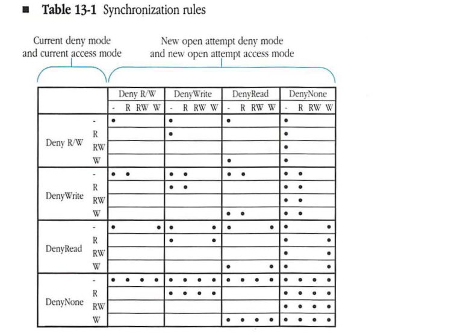

| | | Deny R/W | | | | DenyWrite | | | | DenyRead | | | | DenyNone | | | |
| :--- | :--- | :---: | :---: | :---: | :---: | :---: | :---: | :---: | :---: | :---: | :---: | :---: | :---: | :---: | :---: | :---: | :---: |
| | | - | R | RW | W | - | R | RW | W | - | R | RW | W | - | R | RW | W |
| **Deny R/W** | - | ● | | | | ● | | | | ● | | | | ● | | | |
| | R | | | | | ● | | | | | | | | ● | | | |
| | RW | | | | | | | | | | | | | ● | | | |
| | W | | | | | | | | | ● | | | | ● | | | |
| **DenyWrite** | - | ● | ● | | | ● | ● | | | ● | ● | | | ● | ● | | |
| | R | | | | | ● | ● | | | | | | | ● | ● | | |
| | RW | | | | | | | | | | | | | ● | ● | | |
| | W | | | | | | | | | ● | ● | | | ● | ● | | |
| **DenyRead** | - | ● | | | ● | ● | | | ● | ● | | | ● | ● | | | ● |
| | R | | | | | ● | | | | | | | | ● | | | ● |
| | RW | | | | | | | | | | | | | ● | | | ● |
| | W | | | | | | | | | ● | | | ● | ● | | | ● |
| **DenyNone** | - | ● | ● | ● | ● | ● | ● | ● | ● | ● | ● | ● | ● | ● | ● | ● | ● |
| | R | | | | | ● | ● | ● | ● | | | | | ● | ● | ● | ● |
| | RW | | | | | | | | | | | | | ● | ● | ● | ● |
| | W | | | | | | | | | ● | ● | ● | ● | ● | ● | ● | ● |

## Desktop database

For file server volumes, AFP provides an interface that replaces the Macintosh Finder's direct use of the **Desktop file**. This interface is necessary because the Desktop file was designed for a stand-alone environment and could not be shared by multiple users. The AFP interface to the **Desktop database** replaces the Desktop file and can be used transparently for both local and remote volumes.

The Desktop database is used by a file server to hold information needed specifically by the Finder to build its unique user interface, in which icons are used to represent objects on a disk volume. To create certain parts of this interface, the Finder uses the Desktop database to perform three functions:

* to associate documents and applications with particular icons and store the icon bitmaps
* to locate the corresponding application when a user opens a document
* to hold text comments associated with files and directories

Macintosh applications usually contain an icon that is to be displayed for the application itself as well as other icons to be displayed for documents that the application creates. These icons are stored in the application's resource fork and in the Desktop database. The Desktop database associates these icons with each file's creator (the `fdCreator` field of the `FInfo` record) and type (the `fdType` field of the `FInfo` record), which are stored as part of the file's Finder information.

The Finder allows a Macintosh user to open a document, that is, to select a file and implicitly start the application that created the file. To do this, the Desktop database maintains a mapping between the file creator and a list of the locations of each application that has that file creator associated with it. This mapping is referred to as an APPL mapping, since all Macintosh applications have a file creator of `'APPL'`. The Finder obtains the first item in the list and tries to start the application. If for some reason the application cannot be started (for example, if it is currently in use), the Finder will obtain the next application from the Desktop database's list and try that one. This list is dynamically filtered to present to the Finder only those applications for which the workstation user has the proper access rights.

The Desktop database is also a repository for the text of comments associated with files and directories on the volume. The Finder will make calls to the Desktop database to read or write these comments, which can be viewed and modified by selecting the Get Info item in the Finder's File menu. Comments are completely uninterpreted by the Desktop database.

For more information about the Macintosh Finder and the use of the Desktop file, refer to *Inside Macintosh*.

## AFP's use of ASP

The AppleTalk Filing Protocol requires a basic level of transport services for conveying its request and reply blocks between workstation and server. This section describes how AFP can be built on the AppleTalk Session Protocol (ASP). However, it should not be inferred that AFP must be built on ASP. This section is meant to be a reference for those developers who are implementing AFP on ASP.

* The AFP variable `FPError` is transmitted in ASP's `CmdResult` field, and AFP's Request Blocks are transmitted in the ASP Command Block field.
* The `FPGetSrvrInfo` request is transmitted to the server as an ASP `SPGetStatus` call. All other AFP requests, with the exception of `FPWrite` and `FPAddIcon`, are transmitted as ASP `SPCommand` calls. `FPWrite` and `FPAddIcon` are transmitted as ASP `SPWrite` calls.


- When a user wishes to log on to an AFP file server, the workstation must first issue an `SPOpenSession` call to create an ASP session between workstation and server. The first AFP request sent on that session should be `FPLogin`. When the log-on procedure has been successfully completed, an AFP session exists between workstation and server. If the log-on procedure fails, the workstation should issue an `SPCloseSession` call to tear down the ASP session.
- When a user wishes to terminate the AFP session, the workstation must first issue an FPLogout request to the server. When the reply to that request has been received, the workstation should issue an `SPCloseSession` call to tear down the ASP session.
- Note that `FPRead`, `FPWrite`, and `FPEnumerate` requests can succeed partially. That is to say, the request may return no error, but read, write, or enumerate less than was specified in the request. This can occur with `FPRead` and `FPWrite` if the request encounters a range of bytes that were locked by another user.

  These requests may, however, attempt to read, write, or enumerate more bytes than are allowed by ASP's QuantumSize. In such cases, the amount of data transferred may be truncated to QuantumSize or less. If no FPError was returned in the reply, the workstation can issue an additional FPRead, FPWrite, or FPEnumerate request to augment the original request.

  Although the workstation AFP client may have to issue several ASP calls to complete a single AFP request, the first ASP command should convey the actual size of the original AFP request, even if it is greater than QuantumSize. This allows a server to optimize its operation. Subsequent ASP commands should include sizes adjusted to reflect how much of the original request has been completed.

## An overview of AFP calls

This section provides an overview of AFP calls and how they are used. Each call obtains access to an AFP-file-system-visible entity; this section groups the calls in relation to the entity they address. These groups include server, volume, directory, file, combined directory-file, fork, and Desktop database calls.

Each AFP call is listed alphabetically and described in detail in "AFP Calls" later in this chapter.

### Server calls

A workstation client of AFP uses the following calls to get information about a file server and to open and close a session with it:

* FPGetSrvrInfo
* FPGetSrvrParms
* FPLogin
* FPLoginCont
* FPLogout
* FPMapID
* FPMapName
* FPChangePassword (AFP Version 2.0 only—optional)
* FPGetUserInfo (AFP Version 2.0 only)

Before becoming a client of AFP, a workstation uses NBP to find the internet address of the file server's session listening socket. This address is called the SAddr.

Next, the workstation uses the AFP call FPGetSrvrInfo to obtain server information. At this point, a session is still not open between the workstation and the server. The FPGetSrvrInfo call returns a block of server information containing the following server parameters: server name, machine type, AFP version strings, UAM strings, Macintosh volume icon and mask, and a bitmap of flags. These parameters are described in "AFP Calls" later in this chapter.

The workstation client selects one AFP version string and one UAM string from the lists returned by this call. The workstation then includes these strings in an FPLogin call to establish a session with the file server. A session is needed before any other AFP calls can be made to the server.

In response to the FPLogin call, the server performs user authentication and returns a session reference number (SRefNum), which is used in all calls made over this session. Depending on the chosen UAM, the entire user authentication process can involve FPLoginCont (login continue) calls to continue the authentication process with the server.

After a session is established, the workstation must obtain a list of the server's volumes. To obtain the list, the workstation sends the FPGetSrvrParms call, which returns information about the number of volumes on the server, the names of these volumes, and an indication of whether they are password-protected.

When the workstation user no longer needs to communicate with the server, the workstation client of AFP issues an FPLogout call to terminate the session.

The FPMapID and FPMapName calls are used for directory access control. The FPMapID call obtains the user or group name corresponding to a given user or group ID. The FPMapName call provides the opposite, converting a user or group name to the corresponding user or group ID.

The FPChangePassword call is used to change a user's password. The FPGetUserInfo call retrieves information about a user.

### Volume calls

AFP provides five volume-level calls:

* FPOpenVol
* FPCloseVol
* FPGetVolParms
* FPSetVolParms
* FPFlush

After obtaining the volume names through the FPGetSrvrParms call, the workstation client of AFP makes an FPOpenVol call for each volume to which it wants to gain access. If the volume has a password, it must be supplied at this time. The call returns the volume parameters asked for in the call, including the Volume ID.

The Volume ID is used in all subsequent calls to identify the volume to which the calls apply. The Volume ID remains a valid identifier either until the session is terminated with the FPLogout call or until an FPCloseVol call is made.

After obtaining a volume's Volume ID, the workstation client can obtain the volume's parameters by making an FPGetVolParms call. The workstation client can also change the volume's parameters by issuing an FPSetVolParms call. (Volume parameters are described in "File System Structure" earlier in this chapter.)

The FPFlush call requests that the server flush (write to its disk) any data associated with a particular volume.


### Directory calls

AFP provides five directory-level calls:

* FPSetDirParms
* FPOpenDir
* FPCloseDir
* FPEnumerate
* FPCreateDir

The FPSetDirParms call allows the workstation client to modify a directory's parameters. To obtain a directory's parameters from the file server, the workstation client uses the FPGetFileDirParms call, which is described under "Combined Directory-File Calls" later in this chapter. (For a list and description of directory parameters, see "Directories and Files" earlier in this chapter.)

The workstation client uses the FPOpenDir call to open a directory on a variable Directory ID volume and to retrieve its Directory ID. The Directory ID is used in subsequent calls to enumerate the directory or to obtain access to its offspring. For variable Directory ID volumes, the FPOpenDir call is the only way to retrieve the Directory ID. Using an FPGetFileDirParms or an FPEnumerate call to retrieve the Directory ID on such volumes returns an error.

On a fixed Directory ID volume, using the FPGetFileDirParms or an the FPEnumerate call is the preferred way to obtain a Directory ID, although using the FPOpenDir call also works.

The workstation client can close directories on variable Directory ID volumes by making an FPCloseDir call, which invalidates the corresponding Directory ID.

The workstation client uses the FPEnumerate call to list, or enumerate, the files and directories contained within a specified directory. In reply to this call, the server returns a list of directory or file parameters corresponding to these offspring.

Directories are created with the FPCreateDir call.


### File calls

AFP provides three file-level calls:

*   FPSetFileParms
*   FPCreateFile
*   FPCopyFile (optional)

The workstation client of AFP uses the FPSetFileParms call to modify a specified file's parameters, the FPCreateFile call to create a file, and the FPCopyFile call to copy a file that exists on a volume managed by a server to any other volume managed by that server. To obtain a specified file's parameters, the workstation client uses the FPGetFileDirParms call, discussed next.

### Combined directory-file calls

AFP provides five calls that operate on both files and directories:

*   FPGetFileDirParms
*   FPSetFileDirParms
*   FPRename
*   FPDelete
*   FPMoveAndRename

The workstation client of AFP uses the FPGetFileDirParms call to retrieve the parameters associated with a given file or directory. When it uses this call, the workstation does not need to specify whether the CNode is a file or a directory; the file server indicates the CNode's type in response to this call.

The FPSetFileDirParms call is used to set the parameters of a file or directory. When the workstation client uses this call, it need not specify whether the object is a file or a directory. This call allows the workstation to set only those parameters that are common to both types of CNodes.

The FPRename call is used to rename files and directories.

The FPDelete call is used to delete a file or directory. A file can be deleted only if it is not open; a directory can be deleted only if it is empty.

The FPMoveAndRename call is used to move a file or a directory from one parent directory to another on the same volume. The moved CNode can be renamed at the same time.

### Fork calls

AFP provides eight fork-level calls:

*   FPGetForkParms
*   FPSetForkParms
*   FPOpenFork
*   FPRead
*   FPWrite
*   FPFlushFork
*   FPByteRangeLock
*   FPCloseFork

The workstation client of AFP uses the FPGetForkParms call to read a fork's parameters.

The FPSetForkParms call is used to modify a fork's parameters.

The FPOpenFork call is used to open either of an existing file's forks. This call returns an open fork reference number (OForkRefNum), which is used in subsequent calls to this open fork.

The FPRead call is used to read the contents of the fork.

The FPWrite call is used to write to a fork.

The FPFlushFork call is used to request that the server write to its disk any of the fork's data that is in the server's internal buffers.

The FPByteRangeLock call is used to lock ranges of bytes in the fork. Locking a range of bytes prevents other workstation clients from reading or writing data in that part of the fork. Locks allow multiple users to share a file's open fork. If a workstation client locks a byte range, that range is reserved for exclusive manipulation by the client placing the lock.

The FPCloseFork call is used to close an open fork. This call invalidates the OForkRefNum that was assigned when the fork was opened.

### Desktop database calls

A workstation client of AFP uses the following calls to read and write information stored in the server's Desktop database.

- FPOpenDT
- FPCloseDT
- FPAddIcon
- FPGetIcon
- FPGetIconInfo
- FPAddAPPL
- FPRemoveAPPL
- FPGetAPPL
- FPAddComment
- FPRemoveComment
- FPGetComment

Before any other Desktop database calls can be made, the workstation client of AFP must make an `FPOpenDT` call. This call returns a reference number to be used in all subsequent calls.

When access to the Desktop database is no longer needed, the workstation client makes an `FPCloseDT` call.

`FPAddIcon` adds a new icon bitmap to the Desktop database.

`FPGetIcon` retrieves the bitmap for a given icon as specified by its file creator and type.

`FPGetIconInfo` retrieves a description of an icon. This call can be used to determine the set of icons associated with a given application. Successive `FPGetIconInfo` calls will return information on all icons associated with a given file creator.

`FPAddAPPL` adds an APPL mapping for the specified application and its file creator.

`FPRemoveAPPL` removes the specified application from the list of APPL mappings corresponding to its file creator. It is the workstation client's responsibility to add and remove APPL mappings for applications that are added to or removed from the volume, respectively. For applications that are moved or renamed, the workstation client should remove the old APPL mapping before the operation and add a new APPL mapping with the updated information after the operation has been completed successfully.

`FPGetAPPL` returns the next APPL mapping in the Desktop database's list of applications corresponding to a given file creator.

`FPAddComment` stores a comment string associated with a particular file or directory on the volume. When adding a comment for a file or directory that already has an associated comment, the existing comment is replaced.

`FPRemoveComment` removes the comment associated with a particular file or directory.

`FPGetComment` retrieves the comment associated with a particular file or directory.

## AFP calls

This section describes AFP calls, which are listed alphabetically. This section is intended as a reference source, allowing the reader to look up call descriptions as necessary.

Each call description contains the following information:

* a list of the input and output parameters
* the result codes provided by the call
* an explanation of how the call works
* the access rights required to use the call
* an illustration of the call's block format

The workstation client of AFP sends each AFP call to the server in the form of a request block, to which the server responds with the 4-byte FPError result code plus a reply block.

The FPWrite and FPAddIcon calls are exceptions in that the data to be written is not included in the command block but is passed by the underlying transport mechanism (ASP or its equivalent) as a separate block.

For every AFP call, the underlying transport mechanism must return an FPError result code. The FPError values for each call are listed and explained.

Some result codes can be returned by all AFP calls; the following result codes are not included in the descriptions of AFP calls.

| Result code | Description |
| :--- | :--- |
| NoErr | file server returns this value for every call that is successfully completed |
| UserNotAuth | server returns this value to indicate that the user has not yet been properly authenticated |
| MiscErr | server uses this value to map errors and message codes that don't have an equivalent AFP result code (for example, an error reading a disk sector) |

For calls that return an empty reply block, the reply block is not shown.

Many AFP calls require a bitmap to be passed along with a block of parameters packed in bitmap order. **Bitmap order** means that the parameter corresponding to the least-significant bit that is set in the bitmap is packed first, followed by the parameter corresponding to the next most-significant bit that is set, and ending with the parameter corresponding to the most-significant bit that is set.

AFP call descriptions use the following abbreviations and definitions to describe call parameters:

| Abbreviation | Description |
| :--- | :--- |
| bit | a single binary digit |
| byte | an 8-bit quantity |
| EntityAddr | a network-visible entity's internet address; its size and format are network-dependent |
| int | a 2-byte quantity |
| long | a 4-byte quantity |
| ResType | a 4-byte signature used in a Macintosh Finder information field to specify a file creator or file type |
| string | a group of up to 255 bytes, each representing an ASCII character; this group is preceded by a string-length byte, which is a value representing the number of characters in the string not including the string-length byte |

All numerical fields represent signed numbers unless otherwise indicated.

The next page describes the format of the rest of the chapter.


## FPCall

A one-sentence, concise description of the call is given here.

### Inputs

All input parameters are listed here, with a description of each. Numbers next to a list of parameters indicate the bit number of a corresponding bit in a multibyte field.

### Outputs

All output parameters are listed here, with a description of each. Numbers next to a list of parameters indicate the bit number of a corresponding bit in a multibyte field.

### Result codes

The values of FPError that might be returned are listed here, with an explanation of each. For brevity, some values of FPError (those that are common to most or all calls) are not shown here.

### Algorithm

A detailed description of the algorithm used to service this request is given here.

### Rights

The access privileges required to make this request are listed here. The absence of this section signifies that no special access privileges are required.

### Notes

This section provides additional notes about what is required to make this request, certain actions that the call does not do, or side effects. It is a catch-all for any information that does not belong in any other section. Not all call descriptions include this section.

### Block format

A pictorial description of the Command block and Reply block is displayed here. If the call returns only an FPError parameter, no Reply block will be shown. In some cases, this section will also include pictorial descriptions of some of the fields or parameters relevant to this call.


## FPAddAPPL

This request adds an APPL mapping to the Desktop database.

### Inputs

| Field | Description |
| :--- | :--- |
| `SRefNum (int)` | session refnum |
| `DTRefNum (int)` | Desktop database refnum |
| `Directory ID (long)` | ancestor directory identifier |
| `FileCreator (ResType)` | file creator of application corresponding to APPL mapping being added |
| `APPL Tag (long)` | a user-defined tag stored with the APPL mapping |
| `PathType (byte)` | indicates whether Pathname is composed of long names or short names:<br>1 = short names<br>2 = long names |
| `Pathname (string)` | pathname to the application corresponding to APPL mapping being added |

### Outputs

| Field | Description |
| :--- | :--- |
| `FPError (long)` | |

### Result codes

| Code | Description |
| :--- | :--- |
| `ParamErr` | Session refnum or Desktop database refnum is unknown; pathname is bad. |
| `ObjectNotFound` | Input parameters do not point to an existing file. |
| `AccessDenied` | User does not have the rights listed below. |
| `ObjectTypeErr` | Input parameters point to a directory. |

### Algorithm

An APPL mapping is added to the volume's Desktop database for the specified application and its location and its file creator. If an APPL mapping for the same application (same filename, same directory, and same FileCreator) already exists, it is replaced.

### Rights

The user must have search or write access to all ancestors except the application's parent directory, as well as write access to the parent directory.

### Notes

There may be more than one application in the Desktop database's list of APPL mappings for the given FileCreator. To distinguish among them, the APPL Tag parameter is stored with each APPL mapping. The tag information might be used to decide among these multiple applications. It is not interpreted by the Desktop database.

The user must have previously called `FPOpenDT` for the corresponding volume. In addition, the application must be present in the specified directory before this request is issued.

### Block format

#### Request

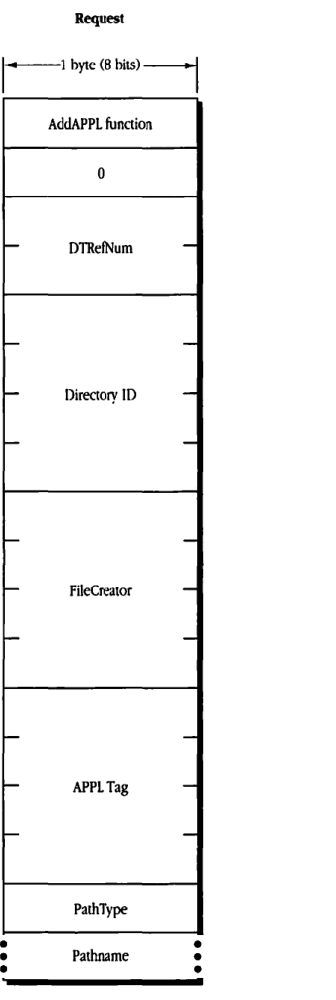

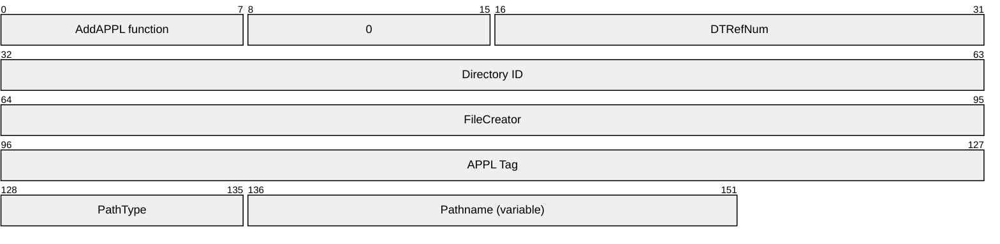
```mermaid
packet-beta
0-7: "AddAPPL function"
8-15: "0"
16-31: "DTRefNum"
32-63: "Directory ID"
64-95: "FileCreator"
96-127: "APPL Tag"
128-135: "PathType"
136-151: "Pathname (variable)"
```

| Field | Bit offset | Width (bits) | Description |
|---|---|---|---|
| AddAPPL function | 0 | 8 | The FPAddAPPL function code. |
| 0 | 8 | 8 | Reserved, must be 0. |
| DTRefNum | 16 | 16 | Desktop database reference number. |
| Directory ID | 32 | 32 | Directory ID of the application's parent directory. |
| FileCreator | 64 | 32 | File creator of the application. |
| APPL Tag | 96 | 32 | Application tag. |
| PathType | 128 | 8 | Type of pathname. |
| Pathname | 136 | Variable | The pathname of the application. |

## FPAddComment

This request adds a comment for a file or directory to the volume's Desktop database.

### Inputs

| Field | Description |
| :--- | :--- |
| SRefNum (int) | session refnum |
| DTRefNum (int) | Desktop database refnum |
| Directory ID (long) | directory identifier |
| PathType (byte) | indicates whether Pathname is composed of long names or short names:<br>1 = short names<br>2 = long names |
| Pathname (string) | pathname to the file or directory to which the comment will be associated |
| Comment (string) | comment data to be associated with specified file or directory |

### Outputs

| Field | Description |
| :--- | :--- |
| FPError (long) | |

### Result codes

| Code | Description |
| :--- | :--- |
| ParamErr | Session refnum or Desktop database refnum is unknown; pathname is bad. |
| ObjectNotFound | Input parameters do not point to an existing file or directory. |
| AccessDenied | User does not have the rights listed below. |

### Algorithm

The comment data is stored in the Desktop database and associated with the specified file or directory. If the comment length is greater than 199 bytes, the comment will be truncated to 199 bytes and no error will be returned.

### Rights

To add a comment for a directory that is not empty, the user needs search access to all ancestors including the parent directory, as well as write access to the parent directory. To add a comment for an empty directory, the user needs search or write access to all ancestors except the parent directory, as well as write access to the parent directory.

To add a comment for a file that is not empty, the user needs search access to all ancestors except the parent directory, as well as read and write access to the parent. To add a comment for an empty file, the user needs search or write access to all ancestors except the parent directory, as well as write access to the parent.

### Notes

The user must have previously called FPOpenDT for the corresponding volume. In addition, the specified file or directory must be present before this request is issued.

### Block format

#### Request

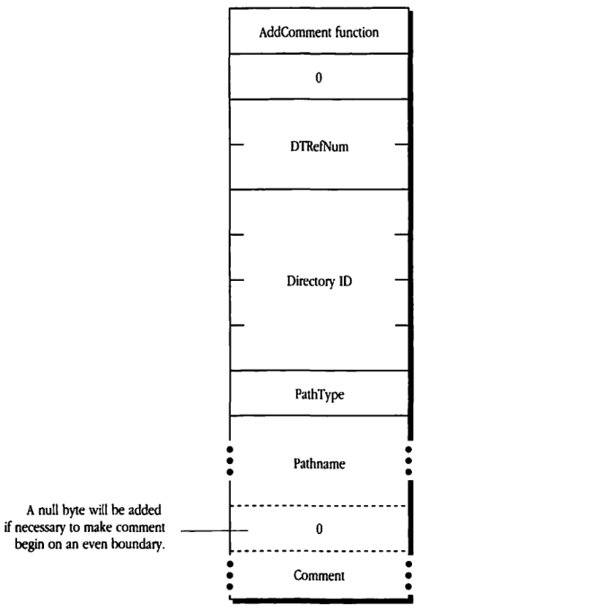

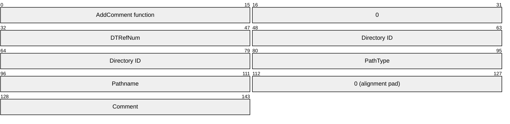
```mermaid
packet-beta
0-15: "AddComment function"
16-31: "0"
32-47: "DTRefNum"
48-79: "Directory ID"
80-95: "PathType"
96-111: "Pathname"
112-127: "0 (alignment pad)"
128-143: "Comment"
```

| Field | Bit offset | Width (bits) | Description |
| :--- | :--- | :--- | :--- |
| AddComment function | 0 | 16 | The AFP function code for AddComment. |
| 0 | 16 | 16 | Reserved; must be zero. |
| DTRefNum | 32 | 16 | The desktop database reference number. |
| Directory ID | 48 | 32 | The directory ID of the file or directory. |
| PathType | 80 | 16 | The type of the pathname (short or long name). |
| Pathname | 96 | Variable | The pathname of the file or directory. |
| 0 | Variable | 8 | A null byte added if necessary to make comment begin on an even boundary. |
| Comment | Variable | Variable | The comment text to be added. |

A null byte will be added if necessary to make comment begin on an even boundary.

## FPAddIcon

This request adds an icon bitmap to the volume's Desktop database.

### Inputs

* `SRefNum (int)`: session refnum
* `DTRefNum (int)`: Desktop database refnum
* `FileCreator (ResType)`: file creator associated with icon
* `FileType (ResType)`: file type associated with icon
* `IconType (byte)`: type of icon being added
* `IconTag (long)`: tag information to be stored with the icon
* `BitmapSize (int)`: size of the bitmap for this icon

### Outputs

* `FPError (long)`

### Result codes

* `ParamErr`: Session refnum or Desktop database refnum is unknown.
* `IconTypeError`: New icon size is different from existing icon's size.

### Algorithm

A new icon is added to the Desktop database for the specified FileCreator and FileType. If an icon of the same FileCreator, FileType, and IconType already exists, the icon is replaced. However, if the new icon's size is different from the old icon, the server returns an IconTypeError result code.

### Notes

The user must have previously called `FPOpenDT` for the corresponding volume. The command block includes all input parameters except for the icon bitmap, which is sent to the server in an intermediate exchange of ASP packets.


### Block format

#### Request

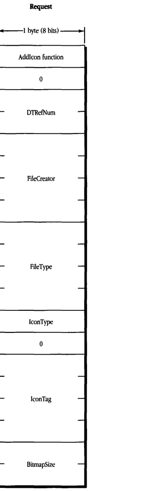

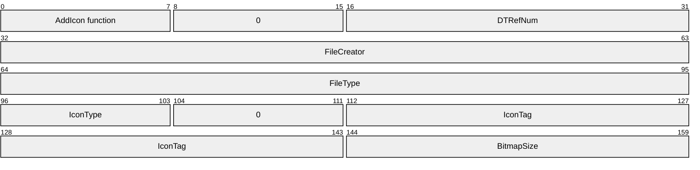
```mermaid
packet-beta
0-7: "AddIcon function"
8-15: "0"
16-31: "DTRefNum"
32-63: "FileCreator"
64-95: "FileType"
96-103: "IconType"
104-111: "0"
112-143: "IconTag"
144-159: "BitmapSize"
```

| Field | Bit offset | Width (bits) | Description |
| :--- | :--- | :--- | :--- |
| AddIcon function | 0 | 8 | The function code for AddIcon. |
| (Reserved) | 8 | 8 | Reserved, must be 0. |
| DTRefNum | 16 | 16 | Desktop database reference number. |
| FileCreator | 32 | 32 | Creator code of the file. |
| FileType | 64 | 32 | Type code of the file. |
| IconType | 96 | 8 | Type of the icon. |
| (Reserved) | 104 | 8 | Reserved, must be 0. |
| IconTag | 112 | 32 | Icon tag. |
| BitmapSize | 144 | 16 | Size of the icon bitmap. |

## FPByteRangeLock

This request locks or unlocks a specified range of bytes within an open fork.

### Inputs

| Field | Description |
| :--- | :--- |
| SRefNum (*int*) | session refnum |
| OForkRefNum (*int*) | open fork refnum |
| Offset (*long*) | offset to the first byte of the range to be locked or unlocked (can be negative if Start/EndFlag equals End) |
| Length (*long*) | number of bytes to be locked or unlocked (a signed, positive long integer; cannot be negative except for the special value $FFFFFFFF). |
| UnlockFlag (*bit*) | flag to indicate whether to lock or unlock range:<br>0 = lock<br>1 = unlock |
| Start/EndFlag (*bit*) | flag indicating whether the Offset field is relative to the beginning or end of the fork (this flag is valid only when locking a range):<br>0 = Start (relative to beginning of fork)<br>1 = End (relative to end of fork) |

### Outputs

| Field | Description |
| :--- | :--- |
| FPError (*long*) | |
| RangeStart (*long*) | number of the first byte of the range just locked; this number is valid only when returned from a successful lock command |

### Result codes

| Code | Description |
| :--- | :--- |
| ParamErr | Session refnum or open fork refnum is unknown; a combination of Start/EndFlag and Offset specifies a range starting before the 0th byte. |
| LockErr | Some or all of the requested range is locked by another user. |
| NoMoreLocks | Server's maximum lock count has been reached. |
| RangeOverlap | User tried to lock some or all of a range that the user already locked. |
| RangeNotLocked | User tried to unlock a range that was locked by another user or not locked at all. |


### Block format

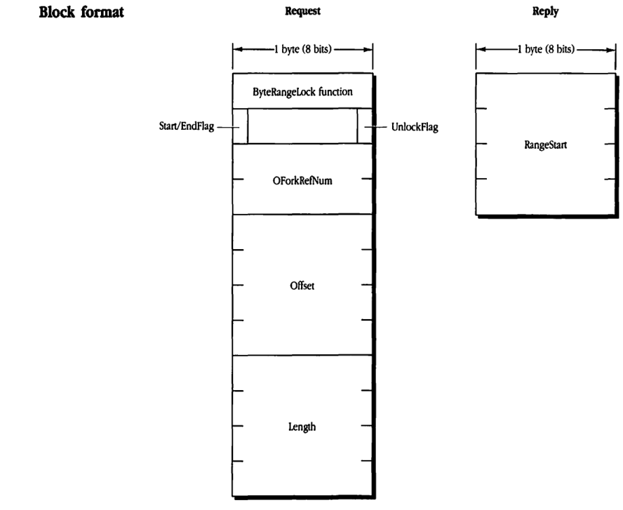

#### Request Block

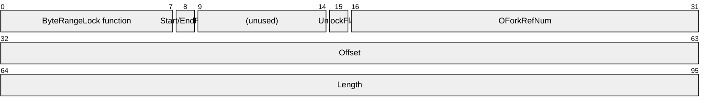
```mermaid
packet-beta
0-7: "ByteRangeLock function"
8: "Start/EndFlag"
9-14: "(unused)"
15: "UnlockFlag"
16-31: "OForkRefNum"
32-63: "Offset"
64-95: "Length"
```

| Field | Bit offset | Width (bits) | Description |
| :--- | :--- | :--- | :--- |
| ByteRangeLock function | 0 | 8 | Function code for the ByteRangeLock operation. |
| Start/EndFlag | 8 | 1 | Flag indicating the start or end of the range. |
| (unused) | 9 | 6 | Reserved / unused bits. |
| UnlockFlag | 15 | 1 | Flag indicating whether to unlock the range. |
| OForkRefNum | 16 | 16 | Open Fork Reference Number. |
| Offset | 32 | 32 | The offset at which the byte range starts. |
| Length | 64 | 32 | The length of the byte range. |

#### Reply Block

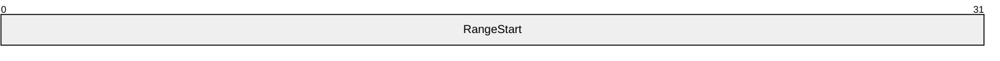
```mermaid
packet-beta
0-31: "RangeStart"
```

| Field | Bit offset | Width (bits) | Description |
| :--- | :--- | :--- | :--- |
| RangeStart | 0 | 32 | The starting offset of the range that was locked. |


## FPChangePassword

This request allows users to change their passwords. It is new in AFP Version 2.0, and it is optional and may not be supported by all servers.

### Inputs

| Input | Description |
| :--- | :--- |
| SRefNum (int) | session refnum |
| UAM (string) | a string indicating which user authentication method to use |

### Outputs

| Output | Description |
| :--- | :--- |
| FPError (long) | |

### Result codes

| Code | Description |
| :--- | :--- |
| UserNotAuth | UAM failed (specified old password doesn't match), or no user logged in yet on this session. |
| BadUAM | UAM specified is not one supported with FPChangePassword. |
| CallNotSupported | Workstation is using AFP Version 1.1; call is not supported by this server. |
| AccessDenied | FPChangePassword is not enabled for this user. |
| ParamErr | User name is null, is greater than 31 characters, or does not exist. |

### Algorithm

If the UAM specified is 'Cleartxt  Passwrd', the workstation sends the server its user name plus its old and new passwords in cleartext. The server looks up the password for that user; if it matches the old password sent in the packet, the new password will be saved for that user.

If the UAM specified is 'Randnum  Exchange', the workstation sends the server its user name, its old password encrypted with its new password, and its new password encrypted with its old password. The server looks up the password for that user, uses that password as a key to decrypt the new password, and uses the result as a key to decrypt the old password. If the final result matches what the server knew to be the old password, then the new password will be saved for that user.

Any password less than 8 bytes long will be padded (suffixed) with null bytes to its full 8-byte length.

### Rights

The server need not support this call (see the FPGetSrvrInfo call). In addition, the user may not have been given the ability to change a password.


### Notes

The granting of the ability to change a password is an administrative function and is outside the scope of this protocol specification.

As in FPLogin, DES is used to encrypt and decrypt passwords if the specified UAM is 'Randnum Exchange'.

### Block format

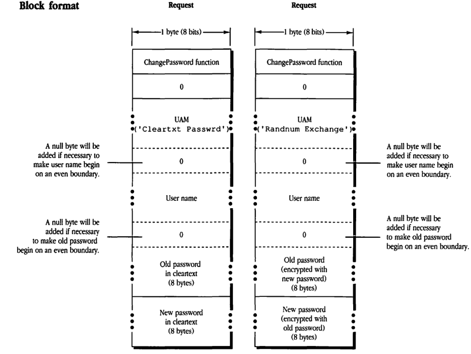

#### Request (Cleartxt Passwrd)

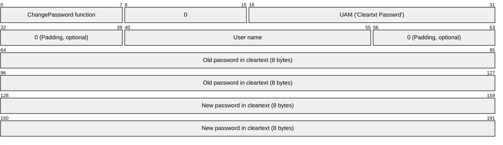
```mermaid
packet-beta
0-7: "ChangePassword function"
8-15: "0"
16-31: "UAM ('Cleartxt Passwrd')"
32-39: "0 (Padding, optional)"
40-55: "User name"
56-63: "0 (Padding, optional)"
64-127: "Old password in cleartext (8 bytes)"
128-191: "New password in cleartext (8 bytes)"
```

| Field | Bit offset | Width (bits) | Description |
|---|---|---|---|
| ChangePassword function | 0 | 8 | The function code for the ChangePassword operation. |
| Reserved | 8 | 8 | Must be 0. |
| UAM | 16 | Variable | Set to 'Cleartxt Passwrd'. |
| Padding | Variable | 0 or 8 | A null byte will be added if necessary to make user name begin on an even boundary. |
| User name | Variable | Variable | The name of the user. |
| Padding | Variable | 0 or 8 | A null byte will be added if necessary to make old password begin on an even boundary. |
| Old password in cleartext | Variable | 64 | 8 bytes of the old password in cleartext. |
| New password in cleartext | Variable | 64 | 8 bytes of the new password in cleartext. |

#### Request (Randnum Exchange)

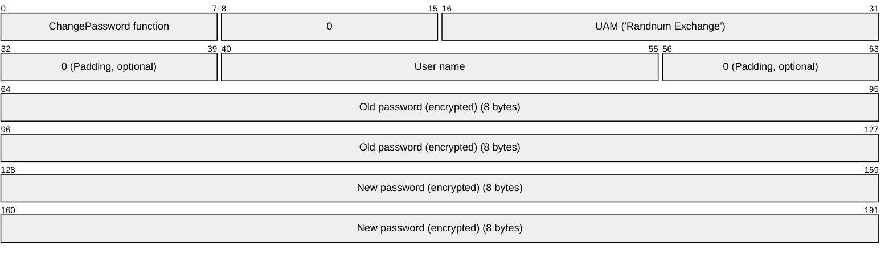
```mermaid
packet-beta
0-7: "ChangePassword function"
8-15: "0"
16-31: "UAM ('Randnum Exchange')"
32-39: "0 (Padding, optional)"
40-55: "User name"
56-63: "0 (Padding, optional)"
64-127: "Old password (encrypted) (8 bytes)"
128-191: "New password (encrypted) (8 bytes)"
```

| Field | Bit offset | Width (bits) | Description |
|---|---|---|---|
| ChangePassword function | 0 | 8 | The function code for the ChangePassword operation. |
| Reserved | 8 | 8 | Must be 0. |
| UAM | 16 | Variable | Set to 'Randnum Exchange'. |
| Padding | Variable | 0 or 8 | A null byte will be added if necessary to make user name begin on an even boundary. |
| User name | Variable | Variable | The name of the user. |
| Padding | Variable | 0 or 8 | A null byte will be added if necessary to make old password begin on an even boundary. |
| Old password (encrypted) | Variable | 64 | 8 bytes of the old password, encrypted with the new password. |
| New password (encrypted) | Variable | 64 | 8 bytes of the new password, encrypted with the old password. |


# FPCloseDir

This request closes a directory and invalidates its directory identifier.

### Inputs

| | |
| :--- | :--- |
| *SRefNum (int)* | session refnum |
| *Volume ID (int)* | volume identifier |
| *Directory ID (long)* | directory identifier |

### Outputs

| | |
| :--- | :--- |
| *FPError (long)* | |

### Result codes

| | |
| :--- | :--- |
| *ParamErr* | Session refnum, volume identifier, or directory identifier is unknown. |

### Algorithm

The FPCloseDir request invalidates the Directory ID.

### Notes

This request should be used only for variable Directory ID volumes. The user must have previously called FPOpenVol for this volume and FPOpenDir for this directory.

### Block format

**Request**

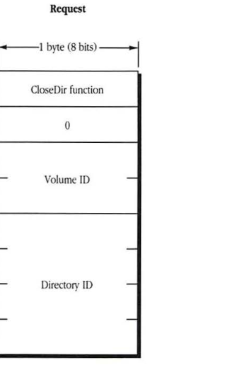

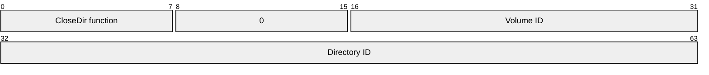
```mermaid
packet-beta
0-7: "CloseDir function"
8-15: "0"
16-31: "Volume ID"
32-63: "Directory ID"
```

| Field | Bit offset | Width (bits) | Description |
| :--- | :--- | :--- | :--- |
| CloseDir function | 0 | 8 | The function code for FPCloseDir. |
| 0 | 8 | 8 | Reserved, must be 0. |
| Volume ID | 16 | 16 | The volume identifier. |
| Directory ID | 32 | 32 | The directory identifier. |


# FPCloseDT

This request informs the server that the workstation no longer needs the volume's Desktop database.

### Inputs
*SRefNum (int)* session refnum
*DTRefNum (int)* Desktop database refnum

### Outputs
*FPError (long)*

### Result codes
*ParamErr* Session refnum or Desktop database refnum is unknown.

### Algorithm
The server invalidates the `DTRefNum`.

### Notes
The user must first have made a successful FPOpenDT call.

### Block format
Request

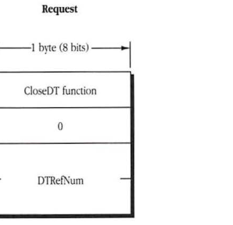

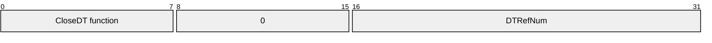
```mermaid
packet-beta
0-7: "CloseDT function"
8-15: "0"
16-31: "DTRefNum"
```

| Field | Bit offset | Width (bits) | Description |
| :--- | :--- | :--- | :--- |
| CloseDT function | 0 | 8 | The function code for FPCloseDT. |
| 0 | 8 | 8 | Reserved, must be 0. |
| DTRefNum | 16 | 16 | Desktop database refnum. |


# FPCloseFork

This request closes a fork that was opened by FPOpenFork.

### Inputs

| | |
| :--- | :--- |
| SRefNum (int) | session refnum |
| OForkRefNum (int) | open fork refnum |

### Outputs

| | |
| :--- | :--- |
| FPError (long) | |

### Result codes

| | |
| :--- | :--- |
| ParamErr | Session refnum or open fork refnum is unknown. |

### Algorithm

The server flushes and then closes the open fork, invalidating the OForkRefNum. If the fork had been written to, the file's modification date will be set to the server's clock at this time.

### Block format

#### Request

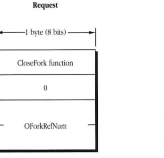

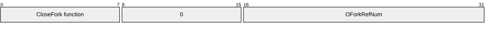
```mermaid
packet-beta
0-7: "CloseFork function"
8-15: "0"
16-31: "OForkRefNum"
```

| Field | Bit offset | Width (bits) | Description |
| :--- | :--- | :--- | :--- |
| CloseFork function | 0 | 8 | The command code for FPCloseFork. |
| 0 | 8 | 8 | Reserved, must be 0. |
| OForkRefNum | 16 | 16 | The open fork reference number. |


# FPCloseVol

This request informs the server that the workstation no longer needs the volume.

### Inputs

| | |
|---|---|
| SRefNum (int) | session refnum |
| Volume ID (int) | volume identifier |

### Outputs

| | |
|---|---|
| FPError (long) | |

### Result codes

| | |
|---|---|
| ParamErr | Session refnum or volume identifier is unknown. |

### Algorithm

The FPCloseVol request invalidates the volume identifier. After making this call, the user can make no further calls to this volume without first making another FPOpenVol call.

### Notes

The user must have previously issued an FPOpenVol call for this volume.

### Block format

Request

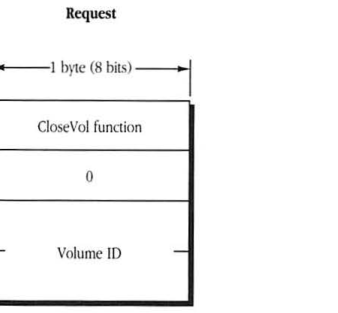

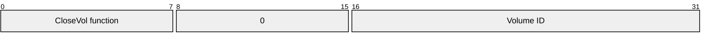
```mermaid
packet-beta
0-7: "CloseVol function"
8-15: "0"
16-31: "Volume ID"
```

| Field | Bit offset | Width (bits) | Description |
|---|---|---|---|
| CloseVol function | 0 | 8 | The function code for FPCloseVol. |
| 0 | 8 | 8 | Reserved, must be 0. |
| Volume ID | 16 | 16 | The volume identifier. |


# FPCopyFile

This request copies a file from one location to another on the same file server. It is optional and may not be supported by all servers. Text in **boldface** applies to **AFP Version 2.0 only**.

### Inputs

* SRefNum (int) session refnum
* Source Volume ID (int) source volume identifier
* Source Directory ID (long) source ancestor directory identifier
* Source PathType (byte) indicates whether Source Pathname is composed of long names or short names:
    * 1 = short names
    * 2 = long names
* Source Pathname (string) pathname of the file to be copied (cannot be null)
* Dest Volume ID (int) destination volume identifier
* Dest Directory ID (long) destination ancestor directory identifier
* Dest PathType (byte) indicates whether Dest Pathname is composed of long names or short names (same values as Source PathType)
* Dest Pathname (string) pathname to the destination parent directory (may be null)
* NewType (byte) indicates whether NewName is a long name or a short name (same values as Source PathType)
* NewName (string) name to be given to the copy (may be null)

### Outputs

* FPError (long)


### Result codes

| | |
|---|---|
| *ParamErr* | Session refnum, volume identifier, or pathname type is unknown; pathname or NewName is bad. |
| *ObjectNotFound* | The source file does not exist; ancestor directory is unknown. |
| *ObjectExists* | A file or directory by the name NewName already exists in the destination parent directory. |
| *AccessDenied* | User does not have the right to read the file or to write to the destination; in AFP 1.1, the destination volume is ReadOnly. |
| *VolLocked* | **In AFP 2.0, the destination volume is ReadOnly.** |
| *CallNotSupported* | Call is not supported by this server. |
| *DenyConflict* | The file cannot be opened for Read, DenyWrite. |
| *DiskFull* | No more space exists on the destination volume. |
| *ObjectTypeErr* | Source parameters point to a directory. |

### Algorithm

FPCopyFile copies a file to a new location on the server. The source and destination can be on the same or on different volumes.

The server tries to open the source file for Read, DenyWrite access. If this fails, the server returns a DenyConflict result code to the workstation. If the server successfully opens the file, it copies the file to the directory specified by the destination parameters.

The copy is given the name specified by the NewName parameter. If NewName is null, the server gives the copy the same name as the original. The file's other name (long or short) is generated as described in "Catalog Node Names" earlier in this chapter. A unique file number is assigned to the file. The server also sets the file's Parent ID to the Directory ID of the destination parent directory. All other file parameters remain the same as the source file's parameters. The modification date of the destination parent directory is set to the server's clock.

### Rights

The user must have search access to all ancestors of the source file, except the source parent directory, and read access to the source parent directory. Further, the user must have search or write access to all ancestors of the destination file, except the destination parent directory, and write access to the destination parent directory.

### Notes

The user must have previously issued the FPOpenVol request for both the source and destination volumes.

### Block format

#### Request

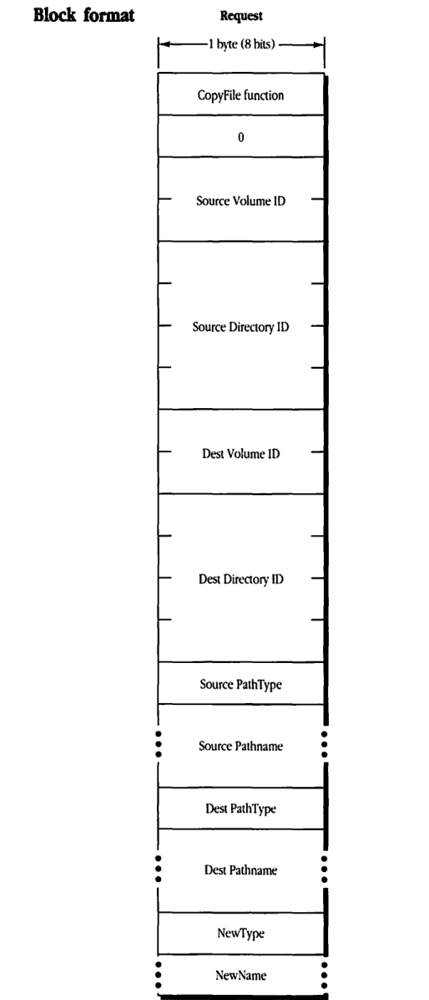

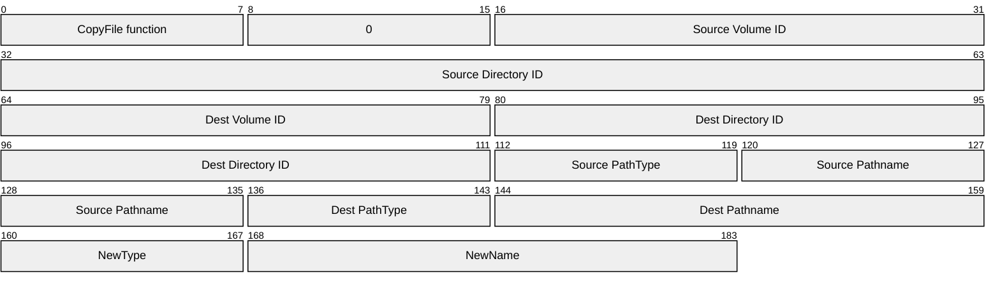
```mermaid
packet-beta
0-7: "CopyFile function"
8-15: "0"
16-31: "Source Volume ID"
32-63: "Source Directory ID"
64-79: "Dest Volume ID"
80-111: "Dest Directory ID"
112-119: "Source PathType"
120-135: "Source Pathname"
136-143: "Dest PathType"
144-159: "Dest Pathname"
160-167: "NewType"
168-183: "NewName"
```

| Field | Bit offset | Width (bits) | Description |
|---|---|---|---|
| CopyFile function | 0 | 8 | The function code for CopyFile. |
| Reserved | 8 | 8 | Set to 0. |
| Source Volume ID | 16 | 16 | The ID of the source volume. |
| Source Directory ID | 32 | 32 | The ID of the source directory. |
| Dest Volume ID | 64 | 16 | The ID of the destination volume. |
| Dest Directory ID | 80 | 32 | The ID of the destination directory. |
| Source PathType | 112 | 8 | Type of the source pathname. |
| Source Pathname | 120 | variable | The source pathname. |
| Dest PathType | variable | 8 | Type of the destination pathname. |
| Dest Pathname | variable | variable | The destination pathname. |
| NewType | variable | 8 | The type of the new file name. |
| NewName | variable | variable | The new name for the file. |


## FPCreateDir

This request creates a new directory. Text in **boldface** applies to **AFP Version 2.0 only**.

### Inputs

| | |
| :--- | :--- |
| *SRefNum (int)* | session refnum |
| *Volume ID (int)* | volume identifier |
| *Directory ID (long)* | ancestor directory identifier |
| *PathType (byte)* | indicates whether Pathname is composed of long names or short names:<br>1 = short names<br>2 = long names |
| *Pathname (string)* | pathname, including name of new directory (cannot be null) |

### Outputs

| | |
| :--- | :--- |
| *FPError (long)* | |
| *New Directory ID (long)* | identifier of new directory |

### Result codes

| | |
| :--- | :--- |
| *ParamErr* | Session refnum, volume identifier, or pathname type is unknown; pathname is null or bad. |
| *ObjectNotFound* | Ancestor directory is unknown |
| *ObjectExists* | A file or directory already exists by that name. |
| *AccessDenied* | User does not have the rights listed below; in AFP 1.1, the volume is ReadOnly. |
| **VolLocked** | **In AFP 2.0, the destination volume is ReadOnly.** |
| *FlatVol* | The volume is flat and does not support directories. |
| *DiskFull* | No more space exists on the volume. |

### Algorithm

If the volume is hierarchical, an empty directory is created with the name specified in Pathname. The file server assigns the directory a unique (per volume) New Directory ID. Its owner ID is set to the user ID of the user making the call, and its group ID is set to the ID of the user's primary group, if one has been specified for the user.

Access rights for the directory are initially set to read, write, and search for the owner, with no rights for the group or world. Finder information is set to 0, and all directory attributes are initially cleared. The directory’s creation date and modification date, and the modification date of the parent directory, are set to the server’s clock. The directory’s backup date is set to `$80000000`, signifying that this directory has never been backed up.

The directory’s other name (long or short) is generated as described in “Catalog Node Names” earlier in this chapter.

### Rights

The user must have search or write access to all ancestors, except this directory’s parent directory, as well as write access to the parent directory.

### Notes

The user must have previously called FPOpenVol for this volume.

### Block format

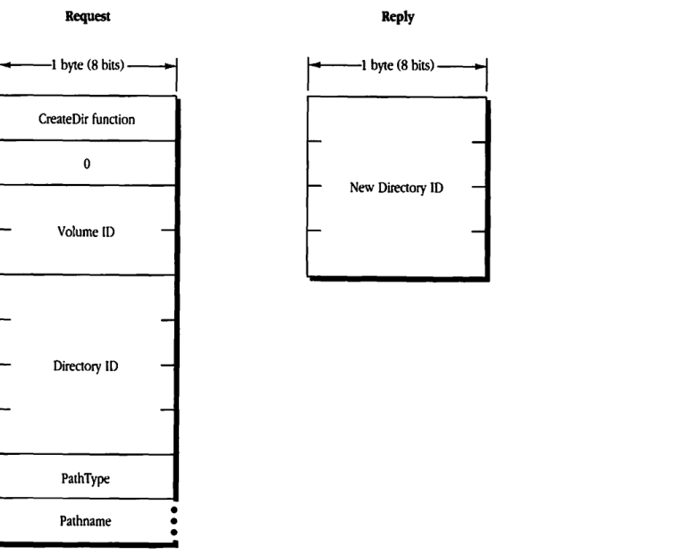

#### Request

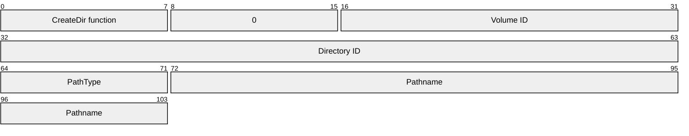
```mermaid
packet-beta
0-7: "CreateDir function"
8-15: "0"
16-31: "Volume ID"
32-63: "Directory ID"
64-71: "PathType"
72-103: "Pathname"
```

| Field | Bit offset | Width (bits) | Description |
| :--- | :--- | :--- | :--- |
| CreateDir function | 0 | 8 | The function code for FPCreateDir. |
| 0 | 8 | 8 | Reserved; must be 0. |
| Volume ID | 16 | 16 | The volume ID of the volume where the directory is to be created. |
| Directory ID | 32 | 32 | The parent directory ID. |
| PathType | 64 | 8 | The format of the pathname. |
| Pathname | 72 | variable | The name of the directory to be created. |

#### Reply

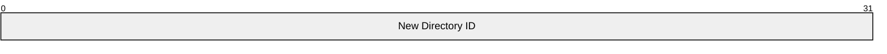
```mermaid
packet-beta
0-31: "New Directory ID"
```

| Field | Bit offset | Width (bits) | Description |
| :--- | :--- | :--- | :--- |
| New Directory ID | 0 | 32 | The directory ID assigned to the new directory. |

---

## FPCreateFile

This request creates a file. Text in **boldface** applies to **AFP Version 2.0 only**.

### Inputs

- **SRefNum (int)**: session refnum
- **Volume ID (int)**: volume identifier
- **Directory ID (long)**: ancestor directory identifier
- **CreateFlag (bit)**: a flag that specifies a hard or soft create:
    - 0 = soft create
    - 1 = hard create
- **PathType (byte)**: indicates whether Pathname is composed of long names or short names:
    - 1 = short names
    - 2 = long names
- **Pathname (string)**: pathname, including name of new file (cannot be null)

### Outputs

- **FPError (long)**

### Result codes

- **ParamErr**: Session refnum, volume identifier, or pathname type is unknown; pathname is null or bad.
- **ObjectNotFound**: Ancestor directory is unknown.
- **ObjectExists**: If attempting a soft create, a file by that name already exists.
- **ObjectTypeErr**: A directory by that name already exists.
- **AccessDenied**: User does not have the rights listed below; in AFP 1.1, the volume is ReadOnly.
- **VolLocked**: **In AFP 2.0, the destination volume is ReadOnly.**
- **FileBusy**: If attempting a hard create, the file already exists and is open.
- **DiskFull**: No more space exists on the volume.

### Algorithm

For a soft create, if a file by that name already exists, the server returns an ObjectExists result code. Otherwise, it creates a new file and assigns it the name specified in Pathname. A unique file number is assigned to the file. Finder information is set to 0, and all file attributes are initially cleared. The file's creation and modification dates, and the modification date of the file's parent directory, are set to the server's clock. The file's backup date is set to $80000000, signifying that this file has never been backed up. The file's other name (long or short) is generated as described in "Catalog Node Names" earlier in this chapter. The lengths of both of the file's forks are set to 0.

In a hard create, if the file already exists and is not open, it is deleted and then recreated. All file parameters (including the creation date) are reinitialized as described above.

### Rights

For a soft create, the user must have search or write access to all ancestors, except this file's parent directory, as well as write access to the parent directory. For a hard create, the user must have search access to all ancestors, except the parent directory, as well as read and write access to the parent directory.

### Notes

The user must have previously called FPOpenVol for this volume.

### Block format

#### Request

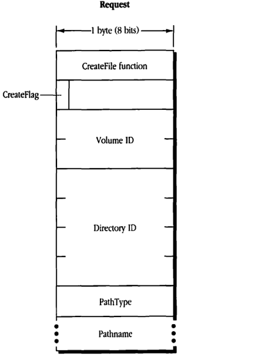

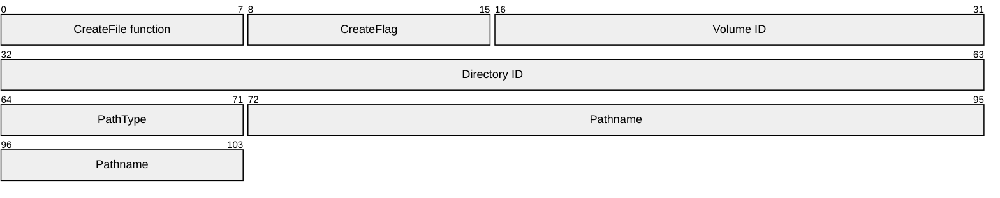
```mermaid
packet-beta
0-7: "CreateFile function"
8-15: "CreateFlag"
16-31: "Volume ID"
32-63: "Directory ID"
64-71: "PathType"
72-103: "Pathname"
```

| Field | Bit offset | Width (bits) | Description |
| :--- | :--- | :--- | :--- |
| CreateFile function | 0 | 8 | The AFP function code for FPCreateFile. |
| CreateFlag | 8 | 8 | A flag indicating whether this is a hard create (bit 7 = 1) or a soft create (bit 7 = 0). |
| Volume ID | 16 | 16 | The volume identifier for the volume containing the file. |
| Directory ID | 32 | 32 | The parent directory identifier for the file. |
| PathType | 64 | 8 | Specifies whether the Pathname is a long name (1) or a short name (2). |
| Pathname | 72 | Variable | The name of the file to be created. |


## FPDelete

This request deletes a file or directory. Text in **boldface** applies to **AFP Version 2.0 only**.

### Inputs

| | |
|---|---|
| *SRefNum* (int) | session refnum |
| *Volume ID* (int) | volume identifier |
| *Directory ID* (long) | ancestor directory identifier |
| *PathType* (byte) | indicates whether *Pathname* is composed of long names or short names:<br>1 = short names<br>2 = long names |
| *Pathname* (string) | pathname of file or directory to be deleted (may be null if a directory is to be deleted) |

### Outputs

| | |
|---|---|
| *FPError* (long) | |

### Result codes

| | |
|---|---|
| *ParamErr* | Session refnum, volume identifier, or pathname type is unknown; pathname is bad. |
| *ObjectNotFound* | Input parameters do not point to an existing file or directory. |
| *DirNotEmpty* | The directory is not empty. |
| *FileBusy* | The file is open. |
| *AccessDenied* | User does not have the rights listed below; in AFP 1.1, the file or directory is marked DeleteInhibit; in AFP 1.1, the volume is ReadOnly. |
| ***ObjectLocked*** | **In AFP 2.0, the file or directory is marked DeleteInhibit.** |
| ***VolLocked*** | **In AFP 2.0, the volume is ReadOnly.** |

### Algorithm

If the CNode to be deleted is a directory, the server checks to see if it contains any offspring. If it contains offspring, the server returns a *DirNotEmpty* result code. If a file is to be deleted, it must not be currently open by any user or a *FileBusy* result code is returned. The modification date of the deleted file or directory's parent directory is set to the server's clock.

### Rights

The user must have search access to all ancestors, except the file or directory's parent directory, as well as write access to the parent directory. If a directory is being deleted, the user must also have search access to the parent directory; for a file, the user must also have read access to the parent directory.

### Notes

The user must have previously called FPOpenVol for this volume.

### Block format

**Request**

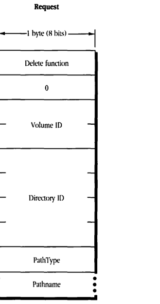

```mermaid
packet-beta
0-7: "Delete function"
8-15: "0"
16-31: "Volume ID"
32-63: "Directory ID"
64-71: "PathType"
72-103: "Pathname"
```

| Field | Bit offset | Width (bits) | Description |
| :--- | :--- | :--- | :--- |
| Delete function | 0 | 8 | The function code for the FPDelete operation. |
| 0 | 8 | 8 | Reserved; must be 0. |
| Volume ID | 16 | 16 | The volume identifier. |
| Directory ID | 32 | 32 | The parent directory identifier. |
| PathType | 64 | 8 | The format of the pathname (e.g., short or long). |
| Pathname | 72 | Variable | The name of the file or directory to be deleted. |


## FPEnumerate

This request lists the contents of a directory.

### Inputs

| Field | Description |
| :--- | :--- |
| **SRefNum (int)** | session refnum |
| **Volume ID (int)** | volume identifier |
| **Directory ID (long)** | ancestor directory identifier |
| **File Bitmap (int)** | bitmap describing which parameters are to be returned if the enumerated offspring is a file (the bit corresponding to each desired parameter should be set); this field is the same as that in the FPGetFileDirParms call and can be null |
| **Directory Bitmap (int)** | bitmap describing which parameters are to be returned if the enumerated offspring is a directory (the bit corresponding to each desired parameter should be set); this field is the same as that in the FPGetFileDirParms call and can be null |
| **ReqCount (int)** | maximum number of offspring structures to be returned |
| **Start Index (int)** | directory offspring index |
| **MaxReplySize (int)** | maximum size of reply block |
| **PathType (byte)** | indicates whether Pathname is composed of long names or short names:<br>1 = short names<br>2 = long names |
| **Pathname (string)** | pathname to desired directory |

### Outputs

| Field | Description |
| :--- | :--- |
| **FPError (long)** | |
| **File Bitmap (int)** | copy of input parameter |
| **Directory Bitmap (int)** | copy of input parameter |
| **ActCount (int)** | actual number of structures returned |
| **ActCount structures** | containing a 2-byte header and parameters in the form:
- **Struct Length (byte)**: unsigned length of this structure, including these two header bytes, and rounded up to the nearest even number
- **File/DirFlag (bit)**: flag indicating whether offspring is a file or directory:
  - 0 = file
  - 1 = directory
- **Offspring parameters**: packed in bitmap order, with a trailing null byte if necessary to make the length of the entire structure even |

### Result codes

| Code | Description |
|---|---|
| **ParamErr** | Session refnum, volume identifier, or pathname type is unknown; pathname is bad; MaxReplySize is too small to hold a single offspring structure. |
| **DirNotFound** | Input parameters do not point to an existing directory. |
| **BitmapErr** | An attempt was made to retrieve a parameter that cannot be retrieved with this call; an attempt was made to retrieve the Directory ID for a directory on a variable Directory ID volume; both bitmaps are empty. |
| **AccessDenied** | User does not have the rights listed below. |
| **ObjectNotFound** | No more offspring exist to be enumerated. |
| **ObjectTypeErr** | Input parameters pointed to a file. |

### Algorithm

The FPEnumerate call enumerates a directory as specified by the input parameters. If the File Bitmap is empty, only directory offspring are enumerated, and the Start Index can range from 1 to the total number of directory offspring. Similarly, if the Directory Bitmap is empty, only file offspring are enumerated, and the Start Index can range from 1 to the total number of file offspring. If both bitmaps have bits set, the Start Index can range from 1 to the total number of offspring. In this case, offspring structures for both files and directories are returned. These structures are not returned in any particular order.

This call is completed when the number of structures specified by ReqCount has been inserted into the reply block, when the reply block is full, or when no more offspring exist to be enumerated. No partial offspring structures are returned.

The server retrieves the specified parameters for each enumerated offspring and packs them, in bitmap order, in structures in the reply block. The server inserts one copy of the input bitmaps before all the structures.

The server needs to keep variable-length parameters, such as Long Name and Short Name, at the end of each structure. In order to do this, the server represents variable-length parameters in the bitmap order as fixed-length offsets (integers). Each offset is measured from the start of the parameters in each structure (not from the start of the bitmap or the start of the header bytes) to the start of the variable-length field. Each structure will be padded (suffixed) with a null byte if necessary to make its length even.

If NoErr is returned, all the structures in the reply block are valid. If any error result code is returned, no valid offspring structures exist in the reply block.

If the Offspring Count bit of the Directory Bitmap is set, the server will adjust the Offspring Count of each directory to reflect what access rights the user has to that directory. For example, if a particular directory contains three file and two directory offspring, the server will return its Offspring Count as 2 if the user has only search access to the directory, 3 if the user has only read access to the directory, or 5 if the user has both search and read access to the directory.

### Rights

The user must have search access to all ancestors except this directory. In addition, the user needs search access to this directory in order to enumerate directory offspring and read access in order to enumerate file offspring.

### Notes

The user must have previously called FPOpenVol for this volume.

Because enumerating a large directory can take several calls and other users may be adding to or deleting from the directory, enumeration can miss offspring or return duplicate offspring. To enumerate a directory accurately, the user must enumerate until an ObjectNotFound result code is returned and then filter out duplicate entries.

A given offspring is not guaranteed to occupy the same index number in the parent directory from one enumeration to the next.


#### Block format

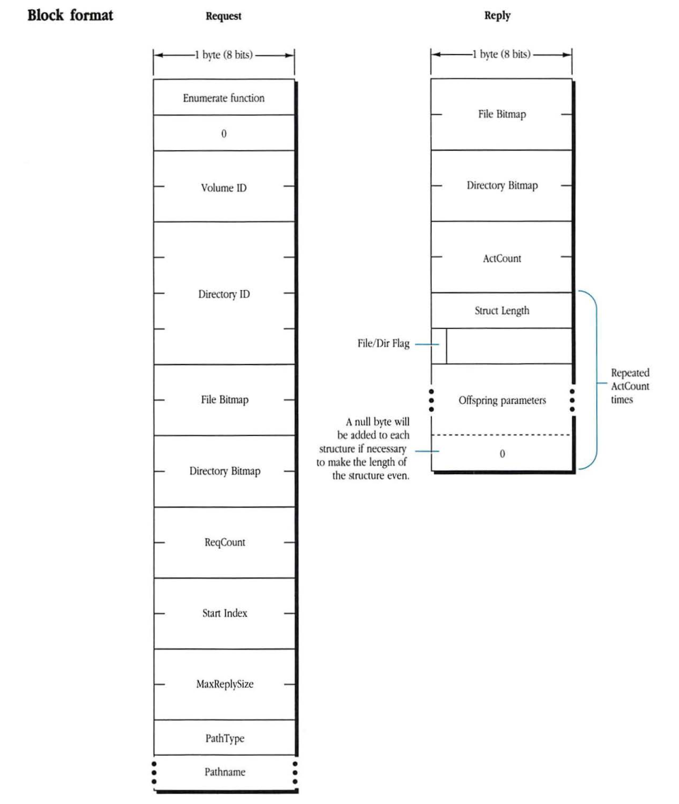

#### Request

1 byte (8 bits) wide

```mermaid
packet-beta
0-7: "Enumerate function"
8-15: "0"
16-31: "Volume ID"
32-63: "Directory ID"
64-79: "File Bitmap"
80-95: "Directory Bitmap"
96-111: "ReqCount"
112-127: "Start Index"
128-143: "MaxReplySize"
144-151: "PathType"
152-167: "Pathname"
```

| Field | Bit offset | Width (bits) | Description |
|---|---|---|---|
| Enumerate function | 0 | 8 | Function code for enumeration. |
| Reserved | 8 | 8 | Reserved; set to 0. |
| Volume ID | 16 | 16 | Identifier for the volume. |
| Directory ID | 32 | 32 | Identifier for the directory. |
| File Bitmap | 64 | 16 | Bitmap for file attributes. |
| Directory Bitmap | 80 | 16 | Bitmap for directory attributes. |
| ReqCount | 96 | 16 | Requested count of items. |
| Start Index | 112 | 16 | Starting index for enumeration. |
| MaxReplySize | 128 | 16 | Maximum size of the reply buffer. |
| PathType | 144 | 8 | Type of the pathname provided. |
| Pathname | 152 | variable | The pathname string. |

#### Reply

1 byte (8 bits) wide

```mermaid
packet-beta
0-15: "File Bitmap"
16-31: "Directory Bitmap"
32-47: "ActCount"
48-63: "Struct Length"
64-71: "File/Dir Flag"
72-87: "Offspring parameters"
88-95: "0 (padding)"
```

| Field | Bit offset | Width (bits) | Description |
|---|---|---|---|
| File Bitmap | 0 | 16 | Bitmap for file attributes. |
| Directory Bitmap | 16 | 16 | Bitmap for directory attributes. |
| ActCount | 32 | 16 | Actual count of items returned. |
| Struct Length | 48 | 16 | Length of the current offspring structure. Repeated for each item. |
| File/Dir Flag | 64 | 8 | Indicates if the entry is a file or directory. Part of the repeated structure. |
| Offspring parameters | 72 | variable | Parameters for the offspring item. Part of the repeated structure. |
| Padding | variable | 0 or 8 | A null byte added if necessary to make the length of each structure even. |

Note: The fields from "Struct Length" through the padding byte are repeated "ActCount" times. A null byte will be added to each structure if necessary to make the length of the structure even.


## FPFlush

This request writes to a disk any volume data that has been modified.

### Inputs
| Field                  | Description       |
| :---                   | :---              |
| SRefNum (int)          | session refnum    |
| Volume ID (int)        | volume identifier |

### Outputs     
| Field                  | Description       |
| :---                   | :---              |    
| FPError (long)         |                   |

## Result codes
| Field                  | Description       |
| :---                   | :---              | 
| ParamErr               | Session refnum or volume identifier is unknown. |

### Algorithm       
The FPFlush call flushes (writes to disk) as much changed information as possible. This may include flushing

*   all forks opened by the user
*   volume catalog information changed by the user
*   any updated volume data structures

AFP does not specify that the server must perform all of these functions. Therefore, users should not rely on the server to perform any particular function.

The volume's modification date may change as a result of this call, but users should not rely on it; updating of the date is implementation-dependent. If no volume information was changed since the last FPFlush call, the date may or may not change.

### Notes
The user must have previously called FPOpenVol for this volume.

### Block format**    
#### Request

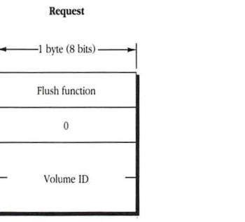

```mermaid
packet-beta
0-7: "Flush function"
8-15: "0"
16-31: "Volume ID"
```

| Field | Bit offset | Width (bits) | Description |
| :--- | :--- | :--- | :--- |
| Flush function | 0 | 8 | The command code for the FPFlush function. |
| 0 | 8 | 8 | Reserved; must be 0. |
| Volume ID | 16 | 16 | The identifier for the volume to be flushed. |


## FPFlushFork

This request writes to a disk any data buffered from previous FPWrite calls.

### Inputs

| | |
|---|---|
| SRefNum (int) | session refnum |
| OForkRefNum (int) | open fork refnum |

### Outputs

| | |
|---|---|
| FPError (long) | |

### Result codes

| | |
|---|---|
| ParamErr | Session refnum or open fork refnum is unknown. |

### Algorithm

The FPFlushFork call writes to a disk any data buffered by the server from previous FPWrite calls. If the fork has been modified, the server sets the file's modification date to the server's clock.

### Notes

In order to optimize disk access, the server may buffer FPWrite calls made to a particular file fork. Within the constraints of performance, the server flushes each fork as soon as possible. The workstation client can force the server to flush any buffered data issuing this call.

### Block format

#### Request

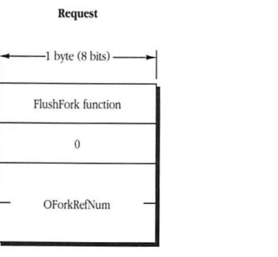

```mermaid
packet-beta
0-7: "FlushFork function"
8-15: "0"
16-31: "OForkRefNum"
```

| Field | Bit offset | Width (bits) | Description |
|---|---|---|---|
| FlushFork function | 0 | 8 | The FPFlushFork function code. |
| 0 | 8 | 8 | Reserved. |
| OForkRefNum | 16 | 16 | The open fork reference number. |


## FPGetAPPL

This request retrieves an APPL mapping from the volume's Desktop database.

### Inputs

- **SRefNum (int)**: session refnum
- **DTRefNum (int)**: Desktop database refnum
- **FileCreator (ResType)**: file creator of application corresponding to the APPL mapping
- **APPL Index (int)**: index of the APPL mapping to be retrieved
- **Bitmap (int)**: bitmap describing which parameters of the application file are to be returned; this field is the same as File Bitmap in the FPGetFileDirParms call

### Outputs

- **FPError (long)**
- **APPL Tag (long)**: tag information associated with the APPL mapping
- **File parameters requested**

### Result codes

- **ParamErr**: Session refnum or Desktop database refnum is unknown.
- **ItemNotFound**: No files in the Desktop database match the input parameters.
- **BitmapErr**: An attempt was made to retrieve a parameter that cannot be obtained with this call.

### Algorithm

For each FileCreator, the Desktop database contains a list of APPL mappings. Each APPL mapping contains the parent Directory ID and CNode name of an application associated with the FileCreator, as well as an APPL Tag that can be used to distinguish among the APPL mappings (the APPL Tag is left uninterpreted by the Desktop database).

Information about the application file associated with each APPL mapping can be obtained by making successive FPGetAPPL requests with APPL Index varying from 1 to the total number of APPL mappings stored in the Desktop database for that FileCreator. If APPL Index is greater than the number of APPL mappings in the Desktop database for the specified FileCreator, an ItemNotFound result code is returned. An APPL index of 0 returns the first APPL mapping, if one exists in the Desktop database.

The server retrieves the specified parameters for the application file and packs them, in bitmap order, in the reply block.


### Rights

The user must have search access to all ancestors except the parent directory and read access to the parent directory of the application about which information will be returned.

### Notes

The user must have previously called FPOpenDT for the corresponding volume.

### Block format

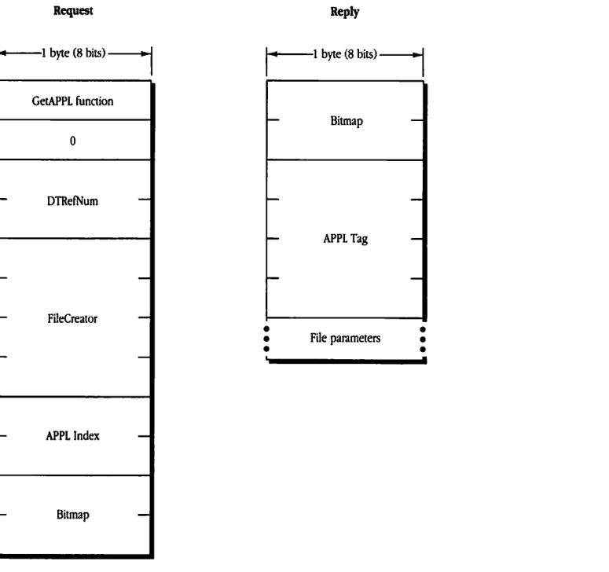

#### Request

```mermaid
packet-beta
0-7: "GetAPPL function"
8-15: "0"
16-31: "DTRefNum"
32-63: "FileCreator"
64-79: "APPL Index"
80-95: "Bitmap"
```

| Field | Bit offset | Width (bits) | Description |
|---|---|---|---|
| GetAPPL function | 0 | 8 | The FPGetAPPL command code. |
| 0 | 8 | 8 | Reserved, must be 0. |
| DTRefNum | 16 | 16 | Desktop database reference number. |
| FileCreator | 32 | 32 | The application's creator code. |
| APPL Index | 64 | 16 | Index of the application within the database. |
| Bitmap | 80 | 16 | A bitmap specifying which file parameters to return. |

#### Reply

```mermaid
packet-beta
0-15: "Bitmap"
16-47: "APPL Tag"
48-63: "File parameters"
```

| Field | Bit offset | Width (bits) | Description |
|---|---|---|---|
| Bitmap | 0 | 16 | The bitmap actually returned. |
| APPL Tag | 16 | 32 | The application tag. |
| File parameters | 48 | variable | Parameters of the file specified by the bitmap. |

## FPGetComment

This request retrieves a comment associated with a specified file or directory from the volume's Desktop database.

### Inputs

* *SRefNum (int)*: session refnum
* *DTRefNum (int)*: Desktop database refnum
* *Directory ID (long)*: directory identifier
* *PathType (byte)*: indicates whether Pathname is composed of long names or short names:
    * 1 = short names
    * 2 = long names
* *Pathname (string)*: pathname to desired file or directory

### Outputs

* *FPError (long)*
* *Comment (string)*: comment text

### Result codes

* *ParamErr*: Session refnum or Desktop database refnum is unknown.
* *ObjectNotFound*: Input parameters do not point to an existing file or directory.
* *AccessDenied*: User does not have the rights listed below.
* *ItemNotFound*: No comment was found in the Desktop database.

### Algorithm

The comment for the specified file or directory, if it is found in the volume's Desktop database, is returned in the reply block.

### Rights

If the comment is associated with a directory, the user must have search access to all ancestors, including the parent directory. If the comment is associated with a file, the user must have search access to all ancestors, except the parent directory, and read access to the parent directory.

### Notes

The user must previously have called FPOpenDT for the corresponding volume. In addition, the file or directory must exist before this call is issued.

### Block format

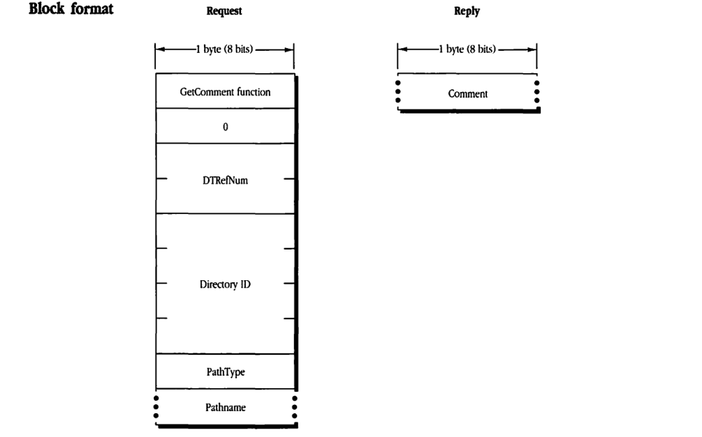

#### Request

```mermaid
packet-beta
0-7: "GetComment function"
8-15: "0"
16-31: "DTRefNum"
32-63: "Directory ID"
64-71: "PathType"
72-103: "Pathname"
```

| Field | Bit offset | Width (bits) | Description |
|---|---|---|---|
| GetComment function | 0 | 8 | The function code for GetComment. |
| 0 | 8 | 8 | Reserved, must be 0. |
| DTRefNum | 16 | 16 | The desktop database reference number. |
| Directory ID | 32 | 32 | The parent directory ID. |
| PathType | 64 | 8 | The type of pathname. |
| Pathname | 72 | variable | The pathname of the file or folder. |

#### Reply

```mermaid
packet-beta
0-31: "Comment"
```

| Field | Bit offset | Width (bits) | Description |
|---|---|---|---|
| Comment | 0 | variable | The retrieved comment from the desktop database. |


## FPGetFileDirParms

This request retrieves parameters for a CNode (either a file or a directory). Text in **boldface** applies to AFP Version 2.0 only.

### Inputs

| Field Name | Description |
| :--- | :--- |
| **SRefNum** *(int)* | session refnum |
| **Volume ID** *(int)* | volume identifier |
| **Directory ID** *(long)* | ancestor directory identifier |
| **File Bitmap** *(int)* | bitmap describing which parameters are to be returned if the CNode is a file (the bit corresponding to each desired parameter should be set)<br><br>**0 Attributes (int)**, consisting of the following flags:<br>• 0: *Invisible*<br>• 1: *MultiUser*<br>• 2: **System**<br>• 3: *DAlreadyOpen*<br>• 4: *RAlreadyOpen*<br>• 5: *ReadOnly* (called **WriteInhibit** in AFP 2.0)<br>• 6: **BackupNeeded**<br>• 7: **RenameInhibit**<br>• 8: **DeleteInhibit**<br>• 10: **CopyProtect**<br>• 15: *Set/Clear* (used in FPSetFileDirParms)<br>**1 Parent Directory ID** *(long)*<br>**2 Creation Date** *(long)*<br>**3 Modification Date** *(long)*<br>**4 Backup Date** *(long)*<br>**5 Finder Info** *(32 bytes)*<br>**6 Long Name** *(int)*<br>**7 Short Name** *(int)*<br>**8 File Number** *(long)*<br>**9 Data Fork Length** *(long)*<br>**10 Resource Fork Length** *(long)*<br>**13 ProDOS Info** *(6 bytes)* |
| **Directory Bitmap** *(int)* | bitmap describing which parameters are to be returned if the CNode is a directory (the bit corresponding to each desired parameter should be set)<br><br>**0 Attributes (int)**, consisting of the following flags:<br>• 0: *Invisible*<br>• 2: **System**<br>• 6: **BackupNeeded**<br>• 7: **RenameInhibit**<br>• 8: **DeleteInhibit**<br>**1 Parent Directory ID** *(long)*<br>**2 Creation Date** *(long)*<br>**3 Modification Date** *(long)*<br>**4 Backup Date** *(long)*<br>**5 Finder Info** *(32 bytes)*<br>**6 Long Name** *(int)*<br>**7 Short Name** *(int)*<br>**8 Directory ID** *(long)*<br>**9 Offspring Count** *(int)*<br>**10 Owner ID** *(long)*<br>**11 Group ID** *(long)*<br>**12 Access Rights** *(long)*, composed of the access rights for owner, group, and world, and a User Access Rights Summary byte (UARights)<br>**13 ProDOS Info** *(6 bytes)* |
| **PathType** *(byte)* | indicates whether Pathname is composed of long names or short names:<br>1 = short names<br>2 = long names |
| **Pathname** *(string)* | pathname to desired file or directory |

### Outputs

| Field | Description |
| :--- | :--- |
| **FPError** (*long*) | |
| **File Bitmap** (*int*) | copy of input parameter |
| **Directory Bitmap** (*int*) | copy of input parameter |
| **File/DirFlag** (*bit*) | flag that indicates whether CNode is a file or a directory:<br>0 = file<br>1 = directory |
| **Parameters requested** | |

### Result codes

| Code | Description |
| :--- | :--- |
| **ParamErr** | Session refnum, volume identifier, or pathname type is unknown; pathname is bad. |
| **ObjectNotFound** | Input parameters do not point to an existing file or directory. |
| **BitmapErr** | An attempt was made to retrieve a parameter that cannot be obtained with this call. |
| **AccessDenied** | User does not have the rights listed below. |

### Algorithm

The server packs the requested parameters in the reply block in the order specified by the appropriate bitmap and includes a File/DirFlag indicating whether the CNode was a file or a directory. A copy of the input bitmaps is inserted before the parameters.

The server needs to keep variable-length parameters, such as Long Name and Short Name, at the end of the block. In order to do this, the server represents variable-length parameters in the bitmap order as fixed-length offsets (integers). Each offset is measured from the start of the parameters (not from the start of the bitmap) to the start of the variable-length field. The actual variable-length fields are then packed after all fixed-length fields.

If the CNode exists and both bitmaps are null, no error is returned; the File Bitmap, Directory Bitmap, and File/DirFlag are returned with no other parameters.

If a directory's access rights are requested, the server returns an Access Rights long (4-byte quantity) containing the read, write, and search access privileges corresponding to owner, group, and world. The upper byte of the Access Rights long is the User Access Rights Summary byte, which indicates what privileges the user has to this directory. The most-significant bit in the User Access Rights Summary byte is the Owner bit. This bit indicates whether or not the user is the owner of the directory. It is also set if the directory is not owned by any registered user.

If the Offspring Count bit of the Directory Bitmap is set, the server will adjust the Offspring Count of each directory to reflect what access rights the user has to that directory. For example, if a particular directory contains three file and two directory offspring, the server will return its Offspring Count as 2 if the user has only search access to the directory, 3 if the user has only read access to the directory, or 5 if the user has both search and read access to the directory.

### Rights

The user must have search access to all ancestors except this CNode's parent directory. If the CNode is a directory, the user also needs search access to the parent directory. If the CNode is a file, the user needs read access to the parent directory.

### Notes

The user must have previously called FPOpenVol for this volume.

Most of the Attributes requested by this call are stored in corresponding flags within the CNode's Finder Info record.


### Block format

#### Request

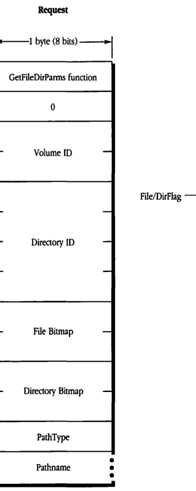

```mermaid
packet-beta
0-7: "GetFileDirParms function"
8-15: "0"
16-31: "Volume ID"
32-63: "Directory ID"
64-79: "File Bitmap"
80-95: "Directory Bitmap"
96-103: "PathType"
104-127: "Pathname"
```

| Field | Bit offset | Width (bits) | Description |
|---|---|---|---|
| GetFileDirParms function | 0 | 8 | The function code for the GetFileDirParms operation. |
| 0 | 8 | 8 | Reserved byte, must be 0. |
| Volume ID | 16 | 16 | The identifier of the volume containing the target. |
| Directory ID | 32 | 32 | The identifier of the directory containing the target. |
| File Bitmap | 64 | 16 | A bitmap specifying which file parameters are being requested. |
| Directory Bitmap | 80 | 16 | A bitmap specifying which directory parameters are being requested. |
| PathType | 96 | 8 | The format of the pathname (e.g., long or short name). |
| Pathname | 104 | variable | The pathname of the target file or directory. |

#### Reply

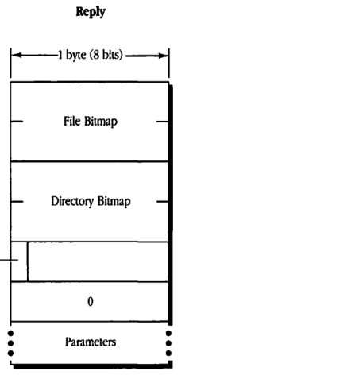

```mermaid
packet-beta
0-15: "File Bitmap"
16-31: "Directory Bitmap"
32-39: "File/DirFlag"
40-47: "0"
48-71: "Parameters"
```

| Field | Bit offset | Width (bits) | Description |
|---|---|---|---|
| File Bitmap | 0 | 16 | A bitmap indicating which file parameters are being returned. |
| Directory Bitmap | 16 | 16 | A bitmap indicating which directory parameters are being returned. |
| File/DirFlag | 32 | 8 | A flag byte where a bit indicates if the target is a file or a directory. |
| 0 | 40 | 8 | Reserved byte, must be 0. |
| Parameters | 48 | variable | The requested parameter data, formatted according to the bitmaps. |

#### File Bitmap

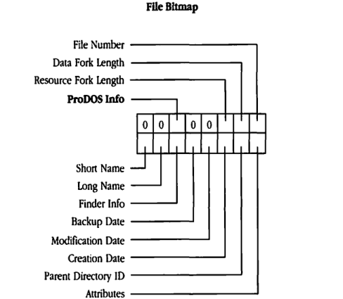

```mermaid
packet-beta
0: "Short Name"
1: "Long Name"
2: "Finder Info"
3: "Backup Date"
4: "Modification Date"
5: "Creation Date"
6: "Parent Directory ID"
7: "Attributes"
8: "0"
9: "0"
10: "0"
11: "0"
12: "ProDOS Info"
13: "Resource Fork Length"
14: "Data Fork Length"
15: "File Number"
```

| Field | Bit offset | Width (bits) | Description |
|---|---|---|---|
| File Number | 15 | 1 | |
| Data Fork Length | 14 | 1 | |
| Resource Fork Length | 13 | 1 | |
| ProDOS Info | 12 | 1 | |
| Reserved | 8-11 | 4 | Set to 0 |
| Attributes | 7 | 1 | |
| Parent Directory ID | 6 | 1 | |
| Creation Date | 5 | 1 | |
| Modification Date | 4 | 1 | |
| Backup Date | 3 | 1 | |
| Finder Info | 2 | 1 | |
| Long Name | 1 | 1 | |
| Short Name | 0 | 1 | |

#### Directory Bitmap

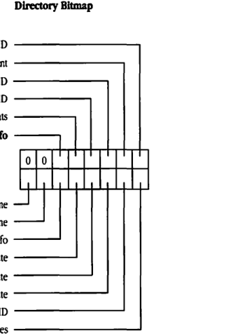

```mermaid
packet-beta
0: "Short Name"
1: "Long Name"
2: "Finder Info"
3: "Backup Date"
4: "Modification Date"
5: "Creation Date"
6: "Parent Directory ID"
7: "Attributes"
8: "0"
9: "0"
10: "ProDOS Info"
11: "Access Rights"
12: "Group ID"
13: "Owner ID"
14: "Offspring Count"
15: "Directory ID"
```

| Field | Bit offset | Width (bits) | Description |
|---|---|---|---|
| Directory ID | 15 | 1 | |
| Offspring Count | 14 | 1 | |
| Owner ID | 13 | 1 | |
| Group ID | 12 | 1 | |
| Access Rights | 11 | 1 | |
| ProDOS Info | 10 | 1 | |
| Reserved | 8-9 | 2 | Set to 0 |
| Attributes | 7 | 1 | |
| Parent Directory ID | 6 | 1 | |
| Creation Date | 5 | 1 | |
| Modification Date | 4 | 1 | |
| Backup Date | 3 | 1 | |
| Finder Info | 2 | 1 | |
| Long Name | 1 | 1 | |
| Short Name | 0 | 1 | |

#### File Attributes

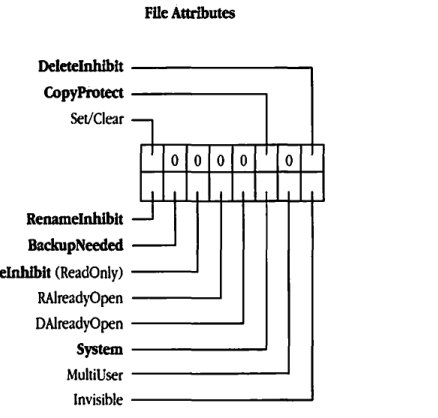

```mermaid
packet-beta
0: "Invisible"
1: "MultiUser"
2: "System"
3: "DAlreadyOpen"
4: "RAlreadyOpen"
5: "WriteInhibit (ReadOnly)"
6: "BackupNeeded"
7: "RenameInhibit"
8: "0"
9: "0"
10: "0"
11: "0"
12: "0"
13: "Set/Clear"
14: "CopyProtect"
15: "DeleteInhibit"
```

| Field | Bit offset | Width (bits) | Description |
|---|---|---|---|
| DeleteInhibit | 15 | 1 | |
| CopyProtect | 14 | 1 | |
| Set/Clear | 13 | 1 | |
| Reserved | 8-12 | 5 | Set to 0 |
| RenameInhibit | 7 | 1 | |
| BackupNeeded | 6 | 1 | |
| WriteInhibit (ReadOnly) | 5 | 1 | |
| RAlreadyOpen | 4 | 1 | |
| DAlreadyOpen | 3 | 1 | |
| System | 2 | 1 | |
| MultiUser | 1 | 1 | |
| Invisible | 0 | 1 | |

#### Directory Attributes

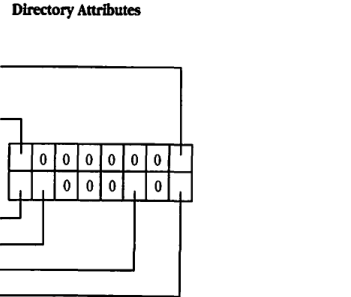

```mermaid
packet-beta
0: "0"
1: "0"
2: "0"
3: "0"
4: "Invisible"
5: "System"
6: "BackupNeeded"
7: "RenameInhibit"
8: "0"
9: "0"
10: "0"
11: "0"
12: "0"
13: "Set/Clear"
14: "0"
15: "DeleteInhibit"
```

| Field | Bit offset | Width (bits) | Description |
|---|---|---|---|
| DeleteInhibit | 15 | 1 | |
| Reserved | 14 | 1 | Set to 0 |
| Set/Clear | 13 | 1 | |
| Reserved | 8-12 | 5 | Set to 0 |
| RenameInhibit | 7 | 1 | |
| BackupNeeded | 6 | 1 | |
| System | 5 | 1 | |
| Invisible | 4 | 1 | |
| Reserved | 0-3 | 4 | Set to 0 |

#### Access Rights

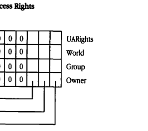

```mermaid
packet-beta
0-7: "Owner byte"
8-15: "Group byte"
16-23: "World byte"
24-31: "UARights byte"
```

| Field | Bit offset | Width (bits) | Description |
|---|---|---|---|
| UARights | 24-31 | 8 | User Access Rights byte |
| World | 16-23 | 8 | World Access Rights byte |
| Group | 8-15 | 8 | Group Access Rights byte |
| Owner | 0-7 | 8 | Owner Access Rights byte |

Each Access Rights byte has the following format:

| Field | Bit offset | Width (bits) | Description |
|---|---|---|---|
| Reserved | 3-7 | 5 | (Bit 3 may be used in UARights) |
| Write | 2 | 1 | |
| Read | 1 | 1 | |
| Search | 0 | 1 | |


## FPGetForkParms

This request retrieves parameters for a file associated with a particular open fork. Text in boldface **applies to AFP Version 2.0 only.**

### Inputs

*   *SRefNum (int)*: session refnum
*   *OForkRefNum (int)*: open fork refnum
*   *Bitmap (int)*: bitmap describing which parameters are to be retrieved (the bit corresponding to each desired parameter should be set); this field is the same as File Bitmap in the FPGetFileDirParms call

c

*   *FPError (long)*
*   *Bitmap (int)*: copy of the input parameter
*   *File parameters requested*

### Result codes

*   *ParamErr*: Session refnum or open fork refnum is unknown.
*   *BitmapErr*: An attempt was made to retrieve a parameter that cannot be obtained with this call; bitmap is null.
*   *AccessDenied*: Fork was not opened for read (**this code is never returned in AFP Version 2.0**).

### Algorithm

The FPGetForkParms call retrieves the specified parameters for the file. The server packs the parameters, in bitmap order, in the reply block.

Variable-length parameters are kept at the end of the block. In order to do this, the server represents variable-length parameters in the bitmap order as fixed-length offsets (integers). These offsets are measured from the start of the parameters to the start of the variable-length fields. The actual variable-length fields are then packed after all fixed-length fields.

This call retrieves the length of the fork indicated by OForkRefNum; a BitmapErr result code is returned if an attempt is made to retrieve the length of the file's other fork.

### Rights

In AFP Version 1.1, the fork must be open for read by the user. **In AFP Version 2.0, the fork need not be open for read to retrieve a file's parameters.**


### Block format

#### Request

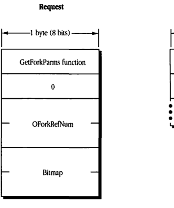

```mermaid
packet-beta
0-7: "GetForkParms function"
8-15: "0"
16-31: "OForkRefNum"
32-47: "Bitmap"
```

| Field | Bit offset | Width (bits) | Description |
| :--- | :--- | :--- | :--- |
| GetForkParms function | 0 | 8 | The AFP function code for FPGetForkParms. |
| 0 | 8 | 8 | Reserved byte; must be zero. |
| OForkRefNum | 16 | 16 | The open fork reference number. |
| Bitmap | 32 | 16 | A bitmap specifying which fork parameters to retrieve. |

#### Reply

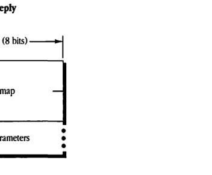

```mermaid
packet-beta
0-15: "Bitmap"
16-31: "File parameters"
```

| Field | Bit offset | Width (bits) | Description |
| :--- | :--- | :--- | :--- |
| Bitmap | 0 | 16 | A bitmap specifying which fork parameters are being returned. |
| File parameters | 16 | variable | The fork parameters requested in the Request Bitmap, returned in the order of the bitmap bits. |


## FPGetIcon

This request retrieves an icon from the volume's Desktop database.

### Inputs

| Field | Type | Description |
| :--- | :--- | :--- |
| SRefNum | (int) | session refnum |
| DTRefNum | (int) | Desktop database refnum |
| FileCreator | (ResType) | file creator of files with which the icon is associated |
| FileType | (ResType) | file type of files with which the icon is associated |
| IconType | (byte) | preferred icon type |
| Length | (int) | the number of bytes reserved for icon bitmap |

### Outputs

| Field | Type | Description |
| :--- | :--- | :--- |
| FPError | (long) | |
| Icon Bitmap | (bytes) | the actual bitmap for the icon |

### Result codes

| Code | Description |
| :--- | :--- |
| ParamErr | Session refnum or Desktop database refnum is unknown. |
| ItemNotFound | No icon corresponding to the input specification was found in the Desktop database. |

### Algorithm

The server retrieves an icon bitmap from the Desktop database, as specified by its FileCreator, FileType, and IconType. If the server does not find a matching icon, it returns an ItemNotFound result code.

An input Length value of 0 is acceptable to test for the presence or absence of a particular icon. If Length is less than the actual size of the icon bitmap, only Length bytes will be returned.

### Notes

The user must have previously called FPOpenDT for the corresponding volume.

### Block format

#### Request

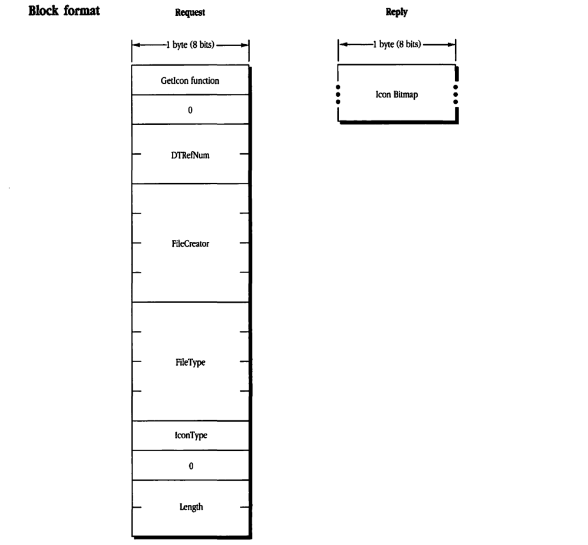

#### Request Structure

```mermaid
packet-beta
0-7: "GetIcon function"
8-15: "0"
16-31: "DTRefNum"
32-63: "FileCreator"
64-95: "FileType"
96-103: "IconType"
104-111: "0"
112-127: "Length"
```

| Field | Bit offset | Width (bits) | Description |
|---|---|---|---|
| GetIcon function | 0 | 8 | The function code for GetIcon. |
| 0 | 8 | 8 | Reserved; must be 0. |
| DTRefNum | 16 | 16 | The reference number of the desktop database. |
| FileCreator | 32 | 32 | The creator code of the file. |
| FileType | 64 | 32 | The type code of the file. |
| IconType | 96 | 8 | The type of icon being requested. |
| 0 | 104 | 8 | Reserved; must be 0. |
| Length | 112 | 16 | The requested length of the icon bitmap. |

#### Reply Structure

```mermaid
packet-beta
0-31: "Icon Bitmap"
```

| Field | Bit offset | Width (bits) | Description |
|---|---|---|---|
| Icon Bitmap | 0 | Variable | The bitmap data for the requested icon. |


## FPGetIconInfo

This request retrieves icon information from the volume's Desktop database.

### Inputs

*   *SRefNum* (int) session refnum
*   *DTRefNum* (int) Desktop database refnum
*   *FileCreator* (ResType) file creator of files with which the icon is associated
*   *IconIndex* (int) index of requested icon

### Outputs

*   *FPError* (long)
*   *IconTag* (long) tag information associated with the requested icon
*   *FileType* (ResType) the file type of the requested icon
*   *IconType* (byte) the type of the requested icon
*   *Size* (int) the size of the icon bitmap

### Result codes

*   *ParamErr* Session refnum or Desktop database refnum is unknown.
*   *ItemNotFound* No icon corresponding to the input specification was found in the Desktop database.

### Algorithm

The server retrieves information about an icon in the volume's Desktop database, as specified by its *FileCreator* and *IconIndex*.

For each *FileCreator*, the Desktop database contains a list of icons. Information about each icon can be obtained by making successive FPGetIconInfo calls with *IconIndex* varying from 1 to the total number of icons stored in the Desktop database for that *FileCreator*. If *IconIndex* is greater than the number of icons in the Desktop database for the specified *FileCreator*, an *ItemNotFound* result code is returned.

### Notes

The user must have previously called *FPOpenDT* for the corresponding volume.

### Block format

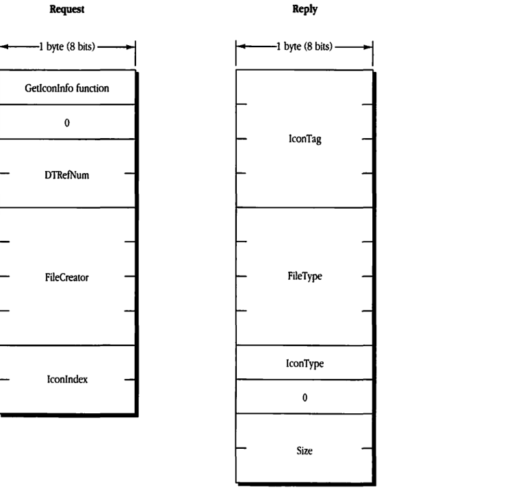

#### Request

```mermaid
packet-beta
0-7: "GetIconInfo function"
8-15: "0"
16-31: "DTRefNum"
32-63: "FileCreator"
64-79: "IconIndex"
```

| Field | Bit offset | Width (bits) | Description |
|---|---|---|---|
| GetIconInfo function | 0 | 8 | The FPGetIconInfo function code |
| 0 | 8 | 8 | Reserved; must be 0 |
| DTRefNum | 16 | 16 | Desktop database reference number |
| FileCreator | 32 | 32 | File creator code |
| IconIndex | 64 | 16 | Index of the icon |

#### Reply

```mermaid
packet-beta
0-31: "IconTag"
32-63: "FileType"
64-71: "IconType"
72-79: "0"
80-95: "Size"
```

| Field | Bit offset | Width (bits) | Description |
|---|---|---|---|
| IconTag | 0 | 32 | The icon tag |
| FileType | 32 | 32 | File type code |
| IconType | 64 | 8 | The icon type |
| 0 | 72 | 8 | Reserved; must be 0 |
| Size | 80 | 16 | Size of the icon data |

## FPGetSrvrInfo

This request obtains a block of descriptive information from the server, without requiring a session to be opened. Text in **boldface** applies to **AFP Version 2.0 only**.

### Inputs

| | |
| :--- | :--- |
| *SAddr (EntityAddr)* | internet address of the server |

### Outputs

| | |
| :--- | :--- |
| *FPError (long)* | |
| *Flags (int)* | flags, consisting of:<br>0 *SupportsCopyFile* &nbsp;&nbsp; set if server supports the FPCopyFile call<br>1 ***SupportsChgPwd*** &nbsp;&nbsp; **set if server supports the FPChangePassword call** |
| *Server Name (string)* | the name of the server |
| *Machine Type (string)* | string describing the server's hardware and/or operating system |
| *AFP Versions (strings)* | versions of AFP that the server uses |
| *UAMs (strings)* | user authentication methods supported by the server |
| *Volume Icon and Mask (256 bytes)* | |

### Result codes

| | |
| :--- | :--- |
| NoServer | Server is not responding. |

### Algorithm

The FPGetSrvrInfo call retrieves information about the server in the form of an information block.

To facilitate access to all the fields of the information block, the block begins with a header containing the offset to each field of information: first an offset to the Machine Type, followed by the offset to the AFP Versions strings, the offset to the UAM strings, and the offset to the Volume Icon and Mask. These offsets are measured relative to the start of the information block. The Volume Icon and Mask field is optional; if it is not included, the offset to the Volume Icon and Mask will be 0.

The AFP versions and the UAMs are formatted as a 1-byte count followed by that number of strings packed back-to-back without padding.

### Notes

This is the only AFP call that can be made without first setting up a session between the workstation and server.

The server can pack fields in the reply block in any order, and each field should be accessible only through the use of offsets. In other words, the workstation client should make no assumptions about how the fields are packed relative to one another. The exception is the Server Name field, which always begins immediately after the Flags field.

This call should be implemented using the ASP GetStatus mechanism.

### Block format

#### Request

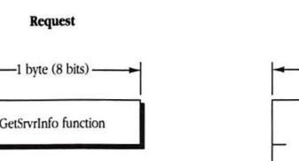

```mermaid
packet-beta
0-7: "GetSrvrInfo function"
```

| Field | Bit offset | Width (bits) | Description |
| :--- | :--- | :--- | :--- |
| GetSrvrInfo function | 0 | 8 | The function code for the GetSrvrInfo call. |

#### Reply

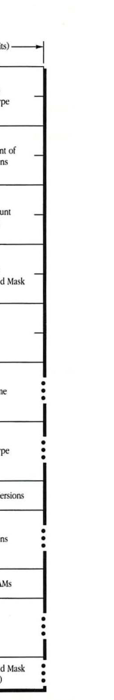

```mermaid
packet-beta
0-15: "Offset to Machine Type"
16-31: "Offset to count of AFP Versions"
32-47: "Offset to count of UAMs"
48-63: "Offset to Volume Icon and Mask"
64-79: "Flags"
```

| Field | Bit offset | Width (bits) | Description |
| :--- | :--- | :--- | :--- |
| Offset to Machine Type | 0 | 16 | Offset from the start of the packet to the Machine Type string. |
| Offset to count of AFP Versions | 16 | 16 | Offset from the start of the packet to the count of AFP Versions. |
| Offset to count of UAMs | 32 | 16 | Offset from the start of the packet to the count of UAMs. |
| Offset to Volume Icon and Mask | 48 | 16 | Offset from the start of the packet to the volume icon and mask; 0 if none. |
| Flags | 64 | 16 | Server capability flags. |
| Server Name | 80 | Variable | Pascal string containing the server's name. |
| Machine Type | Variable | Variable | Pascal string containing the server's machine type. |
| Count of AFP Versions | Variable | 8 | The number of AFP versions supported by the server. |
| AFP Versions | Variable | Variable | A list of Pascal strings, one for each AFP version supported. |
| Count of UAMs | Variable | 8 | The number of User Authentication Methods supported by the server. |
| UAMs | Variable | Variable | A list of Pascal strings, one for each UAM supported. |
| Volume Icon and Mask (optional) | Variable | 4096 | An optional 256-byte icon and 256-byte mask. |

#### Flags Detail

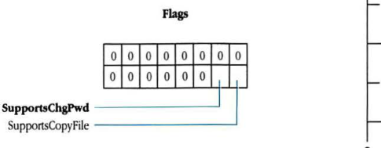

```mermaid
packet-beta
0-13: "Reserved"
14: "SupportsChgPwd"
15: "SupportsCopyFile"
```

| Field | Bit offset | Width (bits) | Description |
| :--- | :--- | :--- | :--- |
| Reserved | 0 | 14 | Reserved; must be 0. |
| SupportsChgPwd | 14 | 1 | Bit 1: If set, the server supports changing passwords. |
| SupportsCopyFile | 15 | 1 | Bit 0: If set, the server supports the FPCCopyFile call. |

## FPGetSrvrParms

This request retrieves server parameters. Text in **boldface** applies to **AFP Version 2.0 only**.

### Inputs

| Field | Description |
|---|---|
| *SRefNum (int)* | session refnum |

### Outputs

| Field | Description |
|---|---|
| *FPError (long)* | |
| *Server Time (long)* | current date-time on the server's clock |
| *NumVols (byte)* | number of volumes managed by the server |

*NumVols* structures containing a 1-byte header and volume name in the form:

| Field | Description |
|---|---|
| *HasPassword (bit)* | flag indicating whether or not this volume is password-protected:<br>0 = not protected<br>1 = has password |
| **HasConfigInfo (bit)** | **flag indicating whether or not this volume contains Apple II configuration information** |
| *VolName (string)* | character string name of volume |

### Result codes

| Code | Description |
|---|---|
| *ParamErr* | Session refnum is unknown. |

### Algorithm

The *VolNames* strings and *HasPassword* (**and HasConfigInfo**) flag are packed together without padding in the reply block. **In AFP 2.0, the HasConfigInfo flag will be set for one of the volumes to indicate which volume contains Apple II configuration information.**

### Block format

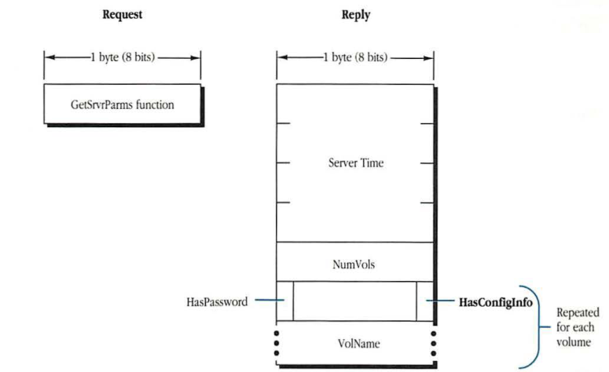

#### Request

```mermaid
packet-beta
0-7: "GetSrvrParms function"
```

| Field | Bit offset | Width (bits) | Description |
| :--- | :--- | :--- | :--- |
| GetSrvrParms function | 0 | 8 | The function identifier for GetSrvrParms. |

#### Reply

```mermaid
packet-beta
0-31: "Server Time"
32-39: "NumVols"
40-47: "Config Info (contains HasPassword bit)"
48-55: "VolName"
```

| Field | Bit offset | Width (bits) | Description |
| :--- | :--- | :--- | :--- |
| Server Time | 0 | 32 | The current time on the server. |
| NumVols | 32 | 8 | The number of volumes available. |
| HasConfigInfo | 40 | Variable | A block of configuration information repeated for each volume. Each block contains a flags byte and a volume name. |
| HasPassword | 40 | - | A bit within the configuration flags byte indicating if the volume requires a password. |
| VolName | 48 | Variable | The name of the volume. |

## FPGetUserInfo

This request is used to retrieve information about a user. **It is new in AFP Version 2.0.**

### Inputs

| Field | Description |
| :--- | :--- |
| *SRefNum (int)* | session refnum |
| *ThisUser (bit)* | flag indicating whether information is to be returned for the user who is the client of the session (if set, the User ID field is ignored) |
| *User ID (long)* | ID of user for whom information is to be retrieved (not valid if ThisUser bit is set) |
| *Bitmap (int)* | bitmap describing which parameters are to be retrieved (the bit corresponding to each desired parameter should be set):<br>0 &nbsp;&nbsp;&nbsp;&nbsp; *User ID (long)*<br>1 &nbsp;&nbsp;&nbsp;&nbsp; *Primary Group ID (long)* |

### Outputs

| Field | Description |
| :--- | :--- |
| *FPError (long)* | |
| *Bitmap (int)* | copy of input parameter |
| *User Info parameters requested* | |

### Result codes

| Code | Description |
| :--- | :--- |
| *ParamErr* | ThisUser bit is not set (it must be set in AFP Version 2.0). |
| *ItemNotFound* | User ID is unknown. |
| *BitmapErr* | An attempt was made to retrieve a parameter that cannot be obtained with this call. |
| *AccessDenied* | User not authorized to retrieve user information for this user. |
| *CallNotSupported* | Workstation is using AFP Version 1.1. |

### Algorithm

The server retrieves the specified parameters for the specified user and packs them, in bitmap order, in the reply packet.

### Notes

This call can be used only to retrieve the User ID and Primary Group ID of the user who is the client of this session, thus requiring that the ThisUser bit be set. The User ID parameter is intended for future expansion.

### Block format

#### Request

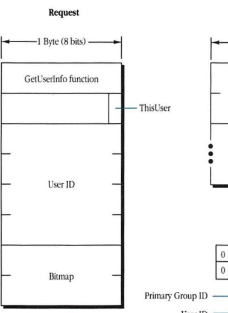

```mermaid
packet-beta
0-7: "GetUserInfo function"
8-14: "Reserved"
15: "ThisUser"
16-47: "User ID"
48-55: "Bitmap"
```

| Field | Bit offset | Width (bits) | Description |
| :--- | :--- | :--- | :--- |
| GetUserInfo function | 0 | 8 | The function code for the GetUserInfo request. |
| Reserved | 8 | 7 | Reserved; set to 0. |
| ThisUser | 15 | 1 | A flag that, if set, indicates the request is for the current user's information. |
| User ID | 16 | 32 | The unique identifier of the user. |
| Bitmap | 48 | 8 | A bitmap specifying which fields to return. |

#### Reply

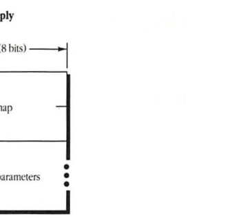

```mermaid
packet-beta
0-7: "Bitmap"
8-n: "User Info parameters"
```

| Field | Bit offset | Width (bits) | Description |
| :--- | :--- | :--- | :--- |
| Bitmap | 0 | 8 | A bitmap specifying which fields are present in the reply. |
| User Info parameters | 8 | Variable | The requested user information fields, returned in the order of the bits in the bitmap. |

#### Bitmap

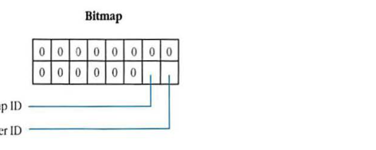

```mermaid
packet-beta
0-13: "Reserved"
14: "Primary Group ID"
15: "User ID"
```

| Field | Bit offset | Width (bits) | Description |
| :--- | :--- | :--- | :--- |
| User ID | 0 | 1 | If set (bit 0), the User ID field is present. |
| Primary Group ID | 1 | 1 | If set (bit 1), the Primary Group ID field is present. |
| Reserved | 2 | 14 | Bits 2 through 15 are reserved and should be set to 0. |


## FPGetVolParms

This request retrieves parameters for a particular volume.

### Inputs

| | |
|---|---|
| *SRefNum (int)* | session refnum |
| *Volume ID (int)* | volume identifier |
| *Bitmap (int)* | bitmap describing which parameters are to be returned (the bit corresponding to each desired parameter should be set); cannot be null: |
| | 0 &nbsp;&nbsp; *Attributes (int)*, consisting of the following flag: |
| | &nbsp;&nbsp;&nbsp;&nbsp;&nbsp;&nbsp; 0 &nbsp;&nbsp; *ReadOnly* |
| | 1 &nbsp;&nbsp; *Signature (int)* |
| | 2 &nbsp;&nbsp; *Creation Date (long)* |
| | 3 &nbsp;&nbsp; *Modification Date (long)* |
| | 4 &nbsp;&nbsp; *Backup Date (long)* |
| | 5 &nbsp;&nbsp; *Volume ID (int)* |
| | 6 &nbsp;&nbsp; *Bytes Free (long) unsigned* |
| | 7 &nbsp;&nbsp; *Bytes Total (long) unsigned* |
| | 8 &nbsp;&nbsp; *Volume Name (int)* |

### Outputs

| | |
|---|---|
| *FPError (long)* | |
| *Bitmap (int)* | copy of input parameter |
| *Volume parameters requested* | |

### Result codes

| | |
|---|---|
| *ParamErr* | Session refnum or volume identifier is unknown. |
| *BitmapErr* | An attempt was made to retrieve a parameter that cannot be obtained with this call; bitmap is null. |

### Algorithm

The FPGetVolParms call retrieves parameters that describe a specified volume. The volume is specified by its Volume ID as returned from the FPOpenVol call. In response to this call, the server packs the volume parameters in bitmap order in the reply block, along with a copy of the Bitmap inserted before the parameters.

The server needs to keep all variable-length parameters, such as the Volume Name field, at the end of the block. In order to do this, the server represents variable-length parameters in bitmap order as fixed-length offsets (integers). These offsets are measured from the start of the parameters (not from the start of the Bitmap) to the start of the variable-length fields. The variable-length fields are then packed after all fixed-length fields.

### Notes

The user must have previously called FPOpenVol for this volume.

The ReadOnly attribute must be set by some administrative function.

### Block format

#### Request

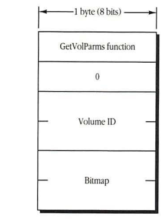

```mermaid
packet-beta
0-7: "GetVolParms function"
8-15: "0"
16-31: "Volume ID"
32-47: "Bitmap"
```

| Field | Bit offset | Width (bits) | Description |
|---|---|---|---|
| GetVolParms function | 0 | 8 | The function code for GetVolParms. |
| 0 | 8 | 8 | Reserved, must be 0. |
| Volume ID | 16 | 16 | Volume identifier. |
| Bitmap | 32 | 16 | A 16-bit bitmap specifying requested volume parameters. |

#### Reply

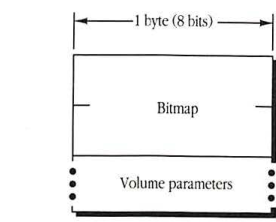

```mermaid
packet-beta
0-15: "Bitmap"
16-31: "Volume parameters"
```

| Field | Bit offset | Width (bits) | Description |
|---|---|---|---|
| Bitmap | 0 | 16 | The bitmap of returned volume parameters. |
| Volume parameters | 16 | Variable | The requested volume parameter values. |

#### Bitmap

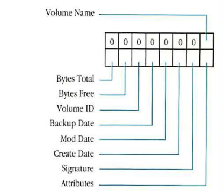

```mermaid
packet-beta
0: "Volume Name"
1: "Reserved"
2: "Bytes Total"
3: "Bytes Free"
4: "Volume ID"
5: "Backup Date"
6: "Mod Date"
7: "Create Date"
8: "Signature"
9: "Attributes"
10-15: "Reserved"
```

| Field | Bit offset | Width (bits) | Description |
|---|---|---|---|
| Volume Name | 0 | 1 | Bit 0: volume name field |
| Reserved | 1 | 1 | Reserved bit |
| Bytes Total | 2 | 1 | Bit 2: total bytes on volume |
| Bytes Free | 3 | 1 | Bit 3: free bytes on volume |
| Volume ID | 4 | 1 | Bit 4: volume ID |
| Backup Date | 5 | 1 | Bit 5: volume backup date |
| Mod Date | 6 | 1 | Bit 6: volume modification date |
| Create Date | 7 | 1 | Bit 7: volume creation date |
| Signature | 8 | 1 | Bit 8: volume signature |
| Attributes | 9 | 1 | Bit 9: volume attributes |
| Reserved | 10 | 6 | Reserved bits |

#### Volume Attributes

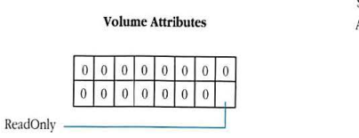

```mermaid
packet-beta
0-14: "Reserved"
15: "ReadOnly"
```

| Field | Bit offset | Width (bits) | Description |
|---|---|---|---|
| Reserved | 0 | 15 | Reserved bits. |
| ReadOnly | 15 | 1 | Bit 15: 1 = volume is read-only. |

## FPLogin

This request establishes an AFP session with a server.

### Inputs

| Field | Description |
|---|---|
| SAddr (EntityAddr) | internet address of the file server |
| AFP Version (string) | a string indicating which AFP version to use |
| UAM (string) | a string indicating which user authentication method to use |
| User Auth Info | information required to authenticate the user; dependent on the UAM used (can be null) |

### Outputs

| Field | Description |
|---|---|
| FPError (long) | |
| SRefNum (int) | session refnum used to refer to this session in all subsequent calls (valid if no error or AuthContinue result code is returned) |
| ID Number (int) | an ID to be used for certain UAMs by the FPLoginCont call (valid only if AuthContinue result code is returned) |
| User Auth Info | a buffer returned for certain UAMs (valid only if AuthContinue result code is returned) |

### Result codes

| Code | Description |
|---|---|
| NoServer | Server is not responding. |
| BadVersNum | Server cannot use the specified AFP version. |
| BadUAM | UAM is unknown. |
| ParamErr | User is unknown. |
| UserNotAuth | UAM failed. |
| AuthContinue | Authentication not yet complete. |
| ServerGoingDown | Server is shutting down. |
| MiscErr | User is already authenticated. |

### Algorithm

The workstation sends the server an AFP Version string, which indicates the AFP version to use, and a UAM string, which indicates the user authentication method to use. These strings are packed into the request block with no padding. User Auth Info, if used, follows the UAM string without padding.

If the server cannot use the requested AFP Version, a BadVersNum result code will be returned. Otherwise, that version will be used for the duration of the session.

In the 'Cleartxt Passwrd' UAM, the user's name and password are sent in the User Auth Info field. The password is transmitted in cleartext and must be padded (suffixed) with null bytes if necessary to make its length 8 bytes. If necessary, a null byte will be inserted after the user name to make the password begin on an even boundary. The server looks up the password for that user and compares it to the password in the request block. If the two passwords match, then the user has been authenticated and the login succeeds. If they do not match, a UserNotAuth result code is returned.

In the 'Randnum Exchange' UAM, only the user name is sent in the User Auth Info field. If the user name is valid, the server generates an 8-byte random number and sends it back to the workstation, along with an ID number and an AuthContinue result code. The AuthContinue indicates that all is well at this point and that the user is not yet authenticated.

The workstation then uses the password as a key to encrypt the random number and sends the result back to the server in the User Auth Info field of an FPLoginCont request, along with the ID Number returned from the FPLogin request. The server uses this ID Number to associate the two calls, FPLogin and FPLoginCont. The server looks up the password for that user and uses it as a key to encrypt the same random number. If the two encrypted numbers match, then the user has been authenticated and the login succeeds. Otherwise, the server returns a UserNotAuth result code.

If any error result code (other than AuthContinue) is returned, the session is not opened.

### Notes

User name comparison is case-insensitive and diacritical-sensitive; password comparison is case-sensitive.

Random-number encryption is performed using DES.

### Block format

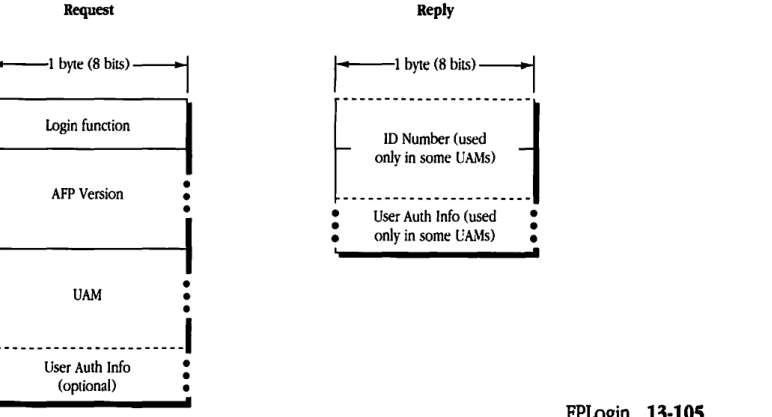

#### Request

```mermaid
packet-beta
0-7: "Login function"
8-15: "AFP Version"
16-23: "UAM"
24-31: "User Auth Info (optional)"
```

| Field | Bit offset | Width (bits) | Description |
|---|---|---|---|
| Login function | 0 | 8 | The code for the login function. |
| AFP Version | 8 | Variable | A string identifying the version of AFP. |
| UAM | 16 | Variable | A string identifying the User Authentication Method. |
| User Auth Info (optional) | 24 | Variable | Optional additional authentication information. |

#### Reply

```mermaid
packet-beta
0-7: "ID Number (used only in some UAMs)"
8-15: "User Auth Info (used only in some UAMs)"
```

| Field | Bit offset | Width (bits) | Description |
|---|---|---|---|
| ID Number (used only in some UAMs) | 0 | Variable | Session identifier used by some UAMs. |
| User Auth Info (used only in some UAMs) | 8 | Variable | Authentication information returned by the server. |

## FPLoginCont

This request continues the login and user authentication process started by the FPLogin call.

### Inputs

| | |
|---|---|
| *SRefNum (int)* | session refnum |
| *ID Number (int)* | number returned from the previous FPLogin or FPLoginCont call |
| *User Auth Info* | information required to authenticate the user, depending on the UAM |

### Outputs

| | |
|---|---|
| *FPError (long)* | |
| *ID Number (int)* | an ID returned for certain UAMs; used by the subsequent FPLoginCont call (valid only if AuthContinue result code is returned) |
| *User Auth Info* | a buffer returned for certain UAMs (valid only if AuthContinue result code is returned) |

### Result codes

| | |
|---|---|
| *NoServer* | Server is not responding. |
| *UserNotAuth* | UAM failed. |
| *AuthContinue* | User authentication not yet complete. |

### Algorithm

The FPLoginCont call sends the ID Number and User Auth Info parameters to the server, which uses them to execute the next step in the UAM. If an additional exchange of packets is required, the server returns an AuthContinue result code. Otherwise, it returns either no error, meaning the user has been authenticated, or UserNotAuth, meaning the authentication method has failed. If the server returns no error, the SRefNum is validated for use in subsequent calls. If the server returns UserNotAuth, it also closes the session and invalidates the SRefNum.

### Block format

#### Request

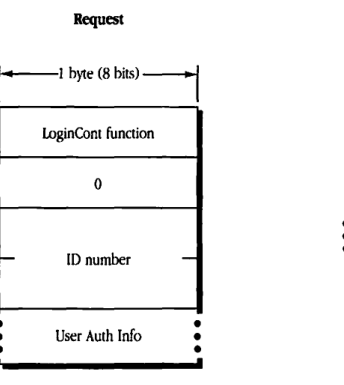

```mermaid
packet-beta
0-7: "LoginCont function"
8-15: "0"
16-23: "ID number"
24-31: "User Auth Info"
```

| Field | Bit offset | Width (bits) | Description |
| :--- | :--- | :--- | :--- |
| LoginCont function | 0 | 8 | The function code for the login continuation request. |
| 0 | 8 | 8 | Reserved; must be zero. |
| ID number | 16 | Variable | The identification number assigned to the session. |
| User Auth Info | Variable | Variable | User authentication information. |

#### Reply

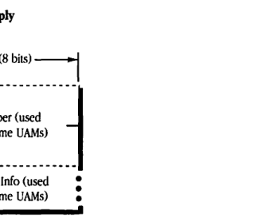

```mermaid
packet-beta
0-7: "ID Number"
8-15: "User Auth Info"
```

| Field | Bit offset | Width (bits) | Description |
| :--- | :--- | :--- | :--- |
| ID Number | 0 | Variable | The identification number (used only in some UAMs). |
| User Auth Info | Variable | Variable | User authentication information (used only in some UAMs). |

## FPLogout

This request terminates a session with a server.

### Inputs
SRefNum (int) session refnum

### Outputs
FPError (long)

### Result codes
ParamErr Session refnum is unknown.

### Algorithm
The server flushes and closes any forks opened by this session, frees all session-related resources, and invalidates the session refnum.

### Block format

#### Request

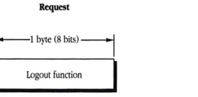

```mermaid
packet-beta
0-7: "Logout function"
```

| Field | Bit offset | Width (bits) | Description |
| :--- | :--- | :--- | :--- |
| Logout function | 0 | 8 | The command code for FPLogout. |

## FPMapID

This request maps a user ID to a user name, or a group ID to a group name.

### Inputs

| Field | Type | Description |
| :--- | :--- | :--- |
| *SRefNum* | *int* | session refnum |
| *Subfunction* | *byte* | subfunction code:<br>1 = map user ID to user name<br>2 = map group ID to group name |
| *ID* | *long* | item to be mapped, either user ID or group ID |

### Outputs

| Field | Type | Description |
| :--- | :--- | :--- |
| *FPError* | *long* | |
| *Name* | *string* | name corresponding to ID |

### Result codes

| Result Code | Description |
| :--- | :--- |
| *ParamErr* | Session refnum or subfunction code is unknown; no ID was passed in the request block. |
| *ItemNotFound* | ID was not recognized |

### Algorithm

The server retrieves a user or group name corresponding to the specified user ID or group ID. An ItemNotFound result code is returned if the ID does not exist in the server's list of valid user or group IDs.

### Notes

A user ID or group ID of 0 maps to a null string.

### Block format

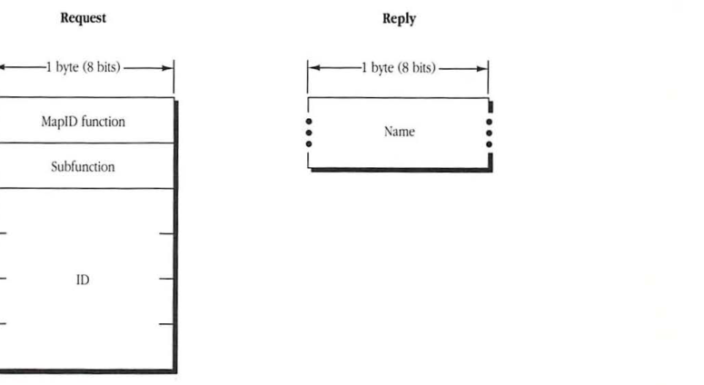

#### Request

```mermaid
packet-beta
0-7: "MapID function"
8-15: "Subfunction"
16-47: "ID"
```

| Field | Bit offset | Width (bits) | Description |
| :--- | :--- | :--- | :--- |
| MapID function | 0 | 8 | The function code for MapID. |
| Subfunction | 8 | 8 | Subfunction code (1 for user, 2 for group). |
| ID | 16 | 32 | The user or group ID to be mapped. |

#### Reply

```mermaid
packet-beta
0-7: "Name"
```

| Field | Bit offset | Width (bits) | Description |
| :--- | :--- | :--- | :--- |
| Name | 0 | Variable | The name corresponding to the ID. |

## FPMapName

This request maps a user name to a user ID, or a group name to a group ID.

### Inputs

| Field | Description |
| :--- | :--- |
| *SRefNum (int)* | session refnum |
| *Subfunction (byte)* | subfunction code:<br>3 = map user name to user ID<br>4 = map group name to group ID |
| *Name (string)* | item to be mapped, either user name or group name |

### Outputs

| Field | Description |
| :--- | :--- |
| *FPError (long)* | |
| *ID (long)* | ID corresponding to input name |

### Result codes

| Code | Description |
| :--- | :--- |
| *ParamErr* | Session refnum or function code is unknown. |
| *ItemNotFound* | Name is not recognized. |

### Algorithm

The server retrieves an ID number corresponding to a user or group name or returns an `ItemNotFound` result code if it does not find the name in its list of valid names.

### Notes

A null user or group name maps to an ID of 0.

### Block format

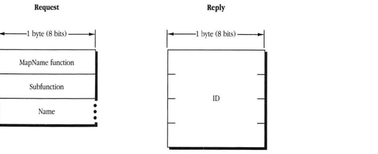

#### Request

```mermaid
packet-beta
0-7: "MapName function"
8-15: "Subfunction"
16-31: "Name"
```

| Field | Bit offset | Width (bits) | Description |
|---|---|---|---|
| MapName function | 0 | 8 | Command code for FPMapName |
| Subfunction | 8 | 8 | Subfunction code (3 = user, 4 = group) |
| Name | 16 | Variable | Item to be mapped, either user name or group name |

#### Reply

```mermaid
packet-beta
0-31: "ID"
```

| Field | Bit offset | Width (bits) | Description |
|---|---|---|---|
| ID | 0 | 32 | ID corresponding to input name |

## FPMoveAndRename

This request moves a directory or file to another location on the same volume. It can also be used to rename the directory or file. Text in **boldface** applies to **AFP Version 2.0 only**.

| | | |
| :--- | :--- | :--- |
| ### Inputs | *SRefNum (int)* | session refnum |
| | *Volume ID (int)* | volume identifier |
| | *Source Directory ID (long)* | source ancestor directory identifier |
| | *Source PathType (byte)* | indicates whether Source Pathname is composed of long names or short names:<br>1 = short names<br>2 = long names |
| | *Source Pathname (string)* | pathname of file or directory to be moved (may be null if a directory is to be moved) |
| | *Dest Directory ID (long)* | destination ancestor directory identifier |
| | *Dest PathType (byte)* | indicates whether Dest Pathname is composed of long names or short names (same values as Source PathType) |
| | *Dest Pathname (string)* | pathname to the destination parent directory (may be null) |
| | ***NewType (byte)*** | indicates whether NewName is a long name or a short name (same values as Source PathType) |
| | ***NewName (string)*** | new name of file or directory (may be null) |
| ## Outputs | *FPError (long)* | |


### Result codes

| | |
| :--- | :--- |
| *ParamErr* | Session refnum, volume identifier, or pathname type is unknown; pathname or NewName is bad. |
| *ObjectNotFound* | Input parameters do not point to an existing file or directory. |
| *ObjectExists* | A file or directory with the name NewName already exists. |
| *CantMove* | An attempt was made to move a directory into one of its descendent directories. |
| *AccessDenied* | User does not have the rights listed below; in AFP 1.1, the volume is ReadOnly; in AFP 1.1, the directory being moved (and/or renamed) is marked RenameInhibit; in AFP 1.1, the file being moved and renamed is marked RenameInhibit. |
| *ObjectLocked* | **In AFP 2.0, the directory being moved (and/or renamed) is marked RenameInhibit; in AFP 2.0, the file being moved and renamed is marked RenameInhibit.** |
| *VolLocked* | **In AFP 2.0, the volume is ReadOnly.** |

### Algorithm

This call does not just copy the CNode; it deletes it from the original parent directory. If the NewName parameter is null, the moved CNode retains its original name. Otherwise, the server moves the CNode, creating the long or short names as described in the "Catalog Node Names" earlier in this chapter. The CNode's modification date and the modification date of the source and destination parent directories are set to the server's clock. The CNode's Parent ID is set to the destination Parent ID. All other parameters remain unchanged, and if the CNode is a directory, the parameters of all descendent directories and files remain unchanged.

The FPMoveAndRename call indicates the destination of the move by specifying the ancestor Directory ID and pathname to the CNode's destination parent directory.

If the CNode being moved is a directory, all its descendents are moved as well.

### Rights

To move a directory, the user must have search access to all ancestors, down to and including the source and destination parent directories, as well as write access to those directories. To move a file, the user must have search access to all ancestors, except the source and destination parent, as well as read and write access to the source parent directory and write access to the destination parent directory.

### Notes

The user must have previously called FPOpenVol for this volume.

A CNode cannot be moved from one volume to another with this call, even if both volumes are managed by the same server.

### Block format

#### Request

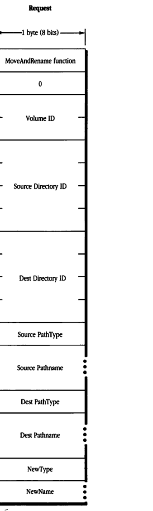

```mermaid
packet-beta
0-7: "MoveAndRename function"
8-15: "0"
16-31: "Volume ID"
32-63: "Source Directory ID"
64-95: "Dest Directory ID"
96-103: "Source PathType"
104-111: "Source Pathname"
112-119: "Dest PathType"
120-127: "Dest Pathname"
128-135: "NewType"
136-143: "NewName"
```

| Field | Bit offset | Width (bits) | Description |
| :--- | :--- | :--- | :--- |
| MoveAndRename function | 0 | 8 | Function identifier for the MoveAndRename operation. |
| 0 | 8 | 8 | Reserved byte, set to 0. |
| Volume ID | 16 | 16 | The identifier for the volume. |
| Source Directory ID | 32 | 32 | The identifier for the source directory. |
| Dest Directory ID | 64 | 32 | The identifier for the destination directory. |
| Source PathType | 96 | 8 | The format indicator for the Source Pathname. |
| Source Pathname | 104 | Variable | The pathname of the source file or directory. |
| Dest PathType | Variable | 8 | The format indicator for the Dest Pathname. |
| Dest Pathname | Variable | Variable | The pathname of the destination directory. |
| NewType | Variable | 8 | The format indicator for the NewName. |
| NewName | Variable | Variable | The new name for the file or directory. |

## FPOpenDir

This request opens a directory on a variable Directory ID volume and returns its Directory ID.

### Inputs

| Field | Type | Description |
| :--- | :--- | :--- |
| *SRefNum* | (int) | session refnum |
| *Volume ID* | (int) | volume identifier |
| *Directory ID* | (long) | ancestor directory identifier |
| *PathType* | (byte) | indicates whether Pathname is composed of long names or short names:<br>1 = short names<br>2 = long names |
| *Pathname* | (string) | pathname to desired directory (cannot be null) |

### Outputs

| Field | Type | Description |
| :--- | :--- | :--- |
| *FPError* | (long) | |
| *Directory ID* | (long) | identifier of specified directory |

### Result codes

| Result code | Description |
| :--- | :--- |
| *ParamErr* | Session refnum, volume identifier, or pathname type is unknown; pathname is bad. |
| *ObjectNotFound* | Input parameters do not point to an existing directory. |
| *AccessDenied* | User does not have the rights listed below. |
| *ObjectTypeErr* | Input parameters point to a file. |

### Algorithm

If the Volume ID parameter specifies a variable Directory ID volume, the server generates a Directory ID for the specified directory. If the Volume ID parameter specifies a fixed Directory ID type, the server returns the fixed Directory ID belonging to this directory.

Although this call can obtain a Directory ID for a directory on a fixed Directory ID volume, it is not the recommended way to obtain the parameter; use the FPGetFileDirParms or FPEnumerate call instead.

### Rights

The user must have search access to all ancestors down to and including this directory's parent directory.

### Notes

The user must have previously called FPOpenVol for this volume.

### Block format

#### Request

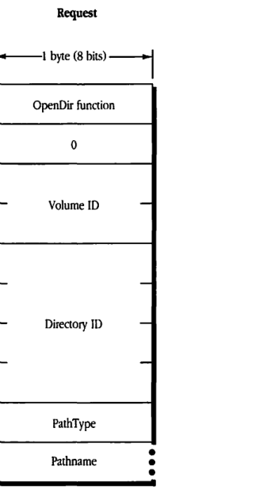

```mermaid
packet-beta
0-7: "OpenDir function"
8-15: "0"
16-31: "Volume ID"
32-63: "Directory ID"
64-71: "PathType"
72-87: "Pathname"
```

| Field | Bit offset | Width (bits) | Description |
| :--- | :--- | :--- | :--- |
| OpenDir function | 0 | 8 | The identifier for the OpenDir function. |
| 0 | 8 | 8 | Reserved; must be zero. |
| Volume ID | 16 | 16 | The identifier of the volume. |
| Directory ID | 32 | 32 | The identifier of the parent directory. |
| PathType | 64 | 8 | The format type of the pathname. |
| Pathname | 72 | Variable | The name of the directory to be opened. |

#### Reply

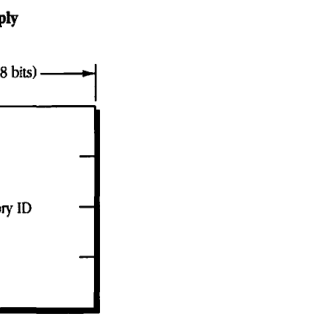

```mermaid
packet-beta
0-31: "Directory ID"
```

| Field | Bit offset | Width (bits) | Description |
| :--- | :--- | :--- | :--- |
| Directory ID | 0 | 32 | The unique identifier assigned to the opened directory. |

## FPOpenDT

This request opens the Desktop database on a particular volume.

### Inputs

| | |
|---|---|
| Volume ID (int) | volume identifier |

### Outputs

| | |
|---|---|
| FPError (long) | |
| DTRefNum (int) | Desktop database refnum |

### Result codes

| | |
|---|---|
| ParamErr | Session refnum or volume identifier is unknown. |

### Algorithm

The server opens the Desktop database on the selected volume and returns a Desktop database refnum, which is unique among such refnums. The DTRefNum is to be used in all subsequent Desktop database calls relating to this volume.

### Block format

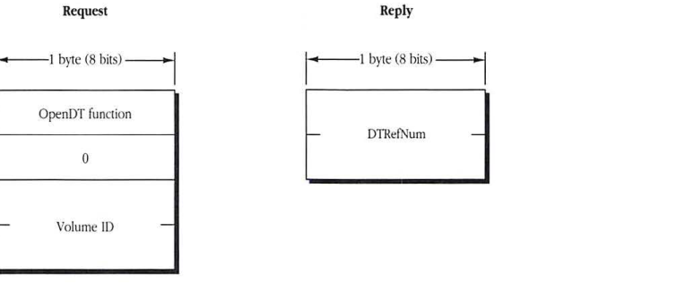

#### Request

```mermaid
packet-beta
0-7: "OpenDT function"
8-15: "0"
16-31: "Volume ID"
```

| Field | Bit offset | Width (bits) | Description |
|---|---|---|---|
| OpenDT function | 0 | 8 | The function code for FPOpenDT. |
| 0 | 8 | 8 | Reserved byte; must be 0. |
| Volume ID | 16 | 16 | The volume identifier. |

#### Reply

```mermaid
packet-beta
0-15: "DTRefNum"
```

| Field | Bit offset | Width (bits) | Description |
|---|---|---|---|
| DTRefNum | 0 | 16 | Desktop database reference number. |

## FPOpenFork

This request opens the data or resource fork of an existing file to read from it or write to it. Text in **boldface** applies to **AFP Version 2.0 only.**

### Inputs

| Parameter | Description |
| :--- | :--- |
| *SRefNum (int)* | session refnum |
| *Volume ID (int)* | volume identifier |
| *Directory ID (long)* | ancestor directory identifier |
| *Bitmap (int)* | bitmap describing which parameters are to be returned (the bit corresponding to each desired parameter should be set); this field is the same as File Bitmap in the FPGetFileDirParms call and can be null |
| *AccessMode (int)* | desired access and deny modes, specified by any combination of the following bits:<br>0 *Read* allows the fork to be read<br>1 *Write* allows the fork to be written to<br>4 *DenyRead* denies others the right to read the fork while this user has it open<br>5 *DenyWrite* denies others the right to write to the fork while this user has it open<br>(See "File Sharing Modes" earlier in this chapter for an explanation of deny modes.) |
| *PathType (byte)* | indicates whether Pathname is composed of long names or short names:<br>1 = short names<br>2 = long names |
| *Pathname (string)* | pathname to desired file; cannot be null |
| *Rsrc/DataFlag (bit)* | flag indicating which fork is to be opened:<br>0 = data fork<br>1 = resource fork |

### Outputs

| Parameter | Description |
| :--- | :--- |
| *FPError (long)* | |
| *Bitmap (int)* | copy of input parameter |
| *OForkRefNum (int)* | refnum used to refer to this fork in subsequent calls |
| *File parameters requested* | |

### Result codes

| Result code | Description |
| :--- | :--- |
| *ParamErr* | Session refnum, volume identifier, or pathname type is unknown; pathname is null or bad. |
| *ObjectNotFound* | Input parameters do not point to an existing file. |
| *BitmapErr* | An attempt was made to retrieve a parameter that cannot be obtained with this call (fork will not be opened). |
| *DenyConflict* | Fork cannot be opened because deny modes conflict (however, the file's parameters will be returned). |
| *AccessDenied* | User does not have the rights listed below; in AFP 1.1, the file is marked WriteInhibit and the user attempted to open it for write; in AFP 1.1, the volume is ReadOnly and the user attempted to open the file for write. |
| **ObjectLocked** | **In AFP 2.0, the file is marked WriteInhibit and the user attempted to open it for write.** |
| **Vollocked** | **In AFP 2.0, the volume is ReadOnly and the user attempted to open the file for write.** |
| *ObjectTypeErr* | Input parameters point to a directory. |
| *TooManyFilesOpen* | The server cannot open another fork. |

### Algorithm

The server opens the specified fork if the user has the access rights for the requested access mode and if the access mode does not conflict with already-open access paths to this fork.

If the call opens the fork, the server packs the specified parameters, in bitmap order, in the reply block, preceded by Bitmap and OForkRefNum. This OForkRefNum is used in all subsequent calls involving the open fork.

File parameters are returned only if the call is completed with no error or with a DenyConflict result code. In the latter case, the server returns 0 for the OForkRefNum and also returns the requested parameters so that the user can determine whether he or she is the one who has the fork open.

A BitmapErr result code is returned if an attempt is made to retrieve the length of the file's other fork.

The server needs to keep variable-length parameters, such as Long Name and Short Name, at the end of the reply block. In order to do this, the server represents variable-length parameters in bitmap order as fixed-length offsets (integers). Each offset is measured from the start of the parameters (not from the start of the Bitmap) to the start of the variable-length fields. The actual variable-length fields are then packed after all fixed-length fields.

If the fork is opened and the user has requested the file's attributes in the Bitmap, the appropriate DAlreadyOpen or RAlreadyOpen bit is set.

### Rights

To open a fork for read or none (when neither read nor write access is requested) access, the user must have search access to all ancestors, except the parent directory, as well as read access to the parent directory. For details about access modes, see "File Sharing Modes" earlier in this chapter.

To open the fork for write, the volume must not be designated for read-only access. If both forks are currently empty, the user must have search or write access to all ancestors, except the parent directory, as well as write access to the parent directory. If either fork is not empty and one of them is being opened for write, the user must have search access to all ancestors, except the parent directory, as well as read and write access to the parent directory.

### Notes

The user must have previously called FPOpenVol for this volume. Each fork must be opened separately; a unique OForkRefNum is returned for each.

### Block format

#### Request

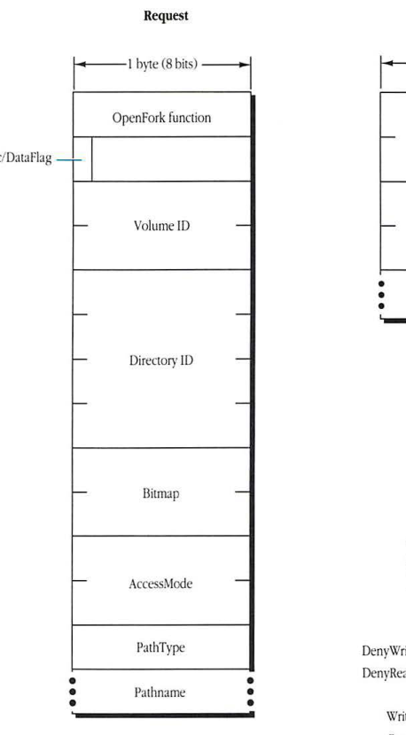

```mermaid
packet-beta
0-7: "OpenFork function"
8-15: "Rsrc/DataFlag"
16-31: "Volume ID"
32-63: "Directory ID"
64-79: "Bitmap"
80-95: "AccessMode"
96-103: "PathType"
104-111: "Pathname..."
```

| Field | Bit offset | Width (bits) | Description |
|---|---|---|---|
| OpenFork function | 0 | 8 | The AFP function code for OpenFork. |
| Rsrc/DataFlag | 8 | 8 | A flag indicating whether to open the data fork (bit 7 = 0) or the resource fork (bit 7 = 1). |
| Volume ID | 16 | 16 | The identifier of the volume containing the file. |
| Directory ID | 32 | 32 | The identifier of the directory containing the file. |
| Bitmap | 64 | 16 | A bitmap specifying the file parameters to be returned in the reply. |
| AccessMode | 80 | 16 | The requested access mode for the file (see AccessMode bit layout). |
| PathType | 96 | 8 | The format of the pathname (e.g., short or long). |
| Pathname | 104 | variable | The pathname of the file to be opened. |

#### Reply

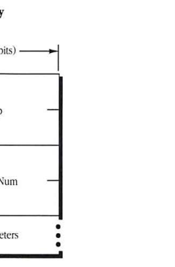

```mermaid
packet-beta
0-15: "Bitmap"
16-31: "OForkRefNum"
32-47: "File parameters..."
```

| Field | Bit offset | Width (bits) | Description |
|---|---|---|---|
| Bitmap | 0 | 16 | A bitmap indicating which file parameters are present in the reply. |
| OForkRefNum | 16 | 16 | The reference number assigned to the open fork. |
| File parameters | 32 | variable | The requested file parameters, in the order specified by the bitmap. |

#### AccessMode

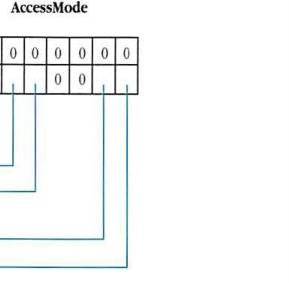

```mermaid
packet-beta
0-7: "Reserved (0)"
8-9: "Reserved (0)"
10: "DenyWrite"
11: "DenyRead"
12-13: "Reserved (0)"
14: "Write"
15: "Read"
```

| Field | Bit offset | Width (bits) | Description |
|---|---|---|---|
| Reserved | 0 | 10 | Reserved; must be 0. |
| DenyWrite | 10 | 1 | If set (1), deny write access to other users. |
| DenyRead | 11 | 1 | If set (1), deny read access to other users. |
| Reserved | 12 | 2 | Reserved; must be 0. |
| Write | 14 | 1 | Request write access to the fork. |
| Read | 15 | 1 | Request read access to the fork. |


## FPOpenVol

This call makes a volume available to the workstation.

### Inputs

| | |
|---|---|
| *SRefNum (int)* | session refnum |
| *Bitmap (int)* | bitmap describing which parameters are to be returned (the bit corresponding to each desired parameter should be set); this field is the same as that in the FPGetVolParms call and cannot be null |
| *Volume Name (string)* | name of the volume as returned by the FPGetSrvrParms call |
| *Password (8 bytes)* | optional password |

### Outputs

| | |
|---|---|
| *FPError (long)* | |
| *Bitmap (int)* | copy of input parameter |
| *Volume parameters requested* | |

### Result codes

| | |
|---|---|
| *ParamErr* | Session refnum or volume name is unknown. |
| *BitmapErr* | An attempt was made to retrieve a parameter that cannot be obtained with this call; bitmap is null. |
| *AccessDenied* | Password is not supplied or does not match. |

### Algorithm

The FPOpenVol call indicates that the user of a workstation wants to work with a volume. This call must be submitted before any other call can be made to obtain access to the CNodes on the volume.

If a password is required to gain access to the volume, it is sent as the Password parameter in cleartext, padded (suffixed) with null bytes to its full 8-byte length. Password comparison is case-sensitive. The server checks that the password supplied by the user matches the one kept with the volume. If they do not match, or if no Password parameter was supplied, an AccessDenied result code is returned.

If the passwords match, or if the volume is not password-protected, the server retrieves the requested parameters and packs them into the reply block. The user now has permission to make calls relating to files and directories on the volume.

### Notes

The FPOpenVol call cannot be made with a null Bitmap parameter. The Bitmap must request that the Volume ID be returned. This parameter cannot be retrieved any other way, and it is needed for most subsequent calls.

FPOpenVol can be called multiple times without an intervening FPCloseVol call; however, a single FPCloseVol call invalidates the Volume ID.

### Block format

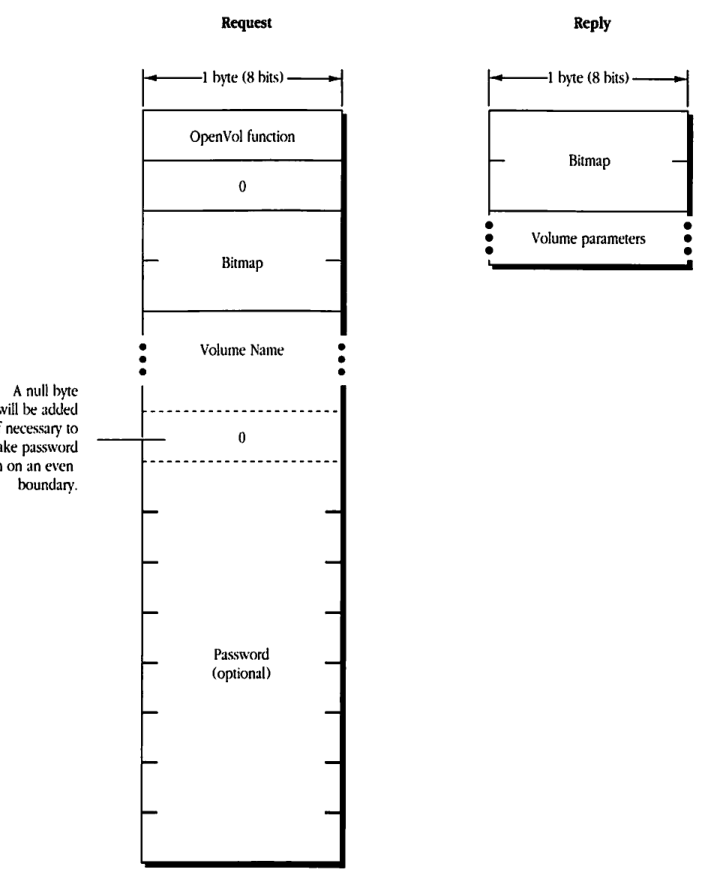

#### Request

```mermaid
packet-beta
0-7: "OpenVol function"
8-15: "0"
16-23: "Bitmap"
24-31: "Volume Name (variable length)"
32-39: "0 (optional padding byte)"
40-47: "Password (optional, variable length)"
```

| Field | Bit offset | Width (bits) | Description |
|---|---|---|---|
| OpenVol function | 0 | 8 | The function code for FPOpenVol. |
| 0 | 8 | 8 | Reserved; must be 0. |
| Bitmap | 16 | 8 | A bitmap specifying which volume parameters to return. |
| Volume Name | 24 | Variable | The name of the volume to open (Pascal string). |
| 0 (optional padding byte) | Variable | 8 | A null byte added if necessary to make the password begin on an even boundary. |
| Password (optional) | Variable | Variable | The password for the volume. |

#### Reply

```mermaid
packet-beta
0-7: "Bitmap"
8-15: "Volume parameters (variable length)"
```

| Field | Bit offset | Width (bits) | Description |
|---|---|---|---|
| Bitmap | 0 | 8 | A bitmap indicating which volume parameters are being returned. |
| Volume parameters | 8 | Variable | The requested volume parameters. |


## FPRead

This request reads a block of data from an open fork. Text in boldface applies to AFP Version 2.0 only.

### Inputs

| | |
|---|---|
| *SRefNum (int)* | session refnum |
| *OForkRefNum (int)* | open fork refnum |
| *Offset (long)* | number of the first byte to be read |
| *ReqCount (long)* | number of bytes to be read |
| ***Newline Mask (byte)*** | mask used to determined where the read should be terminated |
| ***Newline Char (byte)*** | character used to determine where the read should be terminated |

### Outputs

| | |
|---|---|
| *FPError (long)* | |
| ***ActCount (long)*** | number of bytes actually read from the fork |
| ***Fork data requested*** | |

### Result codes

| | |
|---|---|
| *ParamErr* | Session refnum or open fork refnum is unknown; ReqCount or Offset is negative; Newline Mask is invalid. |
| *AccessDenied* | Fork was not opened for read access. |
| *EOFErr* | End of fork was reached. |
| *LockErr* | Some or all of the requested range is locked by another user. |

### Algorithm

The FPRead request retrieves a range of bytes from a specified fork. The server begins reading at the byte number specified by the Offset parameter. The server terminates the read for one of the following reasons (whichever comes first):

* It encounters the character specified by the combination of Newline Char and Newline Mask.
* It reaches the end of fork.
* It encounters the start of a range locked by another user.
* It finishes reading the number of bytes specified by the ReqCount parameter.

### Block format

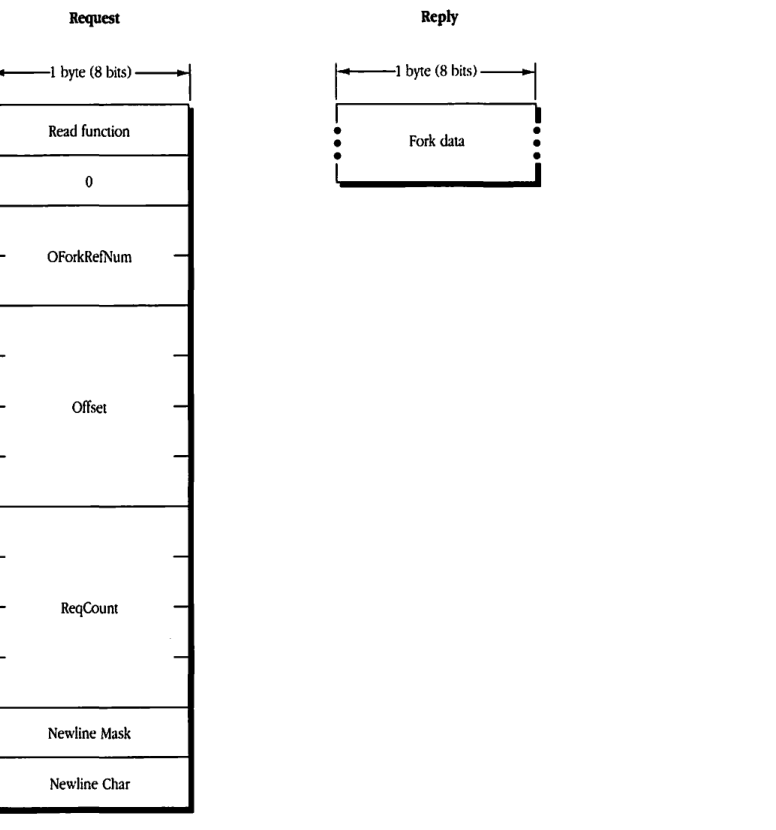

#### Request

```mermaid
packet-beta
0-7: "Read function"
8-15: "0"
16-31: "OForkRefNum"
32-63: "Offset"
64-95: "ReqCount"
96-103: "Newline Mask"
104-111: "Newline Char"
```

| Field | Bit offset | Width (bits) | Description |
|---|---|---|---|
| Read function | 0 | 8 | The AFP function code for FPRead. |
| 0 | 8 | 8 | Reserved byte; must be zero. |
| OForkRefNum | 16 | 16 | The reference number of the open fork to read from. |
| Offset | 32 | 32 | The byte offset from the start of the fork where the read should begin. |
| ReqCount | 64 | 32 | The number of bytes to read from the fork. |
| Newline Mask | 96 | 8 | The mask used to determine which bits of a character are used to match the Newline Char. |
| Newline Char | 104 | 8 | The character that marks the end of a line during the read. |

#### Reply

```mermaid
packet-beta
0-31: "Fork data"
```

| Field | Bit offset | Width (bits) | Description |
|---|---|---|---|
| Fork data | 0 | Variable | The actual data read from the fork. |

## FPRemoveAPPL

This request removes an APPL mapping from the volume's Desktop database.

### Inputs

| | |
| :--- | :--- |
| *SRefNum (int)* | session refnum |
| *DTRefNum (int)* | Desktop database refnum |
| *Directory ID (long)* | ancestor directory identifier |
| *FileCreator (ResType)* | file creator of application corresponding to the APPL mapping |
| *PathType (byte)* | indicates whether Pathname is composed of long names or short names:<br>1 = short names<br>2 = long names |
| *Pathname (string)* | pathname to the application corresponding to the APPL mapping being removed |

### Outputs

| | |
| :--- | :--- |
| *FPError (long)* | |

### Result codes

| | |
| :--- | :--- |
| *ParamErr* | Session refnum or Desktop database refnum is unknown. |
| *ObjectNotFound* | Input parameters do not point to an existing file. |
| *AccessDenied* | User does not have the rights listed below. |
| *ItemNotFound* | No APPL mapping corresponding to the input parameters was found in the Desktop database. |

### Algorithm

The server locates in the Desktop database the APPL mapping corresponding to the specified application and FileCreator. If an APPL mapping is found, it is removed.

### Rights

The user must have search access to all ancestors, except the parent directory, as well as read and write access to the parent directory.

### Notes

The user must have previously called FPOpenDT for the corresponding volume. In addition, the file must exist in the specified directory before this call is issued.

### Block format

#### Reply

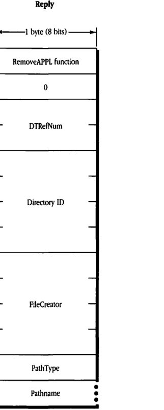

```mermaid
packet-beta
0-7: "RemoveAPPL function"
8-15: "0"
16-31: "DTRefNum"
32-63: "Directory ID"
64-95: "FileCreator"
96-103: "PathType"
104-111: "Pathname"
```

| Field | Bit offset | Width (bits) | Description |
| :--- | :--- | :--- | :--- |
| RemoveAPPL function | 0 | 8 | The function code for RemoveAPPL. |
| 0 | 8 | 8 | Reserved; must be 0. |
| DTRefNum | 16 | 16 | Desktop Reference Number. |
| Directory ID | 32 | 32 | Directory ID of the application's parent directory. |
| FileCreator | 64 | 32 | Creator of the application to be removed. |
| PathType | 96 | 8 | Path type (long or short). |
| Pathname | 104 | variable | Pathname of the application's parent directory. |

## FPRemoveComment

This request removes a comment from the volume's Desktop database.

### Inputs

| Field | Type | Description |
| :--- | :--- | :--- |
| *SRefNum* | (int) | session refnum |
| *DTRefNum* | (int) | Desktop database refnum |
| *Directory ID* | (long) | ancestor directory identifier |
| *PathType* | (byte) | indicates whether Pathname is composed of long names or short names:<br>1 = short names<br>2 = long names |
| *Pathname* | (string) | the pathname to the file or folder associated with the comment |

### Outputs

| Field | Type | Description |
| :--- | :--- | :--- |
| *FPError* | (long) | |

### Result codes

| Code | Description |
| :--- | :--- |
| *ParamErr* | Session refnum, Desktop database refnum, or pathname type is unknown; pathname is bad. |
| *ItemNotFound* | No comment was found in Desktop database. |
| *AccessDenied* | User does not have the rights listed below. |
| *ObjectNotFound* | Input parameters do not point to an existing file or directory. |

### Algorithm

The server removes the comment associated with the specified file or folder from the Desktop database.

### Rights

If the comment is associated with a directory that is not empty, the user must have search access to all ancestors, including the parent directory, plus write access to the parent directory. If the comment is associated with an empty directory, the user must have search or write access to all ancestors, including the parent directory, plus write access to the parent directory.

If the comment is associated with a file that is not empty, the user must have search access to all ancestors, except the parent directory, plus read and write access to the parent directory. If the comment is associated with an empty file, the user must have search or write access to all ancestors, except the parent directory, plus write access to the parent directory.

### Notes

The user must have previously called FPOpenDT for the corresponding volume.


### Block format

#### Request

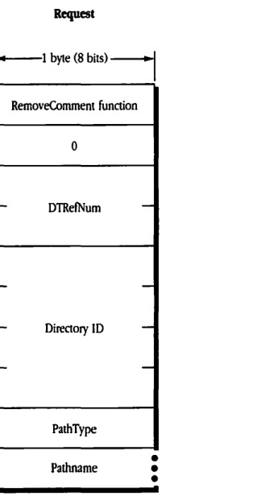

```mermaid
packet-beta
0-7: "RemoveComment function"
8-15: "0"
16-31: "DTRefNum"
32-63: "Directory ID"
64-71: "PathType"
72-103: "Pathname (variable)"
```

| Field | Bit offset | Width (bits) | Description |
| :--- | :--- | :--- | :--- |
| RemoveComment function | 0 | 8 | The function code for the RemoveComment operation. |
| (Reserved) | 8 | 8 | Reserved; must be 0. |
| DTRefNum | 16 | 16 | The desktop database reference number. |
| Directory ID | 32 | 32 | The directory ID of the parent directory. |
| PathType | 64 | 8 | The type of the path (e.g., short or long). |
| Pathname | 72 | Variable | The pathname of the file or directory. |


## FPRename

This request renames a directory or file. Text in **boldface** applies to **AFP Version 2.0 only**.

### Inputs

| Field | Description |
|---|---|
| *SRefNum (int)* | session refnum |
| *Volume ID (int)* | volume identifier |
| *Directory ID (long)* | ancestor directory identifier |
| *PathType (byte)* | indicates whether Pathname is composed of long names or short names:<br>1 = short names<br>2 = long names |
| *Pathname (string)* | pathname to file or directory to be renamed; can be null if a directory is being renamed |
| *NewType (byte)* | indicates whether NewName is a long name or short name (same values as PathType) |
| *NewName (string)* | new name of file or directory (cannot be null) |

### Outputs

| Field | Description |
|---|---|
| *FPError (long)* | |

### Result codes

| Code | Description |
|---|---|
| *ParamErr* | Session refnum, volume identifier, or pathname type is unknown; pathname or NewName is bad. |
| *ObjectNotFound* | Input parameters do not point to an existing file or directory. |
| *ObjectExists* | A file or directory with the name NewName already exists. |
| *AccessDenied* | User does not have the rights listed below; in AFP 1.1, the volume is ReadOnly; in AFP 1.1, the file or directory is marked RenameInhibit. |
| **VolLocked** | **In AFP 2.0, the volume is ReadOnly.** |
| **ObjectLocked** | **In AFP 2.0, the file or directory is marked RenameInhibit.** |
| *CantRename* | An attempt was made to rename a volume or root directory. |

### Algorithm

The server assigns a new name to the file or directory. The other name (long or short) is generated as described in "Catalog Node Names" earlier in this chapter. The modification date of the parent directory is set to the server's clock.


### Rights

To rename a directory, the user must have search access to all ancestors, including the CNode's parent directory, as well as write access to the parent directory. To rename a file, the user must have search access to all ancestors, except the CNode's parent directory, as well as read and write access to the parent directory.

### Notes

The user must have previously called FPOpenVol for this volume.

### Block format

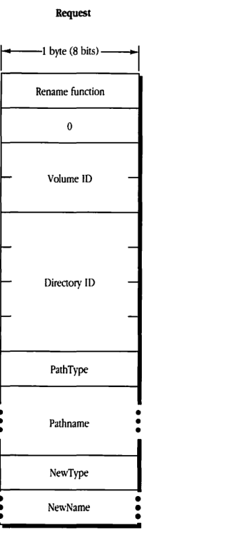

```mermaid
packet-beta
0-7: "Rename function"
8-15: "0"
16-31: "Volume ID"
32-63: "Directory ID"
64-71: "PathType"
72-87: "Pathname"
88-95: "NewType"
96-111: "NewName"
```

| Field | Bit offset | Width (bits) | Description |
|---|---|---|---|
| Rename function | 0 | 8 | The code for the rename operation. |
| 0 | 8 | 8 | Reserved byte, set to 0. |
| Volume ID | 16 | 16 | The volume identifier. |
| Directory ID | 32 | 32 | The directory identifier. |
| PathType | 64 | 8 | The format of the pathname string. |
| Pathname | 72 | Variable | The original pathname of the object to be renamed. |
| NewType | Variable | 8 | The format of the new name string. |
| NewName | Variable | Variable | The new name for the object. |


## FPSetDirParms

This request sets parameters for a specified directory. Text in **boldface** applies to **AFP Version 2.0 only**.

### Inputs

* *SRefNum (int)*: session refnum
* *Volume ID (int)*: volume identifier
* *Directory ID (long)*: ancestor directory identifier
* *Bitmap (int)*: bitmap describing which parameters are to be set (the bit corresponding to each desired parameter should be set); this field is the same as Directory Bitmap in the FPGetFileDirParms call
* *PathType (byte)*: indicates whether Pathname is composed of long names or short names:
    * 1 = short names
    * 2 = long names
* *Pathname (string)*: pathname to desired directory
* *Directory parameters*: to be set

### Outputs

* *FPError (long)*

### Result codes

* *ParamErr*: Session refnum, volume identifier, or pathname type is unknown; pathname is bad; owner or group ID is not valid.
* *ObjectNotFound*: Input parameters do not point to an existing directory.
* *BitmapErr*: An attempt was made to set a parameter that cannot be set with this call; bitmap is null.
* *AccessDenied*: User does not have the rights listed below; in AFP 1.1, the volume is ReadOnly.
* ***VolLocked***: **In AFP 2.0, the volume is ReadOnly.**
* *ObjectTypeErr*: Input parameters point to a file.

### Algorithm

The FPSetDirParms call sets parameters for a directory. The parameters must be packed, in bitmap order, in the request block.

The workstation needs to keep variable-length parameters, such as Long Name and Short Name, at the end of the block. In order to do this, variable-length parameters are represented in bitmap order as fixed-length offsets (integers). These offsets are measured from the start of the parameters to the start of the variable-length fields. The actual variable-length fields are then packed after all fixed-length fields.

A null byte must be added between the Pathname and the Directory Parameters if necessary to make the parameters begin on an even boundary in the request block.

If this call sets the access controls, dates (except modification date), Finder Info, **ProDOS Info**, or changes any attributes, the modification date of the directory will be set to the server's clock. If this call sets the access controls, owner ID, group ID, or Invisible attribute, the modification date of the directory's parent directory will be set to the server's clock.

Changing a directory's access rights immediately affects other currently open sessions. If the user does not have the access rights to set any one of a number of parameters, an AccessDenied result code will be returned and no parameters will be set.

### Rights

To set a directory's access rights, owner ID, or group ID, or to change the **DeleteInhibit**, **RenameInhibit**, **WriteInhibit**, or Invisible attributes, the user must have search or write access to all ancestors, including this directory's parent directory, and the user must be the owner of the directory. To set any parameter other than the ones mentioned above for an empty directory, the user must have search or write access to all ancestors, except the parent directory, as well as write access to the parent directory. To set any parameter other than the ones mentioned above for a directory that is not empty, the user must have search access to all ancestors, including the parent directory, as well as write access to the parent directory.

### Notes

The user must have previously called FPOpenVol for this volume.

This call cannot be used to set a directory's name (use FPRename), parent Directory ID (use FPMoveAndRename), Directory ID, or Offspring Count.

### Block format

#### Request

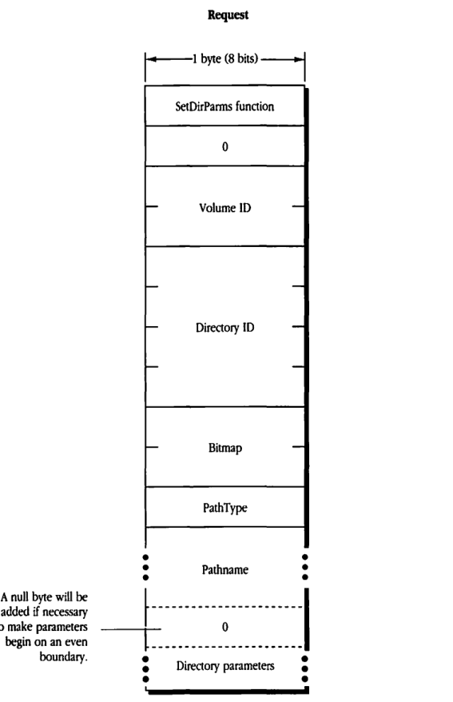

```mermaid
packet-beta
0-7: "SetDirParms function"
8-15: "0"
16-31: "Volume ID"
32-63: "Directory ID"
64-79: "Bitmap"
80-87: "PathType"
88-103: "Pathname (variable)"
104-111: "0 (padding)"
112-127: "Directory parameters (variable)"
```

| Field | Bit offset | Width (bits) | Description |
|---|---|---|---|
| SetDirParms function | 0 | 8 | The function code for FPSetDirParms. |
| 0 | 8 | 8 | Reserved; must be zero. |
| Volume ID | 16 | 16 | The volume ID of the target directory. |
| Directory ID | 32 | 32 | The directory ID of the target directory. |
| Bitmap | 64 | 16 | A bitmap indicating which directory parameters are to be set. |
| PathType | 80 | 8 | The type of pathname provided (e.g., short or long). |
| Pathname | 88 | Variable | The pathname to the directory. |
| 0 | Variable | 0 or 8 | A null padding byte, added if necessary to make the following directory parameters begin on an even boundary. |
| Directory parameters | Variable | Variable | The set of directory parameters being set, as indicated by the Bitmap field. |

## FPSetFileDirParms

This request sets parameters for a file or directory. Text in **boldface** applies to **AFP Version 2.0 only.**

### Inputs

| Field | Description |
| :--- | :--- |
| *SRefNum (int)* | session refnum |
| *Volume ID (int)* | volume identifier |
| *Directory ID (long)* | ancestor directory identifier |
| *Bitmap (int)* | bitmap describing which parameters are to be set (the bit corresponding to each desired parameter should be set); this field is the same as File Bitmap or Directory Bitmap in the FPGetFileDirParms call (only the parameters that are common to both bitmaps may be set by this call) |
| *PathType (byte)* | indicates whether Pathname is composed of long names or short names:<br>1 = short names<br>2 = long names |
| *Pathname (string)* | pathname to desired file or directory |
| *Parameters to be set* | |

### Outputs

| Field | Description |
| :--- | :--- |
| *FPError (long)* | |

### Result codes

| Code | Description |
| :--- | :--- |
| *ParamErr* | Session refnum, volume identifier, or pathname type is unknown; pathname is bad. |
| *ObjectNotFound* | Input parameters do not point to an existing file or directory. |
| *AccessDenied* | User does not have the rights listed below; in AFP 1.1, the volume is ReadOnly. |
| **VolLocked** | **In AFP 2.0, the volume is ReadOnly.** |
| *BitmapErr* | An attempt was made to set a parameter that cannot be set with this call; bitmap is null. |


### Algorithm

The parameters that this call can set or clear are the Invisible and System attributes, Creation Date, Modification Date, Backup Date, Finder Info, and ProDOS Info.

These parameters are common to both files and directories. The parameters must be packed, in bitmap order, in the request block.

The workstation needs to keep variable-length parameters at the end of the block. In order to do this, variable-length parameters are represented in bitmap order as fixed-length offsets (integers). These offsets are measured from the start of the parameters to the start of the variable-length fields. The actual variable-length fields are then packed after all fixed-length fields.

A null byte must be added between the Pathname and the Parameters if necessary to make the Parameters begin on an even boundary in the request block.

If the Attributes field is included, the Set/Clear bit indicates that the specified attributes are to be either set or cleared (0 equals clear the specified attributes; 1 equals set the specified attributes). Therefore, it is not possible to set some attributes and clear others in the same call.

If this call changes the CNodes's Invisible attribute, the modification date of the CNode's parent directory will be set to the server's clock. If this call changes the CNode's attributes or sets the CNode's dates (except modification date), Finder Info, or ProDOS Info, the modification date of the CNode will be set to the server's clock.

### Rights

To set the parameters for a directory that is not empty, the user needs search access to all ancestors, including the parent directory, as well as write access to the parent directory. To set the parameters for an empty directory, the user needs search or write access to all ancestors, except the parent directory, as well as write access to the parent directory.

To set the parameters for a file that is not empty, the user needs search access to all ancestors, except the parent directory, as well as read and write access to the parent. To set the parameters for an empty file, the user needs search or write access to all ancestors, except the parent directory, as well as write access to the parent.

### Notes

The user must have previously called FPOpenVol for this volume.

If it is known whether the CNode is a file or directory, the user can submit the FPSetFileParms or FPSetDirParms calls to set the Creation Date, Modification Date, Backup Date, and Finder Info parameters. To set a directory's Access Rights, Owner ID, or Group ID, use the FPSetDirParms call. To set a file's attributes other than Invisible and System, use the FPSetFileParms call.


### Block format

#### Request

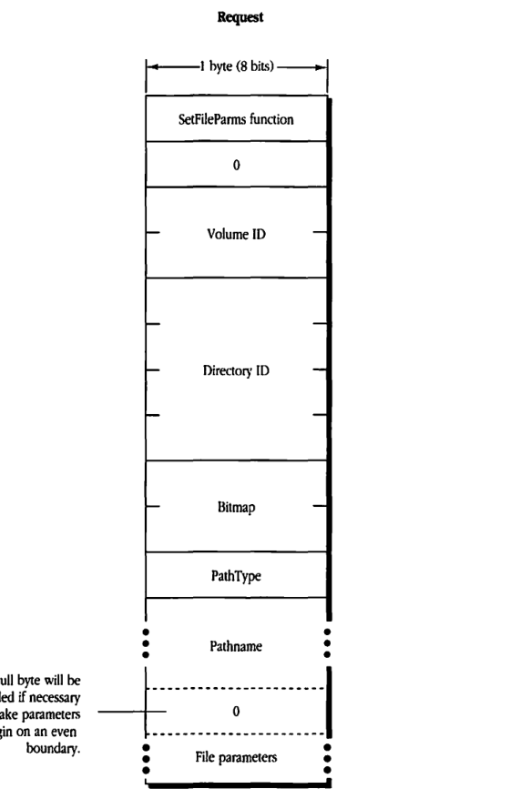

```mermaid
packet-beta
0-7: "SetFileParms function"
8-15: "0"
16-31: "Volume ID"
32-63: "Directory ID"
64-79: "Bitmap"
80-87: "PathType"
88-103: "Pathname (variable)"
104-111: "0 (padding)"
112-127: "File parameters (variable)"
```

| Field | Bit offset | Width (bits) | Description |
|---|---|---|---|
| SetFileParms function | 0 | 8 | The function code for SetFileParms. |
| 0 | 8 | 8 | Reserved; must be 0. |
| Volume ID | 16 | 16 | The identifier for the volume. |
| Directory ID | 32 | 32 | The identifier for the directory. |
| Bitmap | 64 | 16 | A bitmap specifying which parameters to set. |
| PathType | 80 | 8 | The format of the pathname. |
| Pathname | 88 | variable | The pathname of the file or directory. |
| 0 | variable | 0 or 8 | A null byte added if necessary to make parameters begin on an even boundary. |
| File parameters | variable | variable | The parameters to be set as specified by the bitmap. |


## FPSetFileParms

This request sets parameters for a specified file. Text in **boldface** applies to **AFP Version 2.0 only.**

### Inputs

| | |
|---|---|
| *SRefNum (int)* | session refnum |
| *Volume ID (int)* | volume identifier |
| *Directory ID (long)* | ancestor directory identifier |
| *Bitmap (int)* | bitmap describing which parameters are to be set (the bit corresponding to each desired parameter should be set); this field is the same as File Bitmap in the FPGetFileDirParms call |
| *PathType (byte)* | indicates whether Pathname is composed of long names or short names:<br>1 = short names<br>2 = long names |
| *Pathname (string)* | pathname to desired file |
| *File parameters to be set* | |

### Outputs

| | |
|---|---|
| *FPError (long)* | |

### Result codes

| | |
|---|---|
| *ParamErr* | Session refnum, volume identifier, or pathname type is unknown; pathname is null or bad. |
| *ObjectNotFound* | Input parameters do not point to an existing file. |
| *AccessDenied* | User does not have the rights listed below; in AFP 1.1, the volume is ReadOnly. |
| **VolLocked** | **In AFP 2.0, the volume is ReadOnly.** |
| *BitmapErr* | An attempt was made to set a parameter that cannot be set with this call; bitmap is null. |
| *ObjectTypeErr* | Input parameters point to a directory. |


### Algorithm

The FPSetFileParms call sets parameters for a file. The parameters must be packed, in bitmap order, in the request block.

The workstation needs to keep variable-length parameters at the end of the block. In order to do this, variable-length parameters are represented in bitmap order as fixed-length offsets (integers). These offsets are measured from the start of the parameters to the start of the variable-length fields. The actual variable-length fields are then packed after all fixed-length fields.

A null byte must be added between the Pathname and the File Parameters if necessary to make the parameters begin on an even boundary in the block.

The following parameters may be set or cleared: the Attributes (all except **DAlreadyOpen**, **RAlreadyOpen**, and **CopyProtect**), the Creation Date, Modification Date, Backup Date, Finder Info, and **ProDOS Info**.

If the Attributes parameter is included, the Set/Clear bit indicates that the specified attributes are to be either set or cleared (0 equals clear the specified attributes; 1 equals set the specified attributes). Therefore, it is not possible to set some attributes and clear others in the same call.

If this call changes a file's Invisible attribute, the modification date of the file's parent directory will be set to the server's clock. If this call changes a file's Attributes or sets any dates (except modification date), Finder Info, or **ProDOS Info**, the modification date to the file will be set to the server's clock.

### Rights

If the file is empty (both forks are of 0 length), the user must have search or write access to all ancestors, except this file's parent directory, as well as write access to the parent directory. If either fork is not empty, the user must have search access to all ancestors is except the parent directory, as well as read and write access to the parent directory.

### Notes

The user must have previously called FPOpenVol for this volume.

This call cannot be used to set a file's name (use FPRename), parent Directory ID (use FPMoveAndRename), file number, or fork lengths.


### Block format

#### Request

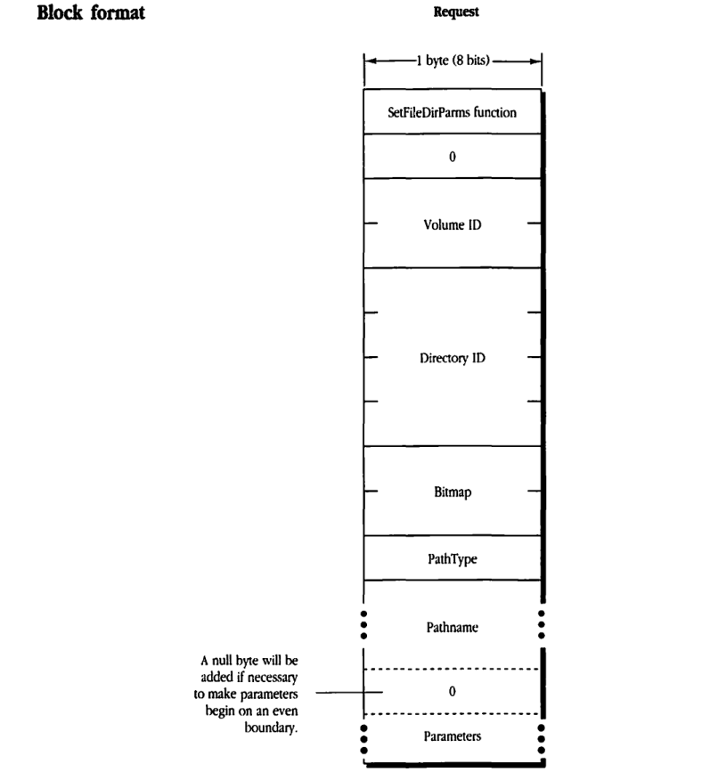

```mermaid
packet-beta
0-7: "SetFileDirParms function"
8-15: "0"
16-31: "Volume ID"
32-63: "Directory ID"
64-79: "Bitmap"
80-87: "PathType"
88-103: "Pathname"
104-111: "0 (padding)"
112-127: "Parameters"
```

| Field | Bit offset | Width (bits) | Description |
| :--- | :--- | :--- | :--- |
| SetFileDirParms function | 0 | 8 | The function code for SetFileDirParms. |
| Reserved | 8 | 8 | Always 0. |
| Volume ID | 16 | 16 | The volume identifier. |
| Directory ID | 32 | 32 | The directory identifier. |
| Bitmap | 64 | 16 | A bitmap specifying which parameters to set. |
| PathType | 80 | 8 | The type of the pathname. |
| Pathname | 88 | Variable | The name of the file or directory. |
| Padding | Variable | 0 or 8 | A null byte will be added if necessary to make parameters begin on an even boundary. |
| Parameters | Variable | Variable | The parameter values to be set, as specified by the bitmap. |

## FPSetForkParms

This request sets the fork length for a specified open fork. Text in **boldface** applies to **AFP Version 2.0 only**.

### Inputs

| Field | Description |
|---|---|
| *SRefNum (int)* | session refnum |
| *OForkRefNum (int)* | open fork refnum |
| *Bitmap (int)* | bitmap describing which parameters are to be set; this field is the same as File Bitmap in the FPGetFileDirParms call; however, only the appropriate Fork Length bit can be set |
| *Fork Length (long)* | new end-of-fork value |

### Outputs

| Field |
|---|
| *FPError (long)* |

### Result codes

| Code | Description |
|---|---|
| *ParamErr* | Session refnum or open fork refnum is unknown. |
| *BitmapErr* | An attempt was made to set a parameter that cannot be set with this call; bitmap is null. |
| *DiskFull* | No more space exists on the volume. |
| *LockErr* | Locked range conflict exists. |
| *AccessDenied* | User does not have the rights listed below; in AFP 1.1, the volume is ReadOnly. |
| ***VolLocked*** | **In AFP 2.0, the volume is ReadOnly.** |

### Algorithm

The Bitmap and Fork Length are passed to the server, which changes the length of the fork specified by OForkRefNum. The server returns a BitmapErr result code if the call tries to set the length of the file's other fork or if it tries to set any other file parameter.

The server returns a LockErr result code if the fork is truncated to eliminate a range or part of a range locked by another user.

### Rights

The fork must be open for write by the user.

### Notes

This call cannot be used to set a file's name (use FPRename), parent directory (use FPMoveAndRename), or file number.

### Block format

#### Request

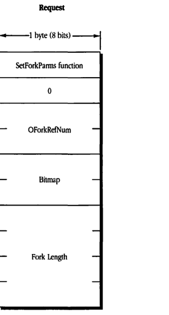

```mermaid
packet-beta
0-7: "SetForkParms function"
8-15: "0"
16-31: "OForkRefNum"
32-47: "Bitmap"
48-79: "Fork Length"
```

| Field | Bit offset | Width (bits) | Description |
|---|---|---|---|
| SetForkParms function | 0 | 8 | The function code for SetForkParms. |
| 0 | 8 | 8 | Reserved; must be 0. |
| OForkRefNum | 16 | 16 | The open fork reference number. |
| Bitmap | 32 | 16 | A bitmap indicating which fork parameters to set. |
| Fork Length | 48 | 32 | The new length for the fork. |


## FPSetVolParms

This request sets the backup date for a specified volume. Text in **boldface** applies to AFP Version 2.0 only.

### Inputs

| | |
| :--- | :--- |
| *SRefNum (int)* | session refnum |
| *Volume ID (int)* | volume identifier |
| *Bitmap (int)* | bitmap describing which parameters are to be set; this field is the same as that in the FPGetVolParms call; however, only the Backup Date bit can be set |
| *Backup Date (long)* | new backup date |

### Outputs

| | |
| :--- | :--- |
| *FPError (long)* | |

### Result codes

| | |
| :--- | :--- |
| *ParamErr* | Session refnum or volume identifier is unknown. |
| *BitmapErr* | An attempt was made to set a parameter that cannot be set with this call; bitmap is null. |
| *AccessDenied* | In AFP 1.1, the volume is ReadOnly. |
| **VolLocked** | **In AFP 2.0, the volume is ReadOnly.** |

### Algorithm

The server changes the backup date for the specified volume.

### Notes

The user must have previously called FPOpenVol for this volume.


### Block format

#### Request

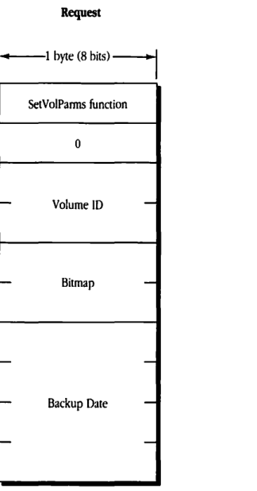

```mermaid
packet-beta
0-7: "SetVolParms function"
8-15: "0"
16-31: "Volume ID"
32-47: "Bitmap"
48-79: "Backup Date"
```

| Field | Bit offset | Width (bits) | Description |
| :--- | :--- | :--- | :--- |
| SetVolParms function | 0 | 8 | The function code for SetVolParms. |
| 0 | 8 | 8 | Reserved; must be zero. |
| Volume ID | 16 | 16 | The identifier of the volume. |
| Bitmap | 32 | 16 | A bitmap indicating which volume parameters to set. |
| Backup Date | 48 | 32 | The backup date and time to be set for the volume. |


## FPWrite

This request writes a block of data to an open fork.

### Inputs

| Field | Type | Description |
| :--- | :--- | :--- |
| SRefNum | (int) | session refnum |
| OForkRefNum | (int) | open fork refnum |
| Offset | (long) | byte offset from the beginning or end of the fork to where the write is to begin (should be negative to indicate a byte within the fork relative to the end of the fork) |
| ReqCount | (long) | number of bytes to be written |
| Start/EndFlag | (bit) | flag indicating whether the Offset field is relative to the beginning or end of the fork:<br>0 = Start (relative to the beginning of the fork)<br>1 = End (relative to the end of the fork) |
| Fork data | | |

### Outputs

| Field | Type | Description |
| :--- | :--- | :--- |
| FPError | (long) | |
| ActCount | (long) | number of bytes actually written to the fork |
| LastWritten | (long) | the number of the byte just past the last byte written |

### Result codes

| Code | Description |
| :--- | :--- |
| ParamErr | Session refnum or open fork refnum is unknown. |
| AccessDenied | User does not have the rights listed below. |
| LockErr | Some or all of requested range is locked by another user. |
| DiskFull | No more space exists on the volume. |

### Algorithm

The Start/EndFlag allows a block of data to be written at an offset relative to the end of the fork. Therefore, data can be written to a fork when the user does not know the exact end of fork, as can happen when multiple writers are concurrently modifying a fork. The server returns the number of the byte just past the last byte written.

The server writes data to the open fork, starting at Offset number of bytes from the beginning or end of the fork. If the block of data to be written extends beyond the end of fork, the fork is extended. If part of the range is locked by another user, the server returns a LockErr result code and does not write any data to the fork.

The file's Modification Date is not changed until the fork is closed.

### Rights

The fork must be open for write access by the user issuing this request.

### Notes

Lock the range before submitting this call. The underlying transport mechanism may force the request to be broken into multiple smaller requests. If the range is not locked when this call begins execution, it is possible for another user to lock some or all of the range before this call completes, causing the write to succeed partially.

The fork data to be written is transmitted to the server in an intermediate exchange of ASP packets.

### Block format

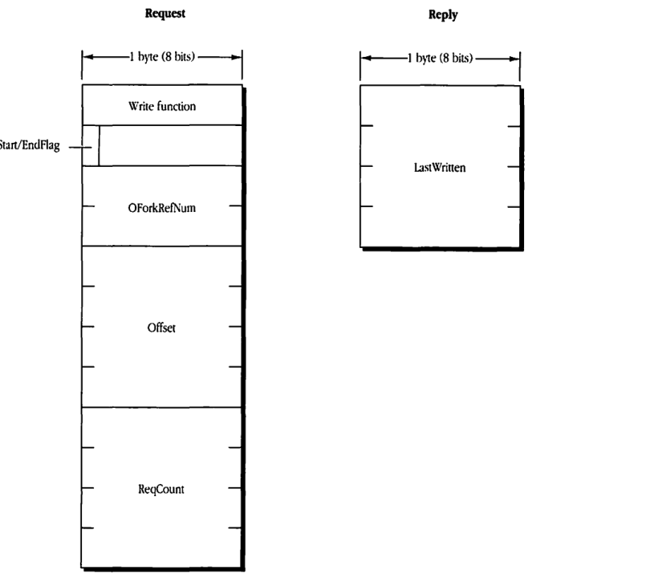

#### Request

```mermaid
packet-beta
0-7: "Write function"
8-15: "Start/EndFlag"
16-31: "OForkRefNum"
32-63: "Offset"
64-95: "ReqCount"
```

| Field | Bit offset | Width (bits) | Description |
|---|---|---|---|
| Write function | 0 | 8 | The function code for FPWrite. |
| Start/EndFlag | 8 | 8 | Flag indicating start and end conditions for the write operation. |
| OForkRefNum | 16 | 16 | The open fork reference number for the fork to be written to. |
| Offset | 32 | 32 | The byte offset within the fork at which to start writing. |
| ReqCount | 64 | 32 | The number of bytes of data to be written. |

#### Reply

```mermaid
packet-beta
0-31: "LastWritten"
```

| Field | Bit offset | Width (bits) | Description |
|---|---|---|---|
| LastWritten | 0 | 32 | The byte offset of the last byte successfully written to the fork. |

