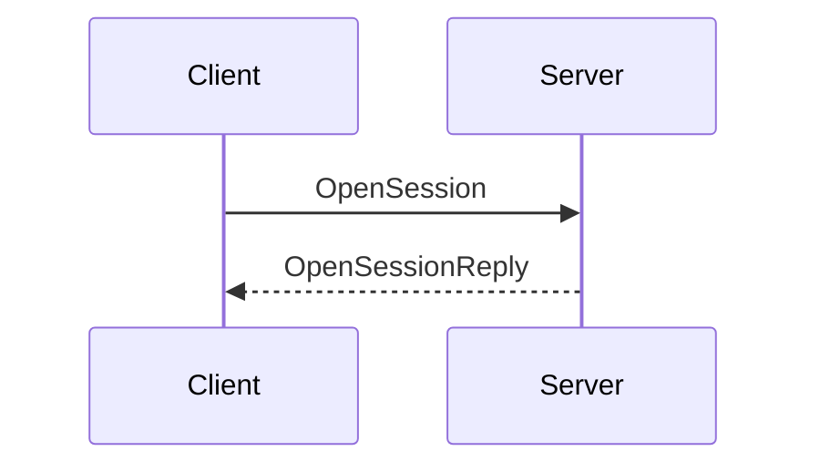

# Contributing to AppleTalk Documentation

Contributions are **warmly welcomed** — especially fixes for OCR errors, formatting
problems, missing sections, or factual corrections. Every improvement, no matter how
small, makes this resource better for everyone.

## What to Contribute

- **OCR corrections** — typos, garbled words, or misread numbers from the scanning process
- **Formatting** — tables, code blocks, diagrams, or lists that didn't survive the OCR
- **Missing content** — pages or sections that are blank or were skipped during conversion
- **Diagram improvements** — better Mermaid diagrams representing protocol flows or data structures
- **Factual clarifications** — errata or updated understanding of how a protocol behaves

## How to Contribute

### 1. Edit directly on GitHub (simplest)

Every page on this site has an **"Edit this page"** link in the top-right corner.
Clicking it opens the source Markdown file directly in GitHub's editor, where you can
make your change and open a Pull Request without ever leaving the browser.

### 2. Fork and clone (for larger changes)

```bash
# Fork the repository on GitHub first, then:
git clone https://github.com/<your-username>/inside-appletalk.git
cd inside-appletalk
```

#### Local development setup

You need [Hugo extended](https://gohugo.io/installation/) (v0.128.0 or newer).

```bash
# Install the theme (one-time setup)
git clone https://github.com/alex-shpak/hugo-book.git themes/hugo-book --depth 1

# Start the live-reload development server
hugo server --buildDrafts
```

Open <http://localhost:1313/appletalk-docs/> in your browser. Changes to any content
file are reflected instantly without restarting the server.

#### Making your changes

Content files live in the `content/` directory and are written in standard Markdown.

```
content/
├── _index.md                          ← Home page
├── contributing.md                    ← This page
└── areas/
    ├── _index.md
    ├── inside-appletalk-second-edition.md
    └── ...
```

#### Mermaid diagrams

Diagrams are written using [Mermaid](https://mermaid.js.org/) syntax inside fenced
code blocks:

````markdown

````

#### Commit and open a Pull Request

```bash
git checkout -b fix/ocr-correction-atp-section
git add content/areas/inside-appletalk-second-edition.md
git commit -m "Fix OCR error in ATP retransmission description"
git push origin fix/ocr-correction-atp-section
```

Then open a Pull Request against the `main` branch on
[github.com/ObsoleteMadness/appletalk-docs](https://github.com/ObsoleteMadness/appletalk-docs).

## Style Guide

- Keep line lengths reasonable (≤ 100 characters where possible) for readable diffs.
- Preserve the original document's structure — headings, section numbers, and figure
  numbers should match the source material.
- When replacing an OCR artefact, add a brief comment in the PR description explaining
  what the original text said and how you determined the correct version.
- Protocol names and acronyms should be formatted consistently:
  `AppleTalk`, `ATP`, `DDP`, `NBP`, `ZIP`, `AFP`, `ASP`, `PAP`, `RTMP`, `AARP`.

## Code of Conduct

Be kind. This is a volunteer project. Reviewers and contributors give their time freely;
please be patient and constructive in all interactions.

## Questions?

Open an [issue](https://github.com/ObsoleteMadness/inside-appletalk/issues) on GitHub —
I'm happy to help.
